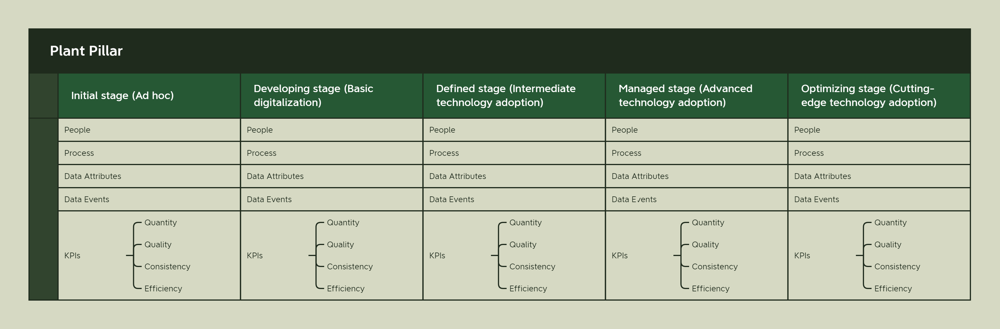

## Introduction

My wife and I started Green Nanny in 2019 with a vision for a better way to grow. Of the two of us, she had far more experience with the growing process, an understanding of plants, and an overall joy that comes from the magical cannabis plant than I did. What I brought to the table was a tenacity for learning new things and more than 25 years of experience in technology. Around this time, the promises and hype for IoT (Internet of Things) and AI (Artificial Intelligence) were at their highest. Combining the two created a whole new technology discipline called Edge Engineering. Edge Engineering allows you to containerize machine learning models trained to do specific tasks that used to be accomplished by humans and deploy them to IoT Edge devices. From the devices, the ML model would use sensors to recognize objects, detect dangerous machine conditions, and make fast, complex decisions that used to be the purview of human operators.

I was beyond excited about the prospects of this technology (I still am, actually), so I reforged my career to focus on this new approach to developing solutions. Our initial goal for Green Nanny was to develop tiny devices that would sit with the plant, monitor every aspect of the plant, and work with a centralized data system to help growers make better decisions about their harvest.

That dream hasn’t entirely died, it’s just evolved and changed over the years. We ran into a number of big problems on our journey:

- The technology wasn't quite there to accomplish some of our goals, and the technology we could afford to use was also unaffordable for our prospective customers. Maybe they could do it for a few plants, but not for every plant in every grow room.
- It's tough to tell an experienced, veteran grower who started when they were a teenager growing in their parents' garage or basement that an algorithm will likely have a better way of growing the plants they spend every day with and know better than most horticulturists.
- And the biggest one, most of the cultivators we talked to were running their operations in a very ad hoc fashion. They did what they needed with information systems to remain compliant with the state, but they didn't collect data or use technology for much else. They didn't even use standard manufacturing process improvement systems like Standard Operating Procedures or Kaizen (Continuous Improvement).

Faced with the harsh reality, we had to shelve our idea for a small device and take a different approach. We needed to build a system that benefits the plant through technology, but doesn't try to do the grower's job for them. In fact, we decided that more than anything, we needed to focus on the relationship between the growers and the plants and start building from there.
### The Birth of GrowerInTheLoop.com

The more you learn about the cannabis plant, the more you realize how miraculous it is. It's not only valuable as a medicinal product, but it could probably replace many of the materials we use to manufacture products we use daily. However, if you're reading this, these are probably facts you're well aware of. Despite all these benefits that the plant brings to humanity, we've somehow done an excellent job of making it out to be the villain. Growers have also been mischaracterized as lazy pot smokers who hide away in basements growing illicit drugs for the local junior high kids.

When you move away from the stereotypes, you discover a world where growers practice an art form. They have learned to take genetic engineering to its extremes, creating specific breeds of plants designed to generate different types of experiences. These "highs" are not accidental. They are created using precise formulas that not only involve the plant's genetics, but also control of the environment where the plants are grown.

Through my own journey of understanding how growers work, how plants mature, how flowering works, and the environmental factors required, I came to the realization that building a single device to help growers was a bit too naive. Technology can certainly assist growers, plants, and consumers, but a more holistic approach to the relationship among the plant, the grower, and the technology is required.

In 2020, I came to the realization that I would never be able to grow on the same scale as my customers. My wife and I even considered purchasing or building our own cultivation facility in Oklahoma, but we quickly discovered that the investment required for equipment and materials, water requirements, commercial electrical connections, local laws and ordinances, and obtaining a state license was too high. We also lacked the necessary growing experience to risk someone else's money. While we had support from family and friends, we ultimately decided to abandon the idea and focus on helping growers rather than competing with them.

Despite this setback, I remained committed to learning about the basics and advanced approaches to growing. Falling in love with something makes it easy to learn everything about it, and I spent a lot of time doing just that.
### An Education in Cannabis

There's nothing quite like working in a real facility to gain an education, and luckily, I've had the opportunity to see real operations from cloning to harvesting to trimming. Clent Baker from Papa Jesus Farms has been a great mentor in this area. And of course, there are other places to get an education, like books. These are some of my favorites:

- *The Cannabis Business Book* by Michael Zaytsev
- *Marijuana Horticulture* by Jorge Cervates
- *The Cannabis Grow Bible* by Greg Green
- *Start Your Own Cannabis Business* by Entrepreneur Media, et al
- *The Lean Farm* by Ben Hartman
- *The Urban Farmer* by Curtis Allen Stone
- *Handbook of Cannabis Production in Controlled Environments* by Youbin Zheng and multiple authors
- *From Seed to Success* by Ryan Douglas
- *Marijuana Botany* by Robert Connell Clarke
- *Agriculture Internet of Things and Decision support for Precision Smart Farming* by a collection of authors

Some of these are not necessarily about growing cannabis, but they do cover the concepts of lean farming or technology in agriculture. And like any good educational endeavor, I have not stopped with these books. Many of the concepts I have used to create the [GrowerInTheLoop.com](http://growerintheloop.com/) approach have come from podcasts, whitepapers, and other industries, such as manufacturing's IIoT 4.0 and Walker Reynolds' Unified Namespace. You will probably also find Green Nanny on social media and cannabis forums where I contribute when I can.

All of this is to say that there is a lot to learn in the cannabis production domain. It is both a new and well-established industry at the same time. There are definitely some hardened opinions among those in the community. I know growers who believe there should be no commercialization of cannabis, but that everyone should grow at home. Then, I know of people who have attempted to start a grow with no experience growing, but lots of funding and the promises of technology to fill in the gaps. All these approaches have met with various levels of success. It was the variation in growers, approaches, and opinions that helped Green Nanny create the product and services umbrella we are calling [GrowerInTheLoop.com](http://growerintheloop.com/).
### The Green Nanny Approach to Everything

I once had a great discussion with an entrepreneur about continuous delivery and market disruption. I won't go into the details of the discussion, but I will share an analogy that I made during our conversation. We were specifically discussing the differences between carriage makers and automobile makers in the early 1900s. His argument was that carriage makers wouldn't have built cars through the continuous improvement process, but would have continued building carriages. This would have made them less viable as a business, as cars basically took over. I argued that this wouldn't be the case if the carriage maker's business goal wasn't just making carriages, but providing the best transportation experience for their customers.

And that's the approach that Green Nanny has taken for our business. Our driving focus is to make it possible for growers to spend more time in the garden with the plants than they spend on technology. It's our test to make sure we're on the right path. Now, if you've never spent any time with a garden of plants, you might not understand why this statement is important. Plants are a joy to be around. There's something magical about working hands-on with plants. Now, I'm fully aware of completely automated systems that manage grows. I haven't seen one in person yet, but I know they exist. And one of my worries has been that the whole process I'm prescribing would, by necessity, take the grower out of the equation. However, I believe that for most growers, that will not be a problem. The GrowerInTheLoop maturity model covers five levels across multiple points, which I'll go into more detail on later, but it's my opinion that most cultivators will find their happy space somewhere around levels two, three, and four. Rarely will someone reach level five in all areas of their development, and that's okay.

What I want to ask myself, and the growers I work with regularly, is this: "Are you getting so wrapped up in technology that you neglect your garden?" If so, then we need to scale back the technology and return to hands-on work with the plants.

It's a people, plants, processes, and technology approach. Although Green Nanny is primarily a technology company, we know where we fit in the hierarchy of cultivation facility needs. If what we provide isn't making life better for the plants, we're doing it wrong. Therefore, our North Star statement is about putting the plants and the growers first, and only bringing in the right amount of technology to improve their lives.
### Why GrowerInTheLoop.com

Maturity models aren’t new to the consulting world. We’ve used them as a means to measure organizational capability, technology adoption, data governance, if you can name it, there’s likely a maturity model for it. Surprisingly, in the cannabis domain, I didn’t find much, but there are definitely approaches recommended in the agriculture and CEA (Controlled Environment Agriculture) domains. I took a look at a number of these proposed maturity models, and felt many were hit-and-miss in the way of usefulness. I’ll touch on a few, give my opinion, and then dive into what I think will work for cannabis cultivators, and specifically indoor grow cultivators. 

*Digital Maturity Assessment Model for Smart Agriculture* by Gizem Ates, Salim Burghli, et al.

This white paper is probably the closest to the [GrowerInTheLoop.com](http://GrowerInTheLoop.com) approach. It even includes a website for farmers to self-evaluate, which is similar to the tool in development from Green Nanny. From the paper, here is it’s goal:

> The main goal of this study to create a digital maturity assessment model for companies which want to prepare a future policy by evaluating their competencies in Smart Agriculture. Producers in the agricultural sector can learn their digital maturity levels by using the proposed evaluation model and analyze how successful they are in terms of Industry 4.0 requirements. By the help of the obtained strategic road maps, they can take advantage of cost and time by completing digital adaptation with more accurate decisions. For the digital maturity assessment model, Industry 4.0 requirements will be revealed both technically and administratively in the agricultural sector. For this purpose, the relevant literature is reviewed and a sustainable list of requirements for sector-environment-human dimensions are created. These requirements are grouped as main and sub-criteria. All criteria created for the digital maturity evaluation model for the agricultural sector are evaluated by using Best-Worst Method (BWM). After applying BWM, the weights of each criteria are figured out and they are used to evaluate the maturity level of each company by applying simple weighted average method. Also, a user friendly web site is designed to let companies easily measure their levels and have opportunity to identify their strong and weak points in the Smart Agriculture process.
> 

My criticism primary comes from the criteria set for the maturity model. I believe the statement, “you can’t improve what you can’t measure,” to be true. I’ve seen it regularly in my technology career. How do you know your software is successful if you have no means to measure its viability. 

This paper’s proposed technology levels seem to be aimed at technology itself, and not necessarily what should be the goal of the technology. I won’t go into details on the Smart Agriculture Technology itself, but some of the areas are Big Data and Machine Learning under Data, Blockchain Technology, and 3D printing. I’m not saying that these areas may not find a usefulness in the cultivation facility, but it seems to be taking the wrong approach from the wrong direction. It’s a technologists view of a problem, and as I technologist I can relate to making this type of mistake. Using Augmented Reality to help you manage your crops might be an excellent use case, but what’s the real value in it? And is there a cheaper way to achieve the same types of outcomes? I don’t feel like the authors asked these questions, but reading the paper did help solidify my own opinions.

*Evaluation of digital maturity for agriculture organizations based on DMPTSC analysis* by Niyaz A. Safiullin, Chulpan M. Kurakova, et al.

This is another white paper focused on the combination of technology and agriculture, but in this case the authors used a standard for measuring maturity called DMPTSC. This was one of the more useful maturity models, and you’ll see I use some of its levels for GrowerInTheLoop.com.

DMPTSC stands for Data Management Planning Tool Self-Assessment Maturity Model, which is a framework for assessing the maturity of data management planning in research organizations. The model consists of six levels, each representing a different stage of maturity in data management planning.

Here are the six levels of the DMPTSC maturity model:

1. Level 1: Ad-hoc - Data management planning is informal, ad-hoc, and uncoordinated.
2. Level 2: Defined - Data management planning is defined and documented, but not widely implemented or consistently followed.
3. Level 3: Managed - Data management planning is managed and monitored, and standards and procedures are established and enforced.
4. Level 4: Integrated - Data management planning is integrated into research workflows and systems, and data management is an integral part of the research process.
5. Level 5: Optimized - Data management planning is continually improved through evaluation and feedback, and best practices are shared and adopted throughout the organization.
6. Level 6: Sustainable - Data management planning is fully embedded in the research culture of the organization, and a culture of continuous improvement is established.

The DMPTSC model helps organizations to identify their current level of maturity in data management planning, and provides guidance on how to improve their practices to reach higher levels of maturity. The model is designed to be flexible and adaptable to the needs of different organizations, and can be used to assess the maturity of data management planning in any research discipline or context.

Interestingly enough, the authors of this paper didn't stick with the common model, but created their own meaning from it. I'm not sure if this was a mix-up or if they just happened to use the same set of letters for their maturity model as another, but theirs looks more like this:

- D = Data utilization
- M = Process Management
- P = Product Management
- S = Personnel Policy (skills?)
- T = End-to-end technology use
- C = Organizational Structure or Culture

From this model, they were able to create a number of different assessments that gave a big picture of the organization's maturity level. Again, these criteria seemed to be useful, and the approach felt more familiar to me because it aligned with many assessment approaches used in the Industry 4.0 consulting world. However, I still felt like it wasn't as useful to cannabis cultivators.

*A Maturity Assessment Model for Digital Twin-Value Stream Technology in Greenhouses* by Helia Norouzi 

Of all the white papers I read, Helia’s Thesis is probably one of the best. There are a few things I’ve taken from this thesis and applied to GrowerInTheLoop.com.

1. It ties the maturity model to a Digital Twin Value stream
2. It focuses on Green Houses (Controlled Environment Agriculture)
3. It applies Lean Manufacturing thinking to the problem of commercially growing plants
4. It remains relatively simple, despite the complexity of commercial agriculture

I’ll discuss how this paper helped to inform the [GrowerInTheLoop.com](http://GrowerInTheLoop.com) concepts. 

**Digital Twin Value Streams (DTVS)**

A Digital Twin Value Stream (DTVS) is a framework used to describe and visualize the digital representation of a physical asset or process. It is a method for creating a virtual model of a product, process, or system, and simulating its behavior in real-time, based on data collected from sensors, machines, and other sources.

The DTVS is a way to capture, analyze, and optimize data flows and processes within the digital twin. It is used to represent the value chain of the digital twin, from data acquisition and processing to data analysis and decision-making. The value stream provides a way to map and optimize data flows, identify bottlenecks, and ensure that data is collected and processed efficiently.

The DTVS includes the following components:

1. Data Acquisition: This is the process of collecting data from sensors, machines, and other sources. The data may be raw or pre-processed.
2. Data Processing: This is the process of cleaning, transforming, and analyzing the data to make it usable. This may involve data normalization, filtering, aggregation, and other techniques.
3. Data Analysis: This is the process of using the data to gain insights and make decisions. This may involve machine learning, statistical analysis, or other techniques.
4. Visualization: This is the process of presenting the data in a meaningful way to stakeholders. This may involve dashboards, reports, or other visualizations.
5. Decision Making: This is the process of using the insights gained from the data to make informed decisions. This may involve automated decision-making systems or human decision-makers.

This isn't necessarily the traditional definition of a digital twin, and in fact, I wouldn't even use the term "digital twin" here. I would just call this an object that represents a real-world object. But I think the benefit that this brings to the model is that it ties data points specifically to what I would call the "Object Under Observation." This comes into play with greater clarity when I discuss how this factors into the [GrowerInTheLoop.com](http://growerintheloop.com/) maturity model. One of the insights I gained from this paper is that the area under review for maturity assessment needs to tie to a value stream and produce data to make it measurable. In a sense, I started to determine that I needed a better set of requirements for the [GrowerInTheLoop.com](http://growerintheloop.com/) maturity model. They needed to be simple, yet still effective and measurably effective.

Helia created a simple model, and I think it's effective. I didn't lift-and-shift this exact model for cannabis cultivators for reasons I'll go into later, but it's worth examining. It's made up of the following parts:

- Building Block
- Building Block Weight in the measurements of the overall score
- Dimension - each weight has a set of dimensions that contribute to the overall score
- Individual Dimension Scores - a fraction of the overall dimensional score
- Submitted Score by surveyed
- Dimension Maturity Score
- Maturity Score
- Overall Maturity Score

Helia also covered these primary areas for the overall maturity assessment:

- Vision
- Culture
- Risk Management Approach
- Decision-Making Approach
- Production Processes
- Crop Protection Processes
- Value Chain Processes
- Process Integration
- Skills & Competence
- Technology Capabilities

I think these are all interesting places to focus, especially for greenhouse agriculture. However, I feel like this model is more aligned with Industry 4.0. As great as Helia's thesis is (and I do think it's a great read), it wasn't feeling quite correct to me.

<aside>
 Is an indoor grow a factory? Is cannabis just a commodity product produced like a car, or can of soda?

</aside>

While studying these maturity models and learning how others have approached this problem, I recognized something about myself that I didn’t see in these other approaches. I love the plants. I love the plant’s lifecycle. I love the process. I know horticulture is a science, but it’s also an art. There is aesthetic beauty in a well-maintained canopy. A mature bud under a microscope is a wonderland. 

What I didn’t want [GrowerInTheLoop.com](http://GrowerInTheLoop.com) to be was just another maturity model based on the regular elements of Industry 4.0. For one thing, there are many ways to grow great cannabis and many places to do it. Though it’s challenging to get it right, you can grow great flower outdoors in a field. Hoop-houses, green houses, tents, and of course the traditional indoor grows are places where growers grow. I didn’t want the GrowerInTheLoop.com to necessarily exclude any particular grower. 

What solidified this thinking for me was a set of videos put out by HVAC company. I’m talking about Inspire Transpiration Solutions that creates Integrated HVACD systems. It was while watching one of their YouTube videos on the Ten Cardinal Parameters of Plant Health and Vitality that the shape of the maturity model began to take shape in my mind. 

**Why not create a maturity model that is entirely plant focused?**

In my opinion, the best maturity models tend to focus on people, processes, and technology. If you are familiar with the DevOps movement in technology, that will ring true, because DevOps is a practice built on people, processes, and technology in that order. However, what I found as I began to focus on putting the plant first, is that the people, processes, and technology began to come into play for the elements I explored for the cannabis lifecycle. Plants could be the focus of a maturity model, and with the plants as the primary focus, everything else either fits into the model or isn’t that important to begin with.

Basically, I feel like I have discovered the Pareto principle for cannabis. By focusing on the 20% of the causes, I can get 80% of the effects. Sure, there may be areas that the maturity model doesn't cover, but are they important?

It was through all this research and thinking that it became clear to me that the cannabis cultivation world could not only use a maturity model, but one that was decidedly different from others. We need a model that doesn't approach cultivation as if it were cranking out pickup trucks or cans of beer. We need something that puts the thing we care about the most first. We need a plant-first approach to measuring our cultivation's success.

This isn't to say that I don't believe these other approaches have no value. I've taken a look at the cannabis consulting competition, and the approaches range from basic process automation to practicing lean engineering. I believe all of these are excellent ways to improve a facility's operations. I believe that [GrowerInTheLoop.com](http://growerintheloop.com/) offers an approach that is not only compatible with traditional consulting practices, but also superior. By adopting the right type of technology for your facility, it brings a measurable approach to improving your operations. I think you'll agree with me.
## Why Use Maturity Models

Before I dive into the details of the [GrowerInTheLoop.com](http://GrowerInTheLoop.com) maturity model, I want to discuss why a maturity model is good for cannabis cultivators and why it’s good for consulting companies, like Green Nanny. I think it’s important for us to get on the same level, so I’ll try to explain a maturity model as though we’re both kids. 

A maturity model is like a measuring stick for how well you do something. Just like a measuring stick can show how tall you are, a maturity model can show how good you are at doing something. It helps you understand where you are now and how you can get better.

For example, let's say you want to learn how to play soccer. A maturity model for soccer might have different levels, like beginner, intermediate, and expert. If you are just starting out, you might be at the beginner level, where you are learning the basic skills like passing and shooting. As you practice more and get better, you can move up to the intermediate level, where you learn more advanced skills like dribbling and tactics. And if you keep practicing and become really good, you might reach the expert level, where you can play at a very high level and maybe even become a professional soccer player.

A maturity model is useful because it helps you understand where you are on the path to becoming good at something. It gives you a clear roadmap for how to get better and helps you see progress along the way. Just like a measuring stick can help you see how much you've grown, a maturity model can help you see how much you've improved in your skills.

With that in mind, I want to make it clear that the [GrowerInTheLoop.com](http://GrowerInTheLoop.com)’s maturity model isn’t a judgement. You aren’t a bad cultivator if you score a level one across multiple blocks. Nor are you great or excellent because you score a five. These numbers only have meaning to you and where you are on your journey.

That’s one of the reasons why maturity models are an excellent approach. They allow me the consultant and you the grower to approach your business on a level playing field. And as a consultant who works with cultivators regularly, I can focus on the processes and technology that have helped other cultivators move from one level of maturity to another. 

**What are some of the critiques of Maturity Models?**

I want to address some of the criticism that you’ll hear about maturity models, before I dive into the reasons why you would want to use it as a tool for your organization. I’ll discuss how Green Nanny mitigates some of these issues with our overall approach.

1. One-Size-Fits-All Approach: Maturity models are often designed to be used across different organizations or industries, which means they may not be tailored to your specific business needs. This could result in a lack of alignment between your goals and the maturity model's framework.
    1. Green Nanny recognizes this and has developed [GrowerInTheLoop.com](http://GrowerInTheLoop.com) specifically for the cannabis grower with a focus primarily on the plant. As you’ll see when we dive into the specifics on the maturity model framework we’ve developed, there’s nothing generic about our approach. It is designed specifically for cannabis cultivators of any size and can fit any number of desired business outcomes within the cannabis industry.
2. Overemphasis on Process: Maturity models can place too much emphasis on processes and standards, which can stifle innovation and creativity. Overly rigid processes can also hinder the ability to adapt quickly to changes in the market or industry.
    1. Because the legal marijuana industry is regulated by the states where it can be legally sold and consumed, we recognize that rigid processes can get in the way of innovation. However, our processes and systems are designed to ignite innovation at each level. We do provide suggested paths for technology use, but we aren’t tied to one single solution. If you need a big data platform to fulfill your desired business outcomes, we’ll help you build it. However, if a lower code solution, like an excel workbook helps take you to the next level, we can work with that. Our goal is not to lock you in, but to free you from technology burdens. 
3. Resource Intensive: Implementing a maturity model can be resource-intensive, requiring significant time, effort, and cost to develop, implement, and maintain. This can divert resources away from other important business activities.
    1. This violates our prime directive. Star Trek jokes aside, I’ve been a consultant for enough years to see these types of implementations. These aren’t typically designed to help you progress as a business, but to fill the pockets of consulting companies. Yes, there are those of us out there in the consulting world who are only focused on billable hours. And we also understand that a cultivator’s purpose is to cultivate. Plants need care and attention. They won’t get that if you’re stuck in weeklong workshops on process improvement. Which is why we design our solutions around you, your process, and your people. We’re interested in small, incremental change, with emphasis on measurable outcomes. 
4. Complexity: Maturity models can be complex and difficult to understand, especially for employees who are not familiar with the framework. This can result in confusion and resistance to change.
    1. This is why Green Nanny created [GrowerInTheLoop.com](http://GrowerInTheLoop.com) to be plant centric. Cannabis is at the center of every part of our solution. If you understand the cannabis lifecycle, our approach won’t be hard to understand or learn. 
5. Limited Focus: Maturity models are often focused on a specific area of the business, such as IT or quality management. This limited focus may not provide a holistic view of the business or take into account the interconnectedness of different processes and functions.
    1. This is true of [GrowerInTheLoop.com](http://GrowerInTheLoop.com). It’s probably not going to improve your HR department, marketing attempts, or do a lot for your dispensary (if you have one). GrowerInTheLoop.com has intentionally limited its scope to improvements around the cannabis plant lifecycle. This may intentionally exclude some areas of your business. However, it may improve others that you hadn’t considered, like inventory management, standard operating procedures, and brand reputation. Again, we look at focusing on the plant as a means of achieving the 80/20 rule. The majority of the positive outcomes are created from greater focus on twenty percent of the efforts. We see the best investment of those efforts on the plant and the plant lifecycle. 
6. Time-consuming: Using a maturity model can be time-consuming, requiring a significant amount of effort to gather data and assess processes. This can be especially challenging for small or resource-constrained businesses.
    1. This is where Green Nanny is most helpful. We’re creating services and solutions that make it easier to see your measurable results. The maturity model itself, actually has its own data model. With our help, we can connect your cultivation facility to a platform to help measure the success of your journey. This is covered more in this document, but we have a platform that we believe is perfect for cultivators and fits directly into the [GrowerInTheLoop.com](http://GrowerInTheLoop.com) approach. But here’s the great news. You don’t have to use the platform to get measurable value from the maturity model framework.

As you can see, there are many reasons not to use a maturity model, but we feel that the good far outweighs the bad. For Green Nanny, this is one of the best ways to get to know where you are as a cultivator, understand where you want to be, and to help provide the right kind of products, services, and systems to get you there.

**Now that we’ve looked at the negatives, let’s see the positives.**

1. Measurable Progress: A maturity model provides a clear framework for assessing the maturity of different processes or practices within your organization. This allows you to measure progress over time and track improvements.
    1. Green Nanny and [GrowerInTheLoop.com](http://GrowerInTheLoop.com) offer a few different ways to manage this. GrowerInTheLoop.com will produce a generic roadmap based on how to get from one level to another for a particular plant pillar. This is an excellent guide for many cultivators. GrowerInTheLoop.com will even provide additional products to help you achieve this. However, if you need hands-on guidance, Green Nanny has specific implementation workshops to help you through the process. And Green Nanny provides clear pricing based on these workshops and implementation help that falls under our tiered approach to pricing. We want to offer you the best help that you need to accomplish your business outcomes.
2. Identifying Areas of Improvement: By using a maturity model, you can identify areas where your organization needs to improve. This can help you prioritize resources and focus on the areas that will have the greatest impact on your business.
    1. Our Plant Pillar model covers fourteen possible areas where you may need to improve. These are covered later, but the idea is that based on any one of these areas, you can create a practice of improvement that will be measurable, not only at the plant level, but at the organization level using the [GrowerInTheLoop.com](http://GrowerInTheLoop.com) base KPIs.
3. Best Practices: A maturity model typically incorporates best practices and standards for a particular process or practice. By following these practices, you can improve the quality and efficiency of your operations.
    1. In this area, [GrowerInTheLoop.com](http://GrowerInTheLoop.com) is a bit more fluid than some maturity models. We will definitely recommend approaches, but we firmly believe that “Best” practices are built within the organization from actual practices. You won’t really know what the “Best Practices” are for your team and facility until you start practicing something. So we’ll recommend paths to start, and then support you when you begin to develop what works best for you. 
4. Benchmarking: A maturity model can be used to benchmark your organization against industry standards or best practices. This can help you identify areas where you are lagging behind your competitors and make changes to catch up.
    1. This is often seen as a positive to some organizations, but Green Nanny doesn’t necessarily agree that this is as important as many people think. Sure, knowing where you align with your competition might help you make some strategic decisions, but at the end of the day the main cultivation facility you need to focus on competing with is your own. And [GrowerInTheLoop.com](http://GrowerInTheLoop.com) can help you do that. By regularly reviewing your progress, seeing results measured and reported, and by getting positive feedback from your staff and customers, you’ll know you’re meeting the benchmarks you need to meet. 
5. Consistency: A maturity model provides a consistent approach to assessing and improving processes or practices within your organization. This can help ensure that everyone is working towards the same goals and following the same standards.
    1. [GrowerInTheLoop.com](http://GrowerInTheLoop.com) and Green Nanny put a high priority on consistency. It’s one of the harder things to achieve in cannabis cultivation. It’s even one of our primary KPIs. We consider this a value business outcome, because a cultivator can achieve brand recognition from a consistent product. Have you ever drank a Budweiser in Tokyo? It tastes just like a Budweiser in Dallas. You may not like Budweiser, but no matter where you go, when you order one, it will taste the same.
6. Continuous Improvement: A maturity model encourages continuous improvement by providing a roadmap for moving from one level of maturity to the next. This can help ensure that your organization is always striving to improve and stay ahead of the competition.
    1. Green Nanny has built [GrowerInTheLoop.com](http://GrowerInTheLoop.com) on the principle that steady growth, steady improvement, and a sustainable approach to cultivation with a focus on the plant lifecycle will improve quantity, quality, consistency, and efficiency leading to greater profitability, compliance with regulators, and a happier patients. We’re firmly onboard with helping cultivators practice continuous improvement.

You should now know why Green Nanny developed GrowerInTheLoop.com’s maturity model framework. We see it as a win-win umbrella of products and services. You, as the cultivator can build a roadmap based on your primary product, the cannabis plant. We, as the consultants, can provide products and services that help you on your journey that are just enough for where you are and where you want to go. If you think this is an equitable approach and you would like to learn more, be sure to read the next section on how we designed the Maturity Model Framework.
## The Basic Blocks of the Maturity Model Framework

Before we dive into the substance of the [GrowerInTheLoop.com](http://GrowerInTheLoop.com) maturity model framework, I want to discuss how it’s actually used. It’s important to understand that we have a basic model framework and it looks a bit like this:

Green Nanny considers this the basic Maturity Model Framework. We’ve selected this schema, because it allows us to consistently represent different stages, but also act on those stages as though they are an active data model. In this section I’ll break down the different parts and explain what they mean.
### The Plant Pillar

Right now there are fourteen different plant pillars. This could change over time with newer versions of the Maturity Model Framework, but we believe we’ve captured the primary essence of what the plant needs to flourish under the care of a grower.

1. Temperature:
    - Temperature control is important for indoor cannabis growth, and the ideal temperature range varies depending on the stage of growth. The temperature range should be between 68-77°F during the day and 62-72°F at night.
2. VPD:
    - VPD, or vapor pressure deficit, is a measure of the humidity in the grow room. Maintaining the correct VPD is important for optimal plant growth and development. The ideal VPD range is between 0.8-1.3 kPa during the vegetative stage and 1.3-1.8 kPa during the flowering stage.
3. Carbon Dioxide:
    - Carbon dioxide (CO2) is essential for plant growth, and indoor growers often supplement the air with additional CO2 to increase plant growth rates. The ideal CO2 level for cannabis growth is between 1000-1500 ppm.
4. Radiation or Lighting:
    - Light is a crucial factor in indoor cannabis growth. The use of HID (High-Intensity Discharge) lamps is recommended for optimal growth and yields, but LED may be preferred based on your region and budget. The ideal light spectrum for cannabis growth is between 400-700 nm, which is the range of light that plants use for photosynthesis.
5. Air distribution:
    - Air circulation and distribution are important to maintain fresh air and prevent the buildup of humidity, which can lead to mold growth. Fans and exhaust systems can be used to circulate air and maintain proper airflow.
6. Water:
    - Water is an essential component of cannabis growth, and growers should ensure that their plants receive adequate water throughout the growing process. Overwatering and underwatering should be avoided.
7. Nutrition and Fertilization:
    - Proper nutrition and fertilization are crucial for cannabis growth. Nutrient deficiencies or excesses can cause stunted growth or reduced yields. Growers should use fertilizers designed for cannabis plants and follow recommended feeding schedules.
8. Irrigation and Fertigation:
    - Irrigation and fertigation systems are important for consistent watering and fertilization of plants. Automatic systems can be used to deliver water and nutrients at regular intervals.
9. Growing Media:
    - Choosing the right growing media is important for cannabis growth. Soil, coco coir, and hydroponic systems are all viable options. Growers should ensure that the growing media has adequate drainage and nutrient-holding capacity.
10. Beneficial Microorganisms:
    - Beneficial microorganisms can be used to enhance plant growth and protect against pests and diseases. These microorganisms can be added to the growing media or applied as foliar sprays.
11. Oxygen and Oxygenation:
    - Oxygen is essential for root health, and growers should ensure that their plants receive adequate oxygenation. Air stones and other oxygenation systems can be used to increase oxygen levels in hydroponic systems.
12. Rootzone care:
    - Rootzone care is essential for plant growth, and growers should ensure that their plants have adequate room to grow and develop healthy root systems. Regular pruning and transplanting can be used to promote healthy root growth.
13. Canopy Management:
    - Canopy management involves controlling the height and width of the plant canopy to promote optimal growth and yield. Techniques such as topping, pruning, and training can be used to manage the canopy.
14. Diseases and Pest control:
    - Indoor cannabis plants are susceptible to pests and diseases, and growers should take measures to prevent and control infestations. Integrated pest management (IPM) strategies, such as using beneficial insects and applying organic pesticides, can be effective in controlling pests and diseases.
### Maturity Stages

For each of the plant pillars, we break them down into maturity stages. This isn’t the maturity of the plant, but the maturity by which the grower or facility approaches this area of care. This is broken down more, but for illustration here is the best way to think of these levels of maturity applied to an overall cultivation facility:

1. Initial stage (Ad hoc):
    - In this stage, cannabis cultivators have little or no technology adoption. Processes are primarily manual, and there's limited use of digital tools for tracking and managing cultivation. Data collection and analysis are also minimal or non-existent.
2. Developing stage (Basic digitalization):
    - At this stage, cultivators begin to adopt basic digital tools, such as spreadsheets and simple software applications, for tracking cultivation processes and managing their business. Data collection is more organized, but data analysis capabilities are still limited.
3. Defined stage (Intermediate technology adoption):
    - Cannabis cultivators in this stage have implemented more sophisticated technology solutions, such as integrated cultivation management systems, sensors, and automation tools. Data analysis is more advanced, and cultivators start to use data-driven insights for decision-making.
4. Managed stage (Advanced technology adoption):
    - In this stage, cultivators have embraced advanced technologies like IoT, artificial intelligence, and machine learning to optimize their cultivation processes. They are using data analytics and predictive modeling to make strategic decisions, and there's a strong focus on continuous improvement and innovation.
5. Optimizing stage (Cutting-edge technology adoption):
    - At the highest level of maturity, cultivators are leveraging cutting-edge technologies like robotics, advanced AI, and blockchain for supply chain management. They continuously innovate and optimize their processes, staying at the forefront of the industry.
### People

This section provides an example of what to expect from people at a particular maturity level. For example, if a facility's maturity level in caring for plants with regard to disease and pest control is ad hoc, you might expect growers to visually inspect plants for signs of pests or powdery mildew, or maybe only react after they’ve seen signs of disease. A more mature approach might involve monitoring the air filtration system for spores or insects, or use computer vision to inspect leaves. People will always play a part in the plant growth cycle and provide some care based on a plant's needs, but the level and type of care will vary depending on the grower's choices and the maturity stage of the facility.
### Process

Much like the above, the process section describes the common processes and procedures at this stage. You can expect to see more manual processes in the Ad hoc stage and more automated processes in the Defined or Managed stages. Additionally, more advanced techniques may be applied at different stages. 

It’s important to note that you may occasionally see People and Process overlap in the maturity model. That’s normal, because people are usually committing the actions that the processes describe. We don’t see them as duplicate data though. We find it valuable to describe the process, and then describe how people complete the process. 
### Data Attributes

Basically, this is the data schema for this particular plant pillar. Depending on the maturity stage, this could be just a few basic attributes on a table or multiple data models. And this is one area where we encourage customization. We will suggest a great set of starting values, but as you continue your data maturity journey, you’ll want to make these models as rich as necessary to meet your business objectives. When we speak of the “state” of the data, we’re typically talking about this data in its most up-to-date form. 
### Data Events

Almost every activity around the plant lifecycle is an event. If you can attach a date and time to some type of action, we consider that an events. We like to capture events. Over time, we can use events to improve efficiency, processes, and even learn how to better grow plants. Events are often used to update the Data Attributes, keeping those values as recent as possible, but we maintain a history of events. Like a bank ledger, we can return to any date and see that state of that attribute. This is a more technical concept that I won’t dive into deeply here, but I will state that there are many valuable reasons to collect data this way, because as the system grows, these events and the data associated with them, will be the training data we need to create more intelligent systems. 
### KPIs

We have four basic KPIs that we follow. They are Quantity, Quality, Consistency, and Efficiency. 

1. Quantity: The quantity of cannabis produced is a critical KPI because it determines the revenue potential of the facility. The more cannabis produced, the higher the potential revenue. This will depend on factors such as square footage, plant density, yield, and cultivation methods used. By optimizing these factors, growers can increase the quantity of cannabis they produce and improve their bottom line.
2. Quality: Quality is important because it directly affects customer satisfaction and loyalty. Consumers are willing to pay more for high-quality cannabis, and a facility that consistently produces high-quality products will have an advantage in the market. This can be influenced by factors such as strain selection, cultivation methods, and environmental conditions. By focusing on quality, growers can differentiate themselves in the market and command higher prices for their products.
3. Consistency: Consistency is important because it helps build a reputation for the facility. Consumers expect consistent quality and effects from a specific strain, and if a facility can consistently produce cannabis with the desired qualities, it can build a loyal customer base. This can be influenced by factors such as environmental control, cultivation methods, and genetics.
4. Efficiency: Efficiency is important because it directly impacts the cost of production. A facility that can produce more cannabis with the same resources (e.g., energy, labor, water) is more profitable than one that can't. This can be influenced by factors such as energy consumption, labor costs, and yield. By improving efficiency, growers can reduce their costs and improve their profit margins.

These KPIs are interrelated because they all contribute to the overall success of the facility. For example, improving efficiency can lead to an increase in quantity, while improving quality can lead to an increase in customer loyalty and therefore quantity. Consistency is important for maintaining the quality of the product and building a loyal customer base, which can increase quantity over time.

In lower levels of the maturity model it’s often difficult to calculate these KPIs. Most facilities aren’t capturing enough data to do it. We have recommended partners who provide advanced reporting capabilities for state mandated compliance systems like METRC, but one of the issues they’ve seen is that growers will put in the bare minimum of the data needed. This means that the reports aren’t accurate, and therefore, not that useful. Moving up the maturity model, you’ll see that accurately capturing data, and making that data actionable, are a big part of the journey. You can’t measure what you can’t see. And if you aren’t capturing data, you won’t have any way to measure your progress. 

To capture data for these KPIs, there are several automated ways a cannabis cultivation facility can use:

1. Environmental sensors: These can capture data on temperature, humidity, and light levels in the facility, which can help optimize plant growth and improve consistency.
2. Yield tracking software: This can track the yield of each plant and help identify areas where improvements can be made to increase quantity and efficiency.
3. Quality control software: This can capture data on the chemical and physical properties of the cannabis, helping to maintain consistency and improve quality.
4. Energy monitoring systems: These can track energy consumption and identify areas where efficiency can be improved.

By using these automated data capture tools, a cannabis cultivation facility can have a more accurate and real-time understanding of their KPIs. This can help them make informed decisions to optimize their operations and ultimately improve their bottom line.
### The Assessment Cycle

This diagram shows how the steps in the process are connected in a circular flow, where the output of the last step leads back to the first step. The process starts with a maturity assessment, followed by finding the gaps, prioritizing the gaps, creating a plan to overcome the gaps, and implementing a program to overcome the gaps. Once the program is implemented, the process starts again with a new maturity assessment. This cycle is designed to continually improve the maturity level of the cannabis cultivation facility.

Unlike many prescribed maturity models, [GrowerInTheLoop.com](http://GrowerInTheLoop.com) is a bit more flexible when it comes to implementation of the model. If you’re familiar with the concept of process model fidelity, we hold loosely to our fidelity. The Maturity Model is a guide, a possible path to success, but we don’t necessarily prescribe that each step needs to be followed completely. What we do is generate possible plans based on your scores for the self-assessment. Once you complete the GrowerInTheLoop.com self assessment, we’ll generate a report for you with a complete plan that you can share with your IT team. We’ll cover this in greater detail later.