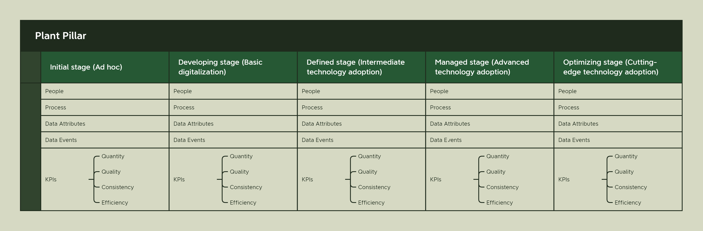

# GrowerInTheLoop.com Approach to Cannabis Cultivation Maturity Assessment

## Introduction

My wife and I started Green Nanny in 2019 with a vision for a better way to grow. Of the two of us, she had far more experience with the growing process, an understanding of plants, and an overall joy that comes from the magical cannabis plant than I did. What I brought to the table was a tenacity for learning new things and more than 25 years of experience in technology. Around this time, the promises and hype for IoT (Internet of Things) and AI (Artificial Intelligence) were at their highest. Combining the two created a whole new technology discipline called Edge Engineering. Edge Engineering allows you to containerize machine learning models trained to do specific tasks that used to be accomplished by humans and deploy them to IoT Edge devices. From the devices, the ML model would use sensors to recognize objects, detect dangerous machine conditions, and make fast, complex decisions that used to be the purview of human operators.

I was beyond excited about the prospects of this technology (I still am, actually), so I reforged my career to focus on this new approach to developing solutions. Our initial goal for Green Nanny was to develop tiny devices that would sit with the plant, monitor every aspect of the plant, and work with a centralized data system to help growers make better decisions about their harvest.

That dream hasn’t entirely died, it’s just evolved and changed over the years. We ran into a number of big problems on our journey:

- The technology wasn't quite there to accomplish some of our goals, and the technology we could afford to use was also unaffordable for our prospective customers. Maybe they could do it for a few plants, but not for every plant in every grow room.
- It's tough to tell an experienced, veteran grower who started when they were a teenager growing in their parents' garage or basement that an algorithm will likely have a better way of growing the plants they spend every day with and know better than most horticulturists.
- And the biggest one, most of the cultivators we talked to were running their operations in a very ad hoc fashion. They did what they needed with information systems to remain compliant with the state, but they didn't collect data or use technology for much else. They didn't even use standard manufacturing process improvement systems like Standard Operating Procedures or Kaizen (Continuous Improvement).

Faced with the harsh reality, we had to shelve our idea for a small device and take a different approach. We needed to build a system that benefits the plant through technology, but doesn't try to do the grower's job for them. In fact, we decided that more than anything, we needed to focus on the relationship between the growers and the plants and start building from there.

### The Birth of GrowerInTheLoop.com

The more you learn about the cannabis plant, the more you realize how miraculous it is. It's not only valuable as a medicinal product, but it could probably replace many of the materials we use to manufacture products we use daily. However, if you're reading this, these are probably facts you're well aware of. Despite all these benefits that the plant brings to humanity, we've somehow done an excellent job of making it out to be the villain. Growers have also been mischaracterized as lazy pot smokers who hide away in basements growing illicit drugs for the local junior high kids.

When you move away from the stereotypes, you discover a world where growers practice an art form. They have learned to take genetic engineering to its extremes, creating specific breeds of plants designed to generate different types of experiences. These "highs" are not accidental. They are created using precise formulas that not only involve the plant's genetics, but also control of the environment where the plants are grown.

Through my own journey of understanding how growers work, how plants mature, how flowering works, and the environmental factors required, I came to the realization that building a single device to help growers was a bit too naive. Technology can certainly assist growers, plants, and consumers, but a more holistic approach to the relationship among the plant, the grower, and the technology is required.

In 2020, I came to the realization that I would never be able to grow on the same scale as my customers. My wife and I even considered purchasing or building our own cultivation facility in Oklahoma, but we quickly discovered that the investment required for equipment and materials, water requirements, commercial electrical connections, local laws and ordinances, and obtaining a state license was too high. We also lacked the necessary growing experience to risk someone else's money. While we had support from family and friends, we ultimately decided to abandon the idea and focus on helping growers rather than competing with them.

Despite this setback, I remained committed to learning about the basics and advanced approaches to growing. Falling in love with something makes it easy to learn everything about it, and I spent a lot of time doing just that.

### An Education in Cannabis

There's nothing quite like working in a real facility to gain an education, and luckily, I've had the opportunity to see real operations from cloning to harvesting to trimming. Clint Baker from Papa Jesus Farms has been a great mentor in this area. And of course, there are other places to get an education, like books. These are some of my favorites:

- *The Cannabis Business Book* by Michael Zaytsev
- *Marijuana Horticulture* by Jorge Cervates
- *The Cannabis Grow Bible* by Greg Green
- *Start Your Own Cannabis Business* by Entrepreneur Media, et al
- *The Lean Farm* by Ben Hartman
- *The Urban Farmer* by Curtis Allen Stone
- *Handbook of Cannabis Production in Controlled Environments* by Youbin Zheng and multiple authors
- *From Seed to Success* by Ryan Douglas
- *Marijuana Botany* by Robert Connell Clarke
- *Agriculture Internet of Things and Decision support for Precision Smart Farming* by a collection of authors

Some of these are not necessarily about growing cannabis, but they do cover the concepts of lean farming or technology in agriculture. And like any good educational endeavor, I have not stopped with these books. Many of the concepts I have used to create the [GrowerInTheLoop.com](http://growerintheloop.com/) approach have come from podcasts, whitepapers, and other industries, such as manufacturing's IIoT 4.0 and Walker Reynolds' Unified Namespace. You will probably also find Green Nanny on social media and cannabis forums where I contribute when I can.

All of this is to say that there is a lot to learn in the cannabis production domain. It is both a new and well-established industry at the same time. There are definitely some hardened opinions among those in the community. I know growers who believe there should be no commercialization of cannabis, but that everyone should grow at home. Then, I know of people who have attempted to start a grow with no experience growing, but lots of funding and the promises of technology to fill in the gaps. All these approaches have met with various levels of success. It was the variation in growers, approaches, and opinions that helped Green Nanny create the product and services umbrella we are calling [GrowerInTheLoop.com](http://growerintheloop.com/).

### The Green Nanny Approach to Everything

I once had a great discussion with an entrepreneur about continuous delivery and market disruption. I won't go into the details of the discussion, but I will share an analogy that I made during our conversation. We were specifically discussing the differences between carriage makers and automobile makers in the early 1900s. His argument was that carriage makers wouldn't have built cars through the continuous improvement process, but would have continued building carriages. This would have made them less viable as a business, as cars basically took over. I argued that this wouldn't be the case if the carriage maker's business goal wasn't just making carriages, but providing the best transportation experience for their customers.

And that's the approach that Green Nanny has taken for our business. Our driving focus is to make it possible for growers to spend more time in the garden with the plants than they spend on technology. It's our test to make sure we're on the right path. Now, if you've never spent any time with a garden of plants, you might not understand why this statement is important. Plants are a joy to be around. There's something magical about working hands-on with plants. Now, I'm fully aware of completely automated systems that manage grows. I haven't seen one in person yet, but I know they exist. And one of my worries has been that the whole process I'm prescribing would, by necessity, take the grower out of the equation. However, I believe that for most growers, that will not be a problem. The GrowerInTheLoop maturity model covers five levels across multiple points, which I'll go into more detail on later, but it's my opinion that most cultivators will find their happy space somewhere around levels two, three, and four. Rarely will someone reach level five in all areas of their development, and that's okay.

What I want to ask myself, and the growers I work with regularly, is this: "Are you getting so wrapped up in technology that you neglect your garden?" If so, then we need to scale back the technology and return to hands-on work with the plants.

It's a people, plants, processes, and technology approach. Although Green Nanny is primarily a technology company, we know where we fit in the hierarchy of cultivation facility needs. If what we provide isn't making life better for the plants, we're doing it wrong. Therefore, our North Star statement is about putting the plants and the growers first, and only bringing in the right amount of technology to improve their lives.

### Why GrowerInTheLoop.com

Maturity models aren’t new to the consulting world. We’ve used them as a means to measure organizational capability, technology adoption, data governance, if you can name it, there’s likely a maturity model for it. Surprisingly, in the cannabis domain, I didn’t find much, but there are definitely approaches recommended in the agriculture and CEA (Controlled Environment Agriculture) domains. I took a look at a number of these proposed maturity models, and felt many were hit-and-miss in the way of usefulness. I’ll touch on a few, give my opinion, and then dive into what I think will work for cannabis cultivators, and specifically indoor grow cultivators. 

*Digital Maturity Assessment Model for Smart Agriculture* by Gizem Ates, Salim Burghli, et al.

This white paper is probably the closest to the [GrowerInTheLoop.com](http://GrowerInTheLoop.com) approach. It even includes a website for farmers to self-evaluate, which is similar to the tool in development from Green Nanny. From the paper, here is it’s goal:

> The main goal of this study to create a digital maturity assessment model for companies which want to prepare a future policy by evaluating their competencies in Smart Agriculture. Producers in the agricultural sector can learn their digital maturity levels by using the proposed evaluation model and analyze how successful they are in terms of Industry 4.0 requirements. By the help of the obtained strategic road maps, they can take advantage of cost and time by completing digital adaptation with more accurate decisions. For the digital maturity assessment model, Industry 4.0 requirements will be revealed both technically and administratively in the agricultural sector. For this purpose, the relevant literature is reviewed and a sustainable list of requirements for sector-environment-human dimensions are created. These requirements are grouped as main and sub-criteria. All criteria created for the digital maturity evaluation model for the agricultural sector are evaluated by using Best-Worst Method (BWM). After applying BWM, the weights of each criteria are figured out and they are used to evaluate the maturity level of each company by applying simple weighted average method. Also, a user friendly web site is designed to let companies easily measure their levels and have opportunity to identify their strong and weak points in the Smart Agriculture process.
> 

My criticism primary comes from the criteria set for the maturity model. I believe the statement, “you can’t improve what you can’t measure,” to be true. I’ve seen it regularly in my technology career. How do you know your software is successful if you have no means to measure its viability. 

This paper’s proposed technology levels seem to be aimed at technology itself, and not necessarily what should be the goal of the technology. I won’t go into details on the Smart Agriculture Technology itself, but some of the areas are Big Data and Machine Learning under Data, Blockchain Technology, and 3D printing. I’m not saying that these areas may not find a usefulness in the cultivation facility, but it seems to be taking the wrong approach from the wrong direction. It’s a technologists view of a problem, and as I technologist I can relate to making this type of mistake. Using Augmented Reality to help you manage your crops might be an excellent use case, but what’s the real value in it? And is there a cheaper way to achieve the same types of outcomes? I don’t feel like the authors asked these questions, but reading the paper did help solidify my own opinions.

*Evaluation of digital maturity for agriculture organizations based on DMPTSC analysis* by Niyaz A. Safiullin, Chulpan M. Kurakova, et al.

This is another white paper focused on the combination of technology and agriculture, but in this case the authors used a standard for measuring maturity called DMPTSC. This was one of the more useful maturity models, and you’ll see I use some of its levels for GrowerInTheLoop.com.

DMPTSC stands for Data Management Planning Tool Self-Assessment Maturity Model, which is a framework for assessing the maturity of data management planning in research organizations. The model consists of six levels, each representing a different stage of maturity in data management planning.

Here are the six levels of the DMPTSC maturity model:

1. Level 1: Ad-hoc - Data management planning is informal, ad-hoc, and uncoordinated.
2. Level 2: Defined - Data management planning is defined and documented, but not widely implemented or consistently followed.
3. Level 3: Managed - Data management planning is managed and monitored, and standards and procedures are established and enforced.
4. Level 4: Integrated - Data management planning is integrated into research workflows and systems, and data management is an integral part of the research process.
5. Level 5: Optimized - Data management planning is continually improved through evaluation and feedback, and best practices are shared and adopted throughout the organization.
6. Level 6: Sustainable - Data management planning is fully embedded in the research culture of the organization, and a culture of continuous improvement is established.

The DMPTSC model helps organizations to identify their current level of maturity in data management planning, and provides guidance on how to improve their practices to reach higher levels of maturity. The model is designed to be flexible and adaptable to the needs of different organizations, and can be used to assess the maturity of data management planning in any research discipline or context.

Interestingly enough, the authors of this paper didn't stick with the common model, but created their own meaning from it. I'm not sure if this was a mix-up or if they just happened to use the same set of letters for their maturity model as another, but theirs looks more like this:

- D = Data utilization
- M = Process Management
- P = Product Management
- S = Personnel Policy (skills?)
- T = End-to-end technology use
- C = Organizational Structure or Culture

From this model, they were able to create a number of different assessments that gave a big picture of the organization's maturity level. Again, these criteria seemed to be useful, and the approach felt more familiar to me because it aligned with many assessment approaches used in the Industry 4.0 consulting world. However, I still felt like it wasn't as useful to cannabis cultivators.

*A Maturity Assessment Model for Digital Twin-Value Stream Technology in Greenhouses* by Helia Norouzi 

Of all the white papers I read, Helia’s Thesis is probably one of the best. There are a few things I’ve taken from this thesis and applied to GrowerInTheLoop.com.

1. It ties the maturity model to a Digital Twin Value stream
2. It focuses on Green Houses (Controlled Environment Agriculture)
3. It applies Lean Manufacturing thinking to the problem of commercially growing plants
4. It remains relatively simple, despite the complexity of commercial agriculture

I’ll discuss how this paper helped to inform the [GrowerInTheLoop.com](http://GrowerInTheLoop.com) concepts. 

**Digital Twin Value Streams (DTVS)**

A Digital Twin Value Stream (DTVS) is a framework used to describe and visualize the digital representation of a physical asset or process. It is a method for creating a virtual model of a product, process, or system, and simulating its behavior in real-time, based on data collected from sensors, machines, and other sources.

The DTVS is a way to capture, analyze, and optimize data flows and processes within the digital twin. It is used to represent the value chain of the digital twin, from data acquisition and processing to data analysis and decision-making. The value stream provides a way to map and optimize data flows, identify bottlenecks, and ensure that data is collected and processed efficiently.

The DTVS includes the following components:

1. Data Acquisition: This is the process of collecting data from sensors, machines, and other sources. The data may be raw or pre-processed.
2. Data Processing: This is the process of cleaning, transforming, and analyzing the data to make it usable. This may involve data normalization, filtering, aggregation, and other techniques.
3. Data Analysis: This is the process of using the data to gain insights and make decisions. This may involve machine learning, statistical analysis, or other techniques.
4. Visualization: This is the process of presenting the data in a meaningful way to stakeholders. This may involve dashboards, reports, or other visualizations.
5. Decision Making: This is the process of using the insights gained from the data to make informed decisions. This may involve automated decision-making systems or human decision-makers.

This isn't necessarily the traditional definition of a digital twin, and in fact, I wouldn't even use the term "digital twin" here. I would just call this an object that represents a real-world object. But I think the benefit that this brings to the model is that it ties data points specifically to what I would call the "Object Under Observation." This comes into play with greater clarity when I discuss how this factors into the [GrowerInTheLoop.com](http://growerintheloop.com/) maturity model. One of the insights I gained from this paper is that the area under review for maturity assessment needs to tie to a value stream and produce data to make it measurable. In a sense, I started to determine that I needed a better set of requirements for the [GrowerInTheLoop.com](http://growerintheloop.com/) maturity model. They needed to be simple, yet still effective and measurably effective.

Helia created a simple model, and I think it's effective. I didn't lift-and-shift this exact model for cannabis cultivators for reasons I'll go into later, but it's worth examining. It's made up of the following parts:

- Building Block
- Building Block Weight in the measurements of the overall score
- Dimension - each weight has a set of dimensions that contribute to the overall score
- Individual Dimension Scores - a fraction of the overall dimensional score
- Submitted Score by surveyed
- Dimension Maturity Score
- Maturity Score
- Overall Maturity Score

Helia also covered these primary areas for the overall maturity assessment:

- Vision
- Culture
- Risk Management Approach
- Decision-Making Approach
- Production Processes
- Crop Protection Processes
- Value Chain Processes
- Process Integration
- Skills & Competence
- Technology Capabilities

I think these are all interesting places to focus, especially for greenhouse agriculture. However, I feel like this model is more aligned with Industry 4.0. As great as Helia's thesis is (and I do think it's a great read), it wasn't feeling quite correct to me.

<aside>
 Is an indoor grow a factory? Is cannabis just a commodity product produced like a car, or can of soda?

</aside>

While studying these maturity models and learning how others have approached this problem, I recognized something about myself that I didn’t see in these other approaches. I love the plants. I love the plant’s lifecycle. I love the process. I know horticulture is a science, but it’s also an art. There is aesthetic beauty in a well-maintained canopy. A mature bud under a microscope is a wonderland. 

What I didn’t want [GrowerInTheLoop.com](http://GrowerInTheLoop.com) to be was just another maturity model based on the regular elements of Industry 4.0. For one thing, there are many ways to grow great cannabis and many places to do it. Though it’s challenging to get it right, you can grow great flower outdoors in a field. Hoop-houses, green houses, tents, and of course the traditional indoor grows are places where growers grow. I didn’t want the GrowerInTheLoop.com to necessarily exclude any particular grower. 

What solidified this thinking for me was a set of videos put out by HVAC company. I’m talking about Inspire Transpiration Solutions that creates Integrated HVACD systems. It was while watching one of their YouTube videos on the Ten Cardinal Parameters of Plant Health and Vitality that the shape of the maturity model began to take shape in my mind. 

**Why not create a maturity model that is entirely plant focused?**

In my opinion, the best maturity models tend to focus on people, processes, and technology. If you are familiar with the DevOps movement in technology, that will ring true, because DevOps is a practice built on people, processes, and technology in that order. However, what I found as I began to focus on putting the plant first, is that the people, processes, and technology began to come into play for the elements I explored for the cannabis lifecycle. Plants could be the focus of a maturity model, and with the plants as the primary focus, everything else either fits into the model or isn’t that important to begin with.

Basically, I feel like I have discovered the Pareto principle for cannabis. By focusing on the 20% of the causes, I can get 80% of the effects. Sure, there may be areas that the maturity model doesn't cover, but are they important?

It was through all this research and thinking that it became clear to me that the cannabis cultivation world could not only use a maturity model, but one that was decidedly different from others. We need a model that doesn't approach cultivation as if it were cranking out pickup trucks or cans of beer. We need something that puts the thing we care about the most first. We need a plant-first approach to measuring our cultivation's success.

This isn't to say that I don't believe these other approaches have no value. I've taken a look at the cannabis consulting competition, and the approaches range from basic process automation to practicing lean engineering. I believe all of these are excellent ways to improve a facility's operations. I believe that [GrowerInTheLoop.com](http://growerintheloop.com/) offers an approach that is not only compatible with traditional consulting practices, but also superior. By adopting the right type of technology for your facility, it brings a measurable approach to improving your operations. I think you'll agree with me.

## Why Use Maturity Models

Before I dive into the details of the [GrowerInTheLoop.com](http://GrowerInTheLoop.com) maturity model, I want to discuss why a maturity model is good for cannabis cultivators and why it’s good for consulting companies, like Green Nanny. I think it’s important for us to get on the same level, so I’ll try to explain a maturity model as though we’re both kids. 

A maturity model is like a measuring stick for how well you do something. Just like a measuring stick can show how tall you are, a maturity model can show how good you are at doing something. It helps you understand where you are now and how you can get better.

For example, let's say you want to learn how to play soccer. A maturity model for soccer might have different levels, like beginner, intermediate, and expert. If you are just starting out, you might be at the beginner level, where you are learning the basic skills like passing and shooting. As you practice more and get better, you can move up to the intermediate level, where you learn more advanced skills like dribbling and tactics. And if you keep practicing and become really good, you might reach the expert level, where you can play at a very high level and maybe even become a professional soccer player.

A maturity model is useful because it helps you understand where you are on the path to becoming good at something. It gives you a clear roadmap for how to get better and helps you see progress along the way. Just like a measuring stick can help you see how much you've grown, a maturity model can help you see how much you've improved in your skills.

With that in mind, I want to make it clear that the [GrowerInTheLoop.com](http://GrowerInTheLoop.com)’s maturity model isn’t a judgement. You aren’t a bad cultivator if you score a level one across multiple blocks. Nor are you great or excellent because you score a five. These numbers only have meaning to you and where you are on your journey.

That’s one of the reasons why maturity models are an excellent approach. They allow me the consultant and you the grower to approach your business on a level playing field. And as a consultant who works with cultivators regularly, I can focus on the processes and technology that have helped other cultivators move from one level of maturity to another. 

**What are some of the critiques of Maturity Models?**

I want to address some of the criticism that you’ll hear about maturity models, before I dive into the reasons why you would want to use it as a tool for your organization. I’ll discuss how Green Nanny mitigates some of these issues with our overall approach.

1. One-Size-Fits-All Approach: Maturity models are often designed to be used across different organizations or industries, which means they may not be tailored to your specific business needs. This could result in a lack of alignment between your goals and the maturity model's framework.
    1. Green Nanny recognizes this and has developed [GrowerInTheLoop.com](http://GrowerInTheLoop.com) specifically for the cannabis grower with a focus primarily on the plant. As you’ll see when we dive into the specifics on the maturity model framework we’ve developed, there’s nothing generic about our approach. It is designed specifically for cannabis cultivators of any size and can fit any number of desired business outcomes within the cannabis industry.
2. Overemphasis on Process: Maturity models can place too much emphasis on processes and standards, which can stifle innovation and creativity. Overly rigid processes can also hinder the ability to adapt quickly to changes in the market or industry.
    1. Because the legal marijuana industry is regulated by the states where it can be legally sold and consumed, we recognize that rigid processes can get in the way of innovation. However, our processes and systems are designed to ignite innovation at each level. We do provide suggested paths for technology use, but we aren’t tied to one single solution. If you need a big data platform to fulfill your desired business outcomes, we’ll help you build it. However, if a lower code solution, like an excel workbook helps take you to the next level, we can work with that. Our goal is not to lock you in, but to free you from technology burdens. 
3. Resource Intensive: Implementing a maturity model can be resource-intensive, requiring significant time, effort, and cost to develop, implement, and maintain. This can divert resources away from other important business activities.
    1. This violates our prime directive. Star Trek jokes aside, I’ve been a consultant for enough years to see these types of implementations. These aren’t typically designed to help you progress as a business, but to fill the pockets of consulting companies. Yes, there are those of us out there in the consulting world who are only focused on billable hours. And we also understand that a cultivator’s purpose is to cultivate. Plants need care and attention. They won’t get that if you’re stuck in weeklong workshops on process improvement. Which is why we design our solutions around you, your process, and your people. We’re interested in small, incremental change, with emphasis on measurable outcomes. 
4. Complexity: Maturity models can be complex and difficult to understand, especially for employees who are not familiar with the framework. This can result in confusion and resistance to change.
    1. This is why Green Nanny created [GrowerInTheLoop.com](http://GrowerInTheLoop.com) to be plant centric. Cannabis is at the center of every part of our solution. If you understand the cannabis lifecycle, our approach won’t be hard to understand or learn. 
5. Limited Focus: Maturity models are often focused on a specific area of the business, such as IT or quality management. This limited focus may not provide a holistic view of the business or take into account the interconnectedness of different processes and functions.
    1. This is true of [GrowerInTheLoop.com](http://GrowerInTheLoop.com). It’s probably not going to improve your HR department, marketing attempts, or do a lot for your dispensary (if you have one). GrowerInTheLoop.com has intentionally limited its scope to improvements around the cannabis plant lifecycle. This may intentionally exclude some areas of your business. However, it may improve others that you hadn’t considered, like inventory management, standard operating procedures, and brand reputation. Again, we look at focusing on the plant as a means of achieving the 80/20 rule. The majority of the positive outcomes are created from greater focus on twenty percent of the efforts. We see the best investment of those efforts on the plant and the plant lifecycle. 
6. Time-consuming: Using a maturity model can be time-consuming, requiring a significant amount of effort to gather data and assess processes. This can be especially challenging for small or resource-constrained businesses.
    1. This is where Green Nanny is most helpful. We’re creating services and solutions that make it easier to see your measurable results. The maturity model itself, actually has its own data model. With our help, we can connect your cultivation facility to a platform to help measure the success of your journey. This is covered more in this document, but we have a platform that we believe is perfect for cultivators and fits directly into the [GrowerInTheLoop.com](http://GrowerInTheLoop.com) approach. But here’s the great news. You don’t have to use the platform to get measurable value from the maturity model framework.

As you can see, there are many reasons not to use a maturity model, but we feel that the good far outweighs the bad. For Green Nanny, this is one of the best ways to get to know where you are as a cultivator, understand where you want to be, and to help provide the right kind of products, services, and systems to get you there.

**Now that we’ve looked at the negatives, let’s see the positives.**

1. Measurable Progress: A maturity model provides a clear framework for assessing the maturity of different processes or practices within your organization. This allows you to measure progress over time and track improvements.
    1. Green Nanny and [GrowerInTheLoop.com](http://GrowerInTheLoop.com) offer a few different ways to manage this. GrowerInTheLoop.com will produce a generic roadmap based on how to get from one level to another for a particular plant pillar. This is an excellent guide for many cultivators. GrowerInTheLoop.com will even provide additional products to help you achieve this. However, if you need hands-on guidance, Green Nanny has specific implementation workshops to help you through the process. And Green Nanny provides clear pricing based on these workshops and implementation help that falls under our tiered approach to pricing. We want to offer you the best help that you need to accomplish your business outcomes.
2. Identifying Areas of Improvement: By using a maturity model, you can identify areas where your organization needs to improve. This can help you prioritize resources and focus on the areas that will have the greatest impact on your business.
    1. Our Plant Pillar model covers fourteen possible areas where you may need to improve. These are covered later, but the idea is that based on any one of these areas, you can create a practice of improvement that will be measurable, not only at the plant level, but at the organization level using the [GrowerInTheLoop.com](http://GrowerInTheLoop.com) base KPIs.
3. Best Practices: A maturity model typically incorporates best practices and standards for a particular process or practice. By following these practices, you can improve the quality and efficiency of your operations.
    1. In this area, [GrowerInTheLoop.com](http://GrowerInTheLoop.com) is a bit more fluid than some maturity models. We will definitely recommend approaches, but we firmly believe that “Best” practices are built within the organization from actual practices. You won’t really know what the “Best Practices” are for your team and facility until you start practicing something. So we’ll recommend paths to start, and then support you when you begin to develop what works best for you. 
4. Benchmarking: A maturity model can be used to benchmark your organization against industry standards or best practices. This can help you identify areas where you are lagging behind your competitors and make changes to catch up.
    1. This is often seen as a positive to some organizations, but Green Nanny doesn’t necessarily agree that this is as important as many people think. Sure, knowing where you align with your competition might help you make some strategic decisions, but at the end of the day the main cultivation facility you need to focus on competing with is your own. And [GrowerInTheLoop.com](http://GrowerInTheLoop.com) can help you do that. By regularly reviewing your progress, seeing results measured and reported, and by getting positive feedback from your staff and customers, you’ll know you’re meeting the benchmarks you need to meet. 
5. Consistency: A maturity model provides a consistent approach to assessing and improving processes or practices within your organization. This can help ensure that everyone is working towards the same goals and following the same standards.
    1. [GrowerInTheLoop.com](http://GrowerInTheLoop.com) and Green Nanny put a high priority on consistency. It’s one of the harder things to achieve in cannabis cultivation. It’s even one of our primary KPIs. We consider this a value business outcome, because a cultivator can achieve brand recognition from a consistent product. Have you ever drank a Budweiser in Tokyo? It tastes just like a Budweiser in Dallas. You may not like Budweiser, but no matter where you go, when you order one, it will taste the same.
6. Continuous Improvement: A maturity model encourages continuous improvement by providing a roadmap for moving from one level of maturity to the next. This can help ensure that your organization is always striving to improve and stay ahead of the competition.
    1. Green Nanny has built [GrowerInTheLoop.com](http://GrowerInTheLoop.com) on the principle that steady growth, steady improvement, and a sustainable approach to cultivation with a focus on the plant lifecycle will improve quantity, quality, consistency, and efficiency leading to greater profitability, compliance with regulators, and a happier patients. We’re firmly onboard with helping cultivators practice continuous improvement.

You should now know why Green Nanny developed GrowerInTheLoop.com’s maturity model framework. We see it as a win-win umbrella of products and services. You, as the cultivator can build a roadmap based on your primary product, the cannabis plant. We, as the consultants, can provide products and services that help you on your journey that are just enough for where you are and where you want to go. If you think this is an equitable approach and you would like to learn more, be sure to read the next section on how we designed the Maturity Model Framework.

## The Basic Blocks of the Maturity Model Framework

Before we dive into the substance of the [GrowerInTheLoop.com](http://GrowerInTheLoop.com) maturity model framework, I want to discuss how it’s actually used. It’s important to understand that we have a basic model framework and it looks a bit like this:

Green Nanny considers this the basic Maturity Model Framework. We’ve selected this schema, because it allows us to consistently represent different stages, but also act on those stages as though they are an active data model. In this section I’ll break down the different parts and explain what they mean.

### The Plant Pillar

Right now there are fourteen different plant pillars. This could change over time with newer versions of the Maturity Model Framework, but we believe we’ve captured the primary essence of what the plant needs to flourish under the care of a grower.

1. Temperature:
    - Temperature control is important for indoor cannabis growth, and the ideal temperature range varies depending on the stage of growth. The temperature range should be between 68-77°F during the day and 62-72°F at night.
2. VPD:
    - VPD, or vapor pressure deficit, is a measure of the humidity in the grow room. Maintaining the correct VPD is important for optimal plant growth and development. The ideal VPD range is between 0.8-1.3 kPa during the vegetative stage and 1.3-1.8 kPa during the flowering stage.
3. Carbon Dioxide:
    - Carbon dioxide (CO2) is essential for plant growth, and indoor growers often supplement the air with additional CO2 to increase plant growth rates. The ideal CO2 level for cannabis growth is between 1000-1500 ppm.
4. Radiation or Lighting:
    - Light is a crucial factor in indoor cannabis growth. The use of HID (High-Intensity Discharge) lamps is recommended for optimal growth and yields, but LED may be preferred based on your region and budget. The ideal light spectrum for cannabis growth is between 400-700 nm, which is the range of light that plants use for photosynthesis.
5. Air distribution:
    - Air circulation and distribution are important to maintain fresh air and prevent the buildup of humidity, which can lead to mold growth. Fans and exhaust systems can be used to circulate air and maintain proper airflow.
6. Water:
    - Water is an essential component of cannabis growth, and growers should ensure that their plants receive adequate water throughout the growing process. Overwatering and underwatering should be avoided.
7. Nutrition and Fertilization:
    - Proper nutrition and fertilization are crucial for cannabis growth. Nutrient deficiencies or excesses can cause stunted growth or reduced yields. Growers should use fertilizers designed for cannabis plants and follow recommended feeding schedules.
8. Irrigation and Fertigation:
    - Irrigation and fertigation systems are important for consistent watering and fertilization of plants. Automatic systems can be used to deliver water and nutrients at regular intervals.
9. Growing Media:
    - Choosing the right growing media is important for cannabis growth. Soil, coco coir, and hydroponic systems are all viable options. Growers should ensure that the growing media has adequate drainage and nutrient-holding capacity.
10. Beneficial Microorganisms:
    - Beneficial microorganisms can be used to enhance plant growth and protect against pests and diseases. These microorganisms can be added to the growing media or applied as foliar sprays.
11. Oxygen and Oxygenation:
    - Oxygen is essential for root health, and growers should ensure that their plants receive adequate oxygenation. Air stones and other oxygenation systems can be used to increase oxygen levels in hydroponic systems.
12. Rootzone care:
    - Rootzone care is essential for plant growth, and growers should ensure that their plants have adequate room to grow and develop healthy root systems. Regular pruning and transplanting can be used to promote healthy root growth.
13. Canopy Management:
    - Canopy management involves controlling the height and width of the plant canopy to promote optimal growth and yield. Techniques such as topping, pruning, and training can be used to manage the canopy.
14. Diseases and Pest control:
    - Indoor cannabis plants are susceptible to pests and diseases, and growers should take measures to prevent and control infestations. Integrated pest management (IPM) strategies, such as using beneficial insects and applying organic pesticides, can be effective in controlling pests and diseases.

### Maturity Stages

For each of the plant pillars, we break them down into maturity stages. This isn’t the maturity of the plant, but the maturity by which the grower or facility approaches this area of care. This is broken down more, but for illustration here is the best way to think of these levels of maturity applied to an overall cultivation facility:

1. Initial stage (Ad hoc):
    - In this stage, cannabis cultivators have little or no technology adoption. Processes are primarily manual, and there's limited use of digital tools for tracking and managing cultivation. Data collection and analysis are also minimal or non-existent.
2. Developing stage (Basic digitalization):
    - At this stage, cultivators begin to adopt basic digital tools, such as spreadsheets and simple software applications, for tracking cultivation processes and managing their business. Data collection is more organized, but data analysis capabilities are still limited.
3. Defined stage (Intermediate technology adoption):
    - Cannabis cultivators in this stage have implemented more sophisticated technology solutions, such as integrated cultivation management systems, sensors, and automation tools. Data analysis is more advanced, and cultivators start to use data-driven insights for decision-making.
4. Managed stage (Advanced technology adoption):
    - In this stage, cultivators have embraced advanced technologies like IoT, artificial intelligence, and machine learning to optimize their cultivation processes. They are using data analytics and predictive modeling to make strategic decisions, and there's a strong focus on continuous improvement and innovation.
5. Optimizing stage (Cutting-edge technology adoption):
    - At the highest level of maturity, cultivators are leveraging cutting-edge technologies like robotics, advanced AI, and blockchain for supply chain management. They continuously innovate and optimize their processes, staying at the forefront of the industry.

### People

This section provides an example of what to expect from people at a particular maturity level. For example, if a facility's maturity level in caring for plants with regard to disease and pest control is ad hoc, you might expect growers to visually inspect plants for signs of pests or powdery mildew, or maybe only react after they’ve seen signs of disease. A more mature approach might involve monitoring the air filtration system for spores or insects, or use computer vision to inspect leaves. People will always play a part in the plant growth cycle and provide some care based on a plant's needs, but the level and type of care will vary depending on the grower's choices and the maturity stage of the facility.

### Process

Much like the above, the process section describes the common processes and procedures at this stage. You can expect to see more manual processes in the Ad hoc stage and more automated processes in the Defined or Managed stages. Additionally, more advanced techniques may be applied at different stages. 

It’s important to note that you may occasionally see People and Process overlap in the maturity model. That’s normal, because people are usually committing the actions that the processes describe. We don’t see them as duplicate data though. We find it valuable to describe the process, and then describe how people complete the process. 

### Data Attributes

Basically, this is the data schema for this particular plant pillar. Depending on the maturity stage, this could be just a few basic attributes on a table or multiple data models. And this is one area where we encourage customization. We will suggest a great set of starting values, but as you continue your data maturity journey, you’ll want to make these models as rich as necessary to meet your business objectives. When we speak of the “state” of the data, we’re typically talking about this data in its most up-to-date form. 

### Data Events

Almost every activity around the plant lifecycle is an event. If you can attach a date and time to some type of action, we consider that an events. We like to capture events. Over time, we can use events to improve efficiency, processes, and even learn how to better grow plants. Events are often used to update the Data Attributes, keeping those values as recent as possible, but we maintain a history of events. Like a bank ledger, we can return to any date and see that state of that attribute. This is a more technical concept that I won’t dive into deeply here, but I will state that there are many valuable reasons to collect data this way, because as the system grows, these events and the data associated with them, will be the training data we need to create more intelligent systems. 

### KPIs

We have four basic KPIs that we follow. They are Quantity, Quality, Consistency, and Efficiency. 

1. Quantity: The quantity of cannabis produced is a critical KPI because it determines the revenue potential of the facility. The more cannabis produced, the higher the potential revenue. This will depend on factors such as square footage, plant density, yield, and cultivation methods used. By optimizing these factors, growers can increase the quantity of cannabis they produce and improve their bottom line.
2. Quality: Quality is important because it directly affects customer satisfaction and loyalty. Consumers are willing to pay more for high-quality cannabis, and a facility that consistently produces high-quality products will have an advantage in the market. This can be influenced by factors such as strain selection, cultivation methods, and environmental conditions. By focusing on quality, growers can differentiate themselves in the market and command higher prices for their products.
3. Consistency: Consistency is important because it helps build a reputation for the facility. Consumers expect consistent quality and effects from a specific strain, and if a facility can consistently produce cannabis with the desired qualities, it can build a loyal customer base. This can be influenced by factors such as environmental control, cultivation methods, and genetics.
4. Efficiency: Efficiency is important because it directly impacts the cost of production. A facility that can produce more cannabis with the same resources (e.g., energy, labor, water) is more profitable than one that can't. This can be influenced by factors such as energy consumption, labor costs, and yield. By improving efficiency, growers can reduce their costs and improve their profit margins.

These KPIs are interrelated because they all contribute to the overall success of the facility. For example, improving efficiency can lead to an increase in quantity, while improving quality can lead to an increase in customer loyalty and therefore quantity. Consistency is important for maintaining the quality of the product and building a loyal customer base, which can increase quantity over time.

In lower levels of the maturity model it’s often difficult to calculate these KPIs. Most facilities aren’t capturing enough data to do it. We have recommended partners who provide advanced reporting capabilities for state mandated compliance systems like METRC, but one of the issues they’ve seen is that growers will put in the bare minimum of the data needed. This means that the reports aren’t accurate, and therefore, not that useful. Moving up the maturity model, you’ll see that accurately capturing data, and making that data actionable, are a big part of the journey. You can’t measure what you can’t see. And if you aren’t capturing data, you won’t have any way to measure your progress. 

To capture data for these KPIs, there are several automated ways a cannabis cultivation facility can use:

1. Environmental sensors: These can capture data on temperature, humidity, and light levels in the facility, which can help optimize plant growth and improve consistency.
2. Yield tracking software: This can track the yield of each plant and help identify areas where improvements can be made to increase quantity and efficiency.
3. Quality control software: This can capture data on the chemical and physical properties of the cannabis, helping to maintain consistency and improve quality.
4. Energy monitoring systems: These can track energy consumption and identify areas where efficiency can be improved.

By using these automated data capture tools, a cannabis cultivation facility can have a more accurate and real-time understanding of their KPIs. This can help them make informed decisions to optimize their operations and ultimately improve their bottom line.

### The Assessment Cycle

This diagram shows how the steps in the process are connected in a circular flow, where the output of the last step leads back to the first step. The process starts with a maturity assessment, followed by finding the gaps, prioritizing the gaps, creating a plan to overcome the gaps, and implementing a program to overcome the gaps. Once the program is implemented, the process starts again with a new maturity assessment. This cycle is designed to continually improve the maturity level of the cannabis cultivation facility.

Unlike many prescribed maturity models, [GrowerInTheLoop.com](http://GrowerInTheLoop.com) is a bit more flexible when it comes to implementation of the model. If you’re familiar with the concept of process model fidelity, we hold loosely to our fidelity. The Maturity Model is a guide, a possible path to success, but we don’t necessarily prescribe that each step needs to be followed completely. What we do is generate possible plans based on your scores for the self-assessment. Once you complete the GrowerInTheLoop.com self assessment, we’ll generate a report for you with a complete plan that you can share with your IT team. We’ll cover this in greater detail later.

### The Value Offer from [GrowerInTheLoop.com](http://GrowerInTheLoop.com) and Green Nanny

# The Model

---

| Plant Pillars | Initial Stage (Ad hoc) | Developing Stage (Basic Digitalization) | Defined Stage (Intermediate Technology Adoption) | Managed Stage (Advanced Technology Adoption) | Optimizing Stage (Cutting-edge Technology Adoption) |
| --- | --- | --- | --- | --- | --- |
| 1. Temperature |  https://www.notion.so/Initial-Stage-Ad-hoc-for-Temperature-0e0480eae32e444c8c0e8182ad9eb7d0  | https://www.notion.so/Developing-Stage-Basic-Digitalization-a82c5527fac443e59d40efeeb23b8ba4  | https://www.notion.so/Defined-Stage-Intermediate-Technology-Adoption-for-Temperature-90d40dd9b1fc43779532048fe63139bb  | https://www.notion.so/Managed-Stage-Advanced-Technology-Adoption-for-Temperature-07dfb48608764cb9aee4528a60e4e7f8  | https://www.notion.so/Optimizing-Stage-Cutting-edge-Technology-Adoption-for-Temperature-efd65c3393ea4ba485d70b361246b64d  |
| 2. VPD |  |  |  |  |  |
| 3. Carbon Dioxide |  |  |  |  |  |
| 4. Radiation or Lighting |  |  |  |  |  |
| 5. Air distribution |  |  |  |  |  |
| 6. Water |  |  |  |  |  |
| 7. Nutrition and Fertilization |  |  |  |  |  |
| 8. Irrigation and Fertigation |  |  |  |  |  |
| 9. Growing Media |  |  |  |  |  |
| 10. Beneficial Microorganisms |  |  |  |  |  |
| 11. Oxygen and Oxygenation |  |  |  |  |  |
| 12. Rootzone care |  |  |  |  |  |
| 13. Canopy Management |  |  |  |  |  |
| 14. Diseases and Pest control |  |  |  |  |  |

# Temperature

## Temperate and Plant Lifecycle

1. Germination:
    - During germination, seeds need a consistent and warm environment to sprout. The ideal temperature for germination is between 68-77°F (20-25°C). This temperature range encourages rapid germination and root development.
2. Cloning:
    - When cloning cannabis plants, maintaining a slightly higher temperature of 72-78°F (22-25°C) is important for promoting root growth. A humidity dome can help maintain stable temperature and humidity levels for clones.
3. Vegetative:
    - During the vegetative stage, cannabis plants require slightly warmer temperatures to promote vigorous growth. The ideal temperature range is 70-85°F (21-29°C) with lights on and 62-72°F (17-22°C) with lights off.
4. Mother plants:
    - Mother plants should be kept in a stable environment with temperatures between 68-77°F (20-25°C) to promote healthy growth and ensure the production of high-quality clones.
5. Pre-flowering:
    - Pre-flowering is a transitional stage between vegetative growth and flowering. Maintain the temperature between 68-77°F (20-25°C) during this stage for a smooth transition and to avoid stressing the plant.
6. Flowering:
    - During the flowering stage, slightly lower temperatures are ideal for promoting dense bud development and the production of terpenes and cannabinoids. Aim for a temperature range of 65-80°F (18-26°C) during the day and 62-72°F (17-22°C) at night.
7. Flush:
    - Flushing the plants before harvest is essential for removing excess nutrients and improving the final product's taste and quality. Maintain the same temperature range as the flowering stage, 65-80°F (18-26°C) during the day and 62-72°F (17-22°C) at night.
8. Harvest (Cutting):
    - The temperature during the cutting process is not as crucial as other stages, but maintaining a stable environment with temperatures between 65-75°F (18-24°C) can help reduce the risk of mold and mildew formation.
9. Drying:
    - Proper temperature during the drying stage is crucial to preserve the quality and potency of the cannabis buds. Aim for a temperature range of 60-70°F (15-21°C) and a humidity level of 45-55%.
10. Curing:
    - During the curing stage, the temperature should be maintained between 60-70°F (15-21°C) with a humidity level of 55-65%. This helps to preserve the terpenes, potency, and overall quality of the cannabis buds.
11. Trimming:
    - The temperature during the trimming process is not as critical as other stages, but maintaining a comfortable working environment for the trimmers is important. Aim for a temperature range of 65-75°F (18-24°C).
12. Packaging:
    - When packaging the final product, store it in a cool, dark environment with temperatures between 60-70°F (15-21°C) and humidity levels around 55-65%. This will help preserve the quality, potency, and shelf life of the cannabis.

---

## Initial Stage (Ad hoc) for Temperature

### People and Managing Temperature at Ad Hoc

As a cannabis cultivation facility operations manager operating at the Ad hoc maturity stage for temperature management, you will primarily rely on manual processes and observations to maintain the appropriate temperature for your plants. In this stage, your staff may not have access to advanced tools or technology to monitor and control the temperature efficiently.

Roles involved in temperature management at the Ad hoc stage:

1. Cultivation Manager: This person oversees the overall growth and health of the plants, including monitoring temperature and making necessary adjustments.
2. Assistant Growers: These staff members assist the Cultivation Manager in daily tasks, including monitoring temperature and adjusting it as needed.
3. Maintenance Staff: These individuals may be responsible for maintaining and repairing HVAC systems to ensure proper temperature regulation.

How people in these roles spend their time:

1. Cultivation Manager: The manager will spend a significant portion of their time visually inspecting plants for signs of temperature-related stress and adjusting the temperature accordingly. They may also spend time researching optimal temperature ranges for various growth stages and troubleshooting issues related to temperature fluctuations.
2. Assistant Growers: Assistant growers will follow the guidance of the Cultivation Manager, checking the temperature regularly and adjusting it when needed. They may also monitor plants for any signs of heat stress or cold damage.
3. Maintenance Staff: Maintenance personnel will perform regular checks on the HVAC system to ensure it is functioning correctly. They may also be called upon to repair or replace equipment as needed to maintain proper temperature control.

Problems faced by people in these roles due to the Ad hoc maturity level:

1. Inefficient use of time: With manual monitoring and adjustments, staff members may spend a significant portion of their time on temperature management rather than focusing on other essential aspects of plant care.
2. Inaccurate temperature control: Relying on visual observations and manual adjustments may lead to inconsistent temperature control and potential harm to the plants.
3. Increased risk of human error: Without automated systems or digital tools to monitor and control temperature, the possibility of human error increases, which could negatively impact plant health and yields.
4. Limited data collection and analysis: In the Ad hoc stage, there is minimal data collection and analysis regarding temperature control. This lack of data can hinder the facility's ability to make informed decisions and improve temperature management practices.

### Processes and Managing Temperature at Ad Hoc

As a cannabis cultivation facility operations manager operating at the Ad hoc maturity stage for temperature management, the processes and procedures are primarily manual, unstructured, and reactive. This can lead to several organizational problems and issues, especially related to managing temperature.

Problems and issues related to managing temperature at the Ad hoc maturity stage:

1. Lack of standard operating procedures (SOPs): In the Ad hoc stage, there may be no clear SOPs for temperature management, leading to inconsistencies in how staff members monitor and adjust temperature settings. This can result in variations in plant growth and health due to uneven temperature control across the facility.
2. Difficulty maintaining optimal temperature ranges: Without advanced tools or technology for temperature monitoring, it can be challenging to maintain the ideal temperature range for various stages of plant growth. This can lead to suboptimal growing conditions, reduced yields, and increased risk of plant stress or damage.
3. Increased energy consumption and costs: Manual and reactive temperature management can lead to inefficient energy use, as heating, ventilation, and air conditioning (HVAC) systems may be over- or under-utilized. This can result in higher energy costs and a larger environmental footprint for the facility.
4. Limited ability to identify and address temperature-related issues: At the Ad hoc maturity level, the lack of data collection and analysis makes it difficult to identify patterns or trends related to temperature management. This hampers the facility's ability to address problems proactively and improve temperature control processes.
5. Ineffective communication and coordination: With no centralized system or digital tools for temperature management, communication and coordination among staff members may be less efficient. This can lead to delays in addressing temperature-related issues or implementing necessary adjustments, ultimately impacting plant health and yield.
6. Reactive approach to temperature management: In the Ad hoc stage, the focus is primarily on reacting to temperature-related problems rather than preventing them. This reactive approach can lead to increased stress on plants, reduced yields, and higher labor costs as staff members spend more time addressing temperature issues.

### Data Attributes and Managing Temperature at Ad Hoc

As a cannabis cultivation facility operations manager at the Ad hoc maturity stage for temperature management, the data attributes collected would be minimal and primarily manual in nature. Data collected may include:

1. Ambient temperature readings: Basic temperature readings taken at various points in the grow room, often using analog or simple digital thermometers.
2. Time of day: The time when temperature readings were taken, to help track changes throughout the day and night.
3. Temperature adjustments: Any manual adjustments made to heating, ventilation, or air conditioning (HVAC) systems in response to temperature readings.

Challenges faced collecting data at this maturity level:

1. Inconsistent data collection: Due to the manual nature of data collection, there may be inconsistencies in the timing, frequency, and accuracy of temperature readings.
2. Limited data granularity: Data collected may only provide a rough estimate of the overall temperature in the grow room, without detailed information on microclimates or temperature variations.
3. Lack of automation: Manual data collection can be time-consuming and labor-intensive, reducing the time available for other essential tasks in the facility.

Data systems at this level:

At the Ad hoc maturity level, data systems are likely to be rudimentary, with temperature readings and adjustments recorded on paper logs, whiteboards, or simple spreadsheets. There may be no integration with other data systems or centralized databases for easy access and analysis.

Data governance at this level:

Data governance is minimal at the Ad hoc stage, with limited standardization of data collection methods, formats, or storage. Data validation and quality control may also be lacking, leading to potential inaccuracies or inconsistencies in the data collected.

Data consumption and decision-making at this level:

Data collected at the Ad hoc maturity level is typically consumed and analyzed manually, with staff members reviewing temperature logs to identify trends or problems. The limited data granularity, inconsistent data collection, and lack of advanced analytical tools make it difficult to derive actionable insights from the data. Consequently, data-driven decisions may be infrequent and primarily based on intuition or experience, rather than solid evidence.

### Data Events and Managing Temperature at Ad Hoc

As a cannabis cultivation facility operations manager at the Ad hoc maturity stage for temperature management, the events collected would be limited in scope and detail. Events that could be collected include:

1. Manual temperature checks: Occurrences when staff members check and record the ambient temperature.
2. HVAC adjustments: Instances when staff manually adjust heating, ventilation, or air conditioning systems to maintain desired temperature ranges.
3. Temperature-related issues: Situations where temperature fluctuations or extremes are observed, potentially impacting plant health.

Challenges faced collecting events at this maturity level:

1. Inconsistent event tracking: Without standardized procedures or tools, event tracking can be irregular and uncoordinated, leading to incomplete or inaccurate data.
2. Limited visibility: The scope of events collected is likely to be narrow, providing an incomplete picture of temperature management activities.
3. Manual event recording: The labor-intensive nature of manual event recording can reduce the time available for other essential tasks and increase the risk of human error.

Event collection systems at this level:

At the Ad hoc maturity level, event collection systems are likely to be basic and manual. Events may be recorded on paper logs, whiteboards, or simple spreadsheets, without integration with other systems or databases.

Automation, notifications, and alerts:

At this maturity level, automation is minimal or non-existent. Notifications and alerts rely on manual communication between team members, such as verbal updates or handwritten notes. Real-time alerts or automated notifications for temperature fluctuations or other events are unlikely to be in place.

Event consumption and event-driven processes or actions:

Events collected at the Ad hoc level are typically consumed and acted upon manually. Team members may review event logs to identify patterns or problems, but the limited scope and detail of the data make it challenging to derive actionable insights. Consequently, event-driven processes or actions are likely to be infrequent, reactive, and primarily based on intuition or experience, rather than reliable data.

### Quantity and Temperature at Ad Hoc

As a cannabis cultivation facility operations manager at the Ad hoc maturity stage, temperature management directly impacts the Quantity of cannabis produced. In this stage, temperature management is mostly reactive, with manual adjustments and inconsistent monitoring. This can lead to several issues that affect Quantity:

1. Temperature fluctuations: Uncontrolled temperature changes can stress cannabis plants, potentially reducing growth rates and yields.
2. Pests and diseases: Inadequate temperature management can create environments conducive to the proliferation of pests and diseases, which can negatively impact plant health and overall production quantity.
3. Suboptimal growth conditions: Without a consistent temperature management strategy, cannabis plants may not receive the ideal conditions necessary for optimal growth and development, leading to reduced yields.

Challenges of reporting Quantity at the Ad hoc maturity stage:

1. Inconsistent data: The lack of standardized processes and procedures may result in unreliable or incomplete data on cannabis production quantity. This makes it difficult to accurately assess the impact of temperature management on production.
2. Limited visibility: With manual record-keeping and minimal data integration, it can be challenging to correlate temperature management issues with specific declines in Quantity. As a result, identifying areas for improvement becomes difficult.
3. Lack of benchmarks and performance indicators: At the Ad hoc stage, there may be no established benchmarks or performance indicators to measure the success of temperature management practices and their effect on Quantity. Without these, it is challenging to gauge the effectiveness of current strategies and identify areas for improvement.

### Quality and Temperature at Ad Hoc

As a cannabis cultivation facility operations manager at the Ad hoc maturity stage, temperature management directly impacts the Quality of cannabis produced. In this stage, temperature management is mostly reactive, with manual adjustments and inconsistent monitoring. This can lead to several issues that affect Quality:

1. Potency variation: Inadequate temperature control can lead to fluctuations in cannabinoid production, resulting in variations in potency levels within and between harvests.
2. Terpene profiles: Temperature affects terpene production in cannabis plants, which influences the aroma, flavor, and therapeutic properties of the end product. Inconsistent temperature management can result in a less desirable terpene profile.
3. Appearance and structure: Improper temperature management can impact the physical appearance and structure of cannabis flowers, leading to reduced market appeal and perceived quality.

Challenges of reporting Quality at the Ad hoc maturity stage:

1. Subjective assessments: The lack of standardized processes and procedures may result in subjective or inconsistent assessments of cannabis quality, making it difficult to accurately determine the impact of temperature management on product quality.
2. Data limitations: Manual record-keeping and minimal data integration may limit the availability of comprehensive quality data, making it challenging to identify correlations between temperature management issues and declines in product quality.
3. Absence of clear quality metrics: At the Ad hoc stage, there may be no established quality metrics or benchmarks to measure the success of temperature management practices and their effect on product quality. This hinders the ability to gauge the effectiveness of current strategies and identify areas for improvement.

### Consistency and Temperature at Ad Hoc

As a cannabis cultivation facility operations manager at the Ad hoc maturity stage, temperature management has a significant impact on the Consistency of cannabis products. In this stage, temperature management is largely manual, reactive, and lacks standardization, leading to inconsistent results. This inconsistency can manifest in several ways:

1. Variability in cannabinoid profiles: Fluctuations in temperature can affect the cannabinoid synthesis within the cannabis plants, leading to inconsistent levels of THC, CBD, and other cannabinoids in the end product.
2. Inconsistent terpene profiles: As mentioned earlier, temperature plays a critical role in terpene production. Inconsistent temperature management can lead to varying terpene profiles in the harvested cannabis, affecting the aroma, flavor, and medicinal properties.
3. Uneven plant growth and development: Inadequate temperature control can result in uneven growth and development of cannabis plants, creating a lack of uniformity in the size, structure, and appearance of the final product.

Challenges of reporting Consistency at the Ad hoc maturity stage:

1. Limited data collection: Manual record-keeping and the absence of integrated data systems make it difficult to gather and analyze relevant data to evaluate consistency effectively.
2. Lack of standardized metrics: At the Ad hoc stage, there may be no established consistency metrics or benchmarks to assess the uniformity of the cannabis products produced. This makes it challenging to identify areas for improvement and compare results over time.
3. Inadequate monitoring: Inconsistent monitoring of temperature and other environmental factors contributes to variability in the end product. The lack of systematic monitoring makes it difficult to pinpoint the impact of temperature on consistency.

### Efficiency and Temperature at Ad Hoc

As a cannabis cultivation facility operations manager at the Ad hoc maturity stage, temperature management plays a crucial role in the efficiency of the overall cultivation process. In this stage, temperature management is mostly manual, reactive, and unstandardized, which can lead to inefficiencies in several areas:

1. Energy consumption: Inefficient temperature management can result in higher energy consumption due to the excessive use of heating, cooling, or ventilation systems to correct temperature fluctuations. This leads to increased operational costs and negatively impacts the facility's energy efficiency.
2. Labor inefficiencies: Since temperature management is largely manual at this stage, it requires frequent monitoring and adjustments by the cultivation staff. This manual involvement consumes labor resources, which could be used more efficiently on other tasks if temperature control were more automated and standardized.
3. Yield optimization: Suboptimal temperature management can result in reduced crop yields and lower production efficiency. Proper temperature control is crucial for maximizing plant growth and development, which ultimately impacts the overall efficiency of the cultivation process.

Challenges of reporting efficiency at the Ad hoc maturity stage:

1. Insufficient data collection: Manual record-keeping and a lack of integrated data systems make it difficult to gather and analyze relevant data to assess efficiency effectively. The absence of comprehensive data on energy consumption, labor usage, and yield performance hinders the evaluation of efficiency related to temperature management.
2. Lack of benchmarks: At the Ad hoc stage, there may be no established efficiency benchmarks to assess the cultivation process's effectiveness. This makes it challenging to identify areas for improvement and compare results over time.
3. Inadequate monitoring: Inconsistent monitoring of temperature and other environmental factors contributes to inefficiencies in energy consumption, labor usage, and yield optimization. The lack of systematic monitoring makes it difficult to pinpoint the impact of temperature on efficiency.

## Developing Stage (Basic Digitalization)

### People and Managing Temperature at Developing Stage (Basic Digitalization)

As a cannabis cultivation owner, considering operations at the Developing Stage (Basic Digitalization) maturity level, the management of temperature becomes more streamlined and efficient due to the adoption of basic digital systems and technology. Here's how operations and the roles involved may evolve at this stage:

Roles involved:

1. Cultivation Facility Manager: Oversees the entire facility, ensuring that all systems are functioning effectively, including temperature management.
2. Grow Room Supervisor: Responsible for maintaining optimal environmental conditions in the grow rooms, including temperature, humidity, and lighting.
3. Cultivation Technicians: Assist in maintaining and monitoring the plants and environmental conditions, including temperature.

How these roles spend their time:

1. Cultivation Facility Manager: At this stage, the manager spends less time on manual temperature management, as digital systems have been introduced. Their focus shifts to analyzing data, optimizing processes, and enhancing overall facility performance.
2. Grow Room Supervisor: Supervisors benefit from digital systems that monitor temperature, allowing them to spend more time optimizing other environmental factors, training staff, and ensuring the plants' health.
3. Cultivation Technicians: Technicians can now rely on digital systems to alert them of temperature fluctuations, giving them more time to attend to other plant care tasks and proactive maintenance of the facility.

Problems faced due to the maturity level:

1. Limited integration: Although digital systems have been adopted, they may not be fully integrated with other facility systems, requiring manual intervention to ensure optimal temperature conditions.
2. Learning curve: Staff members need to adapt to new technology and digital tools, which may involve additional training and time spent learning new systems.
3. Data analysis: While digital systems provide more data, the staff may lack the expertise to analyze and interpret this data effectively to improve temperature management and overall facility performance.
4. System maintenance: As new digital systems are introduced, additional resources may be required to maintain and troubleshoot these systems, which can be challenging if there's a lack of technical expertise on-site.

### Processes and Managing Temperature at Developing Stage (Basic Digitalization)

As a cannabis cultivation facility operations manager at the Developing Stage (Basic Digitalization) maturity level, processes and procedures have begun incorporating digital systems to improve efficiency and accuracy in temperature management. However, there are still problems and issues that can be encountered organizationally at this stage:

1. Data silos: Basic digitalization may lead to the creation of data silos, where information is stored separately and not easily accessible by all team members. This can hinder communication and collaboration when it comes to managing temperature.
2. Incomplete integration: Digital systems implemented for temperature management might not be fully integrated with other systems, such as humidity control or lighting. This can create challenges in maintaining optimal growing conditions and make it difficult to pinpoint problems when they arise.
3. System reliability: As the facility relies more on digital systems, any technical issues, software glitches, or hardware failures can have a significant impact on temperature management and overall operations.
4. Training and expertise: Staff members may require training to effectively use new digital tools and systems. A lack of understanding or expertise in using these tools can lead to incorrect data input, misinterpretation of data, or poor decision-making.
5. Data security: With increased reliance on digital systems, the facility must ensure that data is secure and protected from unauthorized access or potential cyber threats.
6. Resistance to change: Some team members may be resistant to adopting new digital systems and processes, which can lead to friction within the organization and slow down the transition to more advanced maturity stages.
7. Limited scalability: Basic digital systems may not be easily scalable, which could create challenges as the facility grows or expands its operations. Upgrading to more advanced systems may require significant investment in time, resources, and personnel.

### Data Attributes for Temperature at Developing Stage (Basic Digitalization)

As a cannabis cultivation facility operations manager at the Developing Stage (Basic Digitalization) maturity level, several data attributes would likely be collected in relation to managing temperature:

1. Ambient temperature: The current temperature in each growing area, measured at regular intervals.
2. Desired temperature range: The optimal temperature range for each specific cannabis strain or growth stage.
3. Historical temperature data: Past temperature data for comparison and analysis.
4. Temperature fluctuations: Variations in temperature throughout the day or over time.
5. HVAC system performance: Data related to the performance and efficiency of heating, ventilation, and air conditioning systems.
6. Equipment status: The operational status of temperature sensors, thermostats, and other related equipment.
7. Energy consumption: Data on energy usage related to temperature management.

Challenges faced collecting data at this maturity level may include:

1. Data accuracy: Ensuring that temperature sensors are calibrated correctly and placed in appropriate locations.
2. Data integration: Combining data from different sources or systems for a comprehensive view of temperature management.
3. Data storage: Storing large amounts of temperature data in a secure and easily accessible manner.

At the Developing Stage (Basic Digitalization) maturity level, data systems may consist of simple databases, spreadsheets, or basic software tools. These systems may have limited integration with other systems, such as humidity or lighting control.

Data governance at this level may be less formalized, with basic protocols for data collection, storage, and access. There may be limited documentation and standardization of data-related processes.

Data can be consumed through periodic reports, visualizations, or dashboards generated by the digital systems. Data-driven decisions may be made more frequently than at the Ad hoc stage, but still not as regularly as in more advanced maturity stages. The actionable insights derived from this data may help improve temperature management, but the limited integration and scalability of the systems may restrict the overall impact on operations.

### Data Events for Temperature at Developing Stage (Basic Digitalization)

As a cannabis cultivation facility operations manager at the Developing Stage (Basic Digitalization) maturity level, several events would likely be collected in relation to managing temperature:

1. Temperature threshold breach: When the temperature goes above or below the desired range.
2. HVAC system failure or malfunction: An issue with the heating, ventilation, or air conditioning system that affects temperature management.
3. Temperature sensor failure: When a temperature sensor stops functioning or provides inaccurate readings.
4. Scheduled maintenance events: Regular maintenance of HVAC systems and temperature sensors.
5. Temperature adjustments: Manual or automated changes to the temperature settings.

Challenges faced collecting these events at this maturity level may include:

1. Event detection: Ensuring that temperature-related events are accurately detected and recorded.
2. Event data integration: Consolidating event data from multiple sources or systems.
3. Event prioritization: Determining the importance of events and allocating resources accordingly.

At the Developing Stage (Basic Digitalization) maturity level, event collection systems may include basic monitoring software and tools that allow for some level of automation and event tracking. These systems may not be fully integrated with other cultivation facility systems, such as lighting or irrigation control.

Automation, notifications, and alerts at this maturity level may include:

1. Automated responses: Simple adjustments to temperature settings based on pre-defined rules or thresholds.
2. Email or text notifications: Alerts sent to staff or managers when temperature-related events occur.
3. Basic monitoring dashboards: Visualizations of real-time temperature data and recent events.

However, more advanced automation and integration with other systems may not be possible at this maturity level.

Events can be consumed or published through email notifications, monitoring dashboards, or periodic reports. While these systems may contribute to more frequent actionable event-driven processes or actions compared to the Ad hoc stage, the limited integration and scalability of these systems may still hinder their overall effectiveness.

### Quantity and Temperature at Developing Stage (Basic Digitalization)

As a cannabis cultivation facility operations manager at the Developing Stage (Basic Digitalization) maturity level, temperature has a significant impact on quantity. Proper temperature management is essential for optimal plant growth and maximizing yield. In this stage, some digital tools are in place to monitor and manage temperature, but they may not be fully integrated or advanced enough to ensure consistent and precise control.

Challenges of reporting Quantity at this maturity level include:

1. Data accuracy and reliability: The temperature data collected from sensors may not always be accurate or reliable, leading to incorrect decision-making and potential negative impacts on plant growth and quantity.
2. Limited integration: The temperature management system might not be fully integrated with other systems, such as lighting or irrigation, which can also impact plant growth and yield. This can make it difficult to obtain a holistic view of the factors contributing to quantity.
3. Inconsistent temperature control: Basic digitalization may not offer the same level of precision and consistency in temperature control as more advanced systems, which can lead to fluctuations in plant growth and yield.
4. Insufficient data analysis: There may be a lack of advanced analytics tools or expertise to analyze temperature data effectively and identify trends or correlations with plant quantity.
5. Manual intervention: With limited automation, staff may still need to manually adjust temperature settings or address issues, which can introduce human error and affect overall yield.

### Quality and Temperature at Developing Stage (Basic Digitalization)

As a cannabis cultivation facility operations manager at the Developing Stage (Basic Digitalization) maturity level, temperature plays a crucial role in determining the quality of the cannabis product. Proper temperature management affects cannabinoid and terpene production, which directly impacts the potency, flavor, and aroma of the final product. At this stage, digital tools for temperature management are present, but they may not be fully integrated or provide advanced features for precise control.

Challenges of reporting Quality at this maturity level include:

1. Limited control over temperature fluctuations: Basic digitalization may not provide the necessary precision and consistency in temperature control, which can affect the quality of the cannabis. Inconsistent temperature can result in uneven cannabinoid and terpene profiles, leading to reduced product quality.
2. Data accuracy and reliability: The temperature data collected from sensors may not always be accurate or reliable, which can make it difficult to analyze the relationship between temperature and product quality effectively.
3. Inadequate data analysis tools: The Developing Stage (Basic Digitalization) may lack sophisticated data analysis tools or expertise to identify trends, correlations, or potential improvements related to temperature and product quality.
4. Insufficient integration: The temperature management system might not be fully integrated with other systems, such as humidity control or lighting, which can also impact product quality. This can hinder the ability to obtain a comprehensive understanding of the factors contributing to product quality.
5. Manual intervention: With limited automation, staff may still need to manually adjust temperature settings or address issues, which can introduce human error and affect overall product quality.

### Consistency and Temperature at Developing Stage (Basic Digitalization)

As a cannabis cultivation facility operations manager at the Developing Stage (Basic Digitalization) maturity level, temperature has a significant impact on the consistency of the cannabis product. Consistency refers to the uniformity of the product across different batches, ensuring that customers receive a similar experience with each purchase. Proper temperature management is essential to achieving consistency, as it affects plant growth, cannabinoid and terpene production, and overall plant health.

Challenges of reporting Consistency at this maturity level include:

1. Limited temperature control: Basic digitalization may not provide precise and consistent temperature control across various growing zones or rooms. Inconsistent temperatures can lead to variations in plant growth, yielding products with different cannabinoid and terpene profiles across batches.
2. Lack of real-time monitoring: Basic digitalization may not support real-time temperature monitoring, making it difficult to identify and address temperature fluctuations promptly. This can further affect product consistency.
3. Data fragmentation: Temperature data may be collected from various sensors and systems, but it may not be centralized or integrated effectively. This can hinder the ability to analyze the impact of temperature on product consistency and make informed decisions.
4. Incomplete data analysis: Basic digitalization may not provide advanced analytics tools or expertise required to identify trends or correlations between temperature and product consistency. This can make it difficult to pinpoint areas for improvement and implement necessary changes.
5. Manual processes: Limited automation and reliance on manual processes can introduce human error and inconsistencies in temperature management, affecting overall product consistency.

### Efficiency at Temperature at Developing Stage (Basic Digitalization)

As a cannabis cultivation facility operations manager at the Developing Stage (Basic Digitalization) maturity level, temperature has a notable impact on the efficiency of the cultivation process. Efficiency refers to the optimal use of resources, including energy, time, and labor, to maximize yield and product quality. Proper temperature management is essential for ensuring energy efficiency and maintaining plant health for high-quality yield.

Challenges of reporting efficiency at this maturity level include:

1. Limited precision in temperature control: Basic digitalization may not provide precise and uniform temperature control across the facility, leading to suboptimal growth conditions and energy inefficiencies.
2. Inadequate data collection and analysis: At this stage, data collection may be fragmented, and analytical capabilities may be limited. This can make it difficult to identify inefficiencies related to temperature management and develop strategies to address them.
3. Reactive approach to temperature management: A lack of real-time monitoring and alerts may mean that the cultivation facility is not quickly responding to temperature fluctuations, leading to energy inefficiencies and potential plant stress.
4. Manual processes: A reliance on manual processes in managing temperature can introduce human error and inconsistencies, affecting the efficiency of the cultivation process.
5. Insufficient integration of temperature data with other factors: At this maturity stage, temperature data may not be effectively integrated with other cultivation parameters (e.g., humidity, lighting), making it challenging to assess the overall efficiency of the facility.

## Defined Stage (Intermediate Technology Adoption) for Temperature

### People and Managing Temperature at Defined Stage (Intermediate Technology Adoption)

As a cannabis cultivation owner, considering operations at the Maturity Stage of Defined Stage (Intermediate Technology Adoption), the management of temperature becomes more streamlined and organized. Key roles involved in temperature management at this stage include:

1. Cultivation facility manager: Responsible for overseeing overall operations and ensuring that the facility meets the required temperature conditions and other environmental parameters for optimal plant growth.
2. Grow room supervisors: Monitor and control the temperature in individual grow rooms, ensuring that each room is maintained at the ideal conditions for the specific plant strains being cultivated.
3. HVAC technicians: Manage and maintain the heating, ventilation, and air conditioning systems, ensuring that they function efficiently and effectively to maintain the required temperature conditions.
4. Data analysts: Collect, analyze, and interpret temperature data, as well as other environmental parameters, to identify trends and make data-driven decisions to optimize cultivation processes.

At the Defined Stage (Intermediate Technology Adoption), people fulfilling these roles can expect to spend their time as follows:

1. Cultivation facility manager: Oversees the implementation of standardized temperature management procedures, monitors overall facility performance, and ensures continuous improvement.
2. Grow room supervisors: Regularly check and adjust temperature settings, monitor plant health, and collaborate with HVAC technicians to address any temperature-related issues.
3. HVAC technicians: Perform routine maintenance on HVAC systems, troubleshoot and repair issues, and optimize system performance for energy efficiency and temperature control.
4. Data analysts: Review temperature data collected by monitoring systems, identify trends, and make recommendations for process improvements to increase efficiency and yield.

Despite the improvements in technology and processes at this stage, challenges may still arise:

1. Integration of systems: While technology adoption is at an intermediate level, there may still be challenges in integrating various systems for seamless temperature control and data analysis.
2. Training and adoption: Ensuring that all team members are adequately trained in new technologies and processes can be challenging, as well as encouraging the adoption of new practices.
3. Balancing energy efficiency and plant growth: As technology adoption increases, there may be a focus on energy efficiency that could conflict with the need to maintain optimal conditions for plant growth.
4. Rapid technology changes: Keeping up with the rapidly evolving technology landscape can be challenging and may require ongoing investment in new systems and training.

### Processes and Managing Temperature at Defined Stage (Intermediate Technology Adoption)

As a cannabis cultivation facility operations manager at the Defined Stage (Intermediate Technology Adoption), processes and procedures related to temperature management are more standardized and technology-driven. However, several problems and issues can still arise organizationally:

1. Resistance to change: As standardized processes and technology are implemented, some team members may be resistant to adopting new practices, leading to inconsistencies in temperature management and potential impacts on plant health.
2. Technology limitations: Intermediate technology adoption implies that not all systems are fully integrated or automated, which can create gaps in data collection, analysis, and decision-making.
3. Scalability: As the cultivation facility grows, maintaining consistent temperature management practices across multiple grow rooms or locations can become challenging, particularly if technology and processes have not been designed with scalability in mind.
4. Compliance: Ensuring that temperature management processes adhere to ever-changing regulations can be challenging and may require continuous updates to procedures, systems, and staff training.
5. Managing costs: Balancing the costs of technology implementation and ongoing maintenance with the benefits of improved temperature management and plant health can be challenging, particularly if budget constraints are a concern.
6. Technical expertise: As the technology used in temperature management becomes more advanced, it may be challenging to find, hire, and retain staff with the appropriate technical expertise to maintain and optimize these systems.
7. Data accuracy and reliability: Ensuring that temperature data collected from sensors and monitoring systems is accurate, reliable, and free from interference can be challenging, particularly in environments with high levels of electrical and radio frequency interference.
8. Downtime: Unexpected equipment failure, software glitches, or other issues can lead to periods of downtime, during which temperature management processes may be compromised.

### Data Attributes for Temperature at Defined Stage (Intermediate Technology Adoption)

As a cannabis cultivation facility operations manager at the Defined Stage (Intermediate Technology Adoption), the data attributes collected in relation to managing temperature would be more comprehensive and connected. Some data attributes likely to be collected include:

1. Ambient temperature: The air temperature in each grow room, monitored continuously and recorded at regular intervals.
2. Relative humidity: The moisture content in the air, which affects temperature management and overall plant health.
3. Temperature setpoints: Target temperatures for each growth stage, specific to each cannabis strain.
4. Equipment status: The operational status of HVAC systems, sensors, and other temperature control equipment.
5. Energy consumption: Data on the energy use of temperature control systems to optimize efficiency and reduce costs.

Challenges faced collecting data at this maturity level:

1. Data integration: Integrating data from various sources and systems can be challenging and may require custom solutions or middleware.
2. Data accuracy: Ensuring data collected from sensors and equipment is accurate and reliable is crucial to make informed decisions.
3. Data storage and security: Managing large volumes of data while maintaining security and privacy standards can be challenging.

Data systems at this level:
At the Defined Stage, data systems would likely include a mix of automated and manual inputs, connected through databases or data platforms. Data may be accessed through dashboards or data visualization tools, enabling real-time monitoring and reporting.

Data governance at this level:
Data governance would involve establishing policies, procedures, and roles for data management, ensuring data quality, security, and compliance. Regular audits and data validation would be part of the governance process.

### Data Events for Temperature at Defined Stage (Intermediate Technology Adoption)

As a cannabis cultivation facility operations manager at the Defined Stage (Intermediate Technology Adoption), various events related to managing temperature would be collected, enabling a more proactive approach. Some of the events likely to be collected include:

1. Temperature fluctuations: Deviations from the setpoints, both short-term and long-term.
2. Equipment failure: HVAC systems, sensors, or other temperature control equipment malfunctioning or breaking down.
3. Scheduled maintenance: Planned maintenance events for temperature control systems.
4. Environmental changes: Changes in external factors, such as weather conditions, affecting temperature management.

Challenges faced collecting events at this maturity level:

1. Timely event detection: Ensuring that events are detected and communicated quickly, which is crucial for effective response.
2. Event prioritization: Determining which events require immediate attention and which can be addressed later.
3. Data integration: Integrating event data from various sources and systems can be challenging and may require custom solutions or middleware.

Event collection systems at this level:
At the Defined Stage, event collection systems would likely consist of a combination of automated sensors, monitoring software, and manual inputs. These systems would be connected through databases or data platforms, with events logged and analyzed in real-time.

Automation, notifications, and alerts at this maturity level:
At this level, some automation is possible, with notifications and alerts generated when specific events or thresholds are reached. For example, if the temperature in a grow room exceeds the setpoint, an automated alert could be sent to the relevant personnel. However, full automation of temperature management may not yet be in place, with human intervention still required for certain tasks or decisions.

Event consumption and actionable processes:
Events can be consumed through dashboards, data visualization tools, or communication channels like email and messaging apps. At this maturity level, event-driven processes and actions are more frequent, as the technology enables faster detection and response to events. However, there may still be some limitations in the automation of responses, and human intervention may still be necessary for certain situations.

### Quantity and Temperature at Defined Stage (Intermediate Technology Adoption)

At the Defined Stage (Intermediate Technology Adoption), temperature management is more advanced, and its effects on Quantity can be better managed. Operations managers have access to better monitoring and control systems, which helps maintain optimal growing conditions and potentially improve yields.

However, some challenges of reporting Quantity at this stage include:

1. Data accuracy and consistency: While there is an improvement in data collection at this stage, there may still be discrepancies or inaccuracies due to human error or sensor limitations. Ensuring data quality is essential for making informed decisions and accurately assessing the impact of temperature on quantity.
2. Balancing multiple factors: Temperature is just one aspect of the growing environment that affects Quantity. Other factors, such as humidity, light, and nutrients, must also be considered when analyzing the impact of temperature management. It can be challenging to isolate the influence of temperature from other factors.
3. Integration of data sources: As data is collected from multiple systems, integrating and consolidating this data for reporting purposes can be complex. Ensuring a seamless flow of data from various sources is essential for accurate and timely reporting.
4. Reporting granularity: Determining the appropriate level of detail for reporting can be challenging. While more detailed reports can provide valuable insights, they can also be time-consuming to produce and analyze. Striking the right balance between granularity and efficiency is crucial for effective reporting at this maturity stage.

Overall, the Defined Stage (Intermediate Technology Adoption) offers a better understanding of the impact of temperature on Quantity in the cannabis cultivation process. However, challenges related to data accuracy, integration, and reporting still need to be addressed to optimize operations and enhance yield.

### Quality and Temperature at Defined Stage (Intermediate Technology Adoption)

At the Defined Stage (Intermediate Technology Adoption), the effects of temperature on Quality are better understood and managed. Operations managers have access to more advanced monitoring and control systems, which help maintain ideal growing conditions, leading to improved product quality.

Despite these advancements, some challenges of reporting Quality at this maturity stage include:

1. Defining quality metrics: Quality in cannabis cultivation can encompass various aspects, such as potency, terpene profile, and appearance. Identifying and defining appropriate quality metrics that are influenced by temperature can be challenging.
2. Data accuracy and consistency: Ensuring data quality is essential for accurate reporting and informed decision-making. Inaccurate or inconsistent data due to human error, sensor limitations, or calibration issues can affect the reliability of quality reports.
3. Isolating temperature effects: Temperature is one of many factors that can impact the quality of cannabis. Other environmental factors like humidity, light, and nutrients also play a role. Disentangling the specific effects of temperature from other factors can be challenging, especially when analyzing the overall quality of the product.
4. Integration of data sources: Quality data may be collected from various sources, such as laboratory testing results and environmental monitoring systems. Consolidating and integrating this data for reporting purposes can be complex and time-consuming.
5. Interpreting results: Analyzing the impact of temperature on quality requires understanding the complex relationships between temperature and various quality metrics. Properly interpreting the results can be challenging, especially when considering the potential interactions with other environmental factors.

Overall, the Defined Stage (Intermediate Technology Adoption) enables better management of temperature's effects on Quality in cannabis cultivation. However, challenges related to defining quality metrics, data accuracy, isolating temperature effects, and data integration still need to be addressed for accurate and insightful reporting at this maturity stage.

### Consistency and Temperature at Defined Stage (Intermediate Technology Adoption)

At the Defined Stage (Intermediate Technology Adoption), the effects of temperature on Consistency are better managed due to more advanced monitoring and control systems. These systems help maintain optimal growing conditions, leading to more consistent results across various cultivation cycles.

However, some challenges of reporting Consistency at this maturity stage include:

1. Establishing consistency benchmarks: Defining what constitutes consistency in terms of temperature management and its effect on product outcomes can be challenging. Benchmarks need to be established based on historical data and industry best practices.
2. Data accuracy and consistency: Ensuring that data is accurate and consistent is essential for reliable reporting. Inaccurate or inconsistent data due to human error, sensor limitations, or calibration issues can impact the assessment of consistency in temperature management and its effects on the product.
3. Isolating temperature effects: Temperature is one of several factors that can impact product consistency. Other factors, such as humidity, light, and nutrients, also play a role. Disentangling the specific effects of temperature on consistency from other factors can be difficult when analyzing the overall product.
4. Integration of data sources: Consistency data may come from various sources, including environmental monitoring systems, production records, and laboratory testing results. Consolidating and integrating this data for reporting purposes can be complex and time-consuming.
5. Interpreting results: Analyzing the impact of temperature on consistency requires understanding the complex relationships between temperature and various product outcomes. Properly interpreting the results can be challenging, especially when considering the potential interactions with other environmental factors.

In summary, the Defined Stage (Intermediate Technology Adoption) enables better management of temperature's effects on Consistency in cannabis cultivation. However, challenges related to establishing consistency benchmarks, data accuracy, isolating temperature effects, and data integration still need to be addressed for accurate and insightful reporting at this maturity stage.

### Efficiency at Temperature at Defined Stage (Intermediate Technology Adoption)

At the Defined Stage (Intermediate Technology Adoption) of the Maturity Model, temperature's effect on efficiency is better managed due to improved monitoring, control systems, and established processes. Proper temperature management helps optimize plant growth and resource utilization, leading to higher efficiency in cannabis cultivation.

However, there are challenges in reporting efficiency at this maturity stage:

1. Defining efficiency metrics: Determining appropriate efficiency metrics related to temperature management can be challenging. Metrics must accurately reflect the relationship between temperature management and resource utilization, plant growth rates, or other relevant factors.
2. Data accuracy and reliability: Accurate and reliable data is crucial for assessing efficiency. Inaccurate or inconsistent data due to human error, sensor limitations, or calibration issues can impact the assessment of temperature management's efficiency and its effect on the overall production process.
3. Isolating temperature effects: Temperature is one of many factors that can impact efficiency. Other factors, such as humidity, light, and nutrients, also play a role. Disentangling the specific effects of temperature on efficiency from other factors can be difficult when analyzing overall production efficiency.
4. Integration of data sources: Efficiency data may come from various sources, including environmental monitoring systems, production records, and energy consumption data. Consolidating and integrating this data for reporting purposes can be complex and time-consuming.
5. Interpreting results: Analyzing the impact of temperature on efficiency requires understanding the complex relationships between temperature and various aspects of the cultivation process. Properly interpreting the results can be challenging, especially when considering the potential interactions with other environmental factors and resource constraints.

In summary, the Defined Stage (Intermediate Technology Adoption) enables better management of temperature's effects on efficiency in cannabis cultivation. However, challenges related to defining efficiency metrics, data accuracy, isolating temperature effects, and data integration still need to be addressed for accurate and insightful reporting at this maturity stage.

## Managed Stage (Advanced Technology Adoption) for Temperature

### People and Managing Temperature at Managed Stage (Advanced Technology Adoption)

At the Managed Stage (Advanced Technology Adoption) of the Maturity Model, cannabis cultivation owners and their staff work with more sophisticated technologies and processes to manage temperature effectively. The roles involved in the cultivation facility at this stage may include:

1. Cultivation Manager: This person oversees the entire cultivation operation, ensuring that temperature management aligns with the company's production goals and quality standards. They also coordinate with other department managers to ensure smooth operations.
2. Master Grower: The Master Grower is responsible for designing and implementing temperature management strategies, ensuring optimal growing conditions for each strain or crop stage. They work closely with the cultivation team to monitor and adjust temperature settings as needed.
3. Climate Control Technician: This role is responsible for maintaining and optimizing the HVAC and climate control systems. They monitor temperature data, troubleshoot issues, and work with the Master Grower to implement adjustments to maintain optimal growing conditions.
4. Data Analyst: The Data Analyst collects and analyzes temperature and other environmental data to identify trends, opportunities for improvement, and potential issues. They also provide insights and recommendations to the Master Grower and Cultivation Manager based on their analysis.

At this maturity stage, people in these roles spend their time:

- Monitoring and analyzing real-time temperature data to make informed decisions and adjustments.
- Ensuring proper maintenance and calibration of temperature sensors and climate control systems.
- Implementing predictive analytics and machine learning algorithms to optimize temperature management and anticipate potential issues.
- Developing and refining temperature management strategies for different strains or crop stages.
- Continuously improving temperature management processes through data-driven insights and collaboration.

While operations at the Managed Stage (Advanced Technology Adoption) offer many benefits, there are still challenges that people can face:

1. Technology integration: Ensuring seamless integration between various technology systems, such as climate control, data analytics, and automation tools, can be complex and require constant maintenance and updates.
2. Adapting to new technologies: As new temperature management technologies and best practices emerge, staff may need to learn and adapt to these changes, which can be time-consuming and require ongoing training.
3. Balancing automation and human intervention: While automation can significantly improve temperature management, it may not always account for unique situations or unexpected issues. Staff must balance relying on automated systems with making manual adjustments when needed.
4. Managing data security and privacy: With the increased reliance on data and technology, cultivation facilities must ensure the security and privacy of their data, which can be challenging in a rapidly evolving digital landscape.

### Processes and Managing Temperature at Managed Stage (Advanced Technology Adoption)

At the Managed Stage (Advanced Technology Adoption), cannabis cultivation facility operations managers work with advanced technologies and processes to manage temperature effectively. However, there are still some problems and issues that can arise organizationally:

1. High initial investment: Advanced temperature management technologies can require significant upfront investment, which may strain the company's budget and resources.
2. Technical expertise: The advanced systems used at this stage require skilled personnel to operate, maintain, and troubleshoot the technology. Finding and retaining qualified staff may prove challenging.
3. Staff training and development: Continuous training and development are necessary to ensure that employees are up-to-date with the latest technologies and best practices in temperature management. This can be time-consuming and costly for the organization.
4. Technology maintenance: Advanced systems often require regular maintenance, software updates, and system calibration to ensure optimal performance. This can be labor-intensive and create downtime if not managed effectively.
5. Overreliance on technology: While technology can improve efficiency and accuracy, it is essential to maintain a balance between automated systems and human intervention. Overreliance on technology can lead to unforeseen issues or an inability to respond quickly to unique situations.
6. Data management and security: The increased reliance on data and technology raises concerns about data security and privacy. Ensuring the safety of sensitive information and compliance with relevant regulations can be challenging.
7. Coordination and communication: With various departments and roles involved in temperature management, coordination and communication can become more complex, increasing the risk of misunderstandings or misaligned priorities.
8. Change management: Implementing new technologies and processes often requires a shift in organizational culture and practices. Managing this change can be challenging, as some employees may resist or struggle to adapt to new ways of working.

### Data Attributes for Temperature at Managed Stage (Advanced Technology Adoption)

As a cannabis cultivation facility operations manager at the Managed Stage (Advanced Technology Adoption), various data attributes would be collected to manage temperature effectively. These may include:

1. Ambient temperature: Real-time, continuous monitoring of the temperature in different cultivation areas, including fluctuations and patterns.
2. Humidity levels: Regular collection of relative humidity data in the cultivation areas, as it can significantly impact temperature management.
3. HVAC performance data: Metrics related to heating, ventilation, and air conditioning systems' performance, such as energy consumption, efficiency, and response time.
4. Plant growth data: Monitoring plant growth stages, health, and other metrics to understand the relationship between temperature and plant development.
5. Setpoint data: Information on ideal temperature and humidity setpoints for different growth stages, and any deviations from these setpoints.
6. Historical data: Historical temperature data for trend analysis, pattern identification, and predictive modeling.
7. Equipment status: Monitoring the status of temperature control equipment, such as sensors, controllers, and actuators, to ensure proper functioning.

Challenges faced collecting data at this maturity level may include:

1. Data integration: Integrating data from multiple sources, such as sensors and control systems, can be challenging due to varying data formats and protocols.
2. Data accuracy and consistency: Ensuring the accuracy and consistency of data collected from various sources, including addressing potential issues with sensor calibration, drift, or interference.
3. Data storage and management: Storing and managing large volumes of data generated by advanced systems, while ensuring data security and privacy.

Data systems at this level may consist of advanced monitoring and control systems, IoT-enabled sensors, data analytics platforms, and integrated management software for data visualization and analysis.

Data governance at this level involves implementing clear policies and procedures for data access, security, quality, and compliance with relevant regulations. This may include data backup and recovery plans, encryption, role-based access control, and regular audits.

Data can be consumed in real-time or near-real-time by various stakeholders, including operations managers, growers, and technicians. They may access this data through dashboards, mobile applications, or automated reports. The data-driven insights contribute frequently to actionable decisions, enabling quick adjustments to temperature controls, predictive maintenance, and informed resource allocation.

At the Managed Stage (Advanced Technology Adoption), data-driven decision-making becomes an integral part of the cultivation facility's daily operations, driving continuous improvements in temperature management and overall facility performance.

### Data Events for Temperature at Managed Stage (Advanced Technology Adoption)

As a cannabis cultivation facility operations manager at the Managed Stage (Advanced Technology Adoption), various events would likely be collected in relation to managing temperature. These events may include:

1. Temperature deviations: Any instances where the ambient temperature in the cultivation area goes outside the predefined setpoints for a specific growth stage.
2. HVAC system failures or malfunctions: Events indicating that heating, ventilation, or air conditioning equipment is not working correctly, impacting temperature control.
3. Sensor failures: Instances where temperature sensors fail, providing inaccurate data or no data at all.
4. Energy consumption spikes: Sudden increases in energy consumption by temperature control equipment, which may indicate system inefficiencies or malfunctions.
5. Maintenance events: Scheduled maintenance activities, system upgrades, or other events that may temporarily impact temperature control.

Challenges faced collecting these events at this maturity level may include:

1. Event detection and prioritization: Identifying critical events among large volumes of data, and determining the appropriate priority and response.
2. Event correlation: Linking related events to identify root causes and understand the broader context of issues affecting temperature management.
3. False alarms: Dealing with false alarms or insignificant events that may consume resources without providing meaningful insights.

Event collection systems at this level may include advanced monitoring and control systems, IoT-enabled sensors, integrated management software, and event management platforms that allow for real-time event detection, correlation, and response.

Automation, notifications, and alerts at this maturity level can be highly sophisticated. Examples include:

1. Automated responses: Temperature control systems can automatically adjust based on deviations from setpoints or other triggers, reducing the need for manual intervention.
2. Real-time notifications: Stakeholders receive immediate notifications via email, text message, or mobile app alerts when critical events occur.
3. Predictive alerts: Advanced analytics can identify patterns and trends that may lead to temperature-related issues, generating alerts before problems become critical.
4. Escalation procedures: Automated escalation of unresolved events to higher-level stakeholders or external support if necessary.

Events can be consumed or published to consumers through various channels, including dashboards, mobile apps, reports, and notifications. These events often contribute to actionable event-driven processes or actions, enabling quick adjustments to temperature controls, predictive maintenance, and informed resource allocation.

At the Managed Stage (Advanced Technology Adoption), event-driven processes become an integral part of the cultivation facility's daily operations, allowing for proactive temperature management and overall facility performance improvements.

### Quantity and Temperature at Managed Stage (Advanced Technology Adoption)

At the Managed Stage (Advanced Technology Adoption), a cannabis cultivation facility operations manager will have a higher degree of control and visibility over temperature management, which can significantly impact quantity. Effective temperature control is crucial for optimizing plant growth, nutrient absorption, and metabolic processes, ultimately affecting the overall yield.

At this maturity level, temperature management is generally more precise and consistent, leading to improved plant growth and, in turn, higher quantity. Advanced monitoring and control systems allow for real-time adjustments and predictive analytics, helping to maximize yield and minimize losses due to temperature-related issues.

However, there may still be challenges when it comes to reporting quantity at this maturity level:

1. Data integration: Consolidating and analyzing data from multiple sources, such as temperature sensors, production records, and other relevant systems, can be challenging. Ensuring that data is accurate, up-to-date, and accessible is essential for accurate quantity reporting.
2. Attribution: Determining the direct impact of temperature on quantity can be challenging, as various factors may influence plant growth and yield. Properly attributing yield improvements to temperature management, as opposed to other factors such as nutrient management or pest control, can be difficult.
3. Benchmarking: Establishing industry benchmarks or best practices for optimal temperature management can be challenging, as different strains or cultivation methods may have unique temperature requirements. Comparing quantity metrics to industry standards may be difficult without a clear understanding of how temperature affects each specific situation.
4. Balancing efficiency and yield: Maximizing quantity may sometimes require higher energy consumption for temperature control. Reporting quantity improvements without considering energy efficiency or cost may provide an incomplete picture of the facility's overall performance.

Despite these challenges, the Managed Stage (Advanced Technology Adoption) allows for more accurate and actionable insights into the relationship between temperature and quantity. Advanced technology and data-driven decision-making can help operations managers optimize temperature management, ultimately increasing yield and overall facility performance.

### Quality and Temperature at Managed Stage (Advanced Technology Adoption)

At the Managed Stage (Advanced Technology Adoption), a cannabis cultivation facility operations manager can leverage advanced technology and data analytics to optimize temperature control, which significantly impacts the quality of the cannabis produced. Maintaining the appropriate temperature range is crucial for preserving the potency, flavor, and aroma of the final product.

At this maturity level, advanced monitoring and control systems allow for precise temperature management, ensuring that plants are grown under optimal conditions for producing high-quality cannabis. This can lead to improved cannabinoid and terpene profiles, resulting in a better overall product.

However, there are still challenges when it comes to reporting quality at this maturity level:

1. Defining quality: Quality in cannabis can be subjective, and different customers or markets may have varying definitions of what constitutes high-quality cannabis. Establishing a standardized set of quality metrics can be challenging, making it difficult to track and report on quality improvements related to temperature management.
2. Multi-factorial nature of quality: Various factors, such as lighting, humidity, and nutrient management, can influence the quality of cannabis. Isolating the specific impact of temperature on quality can be complex, as it requires controlling for and analyzing the effects of other environmental factors.
3. Complexity of data analysis: Advanced data analytics and machine learning techniques may be necessary to analyze the relationship between temperature and quality. However, implementing these techniques can be challenging and requires specialized knowledge and resources.
4. Regulatory compliance: Ensuring that quality reporting complies with local, state, or federal regulations can be challenging. It may require additional resources to stay informed about changing regulations and implement appropriate reporting standards.

Despite these challenges, the Managed Stage (Advanced Technology Adoption) provides a robust framework for understanding and optimizing the relationship between temperature and quality. Advanced technology and data-driven decision-making can help operations managers fine-tune temperature management, ultimately leading to higher quality cannabis production.

### Consistency and Temperature at Managed Stage (Advanced Technology Adoption)

At the Managed Stage (Advanced Technology Adoption), a cannabis cultivation facility operations manager can utilize advanced technology and data-driven strategies to maintain consistent temperature control, which has a significant impact on the consistency of the cannabis produced. Ensuring a uniform environment is crucial for producing cannabis with consistent potency, flavor, aroma, and appearance across multiple harvests.

At this maturity level, sophisticated monitoring and control systems allow for precise temperature management, ensuring that plants are grown under stable conditions that promote consistent product quality. This level of control can lead to a more uniform product, which is desirable for both medical and recreational cannabis consumers.

However, there are still challenges when it comes to reporting consistency at this maturity level:

1. Defining consistency: Establishing a clear and standardized set of consistency metrics can be challenging, as consistency can be influenced by numerous factors such as potency, terpene profiles, and physical appearance.
2. Complexity of data analysis: Analyzing the relationship between temperature and consistency requires advanced data analytics techniques, which can be challenging to implement and may require specialized knowledge and resources.
3. Multi-factorial nature of consistency: Multiple factors, such as humidity, light, and nutrient management, can influence the consistency of cannabis. Isolating the specific impact of temperature on consistency can be complex, as it requires controlling for and analyzing the effects of other environmental factors.
4. Variability in genetics: Different cannabis strains can exhibit varying degrees of sensitivity to temperature fluctuations. This variability can make it challenging to maintain consistency across a diverse range of strains, even with advanced temperature management systems.
5. Reporting standards and compliance: Ensuring that consistency reporting complies with local, state, or federal regulations can be challenging. It may require additional resources to stay informed about changing regulations and implement appropriate reporting standards.

Despite these challenges, the Managed Stage (Advanced Technology Adoption) provides a robust framework for understanding and optimizing the relationship between temperature and consistency. Advanced technology and data-driven decision-making can help operations managers maintain consistent temperature control, leading to more consistent cannabis production.

### Efficiency at Temperature at Managed Stage (Advanced Technology Adoption)

At the Managed Stage (Advanced Technology Adoption) of a cannabis cultivation facility, operations managers use advanced technology and data-driven strategies to optimize temperature management, which can significantly impact the efficiency of cannabis production. Proper temperature control can lead to higher yields, faster growth rates, and reduced energy consumption, all contributing to enhanced efficiency.

At this maturity level, sophisticated monitoring and control systems enable precise temperature management, allowing the facility to optimize energy usage, mitigate the risk of crop loss, and maintain ideal growing conditions. These systems can help achieve higher efficiency by reducing energy waste and promoting optimal plant growth.

Despite these advantages, there are challenges when it comes to reporting efficiency at this maturity level:

1. Defining efficiency metrics: Establishing clear and standardized efficiency metrics can be difficult, as efficiency can be influenced by multiple factors such as energy consumption, crop yield, and growth rates. Developing meaningful benchmarks and key performance indicators (KPIs) for efficiency requires careful consideration of these factors.
2. Data complexity: Analyzing the relationship between temperature and efficiency may involve large datasets and require advanced analytics techniques, which can be challenging to implement and may necessitate specialized knowledge and resources.
3. Integration of data sources: Efficiency analysis may require data from various sources, such as energy management systems, environmental control systems, and production records. Integrating and harmonizing this data can be complex and time-consuming.
4. External factors: Factors outside of temperature control, such as fluctuations in energy prices or changes in regulations, can impact efficiency reporting. Facility operations managers must consider these external factors when analyzing and reporting efficiency.
5. Continuous improvement: Achieving optimal efficiency is an ongoing process. Operations managers must continuously monitor, analyze, and improve their temperature management strategies to maintain high levels of efficiency.

Despite these challenges, the Managed Stage (Advanced Technology Adoption) provides a comprehensive framework for understanding and optimizing the relationship between temperature and efficiency. Advanced technology and data-driven decision-making can help operations managers maintain precise temperature control, leading to more efficient cannabis production.

## Optimizing Stage (Cutting-edge Technology Adoption) for Temperature

### People and Managing Temperature at Optimizing Stage (Cutting-edge Technology Adoption)

At the Optimizing Stage (Cutting-edge Technology Adoption) of a cannabis cultivation facility, operations are characterized by the use of cutting-edge technology and advanced data analytics to perfect temperature management. The primary goal is to optimize temperature control for maximum efficiency, yield, and quality, as well as to minimize risks and costs associated with crop loss and energy usage.

Roles involved in managing temperature at this maturity level include:

1. Cultivation Facility Owner: Oversees the overall strategy, investments, and planning for the facility, ensuring the adoption of the latest technology and processes to optimize temperature management.
2. Operations Manager: Supervises day-to-day cultivation operations, including the implementation of temperature control strategies and continuous improvement initiatives.
3. Growers/Horticulturists: Monitor and maintain the ideal temperature conditions for each strain and stage of plant growth, adjusting settings based on plant needs and environmental factors.
4. Data Analysts/Data Scientists: Analyze data from various sources, such as environmental sensors, energy consumption records, and yield data, to provide actionable insights for temperature management optimization.
5. Automation and Control System Engineers: Design, implement, and maintain the cutting-edge technology systems that enable precise temperature control, monitoring, and reporting.

At this maturity level, people involved in temperature management spend their time:

1. Monitoring real-time data from various sensors and systems to maintain ideal temperature conditions.
2. Analyzing data to identify trends, correlations, and opportunities for optimization.
3. Conducting research and development to find innovative solutions to temperature management challenges.
4. Implementing and fine-tuning automated control systems for temperature management.
5. Collaborating with other team members to ensure continuous improvement and knowledge sharing.

Despite the advantages of operating at the Optimizing Stage, some challenges may arise:

1. Complexity of cutting-edge technology: The advanced systems and technology used for temperature management may be complex and require specialized knowledge and expertise to operate and maintain.
2. Rapid technology evolution: As technology continues to advance rapidly, staying up-to-date with the latest developments and best practices can be time-consuming and expensive.
3. Data overload: The vast amount of data generated by advanced systems can be overwhelming, necessitating robust data management and analytics capabilities.
4. High costs: The adoption and maintenance of cutting-edge technology can be expensive, which may strain the budget and necessitate a strong focus on return on investment (ROI).

Despite these challenges, operating at the Optimizing Stage offers significant advantages in terms of temperature management, leading to improved efficiency, quality, and consistency in cannabis cultivation.

### Processes and Managing Temperature at Optimizing Stage (Cutting-edge Technology Adoption)

At the Optimizing Stage (Cutting-edge Technology Adoption), a cannabis cultivation facility operations manager focuses on implementing and fine-tuning processes and procedures to ensure seamless temperature management. However, there can be several challenges and issues that may arise organizationally at this maturity level:

1. Integration of technology systems: Implementing cutting-edge technology for temperature management often requires integrating multiple systems, such as environmental control systems, automation systems, and data analytics platforms. Ensuring seamless integration and compatibility can be challenging and time-consuming.
2. Staff training and knowledge gaps: Adopting cutting-edge technology for temperature management might necessitate specialized knowledge and expertise. Training staff members on the latest systems and tools can be an ongoing challenge, and knowledge gaps may arise as technology continues to evolve.
3. Change management: Introducing advanced technology and new processes for temperature management may disrupt existing workflows and necessitate a cultural shift within the organization. Overcoming resistance to change and ensuring smooth transitions can be a significant challenge for the operations manager.
4. Balancing innovation with operational stability: Pursuing continuous improvement and innovation in temperature management can, at times, conflict with the need for operational stability. Striking the right balance between adopting new technology and maintaining a stable production environment is essential to avoid unnecessary disruptions.
5. Cybersecurity risks: As cutting-edge technology adoption increases, so does the reliance on digital systems and data, potentially exposing the facility to cybersecurity risks. Ensuring robust cybersecurity measures are in place to protect critical systems and data is a crucial responsibility for the operations manager.
6. Regulatory compliance: Staying up-to-date with and adhering to evolving industry regulations and guidelines related to cannabis cultivation and temperature management can be challenging, especially when adopting new technology and processes.
7. Cost management: The adoption and maintenance of cutting-edge technology can be expensive. Managing costs and focusing on return on investment (ROI) is critical to ensure the financial sustainability of the facility.

Despite these challenges, an operations manager at the Optimizing Stage can leverage the facility's advanced technology and processes to achieve significant improvements in temperature management, resulting in better efficiency, quality, and consistency in cannabis cultivation.

### Data Attributes for Temperature at Optimizing Stage (Cutting-edge Technology Adoption)

As a cannabis cultivation facility operations manager at the Optimizing Stage (Cutting-edge Technology Adoption), data attributes collected in relation to managing temperature would likely include:

1. Ambient temperature: Real-time and historical data on the temperature inside the cultivation areas.
2. Humidity levels: Real-time and historical data on relative humidity, as it directly affects temperature management.
3. HVAC system data: Operational data from heating, ventilation, and air conditioning systems, including energy consumption, efficiency, and system performance.
4. Plant growth data: Data on individual plant growth stages, as temperature requirements may vary throughout the plant's lifecycle.
5. CO2 levels: Real-time and historical data on carbon dioxide levels, as they can impact temperature management strategies.
6. Light intensity and spectrum: Data on the intensity and spectrum of the grow lights, as they can influence temperature conditions.
7. External weather conditions: Real-time and historical data on outside weather conditions, which can impact the facility's temperature management.

Challenges faced collecting data at this maturity level may include:

1. Data integration: Integrating data from various sources, including sensors, HVAC systems, and external data providers, can be complex and time-consuming.
2. Data quality and accuracy: Ensuring the accuracy and quality of data collected from various sources is critical for making informed decisions.
3. Scalability: Managing large volumes of data and ensuring the data infrastructure can scale as the facility expands.

Data systems at this level may include:

1. IoT-based sensor networks: Networks of sensors that collect real-time data on temperature, humidity, CO2, and other environmental factors.
2. Advanced data analytics platforms: Tools and platforms for analyzing and visualizing data, identifying trends, and making data-driven decisions.
3. Machine learning algorithms: AI-based algorithms that can analyze data patterns, identify anomalies, and provide predictive insights for proactive temperature management.

Data governance at this level may involve:

1. Data policies and procedures: Clear guidelines and processes for data collection, storage, access, and sharing.
2. Data security and privacy: Robust security measures to protect sensitive data from unauthorized access and potential breaches.
3. Data quality management: Systems and processes to ensure data accuracy, completeness, and consistency.

At this level, data can be consumed through real-time dashboards, automated alerts, and periodic reports, allowing for continuous monitoring and assessment of temperature conditions. Data-driven decisions can be made more frequently, contributing to improved temperature management, energy efficiency, and overall operational excellence in the cannabis cultivation facility.

### Data Events for Temperature at Optimizing Stage (Cutting-edge Technology Adoption)

As a cannabis cultivation facility operations manager at the Optimizing Stage (Cutting-edge Technology Adoption), events likely collected in relation to managing temperature would include:

1. Temperature fluctuations: Events indicating significant changes in temperature, exceeding predefined thresholds.
2. HVAC system failures or malfunctions: Events related to the heating, ventilation, and air conditioning system's performance, such as equipment breakdowns, inefficiencies, or maintenance needs.
3. High energy consumption: Events signaling that energy usage for temperature management has exceeded a specified limit.
4. Plant stress or damage: Events indicating that plants are experiencing temperature-related stress or damage.
5. Changes in external weather conditions: Events related to significant changes in outside temperature or weather patterns that could impact the facility's temperature management.
6. Scheduled maintenance or equipment replacement: Events indicating upcoming maintenance or equipment replacement for the HVAC system or other temperature-related infrastructure.

Challenges faced collecting these events at this maturity level may include:

1. Event data integration: Integrating event data from various sources, such as sensors, HVAC systems, and external data providers, in a seamless manner.
2. Event detection and prioritization: Identifying and prioritizing critical events that require immediate attention or action.
3. Event data accuracy: Ensuring the accuracy and reliability of event data to avoid false alarms or missed events.

Event collection systems at this level may include:

1. IoT-based sensor networks: Networks of sensors that continuously monitor temperature and other environmental factors, generating event data in real-time.
2. Centralized event management platforms: Tools and software that collect, analyze, and manage events from various sources, enabling rapid response and decision-making.
3. Integration with external data sources: Systems that incorporate external weather data or other relevant information to better understand and manage temperature-related events.

At this maturity level, automation, notifications, and alerts may include:

1. Automated alerts: Real-time notifications sent to relevant personnel when critical temperature-related events are detected, allowing for swift action.
2. Predictive alerts: Advanced algorithms that identify potential temperature-related issues before they occur, based on historical data and trends.
3. Automated HVAC system adjustments: Automatic adjustments to the HVAC system in response to temperature fluctuations or other relevant events, ensuring optimal growing conditions.
4. Maintenance and equipment replacement reminders: Automated notifications for scheduled maintenance or equipment replacements, helping to prevent system failures or inefficiencies.

Events can be consumed or published out to consumers through real-time dashboards, mobile apps, or email notifications. The frequency of event-driven processes or actions would depend on the specific events and the severity of their impact. In general, the Optimizing Stage allows for more frequent and proactive responses to temperature-related events, contributing to improved efficiency, quality, and overall facility performance.

### Quantity and Temperature at Optimizing Stage (Cutting-edge Technology Adoption)

As a cannabis cultivation facility operations manager at the Optimizing Stage (Cutting-edge Technology Adoption), effective temperature management can significantly impact the quantity of cannabis produced. At this stage, advanced technologies and data-driven strategies help optimize growing conditions, leading to higher yields and more consistent production levels.

Temperature affects quantity in the following ways:

1. Optimal temperature ranges: With cutting-edge technology, temperature can be maintained within optimal ranges for cannabis growth, leading to higher yields and healthier plants.
2. Data-driven decisions: Advanced data analytics enable the cultivation team to make informed decisions, ensuring that temperature is managed effectively to maximize plant growth and production.
3. Predictive maintenance: Proactive maintenance and equipment replacement based on predictive analytics help minimize downtime and ensure that temperature control systems are always functioning optimally.
4. Minimizing plant stress: Proper temperature management reduces plant stress, which can negatively impact yield, and ensures that plants can reach their full growth potential.

Challenges of reporting quantity for this Maturity Model Stage include:

1. Data accuracy and reliability: Ensuring that the data used to calculate and report quantity is accurate and reliable, as inconsistencies could lead to incorrect conclusions and decision-making.
2. Integration of data sources: Effectively integrating data from various sources, such as sensors, production records, and external systems, to provide a comprehensive view of how temperature affects quantity.
3. Complexity of analysis: Advanced data analytics and modeling techniques may be required to fully understand the relationship between temperature and quantity, which can be complex and resource-intensive.
4. Continual improvement: As the facility continues to optimize and refine temperature management strategies, the cultivation team will need to consistently monitor and update reporting processes to accurately capture the impact of these changes on quantity.

Despite these challenges, the Optimizing Stage enables a cultivation facility to maximize the quantity of cannabis produced by effectively managing temperature through advanced technology adoption and data-driven decision-making.

### Quality and Temperature at Optimizing Stage (Cutting-edge Technology Adoption)

As a cannabis cultivation facility operations manager at the Optimizing Stage (Cutting-edge Technology Adoption), temperature management plays a crucial role in determining the quality of cannabis produced. Advanced technologies and data-driven strategies are employed to ensure optimal growing conditions, resulting in a higher quality product.

Temperature affects quality in the following ways:

1. Optimal temperature ranges: Maintaining temperature within ideal ranges supports cannabis plants in producing higher levels of cannabinoids, terpenes, and flavonoids, all of which contribute to the overall quality of the final product.
2. Reduced stress on plants: Proper temperature management reduces plant stress, which can negatively impact the quality of cannabis, ensuring that plants reach their full potential in terms of potency, flavor, and aroma.
3. Consistency in growing conditions: Cutting-edge technology allows for greater control and consistency of temperature, leading to more uniform quality across the entire production cycle.
4. Early detection of issues: Advanced monitoring and analytics systems enable early detection of temperature-related issues, allowing for timely intervention to prevent any negative impact on quality.

Challenges of reporting quality for this Maturity Model Stage include:

1. Defining quality metrics: Determining which specific quality attributes to measure and report can be challenging, as quality can be subjective and may vary depending on the desired product characteristics.
2. Data accuracy and reliability: Ensuring that the data used to calculate and report quality is accurate and reliable, as inconsistencies could lead to incorrect conclusions and decision-making.
3. Integration of data sources: Effectively integrating data from various sources, such as sensors, lab testing results, and external systems, to provide a comprehensive view of how temperature affects quality.
4. Complexity of analysis: Advanced data analytics and modeling techniques may be required to fully understand the relationship between temperature and quality, which can be complex and resource-intensive.

Despite these challenges, the Optimizing Stage enables a cultivation facility to maximize the quality of cannabis produced by effectively managing temperature through advanced technology adoption and data-driven decision-making.

### Consistency and Temperature at Optimizing Stage (Cutting-edge Technology Adoption)

As a cannabis cultivation facility operations manager at the Optimizing Stage (Cutting-edge Technology Adoption), temperature management is vital in ensuring consistency in cannabis production. Advanced technologies, monitoring systems, and data-driven strategies help maintain uniform growing conditions across the entire cultivation process, resulting in consistent product quality and yield.

Temperature affects consistency in the following ways:

1. Environmental control: Advanced environmental control systems allow for precise temperature management, maintaining consistent conditions throughout the facility to promote uniform plant growth and development.
2. Minimizing variability: Cutting-edge technology helps minimize variability caused by temperature fluctuations, reducing the potential for inconsistencies in plant growth, cannabinoid profiles, and yield.
3. Predictive analytics: Advanced data analytics and predictive models enable proactive temperature management, allowing for early identification and mitigation of potential issues that could impact consistency.
4. Real-time monitoring: Real-time monitoring systems provide continuous feedback on temperature conditions, ensuring that adjustments can be made quickly and effectively to maintain consistency in plant growth.

Challenges of reporting consistency for this Maturity Model Stage include:

1. Defining consistency metrics: Identifying appropriate metrics to measure and report consistency in cannabis production can be challenging, as consistency can encompass various aspects, such as plant growth, yield, and product characteristics.
2. Data collection and integration: Ensuring accurate and reliable data collection across multiple sources and integrating them effectively can be complex and resource-intensive.
3. Data validation: Validating collected data to ensure it accurately reflects temperature conditions and their impact on consistency is essential for reliable reporting and decision-making.
4. Interpreting complex data: Advanced analytics may be necessary to fully understand the relationship between temperature and consistency, which can be intricate and require specialized expertise.

Despite these challenges, the Optimizing Stage empowers a cultivation facility to achieve high levels of consistency in cannabis production through effective temperature management, advanced technologies, and data-driven decision-making.

### Efficiency at Temperature at Optimizing Stage (Cutting-edge Technology Adoption)

As a cannabis cultivation facility operations manager at the Optimizing Stage (Cutting-edge Technology Adoption), temperature management plays a crucial role in enhancing efficiency throughout the cultivation process. Advanced technologies, real-time monitoring systems, and data-driven strategies support precise temperature control, which contributes to improved resource utilization, reduced waste, and optimized energy consumption.

Temperature affects efficiency in the following ways:

1. Energy optimization: Advanced environmental control systems allow for energy-efficient temperature management, reducing overall energy consumption and costs.
2. Improved growth rates: Maintaining optimal temperature conditions throughout the cultivation process supports faster plant growth and development, enabling higher yields and shorter crop cycles.
3. Reduced waste: Accurate temperature control minimizes the likelihood of plant stress, disease, and pest issues, which can lead to crop loss and waste.
4. Automation and labor efficiency: Cutting-edge technology and automation reduce the need for manual temperature adjustments, freeing up staff for other critical tasks and improving overall labor efficiency.

Challenges of reporting efficiency for this Maturity Model Stage include:

1. Defining efficiency metrics: Identifying the right metrics to measure and report efficiency can be challenging, as it can encompass various factors, such as energy consumption, labor utilization, and resource efficiency.
2. Data collection and integration: Collecting accurate and reliable data from multiple sources and integrating it effectively can be complex and time-consuming.
3. Data validation: Ensuring the data accurately reflects temperature conditions and their impact on efficiency is essential for reliable reporting and decision-making.
4. Interpreting complex data: Advanced data analytics may be necessary to fully understand the relationship between temperature and efficiency, which can be intricate and require specialized expertise.

Despite these challenges, the Optimizing Stage enables a cultivation facility to achieve high levels of efficiency in cannabis production through effective temperature management, advanced technologies, and data-driven decision-making.

---

# VPD or Vapor Pressure Deficit

## VPD or Vapor Pressure Deficit and the Plant Lifecycle

VPD, or Vapor Pressure Deficit, is a measure of the difference between the actual vapor pressure and the saturation vapor pressure in the grow room. It is crucial for maintaining optimal plant growth and development at each stage of the plant life cycle. Here's a brief overview of how VPD relates to each stage:

1. Germination:
    - During germination, VPD should be kept low to ensure high humidity levels (around 0.4-0.8 kPa). High humidity helps to maintain moisture in the growing medium, which is essential for seed germination.
2. Cloning:
    - For clones, it is also essential to maintain high humidity levels, so VPD should be kept low (around 0.5-1.0 kPa). This encourages root development and prevents dehydration in the absence of a fully developed root system.
3. Vegetative:
    - During the vegetative stage, VPD should be maintained in the range of 0.8-1.3 kPa. This encourages healthy growth, gas exchange, and transpiration, which helps with nutrient uptake.
4. Mother:
    - Mother plants require similar VPD levels as the vegetative stage (0.8-1.3 kPa) to ensure they remain healthy and productive for cloning.
5. Pre-flowering:
    - In the pre-flowering stage, maintaining a VPD range of 0.8-1.3 kPa ensures a smooth transition into the flowering phase and helps with nutrient uptake.
6. Flowering:
    - During the flowering stage, VPD should be slightly higher, between 1.3-1.8 kPa. This helps to encourage proper flower development and reduce the risk of mold or mildew due to excess humidity.
7. Flush:
    - Flushing requires a similar VPD range as the flowering stage (1.3-1.8 kPa) to maintain proper environmental conditions and promote the removal of excess nutrients from the plant.
8. Harvest (Cutting):
    - VPD is less crucial during the cutting process, as the plant is no longer alive. However, maintaining appropriate environmental conditions (temperature and humidity) is still important to prevent mold and mildew.
9. Drying:
    - During the drying process, VPD is less critical, but managing humidity and temperature is essential to ensure a slow, even drying process and preserve the quality of the final product.
10. Curing:
    - VPD is not a significant factor during curing, but maintaining proper humidity (around 60%) and temperature (60-70°F) is crucial for optimal curing and preventing mold growth.
11. Trimming:
    - VPD is not a significant factor during trimming, as the focus is on processing the dried buds. However, maintaining a clean and controlled environment is essential to prevent contamination.
12. Packaging:
    - VPD is not a significant factor during packaging, but ensuring a controlled environment with optimal temperature and humidity is important to preserve the quality of the final product.

Throughout each stage of the plant life cycle, maintaining the appropriate VPD levels can help optimize growth, prevent disease, and ensure the production of high-quality cannabis.

## VPD Initial stage (Ad hoc)

### People and Managing VPD at Initial stage (Ad hoc)

As a cannabis cultivation owner with a facility operating at the Initial stage (Ad hoc) of maturity, managing VPD would likely involve less advanced methods and more manual efforts. The roles in the cultivation facility that would be involved in managing VPD at this stage include:

1. Cultivation Manager or Master Grower:
    - Responsible for overseeing the entire cultivation process and ensuring the proper growth environment is maintained, including temperature and humidity levels. They may spend a significant portion of their time manually monitoring and adjusting these parameters and educating other team members about VPD's importance.
2. Assistant Growers or Cultivation Technicians:
    - These team members assist the Cultivation Manager in maintaining the growth environment, including monitoring and adjusting temperature and humidity levels. They may be responsible for taking manual readings throughout the facility and relaying this information to the Cultivation Manager for adjustments.

At the Initial stage (Ad hoc) of maturity, people managing VPD might face several challenges:

1. Inefficient use of time:
    - Manually monitoring and adjusting temperature and humidity levels can be time-consuming, taking away from other essential tasks such as plant care, pruning, and pest management.
2. Inaccurate measurements:
    - Relying on manual readings and human judgment can lead to less precise measurements, making it harder to maintain optimal VPD levels consistently.
3. Inconsistent environment:
    - Without automated controls or advanced technology, it can be challenging to maintain a consistent temperature and humidity across the entire facility, potentially leading to uneven growth and suboptimal plant development.
4. Limited knowledge and understanding:
    - Team members may have a limited understanding of the importance of VPD and how to maintain it effectively. This lack of knowledge could lead to improper management of environmental conditions, negatively impacting plant health and yields.
5. Increased risk of mold and mildew:
    - Failing to maintain optimal VPD levels can lead to increased humidity, which can create an environment conducive to mold and mildew growth, affecting the quality and safety of the final product.

### Processes and Managing VPD at Initial stage (Ad hoc)

As a cannabis cultivation facility operations manager operating at the Initial stage (Ad hoc) maturity level, managing VPD involves less advanced methods and more manual efforts. The processes and procedures at this stage are less standardized and more reactive in nature. Let's look at some potential problems and issues that can arise organizationally when managing VPD at the Initial stage (Ad hoc) maturity level:

1. Lack of standardized procedures:
    - At this maturity level, there may not be well-defined processes for monitoring and adjusting VPD, leading to inconsistencies in how team members approach the task. This can result in an uneven growing environment, negatively impacting plant growth and yields.
2. Reactive approach to VPD management:
    - Without advanced monitoring tools and a data-driven strategy, the facility might rely on reactive measures to address VPD issues. This approach may lead to fluctuations in VPD, creating stress for the plants and potentially affecting their health and quality.
3. Limited documentation and record-keeping:
    - At the Initial stage (Ad hoc), the facility may not have a robust system for documenting VPD-related data and changes made to the environment. This lack of documentation can make it difficult to track issues, analyze trends, and make informed decisions to optimize the growing environment.
4. Inefficient resource allocation:
    - The manual nature of VPD management at this stage may require a significant amount of staff time, which could be better utilized for other essential tasks such as plant care, pest management, or facility maintenance.
5. Difficulty identifying and addressing VPD issues:
    - Without a comprehensive understanding of VPD and the use of advanced monitoring tools, the operations manager may struggle to identify and address VPD-related problems in a timely manner. This can lead to prolonged issues that negatively affect plant health and overall productivity.

To overcome these challenges, the operations manager should consider implementing standardized procedures for VPD management, investing in advanced technology to monitor and control VPD, and promoting data-driven decision-making. By improving VPD management processes and moving towards a higher maturity level, the facility can create a more consistent and optimal growing environment, ultimately leading to better plant health and higher-quality cannabis products.

### Data Attributes for VPD at Initial stage (Ad hoc)

As a cannabis cultivation facility operations manager at the Initial stage (Ad hoc) maturity level, data collection and management related to VPD would be minimal, less organized, and primarily manual. The data attributes collected at this stage might include:

1. Temperature: Ambient air temperature in the grow rooms or greenhouses.
2. Relative Humidity: The amount of moisture in the air, expressed as a percentage.

Challenges faced collecting data at this maturity level:

1. Inaccurate or inconsistent data collection: Without advanced sensors or monitoring systems, data collection relies on manual readings taken by staff members. This can lead to inaccuracies or inconsistencies in the data due to human error or varying measurement techniques.
2. Limited data storage and organization: Data collected may be stored in basic formats such as spreadsheets or even paper records, making it difficult to access, analyze, and interpret the data.
3. Infrequent data collection: Manual data collection is time-consuming, and as a result, data points might be collected less frequently, leading to gaps in the data.

Data systems at this level:

At the Initial stage (Ad hoc), data systems are basic and may include spreadsheets, paper records, or simple software applications. There is likely no integration between different data systems or sources, making it difficult to gain a comprehensive view of VPD management.

Data governance at this level:

Data governance is minimal or non-existent at this maturity level. There may be no formal processes or policies in place to ensure data quality, accuracy, and consistency. The responsibility for data collection and management might be unclear or distributed among various team members, leading to a fragmented approach to data governance.

Data consumption and decision-making at this level:

Data consumption at this level is largely manual, with team members reviewing the collected data on an ad hoc basis. The data may not be analyzed or interpreted systematically, resulting in limited data-driven decision-making. Actionable insights are infrequent, and decisions related to VPD management are more likely to be based on experience or intuition rather than data analysis.

### Data Events for VPD at Initial stage (Ad hoc)

As a cannabis cultivation facility operations manager at the Initial stage (Ad hoc) maturity level, event collection related to managing VPD would be minimal and primarily manual. Events that could be collected at this stage might include:

1. Manual temperature and humidity readings: Staff members record ambient air temperature and relative humidity readings at specific time intervals.
2. Changes to environmental controls: Any adjustments made to heating, cooling, or humidity control systems in response to temperature and humidity readings.
3. Observations of plant stress: Staff members record visual observations of plant stress, which might be related to suboptimal VPD conditions.

Challenges faced collecting these events at this maturity level:

1. Inconsistent or infrequent event capture: Relying on manual event collection can lead to inconsistent or infrequent data points due to human error, varying measurement techniques, or lack of time and resources.
2. Inaccurate event documentation: Manual documentation of events might result in inaccuracies, unclear descriptions, or missing information.
3. Difficulty identifying correlations and trends: With limited data collection and organization, it may be challenging to identify correlations between events and VPD management or discern trends over time.

Event collection systems at this level:

At the Initial stage (Ad hoc), event collection systems are basic and might include logbooks, spreadsheets, or simple software applications. There may be no integration between different event collection systems, making it difficult to gain a comprehensive view of VPD-related events.

Automation, notifications, and alerts at this level:

At this maturity level, automation, notifications, and alerts are likely minimal or non-existent. Decisions about adjusting environmental controls in response to VPD conditions are made manually based on staff observations and intuition. There may be no automated systems in place to provide real-time notifications or alerts when VPD conditions are outside the optimal range.

Event consumption and decision-making at this level:

Event consumption at this level is largely manual, with team members reviewing the collected events on an ad hoc basis. There may be no formal process for disseminating event information or sharing it with relevant stakeholders. Consequently, event-driven processes or actions are likely infrequent and based on experience or intuition rather than data analysis.

### Quantity and VPD  at Initial stage (Ad hoc)

As a cannabis cultivation facility operations manager at the Initial stage (Ad hoc) maturity level, managing VPD can significantly impact the quantity of cannabis produced. VPD plays a crucial role in plant transpiration, nutrient uptake, and overall growth. If VPD is not managed properly, it can result in reduced yields and lower overall production quantities.

At the Initial stage (Ad hoc) maturity level, the challenges of managing VPD and reporting quantity include:

1. Limited data collection and analysis: With minimal technology adoption, there is a lack of accurate data collection and analysis related to VPD. This makes it difficult to identify and quantify the impact of VPD on plant growth, health, and yield.
2. Inconsistent VPD management: Manual management of temperature and humidity can lead to fluctuating VPD conditions within the cultivation facility. These inconsistencies can result in uneven growth, varying yield from one harvest to another, and difficulty in reporting accurate quantity metrics.
3. Reactive approach: At this maturity level, VPD management is often reactive, meaning that growers may only address VPD issues after they have caused damage to the plants or reduced yields. This reactive approach can hinder the optimization of quantity and make it challenging to report on the impact of VPD on production.
4. Limited resources: The lack of resources, such as staff training or advanced monitoring equipment, can lead to suboptimal VPD management and its negative effects on quantity. It may also make it difficult to track and report the relationship between VPD and cannabis production accurately.

To improve the management of VPD and its impact on quantity at the Initial stage (Ad hoc) maturity level, the cultivation facility should consider investing in advanced environmental monitoring systems, staff training, and better data collection and analysis tools. As the facility progresses through the maturity model stages, more sophisticated VPD management will lead to improved plant health, increased yields, and more accurate quantity reporting.

### Quality and VPD at Initial stage (Ad hoc)

As a cannabis cultivation facility operations manager at the Initial stage (Ad hoc) maturity level, managing VPD has a significant impact on the quality of cannabis produced. VPD influences various aspects of plant growth, such as nutrient uptake, transpiration rates, and overall plant health. Proper VPD management is crucial for producing high-quality cannabis with the desired chemical and physical properties.

At the Initial stage (Ad hoc) maturity level, the challenges of managing VPD and reporting quality include:

1. Inadequate monitoring and control: With limited technology adoption and primarily manual processes, monitoring and controlling VPD can be inconsistent and unreliable. This can lead to suboptimal environmental conditions that negatively affect plant health, potentially resulting in lower-quality cannabis.
2. Limited data collection and analysis: Insufficient data collection and analysis make it difficult to identify the impact of VPD on cannabis quality. This lack of data hinders the ability to optimize environmental conditions for quality production and to report on the relationship between VPD and cannabis quality accurately.
3. Reactive approach: At this maturity level, VPD management is often reactive, meaning growers may only address VPD issues after they have negatively affected the quality of the plants. This reactive approach can hinder the optimization of quality and make it challenging to report on the impact of VPD on cannabis quality.
4. Lack of standardization: The absence of standardized processes and procedures at this maturity level can lead to varying levels of quality across different harvests, making it difficult to accurately report quality metrics.

### Consistency and VPD at Initial stage (Ad hoc)

As a cannabis cultivation facility operations manager at the Initial stage (Ad hoc) maturity level, VPD management plays a critical role in achieving consistency in cannabis production. Proper VPD management helps maintain consistent environmental conditions that support the uniform growth and health of cannabis plants. However, at the Initial stage, growers face several challenges related to VPD management and reporting consistency:

1. Limited technology and monitoring: With minimal technology adoption, growers at this stage have limited tools to monitor and control VPD consistently. This can lead to fluctuations in environmental conditions that impact the uniformity of plant growth, resulting in inconsistent quality and potency across different plants and harvests.
2. Inconsistent data collection: Data collection at the Initial stage (Ad hoc) is often sporadic and disorganized, making it challenging to track and analyze the relationship between VPD and consistency. This lack of data makes it difficult to accurately report the impact of VPD management on consistency and identify areas for improvement.
3. Reactive approach: At this maturity level, VPD management tends to be reactive, with growers responding to problems after they have occurred. This reactive approach can hinder the ability to maintain consistent environmental conditions and achieve uniform plant growth, making it challenging to report on the impact of VPD on consistency.
4. Lack of standardization: The absence of standardized processes and procedures at this stage can lead to varying practices in VPD management, which may result in inconsistent cannabis production. This lack of standardization complicates the reporting of consistency metrics related to VPD management.

### Efficiency at VPD at Initial stage (Ad hoc)

As a cannabis cultivation facility operations manager at the Initial stage (Ad hoc) maturity level, VPD management has a significant impact on efficiency in the production of cannabis. Proper VPD management can help optimize the use of resources, such as water, nutrients, and energy, contributing to overall efficiency. However, at the Initial stage, several challenges are associated with VPD management and reporting efficiency:

1. Limited technology and monitoring: With minimal technology adoption, growers at this stage have limited tools to monitor and control VPD consistently. This can lead to inefficient use of resources, such as excessive or insufficient watering, inadequate nutrient management, and suboptimal energy consumption, all of which affect the overall efficiency of the cultivation process.
2. Inconsistent data collection: Data collection at the Initial stage (Ad hoc) is often disorganized and sporadic, making it difficult to track and analyze the relationship between VPD and efficiency. This lack of data makes it challenging to accurately report the impact of VPD management on efficiency and identify areas for improvement.
3. Reactive approach: At this maturity level, VPD management tends to be reactive, with growers responding to problems after they have occurred. This reactive approach can lead to inefficient use of resources and may contribute to higher production costs, negatively impacting overall efficiency.
4. Lack of standardization: The absence of standardized processes and procedures at this stage can result in varying practices in VPD management, leading to inefficiencies in the cultivation process. This lack of standardization complicates the reporting of efficiency metrics related to VPD management.

## VPD Developing stage (Basic digitalization)

### People and Managing VPD at Developing stage (Basic digitalization)

As a cannabis cultivation owner considering the Developing stage (Basic digitalization) for managing VPD, the operations involve more digital tools and better organization compared to the Initial stage (Ad hoc). At this maturity stage, the roles involved in VPD management include growers, cultivation technicians, and operations managers.

1. Growers: At the Developing stage, growers are using basic digital tools such as spreadsheets and simple software applications to track and manage VPD. They spend their time monitoring environmental conditions, adjusting equipment, and inputting data into the digital tools. Growers may face challenges in coordinating with other team members and managing multiple data sources due to the limited capabilities of basic digital tools.
2. Cultivation technicians: Cultivation technicians assist growers in managing VPD by installing and maintaining environmental sensors, calibrating equipment, and troubleshooting issues. They may spend their time ensuring the accuracy of the digital tools and addressing any equipment-related problems. Technicians may face challenges in keeping up with the emerging technologies and adjusting to the new digital tools being adopted at this stage.
3. Operations managers: At the Developing stage, operations managers are responsible for overseeing the entire cultivation process, including VPD management. They spend their time analyzing data from the digital tools, making decisions based on the collected data, and coordinating with the growers and cultivation technicians. Operations managers may face challenges in effectively interpreting the data from the basic digital tools and making data-driven decisions due to the limited analytical capabilities of the software being used.

### Processes and Managing VPD at Developing stage (Basic digitalization)

As a cannabis cultivation facility operations manager at the Developing stage (Basic digitalization), processes and procedures related to managing VPD are more organized compared to the Initial stage (Ad hoc), with the adoption of basic digital tools. However, there are still some problems and issues that can be encountered organizationally, especially in managing VPD:

1. Data integration: The use of different digital tools, such as spreadsheets and simple software applications, may lead to issues in integrating data from various sources. This can make it difficult to gain a comprehensive understanding of the cultivation environment and VPD management.
2. Limited data analysis capabilities: Basic digital tools may not have advanced data analysis features, making it challenging to derive meaningful insights from the collected data. This can lead to suboptimal decision-making and less effective VPD management.
3. Inconsistent data entry: With multiple team members inputting data into digital tools, there's a risk of inconsistencies and errors in data entry. This can result in inaccurate information and negatively impact VPD management decisions.
4. Lack of real-time monitoring: Basic digital tools might not support real-time monitoring of VPD and other environmental parameters, which can hinder quick decision-making and timely adjustments to the cultivation environment.
5. Inefficient communication and collaboration: At the Developing stage, there may still be room for improvement in communication and collaboration among team members. Limited integration between digital tools and a lack of advanced collaboration features can result in slower response times and less effective VPD management.
6. Training and adoption: Introducing digital tools at this stage may require additional training and support for staff to effectively adopt and utilize these tools. This can cause temporary disruptions in the cultivation process and may take time to fully integrate into daily operations.

### Data Attributes for VPD at Developing stage (Basic digitalization)

As a cannabis cultivation facility operations manager at the Developing stage (Basic digitalization), the data attributes collected in relation to managing VPD would likely include:

1. Temperature (air and leaf surface)
2. Relative humidity
3. VPD value
4. CO2 levels
5. Light intensity and duration
6. Plant growth stage
7. Watering and feeding schedules

Challenges faced collecting data at this maturity level may include:

1. Manual data entry: Data may still need to be entered manually into spreadsheets or basic software applications, which can be time-consuming and prone to human error.
2. Inconsistent data collection: The frequency and accuracy of data collection may vary between team members or across different areas of the facility, leading to inconsistencies in the data.
3. Limited integration: Basic digital tools may not be fully integrated with each other or with environmental sensors, making it difficult to synchronize and consolidate data from various sources.
4. Basic data analysis: The data analysis capabilities of basic digital tools might be limited, restricting the ability to derive meaningful insights and make data-driven decisions.

Data systems at this level may consist of spreadsheets, simple databases, and basic software applications. These tools may not be fully integrated, and data might be stored in different formats and locations.

Data governance at this level may be relatively simple, with some basic rules and procedures in place to ensure data quality and consistency. Roles and responsibilities for data management may not be clearly defined, and there may be limited oversight of data practices.

Data consumption at this level would primarily involve reviewing data in spreadsheets or basic software applications. The frequency of data consumption and its contribution to actionable data-driven decisions may vary depending on the quality, consistency, and comprehensiveness of the data collected. At this maturity level, data-driven decisions may still be relatively infrequent, as the focus is on transitioning from manual processes to digital tools.

### Data Events for VPD at Developing stage (Basic digitalization)

As a cannabis cultivation facility operations manager at the Developing stage (Basic digitalization), the events likely to be collected in relation to managing VPD may include:

1. Changes in temperature and humidity levels
2. Deviations from optimal VPD ranges
3. Equipment malfunction (e.g., HVAC system failures, sensor errors)
4. Environmental control adjustments (e.g., changes in temperature setpoints, ventilation settings)
5. Watering and feeding events
6. Growth stage transitions

Challenges faced collecting these events at this maturity level may include:

1. Manual event logging: Some events may still need to be logged manually, which can be time-consuming and prone to error.
2. Incomplete or inconsistent event data: The quality and consistency of event data might vary depending on the accuracy and frequency of data collection.
3. Limited integration: Basic digital tools may not be fully integrated with environmental control systems or sensors, making it difficult to automatically capture and record events.

Event collection systems at this level may consist of basic software applications or spreadsheets, with some degree of automation depending on the level of digitalization. Data from sensors or control systems might be partially integrated with these tools, enabling some level of automated event logging.

Automation, notifications, and alerts at this maturity level may be limited. Some basic alerts or notifications could be set up based on manually defined thresholds or conditions, but more advanced automation or real-time notifications might not be possible with basic digital tools.

Events can be consumed or published out to consumers through email, messaging apps, or basic software applications. The frequency of event-driven processes or actions may still be limited, as the focus at this maturity level is on transitioning from manual processes to digital tools. However, the increased use of digital tools can help improve the responsiveness and effectiveness of event-driven actions compared to the Initial stage (Ad hoc).

### Quantity and VPD at Developing stage (Basic digitalization)

As a cannabis cultivation facility operations manager at the Developing stage (Basic digitalization), VPD plays a significant role in influencing Quantity. Proper management of VPD contributes to better growth conditions for the plants, resulting in improved yields.

The effect of VPD on Quantity at this maturity stage is as follows:

1. Enhanced plant growth: Maintaining optimal VPD levels promotes healthy growth and development, directly impacting the overall yield and plant quantity.
2. Disease prevention: Proper VPD management reduces the risk of mold and pests, preserving plant health and maximizing the number of viable plants for harvest.
3. Efficient resource usage: Optimal VPD conditions help plants use water and nutrients more efficiently, promoting higher yields with the same amount of resources.

Challenges of reporting Quantity at this maturity stage include:

1. Limited data collection and analysis: While basic digital tools are in use, the data collection and analysis capabilities may still be limited, affecting the accuracy of reporting.
2. Incomplete records: Manual logging of data could lead to gaps in records, making it difficult to correlate VPD management with plant quantity.
3. Lack of advanced analytics: At this stage, advanced analytics tools might not be available to identify trends or patterns in VPD and quantity data, potentially affecting the understanding of the relationship between VPD and yield.

Despite these challenges, the Developing stage (Basic digitalization) offers improvements in VPD management and quantity reporting compared to the Initial stage (Ad hoc). The introduction of digital tools helps streamline data collection and provides better insights into the relationship between VPD and plant quantity.

### Quality and VPD at Developing stage (Basic digitalization)

As a cannabis cultivation facility operations manager at the Developing stage (Basic digitalization), VPD has a substantial impact on the Quality of the cannabis plants. Proper VPD management is essential for maintaining optimal growth conditions, ultimately affecting the quality of the final product.

The effect of VPD on Quality at this maturity stage is as follows:

1. Optimal growth environment: Maintaining the appropriate VPD levels creates an ideal environment for plant growth, promoting better nutrient uptake and overall plant health, which results in higher-quality cannabis.
2. Pest and disease management: Proper VPD management helps minimize the risk of pests and diseases, ensuring plants maintain their quality throughout the growth cycle.
3. Enhanced cannabinoid and terpene production: Optimal VPD levels support the development of cannabinoids and terpenes, which are crucial for the therapeutic and aromatic properties of cannabis.

Challenges of reporting Quality at this maturity stage include:

1. Limited data granularity: While digital tools are utilized, the data collection and analysis capabilities might still be limited, affecting the accuracy and depth of quality reporting.
2. Inconsistent data input: Manual data entry might lead to inaccuracies or gaps in records, making it difficult to correlate VPD management with plant quality.
3. Lack of advanced analytics: Advanced analytics tools may not be available at this stage, limiting the ability to identify trends or patterns in VPD and quality data.

Despite these challenges, the Developing stage (Basic digitalization) offers improvements in VPD management and quality reporting compared to the Initial stage (Ad hoc). The use of digital tools helps streamline data collection and provides better insights into the relationship between VPD and plant quality. As the cultivation facility continues to mature, further advancements in data analysis and monitoring systems will further enhance VPD management and its impact on cannabis quality.

### Consistency and VPD at Developing stage (Basic digitalization)

As a cannabis cultivation facility operations manager at the Developing stage (Basic digitalization), VPD plays a critical role in achieving Consistency in the growth and quality of cannabis plants. Proper VPD management helps to create a stable environment, leading to uniform plant growth across different batches and cultivation cycles.

The effect of VPD on Consistency at this maturity stage is as follows:

1. Uniform growth conditions: By maintaining optimal VPD levels, the cultivation facility can provide consistent growth conditions for plants, leading to more uniform development across different strains and growth cycles.
2. Predictable yield: Consistency in VPD management translates to more predictable plant growth, making it easier to estimate and plan for expected yields.
3. Reproducible results: As VPD levels are kept consistent, the facility can achieve reproducible results in terms of plant health, growth rate, and final product quality.

Challenges of reporting Consistency at this maturity stage include:

1. Limited data tracking: Although basic digital tools are being used, there may still be gaps in data tracking, which can make it difficult to identify and quantify the impact of VPD on plant growth consistency.
2. Inconsistent implementation: The implementation of VPD management practices might not be uniform across the entire cultivation facility, leading to inconsistencies in the overall growth conditions and plant development.
3. Lack of advanced monitoring systems: The Developing stage (Basic digitalization) may not have advanced monitoring systems in place, which can make it challenging to track and maintain consistent VPD levels across the entire cultivation area.

Despite these challenges, the Developing stage (Basic digitalization) offers improvements in VPD management and consistency reporting compared to the Initial stage (Ad hoc). The use of digital tools and basic data tracking systems provides a better understanding of VPD's impact on plant consistency. As the cultivation facility continues to mature, further advancements in monitoring and data analysis will help to optimize VPD management and achieve higher levels of consistency in cannabis growth and quality.

### Efficiency at VPD  at Developing stage (Basic digitalization)

As a cannabis cultivation facility operations manager at the Developing stage (Basic digitalization), VPD plays an essential role in the Efficiency of the cultivation process. Proper VPD management can lead to optimal plant growth and resource utilization, resulting in better overall efficiency.

The effect of VPD on Efficiency at this maturity stage is as follows:

1. Optimized growth conditions: Maintaining optimal VPD levels helps ensure the plants grow at an ideal rate, leading to efficient use of resources such as water, nutrients, and energy.
2. Reduced stress on plants: Proper VPD management helps to minimize plant stress, which can negatively affect plant growth and resource utilization, thus improving overall efficiency.
3. Enhanced pest and disease resistance: By maintaining appropriate VPD levels, the facility can reduce the risk of pest infestations and diseases, which can lead to more efficient operations with fewer interruptions.

Challenges of reporting Efficiency at this maturity stage include:

1. Incomplete data: The Developing stage (Basic digitalization) may have some gaps in data collection, making it difficult to accurately measure efficiency and the impact of VPD management on overall operations.
2. Inefficient use of digital tools: While basic digital tools are in place, the facility may not be using them to their full potential, which can hinder efforts to optimize VPD management and maximize efficiency.
3. Variability in VPD management: There may be inconsistencies in VPD management practices across different cultivation areas, making it challenging to accurately assess efficiency and identify areas for improvement.

Despite these challenges, the Developing stage (Basic digitalization) offers improvements in VPD management and efficiency reporting compared to the Initial stage (Ad hoc). The use of digital tools and basic data tracking systems provides a foundation for understanding the relationship between VPD and cultivation efficiency. As the cultivation facility continues to mature, more advanced monitoring systems and data analysis techniques will help to optimize VPD management and further improve the efficiency of cannabis cultivation operations.

## VPD Defined stage (Intermediate technology adoption)

### People and Managing  VPD at Defined stage (Intermediate technology adoption)

As a cannabis cultivation owner at the Defined stage (Intermediate technology adoption), the management of VPD is more streamlined and data-driven, leading to improved operational efficiency. People working in the cultivation facility have specific roles and responsibilities related to managing VPD.

Roles involved in VPD management at the Defined stage include:

1. Growers: These individuals are responsible for monitoring VPD levels in the growing environment, making adjustments to maintain optimal conditions, and identifying potential issues related to VPD.
2. HVAC technicians: They maintain, troubleshoot, and optimize the climate control systems to ensure proper VPD levels are maintained in the facility.
3. Data analysts: Data analysts review the collected VPD data, identify trends, and make recommendations for optimizing VPD management.
4. Operations managers: They oversee the overall cultivation process, ensure VPD is managed effectively, and make decisions based on data-driven insights.

At the Defined stage, people in these roles spend their time:

1. Monitoring VPD levels: Continuous tracking and analysis of VPD data allow for better understanding and optimization of growing conditions.
2. Adjusting environmental parameters: People involved in VPD management actively adjust temperature, humidity, and airflow to maintain optimal VPD levels and promote healthy plant growth.
3. Analyzing data: Data analysts and operations managers review the collected data to identify areas of improvement and make informed decisions.
4. Implementing improvements: Based on data-driven insights, the team makes adjustments to the cultivation environment and processes to optimize VPD management and overall operational efficiency.

Despite the maturity level of the Defined stage (Intermediate technology adoption), some challenges may still arise:

1. Overreliance on technology: With an increased focus on technology and data, team members may become too dependent on it and overlook the importance of hands-on observation and experience in VPD management.
2. Technology integration: Ensuring seamless integration of various systems and tools for monitoring and managing VPD can be challenging, and issues may arise in data consistency and accuracy.
3. Balancing cost and benefits: Investments in technology for VPD management can be costly, and it may be challenging to find the right balance between the benefits of technology and the associated costs.
4. Staff training: Ensuring that all team members are trained in using the technology and understanding the data it provides can be time-consuming and may require ongoing training as technology and processes evolve.

### Processes and Managing VPD at Defined stage (Intermediate technology adoption)

As a cannabis cultivation facility operations manager at the Defined stage (Intermediate technology adoption), the processes and procedures related to managing VPD are more structured and data-driven. However, there are still potential problems and issues that can be encountered at this maturity level.

1. Incomplete or inconsistent data: While the technology is more advanced at this stage, data collection may not always be complete or consistent. This can lead to incorrect analysis or decision-making based on inaccurate data.
2. Integration of multiple systems: The Defined stage involves the use of various technology systems for monitoring and managing VPD. Ensuring that these systems are properly integrated and compatible can be challenging and may cause data discrepancies or operational inefficiencies.
3. Adapting to new technology: As the facility adopts new technology for VPD management, staff may need time to learn and adapt to these new systems. This learning curve may temporarily slow down processes and impact productivity.
4. Resistance to change: Some team members may resist changes to processes and technology, preferring traditional methods of VPD management. This resistance can hinder the adoption of new practices and impact the overall efficiency of the facility.
5. Standardizing processes: With the increased focus on data-driven decision-making, it is essential to have standardized processes for data collection and analysis. Developing and implementing these standardized processes can be time-consuming and may require ongoing updates as the technology and industry evolve.
6. Balancing automation and manual intervention: While technology can improve the efficiency of VPD management, it is crucial not to lose sight of the importance of manual observation and intervention. Striking the right balance between automation and human input can be challenging.
7. Regulatory compliance: As the facility adopts more advanced technology for VPD management, it is essential to ensure compliance with relevant regulations and industry standards. This may involve additional documentation, reporting, and audits.

### Data Attributes for VPD at Defined stage (Intermediate technology adoption)

As a cannabis cultivation facility operations manager at the Defined stage (Intermediate technology adoption), the data attributes related to managing VPD become more comprehensive and detailed. Here's a list of data attributes that would likely be collected:

1. Ambient temperature
2. Relative humidity
3. Leaf temperature
4. Vapor pressure deficit (VPD) values
5. Timestamps for data collection
6. Growth stage of plants
7. Environmental control settings (heating, cooling, ventilation)
8. Plant stress indicators

Challenges faced collecting data at this maturity level:

1. Ensuring data consistency and accuracy across multiple systems.
2. Dealing with sensor calibration and maintenance to provide accurate readings.
3. Handling large volumes of data generated by various sensors and systems.
4. Ensuring data security and privacy.

Data systems at this level:

At the Defined stage, data systems are more sophisticated, often incorporating IoT devices, sensors, and automated environmental control systems. These systems may be integrated with a centralized data management platform or software, allowing for real-time monitoring and analysis.

Data governance at this level:

Data governance involves developing policies, procedures, and standards to ensure data quality, security, and privacy. This may include:

1. Data validation and cleansing processes to ensure accuracy.
2. Data access controls and user permissions to protect sensitive information.
3. Regular audits and reviews to assess data quality and compliance.
4. Data backup and recovery plans to minimize potential data loss.

Data consumption and decision-making:

At the Defined stage, data is consumed more frequently and is often presented in real-time dashboards and reports, enabling data-driven decision-making. This information can be used to adjust environmental controls, identify trends, and optimize VPD management. Data-driven decisions can be made daily, if not more frequently, to ensure optimal growth conditions and quick response to any potential issues.

In summary, at the Defined stage (Intermediate technology adoption), data attributes related to VPD management are more comprehensive, and data systems are more sophisticated. Data governance plays a crucial role in ensuring data quality and security, and data-driven decisions are made more frequently to optimize VPD management and overall facility performance.

### Data Events for VPD at Defined stage (Intermediate technology adoption)

As a cannabis cultivation facility operations manager at the Defined stage (Intermediate technology adoption), various events related to managing VPD would be collected. These events can trigger automated responses or notifications to help optimize plant growth and environmental conditions. Some of the events that could be collected include:

1. VPD exceeding or falling below the ideal range for a specific growth stage.
2. Sudden changes in ambient temperature or humidity.
3. Equipment failure or malfunction (heating, cooling, or ventilation systems).
4. Sensor malfunctions or communication errors.
5. Scheduled maintenance or calibration events for sensors and equipment.

Challenges faced collecting these events at this maturity level:

1. Ensuring event data is accurate and reliable.
2. Integrating event data from multiple systems and sensors.
3. Managing false alarms or redundant event notifications.
4. Balancing automation with human intervention to prevent overcorrection.

Event collection systems at this level:

Event collection systems at the Defined stage may involve a combination of IoT devices, sensors, and environmental control systems integrated into a centralized data management platform. This platform can process event data in real-time, triggering notifications or automated responses as needed.

Automation, notifications, and alerts:

At this maturity level, a wide range of automation, notifications, and alerts are possible. Some examples include:

1. Automatic adjustments to environmental control settings to maintain optimal VPD values.
2. Notifications sent to facility staff when VPD values fall outside the acceptable range or equipment malfunctions occur.
3. Alerts for scheduled maintenance or calibration of sensors and equipment.

Event consumption and actionable processes:

Events can be consumed or published to consumers through real-time dashboards, notifications, or reports. Staff members can quickly react to events and adjust environmental controls or address equipment issues as needed. Event-driven processes and actions can occur frequently, sometimes several times a day, to maintain optimal growing conditions and prevent potential problems.

In conclusion, at the Defined stage (Intermediate technology adoption), various VPD-related events are collected, and the event collection systems are more sophisticated. Automation, notifications, and alerts play a significant role in maintaining optimal VPD values, and events contribute frequently to actionable event-driven processes and actions.

### Quantity and VPD at Defined stage (Intermediate technology adoption)

As a cannabis cultivation facility operations manager at the Defined stage (Intermediate technology adoption), VPD management plays a crucial role in determining the quantity of the final yield. Proper VPD management ensures optimal plant growth and health, ultimately increasing the quantity of cannabis produced.

Effects of VPD on Quantity at the Defined stage:

1. Improved VPD control leads to better plant health and vigor, resulting in increased biomass and larger buds.
2. Maintaining optimal VPD levels can help prevent plant stress, which can negatively affect the overall yield.
3. Proper VPD management reduces the risk of pests and diseases that could compromise the quantity of the harvest.

Challenges of reporting Quantity for this Maturity Model Stage:

1. Accurate forecasting: As VPD directly impacts plant health and growth, any discrepancies in VPD management can affect the accuracy of yield forecasts.
2. Integrating data: The Defined stage involves the collection and analysis of various data points. Integrating these data points into an accurate representation of quantity can be challenging.
3. Monitoring changes: As plants progress through their growth stages, their optimal VPD range changes. Keeping track of these changes and ensuring proper VPD management can be a challenge.
4. Equipment reliability: Maintaining consistent VPD levels relies on properly functioning equipment (sensors, HVAC systems, etc.). Equipment failures or inaccuracies can impact the ability to report accurate quantity estimates.

In summary, at the Defined stage (Intermediate technology adoption), managing VPD effectively can lead to increased cannabis yield quantity. Challenges related to reporting Quantity at this stage may involve accurate forecasting, data integration, monitoring changes in optimal VPD ranges, and ensuring equipment reliability.

### Quality and VPD at Defined stage (Intermediate technology adoption)

As a cannabis cultivation facility operations manager at the Defined stage (Intermediate technology adoption), VPD management is crucial for ensuring the quality of the final product. Proper VPD control helps maintain optimal growing conditions, leading to better plant health and, consequently, higher quality cannabis.

Effects of VPD on Quality at the Defined stage:

1. Optimal VPD levels promote healthy plant growth, contributing to higher cannabinoid and terpene content, thus enhancing the quality of the final product.
2. Proper VPD management helps prevent plant stress, which could negatively impact the quality of the harvest.
3. Maintaining ideal VPD conditions reduces the risk of pests and diseases, preserving the quality of the cannabis.

Challenges of reporting Quality for this Maturity Model Stage:

1. Defining quality parameters: Quality in cannabis cultivation may include factors such as potency, aroma, flavor, and appearance. Determining the parameters that define quality and measuring them consistently can be challenging.
2. Variability between plants: Even with optimal VPD conditions, there may be variability in quality between individual plants, making it difficult to provide a precise quality report.
3. Integration of data: The Defined stage involves collecting and analyzing various data points related to VPD and other growing conditions. Integrating these data points to create a comprehensive quality report can be challenging.
4. Equipment accuracy: Accurate VPD management relies on properly functioning equipment (sensors, HVAC systems, etc.). Equipment failures or inaccuracies can impact the ability to report quality consistently.

In summary, at the Defined stage (Intermediate technology adoption), managing VPD effectively can lead to higher cannabis quality. Challenges related to reporting Quality at this stage may involve defining quality parameters, accounting for variability between plants, integrating data from various sources, and ensuring equipment accuracy.

### Consistency and VPD at Defined stage (Intermediate technology adoption)

As a cannabis cultivation facility operations manager at the Defined stage (Intermediate technology adoption), managing VPD effectively is crucial for ensuring consistency in the cannabis production process. Consistency in this context refers to the uniformity of product quality and yield across multiple batches and harvests.

Effects of VPD on Consistency at the Defined stage:

1. Proper VPD management helps maintain optimal growing conditions, which leads to consistent plant growth and development, ultimately resulting in a more uniform final product.
2. Consistent VPD levels reduce fluctuations in growth rates, thereby promoting even maturation and consistent yields across multiple harvests.
3. Maintaining ideal VPD conditions minimizes the risk of pests and diseases, which can impact consistency in product quality and yield.

Challenges of reporting Consistency for this Maturity Model Stage:

1. Variability in environmental conditions: Even with technology in place to manage VPD, external factors such as seasonal changes can impact consistency in growing conditions, making it challenging to maintain uniformity across multiple harvests.
2. Equipment accuracy and maintenance: Ensuring that sensors, HVAC systems, and other equipment function properly and consistently is critical for maintaining consistent VPD levels. Inaccuracies or equipment failures can impact the ability to report consistency.
3. Genetic variability: Different strains or even individual plants within the same strain can have varying responses to VPD levels, making it challenging to maintain consistency in product quality and yield.
4. Human error: While the Defined stage involves greater adoption of technology, human intervention is still necessary. Inconsistencies in processes, monitoring, or decision-making can impact the consistency of the final product.

In summary, at the Defined stage (Intermediate technology adoption), effective VPD management plays a vital role in ensuring consistency in cannabis production. Challenges related to reporting consistency at this stage may include variability in environmental conditions, equipment accuracy and maintenance, genetic variability, and human error.

### Efficiency at VPD at Defined stage (Intermediate technology adoption)

As a cannabis cultivation facility operations manager at the Defined stage (Intermediate technology adoption), managing VPD effectively is essential for improving efficiency in the cannabis production process. Efficiency in this context refers to the optimal use of resources to achieve the desired output, such as maximizing yield, minimizing waste, and reducing costs.

Effects of VPD on Efficiency at the Defined stage:

1. Proper VPD management helps create optimal growing conditions, which leads to better nutrient and water usage efficiency, contributing to higher yields with fewer resources.
2. Maintaining ideal VPD levels reduces stress on plants, promoting healthy growth and minimizing the likelihood of issues like pests or diseases, which can negatively impact efficiency.
3. Better VPD management can also lead to shorter growth cycles, enabling more harvests per year and increasing overall production efficiency.

Challenges of reporting Efficiency for this Maturity Model Stage:

1. Data collection and analysis: Accurate and comprehensive data collection is necessary to measure efficiency effectively. At the Defined stage, there may still be challenges in collecting, analyzing, and interpreting all relevant data points for VPD and efficiency.
2. Equipment accuracy and maintenance: Ensuring that sensors, HVAC systems, and other equipment function properly and consistently is essential for maintaining optimal VPD levels. Inaccuracies or equipment failures can impact efficiency reporting.
3. Human error: Even with technology adoption, human intervention is still necessary. Inconsistencies in processes, monitoring, or decision-making can impact the efficiency of the cannabis production process.
4. Balancing multiple factors: Efficiency is influenced by various factors, including genetics, growing medium, lighting, and nutrient management, in addition to VPD. Achieving the right balance to optimize efficiency can be challenging.

In summary, at the Defined stage (Intermediate technology adoption), effective VPD management can have a significant impact on efficiency in cannabis production. Challenges related to reporting efficiency at this stage may include data collection and analysis, equipment accuracy and maintenance, human error, and balancing multiple factors that influence efficiency.

## VPD Managed stage (Advanced technology adoption)

### People and Managing  VPD at Managed stage (Advanced technology adoption)

As a cannabis cultivation owner at the Managed stage (Advanced technology adoption), the operations involve utilizing advanced technology to monitor and manage VPD effectively. Various roles within the cultivation facility work together to ensure that VPD is maintained at optimal levels.

Roles involved in managing VPD at the Managed stage:

1. Cultivation Manager: Oversees the entire cultivation operation and ensures that the environment, including VPD, is maintained at optimal levels for plant growth.
2. Growers/Horticulturists: Monitor plant health and growth, making adjustments to VPD as needed to ensure optimal conditions.
3. HVAC Technicians: Install, maintain, and troubleshoot the HVAC systems that help regulate VPD within the cultivation facility.
4. Data Analysts: Collect, analyze, and interpret data related to VPD, providing insights and recommendations for improving environmental conditions and overall efficiency.
5. Automation Engineers: Design, implement, and maintain automation systems that help monitor and control VPD levels in real-time.

How people in these roles spend their time:

1. Cultivation Manager: Focuses on the strategic aspects of VPD management, coordinating with other roles to optimize growing conditions, and analyzing the overall efficiency of the facility.
2. Growers/Horticulturists: Regularly check on plants, monitor VPD levels, and make adjustments as needed. They also work closely with HVAC technicians and data analysts to fine-tune environmental conditions.
3. HVAC Technicians: Perform routine maintenance on HVAC systems, address any issues, and collaborate with growers and cultivation managers to maintain optimal VPD levels.
4. Data Analysts: Analyze VPD-related data, identify trends, and provide recommendations to improve environmental conditions and optimize plant growth.
5. Automation Engineers: Continuously develop and refine automation systems to ensure accurate VPD control, reducing the need for manual intervention.

Problems people may face at the Managed stage:

1. Technology integration: Integrating advanced technology into existing systems and processes can be challenging, requiring ongoing collaboration among different roles.
2. Training and adaptation: As technology advances, the need for staff training and adaptation increases. Ensuring that employees are familiar with new tools and systems is crucial for effective VPD management.
3. Data overload: With the increased use of technology and data collection, the volume of data available can be overwhelming. Proper data management, analysis, and interpretation are essential to avoid decision paralysis.
4. Balancing automation and human intervention: Striking the right balance between automated systems and human decision-making is crucial. Overreliance on automation can lead to complacency, while too much human intervention can negate the benefits of advanced technology.

In summary, at the Managed stage (Advanced technology adoption), multiple roles collaborate to manage VPD effectively, utilizing advanced technology to optimize cannabis cultivation. Challenges faced at this maturity level include technology integration, training and adaptation, data overload, and balancing automation with human intervention.

### Processes and Managing VPD at Managed stage (Advanced technology adoption)

As a cannabis cultivation facility operations manager at the Managed stage (Advanced technology adoption), processes and procedures related to managing VPD are streamlined, data-driven, and heavily reliant on advanced technology and automation. However, there can be several problems and issues that may arise organizationally.

1. Integration of technology: With the adoption of advanced technology, it can be challenging to integrate various systems and tools seamlessly. Ensuring that the hardware, software, and data systems work cohesively is essential for optimal VPD management.
2. Standardization of processes: As the facility grows and adopts more advanced technology, it becomes crucial to standardize processes and procedures to maintain consistency across the organization. This standardization can be time-consuming and may face resistance from employees who are used to previous ways of working.
3. Change management: Adopting new technology and processes often requires a significant shift in organizational culture. Successfully implementing these changes and ensuring employee buy-in is critical for maintaining smooth operations and managing VPD effectively.
4. Data management and security: With increased reliance on data collection and analysis, ensuring the security, privacy, and integrity of the data becomes a priority. Effective data management processes must be in place to prevent data breaches or loss, which could negatively impact VPD management.
5. Continuous improvement: Advanced technology adoption requires a commitment to continuous improvement and adaptation. Keeping up with the latest technology and industry trends can be challenging and resource-intensive, but it is essential to maintain the organization's competitive edge.
6. Balancing cost and benefits: Implementing advanced technology can be costly, and striking the right balance between the costs and benefits of these investments is crucial. Operations managers must ensure that the technology adopted provides tangible improvements in VPD management and overall facility efficiency.
7. Staff training and development: As technology evolves, it is vital to provide ongoing training and development opportunities for staff to ensure they are equipped with the necessary skills to manage VPD effectively using the latest technology.

In summary, at the Managed stage (Advanced technology adoption), processes and procedures related to managing VPD are advanced and efficient. However, challenges that may arise include technology integration, standardization of processes, change management, data management and security, continuous improvement, balancing costs and benefits, and staff training and development.

### Data Attributes for VPD at Managed stage (Advanced technology adoption)

As a cannabis cultivation facility operations manager at the Managed stage (Advanced technology adoption), managing VPD involves collecting and analyzing a comprehensive range of data attributes to make data-driven decisions. The following data attributes are likely to be collected at this maturity level:

1. Temperature: Both air and leaf surface temperature measurements in real-time, across different sections of the facility.
2. Relative Humidity: Real-time measurements of relative humidity levels in different zones and areas of the facility.
3. VPD: Calculated values of VPD using temperature and humidity data.
4. CO2 levels: Real-time measurements of CO2 concentrations in the growing environment.
5. Light intensity and spectrum: Measurements of the intensity and spectrum of light provided to plants.
6. Plant growth metrics: Regular measurements of plant height, leaf area, and other growth-related metrics.
7. Yield data: Weight and volume of harvested cannabis, along with data on cannabinoid content and other quality metrics.
8. Nutrient and water data: Nutrient concentrations and pH levels in the irrigation water and growing medium.
9. Environmental control settings: Information on settings such as temperature, humidity, CO2, and lighting control parameters.

Challenges faced collecting data at this maturity level include:

1. Data integration: Ensuring compatibility and seamless integration of various data collection devices, sensors, and systems.
2. Data quality: Maintaining high data quality by reducing errors, inaccuracies, or missing data.
3. Data security: Protecting sensitive data from unauthorized access, breaches, or data loss.

Data systems at this level would likely include:

1. Sensor networks and IoT devices: A network of interconnected sensors and devices collecting real-time data.
2. Data storage and management: Cloud-based or on-premises databases for storing and managing collected data.
3. Data analytics and visualization: Advanced analytics platforms and tools for processing, analyzing, and visualizing data to identify trends, patterns, and anomalies.

Data governance at this level would involve:

1. Data policies and procedures: Establishing and enforcing data management policies and procedures to ensure data quality, security, and privacy.
2. Data access and roles: Defining roles and access levels to ensure appropriate data access for staff members.
3. Data audit and compliance: Regularly auditing data practices to ensure compliance with industry standards and regulations.

At the Managed stage, data can be consumed in real-time or near real-time, enabling actionable data-driven decisions that optimize VPD management, as well as other aspects of cannabis cultivation. This leads to improved efficiency, yield, and overall quality of the product.

### Data Events for VPD at Managed stage (Advanced technology adoption)

In the Managed stage (Advanced technology adoption), a cannabis cultivation facility operations manager would likely collect various events related to VPD management. These events include:

1. Threshold breaches: Events indicating temperature, humidity, or VPD values going beyond the acceptable range.
2. Equipment malfunctions: Events indicating failures or errors in HVAC systems, dehumidifiers, or other environmental control equipment.
3. Changes in environmental conditions: Events reflecting sudden or significant changes in the growing environment (e.g., power outages or external weather events).
4. Nutrient and water-related events: Changes in nutrient concentrations, pH levels, or water availability that may impact VPD management.
5. Scheduled maintenance or calibration: Events related to the periodic maintenance, calibration, or inspection of sensors and equipment.

Challenges faced collecting these events at this maturity level include:

1. Event filtering and prioritization: Identifying and prioritizing critical events that require immediate attention from a large volume of collected data.
2. False alarms or event redundancy: Managing and reducing false alarms or redundant event notifications that can result in unnecessary actions or alert fatigue.
3. Integration and compatibility: Ensuring that event collection systems can seamlessly integrate with various equipment, sensors, and data sources.

Event collection systems at this level may consist of:

1. IoT devices and sensor networks: Connected devices and sensors that monitor and transmit real-time event data.
2. Event processing and management systems: Software or platforms that process, analyze, and manage collected events, filtering out irrelevant or redundant information.
3. Integration with cultivation management software: Event data integrated with cultivation management systems to provide a comprehensive view of the growing environment.

Automation, notifications, and alerts at this maturity level would likely include:

1. Real-time or near-real-time alerts: Instant notifications sent to relevant personnel via email, text, or in-app messages when specific events occur.
2. Automated corrective actions: Integration with environmental control systems to automatically adjust settings in response to events, such as adjusting temperature or humidity.
3. Predictive analytics and proactive alerts: Utilizing machine learning and historical data to predict potential issues and generate proactive alerts or recommendations.

Events can be consumed or published through various channels at this level, such as dashboards, reports, mobile apps, or APIs for integration with third-party systems. Events contribute frequently to actionable event-driven processes or actions, enabling the operations manager and their team to make timely decisions and adjustments to optimize VPD management and overall cultivation success.

### Quantity and VPD at Managed stage (Advanced technology adoption)

At the Managed stage (Advanced technology adoption), VPD directly affects the Quantity of cannabis produced by influencing the plant's transpiration rate, nutrient uptake, and overall growth. Properly managing VPD at this stage can lead to higher yields and more consistent production.

Effects of VPD on Quantity:

1. Optimal VPD levels promote healthy plant transpiration, which is crucial for nutrient and water uptake. This results in better nutrient utilization and increased growth rates, leading to higher yields.
2. Maintaining appropriate VPD levels helps prevent plant stress, which can negatively impact growth and reduce yields.
3. Consistently managing VPD can result in more uniform plant development, leading to a more consistent production output.

Challenges of reporting Quantity for this Maturity Model Stage:

1. Data accuracy and reliability: Ensuring that the data collected from sensors and equipment is accurate and reliable to provide a clear understanding of the relationship between VPD and Quantity.
2. Integration and compatibility: Combining data from different sources, like environmental monitoring systems, nutrient management systems, and production tracking systems, to create a comprehensive report on Quantity.
3. Data interpretation and analysis: Translating complex data sets into meaningful insights to make informed decisions that can positively impact Quantity.
4. Balancing multiple factors: While VPD is an essential factor affecting Quantity, it's crucial to consider other factors like genetics, light intensity, and nutrient management. A comprehensive understanding of how these factors interact with VPD is necessary for optimizing production.
5. Change management: Implementing new technologies, processes, or systems to improve VPD management may require changes in the cultivation team's workflow or responsibilities, which can be challenging to implement and manage effectively.

By overcoming these challenges, the cannabis cultivation facility can optimize VPD management and improve the Quantity of cannabis produced at the Managed stage (Advanced technology adoption).

### Quality and VPD at Managed stage (Advanced technology adoption)

At the Managed stage (Advanced technology adoption), VPD directly affects the Quality of cannabis produced by influencing factors such as the plant's overall health, cannabinoid and terpene production, and resilience against pests and diseases. Properly managing VPD at this stage can lead to higher-quality cannabis with better potency, flavor, and aroma.

Effects of VPD on Quality:

1. Optimal VPD levels promote healthy plant growth, leading to well-developed flowers with higher cannabinoid and terpene content.
2. Proper VPD management helps prevent plant stress, which can negatively impact the production of secondary metabolites like cannabinoids and terpenes.
3. Maintaining appropriate VPD levels can reduce the likelihood of pest and disease outbreaks, ensuring healthier plants and higher-quality end products.
4. A well-managed VPD can improve the overall appearance and aesthetic quality of the buds, increasing their market appeal.

Challenges of reporting Quality for this Maturity Model Stage:

1. Defining and measuring quality: Quality is a multi-faceted concept that can include factors such as potency, flavor, aroma, appearance, and more. Determining which aspects to prioritize and measure can be challenging.
2. Data accuracy and reliability: Ensuring that the data collected from sensors, equipment, and lab testing is accurate and reliable to provide a clear understanding of the relationship between VPD and Quality.
3. Data interpretation and analysis: Translating complex data sets into meaningful insights to make informed decisions that can positively impact Quality.
4. Balancing multiple factors: While VPD is an essential factor affecting Quality, it's crucial to consider other factors like genetics, light spectrum, and nutrient management. A comprehensive understanding of how these factors interact with VPD is necessary for optimizing quality.
5. Change management: Implementing new technologies, processes, or systems to improve VPD management may require changes in the cultivation team's workflow or responsibilities, which can be challenging to implement and manage effectively.

By overcoming these challenges, the cannabis cultivation facility can optimize VPD management and improve the Quality of cannabis produced at the Managed stage (Advanced technology adoption).

### Consistency and VPD at Managed stage (Advanced technology adoption)

At the Managed stage (Advanced technology adoption), VPD directly affects Consistency by influencing the uniformity of growth, flowering, and overall quality of the cannabis plants across different cycles and batches. Properly managing VPD can lead to more consistent cannabis production with reduced variability in product quality and yield.

Effects of VPD on Consistency:

1. Maintaining optimal VPD levels throughout the cultivation process helps ensure consistent plant growth rates, reducing disparities in plant size and development.
2. Proper VPD management during the flowering stage can lead to more uniform bud development, contributing to the consistency of the end product.
3. Consistent VPD levels help maintain stable environmental conditions that favor the production of secondary metabolites like cannabinoids and terpenes, resulting in more consistent chemical profiles across different harvests.

Challenges of reporting Consistency for this Maturity Model Stage:

1. Standardizing processes: Ensuring that cultivation practices, including VPD management, are consistent across different cultivation cycles and personnel can be challenging, particularly in larger facilities.
2. Monitoring and adjusting VPD: Continuously monitoring VPD levels and making necessary adjustments requires sophisticated sensor networks and control systems, which can be complex to manage and maintain.
3. Balancing environmental factors: In addition to VPD, several other factors like temperature, humidity, light, and nutrients affect plant consistency. Balancing these factors to maintain consistent growth can be a challenge.
4. Data collection and analysis: Gathering accurate and reliable data on plant growth, yield, and quality is necessary to assess the impact of VPD management on consistency. Analyzing this data to identify trends and correlations can be complex and time-consuming.
5. Variability in plant genetics: Even with optimal VPD management, inherent genetic variability among cannabis plants can contribute to inconsistencies in growth and end product quality.

By overcoming these challenges and implementing advanced technology and processes for VPD management, a cannabis cultivation facility can improve the Consistency of its products at the Managed stage (Advanced technology adoption).

### Efficiency at VPD at Managed stage (Advanced technology adoption)

At the Managed stage (Advanced technology adoption), VPD directly affects Efficiency by optimizing the overall growth, resource utilization, and energy consumption of the cannabis cultivation process. Properly managing VPD can lead to more efficient cannabis production with lower resource inputs and higher yields.

Effects of VPD on Efficiency:

1. Optimizing growth rates: Maintaining optimal VPD levels throughout the cultivation process helps ensure faster and more uniform growth rates, leading to more efficient use of space, energy, and resources.
2. Reducing pest and disease pressure: Proper VPD management can reduce the risk of pests and diseases, minimizing crop losses and the need for chemical interventions, which in turn increases the overall efficiency of the cultivation process.
3. Maximizing yield: Optimal VPD levels can help maximize yield by promoting healthy plant growth and development, resulting in a more efficient production process with higher output per unit of input.
4. Enhancing energy efficiency: By optimizing VPD, growers can maintain more stable environmental conditions, reducing the need for frequent adjustments in temperature and humidity control systems, thus improving energy efficiency.

Challenges of reporting efficiency for this Maturity Model Stage:

1. Measuring efficiency: Quantifying efficiency in terms of resource utilization, energy consumption, and yield can be complex and may require the collection and analysis of large amounts of data.
2. Standardizing efficiency metrics: Defining and standardizing efficiency metrics across different cultivation facilities and practices can be challenging, particularly when comparing different strains, growing methods, or equipment types.
3. Balancing trade-offs: Optimizing VPD for efficiency may require trade-offs with other aspects of the cultivation process, such as quality or consistency, making it difficult to achieve optimal efficiency without compromising other production goals.
4. Complexity of control systems: Advanced VPD management relies on sophisticated sensor networks and control systems, which can be complex to install, maintain, and operate, potentially creating barriers to fully realizing efficiency gains.
5. Economic considerations: Implementing advanced VPD management technologies and practices can be costly, and evaluating the return on investment in terms of efficiency gains can be challenging.

By addressing these challenges and focusing on advanced VPD management techniques, a cannabis cultivation facility can improve its Efficiency at the Managed stage (Advanced technology adoption).

## VPD Optimizing stage (Cutting-edge technology adoption)

### People and Managing  VPD  at Optimizing stage (Cutting-edge technology adoption)

At the Optimizing stage (Cutting-edge technology adoption), people working in a cannabis cultivation facility are highly skilled and experienced in managing VPD, using advanced technology and data-driven approaches to optimize the growing environment. The roles involved in VPD management at this level include:

1. Master growers: They oversee the entire cultivation process and ensure that VPD is maintained within optimal ranges. They also collaborate with other team members to make necessary adjustments based on data analysis and insights.
2. Cultivation technicians: They monitor the plants and the growing environment, adjusting VPD parameters as needed. They also maintain and troubleshoot advanced VPD control systems.
3. Data analysts or data scientists: They analyze the data collected by sensors and control systems to identify trends, correlations, and opportunities for further optimization of VPD management.
4. HVAC and environmental control specialists: They design, install, and maintain cutting-edge environmental control systems, ensuring that VPD can be managed effectively and efficiently.

How people spend their time:

1. Master growers and cultivation technicians spend their time monitoring the plants and adjusting VPD parameters as needed to optimize plant growth and health.
2. Data analysts or data scientists spend their time analyzing VPD data, looking for trends and opportunities to further optimize the growing environment.
3. HVAC and environmental control specialists spend their time maintaining and troubleshooting advanced VPD control systems and exploring new technologies to improve VPD management.

Problems faced at this maturity level:

1. High complexity: The advanced technology used for VPD management at the Optimizing stage can be complex, requiring ongoing training, troubleshooting, and maintenance.
2. Keeping up with cutting-edge technology: Staying up-to-date with the latest advancements in VPD management and control systems can be challenging, as technology is constantly evolving.
3. Integration of systems: Ensuring seamless integration of various systems and components that contribute to VPD management can be complex and may require collaboration between different specialists.
4. Cost considerations: The implementation and maintenance of cutting-edge VPD management technologies can be expensive, requiring a careful assessment of return on investment.
5. Balancing optimization with other factors: While focusing on VPD optimization, it is essential to consider the potential impact on other aspects of cannabis cultivation, such as quality, consistency, and yield.

Despite these challenges, people working at the Optimizing stage can effectively manage VPD using cutting-edge technology, leading to significant improvements in the overall cultivation process.

### Processes and Managing  VPD  at Optimizing stage (Cutting-edge technology adoption)

At the Optimizing stage (Cutting-edge technology adoption), cannabis cultivation facility operations managers implement advanced processes and procedures to manage VPD effectively. Here are some problems and issues that might be encountered organizationally, particularly related to managing VPD at this maturity level:

1. Integration challenges: Implementing cutting-edge technology for VPD management may require integrating various systems and components. Ensuring seamless integration and compatibility can be challenging, especially if different systems come from different vendors or have different data formats.
2. Staff training and expertise: The adoption of advanced VPD management technologies requires staff members to have specialized knowledge and skills. Providing continuous training to employees and attracting skilled personnel can be challenging and resource-intensive.
3. Balancing costs and benefits: Implementing cutting-edge VPD management solutions can be expensive. Operations managers need to carefully assess the return on investment and balance costs with the expected improvements in plant growth, yield, quality, and consistency.
4. Change management: Adopting new technologies and processes may involve significant changes to existing cultivation practices. Managing these changes effectively, ensuring smooth transitions, and maintaining employee morale and productivity can be challenging.
5. Monitoring and optimization: With advanced VPD management technologies comes the need for continuous monitoring and optimization. Operations managers must ensure that data-driven insights are acted upon and that the cultivation environment remains optimized for plant growth.
6. Technology obsolescence: As technology is rapidly evolving, there is a risk that current cutting-edge solutions may become obsolete. Operations managers must be proactive in staying informed about the latest advancements and be prepared to upgrade or replace systems when needed.
7. Data security and privacy: Advanced VPD management technologies often involve the collection and storage of large amounts of data. Ensuring data security and privacy is essential to protect sensitive information and comply with any relevant regulations.
8. Regulatory compliance: As VPD management technologies become more sophisticated, there may be new regulatory requirements that need to be addressed. Operations managers must stay informed about current regulations and ensure their facilities are compliant.

Despite these challenges, managing VPD effectively at the Optimizing stage can lead to significant improvements in cannabis cultivation, resulting in higher yields, better quality, and more consistent products.

### Data Attributes for  VPD  at Optimizing stage (Cutting-edge technology adoption)

At the Optimizing stage (Cutting-edge technology adoption), cannabis cultivation facility operations managers collect a wide range of data attributes related to managing VPD. These may include:

1. Temperature and humidity: Both air and leaf surface temperature, as well as relative humidity, are crucial for determining VPD.
2. Plant growth stage: Different growth stages may require different VPD management strategies.
3. CO2 levels: CO2 levels can influence plant growth and transpiration rates, thus affecting VPD.
4. Light intensity and spectrum: Light conditions can impact plant growth, transpiration, and VPD management.
5. Nutrient levels: The availability of nutrients can influence plant growth and VPD management.
6. Water usage and irrigation schedules: This information helps maintain appropriate VPD levels and plant health.
7. Historical VPD data: This data is used for trend analysis and optimization of VPD management strategies.

Challenges faced in collecting data at this maturity level:

1. Data accuracy: Ensuring that sensors and monitoring equipment are accurate and well-calibrated is essential for reliable data collection.
2. Data integration: Combining data from multiple sources and formats can be challenging, especially when dealing with different vendors and data standards.
3. Data storage and management: Storing and managing large amounts of data may require significant infrastructure and resources.

Data systems at this level are likely to be highly integrated, utilizing advanced sensors, IoT devices, and automated control systems. They may involve cloud-based storage and data processing, as well as machine learning algorithms for predictive analytics and optimization.

Data governance at this level includes establishing clear policies and procedures for data collection, storage, and access. This involves ensuring data security, privacy, and compliance with relevant regulations.

Data can be consumed through real-time monitoring dashboards, regular reports, and alerts or notifications for specific events. Data-driven decisions are likely made frequently at this maturity level, as advanced technology adoption enables rapid analysis, identification of trends, and continuous optimization of VPD management strategies.

### Data Events for  VPD  at Optimizing stage (Cutting-edge technology adoption)

At the Optimizing stage (Cutting-edge technology adoption), cannabis cultivation facility operations managers would likely collect various events related to managing VPD. These events may include:

1. Sensor readings: Real-time temperature, humidity, CO2 levels, light intensity, and other relevant parameters.
2. Environmental control adjustments: Automatic adjustments to HVAC, lighting, or irrigation systems to maintain optimal VPD levels.
3. Growth stage changes: Events related to plant growth progression, such as transitioning from vegetative to flowering stage.
4. Alerts and notifications: Events triggered by conditions falling outside predetermined thresholds, which may require immediate attention.
5. Scheduled maintenance: Events related to equipment calibration, cleaning, or replacement to ensure accurate data collection and optimal environmental control.

Challenges faced in collecting these events at this maturity level:

1. Event data reliability: Ensuring accurate and reliable data from sensors, control systems, and IoT devices.
2. Integration and interoperability: Combining data from different sources and systems, which may have varying data formats, standards, and protocols.
3. System complexity: Managing a complex, interconnected network of devices, sensors, and control systems can be challenging.

Event collection systems at this level may be highly advanced, utilizing IoT devices, sensors, and control systems connected to a centralized platform. This platform would be capable of processing and analyzing event data in real-time, triggering automated responses, and generating notifications and alerts.

Automation, notifications, and alerts are highly possible at this maturity level, with systems capable of detecting issues, adjusting environmental conditions, and notifying relevant personnel when necessary. This enables rapid response to potential problems, ensuring optimal VPD management.

Events can be consumed through real-time dashboards, alerts, or notifications, and published to consumers via APIs or other data-sharing methods. This level of technology adoption allows for frequent and efficient event-driven processes, enabling the cultivation facility to quickly respond to issues and optimize VPD management on an ongoing basis.

### Quantity and VPD at Optimizing stage (Cutting-edge technology adoption)

At the Optimizing stage (Cutting-edge technology adoption), cannabis cultivation facility operations managers would likely collect various events related to managing VPD. These events may include:

1. Sensor readings: Real-time temperature, humidity, CO2 levels, light intensity, and other relevant parameters.
2. Environmental control adjustments: Automatic adjustments to HVAC, lighting, or irrigation systems to maintain optimal VPD levels.
3. Growth stage changes: Events related to plant growth progression, such as transitioning from vegetative to flowering stage.
4. Alerts and notifications: Events triggered by conditions falling outside predetermined thresholds, which may require immediate attention.
5. Scheduled maintenance: Events related to equipment calibration, cleaning, or replacement to ensure accurate data collection and optimal environmental control.

Challenges faced in collecting these events at this maturity level:

1. Event data reliability: Ensuring accurate and reliable data from sensors, control systems, and IoT devices.
2. Integration and interoperability: Combining data from different sources and systems, which may have varying data formats, standards, and protocols.
3. System complexity: Managing a complex, interconnected network of devices, sensors, and control systems can be challenging.

Event collection systems at this level may be highly advanced, utilizing IoT devices, sensors, and control systems connected to a centralized platform. This platform would be capable of processing and analyzing event data in real-time, triggering automated responses, and generating notifications and alerts.

Automation, notifications, and alerts are highly possible at this maturity level, with systems capable of detecting issues, adjusting environmental conditions, and notifying relevant personnel when necessary. This enables rapid response to potential problems, ensuring optimal VPD management.

Events can be consumed through real-time dashboards, alerts, or notifications, and published to consumers via APIs or other data-sharing methods. This level of technology adoption allows for frequent and efficient event-driven processes, enabling the cultivation facility to quickly respond to issues and optimize VPD management on an ongoing basis.

### Quality and  VPD at Optimizing stage (Cutting-edge technology adoption)

At the Optimizing stage (Cutting-edge technology adoption), VPD plays a significant role in determining the quality of cannabis produced. Advanced technology enables precise control over environmental factors like temperature and humidity, creating optimal conditions for plant growth and development. This level of control over VPD can lead to higher cannabinoid and terpene concentrations, improved bud density, and overall better product quality.

Some challenges of reporting Quality at this Maturity Model Stage include:

1. Quantifying quality: Developing consistent and standardized metrics to quantify quality can be challenging, as it may involve subjective factors such as taste, aroma, and appearance, as well as objective factors like cannabinoid and terpene concentrations.
2. Data accuracy and reliability: Ensuring that the collected data is accurate and reliable is crucial for reporting quality. This requires proper calibration and maintenance of sensors and control systems, as well as regular audits to validate the accuracy of the data.
3. Integration of data from multiple sources: To generate a comprehensive quality report, data from various sources, such as environmental sensors, lab testing, and production records, need to be integrated and analyzed. This can be challenging due to differences in data formats, standards, and systems.
4. Managing data complexity: The vast amount of data generated by cutting-edge technology can be overwhelming and may require advanced data analytics and visualization tools to make sense of the information and generate actionable insights.
5. Regulatory compliance: Ensuring that quality reporting meets regulatory requirements and standards can be challenging, particularly when regulations change or differ between jurisdictions.

Despite these challenges, the Optimizing stage of the Maturity Model offers significant benefits in terms of quality management. Advanced technology enables more precise environmental control, real-time monitoring, and analytics, allowing cannabis cultivation facilities to identify issues, make data-driven decisions, and ultimately produce higher quality products.

### Consistency and  VPD at Optimizing stage (Cutting-edge technology adoption)

At the Optimizing stage (Cutting-edge technology adoption), VPD plays a crucial role in ensuring consistency in cannabis cultivation. Advanced technology allows for precise control over environmental conditions like temperature and humidity, which helps maintain optimal VPD levels throughout the growth cycle. This results in more uniform plant growth, leading to consistent product quality and yield across multiple harvests.

Some challenges of reporting Consistency at this Maturity Model Stage include:

1. Standardizing consistency metrics: Defining and standardizing metrics to measure consistency across various parameters, such as plant size, yield, and quality, can be challenging. It's essential to identify appropriate benchmarks and performance indicators that accurately represent consistency goals.
2. Managing environmental variability: Despite advanced technology, external factors, such as seasonal weather changes or unexpected equipment failures, can still affect the growing environment. These fluctuations may impact consistency, and it's crucial to have contingency plans and adaptive strategies in place to minimize disruptions.
3. Scaling up production: As operations grow, maintaining consistency can become more challenging due to increased complexity and the need for additional resources, such as labor, equipment, and infrastructure. Proper planning and investment in scalable technology solutions are necessary to maintain consistency during expansion.
4. Data management and integration: Collecting, managing, and integrating data from various sources, such as sensors, production records, and lab testing, is crucial for consistency reporting. This may require advanced data analytics and visualization tools to effectively analyze and communicate the information.
5. Continuous improvement: At the Optimizing stage, it's essential to continuously review and refine processes, technology, and strategies to maintain consistency. This requires ongoing training, monitoring, and assessment to identify areas for improvement and implement changes accordingly.

Despite these challenges, the Optimizing stage provides significant advantages for managing consistency in cannabis cultivation. Cutting-edge technology enables precise environmental control, real-time monitoring, and predictive analytics, allowing cultivation facilities to proactively address potential issues and maintain consistent product quality and yield across harvests.

### Efficiency at  VPD  at Optimizing stage (Cutting-edge technology adoption)

At the Optimizing stage (Cutting-edge technology adoption), VPD plays a significant role in driving efficiency in cannabis cultivation. Advanced technology allows for accurate and real-time monitoring and control of environmental conditions, ensuring optimal VPD levels throughout the growth cycle. This results in better resource utilization, reduced energy consumption, and higher yields, ultimately leading to improved efficiency.

Some challenges of reporting efficiency at this Maturity Model Stage include:

1. Defining efficiency metrics: Identifying appropriate efficiency metrics that encompass various aspects of the cultivation process, such as energy consumption, resource utilization, and labor efficiency, can be challenging. Standardizing these metrics helps ensure accurate reporting and comparisons across different facilities or growth cycles.
2. Data collection and integration: Advanced technology adoption may involve collecting data from numerous sources like sensors, equipment, and energy meters. Integrating this data and extracting meaningful insights to measure efficiency requires sophisticated data management and analytics tools.
3. Balancing efficiency with other priorities: While the focus is on efficiency, it is crucial not to compromise on product quality or consistency. Cultivation facility operations managers must strike the right balance between efficiency goals and other priorities to achieve overall success.
4. Implementing and maintaining advanced technology: Adopting cutting-edge technology may require significant upfront investments in infrastructure, equipment, and staff training. Operations managers must ensure proper maintenance and updates to the technology to ensure its ongoing effectiveness in maintaining optimal VPD levels and driving efficiency.
5. Managing scalability: As the cultivation facility expands, efficiency may be affected by increased complexity and resource requirements. Proper planning and investing in scalable technology solutions are crucial to maintaining efficiency during growth.

Despite these challenges, the Optimizing stage provides significant advantages in managing efficiency in cannabis cultivation. The advanced technology allows for precise control of VPD, ensuring optimal growing conditions that lead to better resource utilization and improved productivity. Additionally, real-time monitoring, predictive analytics, and automation enable cultivation facilities to proactively address potential issues, minimize waste, and optimize energy consumption, contributing to overall efficiency improvements.

# Carbon Dioxide

## Carbon Dioxide and Plant Lifecycle

Carbon dioxide (CO2) is a crucial component for plant growth and development throughout all stages of the plant life cycle. Photosynthesis relies on CO2, and increasing the concentration of CO2 in the grow environment can lead to enhanced growth rates and higher yields. Here's how CO2 relates to each stage of the plant life cycle:

1. Germination:
During germination, the seed absorbs water and begins to grow. CO2 levels are not as critical at this stage since photosynthesis has not yet begun. However, maintaining proper humidity and temperature are essential for successful germination.
2. Cloning:
In the cloning stage, CO2 plays a minor role, as the primary focus is on root development. However, maintaining a consistent CO2 level ensures the young clones can photosynthesize and develop healthy foliage.
3. Vegetative:
CO2 becomes increasingly important in the vegetative stage, as the plant focuses on foliage growth. Increasing CO2 levels (ideally between 1000-1500 ppm) can lead to faster growth rates, allowing plants to develop a robust structure before entering the flowering stage.
4. Mother:
In the mother plant stage, CO2 is vital for maintaining healthy foliage growth. Higher CO2 levels help mother plants produce more growth tips, resulting in a greater number of healthy clones for future cultivation.
5. Pre-flowering:
As the plant transitions from vegetative growth to flowering, CO2 remains important for continued growth and development. It is essential to maintain adequate CO2 levels to ensure the plant has the energy required for the flowering stage.
6. Flowering:
CO2 plays a critical role in the flowering stage, as plants require energy to produce flowers and buds. Increasing CO2 levels can lead to larger, denser buds, ultimately resulting in higher yields.
7. Flush:
During the flush stage, plants are given only water to help remove excess nutrients from the plant tissues. CO2 levels should still be maintained at optimal levels to ensure plants can continue photosynthesis and complete their growth cycle.
8. Harvest (Cutting):
CO2 levels are less critical during harvest since the focus shifts to cutting and removing plant material. However, maintaining a stable environment during harvest helps ensure plants do not undergo unnecessary stress.
9. Drying:
CO2 is not crucial during the drying stage, as the focus is on reducing moisture content within the plant material. Proper temperature and humidity control are vital at this stage to ensure an even drying process.
10. Curing:
CO2 does not play a significant role in the curing stage. Instead, controlling temperature, humidity, and airflow in the curing environment is essential for optimal cannabinoid and terpene development.
11. Trimming:
CO2 levels are not critical during trimming, as the focus is on preparing the final product for packaging and consumption.
12. Packaging:
CO2 is not a significant factor during packaging, but it's essential to store and package the final product in a controlled environment to preserve its quality, potency, and flavor.

Throughout the plant life cycle, CO2 is essential for growth and development, particularly during the vegetative and flowering stages. Maintaining optimal CO2 levels can lead to improved growth rates, larger yields, and overall better plant health.

## Initial stage (Ad hoc)

### People and Managing Carbon Dioxide at Initial stage (Ad hoc)

As a cannabis cultivation owner operating at the Initial stage (Ad hoc) maturity level, managing carbon dioxide can present several challenges. In this stage, processes are not yet well-defined, and the facility may not have a clear understanding of the best practices regarding CO2 management. The primary roles involved in CO2 management at this stage may include growers, cultivation technicians, and facility managers.

1. Growers:
Growers are responsible for the overall health and growth of the plants. They may spend time monitoring CO2 levels, ensuring that they fall within an acceptable range for optimal plant growth. At the Initial stage, growers may not have a full understanding of the ideal CO2 levels for each growth stage, leading to inconsistent or suboptimal CO2 management. This can result in slower growth rates, smaller yields, and potential crop loss.
2. Cultivation Technicians:
Cultivation technicians support growers in maintaining the grow environment, which includes managing CO2 levels. They may spend time adjusting CO2 generators or ventilation systems to maintain appropriate CO2 concentrations. Due to the ad hoc nature of this stage, technicians may face challenges in properly calibrating and maintaining equipment, leading to inconsistent CO2 levels and potential harm to the plants.
3. Facility Managers:
Facility managers oversee the entire cultivation operation, ensuring that all aspects of the grow process, including CO2 management, are running smoothly. They may be responsible for monitoring CO2 levels throughout the facility, ensuring proper equipment maintenance, and addressing any issues that arise. However, at the Initial stage, facility managers may struggle with a lack of standardized processes, leading to inefficiencies and potential crop loss.

Some common problems faced by people in these roles at the Initial stage (Ad hoc) maturity level include:

1. Inconsistent CO2 levels:
Due to a lack of standardized processes and potentially limited knowledge about optimal CO2 levels, the grow environment may experience inconsistent CO2 concentrations, which can negatively impact plant growth and yield.
2. Equipment issues:
The facility may not have the most suitable or reliable CO2 generation and monitoring equipment, leading to inaccurate readings and difficulty maintaining consistent CO2 levels.
3. Limited knowledge and training:
Staff at the Initial stage may have limited knowledge or training in CO2 management best practices, leading to potential mistakes and inefficiencies.
4. Lack of proper documentation:
In an ad hoc environment, there may be limited documentation on CO2 management, making it difficult to track and analyze data related to CO2 levels and plant performance.

To address these issues and improve CO2 management, cultivation facility owners can invest in staff training, implement standardized processes, and invest in proper equipment and technology to monitor and maintain optimal CO2 levels throughout the grow environment.

### Processes and Managing Carbon Dioxide at Initial stage (Ad hoc)

As an operations manager for a cannabis cultivation facility operating at the Initial stage (Ad hoc) maturity level, managing carbon dioxide can present various challenges due to the lack of standardized processes and procedures. The following are some of the problems and issues that can arise organizationally, especially related to managing CO2 at the current maturity level:

1. Inefficient CO2 management:
Without standardized processes and procedures in place, managing CO2 levels can be inefficient and lead to inconsistencies in the grow environment. This can result in varying plant growth rates, reduced yields, and potential crop loss.
2. Insufficient monitoring and control systems:
At the Initial stage, a cultivation facility may not have implemented advanced monitoring and control systems for CO2 levels. This can make it difficult to maintain consistent CO2 concentrations, leading to an increased risk of plant stress and potential crop damage.
3. Inadequate staff training and knowledge:
In an ad hoc environment, staff may have limited knowledge or training regarding CO2 management best practices. This can lead to mistakes and inefficiencies in maintaining optimal CO2 levels, negatively impacting plant growth and yields.
4. Limited communication and collaboration:
Without standardized processes, communication and collaboration among team members can be challenging. This can result in confusion and miscommunication regarding CO2 management tasks and responsibilities, leading to inconsistencies and potential problems in the grow environment.
5. Reactive problem-solving:
At the Initial stage, problem-solving tends to be reactive rather than proactive. This means that issues related to CO2 management may not be addressed until they have already negatively impacted plant growth and yield. In turn, this can lead to increased operational costs and reduced profitability.
6. Inadequate documentation and data analysis:
An ad hoc environment may lack proper documentation and data analysis related to CO2 management. This can make it difficult to identify trends, track performance, and make informed decisions to improve CO2 management processes.

To address these challenges and improve CO2 management, an operations manager can take the following steps:

1. Develop and implement standardized processes and procedures for CO2 management, ensuring consistency and efficiency across the facility.
2. Invest in advanced monitoring and control systems to maintain consistent CO2 levels throughout the grow environment.
3. Provide training and education to staff regarding CO2 management best practices, ensuring that all team members are knowledgeable and capable of maintaining optimal CO2 levels.
4. Establish clear communication channels and promote collaboration among team members to ensure everyone is working together towards the common goal of effective CO2 management.
5. Adopt a proactive approach to problem-solving, identifying potential issues before they negatively impact plant growth and yield.
6. Implement proper documentation and data analysis practices to track CO2 management performance and make data-driven decisions for continuous improvement.

In conclusion, managing carbon dioxide effectively is essential for a cannabis cultivation facility, especially at the Initial stage (Ad hoc) maturity level. To overcome the challenges associated with this stage, it is crucial for operations managers to establish standardized processes and procedures, invest in advanced monitoring and control systems, train staff, foster collaboration, and adopt a proactive approach to problem-solving. Additionally, implementing proper documentation and data analysis practices can help improve decision-making and drive continuous improvement in CO2 management. By addressing these issues, a cultivation facility can enhance its overall efficiency and productivity, ensuring optimal plant growth and maximizing yields.

### Data Attributes for Carbon Dioxide at Initial stage (Ad hoc)

At the Initial stage (Ad hoc) maturity level, the data attributes collected for managing carbon dioxide are likely to be minimal and basic. Here are some data attributes that might be collected at this stage:

1. Ambient CO2 levels (ppm): The concentration of carbon dioxide in the grow room.
2. Date and time: Timestamps associated with CO2 measurements.
3. Grow room or area: The specific area where the CO2 measurements were taken.
4. Ventilation status: Whether the ventilation system is running or not during measurements.

Challenges faced collecting data at this maturity level include:

1. Inaccurate or infrequent data collection: Due to the lack of proper monitoring equipment and reliance on manual methods, data might be collected inconsistently or inaccurately.
2. Limited data analysis capabilities: At this stage, there's minimal or no data analysis, leading to limited insights and decision-making based on intuition rather than data-driven evidence.
3. Fragmented data storage: Data might be stored in various forms, such as handwritten notes or spreadsheets, making it difficult to aggregate, analyze, and maintain.
4. Lack of data governance: There might be no formal data governance policies in place, resulting in inconsistent data quality, security, and privacy standards.

Data systems at this level may include basic spreadsheets or simple software applications, with minimal integration or automation. The data might be collected manually, leading to potential human errors, inconsistencies, and delays in data updates.

Data governance at this level is rudimentary, with limited or no documentation on data collection practices, storage protocols, and data security measures. There is often a lack of standardized processes and policies for maintaining data quality, resulting in discrepancies and inaccuracies.

At the Initial stage (Ad hoc), data consumption is minimal, and data-driven decisions are infrequent. Most decisions are based on intuition or experience rather than on data insights. The limited data collected might be used to make basic adjustments to CO2 levels or ventilation but is unlikely to contribute to strategic decision-making or optimization efforts.

In order to move up the maturity model, it's essential for cannabis cultivation facilities to invest in better data collection, storage, and analysis tools, establish clear data governance policies, and train staff on the importance of accurate and consistent data collection. This will pave the way for more data-driven decision-making and improved management of carbon dioxide.

### Data Events for Carbon Dioxide at Initial stage (Ad hoc)

At the Initial stage (Ad hoc) maturity level, the event collection related to managing carbon dioxide is limited and rudimentary. Some events that might be collected at this stage include:

1. CO2 level threshold exceeded: When CO2 levels in the grow room go above or below the desired range.
2. Ventilation system activated or deactivated: When the ventilation system is turned on or off to control CO2 levels and air circulation.
3. CO2 supplementation system activated or deactivated: When CO2 supplementation equipment, such as CO2 generators or tanks, is turned on or off.

Challenges faced collecting these events at this maturity level include:

1. Limited event monitoring capabilities: At this stage, there may be minimal or no dedicated systems to monitor and record events automatically.
2. Inconsistent event tracking: Events might be tracked manually, leading to potential inaccuracies and inconsistencies in data collection.
3. Lack of standardization: There may be no standard operating procedures for recording and reacting to events, which can result in confusion and inefficiencies.

Event collection systems at this level may consist of basic manual methods, such as handwritten logs or simple digital records in spreadsheets. The systems are often disjointed and lack integration or automation, making it difficult to analyze events and respond to them effectively.

Automation, notifications, and alerts at this maturity level are minimal or non-existent. Most event-driven processes or actions are handled manually by the staff, and there might be delays in reacting to critical events. This could lead to suboptimal CO2 management and potential harm to the plants.

Events can be consumed or published out to consumers through basic methods, such as verbal communication, email, or text messages. However, the consumption of these events is likely to be infrequent and inefficient, contributing little to actionable event-driven processes or actions.

To improve event management and move up the maturity model, it's crucial for cannabis cultivation facilities to invest in better event collection and monitoring systems, establish clear protocols for event handling, and integrate automation and notification systems to ensure timely responses to critical events. This will help improve CO2 management and overall facility operations.

### Quantity and Carbon Dioxide at Initial stage (Ad hoc)

At the Initial stage (Ad hoc) maturity level, the management of carbon dioxide (CO2) can have a significant impact on the quantity of cannabis produced in the cultivation facility. CO2 is essential for the process of photosynthesis, and proper CO2 levels can lead to increased growth rates and higher yields. However, due to the ad hoc nature of this maturity stage, there may be inconsistencies in CO2 management that can affect the quantity of the produced cannabis.

Challenges of reporting Quantity for this Maturity Model Stage include:

1. Inadequate CO2 monitoring: At this stage, CO2 levels may be monitored inconsistently or with inaccurate equipment, leading to fluctuations in CO2 concentrations that can negatively impact plant growth and yield.
2. Lack of CO2 supplementation: Facilities at this maturity level may not have a proper CO2 supplementation system in place. Inadequate CO2 levels can result in slower growth rates and reduced yields.
3. Inefficient environmental control: Due to limited resources and lack of standardized procedures, managing temperature, humidity, and CO2 levels may be inconsistent, leading to suboptimal growing conditions that can affect the quantity of the produced cannabis.
4. Limited data-driven decision-making: The absence of robust data systems and analytics at this stage can make it challenging to identify trends and make informed decisions that can improve CO2 management and ultimately, the quantity of the cannabis produced.
5. Inconsistent reporting: The ad hoc nature of this maturity stage can lead to irregular reporting of quantity data, making it difficult to identify patterns and draw conclusions about the impact of CO2 management on the production quantity.

To address these challenges and improve the impact of CO2 management on the quantity of cannabis produced, cultivation facilities should consider investing in better monitoring equipment, implementing CO2 supplementation systems, standardizing environmental control procedures, and adopting data-driven decision-making approaches. As the facility matures and progresses through the Maturity Model stages, the management of CO2 will become more sophisticated and consistent, leading to improved production quantity and overall operational efficiency.

### Quality and Carbon Dioxide at Initial stage (Ad hoc)

At the Initial stage (Ad hoc) maturity level, the management of carbon dioxide (CO2) can have a direct impact on the quality of cannabis produced in the cultivation facility. Proper CO2 levels are essential for optimal plant growth and development, which in turn affects the quality of the final product. However, due to the ad hoc nature of this maturity stage, inconsistent CO2 management can result in variability in the quality of the cannabis produced.

Challenges of reporting Quality for this Maturity Model Stage include:

1. Inconsistent CO2 management: At this stage, CO2 levels may not be consistently monitored or controlled, leading to fluctuations that can negatively impact plant growth, development, and overall product quality.
2. Limited understanding of CO2's impact on quality: The lack of standardized processes and knowledge-sharing at this maturity level can make it difficult to understand the direct relationship between CO2 management and cannabis quality.
3. Inadequate environmental control: Suboptimal temperature, humidity, and CO2 levels can result in the development of pests, diseases, and mold, which can adversely affect the quality of the final product.
4. Lack of quality metrics: Facilities operating at this maturity level may not have established clear quality metrics or benchmarks, making it challenging to assess the impact of CO2 management on product quality consistently.
5. Limited data-driven decision-making: The absence of robust data systems and analytics at this stage can hinder the facility's ability to identify trends and make informed decisions that can improve CO2 management and ultimately, the quality of the cannabis produced.

To overcome these challenges and improve the impact of CO2 management on cannabis quality, cultivation facilities should focus on establishing standardized CO2 monitoring and control procedures, developing a deeper understanding of the relationship between CO2 levels and quality, and implementing robust environmental controls. Additionally, defining clear quality metrics and adopting data-driven decision-making approaches can help identify areas for improvement and drive more consistent product quality. As the facility matures and progresses through the Maturity Model stages, the management of CO2 will become more refined and consistent, leading to higher product quality and overall operational efficiency.

### Consistency and Carbon Dioxide at Initial stage (Ad hoc)

At the Initial stage (Ad hoc) maturity level, the management of carbon dioxide (CO2) can significantly affect the consistency of cannabis produced in the cultivation facility. Consistency is essential to ensure a uniform product that meets the expectations of consumers and regulators. However, due to the ad hoc nature of this maturity stage, inconsistent CO2 management can result in variability in cannabis growth, development, and overall product consistency.

Challenges of reporting Consistency for this Maturity Model Stage include:

1. Inconsistent CO2 monitoring and control: At this stage, CO2 levels may not be consistently monitored or controlled, leading to fluctuations that can impact plant growth and development, resulting in inconsistent product characteristics such as cannabinoid and terpene profiles.
2. Limited understanding of CO2's impact on consistency: The lack of standardized processes and knowledge-sharing at this maturity level can make it difficult to understand the direct relationship between CO2 management and cannabis consistency.
3. Inadequate environmental control: Facilities operating at this stage may struggle to maintain consistent temperature, humidity, and CO2 levels, which can lead to fluctuations in cannabis growth and development, ultimately affecting product consistency.
4. Lack of consistency metrics: Facilities at this maturity level may not have established clear consistency metrics or benchmarks, making it challenging to assess the impact of CO2 management on product consistency.
5. Limited data-driven decision-making: The absence of robust data systems and analytics at this stage can hinder the facility's ability to identify trends and make informed decisions that can improve CO2 management and ultimately, product consistency.

To overcome these challenges and improve the impact of CO2 management on cannabis consistency, cultivation facilities should focus on establishing standardized CO2 monitoring and control procedures, developing a deeper understanding of the relationship between CO2 levels and consistency, and implementing robust environmental controls. Additionally, defining clear consistency metrics and adopting data-driven decision-making approaches can help identify areas for improvement and drive more uniform product consistency. As the facility matures and progresses through the Maturity Model stages, the management of CO2 will become more refined and consistent, leading to higher product consistency and overall operational efficiency.

### Efficiency at Carbon Dioxide at Initial stage (Ad hoc)

At the Initial stage (Ad hoc) maturity level, the management of carbon dioxide (CO2) can significantly affect the consistency of cannabis produced in the cultivation facility. Consistency is essential to ensure a uniform product that meets the expectations of consumers and regulators. However, due to the ad hoc nature of this maturity stage, inconsistent CO2 management can result in variability in cannabis growth, development, and overall product consistency.

Challenges of reporting Consistency for this Maturity Model Stage include:

1. Inconsistent CO2 monitoring and control: At this stage, CO2 levels may not be consistently monitored or controlled, leading to fluctuations that can impact plant growth and development, resulting in inconsistent product characteristics such as cannabinoid and terpene profiles.
2. Limited understanding of CO2's impact on consistency: The lack of standardized processes and knowledge-sharing at this maturity level can make it difficult to understand the direct relationship between CO2 management and cannabis consistency.
3. Inadequate environmental control: Facilities operating at this stage may struggle to maintain consistent temperature, humidity, and CO2 levels, which can lead to fluctuations in cannabis growth and development, ultimately affecting product consistency.
4. Lack of consistency metrics: Facilities at this maturity level may not have established clear consistency metrics or benchmarks, making it challenging to assess the impact of CO2 management on product consistency.
5. Limited data-driven decision-making: The absence of robust data systems and analytics at this stage can hinder the facility's ability to identify trends and make informed decisions that can improve CO2 management and ultimately, product consistency.

To overcome these challenges and improve the impact of CO2 management on cannabis consistency, cultivation facilities should focus on establishing standardized CO2 monitoring and control procedures, developing a deeper understanding of the relationship between CO2 levels and consistency, and implementing robust environmental controls. Additionally, defining clear consistency metrics and adopting data-driven decision-making approaches can help identify areas for improvement and drive more uniform product consistency. As the facility matures and progresses through the Maturity Model stages, the management of CO2 will become more refined and consistent, leading to higher product consistency and overall operational efficiency.

## Carbon Dioxide Developing stage (Basic digitalization)

### People and Managing  Carbon Dioxide at Developing stage (Basic digitalization)

At the Developing stage (Basic digitalization) of the Maturity Model, cannabis cultivation facilities have started implementing basic digital tools to help manage various aspects of the operation, including the management of carbon dioxide (CO2). The roles involved in CO2 management at this stage may include:

1. Cultivation Facility Manager: This individual oversees the entire operation and ensures that CO2 management is in line with the facility's objectives.
2. Growers or Cultivation Technicians: They are responsible for managing CO2 levels by monitoring the digital systems and making necessary adjustments to maintain optimal levels for plant growth.
3. Data Analysts: They analyze the data collected from digital systems and generate insights to help optimize CO2 management.
4. Maintenance Team: This team is responsible for maintaining and troubleshooting the digital systems and CO2-related equipment.

At the Developing stage, people in these roles spend their time:

1. Cultivation Facility Manager: Allocating resources for CO2 management, implementing digital tools, and setting CO2 management targets and guidelines.
2. Growers or Cultivation Technicians: Regularly checking digital monitoring systems to ensure CO2 levels are within the target range and making adjustments as needed, as well as monitoring other environmental factors such as temperature and humidity.
3. Data Analysts: Collecting, organizing, and analyzing CO2-related data to identify trends, generate insights, and support decision-making.
4. Maintenance Team: Conducting routine maintenance on CO2 monitoring and control equipment, ensuring the accuracy of digital systems, and addressing any technical issues.

Problems faced by people at the Developing stage:

1. Insufficient integration of digital tools: While basic digital tools are in place, they may not be fully integrated, leading to inefficient data management and analysis.
2. Limited understanding of CO2 data: Employees might not have a comprehensive understanding of the CO2 data collected, which could hinder data-driven decision-making.
3. Inadequate training: Staff may lack adequate training in using digital tools, leading to errors or inefficiencies in CO2 management.
4. Partial automation: Although some digital tools are used, not all aspects of CO2 management may be automated, requiring manual intervention and increasing the likelihood of human error.

To mitigate these problems, cultivation facilities at the Developing stage should focus on providing comprehensive training for employees, integrating digital tools more effectively, and exploring opportunities to automate CO2 management processes further. As the facility progresses to higher maturity levels, these challenges will become less significant, leading to more efficient and effective CO2 management.

### Processes and Managing  Carbon Dioxide at Developing stage (Basic digitalization)

At the Developing stage (Basic digitalization), cannabis cultivation facilities have implemented basic digital tools for managing carbon dioxide (CO2), but the processes and procedures may still have room for improvement. Some of the problems and issues that can be encountered at this stage include:

1. Incomplete digitalization: While some aspects of CO2 management may have been digitalized, there could still be areas relying on manual processes, leading to potential inefficiencies and increased risk of human error.
2. Data silos: Data collected from different digital tools may not be fully integrated, resulting in disjointed information and difficulty in gaining a holistic view of CO2 management efforts.
3. Lack of standardization: Processes and procedures related to CO2 management may not be fully standardized across the facility, leading to inconsistencies and inefficiencies.
4. Inadequate monitoring and control: Although basic digital tools are in place, they may not provide a comprehensive and real-time view of CO2 levels in the facility, making it challenging to maintain optimal conditions for plant growth.
5. Limited adaptability: The facility may struggle to adjust CO2 management processes and procedures in response to changes in cultivation requirements, production scale, or regulations.
6. Inefficient resource allocation: Without a clear understanding of the facility's CO2 management needs, resources may be allocated inefficiently, leading to increased costs and suboptimal results.

To address these issues, a cannabis cultivation facility operations manager at the Developing stage should consider:

1. Expanding digitalization efforts to cover all aspects of CO2 management, reducing reliance on manual processes.
2. Integrating data from different digital tools and creating a centralized database to enable easier access and analysis of CO2-related information.
3. Standardizing processes and procedures across the facility to ensure consistent CO2 management practices.
4. Implementing more advanced monitoring and control systems to provide real-time and accurate information on CO2 levels and enable quick adjustments as needed.
5. Encouraging a culture of adaptability and continuous improvement to stay ahead of industry trends and regulatory changes.
6. Analyzing CO2 management data to identify areas where resources can be allocated more efficiently and effectively.

By addressing these challenges and refining processes and procedures, a cultivation facility can progress to higher maturity levels, leading to more efficient and effective CO2 management.

### Data Attributes for  Carbon Dioxide at Developing stage (Basic digitalization)

At the Developing stage (Basic digitalization), a cannabis cultivation facility operations manager would likely collect the following data attributes related to managing carbon dioxide (CO2):

1. CO2 concentration levels: Measurements of CO2 levels within the cultivation environment, which can help ensure optimal plant growth conditions.
2. Ambient temperature and humidity: These environmental factors can influence CO2 levels and uptake by plants, so monitoring them is essential for effective CO2 management.
3. Plant growth stage: Different stages of plant growth may have varying CO2 requirements, and tracking this information can inform CO2 management strategies.
4. CO2 injection rates and schedules: Data on the amount of CO2 being added to the environment and when it is added can help optimize CO2 supplementation.
5. Equipment data: Information on the performance and maintenance of CO2 management equipment, such as CO2 generators and sensors.

Challenges faced collecting data at this maturity level include:

1. Limited data integration: Data collected from different systems may not be fully integrated, which can hinder analysis and decision-making.
2. Data accuracy and reliability: Basic digitalization may not ensure the highest level of data accuracy and reliability, leading to potential errors in CO2 management.
3. Inconsistent data collection: The frequency and methods of data collection may not be standardized, resulting in inconsistencies in data quality and comparability.

At this level, data systems may involve a combination of basic digital tools, such as spreadsheets or standalone applications, which may not be fully integrated. Data governance might be informal, with limited standardization of data collection, storage, and analysis procedures.

Data consumption at this stage could be somewhat reactive, with data-driven decisions being made on an ad hoc basis. As the facility progresses in digitalization, data can be consumed more proactively, with information being used to inform decisions about CO2 management more frequently and consistently.

To address these challenges and improve data management at this maturity level, a cannabis cultivation facility operations manager should consider:

1. Integrating data from different sources into a centralized database to facilitate more comprehensive analysis and decision-making.
2. Implementing data validation processes to ensure the accuracy and reliability of CO2 management data.
3. Establishing standardized data collection and reporting procedures to enhance data quality and comparability.
4. Strengthening data governance by defining roles and responsibilities related to data management and implementing data security measures.
5. Encouraging a data-driven culture to ensure that CO2 management decisions are informed by accurate, timely, and relevant data.

### Data Events for Carbon Dioxide at Developing stage (Basic digitalization)

At the Developing stage (Basic digitalization), a cannabis cultivation facility will likely have started implementing some digital tools and data collection methods to manage Carbon Dioxide (CO2) more efficiently. The events collected at this stage may include:

1. CO2 concentration levels: Monitoring the CO2 levels in the growing environment in real-time, typically using digital sensors. The data can be used to optimize the environment for the plants.
2. CO2 injection or ventilation events: Tracking when CO2 is being added to or removed from the grow area. This can help determine how effective the current CO2 management system is and identify any potential issues.
3. Plant growth and development events: Recording plant growth data, such as plant height, leaf area, and other growth-related metrics, to understand the relationship between CO2 levels and plant development.
4. Environmental condition events: Logging temperature, humidity, and light intensity data alongside CO2 levels to better understand the interactions between these factors and optimize the growing environment.

Challenges faced collecting these events at the Developing stage may include:

- Limited integration between systems, requiring manual input or transferring data between tools.
- Potential for human error or inconsistencies in data collection.
- Limited access to real-time data or event notifications.

Event collection systems at this level may include basic digital sensors, data loggers, and simple automation tools. These systems may not yet be fully integrated with other cultivation management systems, and data analysis may still require some manual effort.

Automation, notifications, and alerts at this maturity level may be limited. Basic threshold-based alerts and notifications could be in place for CO2 concentration levels, with some automated CO2 injection or ventilation adjustments. However, more advanced, predictive automation may not yet be implemented.

Events can be consumed or published out to consumers at this level through simple dashboards, reports, or notifications. These may be shared with relevant stakeholders, such as cultivation managers, growers, or other staff. The frequency at which these events contribute to actionable event-driven processes or actions may still be limited, but improvements in data collection and monitoring should lead to more informed decisions and better overall CO2 management.

### Quantity and Carbon Dioxide at Developing stage (Basic digitalization)

At the Developing stage (Basic digitalization), a cannabis cultivation facility operations manager would recognize the importance of Carbon Dioxide (CO2) in enhancing plant growth and, consequently, the overall quantity of cannabis produced. With the implementation of digital tools and basic data collection, there will be a better understanding of CO2 levels in the grow environment, enabling more informed decisions to optimize plant growth.

Effects of Carbon Dioxide on Quantity at the Developing stage (Basic digitalization) include:

1. Improved plant growth: Proper management of CO2 levels can lead to more robust plant growth, increasing the overall yield and quantity of cannabis produced.
2. Enhanced nutrient uptake: Higher CO2 concentrations can lead to increased nutrient uptake by plants, resulting in larger, healthier plants and improved overall quantity.
3. More efficient use of resources: By monitoring and controlling CO2 levels, a facility can optimize resources, such as CO2 injection systems or ventilation, ensuring the right balance for optimal plant growth and yield.

Challenges of reporting Quantity for this Maturity Model Stage include:

1. Limited data integration: Basic digitalization may not yet provide full integration between CO2 monitoring and other systems, such as yield tracking, making it challenging to directly link CO2 management to changes in quantity.
2. Inconsistent data collection: While digital tools have been implemented, there may still be inconsistencies in data collection or human errors that could impact the accuracy of reported quantity.
3. Lack of advanced analytics: At the Developing stage, more advanced analytics or predictive models may not be in place, making it difficult to identify trends or correlations between CO2 levels and cannabis quantity.
4. Variability in environmental conditions: Even with basic digitalization, other factors, such as temperature, humidity, and light intensity, can impact plant growth and quantity. These factors need to be considered alongside CO2 management to accurately report and optimize cannabis quantity.

Despite these challenges, the Developing stage (Basic digitalization) represents progress in managing CO2 levels and understanding their impact on cannabis quantity. As digital tools and data collection methods improve, so will the ability to optimize CO2 management and maximize cannabis production.

### Quality and Carbon Dioxide at Developing stage (Basic digitalization)

At the Developing stage (Basic digitalization), a cannabis cultivation facility operations manager would acknowledge the role of Carbon Dioxide (CO2) in influencing not only the quantity but also the quality of cannabis produced. Proper management of CO2 levels can lead to healthier plants with higher cannabinoid and terpene profiles, both of which are crucial factors in determining the quality of cannabis.

Effects of Carbon Dioxide on Quality at the Developing stage (Basic digitalization) include:

1. Increased potency: Higher CO2 concentrations can improve photosynthesis efficiency, resulting in healthier plants with higher cannabinoid content, which translates to increased potency.
2. Enhanced terpene profiles: Proper CO2 management can also contribute to more robust terpene profiles, which are essential for the aroma, flavor, and potential therapeutic benefits of cannabis.
3. Improved plant health: Optimal CO2 levels can lead to stronger, more resilient plants that are less susceptible to pests and diseases, ensuring better overall quality.

Challenges of reporting Quality for this Maturity Model Stage include:

1. Limited data granularity: Basic digitalization may not provide detailed data on various quality attributes, such as cannabinoid and terpene profiles, making it difficult to accurately report the impact of CO2 management on quality.
2. Inconsistent data collection: While digital tools are in place, there might still be inconsistencies or human errors in data collection, affecting the accuracy of reported quality.
3. Inadequate analytics: At this stage, advanced analytics or predictive models may not be available, making it difficult to draw correlations between CO2 levels and cannabis quality.
4. Confounding factors: Other environmental factors, such as temperature, humidity, and light intensity, can also affect cannabis quality. It may be challenging to isolate the impact of CO2 management on quality while considering these additional variables.

Although there are challenges in reporting the effects of CO2 on cannabis quality at the Developing stage (Basic digitalization), this stage still represents an improvement in understanding and managing CO2 levels. As digital tools, data collection methods, and analytics capabilities advance, the ability to optimize CO2 management for higher cannabis quality will also improve.

### Consistency and Carbon Dioxide at Developing stage (Basic digitalization)

At the Developing stage (Basic digitalization), a cannabis cultivation facility operations manager recognizes the impact of Carbon Dioxide (CO2) on the consistency of cannabis production. Proper CO2 management is essential for maintaining uniform growth and development across different plants and cultivation cycles.

Effects of Carbon Dioxide on Consistency at the Developing stage (Basic digitalization) include:

1. Uniform growth rates: When CO2 levels are consistently maintained within the optimal range, plants experience more uniform growth rates, leading to a consistent crop yield and quality.
2. Stable environmental conditions: Consistent CO2 levels contribute to maintaining stable environmental conditions in the cultivation facility, which is crucial for achieving a consistent output.

Challenges of reporting Consistency for this Maturity Model Stage include:

1. Limited data integration: Basic digitalization might not have comprehensive integration of data sources, which can make it difficult to accurately assess the impact of CO2 management on consistency across different growth stages and cultivation cycles.
2. Inadequate monitoring and control: At this stage, the monitoring and control systems for CO2 may not be fully automated or sophisticated, leading to potential fluctuations in CO2 levels and challenges in maintaining consistency.
3. Inconsistent data collection: Although digital tools are utilized, inconsistencies in data collection, such as varying measurement intervals or human errors, can make it challenging to assess the true impact of CO2 management on consistency.
4. Confounding factors: Other environmental factors, such as temperature, humidity, and light intensity, can also affect consistency. It may be difficult to isolate the impact of CO2 management on consistency while considering these additional variables.

Despite these challenges, the Developing stage (Basic digitalization) represents progress in understanding and managing CO2 levels for improved consistency in cannabis production. As the facility advances to more sophisticated digital tools, data collection methods, and analytics capabilities, the ability to optimize CO2 management for higher consistency will also improve.

### Efficiency at Carbon Dioxide at Developing stage (Basic digitalization)

At the Developing stage (Basic digitalization), a cannabis cultivation facility operations manager understands the importance of Carbon Dioxide (CO2) management in enhancing the efficiency of the cultivation process. Effective CO2 management can lead to increased growth rates, better resource utilization, and improved overall efficiency of the operation.

Effects of Carbon Dioxide on Efficiency at the Developing stage (Basic digitalization) include:

1. Enhanced photosynthesis: Optimal CO2 levels improve the efficiency of the photosynthesis process, allowing plants to utilize light and nutrients more effectively, leading to faster growth and higher yields.
2. Resource optimization: Proper CO2 management contributes to the efficient use of resources like water, nutrients, and energy, thereby reducing costs and improving overall operational efficiency.

Challenges of reporting efficiency for this Maturity Model Stage include:

1. Insufficient data analysis: At this stage, the cultivation facility might not have advanced analytical tools to effectively measure the impact of CO2 management on efficiency, making it challenging to quantify improvements accurately.
2. Limited automation: Basic digitalization may not provide comprehensive automation for CO2 management, leading to manual interventions and potential inefficiencies in maintaining optimal CO2 levels.
3. Inconsistent data collection: The facility may experience inconsistencies in data collection due to varying measurement intervals or human errors, which can affect the assessment of efficiency gains related to CO2 management.
4. Balancing multiple factors: Efficiency is influenced by various factors, including light intensity, temperature, and humidity, in addition to CO2 levels. It can be difficult to isolate the impact of CO2 management on efficiency while considering these additional variables.

Despite these challenges, the Developing stage (Basic digitalization) represents progress in understanding the impact of CO2 on the efficiency of cannabis cultivation. As the facility advances to more sophisticated digital tools, data collection methods, and analytics capabilities, the ability to optimize CO2 management for increased efficiency will also improve.

## Carbon Dioxide Defined stage (Intermediate technology adoption)

### People and Managing  Carbon Dioxide at Defined stage (Intermediate technology adoption)

At the Defined stage (Intermediate technology adoption), a cannabis cultivation facility has implemented more sophisticated technology and standardized processes to manage Carbon Dioxide (CO2). Roles and responsibilities related to CO2 management are more clearly defined, leading to improved collaboration and efficiency.

Roles involved in CO2 management at the Defined stage include:

1. Cultivation Manager: Oversees the cultivation process and ensures optimal CO2 levels are maintained, working closely with other team members to monitor and adjust CO2 levels as needed.
2. Grow Technicians: Responsible for monitoring and maintaining CO2 levels, ensuring that the delivery system is functioning properly and adjusting CO2 levels according to the cultivation manager's guidance.
3. HVAC Specialists: Manage the heating, ventilation, and air conditioning systems to maintain proper temperature, humidity, and CO2 levels in the cultivation environment.
4. Data Analysts: Collect, analyze, and interpret data related to CO2 levels and its impact on plant growth, providing insights and recommendations to improve CO2 management.

How people fulfilling these roles spend their time:

1. Cultivation Manager: Allocates time to coordinate with the team, review data and reports, and make decisions about CO2 management based on insights from the data analysts.
2. Grow Technicians: Spend their time monitoring CO2 levels, maintaining the CO2 delivery system, and adjusting CO2 levels as required.
3. HVAC Specialists: Focus on maintaining optimal environmental conditions, including CO2 levels, by ensuring the proper functioning of the HVAC systems.
4. Data Analysts: Dedicate their time to collecting, processing, and analyzing CO2 data, generating insights to optimize CO2 management and plant growth.

Problems that may arise at the Defined stage:

1. Technology limitations: While technology adoption is more advanced at this stage, there might still be limitations in the available systems, leading to potential inefficiencies in CO2 management.
2. Resistance to change: Some team members may be resistant to adopting new technology or processes, which could hinder the smooth implementation of improved CO2 management strategies.
3. Complexity of data analysis: As more data is collected and analyzed, the complexity of understanding the relationship between CO2 levels and plant growth may increase, requiring specialized expertise to interpret and apply findings effectively.
4. Balancing multiple environmental factors: CO2 management is just one aspect of the cultivation process, and the team must still consider other factors such as temperature, humidity, and light intensity to optimize overall plant health and growth.

Despite these challenges, the Defined stage (Intermediate technology adoption) leads to improved CO2 management practices and better collaboration among team members, contributing to more efficient and effective cannabis cultivation.

### Processes and Managing Carbon Dioxide at Defined stage (Intermediate technology adoption)

At the Defined stage (Intermediate technology adoption), cannabis cultivation facilities have established more standardized processes and procedures for managing Carbon Dioxide (CO2). This includes better-defined roles, more advanced technology, and data-driven decision-making. However, there can still be some problems and issues that arise organizationally, especially related to CO2 management.

1. Integration of technology and processes: With more advanced technology in place, there may be challenges in integrating various tools, systems, and processes to create a seamless workflow. Ensuring that different components work together efficiently can be time-consuming and require ongoing maintenance.
2. Training and skill development: As the cultivation facility adopts more advanced technology, there may be a learning curve for staff members who need to acquire new skills and knowledge to manage CO2 effectively. Training and ongoing education are crucial, but they can also be time-consuming and require resources.
3. Standardization of processes across multiple facilities: If the cannabis cultivation company operates multiple facilities, ensuring that standardized processes for CO2 management are implemented and followed consistently across all locations can be challenging.
4. Adapting to regulatory changes: Cannabis cultivation facilities must be responsive to evolving regulations that may impact CO2 management. Staying informed and adapting processes to meet new requirements can be time-consuming and require a high level of attention to detail.
5. Ensuring data accuracy and consistency: As the facility relies more on data-driven decision-making, ensuring data accuracy and consistency becomes crucial. Data collection and management processes must be refined and maintained to minimize errors, which can lead to incorrect conclusions and suboptimal CO2 management.
6. Balancing cost-effectiveness with optimal plant growth: Advanced technology and processes can lead to better CO2 management, but it's essential to balance the costs of these improvements with the potential benefits in terms of plant growth, yield, and quality. Striking the right balance requires careful analysis and ongoing monitoring.

Despite these challenges, the Defined stage (Intermediate technology adoption) represents a significant step forward in terms of CO2 management in cannabis cultivation facilities. With more standardized processes, advanced technology, and data-driven decision-making, cultivation operations can better optimize CO2 levels and ultimately enhance the overall growth, yield, and quality of the cannabis plants.

### Data Attributes for  Carbon Dioxide at Defined stage (Intermediate technology adoption)

At the Defined stage (Intermediate technology adoption), a cannabis cultivation facility operations manager would collect more comprehensive data attributes related to managing Carbon Dioxide (CO2). Here are some data attributes likely to be collected:

1. Ambient CO2 levels: Regular monitoring of CO2 levels within the cultivation facility, measured in parts per million (ppm).
2. CO2 injection rates: The amount of CO2 being introduced into the growing environment, typically measured in cubic feet per minute (CFM) or liters per minute (LPM).
3. Temperature and humidity: These factors can impact CO2 absorption by plants and should be monitored alongside CO2 levels.
4. Plant growth metrics: Data on plant growth rates, size, and overall health, which can be correlated with CO2 management.
5. Photosynthesis rates: Measurements of plant photosynthesis efficiency, which can be influenced by CO2 levels.
6. Equipment performance: Data on the performance and maintenance status of CO2 injection and monitoring systems.
7. Energy consumption: Tracking the energy use related to CO2 management systems, such as CO2 generators or HVAC systems.

Challenges faced collecting data at this maturity level:

1. Data accuracy and consistency: Ensuring accurate and consistent data collection across different sensors, equipment, and growing areas can be challenging.
2. Data integration: Integrating data from various sources, including CO2 monitoring devices, climate control systems, and plant growth measurements, requires well-designed data systems.
3. Data storage and management: As more data is collected, effective storage and management solutions become critical to ensure data accessibility and integrity.

Data systems at this level may include:

1. Centralized data repositories: Combining data from various sources into a single, unified system that can be accessed by relevant team members.
2. Data visualization tools: Utilizing tools that provide real-time or near-real-time visual representations of key CO2 metrics to facilitate data-driven decision-making.
3. Advanced analytics: Applying advanced data analytics techniques to identify trends, patterns, and correlations between CO2 management and plant growth outcomes.

Data governance at this level involves:

1. Defining data collection protocols: Standardized procedures for collecting, storing, and managing CO2-related data to ensure accuracy and consistency.
2. Data access control: Establishing clear guidelines for data access, sharing, and security to protect sensitive information.
3. Data quality management: Implementing processes to identify and address data quality issues, such as errors, inconsistencies, or missing data.

Data consumption and actionable data-driven decisions at this level:

1. Regular reporting: Providing routine reports on key CO2 metrics to inform decision-making and optimize CO2 management strategies.
2. Real-time or near-real-time monitoring: Enabling timely adjustments to CO2 levels or other environmental factors in response to changes in plant growth or facility conditions.
3. Data-driven process improvement: Leveraging data insights to identify areas for improvement in CO2 management, such as optimizing injection rates or equipment performance.

### Data Events for  Carbon Dioxide at Defined stage (Intermediate technology adoption)

At the Defined stage (Intermediate technology adoption), a cannabis cultivation facility operations manager would likely collect more sophisticated and comprehensive events related to managing Carbon Dioxide. The challenges faced at this maturity level would include ensuring the accuracy of data, system integration, and keeping up with rapidly changing technology.

Event collection systems at this level may include a combination of IoT sensors, monitoring devices, and software systems that integrate with a central data management platform. These systems would collect data in real-time, enabling better decision-making and responsiveness.

Some possible events that could be collected at this stage include:

1. CO2 concentration levels in the grow environment
2. CO2 injection or supplementation events
3. Ventilation and air exchange events
4. Plant growth and development milestones related to CO2
5. Changes in environmental conditions that impact CO2 levels (e.g., temperature, humidity)
6. Equipment performance and maintenance events related to CO2 management

At this maturity level, automation, notifications, and alerts become more feasible, with the potential to trigger actions based on predefined thresholds or conditions. For example, automated alerts could be set up to notify staff when CO2 levels fall outside optimal ranges, or when equipment needs maintenance.

Events can be consumed by various stakeholders, such as growers, technicians, and management, through a centralized dashboard or reporting system. These event-driven processes or actions can be used to optimize CO2 management strategies, improving plant growth, yield, and overall resource efficiency. The frequency of these actionable insights will vary depending on the level of technology adoption, but they would generally be more frequent and timely compared to earlier maturity stages.

### Quantity and Carbon Dioxide at Defined stage (Intermediate technology adoption)

At the Defined stage (Intermediate technology adoption), a cannabis cultivation facility operations manager would see a more significant impact of Carbon Dioxide management on the Quantity of cannabis produced. With better monitoring systems, data collection, and improved processes, CO2 levels can be optimized to support higher yields.

Carbon Dioxide plays a crucial role in the process of photosynthesis, which affects the overall plant growth and yield. At this maturity level, better management of CO2 levels can lead to:

1. Increased photosynthetic rates and faster growth
2. Enhanced nutrient uptake and utilization
3. More robust and resilient plants with higher yield potential

Some challenges of reporting Quantity at this Maturity Model Stage include:

1. Ensuring the accuracy and reliability of collected data: As the facility relies on more advanced technology, it becomes critical to validate the data collected and ensure the sensors and monitoring devices are properly calibrated and maintained.
2. Integration of data sources: With multiple systems and devices collecting data, it is essential to have a centralized data management system that can consolidate and process data from different sources to generate actionable insights.
3. Maintaining consistency in CO2 management: While better technology enables more precise control over CO2 levels, maintaining this consistency across different grow rooms or environments may still be challenging, leading to variations in yield.
4. Balancing cost and yield: While higher CO2 levels can increase yields, they also come with increased operational costs. Managers must balance the cost of CO2 supplementation and energy consumption with the potential gains in yield to ensure the overall profitability of the facility.

Overall, the Defined stage (Intermediate technology adoption) allows for more precise management of Carbon Dioxide, leading to improved plant growth and higher yields. However, reporting Quantity at this stage still faces challenges related to data accuracy, integration, and balancing costs with yield improvements.

### Quality and Carbon Dioxide at Defined stage (Intermediate technology adoption)

At the Defined stage (Intermediate technology adoption), Carbon Dioxide management can have a noticeable impact on the quality of cannabis produced. Proper CO2 management can lead to healthier plants with higher cannabinoid and terpene content, both of which are critical factors for determining the overall quality of the final product.

Some ways that CO2 management can affect quality at this maturity level include:

1. Optimal CO2 levels promoting more vigorous plant growth and potentially enhancing the production of cannabinoids and terpenes.
2. Improved plant health and resilience, resulting in reduced susceptibility to pests and diseases that can negatively impact quality.

Some challenges of reporting Quality at this Maturity Model Stage include:

1. Defining quality metrics: Quality can be a subjective measure, and it may be difficult to define standardized metrics that accurately represent the various aspects of cannabis quality, such as potency, terpene profile, and appearance.
2. Accurate and consistent laboratory testing: Ensuring that the testing methods used to measure cannabinoid and terpene content are accurate, consistent, and reliable can be challenging. The testing process must be standardized and controlled to avoid variations in results.
3. Controlling other environmental factors: While CO2 management can contribute to quality, other environmental factors, such as temperature, humidity, and lighting, also play a significant role. Managers must ensure that all these factors are controlled and optimized to achieve the desired quality consistently.
4. Balancing quality and quantity: As the focus on CO2 management increases, it may be tempting to prioritize yield over quality. Managers must balance the need for higher yields with the goal of maintaining and improving the quality of the final product.

In summary, at the Defined stage (Intermediate technology adoption), effective Carbon Dioxide management can contribute to improved cannabis quality by promoting healthier plants and potentially increasing cannabinoid and terpene production. However, reporting Quality at this stage comes with challenges, such as defining quality metrics, ensuring accurate testing, controlling other environmental factors, and balancing the goals of quality and quantity.

### Consistency and Carbon Dioxide at Defined stage (Intermediate technology adoption)

At the Defined stage (Intermediate technology adoption), effective Carbon Dioxide management can contribute to improved consistency in cannabis cultivation. Consistency refers to the ability to produce uniform, high-quality products across multiple cultivation cycles. Proper CO2 management can lead to more predictable growth patterns and uniform plant development, which can, in turn, result in more consistent yields and quality.

Some ways that CO2 management can affect consistency at this maturity level include:

1. Establishing optimal CO2 levels for each stage of plant growth, which can help maintain a stable growing environment and reduce variability in plant development.
2. Implementing CO2 monitoring and control systems that allow for real-time adjustments and automation to ensure CO2 levels remain consistent throughout the cultivation process.
3. Ensuring that other environmental factors, such as temperature, humidity, and lighting, are also controlled and optimized in conjunction with CO2 management to promote consistent plant growth and development.

Some challenges of reporting Consistency at this Maturity Model Stage include:

1. Identifying key performance indicators (KPIs): Managers need to establish KPIs that accurately reflect consistency in cannabis cultivation, such as uniformity in plant size, cannabinoid and terpene content, and overall product quality.
2. Data collection and analysis: Regular data collection and analysis are essential for monitoring consistency in cultivation. Managers must ensure that data collection processes are standardized, and the data is analyzed accurately to identify trends and areas for improvement.
3. Managing external factors: Factors such as pests, diseases, or equipment malfunctions can introduce variability into the cultivation process, making it difficult to achieve consistency. Managers must implement proactive strategies to mitigate these risks.
4. Balancing consistency with innovation: As cultivation practices evolve and new technologies are introduced, maintaining consistency can be challenging. Managers must strike a balance between implementing new techniques or technologies and maintaining the consistency of their products.

In summary, at the Defined stage (Intermediate technology adoption), effective Carbon Dioxide management can contribute to improved consistency in cannabis cultivation by promoting a stable growing environment and uniform plant development. However, reporting Consistency at this stage comes with challenges, such as identifying appropriate KPIs, ensuring accurate data collection and analysis, managing external factors, and balancing consistency with innovation.

### Efficiency at Carbon Dioxide at Defined stage (Intermediate technology adoption)

At the Defined stage (Intermediate technology adoption), effective Carbon Dioxide management can contribute to improved efficiency in cannabis cultivation. Efficiency refers to the ability to optimize resource utilization and minimize waste while maximizing yields and quality. Proper CO2 management can help achieve better plant growth, which can lead to increased yields and potentially lower production costs per unit.

Some ways that CO2 management can affect efficiency at this maturity level include:

1. Optimizing CO2 levels: Establishing optimal CO2 levels for each stage of plant growth can lead to more efficient resource utilization and help maximize yields.
2. Monitoring and control systems: Implementing CO2 monitoring and control systems that allow for real-time adjustments and automation can improve efficiency by reducing manual labor requirements and ensuring optimal CO2 levels are maintained consistently.
3. Integrated environmental control: Combining CO2 management with other environmental controls, such as temperature, humidity, and lighting, can create a more efficient growing environment, leading to better plant growth and higher yields.

Some challenges of reporting efficiency at this Maturity Model Stage include:

1. Defining efficiency metrics: Identifying appropriate metrics to measure efficiency, such as yield per square foot, energy consumption per unit produced, or labor cost per unit, is crucial for accurate reporting and analysis.
2. Data collection and analysis: Regular data collection and analysis are essential for monitoring efficiency in cultivation. Managers must ensure that data collection processes are standardized and that the data is analyzed accurately to identify trends and areas for improvement.
3. Balancing efficiency with quality and consistency: Achieving high efficiency may sometimes come at the expense of quality or consistency. Managers must strike a balance between optimizing resource utilization and maintaining the desired product quality and consistency.
4. Adapting to new technologies: As new cultivation technologies and practices are introduced, managers must adapt their efficiency strategies and reporting to stay current and maintain a competitive edge.

In summary, at the Defined stage (Intermediate technology adoption), effective Carbon Dioxide management can contribute to improved efficiency in cannabis cultivation by optimizing resource utilization, minimizing waste, and maximizing yields. However, reporting efficiency at this stage comes with challenges, such as defining appropriate metrics, ensuring accurate data collection and analysis, balancing efficiency with quality and consistency, and adapting to new technologies and practices.

## Carbon Dioxide Managed stage (Advanced technology adoption)

### People and Managing  Carbon Dioxide at Managed stage (Advanced technology adoption)

At the Managed stage (Advanced technology adoption) of cannabis cultivation maturity, operations regarding Carbon Dioxide management are more sophisticated, and people working in the facility benefit from advanced technologies and processes. Roles involved in managing CO2 at this stage may include:

1. Cultivation manager: Oversees the overall cultivation process, including CO2 management, and ensures that the team follows the established protocols.
2. Grow room technicians: Responsible for monitoring and adjusting CO2 levels in the grow rooms and maintaining the CO2 delivery systems.
3. Data analysts: Analyze data related to CO2 levels and plant performance, helping identify trends and optimize CO2 management practices.
4. Environmental control specialists: Ensure that CO2 management is integrated with other environmental controls, such as temperature, humidity, and lighting, to create an optimal growing environment.

At this maturity level, people fulfilling these roles may spend their time on tasks such as:

1. Monitoring and adjusting CO2 levels: Technicians use advanced sensors and control systems to ensure optimal CO2 levels are maintained consistently across all grow rooms.
2. Maintaining CO2 delivery systems: Ensuring that the CO2 delivery systems, such as CO2 generators or bottled CO2, are in good working condition and functioning optimally.
3. Analyzing data: Data analysts use advanced data analytics tools to identify trends and correlations between CO2 levels and plant performance, which can lead to actionable insights for improving CO2 management.
4. Integration with other environmental controls: Environmental control specialists work to integrate CO2 management with other environmental controls to create an optimal growing environment.

Despite the advanced technology adoption, people working at the Managed stage can still face some challenges, including:

1. Adapting to rapidly evolving technology: As new technologies and best practices emerge, employees must be trained and adapt to these changes to stay competitive.
2. Ensuring data quality: Accurate data is crucial for effective decision-making. Ensuring data quality and consistency across all aspects of CO2 management can be challenging.
3. Balancing automation and human oversight: While advanced technology adoption allows for greater automation, human oversight remains essential to ensure that the systems are working as intended and to address any unforeseen issues.
4. Staying ahead of regulatory changes: As regulations and industry standards evolve, cultivation facility personnel must stay informed and adapt their practices to ensure compliance.

In conclusion, at the Managed stage (Advanced technology adoption) of cannabis cultivation maturity, people working in the facility benefit from advanced technologies and processes that streamline Carbon Dioxide management. However, challenges such as adapting to evolving technology, ensuring data quality, balancing automation with human oversight, and staying ahead of regulatory changes can still arise.

### Processes and Managing  Carbon Dioxide at Managed stage (Advanced technology adoption)

At the Managed stage (Advanced technology adoption), the cannabis cultivation facility has well-defined processes and procedures for managing Carbon Dioxide, leveraging advanced technologies to optimize plant growth. However, there can still be problems and issues that arise organizationally:

1. Integration of multiple systems: Advanced technology adoption often means integrating multiple systems (CO2 monitoring, climate control, lighting, etc.) for seamless operations. Ensuring smooth integration and communication between these systems can be challenging.
2. Technology upgrades and compatibility: As technology continues to advance, it becomes essential to upgrade systems and tools for optimal CO2 management. Ensuring compatibility between new and existing technologies and avoiding system disruptions can be complex and time-consuming.
3. Staff training and adaptation: Implementing advanced technologies requires staff to be trained and adapt to new processes and tools. Continuous training and support are necessary to ensure that the staff can effectively use the technology to manage CO2 levels.
4. Balancing cost and efficiency: While advanced technology adoption can lead to better CO2 management and plant growth, it can also increase costs. Balancing the cost of implementing and maintaining advanced technologies with the potential efficiency gains can be challenging.
5. Managing data privacy and security: With advanced technology adoption comes the responsibility of managing sensitive data related to CO2 management and overall facility operations. Ensuring data privacy and security, as well as complying with industry regulations, can be challenging.
6. Continuous process improvement: To stay competitive and maintain optimal CO2 management, it's crucial to continuously review and improve processes. Identifying areas for improvement and implementing changes can be time-consuming and may require organizational adjustments.
7. Dependency on technology: As the facility becomes more reliant on advanced technology for CO2 management, there is an increased risk of operational disruptions due to technology failures or cyberattacks. Developing contingency plans and maintaining robust security measures is essential to mitigate these risks.

In conclusion, the Managed stage (Advanced technology adoption) of cannabis cultivation maturity involves well-defined processes and procedures for managing Carbon Dioxide. While advanced technologies can streamline operations, challenges such as system integration, technology upgrades and compatibility, staff training, balancing cost and efficiency, data privacy and security, continuous process improvement, and dependency on technology can still arise.

### Data Attributes for  Carbon Dioxide at Managed stage (Advanced technology adoption)

At the Managed stage (Advanced technology adoption), the cannabis cultivation facility collects a wide range of data attributes related to managing Carbon Dioxide. Here are some of the data attributes likely to be collected:

1. CO2 concentration levels: Continuous monitoring of CO2 levels in various parts of the facility.
2. Temperature and humidity: Monitoring environmental conditions that can affect CO2 levels and plant growth.
3. Plant growth and development data: Monitoring plant health, growth rates, and development stages in relation to CO2 levels.
4. CO2 injection and ventilation data: Tracking CO2 injection rates, ventilation schedules, and overall system efficiency.
5. Energy consumption: Measuring energy usage related to CO2 management systems and the overall facility.
6. CO2 source and cost data: Tracking the source and cost of CO2 used in the facility.
7. Equipment performance data: Monitoring the performance and maintenance of CO2-related equipment.

Challenges faced collecting data at this maturity level may include:

1. Integration of data from multiple sources: Combining data from various systems and sensors can be complex, requiring robust data management solutions.
2. Data quality and accuracy: Ensuring the accuracy and reliability of data collected from sensors and equipment is crucial for making data-driven decisions.
3. Data storage and security: Managing large volumes of data securely and efficiently, while complying with industry regulations and data privacy requirements.

At this level, data systems are likely to be integrated, leveraging advanced technologies such as IoT, cloud computing, and machine learning. These systems enable real-time data collection, analysis, and visualization, providing a comprehensive view of CO2 management within the facility.

Data governance at this level involves well-defined policies and procedures for data access, usage, and security. This includes roles and responsibilities for data management, data quality assurance, data privacy, and regulatory compliance.

Data consumption at the Managed stage is frequent and timely, contributing to actionable data-driven decisions. The collected data is analyzed and visualized through dashboards and reports, allowing for real-time monitoring and decision-making. This data-driven approach helps in optimizing CO2 management, maximizing plant growth, and improving overall facility efficiency.

### Data Events for Carbon Dioxide at Managed stage (Advanced technology adoption)

At the Managed stage (Advanced technology adoption), the cannabis cultivation facility collects various events related to managing Carbon Dioxide. Some of the events likely to be collected include:

1. CO2 level fluctuations: Significant changes in CO2 concentrations that may impact plant growth.
2. Temperature and humidity changes: Sudden changes in environmental conditions that can affect CO2 levels and plant growth.
3. Equipment malfunctions: Issues with CO2 injection systems, ventilation systems, or monitoring equipment that require immediate attention.
4. Maintenance events: Scheduled or unscheduled maintenance activities for CO2 management systems and equipment.
5. Regulatory compliance events: Events related to regulatory inspections, audits, or reporting requirements.
6. Energy consumption thresholds: Exceeding predefined energy usage limits associated with CO2 management.

Challenges faced collecting these events at this maturity level may include:

1. Timely event detection: Ensuring that the event detection systems are responsive and accurate to allow for prompt action.
2. Event data integration: Combining event data from multiple sources and systems, which may have different formats and protocols.
3. Managing false alarms: Preventing unnecessary alerts from overwhelming the operations team and causing alert fatigue.

The event collection systems at this level are likely to be advanced and integrated, leveraging IoT devices, sensor networks, and machine learning algorithms. These systems enable real-time event detection, analysis, and response, streamlining CO2 management and decision-making processes.

Automation, notifications, and alerts are integral to the Managed stage. Automated processes, such as adjusting CO2 injection rates or ventilation settings, can be triggered based on predefined rules or machine learning models. Notifications and alerts are sent to relevant personnel when events occur, ensuring prompt action and minimizing the potential impact on plant growth and facility efficiency.

Events can be consumed or published out to consumers through various channels, such as mobile applications, email notifications, or integrated dashboards. This enables the operations team and other stakeholders to stay informed about CO2 management events and respond appropriately. The frequency of these event-driven processes and actions depends on the nature and urgency of the events, but they contribute significantly to maintaining optimal CO2 levels, ensuring plant health, and improving overall facility performance.

### Quantity and Carbon Dioxide at Managed stage (Advanced technology adoption)

At the Managed stage (Advanced technology adoption), the cannabis cultivation facility leverages advanced technology and data-driven decision-making to optimize Carbon Dioxide management, which directly impacts the quantity of cannabis produced. Proper CO2 levels are crucial for photosynthesis, and maintaining optimal levels can significantly enhance plant growth and yield.

Effects of Carbon Dioxide on Quantity at the Managed stage:

1. Optimized CO2 levels: By continuously monitoring and adjusting CO2 concentrations, the facility can ensure optimal levels for plant growth, leading to increased yields and overall quantity.
2. Enhanced environmental control: Advanced technology adoption allows for better control over other environmental factors such as temperature, humidity, and lighting, which also influence CO2 levels and plant growth. This results in improved quantity and consistency of the harvest.
3. Data-driven decisions: The use of data analytics and machine learning enables the operations manager to make informed decisions about CO2 management, ensuring the right balance between cost and yield improvement.

Challenges of reporting Quantity at the Managed stage:

1. Data accuracy and integrity: Ensuring that the data collected from various sensors and systems is accurate, reliable, and free from errors is crucial for accurate reporting of quantity.
2. Integration of data sources: The facility may use multiple systems and technologies to monitor and manage CO2 and other environmental factors. Integrating these data sources to provide a holistic view of the production process and its impact on quantity can be challenging.
3. Attribution of quantity improvements: As multiple factors influence the quantity, it can be challenging to attribute improvements or declines in yield specifically to CO2 management. The cultivation facility needs to consider all variables that may impact the quantity and analyze their interdependencies.
4. Balancing cost and benefits: Advanced technology adoption comes with costs, such as the investment in sensors, equipment, and software, as well as ongoing maintenance and upgrades. The operations manager must ensure that the benefits in terms of increased quantity outweigh these costs to justify the investments made in technology.

Despite these challenges, the Managed stage of maturity enables better CO2 management and has a positive impact on the quantity of cannabis produced, leading to improved operational efficiency and profitability.

### Quality and Carbon Dioxide at Managed stage (Advanced technology adoption)

At the Managed stage (Advanced technology adoption), the cannabis cultivation facility employs advanced technology and data-driven decision-making to optimize Carbon Dioxide management, which directly impacts the quality of the cannabis produced. Proper CO2 levels, along with other environmental factors, play a significant role in the development of cannabinoids, terpenes, and other essential compounds that contribute to the quality of the final product.

Effects of Carbon Dioxide on Quality at the Managed stage:

1. Optimized CO2 levels: Continuously monitoring and adjusting CO2 concentrations ensures optimal levels for plant growth and development, resulting in improved quality of the cannabis plants in terms of potency, flavor, and aroma.
2. Better control of environmental factors: Advanced technology adoption allows for better control of other environmental factors such as temperature, humidity, and lighting, which also influence CO2 levels and the development of desirable plant compounds. This results in a higher-quality final product.
3. Data-driven decision-making: The use of data analytics and machine learning enables the operations manager to make informed decisions about CO2 management and other environmental factors, ensuring that the plants develop their full potential in terms of quality.

Challenges of reporting Quality at the Managed stage:

1. Measuring quality: Quality is a complex and multi-dimensional attribute, making it difficult to measure and quantify. Challenges arise in defining and standardizing quality metrics that accurately capture the desired characteristics of the final product.
2. Data accuracy and integrity: Ensuring that the data collected from various sensors and systems is accurate, reliable, and free from errors is crucial for accurate reporting of quality.
3. Integration of data sources: The facility may use multiple systems and technologies to monitor and manage CO2 and other environmental factors. Integrating these data sources to provide a holistic view of the production process and its impact on quality can be challenging.
4. Attribution of quality improvements: As multiple factors influence the quality of cannabis, it can be challenging to attribute improvements or declines in quality specifically to CO2 management. The cultivation facility needs to consider all variables that may impact the quality and analyze their interdependencies.

Despite these challenges, the Managed stage of maturity enables better CO2 management and has a positive impact on the quality of cannabis produced, resulting in a superior product that meets the expectations of customers and regulatory authorities.

### Consistency and Carbon Dioxide at Managed stage (Advanced technology adoption)

At the Managed stage (Advanced technology adoption), cannabis cultivation facilities use advanced technology and data-driven decision-making to optimize Carbon Dioxide management, which contributes to the consistency of the cannabis produced. Consistency in this context refers to maintaining uniformity in the quality, potency, and appearance of the cannabis plants across different batches and cultivation cycles.

Effects of Carbon Dioxide on Consistency at the Managed stage:

1. Controlled CO2 levels: By continuously monitoring and adjusting CO2 concentrations, the facility can maintain consistent levels of carbon dioxide, which promotes consistent growth rates, flowering patterns, and cannabinoid and terpene profiles across different batches.
2. Improved environmental control: Advanced technology adoption allows for better control of other environmental factors such as temperature, humidity, and lighting, which, in combination with CO2 management, helps create a stable and uniform growing environment. This results in more consistent plant development across different cultivation cycles.
3. Predictive analytics: The use of predictive analytics and machine learning helps to identify trends and patterns in the cultivation process, enabling the operations manager to anticipate potential deviations from the desired outcomes and make informed decisions to maintain consistency.

Challenges of reporting Consistency at the Managed stage:

1. Defining consistency metrics: It can be challenging to define and standardize metrics that accurately capture consistency in the cannabis cultivation process, given the multifaceted nature of plant growth and development.
2. Data accuracy and integrity: Ensuring the accuracy, reliability, and consistency of data collected from various sensors and systems is crucial for accurate reporting of consistency.
3. Integration of data sources: The facility may use multiple systems and technologies to monitor and manage CO2 and other environmental factors. Integrating these data sources to provide a comprehensive view of the production process and its impact on consistency can be challenging.
4. Complexity of plant genetics: Cannabis plants exhibit genetic variability, which can lead to inconsistencies in growth patterns and chemical profiles, even under consistent environmental conditions. Managing genetic variability can be a challenge in ensuring consistency across different batches.

Despite these challenges, the Managed stage of maturity allows for better CO2 management and improved environmental control, contributing to a higher level of consistency in cannabis production. This consistency is essential for meeting customer expectations and complying with regulatory requirements, ultimately resulting in a more reliable and predictable product.

### Efficiency at Carbon Dioxide at Managed stage (Advanced technology adoption)

At the Managed stage (Advanced technology adoption), cannabis cultivation facilities leverage advanced technology to optimize Carbon Dioxide management, which contributes to the overall efficiency of the cultivation process. Efficiency in this context refers to the optimal use of resources, reduced energy consumption, and increased productivity.

Effects of Carbon Dioxide on Efficiency at the Managed stage:

1. Optimized CO2 levels: By continuously monitoring and adjusting CO2 concentrations, the facility can maintain optimal levels of carbon dioxide, which promote faster and more efficient plant growth, ultimately leading to higher yields.
2. Precision control: Advanced technology allows for precision control of CO2 and other environmental factors, minimizing waste and ensuring resources are utilized effectively. This contributes to overall cost savings and improved efficiency.
3. Automation: Automated systems for CO2 management can significantly reduce manual labor requirements and human error, leading to more efficient operations and better resource allocation.
4. Data-driven decision-making: Advanced analytics enable cultivation facility managers to make informed decisions based on historical and real-time data, leading to more efficient management of CO2 levels and other environmental factors.

Challenges of reporting Efficiency at the Managed stage:

1. Defining efficiency metrics: It can be challenging to define and standardize metrics that accurately capture efficiency in the context of carbon dioxide management and the cultivation process as a whole.
2. Data accuracy and reliability: Ensuring the accuracy, reliability, and consistency of data collected from various sensors and systems is crucial for accurate reporting of efficiency.
3. Integration of data sources: The facility may use multiple systems and technologies to monitor and manage CO2 and other environmental factors. Integrating these data sources to provide a comprehensive view of efficiency can be challenging.
4. Balancing efficiency with other goals: The pursuit of efficiency may sometimes conflict with other cultivation goals, such as maintaining product quality or adhering to sustainability initiatives. Striking the right balance can be challenging.

Despite these challenges, the Managed stage of maturity allows for better CO2 management, automation, and data-driven decision-making, contributing to a higher level of efficiency in cannabis production. This efficiency is crucial for maintaining competitiveness, reducing costs, and minimizing the environmental impact of the cultivation process.

## Carbon Dioxide Optimizing stage (Cutting-edge technology adoption)

### People and Managing  Carbon Dioxide at Optimizing stage (Cutting-edge technology adoption)

At the Optimizing stage (Cutting-edge technology adoption), cannabis cultivation facilities leverage the latest technology to continuously improve Carbon Dioxide management and overall cultivation processes. The focus is on innovation, adaptability, and refining best practices.

Roles in the cultivation facility involved:

1. Cultivation Manager: Oversees the entire cultivation process, including CO2 management strategies, and ensures that optimal conditions are maintained.
2. Growers/Horticulturists: Monitor and maintain CO2 levels, collaborating with other team members to fine-tune the cultivation environment.
3. Data Analysts: Analyze data related to CO2 management and other environmental factors to identify trends, opportunities for improvement, and potential issues.
4. Automation and Control Engineers: Design, implement, and maintain automated systems and cutting-edge technologies for CO2 management.
5. Sustainability Officer: Focuses on reducing the environmental impact of CO2 management practices and aligning the facility's operations with sustainability goals.

How people fulfilling these roles spend their time:

1. Cultivation Manager: Develops and refines CO2 management strategies, oversees the implementation of new technologies, and coordinates with other team members to optimize processes.
2. Growers/Horticulturists: Monitor plant health and CO2 levels, make necessary adjustments, and implement best practices.
3. Data Analysts: Analyze data, generate insights, and create reports to inform decision-making and process improvements.
4. Automation and Control Engineers: Continuously optimize and maintain automated systems, integrating new technologies and ensuring seamless operation.
5. Sustainability Officer: Evaluates the environmental impact of CO2 management practices, develops and implements sustainable strategies, and educates the team on best practices for reducing the facility's carbon footprint.

Problems these people can face due to the maturity level:

1. Technology adoption challenges: Integrating new, cutting-edge technologies can be complex and require significant resources and expertise.
2. Continuous innovation: Staying on top of the latest advancements and best practices in CO2 management and cannabis cultivation can be time-consuming and require ongoing research and development.
3. Balancing competing priorities: Managing CO2 optimally while maintaining other cultivation goals, such as product quality, consistency, and sustainability, can be challenging.
4. Skill requirements: As technology becomes more advanced, the skills required to effectively manage CO2 and other aspects of cultivation may evolve, requiring ongoing training and development.
5. Cost and ROI considerations: Investing in cutting-edge technology can be expensive, and there may be uncertainty surrounding the return on investment.

Despite these challenges, the Optimizing stage of maturity focuses on continuous improvement, allowing cultivation facilities to remain at the forefront of technology and best practices, ultimately improving their overall performance and competitiveness.

### Processes and Managing  Carbon Dioxide at Optimizing stage (Cutting-edge technology adoption)

As a cannabis cultivation facility operations manager at the Optimizing stage (Cutting-edge technology adoption), processes and procedures are continuously refined and improved to achieve the highest levels of efficiency and effectiveness in managing Carbon Dioxide and overall cultivation processes.

Some problems and issues that can be encountered organizationally, especially related to managing Carbon Dioxide at the current maturity level, include:

1. Integration challenges: The implementation and integration of cutting-edge technology for CO2 management can be complex. Ensuring that different systems and technologies work together seamlessly may require significant time and effort from the team.
2. Resistance to change: Some team members may resist adopting new technologies or processes, especially if they are unfamiliar with them. This can slow down the implementation and optimization of CO2 management strategies.
3. High costs: Cutting-edge technology often comes at a premium price. Balancing the investment in advanced technologies for CO2 management with other operational priorities can be challenging.
4. Ongoing training and skill development: As the facility adopts advanced technologies, the workforce may need to acquire new skills and expertise. This requires continuous training and development programs, which can be resource-intensive.
5. Keeping up with advancements: The rapid pace of technological advancements in CO2 management and the cannabis cultivation industry requires constant vigilance. It can be challenging to stay informed and up-to-date with the latest trends, tools, and best practices.
6. Risk of technology obsolescence: As new technologies and solutions for CO2 management continue to emerge, there is a risk that existing systems may become obsolete quickly, leading to potential inefficiencies or additional costs to replace them.
7. Data security and privacy concerns: As more data is collected and analyzed to optimize CO2 management, ensuring data security and privacy becomes crucial. Implementing strong data governance policies and practices can help mitigate these risks but may require significant effort and resources.

Despite these challenges, the Optimizing stage of maturity emphasizes continuous improvement and innovation. By addressing these issues proactively and systematically, cannabis cultivation facilities can achieve the highest levels of efficiency and effectiveness in managing Carbon Dioxide, ultimately improving their overall performance and competitiveness.

### Data Attributes for Carbon Dioxide at Optimizing stage (Cutting-edge technology adoption)

As a cannabis cultivation facility operations manager at the Optimizing stage (Cutting-edge technology adoption), a wide range of data attributes related to managing Carbon Dioxide would be collected to enable sophisticated analytics, automation, and decision-making. Some of the data attributes include:

1. CO2 concentration levels in different zones of the facility
2. Temperature and humidity data
3. Plant growth and development metrics (e.g., height, leaf area)
4. Yield and biomass data
5. Nutrient and water uptake data
6. Photosynthetic rates
7. Energy consumption data for CO2 enrichment equipment

Challenges faced collecting data at this maturity level:

1. Data integration: Integrating data from multiple sources and sensors might be complex and time-consuming.
2. Data quality: Ensuring data accuracy, consistency, and completeness can be challenging, especially with a large number of sensors and data points.
3. Data storage and processing: Managing large volumes of data requires robust data storage and processing infrastructure, which can be costly.

Data systems at this level may include:

1. Advanced sensor networks and IoT devices for real-time data collection
2. Cloud-based data storage and processing infrastructure
3. Data analytics platforms with machine learning and artificial intelligence capabilities
4. Integration with facility management and automation systems

Data governance at this level would involve:

1. Clear data policies and procedures to ensure data quality, security, and privacy
2. Data access controls and authorization mechanisms
3. Regular audits and reviews of data management practices
4. Strong collaboration between IT, operations, and management teams

Data consumption and contribution to data-driven decisions:

1. Real-time dashboards and visualization tools for monitoring CO2-related parameters
2. Automated alerts and notifications to trigger immediate actions when deviations from optimal conditions are detected
3. Advanced analytics and machine learning models to optimize CO2 management strategies and predict potential issues
4. Integration of CO2 management data with other facility operations data to enable holistic decision-making

At the Optimizing stage, data-driven decisions are made frequently, with real-time data and advanced analytics playing a critical role in shaping CO2 management strategies, ensuring optimal plant growth, and maximizing yields.

### Data Events for Carbon Dioxide at Optimizing stage (Cutting-edge technology adoption)

As a cannabis cultivation facility operations manager at the Optimizing stage (Cutting-edge technology adoption), various events related to managing Carbon Dioxide would be collected to ensure optimal plant growth and yield. Some of these events include:

1. Significant changes in CO2 concentration levels
2. Deviations from optimal temperature and humidity conditions
3. Equipment malfunctions or failures (e.g., CO2 generators, sensors)
4. Scheduled maintenance and calibration events
5. Growth and development milestones (e.g., transition from vegetative to flowering stage)
6. Changes in nutrient and water requirements
7. Energy consumption spikes or anomalies

Challenges faced collecting these events at this maturity level:

1. Ensuring event data accuracy and consistency
2. Managing a large number of events from various sources
3. Integration and compatibility of event collection systems with existing infrastructure

Event collection systems at this level may include:

1. IoT devices and sensors integrated with facility management systems
2. Real-time event monitoring and processing platforms
3. Cloud-based event storage and management infrastructure
4. Integration with external systems, such as energy management and environmental control systems

Automation, notifications, and alerts at this maturity level:

1. Real-time alerts and notifications for significant deviations in CO2 levels or related parameters
2. Automated corrective actions, such as adjusting CO2 generators, HVAC systems, or nutrient dosing
3. Predictive maintenance alerts for equipment and sensors
4. Customizable alert thresholds and escalation procedures

Events can be consumed or published out to consumers at this level by:

1. Real-time dashboards displaying current events and historical trends
2. Integrating event data with external platforms, such as ERP or supply chain management systems
3. Automated reports and notifications delivered via email, SMS, or mobile apps
4. APIs for data sharing with external partners, such as consultants or regulatory agencies

At the Optimizing stage, events contribute frequently to actionable event-driven processes or actions. The advanced technology infrastructure enables rapid detection, analysis, and response to events, ensuring optimal CO2 management and overall facility performance.

### Quantity and Carbon Dioxide at Optimizing stage (Cutting-edge technology adoption)

As a cannabis cultivation facility operations manager at the Optimizing stage (Cutting-edge technology adoption), Carbon Dioxide (CO2) plays a crucial role in influencing the quantity of the cannabis produced. Proper management of CO2 levels ensures that plants have the optimum conditions to photosynthesize, leading to enhanced growth rates and higher yields.

At this stage, cutting-edge technology enables precise control of CO2 concentrations, automated monitoring, and advanced data analytics. This allows for better decision-making and adjustments to cultivation parameters, resulting in improved plant growth and ultimately, increased quantity.

Some challenges of reporting Quantity for this Maturity Model Stage include:

1. Data Accuracy: Ensuring the accuracy of collected data, such as CO2 levels, temperature, humidity, and growth rates, is essential for reporting reliable quantity figures.
2. Data Integration: Integrating data from various sources, such as sensors, environmental control systems, and external databases, can be challenging, especially when dealing with different formats, units, and timeframes.
3. Data Analysis: Advanced data analytics may require specialized knowledge or tools to effectively analyze and interpret the data, identifying patterns and trends that can impact the quantity produced.
4. Reporting Complexity: As the quantity of data increases, so does the complexity of reporting. Presenting the information in a clear, concise, and actionable manner can be challenging, particularly when dealing with large datasets.
5. Security and Compliance: Ensuring data privacy, security, and regulatory compliance while handling sensitive information can be a challenge. This includes adhering to industry-specific regulations and maintaining secure data storage and transmission.

Despite these challenges, the Optimizing stage offers significant benefits in terms of increased quantity due to advanced technology adoption and improved CO2 management practices. As a result, facilities operating at this maturity level can expect higher production levels and better overall performance.

### Quality and  Carbon Dioxide at Optimizing stage (Cutting-edge technology adoption)

As a cannabis cultivation facility operations manager at the Optimizing stage (Cutting-edge technology adoption), Carbon Dioxide (CO2) plays a crucial role in influencing the quality of the cannabis produced. Proper management of CO2 levels ensures that plants have the optimum conditions for photosynthesis and metabolic processes, leading to better development of cannabinoids, terpenes, and other desirable compounds.

At this stage, cutting-edge technology enables precise control of CO2 concentrations, automated monitoring, and advanced data analytics. This allows for better decision-making and adjustments to cultivation parameters, resulting in improved plant health and ultimately, enhanced quality.

Some challenges of reporting Quality for this Maturity Model Stage include:

1. Data Accuracy: Ensuring the accuracy of collected data, such as CO2 levels, temperature, humidity, and growth rates, is essential for reporting reliable quality metrics.
2. Quality Metrics: Defining and measuring quality metrics in cannabis cultivation can be complex, as various factors like cannabinoid content, terpene profile, appearance, and texture come into play. Standardizing these metrics is important to provide consistent quality reporting.
3. Data Integration: Integrating data from various sources, such as sensors, environmental control systems, and laboratory testing results, can be challenging, especially when dealing with different formats, units, and timeframes.
4. Data Analysis: Advanced data analytics may require specialized knowledge or tools to effectively analyze and interpret the data, identifying patterns and trends that can impact quality.
5. Reporting Complexity: As the quantity of data increases, so does the complexity of reporting. Presenting the information in a clear, concise, and actionable manner can be challenging, particularly when dealing with large datasets and diverse quality metrics.
6. Security and Compliance: Ensuring data privacy, security, and regulatory compliance while handling sensitive information can be a challenge. This includes adhering to industry-specific regulations and maintaining secure data storage and transmission.

Despite these challenges, the Optimizing stage offers significant benefits in terms of improved quality due to advanced technology adoption and improved CO2 management practices. As a result, facilities operating at this maturity level can expect better-quality cannabis products and a competitive advantage in the market.

### Consistency and  Carbon Dioxide at Optimizing stage (Cutting-edge technology adoption)

As a cannabis cultivation facility operations manager at the Optimizing stage (Cutting-edge technology adoption), Carbon Dioxide (CO2) plays a vital role in maintaining consistency in the cannabis produced. Proper CO2 management, along with other environmental factors, helps create a stable and uniform environment, leading to more consistent growth and development of the plants.

At this stage, advanced technology enables precise control of CO2 concentrations, automated monitoring, and real-time data analysis. This allows for better decision-making, rapid adjustments to cultivation parameters, and greater consistency across different batches and strains of cannabis.

Some challenges of reporting Consistency for this Maturity Model Stage include:

1. Data Precision: Ensuring precise and accurate data collection, particularly in relation to CO2 levels, is crucial for maintaining consistency across different batches and strains of cannabis. Inaccurate data can lead to inconsistencies in plant growth and development.
2. Standardization: Developing standardized processes and protocols for managing CO2, as well as other environmental factors, is essential for achieving consistency. This includes setting clear guidelines and procedures for cultivation staff to follow, ensuring uniform practices across the facility.
3. Integration of Technology: Implementing and integrating cutting-edge technology in CO2 management and monitoring systems can be complex, particularly when dealing with multiple systems or vendors. Ensuring seamless integration and efficient communication between different systems is crucial for maintaining consistency.
4. Training and Staff Competency: Ensuring that cultivation staff have the necessary skills and knowledge to manage CO2 effectively and consistently is important. This includes providing regular training and support, as well as fostering a culture of continuous improvement and learning.
5. Reporting Complexity: As the level of data and technology increases, so does the complexity of reporting consistency metrics. Presenting the information in a clear, concise, and actionable manner can be challenging, particularly when dealing with large datasets and diverse consistency indicators.
6. Monitoring and Continuous Improvement: Maintaining consistency requires ongoing monitoring and analysis of CO2 management practices, as well as identifying areas for improvement and implementing necessary changes. This includes keeping up-to-date with the latest technology advancements and industry best practices.

Despite these challenges, the Optimizing stage offers significant benefits in terms of improved consistency due to advanced technology adoption and better CO2 management practices. As a result, facilities operating at this maturity level can expect more uniform cannabis products and a competitive advantage in the market.

### Efficiency at Carbon Dioxide at Optimizing stage (Cutting-edge technology adoption)

As a cannabis cultivation facility operations manager at the Optimizing stage (Cutting-edge technology adoption), Carbon Dioxide (CO2) management plays a significant role in achieving high levels of efficiency in the cultivation process. Advanced technology and data-driven approaches enable better control, monitoring, and optimization of CO2 levels, leading to improved plant growth and resource utilization.

Carbon Dioxide affects efficiency in the following ways at the Optimizing stage:

1. Enhanced Plant Growth: Precise CO2 management can lead to faster growth and higher yields, allowing the facility to produce more cannabis with the same resources. This can result in reduced costs per unit and increased profitability.
2. Resource Optimization: Advanced technology enables more efficient use of resources, such as energy and water, by allowing for precise control of CO2 levels and other environmental factors. This can reduce overall operational costs and minimize the facility's environmental impact.
3. Data-driven Decision Making: The use of cutting-edge technology allows for real-time monitoring and data analysis, enabling facility managers to make informed decisions based on accurate information. This can lead to continuous improvement and optimization of the cultivation process, resulting in higher efficiency levels.
4. Automation: Advanced technology adoption can introduce a higher level of automation in managing CO2 levels, reducing labor costs and human error while increasing overall efficiency.

Challenges of reporting efficiency for this Maturity Model Stage include:

1. Complexity of Data: As the technology and data collection methods become more advanced, the complexity of the data increases. This can make it difficult to effectively analyze, interpret, and report on efficiency-related metrics.
2. Integration of Systems: Ensuring seamless integration between different systems and platforms can be challenging, particularly when dealing with multiple vendors and technologies. This can impact the overall efficiency of the facility if not managed effectively.
3. Standardization and Benchmarking: Establishing standardized efficiency metrics and benchmarks can be difficult due to the diverse range of technologies and practices in use. Comparing efficiency across different facilities or industry segments may be challenging without a common set of standards.
4. Training and Staff Competency: Ensuring that staff have the necessary skills and knowledge to effectively utilize advanced technology and optimize CO2 management is crucial for maintaining high levels of efficiency. This may require regular training and support to keep staff up-to-date with the latest technologies and practices.
5. Balancing Efficiency and Quality: While the pursuit of higher efficiency levels is essential, it is also important to maintain high-quality cannabis products. Striking the right balance between efficiency and quality can be a challenge, particularly as the level of technology adoption increases.

Despite these challenges, the Optimizing stage provides significant opportunities for improving efficiency through advanced technology adoption and effective CO2 management. By addressing these challenges, facilities can achieve higher levels of efficiency, leading to reduced costs and increased competitiveness in the market.

# Radiation or Lighting

Radiation or lighting plays a crucial role in the growth and development of cannabis plants throughout their life cycle. Each stage has specific lighting requirements to ensure optimal growth, health, and yield. Here's a breakdown of how lighting relates to each stage of the plant life cycle:

1. Germination: During germination, seeds require a warm, moist environment to sprout. Low light levels or indirect light is sufficient for this stage, as the primary focus is on the development of roots and the initial sprout.
2. Cloning: Clones, or cuttings taken from a mother plant, need a high level of blue light to stimulate root growth and prevent stretching. A consistent 18 to 24 hours of light exposure is recommended, with lower intensity than the vegetative stage.
3. Vegetative: In the vegetative stage, plants focus on building strong root systems and leafy growth. Cannabis plants need intense, full-spectrum lighting with a higher proportion of blue light to promote compact, bushy growth. A typical light schedule for this stage is 18 hours on and 6 hours off.
4. Mother: Mother plants are used for cloning and should be kept in a constant vegetative state. Similar to the vegetative stage, they require full-spectrum lighting with a higher proportion of blue light. An 18-hour light and 6-hour dark cycle is maintained to keep the plants healthy and ready for cloning.
5. Pre-flowering: During the pre-flowering stage, plants transition from vegetative growth to flowering. Lighting requirements change, with an increased emphasis on red light to stimulate bud formation. The light schedule also changes to a 12-hour on and 12-hour off cycle to induce flowering.
6. Flowering: The flowering stage is when plants develop buds and produce cannabinoids. High-intensity, full-spectrum lighting with a greater proportion of red light is needed to promote optimal bud growth and development. The 12-hour light and 12-hour dark cycle is maintained throughout the flowering stage.
7. Flush: During the flush stage, plants are given water without nutrients to remove excess salts and nutrients from the growing medium. Lighting remains the same as in the flowering stage, with a 12-hour on and 12-hour off cycle.
8. Harvest (Cutting): Lighting is less critical during the actual process of cutting the plants for harvest, as the focus is on the physical removal of the buds and leaves from the plants.
9. Drying: After harvest, cannabis buds need to be dried in a dark, cool, and well-ventilated space. No lighting is necessary during this stage, as exposure to light can degrade cannabinoids and terpenes.
10. Curing: Curing further improves the quality and potency of dried buds. The process involves storing the buds in airtight containers in a cool, dark place. Light exposure should be minimized during curing to preserve the quality of the final product.
11. Trimming: Trimming is the process of removing excess leaves and stems from the dried buds. Lighting is not critical during this stage, as the focus is on manual handling and processing.
12. Packaging: During packaging, cannabis products are prepared for sale or consumption. While lighting is not directly related to this stage, it is important to store packaged products in a cool, dark place to preserve their quality and potency.

In summary, radiation or lighting plays a vital role in the growth and development of cannabis plants throughout their life cycle. Each stage has specific lighting requirements to ensure optimal growth, health, and yield. By understanding and adjusting lighting conditions for each stage, cultivators can optimize their cannabis production process.

## Radiation or Lighting Initial stage (Ad hoc)

### People and Managing Radiation or Lighting at Initial stage (Ad hoc)

At the Initial stage (Ad hoc) of cannabis cultivation maturity, the operations are typically less structured and more reliant on manual labor and individual knowledge. People working at this stage with Radiation or Lighting might face several challenges due to the lack of formal processes, systems, and technology.

Roles involved:

- Cultivation owner: Oversees the entire operation and makes decisions about lighting setups and schedules.
- Growers or cultivators: Responsible for managing the plants, adjusting lighting, and monitoring plant health.

How people spend their time:

- Cultivation owner: The owner may spend time researching lighting options, purchasing equipment, and making decisions based on personal experience or advice from others.
- Growers or cultivators: They spend their time manually adjusting lighting systems, monitoring plant growth, and troubleshooting any issues that arise due to inadequate or inconsistent lighting.

Problems faced at the Initial stage (Ad hoc):

1. Lack of knowledge and experience: People at this stage might not have a deep understanding of the specific lighting needs for each stage of plant growth. This can lead to suboptimal plant growth, reduced yields, and lower-quality products.
2. Inconsistent lighting management: Without formal processes in place, lighting adjustments may be inconsistent or based on individual judgment, leading to variations in plant growth and development.
3. Limited technology: At the Initial stage, cultivators may rely on basic lighting equipment and manual adjustments, which can be time-consuming and less efficient than more advanced, automated systems.
4. Difficulty scaling: As the operation grows, it may become challenging to manage lighting effectively without adopting more structured processes and technology.
5. Inadequate problem-solving: Without established procedures for identifying and addressing lighting issues, cultivators may struggle to diagnose and resolve problems that arise during the cultivation process.

Overall, at the Initial stage (Ad hoc), people managing Radiation or Lighting in a cannabis cultivation facility face various challenges due to the lack of structure, processes, and technology. This can impact the efficiency of the operation, the quality of the final product, and the ability to scale the business effectively.

### Processes and Managing Radiation or Lighting at Initial stage (Ad hoc)

At the Initial stage (Ad hoc) of cannabis cultivation maturity, processes and procedures related to managing Radiation or Lighting are typically unstructured, informal, and heavily reliant on individual knowledge and experience. As a cannabis cultivation facility operations manager, you may encounter several problems and issues organizationally when managing Radiation or Lighting at this maturity level.

1. Inconsistent lighting schedules: In the absence of standardized procedures, lighting schedules may vary between different cultivators or even between different plant life cycles. This inconsistency can lead to uneven growth, reduced yields, and potential stress on the plants.
2. Suboptimal lighting configurations: Without formal processes for selecting and configuring lighting systems, the cultivation facility may end up with less-than-ideal lighting solutions that do not maximize plant growth and health. This can result in lower-quality products and reduced overall efficiency.
3. Difficulty troubleshooting issues: When issues related to lighting arise, the lack of structured processes for identifying and addressing them can make it challenging to find effective solutions quickly. This can lead to delays in the cultivation process and potential crop loss.
4. Limited knowledge sharing: The ad hoc nature of the Initial stage can hinder the sharing of valuable knowledge and best practices among team members. This lack of shared knowledge can lead to inconsistencies in plant care and slow down the overall learning curve for the team.
5. Inefficient resource allocation: Without structured processes in place, it may be difficult to allocate resources effectively and ensure that lighting systems are used optimally across the cultivation facility. This can result in wasted energy, higher operational costs, and reduced environmental sustainability.

Overall, at the Initial stage (Ad hoc), the absence of formal processes and procedures related to managing Radiation or Lighting can lead to various organizational challenges. These challenges can negatively impact the efficiency, effectiveness, and sustainability of the cannabis cultivation operation. Moving towards more structured processes and adopting appropriate technology can help address these issues and improve the overall management of Radiation or Lighting in the facility.

### Data Attributes for Radiation or Lighting at Initial stage (Ad hoc)

At the Initial stage (Ad hoc) of cannabis cultivation maturity, data collection related to managing Radiation or Lighting is likely minimal, unstructured, and inconsistent. As a cannabis cultivation facility operations manager, you may face several challenges when it comes to collecting data at this maturity level.

Data attributes that may be collected include:

1. Type of lighting used (e.g., LED, HPS, CFL)
2. Light intensity (lumens or PAR)
3. Light spectrum (color temperature)
4. Lighting duration (hours of light per day)
5. Distance between lights and plants
6. Energy consumption of lighting systems
7. Costs associated with lighting (purchase, maintenance, and energy costs)

Challenges faced in collecting data at this maturity level:

1. Lack of standardized data collection: In the absence of formal processes, data collection may be sporadic, inconsistent, or completely absent. This makes it difficult to track the effectiveness of different lighting strategies and make data-driven decisions.
2. Limited data storage and organization: Without a centralized data management system, data may be stored in various formats and locations, making it challenging to locate, analyze, and use effectively.
3. Poor data quality: Data collected in an ad hoc manner may be prone to errors, inconsistencies, or missing information, further limiting its usefulness.
4. Limited data governance: At the Initial stage, there may be little to no data governance in place, leading to unclear roles and responsibilities related to data collection, storage, and usage.
5. Infrequent data-driven decision-making: Due to the limitations in data collection and organization, data-driven decisions may be infrequent, and decisions may rely more on intuition or personal experience than on concrete data.

At the Initial stage (Ad hoc), data systems are likely to be rudimentary, with data stored in spreadsheets, notebooks, or basic computer files. There may be no established data governance structure, and data consumption may be ad hoc and infrequent. As the facility progresses to higher maturity levels, implementing structured data collection processes, centralized data management systems, and more formalized data governance can improve the overall management of Radiation or Lighting data and support more effective, data-driven decision-making.

### Data Events for Radiation or Lighting at Initial stage (Ad hoc)

At the Initial stage (Ad hoc) of cannabis cultivation maturity, event collection related to managing Radiation or Lighting is likely minimal and unstructured. As a cannabis cultivation facility operations manager, you may face several challenges when it comes to collecting event data at this maturity level.

Events that may be collected include:

1. Light failures or malfunctions
2. Changes in light intensity or spectrum
3. Scheduled maintenance or replacements of lights
4. Adjustments to lighting schedules or durations
5. Changes in plant growth or health possibly related to lighting

Challenges faced in collecting event data at this maturity level:

1. Inconsistent event tracking: Without a standardized system for logging events, they may be recorded sporadically, inconsistently, or not at all, making it difficult to analyze and respond effectively.
2. Limited automation and notifications: At the Initial stage, there may be little to no automation in place for event tracking or notifications, making it challenging to quickly identify and address issues related to Radiation or Lighting.
3. Lack of centralized event management: Event data may be stored in various formats and locations, making it difficult to access, analyze, and share with relevant team members.
4. Ineffective alerts: Without a structured system for generating alerts, team members may not receive timely or accurate information about critical events, which could lead to delayed responses or missed opportunities to address issues.

At the Initial stage (Ad hoc), event collection systems are likely to be rudimentary, with events being recorded in notebooks, spreadsheets, or basic computer files. There may be limited or no automation for notifications and alerts related to Radiation or Lighting events. Consequently, events may be consumed or published out to consumers infrequently, and their contribution to actionable event-driven processes or actions may be minimal.

As the facility progresses to higher maturity levels, implementing structured event tracking processes, centralized event management systems, and automation for notifications and alerts can improve the overall management of Radiation or Lighting events and support more effective, event-driven decision-making.

### Quantity and Radiation or Lighting at Initial stage (Ad hoc)

At the Initial stage (Ad hoc) of the cannabis cultivation maturity model, Radiation or Lighting has a significant impact on the Quantity of the plants produced. As an operations manager, you may face several challenges related to reporting Quantity at this maturity level.

1. Inadequate lighting setup: At this stage, lighting systems may not be optimized for cannabis plant growth, which can lead to suboptimal yields. The quantity of plants produced may be lower than expected due to insufficient light intensity, incorrect light spectrum, or uneven light distribution.
2. Lack of standardized reporting: In the absence of a standardized reporting process, it may be challenging to accurately measure and report the relationship between Radiation or Lighting and Quantity. This can make it difficult to pinpoint areas for improvement or identify trends.
3. Inconsistent data collection: Data collection at the Initial stage may be inconsistent or incomplete. This can lead to inaccurate reporting of Quantity and make it difficult to assess the impact of Radiation or Lighting on plant yield.
4. Limited understanding of the relationship between Radiation or Lighting and Quantity: At this stage, the cultivation team may not fully understand the complex relationship between Radiation or Lighting and plant yield. This can make it challenging to identify the root cause of issues affecting Quantity and implement appropriate solutions.
5. Manual tracking and analysis: With limited automation and technology in place, tracking and analyzing the impact of Radiation or Lighting on Quantity may be time-consuming and prone to errors, further complicating the reporting process.

To overcome these challenges, it is crucial to invest in optimizing lighting setups, implementing standardized reporting processes, and adopting better data collection practices. As the facility progresses to higher maturity levels, the improved understanding of Radiation or Lighting's impact on Quantity will enable more accurate reporting and help identify opportunities for enhancing plant yield.

### Quality and Radiation or Lighting at Initial stage (Ad hoc)

At the Initial stage (Ad hoc) of the cannabis cultivation maturity model, Radiation or Lighting has a substantial impact on the Quality of the plants produced. As an operations manager, you may face several challenges related to reporting Quality at this maturity level.

1. Inadequate lighting setup: At this stage, lighting systems may not be optimized for cannabis plant growth, leading to issues with plant quality. Insufficient light intensity, incorrect light spectrum, or uneven light distribution can result in poor plant health, suboptimal cannabinoid and terpene profiles, and overall reduced product quality.
2. Lack of standardized reporting: Without a standardized reporting process, it may be challenging to accurately measure and report the relationship between Radiation or Lighting and Quality. This can make it difficult to identify areas for improvement or recognize trends affecting product quality.
3. Inconsistent data collection: Data collection at the Initial stage may be inconsistent or incomplete. This can lead to inaccurate reporting of Quality and make it difficult to assess the impact of Radiation or Lighting on product quality.
4. Limited understanding of the relationship between Radiation or Lighting and Quality: At this stage, the cultivation team may not fully comprehend the complex relationship between Radiation or Lighting and plant quality. This can make it challenging to identify the root cause of issues affecting Quality and implement appropriate solutions.
5. Manual tracking and analysis: With limited automation and technology in place, tracking and analyzing the impact of Radiation or Lighting on Quality may be time-consuming and prone to errors, further complicating the reporting process.

To address these challenges, it is essential to invest in optimizing lighting setups, implementing standardized reporting processes, and adopting better data collection practices. As the facility progresses to higher maturity levels, the improved understanding of Radiation or Lighting's impact on Quality will enable more accurate reporting and help identify opportunities for enhancing product quality.

### Consistency and Radiation or Lighting at Initial stage (Ad hoc)

At the Initial stage (Ad hoc) of the cannabis cultivation maturity model, Radiation or Lighting plays a crucial role in affecting Consistency in plant growth and product quality. As an operations manager, you may encounter several challenges related to reporting Consistency at this maturity level.

1. Inadequate lighting setup: A suboptimal lighting system can cause significant variations in plant growth, leading to inconsistencies in the final product. Issues such as uneven light distribution, incorrect light spectrum, or insufficient light intensity can result in inconsistencies in plant size, cannabinoid and terpene profiles, and overall product quality.
2. Lack of standardized processes: The absence of standardized processes for managing Radiation or Lighting can lead to inconsistencies in plant growth, making it challenging to report on Consistency. Without well-defined protocols, it becomes difficult to identify and address the factors causing inconsistencies.
3. Inconsistent data collection: At the Initial stage, data collection practices may be inconsistent or incomplete, hindering accurate reporting of Consistency. Without reliable data, it becomes challenging to identify trends or determine the root cause of inconsistencies in plant growth and product quality.
4. Limited understanding of the relationship between Radiation or Lighting and Consistency: At this stage, the cultivation team may not have a comprehensive understanding of how Radiation or Lighting impacts plant growth and product Consistency. This lack of knowledge can make it difficult to identify and address the factors contributing to inconsistencies.
5. Manual tracking and analysis: With limited automation and technology in place, tracking and analyzing the impact of Radiation or Lighting on Consistency can be time-consuming and prone to errors, making it difficult to generate accurate reports.

To overcome these challenges, it is crucial to optimize lighting setups, implement standardized processes, and adopt better data collection practices. As the facility progresses to higher maturity levels, a deeper understanding of the impact of Radiation or Lighting on Consistency will enable more accurate reporting and help identify opportunities for improving product consistency.

### Efficiency at Radiation or Lighting at Initial stage (Ad hoc)

As a cannabis cultivation facility operations manager at the Initial stage (Ad hoc) of the maturity model, Radiation or Lighting plays a significant role in the overall efficiency of the cultivation process. However, at this stage, there are various challenges associated with reporting efficiency:

1. Suboptimal lighting systems: Inefficient lighting systems can lead to higher energy consumption and lower yields, negatively impacting the overall efficiency of the cultivation process. Inadequate light intensity, spectrum, or distribution can result in slower growth rates and reduced product quality.
2. Inconsistent lighting schedules: Without standardized processes for managing lighting schedules, plants may not receive consistent light exposure, leading to inefficient energy use and variable growth rates.
3. Limited understanding of lighting needs: At the Initial stage, the cultivation team might not have a comprehensive understanding of the ideal lighting conditions for each plant stage, making it difficult to optimize efficiency.
4. Manual monitoring and adjustments: The lack of automation or advanced technology to monitor and control the lighting system makes it challenging to maintain optimal lighting conditions consistently. Manual adjustments can be time-consuming, labor-intensive, and prone to errors, decreasing overall efficiency.
5. Inadequate data collection and analysis: Inefficient data collection practices can limit the ability to analyze the impact of Radiation or Lighting on efficiency. Without reliable data, it's difficult to identify trends, optimize processes, and improve efficiency.
6. Limited scalability: The ad hoc nature of the Initial stage may hinder the scalability of the cultivation facility, as inefficiencies in Radiation or Lighting management can become more pronounced with increased production capacity.

To improve efficiency and reporting at the Initial stage, it's essential to optimize the lighting system and implement standardized processes for managing lighting schedules. As the facility progresses to higher maturity levels, adopting advanced technology, automation, and data-driven decision-making will help optimize Radiation or Lighting management, ultimately enhancing efficiency and enabling more accurate reporting.

## Radiation or Lighting Developing stage (Basic digitalization)

### People and Managing  Radiation or Lighting at Developing stage (Basic digitalization)

As a cannabis cultivation owner at the Developing stage (Basic digitalization) of the maturity model, the management of Radiation or Lighting becomes more structured and data-driven. The following roles in the cultivation facility are involved in managing Radiation or Lighting:

1. Cultivation Manager: Oversees the entire cultivation process, ensuring that proper lighting conditions are maintained and schedules are followed. They also analyze data from digital systems to optimize lighting strategies.
2. Growers/Horticulturists: Responsible for monitoring the plants' health, growth, and lighting conditions, adjusting lighting systems as needed, and providing feedback on the effectiveness of the lighting strategy.
3. Facility Technician: Ensures that the lighting systems are functioning correctly, performs routine maintenance, and addresses any technical issues that arise.
4. Data Analyst: Collects, processes, and analyzes data related to Radiation or Lighting to identify trends, optimize processes, and inform decision-making.

At the Developing stage, people in these roles spend their time:

1. Monitoring and adjusting lighting conditions based on data insights and plant growth stages.
2. Collecting and analyzing data to inform adjustments to the lighting strategy.
3. Ensuring that lighting systems are well-maintained and functioning optimally.
4. Communicating with team members to ensure coordinated efforts in managing Radiation or Lighting.

Despite the basic digitalization, people in these roles may still face some problems:

1. Limited data integration and analytics capabilities: While some digital systems are in place, they may not yet be fully integrated, making data analysis more time-consuming and less efficient.
2. Insufficient automation: Although basic digitalization has been achieved, some tasks may still require manual intervention, making it challenging to maintain optimal lighting conditions consistently.
3. Incomplete understanding of lighting requirements: Even with digital systems in place, the team may not have a comprehensive understanding of the ideal lighting conditions for each plant stage, leading to suboptimal lighting strategies.
4. Difficulty scaling operations: As the facility expands, managing Radiation or Lighting may become more complex due to the increased number of plants, lighting systems, and data points.

To address these problems, cultivation owners should continue to invest in advanced technology and digital systems, focus on staff training and development, and implement standardized processes and best practices for managing Radiation or Lighting. As the facility moves to higher maturity levels, these efforts will help improve efficiency, scalability, and overall operations.

### Processes and Managing Radiation or Lighting at Developing stage (Basic digitalization)

As a cannabis cultivation facility operations manager at the Developing stage (Basic digitalization), the processes and procedures for managing Radiation or Lighting have started to become more structured, incorporating digital tools and data-driven decision-making. However, at this maturity level, you may encounter some organizational problems and issues related to managing Radiation or Lighting:

1. Incomplete digitalization: While basic digital systems are in place, they may not yet cover all aspects of Radiation or Lighting management. This can lead to gaps in data collection and a reliance on manual processes, reducing overall efficiency.
2. Limited data integration: Data from different systems may not be fully integrated, making it more challenging to generate a holistic view of the lighting conditions and analyze data for decision-making effectively.
3. Inadequate staff training: Team members may not be fully trained in utilizing digital tools or interpreting data, leading to suboptimal lighting strategies and a slower adoption of technology.
4. Lack of standardized processes: The facility may not have established clear, standardized processes and best practices for managing Radiation or Lighting, which can lead to inconsistencies and inefficiencies in operations.
5. Insufficient automation: The level of automation at this stage may not be advanced enough to manage all aspects of Radiation or Lighting effectively, leading to increased manual intervention and potential human errors.
6. Scaling challenges: As the facility grows, managing Radiation or Lighting may become more complex due to the increased number of plants, lighting systems, and data points. The basic digitalization in place may not be sufficient to support efficient scaling of operations.

To overcome these challenges and improve the management of Radiation or Lighting at this maturity level, consider the following strategies:

1. Invest in more advanced digital systems that cover a broader range of processes and enable better data integration and analysis.
2. Implement standardized processes and best practices to ensure consistency and efficiency in Radiation or Lighting management.
3. Provide training and support to staff members to help them utilize digital tools effectively and make data-driven decisions.
4. Continuously evaluate and optimize lighting strategies based on data insights and industry best practices.
5. Incorporate more advanced automation to reduce manual intervention and improve consistency in Radiation or Lighting management.
6. Plan for scaling and invest in technology and processes that will support growth and expansion while maintaining optimal lighting conditions.

### Data Attributes for Radiation or Lighting at Developing stage (Basic digitalization)

As a cannabis cultivation facility operations manager at the Developing stage (Basic digitalization), the data attributes collected for managing Radiation or Lighting may include:

1. Light intensity (PPFD - Photosynthetic Photon Flux Density)
2. Light spectrum
3. Photoperiod (hours of light per day)
4. Ambient temperature
5. Relative humidity
6. CO2 levels
7. Energy consumption of lighting systems

Challenges faced collecting data at this maturity level:

1. Incomplete data collection: Basic digital systems may not cover all aspects of Radiation or Lighting management, leading to gaps in data collection.
2. Manual data entry: Some data may still be collected manually, increasing the risk of errors and inconsistencies.
3. Limited data integration: Data from different systems may not be fully integrated, making it more challenging to generate a holistic view of the lighting conditions.
4. Data quality: Ensuring the accuracy, consistency, and completeness of data can be challenging at this stage, affecting the reliability of data-driven decisions.

Data systems at this level may include:

1. Basic digital sensors and monitoring systems for measuring light intensity, spectrum, temperature, humidity, and CO2 levels.
2. Spreadsheets or simple databases for manually entering and storing data.
3. Basic data analytics tools for analyzing data and generating reports.

Data governance at this level may involve:

1. Establishing data collection and entry protocols to ensure data accuracy and consistency.
2. Identifying roles and responsibilities for data management and ensuring staff are trained in data entry and data handling.
3. Implementing basic data security measures to protect sensitive information.

Data consumption and decision-making at this level:

1. Data may be consumed through periodic reports or simple dashboards, providing a snapshot of the lighting conditions and other relevant parameters.
2. Data-driven decisions may be limited by the quality, completeness, and integration of data, as well as the capabilities of the analytics tools in use.
3. The frequency of actionable data-driven decisions may be lower than in more advanced maturity stages, as the facility relies on a mix of digital and manual processes, and staff may not be fully trained in data interpretation.

To improve data collection, governance, and decision-making at this stage, consider investing in more advanced digital systems, integrating data from different sources, enhancing staff training, and implementing standardized processes and best practices.

### Data Events for Radiation or Lighting at Developing stage (Basic digitalization)

As a cannabis cultivation facility operations manager at the Developing stage (Basic digitalization), the events collected in relation to managing Radiation or Lighting may include:

1. Light system malfunctions or failures
2. Changes in photoperiod settings
3. Light intensity or spectrum adjustments
4. Exceeding or falling below preset thresholds for temperature, humidity, or CO2 levels
5. Energy consumption spikes or dips

Challenges faced collecting these events at this maturity level:

1. Limited event monitoring: Basic digital systems may not capture all relevant events or may not provide real-time information.
2. Inconsistent event tracking: Events may be recorded manually or in disparate systems, making it challenging to track and analyze.
3. Limited automation and integration: Basic digital systems may not support advanced automation or integration with other systems, limiting the ability to respond to events efficiently.

Event collection systems at this level may include:

1. Basic monitoring systems and sensors for lighting parameters and environmental conditions
2. Logbooks or spreadsheets for manual event recording
3. Simple event management software or databases

Automation, notifications, and alerts at this maturity level:

1. Basic automation may be possible, such as turning lights on and off based on timers or adjusting light intensity based on sensor readings.
2. Notifications and alerts may be limited to simple messages or emails, triggered by events that breach preset thresholds.
3. Advanced automation, such as dynamic adjustments to the lighting system based on plant growth stage or condition, may not be possible at this level.

Event consumption and event-driven processes at this level:

1. Events may be reviewed periodically or on-demand, rather than in real-time, as real-time monitoring capabilities may be limited.
2. Event-driven processes may be manual or semi-automated, with staff required to take corrective actions based on event notifications.
3. The frequency of actionable event-driven processes may be lower than in more advanced maturity stages, as basic digitalization may not support advanced automation or rapid response to events.

To improve event collection, automation, and responsiveness at this stage, consider investing in more advanced monitoring systems, integrating event data from different sources, implementing standardized processes, and enhancing staff training.

### Quantity and Radiation or Lighting at Developing stage (Basic digitalization)

As a cannabis cultivation facility operations manager at the Developing stage (Basic digitalization), Radiation or Lighting has a significant impact on plant Quantity. The appropriate light intensity, spectrum, and photoperiods are essential for promoting healthy growth and maximizing yields.

Effects of Radiation or Lighting on Quantity at this stage:

1. Adequate lighting can improve photosynthesis rates, supporting faster growth and larger yields.
2. Proper light spectrum control can enhance specific growth stages, such as vegetative growth or flowering, to increase plant productivity.
3. Well-managed photoperiods can help control the transition from vegetative to flowering stages, optimizing the production of high-quality cannabis.

Challenges of reporting Quantity at this stage:

1. Limited data collection: Basic digitalization may not provide comprehensive data on light parameters and their impact on plant growth and yield.
2. Manual processes: Data entry and reporting may involve manual processes, increasing the potential for errors and inconsistencies.
3. Lack of real-time insights: Basic digital systems may not provide real-time data, making it difficult to respond quickly to changing conditions or problems affecting plant Quantity.

To address these challenges, consider upgrading monitoring systems, automating data collection and reporting, and implementing more advanced technology to improve lighting control and management. This will enable better insights into the relationship between Radiation or Lighting and plant Quantity, ultimately leading to optimized production processes and increased yields.

### Quality and Radiation or Lighting at Developing stage (Basic digitalization)

As a cannabis cultivation facility operations manager at the Developing stage (Basic digitalization), Radiation or Lighting has a considerable impact on the Quality of cannabis plants. The appropriate light intensity, spectrum, and photoperiods can influence the development of cannabinoids, terpenes, and overall plant health.

Effects of Radiation or Lighting on Quality at this stage:

1. Light spectrum: The right balance of red, blue, and far-red light can influence plant morphology and development, leading to better resin production and higher cannabinoid and terpene profiles.
2. Light intensity: Adequate light intensity promotes healthy growth and development, which can improve the overall quality of cannabis flowers.
3. Photoperiods: Properly managed photoperiods can help ensure a smooth transition between the vegetative and flowering stages, reducing the risk of stress-related issues and maintaining optimal plant quality.

Challenges of reporting Quality at this stage:

1. Limited data granularity: Basic digitalization may not capture the full range of data on light parameters and their impact on quality attributes such as cannabinoid and terpene content.
2. Incomplete data analysis: Basic digital systems might not provide advanced analytics or correlations between lighting conditions and quality metrics, making it difficult to optimize lighting strategies.
3. Manual reporting: Data entry and reporting may involve manual processes, increasing the potential for errors, inconsistencies, and delays in reporting quality metrics.

To overcome these challenges, consider implementing more advanced monitoring systems, automating data collection and reporting, and adopting more sophisticated technology to enhance lighting control and management. Improved insights into the relationship between Radiation or Lighting and plant Quality can lead to optimized production processes, resulting in better quality cannabis products.

### Consistency and Radiation or Lighting at Developing stage (Basic digitalization)

As a cannabis cultivation facility operations manager at the Developing stage (Basic digitalization), Radiation or Lighting plays a crucial role in achieving Consistency in the cannabis plants. Uniform lighting conditions across the entire grow space ensure that all plants receive equal amounts of light, resulting in consistent growth and development.

Effects of Radiation or Lighting on Consistency at this stage:

1. Light distribution: Even distribution of light across the grow space promotes consistent plant growth, development, and quality.
2. Light intensity: Consistent light intensity levels ensure that all plants receive an equal amount of energy, resulting in uniform growth rates and development.
3. Photoperiods: Adhering to consistent photoperiods for each stage of the plant lifecycle contributes to homogenous plant development.

Challenges of reporting Consistency at this stage:

1. Limited monitoring capabilities: Basic digitalization might not provide comprehensive data on light distribution, intensity, and consistency across the grow space, making it challenging to assess the uniformity of the lighting conditions.
2. Inconsistent data collection: Data collection methods and frequency might not be standardized, leading to inconsistencies in the reported data and difficulty in evaluating the impact of lighting conditions on plant Consistency.
3. Manual data entry: Relying on manual data entry increases the risk of errors and inconsistencies in the reported data, which can affect the analysis of Consistency in relation to Radiation or Lighting.

To address these challenges, consider upgrading monitoring systems to provide more accurate and consistent data on lighting conditions, automating data collection and reporting processes, and adopting more advanced lighting technologies to improve uniformity across the grow space. Enhanced insights into the relationship between Radiation or Lighting and plant Consistency will enable more effective lighting strategies, leading to more consistent plant growth and product quality.

### Efficiency at Radiation or Lighting at Developing stage (Basic digitalization)

As a cannabis cultivation facility operations manager at the Developing stage (Basic digitalization), Radiation or Lighting plays a significant role in the overall Efficiency of the cultivation process. Efficient use of lighting resources is crucial to reducing energy consumption, optimizing plant growth, and minimizing operational costs.

Effects of Radiation or Lighting on Efficiency at this stage:

1. Energy consumption: Efficient lighting systems can reduce energy consumption, lowering electricity costs and improving overall operational efficiency.
2. Plant growth optimization: Proper lighting conditions enhance plant growth rates, leading to shorter cultivation cycles and increased production efficiency.
3. Minimizing resource waste: Effective lighting strategies help minimize resource waste, such as water and nutrients, by optimizing plant growth and development.

Challenges of reporting Efficiency at this stage:

1. Insufficient data: Basic digitalization may not provide comprehensive data on energy consumption, lighting conditions, and their impact on plant growth, making it difficult to assess and report on efficiency accurately.
2. Inconsistent data collection: The frequency and methods of data collection might not be standardized, leading to inconsistencies in reported data and challenges in evaluating efficiency-related aspects.
3. Manual processes: Relying on manual data entry and reporting can result in errors, affecting the accuracy of efficiency assessments.

To address these challenges, consider upgrading to more advanced monitoring systems that provide better data on energy consumption and lighting conditions. Implementing standardized data collection methods and automating data entry can improve accuracy and consistency in reporting efficiency. Additionally, investing in energy-efficient lighting technologies and optimizing lighting strategies can significantly improve the efficiency of the cultivation process, ultimately reducing operational costs and increasing overall productivity.

## Radiation or Lighting Defined stage (Intermediate technology adoption)

### People and Managing Radiation or Lighting at Defined stage (Intermediate technology adoption)

At the Defined stage (Intermediate technology adoption), the cannabis cultivation facility has established processes, and technology adoption is more advanced than in the previous stages. People working at this maturity stage are more skilled and knowledgeable about managing Radiation or Lighting.

Roles involved in managing Radiation or Lighting:

1. Cultivation Manager: They oversee the entire cultivation process, including the management of lighting systems and schedules.
2. Grow Technicians: They are responsible for maintaining and adjusting the lighting systems to ensure optimal growth conditions for the plants.
3. Facility Engineer or Maintenance Staff: They install, troubleshoot, and maintain lighting equipment.

How people spend their time:

1. Cultivation Manager: They spend time planning and strategizing lighting schedules and methods to optimize plant growth and improve operational efficiency.
2. Grow Technicians: Their time is spent monitoring plant growth and adjusting lighting settings as needed, as well as maintaining and cleaning the lighting systems.
3. Facility Engineer or Maintenance Staff: They focus on the installation, repair, and maintenance of lighting equipment to ensure optimal performance and minimize downtime.

Problems faced due to the maturity level:

1. Limited resources: While technology adoption is more advanced at this stage, the facility might not have the latest lighting systems or complete automation, which can affect efficiency.
2. Training and knowledge gaps: Staff may need additional training and education to stay up-to-date with best practices in lighting management and technology advancements.
3. Balancing costs and efficiency: Cultivation owners and managers need to find a balance between investing in more advanced lighting systems and maintaining operational costs.

To address these challenges, continuous training and education should be provided to staff to enhance their skills and knowledge in lighting management. Regularly assessing and upgrading lighting systems can help improve efficiency and reduce operational costs. Moreover, fostering a culture of open communication and collaboration can help identify and resolve potential problems quickly, leading to better overall management of Radiation or Lighting.

### Processes and Managing Radiation or Lighting at Defined stage (Intermediate technology adoption)

At the Defined stage (Intermediate technology adoption), cannabis cultivation facilities have established processes and procedures for managing Radiation or Lighting. However, there can still be some problems and issues that arise organizationally:

1. Inadequate standardization: While processes and procedures are in place, they may not be fully standardized across the facility, leading to inconsistencies and inefficiencies in managing radiation or lighting.
2. Limited automation: Intermediate technology adoption means that some automation is present, but it may not be comprehensive or fully integrated. This can lead to manual adjustments and monitoring, which may be time-consuming and error-prone.
3. Outdated technology: Lighting equipment and systems may become outdated over time, leading to suboptimal performance and higher energy costs. This may require regular assessment and upgrading, which can strain the organization's budget and resources.
4. Inefficient communication: Information sharing among different roles and departments involved in managing radiation or lighting may not be as streamlined as it could be, leading to delays and miscommunications.
5. Compliance and regulation: Ensuring that the facility is adhering to industry regulations and standards for radiation and lighting can be challenging, particularly if guidelines change or new requirements are introduced.

To address these issues, the cultivation facility operations manager can take the following actions:

1. Standardize processes and procedures for managing radiation or lighting across the facility to ensure consistency and efficiency.
2. Invest in more advanced automation technologies and integrate them with existing systems to reduce manual labor and minimize errors.
3. Assess and upgrade lighting equipment and systems regularly to ensure optimal performance and energy efficiency.
4. Streamline communication channels and promote collaboration among different roles and departments involved in managing radiation or lighting.
5. Stay informed about industry regulations and standards, and implement necessary changes in processes and procedures to ensure compliance. Regular audits and assessments can also help in identifying areas that require improvement.

### Data Attributes for Radiation or Lighting at Defined stage (Intermediate technology adoption)

At the Defined stage (Intermediate technology adoption), cannabis cultivation facilities collect various data attributes related to managing Radiation or Lighting. Some of these data attributes include:

1. Light intensity levels (PPFD or Photosynthetic Photon Flux Density) at different points in the grow room
2. Light spectrum composition (ratio of red, blue, green, and white light)
3. Duration of light exposure (photoperiod)
4. Light source type (LED, HPS, CMH, etc.)
5. Energy consumption of the lighting system
6. Ambient temperature and humidity in the grow room
7. Plant growth metrics (height, leaf area, etc.) in response to different light conditions

Challenges faced collecting data at this maturity level may include:

1. Incomplete data: Some data attributes may not be consistently collected, leading to gaps in the dataset.
2. Inaccurate measurements: The use of intermediate technology may result in less accurate measurements compared to more advanced tools.
3. Data silos: Data may be stored in disparate systems, making it difficult to aggregate and analyze comprehensively.
4. Limited data analysis capabilities: Intermediate technology adoption may not provide advanced analytical tools or automated insights, requiring manual analysis.

Data systems at this level may include:

1. Sensor networks for collecting real-time data on light intensity, spectrum, temperature, and humidity
2. Basic data storage and management systems, such as spreadsheets or simple databases
3. Limited integration of data systems with other operational tools, such as environmental control systems

Data governance at this level may include:

1. Establishing data collection protocols and standard operating procedures
2. Designating roles and responsibilities for data management and analysis
3. Ensuring data privacy and security through access controls and data protection measures

Data consumption and actionable data-driven decisions at this level:

1. Data may be consumed through periodic reports, visualizations, or simple dashboards
2. Actionable insights and data-driven decisions may be limited by manual analysis and a lack of advanced analytics tools
3. Decisions may be made based on historical data trends, but real-time adjustments may be less frequent due to limited automation capabilities.

As the facility advances in maturity, data systems, governance, and analytical capabilities will become more sophisticated, allowing for more accurate, real-time, and actionable insights.

### Data Events for Radiation or Lighting at Defined stage (Intermediate technology adoption)

At the Defined stage (Intermediate technology adoption), cannabis cultivation facilities may collect various events related to managing Radiation or Lighting. Some of these events may include:

1. Changes in light intensity or spectrum due to adjustments or equipment malfunctions
2. Scheduled transitions between vegetative and flowering light cycles
3. Power outages or equipment failures affecting the lighting system
4. Alerts or notifications related to excessive energy consumption or costs

Challenges faced collecting these events at this maturity level may include:

1. Limited automation capabilities: Intermediate technology adoption may not provide advanced automation for event collection and processing.
2. Inconsistent event collection: Events may not be collected in a standardized format or stored in a centralized location.
3. Delayed notifications: Real-time alerts may be less frequent or less reliable due to limited integration between event collection systems and other operational tools.

Event collection systems at this level may include:

1. Basic monitoring systems for lighting equipment, such as manual checks or simple sensors
2. Simple event logging tools or spreadsheets for recording changes in light conditions or equipment status
3. Limited integration with environmental control systems or other operational tools

Automation, notifications, and alerts at this maturity level:

1. Basic automated notifications or alerts may be possible, such as email or text messages in response to specific events
2. Limited integration with other systems may result in manual intervention being required for some events, such as adjusting light settings or addressing equipment failures
3. Real-time notifications or alerts may be less frequent or less reliable, depending on the technology used

Events can be consumed or published out to consumers at this level through:

1. Periodic reports or summaries of events, distributed to relevant team members
2. Basic dashboards or visualizations for monitoring event trends and patterns
3. Limited integration with other operational tools, such as environmental control systems, for triggering actions or responses to events

At the Defined stage, event-driven processes or actions may be less frequent and may rely more on manual intervention. As the facility advances in maturity, event collection and response systems will become more sophisticated, allowing for more real-time, automated, and actionable insights.

### Quantity and Radiation or Lighting at Defined stage (Intermediate technology adoption)

At the Defined stage (Intermediate technology adoption), Radiation or Lighting plays a significant role in determining the quantity of cannabis produced. Adequate lighting is essential for healthy plant growth and development, as it directly influences photosynthesis, nutrient uptake, and overall plant metabolism.

Effects of Radiation or Lighting on Quantity at the Defined stage:

1. Appropriate light intensity and spectrum: Ensuring the right light intensity and spectrum can promote optimal plant growth and increase yields. However, if the lighting conditions are not properly managed, it can result in suboptimal growth and lower yields.
2. Light cycle management: Proper management of light cycles for vegetative and flowering stages can maximize growth and yields. Inconsistent or incorrect light cycles may lead to stress, stunted growth, and reduced production.
3. Energy consumption and cost: Efficient use of lighting can minimize energy costs and maximize production. Poor energy management can increase expenses and negatively impact the bottom line, affecting the overall quantity produced.

Challenges of reporting Quantity for this Maturity Model Stage:

1. Limited data integration: Intermediate technology adoption may not provide advanced data integration capabilities, making it difficult to correlate lighting conditions with quantity produced accurately.
2. Inaccurate measurements: Incomplete or inaccurate measurements of light intensity, spectrum, or duration can lead to incorrect conclusions about their effects on quantity.
3. Inconsistent reporting: Reporting on the impact of lighting on quantity may be done sporadically or inconsistently, making it challenging to identify trends or make data-driven decisions.
4. Lack of benchmarks: The absence of industry benchmarks or best practices may make it difficult to determine if the lighting strategy in place is effective in optimizing quantity.

At the Defined stage, facilities can work on improving their data collection and reporting processes related to Radiation or Lighting to better understand their impact on quantity. As the cultivation facility matures, more sophisticated technologies can be adopted to further optimize lighting conditions and maximize yields.

### Quality and Radiation or Lighting at Defined stage (Intermediate technology adoption)

At the Defined stage (Intermediate technology adoption), Radiation or Lighting plays a crucial role in determining the quality of cannabis produced. Proper lighting is essential for the development of desirable attributes such as potency, aroma, flavor, and overall appearance of the final product.

Effects of Radiation or Lighting on Quality at the Defined stage:

1. Spectrum and intensity: The right light spectrum and intensity promote the development of cannabinoids, terpenes, and flavonoids, which are responsible for the plant's potency, aroma, and flavor. Insufficient or improper lighting can negatively impact these attributes and lead to lower quality cannabis.
2. Photoperiod management: Appropriate management of light cycles can help prevent issues such as hermaphroditism or early flowering, ensuring the quality of the final product.
3. Bud density and appearance: Adequate lighting promotes dense bud formation and improves the overall appearance, making the final product more visually appealing to consumers.

Challenges of reporting Quality for this Maturity Model Stage:

1. Limited data integration: Intermediate technology adoption might not provide advanced data integration capabilities, making it difficult to correlate lighting conditions with the quality of cannabis produced accurately.
2. Inaccurate measurements: Incomplete or inaccurate measurements of light intensity, spectrum, or duration can lead to incorrect conclusions about their effects on quality.
3. Inconsistent reporting: Reporting on the impact of lighting on quality may be done sporadically or inconsistently, making it challenging to identify trends or make data-driven decisions.
4. Subjective quality assessment: Quality attributes such as aroma and flavor can be subjective, making it difficult to quantify and report on the impact of lighting on these attributes.

At the Defined stage, facilities should focus on improving their data collection and reporting processes related to Radiation or Lighting to better understand their impact on quality. As the cultivation facility matures, more sophisticated technologies can be adopted to further optimize lighting conditions and enhance the overall quality of cannabis produced.

### Consistency and Radiation or Lighting at Defined stage (Intermediate technology adoption)

At the Defined stage (Intermediate technology adoption), Radiation or Lighting plays a significant role in ensuring consistency in cannabis cultivation. Consistency refers to the uniformity of cannabis products in terms of potency, quality, and overall appearance across different harvests.

Effects of Radiation or Lighting on Consistency at the Defined stage:

1. Uniform light distribution: Proper light distribution is essential to ensure consistent growth patterns and development among plants within the same cultivation area. Uneven light distribution can lead to variations in plant growth and quality.
2. Environmental control: Consistent lighting conditions, in conjunction with other environmental factors such as temperature and humidity, contribute to the stability of the growing environment, resulting in more uniform cannabis products.

Challenges of reporting Consistency for this Maturity Model Stage:

1. Limited data collection and analysis: Intermediate technology adoption may not provide comprehensive data collection and analysis capabilities to accurately assess the impact of lighting on consistency.
2. Inconsistent light conditions: Inadequate or fluctuating light conditions can result in variations in plant growth and development, making it challenging to maintain and report consistency across harvests.
3. Difficulty in identifying patterns: Reporting on consistency requires the identification of patterns and trends, which may be difficult to achieve due to the limited data analysis capabilities at this maturity level.
4. Lack of standardization: The absence of standardized procedures and protocols related to Radiation or Lighting management can hinder the ability to maintain and report consistency in cannabis production.

To overcome these challenges and improve consistency, cultivation facilities at the Defined stage should invest in better lighting systems, data collection tools, and reporting processes. This includes adopting more sophisticated lighting technologies, implementing consistent protocols for managing lighting conditions, and utilizing data-driven insights to optimize the growing environment for uniform cannabis production. As the facility progresses through the maturity model, advancements in technology adoption and process improvements will contribute to enhancing consistency in cannabis cultivation.

### Efficiency at Radiation or Lighting at Defined stage (Intermediate technology adoption)

At the Defined stage (Intermediate technology adoption), Radiation or Lighting plays a crucial role in the efficiency of cannabis cultivation. Efficiency refers to the optimal use of resources, including energy, time, and manpower, to maximize production output and minimize waste.

Effects of Radiation or Lighting on Efficiency at the Defined stage:

1. Energy-efficient lighting systems: The adoption of energy-efficient lighting technologies, such as LED or induction lighting, can contribute to reduced energy consumption and lower operating costs, thereby improving overall efficiency.
2. Optimal light spectrum: Utilizing an optimal light spectrum tailored to the specific needs of cannabis plants can enhance growth rates and yields, leading to higher efficiency in production.
3. Light duration and intensity control: Intermediate technology adoption allows for better control over light duration and intensity, which can contribute to more efficient growth cycles and resource utilization.

Challenges of reporting Efficiency for this Maturity Model Stage:

1. Incomplete data: Limited data collection and analysis capabilities at this stage can make it difficult to accurately measure and report the impact of Radiation or Lighting on efficiency.
2. Inadequate lighting systems: Facilities with less advanced lighting systems may experience inefficiencies in energy consumption and plant growth, resulting in challenges in reporting and improving efficiency.
3. Lack of benchmarks and performance indicators: The absence of standardized benchmarks and performance indicators can make it challenging to evaluate and report on efficiency in relation to Radiation or Lighting.

To address these challenges and enhance efficiency, cultivation facilities at the Defined stage should focus on adopting more advanced lighting technologies, implementing data-driven approaches to optimize lighting conditions, and establishing clear benchmarks and performance indicators for evaluating efficiency. As the facility progresses through the maturity model, continued improvements in technology adoption and process optimization will contribute to increased efficiency in cannabis cultivation.

## Radiation or Lighting Managed stage (Advanced technology adoption)

### People and Managing Radiation or Lighting at Managed stage (Advanced technology adoption)

At the Managed stage (Advanced technology adoption), the cannabis cultivation facility has a well-structured approach to managing Radiation or Lighting, with specialized roles and advanced technologies in place.

Roles involved in managing Radiation or Lighting at the Managed stage:

1. Cultivation Manager: Oversees the entire cultivation process, including the implementation and management of advanced lighting systems and strategies.
2. Lighting Specialist: Focuses on optimizing and maintaining the lighting systems, ensuring that the plants receive the appropriate light spectrum, intensity, and duration.
3. Data Analyst: Collects and analyzes data related to Radiation or Lighting to optimize growth conditions and make data-driven decisions.
4. Maintenance Technician: Responsible for the regular maintenance and repair of lighting systems to ensure optimal performance and efficiency.

How people fulfilling these roles spend their time:

1. Cultivation Manager: Developing and implementing lighting strategies, coordinating with other specialists, and monitoring overall cultivation performance.
2. Lighting Specialist: Continuously researching and testing new lighting technologies, adjusting light settings, and troubleshooting issues.
3. Data Analyst: Analyzing data from lighting systems, identifying trends, and providing insights to optimize lighting conditions and overall plant growth.
4. Maintenance Technician: Performing regular inspections, addressing any issues with lighting systems, and ensuring minimal downtime.

Potential problems faced by people working at the Managed stage:

1. Technological complexity: The advanced lighting systems and technologies at this stage may be more complex, requiring specialized knowledge and skills for effective management.
2. Rapid technology advancements: As the industry evolves, staying up-to-date with the latest advancements in lighting technology and integrating them into the facility can be challenging.
3. Balancing efficiency and quality: Striking the right balance between optimizing energy efficiency and maintaining high-quality yields may require constant monitoring and adjustments.

To address these challenges, it's essential to invest in continuous training and development for employees, establish clear communication channels among team members, and leverage data-driven insights to make informed decisions about managing Radiation or Lighting effectively.

### Processes and Managing Radiation or Lighting at Managed stage (Advanced technology adoption)

At the Managed stage (Advanced technology adoption), processes and procedures related to Radiation or Lighting are well-defined, standardized, and integrated with advanced technology systems. However, despite the improvements in efficiency and effectiveness, certain problems and issues might still be encountered organizationally.

1. Integration challenges: Integrating advanced lighting systems with other systems in the facility, such as climate control and irrigation, can be complex. Ensuring seamless communication between different systems and achieving synchronization can be challenging.
2. Adapting to new technologies: With the rapid advancements in lighting technology, implementing and adapting to new solutions while maintaining efficient operations can be difficult. Upgrading systems and training staff to adapt to these changes require time and resources.
3. Regulatory compliance: As the industry matures, regulatory requirements for energy efficiency and environmental impact become more stringent. Ensuring compliance with these regulations while maintaining productivity and quality can be challenging.
4. Standardizing processes: With an increased focus on efficiency, it is essential to develop standardized processes for managing Radiation or Lighting. However, creating and implementing these processes across the entire organization might be met with resistance or difficulty in adoption.
5. Balancing cost and performance: Advanced lighting systems can be more expensive initially, and managing the balance between the investment in technology and the expected return in terms of improved yields and efficiency can be complex.

To address these challenges, it's crucial to have a well-defined change management plan for implementing new processes and technologies. In addition, focusing on continuous improvement, staff training, and leveraging data-driven insights will help ensure that the organization can effectively manage Radiation or Lighting at the Managed stage of maturity.

### Data Attributes for Radiation or Lighting at Managed stage (Advanced technology adoption)

At the Managed stage (Advanced technology adoption), a cannabis cultivation facility would collect a wide range of data attributes related to Radiation or Lighting to enable better decision-making and optimize plant growth. Some of these data attributes include:

1. Light intensity (PPFD or Photosynthetic Photon Flux Density)
2. Light spectrum
3. Photoperiod (hours of light and dark)
4. Daily Light Integral (DLI)
5. Energy consumption
6. Fixture efficiency (umol/J)
7. Ambient temperature and humidity
8. Light uniformity across the canopy
9. Light degradation over time
10. Maintenance schedules and costs

Challenges faced collecting data at this maturity level include:

1. Ensuring data accuracy and reliability across multiple sensors and systems.
2. Maintaining the integrity of the data as it flows through different systems and databases.
3. Addressing potential data security concerns and vulnerabilities.

At this maturity level, data systems are likely to be more advanced, featuring:

1. Integrated sensors and IoT devices to collect real-time data.
2. Centralized databases or cloud-based storage systems to store and manage data.
3. Advanced analytics tools and software for data visualization and analysis.
4. Automation and machine learning algorithms to optimize lighting parameters based on plant requirements.

Data governance at this level will be more structured, encompassing:

1. Clearly defined roles and responsibilities for data management and decision-making.
2. Data quality management processes to ensure data accuracy and reliability.
3. Security protocols and policies to protect sensitive information.
4. Compliance with relevant industry regulations and standards.

Data consumption at this level will be more frequent and sophisticated. Data-driven decisions will be made regularly, using real-time insights to optimize lighting strategies and reduce energy costs while maximizing plant health, yield, and quality. This level of data-driven decision-making allows for continuous improvement and fine-tuning of cultivation processes.

### Data Events for Radiation or Lighting at Managed stage (Advanced technology adoption)

At the Managed stage (Advanced technology adoption), a cannabis cultivation facility would collect various events related to Radiation or Lighting to enable responsive decision-making and proactive management. Some of these events include:

1. Deviations in light intensity or spectrum from the desired levels.
2. Unexpected changes in photoperiod or light schedules.
3. Energy consumption spikes or drops.
4. Malfunctioning or broken lighting equipment.
5. Maintenance alerts for fixture cleaning or bulb replacements.
6. Ambient temperature or humidity fluctuations that may affect lighting efficiency.
7. System or sensor failure alerts.

Challenges faced collecting these events at this maturity level include:

1. Ensuring accurate and timely event detection to enable prompt corrective action.
2. Managing the large volume of data and events generated by multiple systems and sensors.
3. Integrating event data from disparate systems and devices into a unified platform.

At this level, event collection systems may consist of:

1. IoT devices and sensors connected to a central monitoring system.
2. Advanced software platforms that aggregate and analyze event data in real-time.
3. Customizable dashboards and reporting tools for visualizing events and trends.

Automation, notifications, and alerts at this maturity level may include:

1. Automated adjustments of lighting parameters in response to real-time data.
2. Notifications sent to relevant personnel when deviations or anomalies are detected.
3. Alerts for equipment maintenance or replacement needs.
4. Integration with other systems, such as HVAC or irrigation, to optimize overall facility management.

Events can be consumed or published out to consumers through multiple channels, such as:

1. Real-time notifications via email, text, or mobile apps.
2. Customizable dashboards that display relevant event data and trends.
3. Scheduled or ad hoc reports that provide insights into specific event occurrences or patterns.

At this maturity level, the frequency of actionable event-driven processes or actions is high, as real-time data and events inform decision-making and prompt immediate responses. This allows for continuous improvement and optimization of the Radiation or Lighting management in the facility, ultimately enhancing plant health, yield, and quality.

### Quantity and Radiation or Lighting at Managed stage (Advanced technology adoption)

At the Managed stage (Advanced technology adoption), the impact of Radiation or Lighting on Quantity becomes more predictable and manageable due to advanced technology and data-driven decision-making. Proper lighting management at this stage can result in higher yields, as plants receive an optimal light spectrum, intensity, and duration tailored to their specific growth phases.

Some ways Radiation or Lighting affect Quantity at this stage are:

1. Precise control of light intensity and spectrum allows for better growth rates, leading to increased biomass and yield.
2. Automated adjustments of lighting parameters in response to real-time data can help optimize plant health and development, further increasing yields.
3. Better energy management and efficient lighting systems reduce operational costs, allowing resources to be allocated to other areas that may improve overall production quantity.

Challenges of reporting Quantity for this Maturity Model Stage include:

1. Ensuring data accuracy and consistency across various systems and sensors.
2. Integrating data from Radiation or Lighting management with other factors affecting plant yield (such as nutrients, pest control, and environmental conditions) to obtain a holistic view of the operation.
3. Demonstrating the direct impact of Radiation or Lighting management on yield improvements, as many factors can influence overall plant quantity.
4. Managing the large volume of data generated by advanced technology, which may require additional resources and expertise for effective analysis and reporting.

Despite these challenges, advanced technology adoption at the Managed stage provides valuable insights and tools for optimizing Radiation or Lighting management, ultimately leading to improved yields and overall facility performance.

### Quality and Radiation or Lighting at Managed stage (Advanced technology adoption)

At the Managed stage (Advanced technology adoption), Radiation or Lighting plays a crucial role in determining the Quality of cannabis produced in a cultivation facility. Advanced technology adoption enables precise control over lighting parameters, which can significantly impact the quality attributes of the plants, such as potency, terpene profile, and visual appeal.

Some ways Radiation or Lighting affect Quality at this stage are:

1. Tailored light spectrum and intensity can optimize cannabinoid and terpene production, resulting in a more potent and aromatic product.
2. Proper light management can enhance the visual appeal of the plants, including color, bud density, and trichome development, which are all important factors in determining product quality.
3. Advanced technology allows for real-time monitoring and adjustments, which can help mitigate stress factors that could negatively impact quality, such as light burn or insufficient light exposure.

Challenges of reporting Quality for this Maturity Model Stage include:

1. Quantifying and measuring the complex relationships between Radiation or Lighting parameters and quality attributes, such as potency and terpene profiles.
2. Ensuring data accuracy and consistency from various sensors and systems involved in monitoring and controlling Radiation or Lighting.
3. Integrating and analyzing data from Radiation or Lighting management alongside other factors that influence plant quality (e.g., nutrients, environmental conditions, and cultivation practices) to understand the overall impact on quality.
4. The need for specialized expertise in interpreting the data and translating it into actionable insights for continuous improvement of product quality.

Despite these challenges, advanced technology adoption at the Managed stage provides valuable tools and data for optimizing Radiation or Lighting, ultimately leading to improved product quality and a competitive edge in the cannabis market.

### Consistency and Radiation or Lighting at Managed stage (Advanced technology adoption)

At the Managed stage (Advanced technology adoption), Radiation or Lighting plays a vital role in achieving Consistency in a cannabis cultivation facility. With advanced technology in place, operations managers can maintain uniform lighting conditions across the entire facility, ensuring that all plants receive optimal light levels for consistent growth and development.

Radiation or Lighting impacts Consistency at this stage in the following ways:

1. Advanced lighting systems allow for precise control over light spectrum, intensity, and duration, enabling consistent growth conditions for plants throughout the facility.
2. Real-time monitoring and automated adjustments help maintain uniform lighting conditions, reducing inconsistencies due to fluctuations in light levels or human error.
3. Data-driven insights from advanced systems can inform decisions on ideal lighting conditions for specific strains, ensuring consistent outcomes across multiple growth cycles.

However, there are challenges in reporting Consistency for this Maturity Model Stage:

1. Ensuring accurate and consistent data collection from various sensors and systems involved in managing Radiation or Lighting. Data quality issues can make it difficult to accurately assess consistency across the facility.
2. Balancing the optimal lighting conditions for different strains or plant needs while maintaining overall consistency in the facility. Different strains may require unique light conditions, which could pose a challenge for maintaining consistency.
3. Integrating data from Radiation or Lighting management with other cultivation factors (e.g., nutrients, environmental controls) to understand the impact on overall consistency. This requires advanced data analytics capabilities and expertise.
4. Continuous fine-tuning of lighting conditions based on data analysis, which may be time-consuming and require specialized knowledge.

Despite these challenges, the Managed stage (Advanced technology adoption) offers significant advantages in achieving consistency through better control and monitoring of Radiation or Lighting. This ultimately contributes to a more reliable, high-quality product that meets consumer expectations and regulatory standards.

### Efficiency at Radiation or Lighting at Managed stage (Advanced technology adoption)

At the Managed stage (Advanced technology adoption), Radiation or Lighting plays a crucial role in improving Efficiency in a cannabis cultivation facility. Advanced lighting systems and technology enable operations managers to optimize energy consumption, minimize waste, and maximize plant growth rates and yields.

Radiation or Lighting impacts Efficiency at this stage in the following ways:

1. Precision control of lighting conditions: Advanced systems allow for precise control over light spectrum, intensity, and duration, ensuring that plants receive the optimal amount of light for efficient growth and energy utilization.
2. Automated adjustments and real-time monitoring: Smart lighting systems can automatically adjust to changes in environmental conditions or plant needs, ensuring efficient energy use and reducing the need for manual interventions.
3. Energy-saving technologies: LED lights and other energy-efficient lighting options can significantly reduce energy consumption compared to traditional lighting systems, contributing to overall efficiency in the facility.
4. Data-driven decision-making: The ability to collect, analyze, and act on data from advanced lighting systems enables operations managers to make informed decisions that optimize efficiency and minimize waste.

However, there are challenges in reporting efficiency for this Maturity Model Stage:

1. Ensuring accurate and consistent data collection from various sensors and systems involved in managing Radiation or Lighting. Inaccurate or incomplete data can lead to suboptimal decision-making, affecting overall efficiency.
2. The complexity of integrating data from Radiation or Lighting management with other cultivation factors (e.g., nutrients, environmental controls) to understand the full impact on efficiency. This requires advanced data analytics capabilities and expertise.
3. The cost of implementing and maintaining advanced lighting systems may be high, requiring a careful evaluation of the return on investment (ROI) in terms of efficiency gains.
4. Continuous optimization and adaptation to changing conditions or new insights from data analysis may be time-consuming and require specialized knowledge.

Despite these challenges, the Managed stage (Advanced technology adoption) offers significant benefits in improving efficiency through better control and monitoring of Radiation or Lighting. These advancements can lead to reduced energy consumption, lower costs, and higher yields, contributing to the overall profitability and sustainability of the cannabis cultivation facility.

## Radiation or Lighting Optimizing stage (Cutting-edge technology adoption)

### People and Managing Radiation or Lighting at Optimizing stage (Cutting-edge technology adoption)

- Now I want you to think like a cannabis cultivation owner and consider what operations is like for the people who are working at the Maturity Stage of Optimizing stage (Cutting-edge technology adoption) related to how they work with or manage Radiation or Lighting. Discuss which roles in the cultivation facility are involved. Discuss how people fulfilling these roles spend their time. Discuss what type of problems these people can face because of the maturity level that they are working at.

### People and Managing Radiation or Lighting at Optimizing stage (Cutting-edge technology adoption)

At the Optimizing stage (Cutting-edge technology adoption), cannabis cultivation operations have fully embraced advanced technologies, and employees are expected to be highly skilled in managing Radiation or Lighting systems. The cultivation facility will have state-of-the-art lighting systems, advanced monitoring and control tools, and AI-driven decision-making processes.

Roles involved in managing Radiation or Lighting at this stage:

1. Operations Manager: Oversees the overall management of the cultivation facility, ensuring optimal Radiation or Lighting conditions and efficient resource use.
2. Lighting Specialist: Expert in the latest lighting technologies, responsible for designing, optimizing, and maintaining lighting systems.
3. Data Analyst/Scientist: Collects, analyzes, and interprets data from various sources, including Radiation or Lighting systems, to inform decision-making and optimize cultivation processes.
4. Automation Engineer: Designs, implements, and maintains automated systems for managing Radiation or Lighting, ensuring seamless integration with other cultivation processes.
5. Cultivation Technicians: Responsible for monitoring and adjusting Radiation or Lighting conditions according to established protocols, as well as identifying and addressing any issues that may arise.

How people spend their time in these roles:

1. Operations Manager: Reviews performance reports, adjusts operational strategies, manages budgets, and coordinates with other departments to ensure optimal lighting conditions and efficiency.
2. Lighting Specialist: Stays up-to-date with the latest advancements in lighting technology, troubleshoots issues, and works with the operations team to optimize lighting strategies.
3. Data Analyst/Scientist: Analyzes data from various sources, identifies patterns and trends, and provides actionable insights to improve Radiation or Lighting management.
4. Automation Engineer: Monitors and maintains automated systems, troubleshoots issues, and implements improvements to optimize Radiation or Lighting management.
5. Cultivation Technicians: Regularly monitor and adjust lighting conditions, perform routine maintenance on lighting equipment, and communicate any issues to the relevant personnel.

Problems faced at this maturity level:

1. Keeping up with rapidly evolving technology: As cutting-edge technology is constantly advancing, it can be challenging for staff to stay current with the latest innovations and techniques in Radiation or Lighting management.
2. Integration of systems and data: Ensuring seamless integration between advanced lighting systems and other cultivation processes can be complex, requiring expertise in multiple disciplines.
3. High cost of implementation and maintenance: The adoption of cutting-edge technology can be expensive, and the cost of maintaining and updating these systems may strain facility budgets.
4. Dependence on skilled personnel: The facility's success at this stage relies heavily on the expertise of highly skilled staff, making it crucial to invest in hiring, training, and retaining top talent.

Despite these challenges, the Optimizing stage offers significant benefits in terms of resource efficiency, plant growth, and overall profitability. By addressing the potential problems and investing in skilled personnel and advanced technologies, cannabis cultivation owners can ensure their operations are at the forefront of the industry.

### Processes and Managing Radiation or Lighting at Optimizing stage (Cutting-edge technology adoption)

At the Optimizing stage (Cutting-edge technology adoption), processes and procedures related to managing Radiation or Lighting are highly sophisticated and data-driven. The facility will utilize advanced technologies, AI, and automation to ensure optimal lighting conditions and resource efficiency. However, there can be some challenges and issues that arise organizationally at this maturity level.

1. Complexity of systems and processes: With advanced technologies and data-driven decision-making, the complexity of managing Radiation or Lighting increases. Ensuring that all team members understand and adhere to the established protocols can be challenging.
2. Integration and compatibility issues: Incorporating cutting-edge lighting systems with other cultivation processes and technologies may lead to compatibility issues. Troubleshooting and resolving these issues may require specialized expertise and additional resources.
3. Training and adaptation: Keeping the staff up-to-date with the latest technology and best practices for managing Radiation or Lighting requires continuous training and adaptation. This can be time-consuming and necessitate ongoing investment in education and training programs.
4. Balancing customization and standardization: Advanced technology adoption often enables highly customized lighting strategies for individual plants or plant strains. However, managing such detailed customization can be labor-intensive and complex, requiring a balance between customized approaches and standardized processes for efficiency.
5. Dependence on technology: At this stage, the cultivation facility relies heavily on advanced technology for Radiation or Lighting management. Any system failure or downtime can have significant consequences on plant growth and overall production.
6. Intellectual property and security concerns: As cutting-edge technology adoption often involves proprietary systems and processes, ensuring the protection of intellectual property and data security becomes a critical concern for the facility.

To address these challenges, it is essential for the operations manager to invest in staff training, establish clear communication channels, and develop a strong support network of experts and vendors. Regularly reviewing and updating processes, staying informed about the latest technology advancements, and fostering a culture of innovation and continuous improvement will help the facility maintain its competitive edge in the cannabis cultivation industry.

### Data Attributes for Radiation or Lighting at Optimizing stage (Cutting-edge technology adoption)

At the Optimizing stage (Cutting-edge technology adoption), a cannabis cultivation facility would collect a wide range of data attributes related to managing Radiation or Lighting. The data collection process will be more comprehensive and advanced, leveraging sensors, automation, and AI.

Data attributes likely to be collected include:

1. Light intensity and spectrum: Measurements of the intensity and spectral composition of light at various points within the facility to ensure optimal plant growth.
2. Light duration and cycle: Data on the duration and schedule of light exposure for each growth phase and plant strain.
3. Light uniformity: Measurements to evaluate the distribution and consistency of light across the growing area.
4. Plant growth metrics: Data on plant height, leaf area, and growth rate to correlate with lighting conditions.
5. Photosynthetic photon flux density (PPFD): Measurements of the number of photosynthetically active photons received by plants.
6. Daily light integral (DLI): The total amount of photosynthetically active radiation (PAR) received by plants each day.
7. Energy consumption: Data on the energy consumed by the lighting system and its efficiency.
8. Environmental factors: Data on temperature, humidity, and CO2 levels that may influence the effectiveness of the lighting system.
9. Maintenance and performance: Data on the performance and lifespan of the lighting equipment, including any maintenance or replacement requirements.

Challenges faced collecting data at this maturity level:

1. Data volume and complexity: The sheer volume and variety of data collected can make it difficult to manage and analyze effectively.
2. Integration: Integrating data from various sensors, systems, and external sources may pose technical challenges.
3. Data quality: Ensuring data accuracy, consistency, and completeness can be challenging, especially with the complexity of the systems in place.
4. Data security and privacy: Protecting sensitive data from unauthorized access and breaches becomes increasingly important.

Data systems at this level are likely to be highly advanced, utilizing cloud-based storage, AI-driven analytics, and real-time monitoring and visualization tools. These systems will be integrated with other facility systems, allowing for seamless data exchange and collaboration.

Data governance at the Optimizing stage will involve the establishment of policies, procedures, and best practices to ensure data quality, security, and compliance. Data governance teams will include members from various departments and may involve external experts to ensure the effective management of data assets.

Data consumption at this level is highly dynamic, with real-time insights and analytics guiding decision-making processes. The data-driven approach allows for continuous optimization of lighting strategies, energy efficiency improvements, and adjustments to ensure the best possible outcomes for plant growth and product quality. Data will contribute to actionable decisions regularly, with insights and analytics being used to drive innovation and continuous improvement across the facility.

### Data Events for Radiation or Lighting at Optimizing stage (Cutting-edge technology adoption)

At the Optimizing stage (Cutting-edge technology adoption), cannabis cultivation facilities will collect various events related to managing Radiation or Lighting. These events will enable timely decision-making, automation, and continuous improvement.

Events likely to be collected include:

1. Light system failure or malfunction: Detection of any issues with the lighting equipment, such as a burnt-out bulb, broken fixture, or power outage.
2. Significant changes in light conditions: Changes in light intensity, spectrum, or uniformity that could impact plant growth.
3. Deviations in environmental conditions: Changes in temperature, humidity, or CO2 levels that may affect the efficiency of the lighting system or plant growth.
4. Maintenance events: Scheduled or unscheduled maintenance activities for the lighting system, such as replacing bulbs or cleaning fixtures.
5. Energy consumption spikes: Sudden increases in energy consumption related to the lighting system that may indicate inefficiencies or malfunctions.
6. Customizable thresholds: Events triggered when user-defined thresholds for key lighting and environmental parameters are exceeded.

Challenges faced collecting events at this maturity level:

1. False alarms: Ensuring the accuracy of event detection and minimizing false alarms to avoid unnecessary actions or interventions.
2. Timeliness: Collecting and processing event data in real-time to enable rapid decision-making and responses.
3. Event correlation: Identifying and correlating events to determine causal relationships and prioritize actions.
4. System integration: Integrating event collection systems with other facility management systems, ensuring seamless data flow and communication.

Event collection systems at this level will likely involve advanced sensor networks, IoT devices, and real-time data processing and analytics platforms. These systems will be integrated with facility management, automation, and control systems to enable a seamless flow of information and rapid responses.

Automation, notifications, and alerts at this maturity level will be highly sophisticated, with real-time monitoring and AI-driven analysis enabling predictive and proactive responses. Customizable alerts and notifications will be sent to relevant stakeholders, and automated actions will be triggered to maintain optimal lighting conditions.

Events can be consumed or published through various channels, including real-time dashboards, mobile applications, email or text notifications, and integration with third-party systems. This real-time consumption and sharing of events will contribute significantly to actionable, event-driven processes and actions, allowing for rapid adjustments and continuous improvement within the facility.

### Quantity and Radiation or Lighting at Optimizing stage (Cutting-edge technology adoption)

At the Optimizing stage (Cutting-edge technology adoption), the impact of Radiation or Lighting on Quantity will be significantly enhanced due to advanced technology and data-driven decision-making. With cutting-edge technology, facilities can optimize lighting conditions for each stage of the plant's life cycle, maximizing growth and yield.

Effects of Radiation or Lighting on Quantity at this stage:

1. Optimal light intensity, spectrum, and uniformity: Advanced lighting systems allow for precise control and customization of lighting conditions to suit each growth stage, resulting in increased plant growth and higher yields.
2. Adaptive lighting strategies: Real-time monitoring and data analysis enable facilities to adjust lighting conditions based on environmental factors, plant stress, or energy consumption, optimizing growth and yield.
3. Automated controls and responsive systems: Lighting systems at this stage can automatically respond to changes in environmental conditions or growth stages, ensuring optimal lighting throughout the cultivation process, which in turn increases the overall quantity produced.

Challenges of reporting Quantity at this Maturity Model Stage:

1. Data quality and accuracy: Ensuring the accuracy and reliability of data collected from sensors, IoT devices, and other data sources to provide an accurate representation of the impact of lighting on quantity.
2. Data integration: Combining data from various sources and systems, including lighting, environmental controls, and plant growth measurements, to provide a comprehensive view of the impact of lighting on quantity.
3. Complexity of analysis: With a wealth of data available, determining the most relevant factors and relationships affecting quantity can be challenging, requiring advanced analytics and machine learning tools.
4. Reporting frequency: Balancing the need for real-time information with the practicalities of data processing and analysis to provide timely and actionable insights into the relationship between lighting and quantity.

Despite these challenges, the Optimizing stage offers significant benefits for managing Radiation or Lighting to maximize Quantity in a cannabis cultivation facility. Advanced technology and data-driven decision-making enable facilities to optimize lighting conditions, improve plant growth, and ultimately increase overall yield.

### Quality and Radiation or Lighting at Optimizing stage (Cutting-edge technology adoption)

As a cannabis cultivation facility operations manager, focusing on Radiation or Lighting is crucial for achieving optimal Quality, especially at the Optimizing stage (Cutting-edge technology adoption). In this stage, leveraging advanced technologies and innovative solutions is essential for enhancing the lighting conditions, which directly impact the quality of the cannabis produced.

Effects of Radiation or Lighting on Quality at the Optimizing stage:

1. Spectrum optimization: Utilizing cutting-edge lighting systems, such as advanced LEDs, allows for precise control of the light spectrum. This ensures that plants receive the optimal spectrum for each growth stage, resulting in improved cannabinoid and terpene profiles, enhancing the overall quality of the cannabis.
2. Intensity and duration control: Advanced technology adoption enables precise control over light intensity and duration. This ensures that plants receive the right amount of light at the correct intensity for each growth stage, promoting better growth, higher yields, and improved quality.
3. Energy efficiency: Modern lighting systems, such as advanced LEDs, are more energy-efficient than traditional HID lamps. This not only reduces energy costs but also helps maintain optimal environmental conditions by producing less heat, which in turn positively affects the quality of the cannabis.
4. Adaptive lighting: Cutting-edge technology adoption may involve the use of AI and machine learning algorithms that analyze plant data and environmental conditions to adapt the lighting strategy in real-time. This can lead to further improvements in cannabis quality by providing plants with the most suitable lighting conditions based on their current needs.

Challenges of reporting Quality for the Optimizing stage:

1. Data complexity: As cutting-edge technology adoption involves the collection of vast amounts of data, managing and analyzing this data to report quality effectively can be challenging. Ensuring accurate data analysis and interpretation is vital for drawing meaningful insights and making data-driven decisions.
2. Integration with existing systems: Implementing advanced lighting systems and technologies may require integration with the facility's existing infrastructure and systems. This can be challenging, as it might necessitate changes in the current setup and require additional staff training.
3. High initial costs: Adopting cutting-edge lighting solutions and technologies can involve high initial costs, which may be a challenge for some facilities. Operations managers must carefully evaluate the return on investment (ROI) and consider the long-term benefits of improved quality, energy efficiency, and higher yields.
4. Ensuring consistent quality: While advanced technologies can significantly improve the lighting conditions and overall quality of the cannabis produced, it's essential to maintain consistency in quality throughout the entire cultivation process. This requires continuous monitoring, data analysis, and adjustments to the lighting strategy as needed.

Overall, by adopting cutting-edge lighting technologies and strategies, operations managers can effectively enhance the Quality of the cannabis produced at the Optimizing stage. However, it's crucial to address the challenges of reporting quality, such as data complexity, integration, costs, and maintaining consistency, to achieve the desired outcomes.

### Consistency and Radiation or Lighting at Optimizing stage (Cutting-edge technology adoption)

As a cannabis cultivation facility operations manager, maintaining Consistency is crucial for building a strong reputation and customer loyalty, especially at the Optimizing stage (Cutting-edge technology adoption). In this stage, employing advanced technologies and innovative solutions for Radiation or Lighting directly contributes to consistent cannabis production.

Effects of Radiation or Lighting on Consistency at the Optimizing stage:

1. Uniform light distribution: Advanced lighting systems, such as state-of-the-art LEDs, provide uniform light distribution across the entire cultivation area. This ensures that all plants receive consistent light levels, promoting uniform growth and consistent quality throughout the crop.
2. Environmental control: Cutting-edge lighting solutions produce less heat compared to traditional HID lamps, which helps maintain consistent environmental conditions within the grow room. This contributes to consistent growth and development of the plants.
3. Precision control of spectrum and intensity: Advanced lighting systems allow for precise control of the light spectrum and intensity, ensuring that plants receive the optimal light conditions throughout their growth cycle. This helps maintain consistency in growth patterns and cannabis quality.
4. Data-driven adjustments: Implementing AI and machine learning algorithms that analyze plant and environmental data can enable real-time adjustments to the lighting strategy. This adaptive approach helps maintain consistency by providing plants with the most suitable lighting conditions based on their current needs.

Challenges of reporting Consistency for the Optimizing stage:

1. Data management: The use of advanced technologies generates large amounts of data that must be managed, analyzed, and interpreted accurately. This can be challenging, as it requires effective data management systems and the ability to extract meaningful insights to inform decision-making.
2. Integration challenges: Integrating advanced lighting systems with existing infrastructure and systems can be complex. Ensuring seamless integration is essential for effectively monitoring and maintaining consistency in the cultivation process.
3. Staff training and expertise: Adopting cutting-edge lighting technologies may require additional staff training and expertise to fully utilize their potential. Ensuring that the staff is knowledgeable about the technology and can effectively manage it is crucial for maintaining consistency.
4. Balancing multiple factors: While advanced lighting technologies play a significant role in maintaining consistency, other factors, such as nutrition, irrigation, and pest management, also contribute to the overall consistency of the crop. Operations managers must find the right balance between these factors to ensure consistent cannabis production.

In conclusion, adopting advanced Radiation or Lighting technologies and strategies can significantly improve Consistency in cannabis production at the Optimizing stage. However, addressing challenges related to data management, integration, staff training, and balancing multiple factors is essential for achieving the desired levels of consistency and ultimately building a strong reputation and customer loyalty.

### Efficiency at Radiation or Lighting at Optimizing stage (Cutting-edge technology adoption)

As a cannabis cultivation facility operations manager, achieving Efficiency is essential for reducing production costs and improving profitability, especially at the Optimizing stage (Cutting-edge technology adoption). Advanced Radiation or Lighting solutions can have a significant impact on efficiency in cannabis production.

Effects of Radiation or Lighting on Efficiency at the Optimizing stage:

1. Energy-saving lighting technologies: Cutting-edge LED lighting systems are more energy-efficient compared to traditional HID lamps. They consume less power while providing the same light output, resulting in energy savings and improved efficiency.
2. Precision control of spectrum and intensity: Advanced lighting systems allow for precise control of the light spectrum and intensity, ensuring plants receive optimal light conditions tailored to their specific growth phases. This contributes to the efficient use of energy resources and minimizes waste.
3. Reduced heat output: State-of-the-art lighting solutions produce less heat than traditional lighting systems, reducing the need for additional cooling measures. This can lead to energy savings and improved efficiency.
4. Data-driven adjustments: AI and machine learning algorithms can analyze plant and environmental data to make real-time adjustments to the lighting strategy. This adaptive approach helps optimize energy usage and maintain efficiency in the cultivation process.

Challenges of reporting Efficiency for the Optimizing stage:

1. Accurate data collection: To report efficiency effectively, it is crucial to have accurate data on energy consumption, light output, and other relevant metrics. Ensuring the accuracy of this data can be challenging, as it requires advanced monitoring systems and reliable data management.
2. Integration challenges: Integrating advanced lighting systems with existing infrastructure and systems can be complex. Ensuring seamless integration is essential for effectively monitoring and maintaining efficiency in the cultivation process.
3. Balancing multiple factors: While advanced lighting technologies play a significant role in improving efficiency, other factors, such as irrigation, nutrition, and pest management, also contribute to the overall efficiency of the facility. Operations managers must find the right balance between these factors to optimize efficiency.
4. Cost of implementation: Implementing cutting-edge lighting technologies can be expensive, and the initial investment may affect short-term efficiency reporting. However, the long-term benefits of these technologies, such as energy savings and improved yields, can outweigh the initial costs.

In conclusion, implementing advanced Radiation or Lighting technologies and strategies can significantly improve Efficiency in cannabis production at the Optimizing stage. However, addressing challenges related to data accuracy, integration, balancing multiple factors, and initial costs is essential for achieving the desired levels of efficiency and ultimately improving the facility's profitability.

# Air distribution

In detail, how does Air distribution relates to each stage of the plant life cycles [Germination, Cloning, Vegetative, Mother, Pre-flowering, Flowering, Flush, Harvest (Cutting), Drying, Curing, Trimming, Packaging]:

## Air distribution and plant lifecycle

Air distribution plays a vital role in the health and growth of cannabis plants throughout their entire life cycle. Let's discuss how air distribution relates to each stage of the plant life cycle:

1. Germination: During germination, cannabis seeds require a humid environment with proper air circulation. Adequate air distribution ensures that the seedlings receive enough oxygen and helps prevent the growth of mold or mildew.
2. Cloning: In the cloning stage, cuttings need high humidity levels and gentle air circulation to prevent excessive moisture loss. Good air distribution helps maintain the desired humidity and temperature, supporting healthy root development.
3. Vegetative: In the vegetative stage, cannabis plants require consistent airflow to promote strong stems, reduce humidity, and prevent the buildup of mold, mildew, or pests. Proper air distribution ensures a stable growing environment and encourages vigorous plant growth.
4. Mother: Maintaining healthy mother plants is crucial for successful cloning. Adequate air circulation is necessary for managing temperature and humidity levels, ensuring that mother plants remain healthy and pest-free.
5. Pre-flowering: As plants transition from the vegetative to the flowering stage, maintaining proper air circulation is essential for preventing mold and mildew, as well as supporting the overall health and growth of the plant.
6. Flowering: During the flowering stage, cannabis plants are more susceptible to mold, mildew, and pest infestations. Effective air distribution helps manage humidity and temperature levels, reducing the risk of these issues and promoting the development of dense, high-quality buds.
7. Flush: In the flush stage, plants are prepared for harvest by flushing excess nutrients from their system. Good air circulation supports this process by maintaining optimal environmental conditions and promoting the overall health of the plants.
8. Harvest (Cutting): Proper air circulation is important during harvest to maintain appropriate temperature and humidity levels. This ensures that the harvested buds don't get contaminated by mold, mildew, or pests.
9. Drying: Adequate air distribution is crucial during the drying process, as it helps to remove moisture from the buds evenly and prevents the growth of mold and mildew. Consistent airflow ensures that buds dry at the right pace, preserving their quality and potency.
10. Curing: In the curing stage, cannabis buds are stored in a controlled environment to enhance their flavor, aroma, and potency. Good air circulation is essential during this process to prevent mold, mildew, or other contaminants from affecting the final product.
11. Trimming: Proper air circulation during the trimming process is important for maintaining a comfortable working environment, as well as preserving the quality of the trimmed buds by preventing the growth of mold and mildew.
12. Packaging: When packaging cannabis products, maintaining a clean environment with good air circulation is crucial for ensuring the final product's quality, safety, and shelf life.

In summary, proper air distribution is essential throughout the entire cannabis plant life cycle, from germination to packaging. It helps maintain optimal environmental conditions, prevents the growth of mold and mildew, reduces the risk of pest infestations, and supports the overall health and quality of the plants and their products.

## Initial stage (Ad hoc)

### People and Managing Air distribution at Initial stage (Ad hoc)

At the Initial stage (Ad hoc) of a cannabis cultivation facility's maturity, air distribution management is likely to be less structured and more reactive. In this stage, the people working at the facility may not have clearly defined roles and responsibilities, and air distribution management might be handled by a small team or even a single individual, with limited resources and experience.

Roles involved in managing air distribution at the Initial stage could include:

1. Facility owner or manager: Responsible for overseeing the entire operation, making decisions on air distribution management, and ensuring that basic requirements are met.
2. Cultivation staff: Responsible for maintaining the plants and monitoring environmental conditions, including air distribution, temperature, and humidity levels.
3. Maintenance staff: Responsible for maintaining and repairing air distribution equipment, such as fans, vents, and HVAC systems.

At this stage, people fulfilling these roles might spend their time:

1. Manually adjusting air distribution systems: Staff may need to manually adjust fans or vents to maintain proper airflow, which can be time-consuming and less efficient than automated systems.
2. Monitoring environmental conditions: Cultivation staff will need to regularly check temperature, humidity, and airflow to ensure optimal growing conditions, which may require more frequent manual adjustments.
3. Troubleshooting problems: Facility owners or managers may need to spend a significant amount of time identifying and resolving air distribution issues that arise due to a lack of proper planning or equipment.

Some problems that people might face at this maturity level include:

1. Inefficient air distribution management: Without a well-defined plan or adequate resources, staff may struggle to maintain optimal air distribution conditions, leading to suboptimal plant growth, mold and mildew issues, or pest infestations.
2. Inadequate equipment: The facility may lack proper air distribution equipment, such as high-quality fans or HVAC systems, which can negatively impact plant health and productivity.
3. Reactive problem-solving: Due to the lack of a structured approach, staff may need to address air distribution issues reactively rather than proactively, which can lead to more frequent and severe problems.
4. High workload and stress: Employees may be overwhelmed by the responsibilities and challenges associated with managing air distribution at this stage, which can lead to burnout, high turnover rates, or decreased job satisfaction.

In conclusion, managing air distribution at the Initial (Ad hoc) stage can be challenging for the people working at a cannabis cultivation facility. Facility owners and staff may need to invest more time and effort into monitoring and adjusting air distribution conditions manually, and they may face frequent issues due to the lack of a structured approach and proper equipment. To improve air distribution management, it is crucial to establish clearly defined roles, responsibilities, and procedures, as well as invest in appropriate equipment and resources.

### Processes and Managing Air distribution at Initial stage (Ad hoc)

At the Initial stage (Ad hoc) of a cannabis cultivation facility's maturity, air distribution management is likely to be less structured and more reactive. In this stage, the people working at the facility may not have clearly defined roles and responsibilities, and air distribution management might be handled by a small team or even a single individual, with limited resources and experience.

Roles involved in managing air distribution at the Initial stage could include:

1. Facility owner or manager: Responsible for overseeing the entire operation, making decisions on air distribution management, and ensuring that basic requirements are met.
2. Cultivation staff: Responsible for maintaining the plants and monitoring environmental conditions, including air distribution, temperature, and humidity levels.
3. Maintenance staff: Responsible for maintaining and repairing air distribution equipment, such as fans, vents, and HVAC systems.

At this stage, people fulfilling these roles might spend their time:

1. Manually adjusting air distribution systems: Staff may need to manually adjust fans or vents to maintain proper airflow, which can be time-consuming and less efficient than automated systems.
2. Monitoring environmental conditions: Cultivation staff will need to regularly check temperature, humidity, and airflow to ensure optimal growing conditions, which may require more frequent manual adjustments.
3. Troubleshooting problems: Facility owners or managers may need to spend a significant amount of time identifying and resolving air distribution issues that arise due to a lack of proper planning or equipment.

Some problems that people might face at this maturity level include:

1. Inefficient air distribution management: Without a well-defined plan or adequate resources, staff may struggle to maintain optimal air distribution conditions, leading to suboptimal plant growth, mold and mildew issues, or pest infestations.
2. Inadequate equipment: The facility may lack proper air distribution equipment, such as high-quality fans or HVAC systems, which can negatively impact plant health and productivity.
3. Reactive problem-solving: Due to the lack of a structured approach, staff may need to address air distribution issues reactively rather than proactively, which can lead to more frequent and severe problems.
4. High workload and stress: Employees may be overwhelmed by the responsibilities and challenges associated with managing air distribution at this stage, which can lead to burnout, high turnover rates, or decreased job satisfaction.

In conclusion, managing air distribution at the Initial (Ad hoc) stage can be challenging for the people working at a cannabis cultivation facility. Facility owners and staff may need to invest more time and effort into monitoring and adjusting air distribution conditions manually, and they may face frequent issues due to the lack of a structured approach and proper equipment. To improve air distribution management, it is crucial to establish clearly defined roles, responsibilities, and procedures, as well as invest in appropriate equipment and resources.

### Data Attributes for Air distribution at Initial stage (Ad hoc)

At the Initial stage (Ad hoc) of a cannabis cultivation facility's maturity, the data attributes related to air distribution management might be limited and not well-structured. Data collection at this stage would likely focus on essential air distribution factors that directly impact the growth and health of the plants.

Data attributes that may be collected in relation to managing air distribution at the Initial stage could include:

1. Temperature: The temperature in various parts of the cultivation facility, which affects plant growth and metabolism.
2. Humidity: The relative humidity levels, as humidity plays a crucial role in preventing mold and mildew and maintaining proper plant transpiration.
3. Airflow: The rate of air movement in the facility, which helps regulate temperature and humidity levels and provides fresh air to the plants.
4. CO2 concentration: The levels of carbon dioxide in the facility, as it is an essential component for photosynthesis.
5. Air filtration: The efficiency and effectiveness of air filtration systems, including particulate and odor control.

Challenges faced collecting data at this maturity level:

1. Manual data collection: Due to limited resources and lack of automated systems, data collection may be done manually, making it time-consuming and prone to errors.
2. Inconsistent data collection: The frequency and methods of data collection might be irregular, leading to gaps in the data and difficulty in tracking trends.
3. Limited data storage and organization: Data might be stored in basic spreadsheets or even on paper, making it challenging to manage, analyze, and retrieve when needed.
4. Lack of data governance: Without a well-defined data governance framework, data quality and consistency might be compromised, and data security and privacy concerns may arise.

Data systems at this level:

At the Initial stage, data systems may be rudimentary, consisting of basic spreadsheets or even paper-based records. There might be limited integration or collaboration between different data sources, and data analysis would likely be done manually.

Data governance at this level:

Data governance at the Initial stage may be almost non-existent. There might be no clear policies or procedures for data collection, storage, analysis, or sharing. This can result in data inconsistencies, inaccuracies, and potential security and privacy issues.

Data consumption and decision-making at this level:

At this maturity level, data consumption is likely to be infrequent and primarily used for troubleshooting or reacting to problems rather than proactive decision-making. Data-driven decisions may be limited, as the facility may rely more on experience or intuition rather than data analysis. The lack of consistent and accurate data can make it difficult for the facility to identify trends, optimize processes, or make informed decisions regarding air distribution management.

In conclusion, managing air distribution data at the Initial (Ad hoc) stage can be challenging due to the lack of well-defined processes, governance, and proper data systems. To improve data management, it is essential to develop a more structured approach to data collection, storage, and analysis and invest in proper data systems and governance frameworks. This will help the facility transition towards more data-driven decision-making and better air distribution management.

### Data Events for Air distribution at Initial stage (Ad hoc)

At the Initial stage (Ad hoc) of a cannabis cultivation facility's maturity, the event collection related to air distribution management might be minimal, manual, and not well-integrated. The facility would likely focus on collecting data on events that have a direct and immediate impact on plant health and growth.

Events that may be collected in relation to managing air distribution at the Initial stage could include:

1. Temperature fluctuations: Significant changes in temperature that could negatively impact plant growth or health.
2. Humidity fluctuations: Sudden increases or decreases in humidity levels that may lead to mold, mildew, or other issues.
3. Airflow disruptions: Any events causing a decrease in airflow or ventilation, such as equipment failure or blockage.
4. CO2 level changes: Events where CO2 levels significantly increase or decrease, potentially affecting photosynthesis.
5. Air filtration issues: Events related to malfunctioning or inefficiencies in air filtration systems.

Challenges faced collecting these events at this maturity level:

1. Manual monitoring: Event collection may rely on manual observation and recording, making it time-consuming and error-prone.
2. Inconsistent event collection: Event collection may be irregular, leading to incomplete information and difficulty identifying trends or correlations.
3. Limited event tracking: Events might be tracked using basic spreadsheets or paper records, making it difficult to analyze, manage, and retrieve event data.
4. Delayed response: Due to manual monitoring and tracking, the facility might not be able to respond to events quickly, potentially causing damage to the plants.

Event collection systems at this level:

At the Initial stage, event collection systems may be rudimentary, such as simple logs or spreadsheets, with little to no integration between different systems. The facility would likely rely on manual observations and record-keeping, with limited capabilities for automated notifications or alerts.

Automation, notifications, and alerts:

At this maturity level, automation, notifications, and alerts may be minimal or non-existent. The facility may rely on manual checks and human intervention to monitor events and initiate corrective actions. This approach can lead to delays in response times and a higher likelihood of human error.

Event consumption and decision-making:

At the Initial stage, event consumption and decision-making might be primarily reactive, with the facility responding to events as they occur rather than proactively managing air distribution. Events may be communicated verbally or through basic record-keeping systems, and their impact on processes or actions may be limited due to the lack of automation and integration.

To enhance air distribution event management at the Initial stage, it is crucial to invest in more advanced event collection systems, develop structured processes for event tracking, and implement automation and notifications for a more timely and effective response. As the facility matures, it can move towards a more proactive approach to air distribution management, leveraging event data to optimize processes and prevent issues before they occur.

### Quantity and Air distribution at Initial stage (Ad hoc)

At the Initial stage (Ad hoc) of a cannabis cultivation facility's maturity, air distribution management may be inconsistent and poorly optimized, which can have a significant impact on the overall quantity of cannabis produced.

Effects of air distribution on quantity at the Initial stage:

1. Temperature and humidity control: Poor air distribution may lead to uneven temperature and humidity levels within the cultivation area, causing stress to the plants and potentially reducing overall yield.
2. CO2 distribution: Inadequate air distribution could result in uneven CO2 levels, negatively affecting photosynthesis and plant growth, ultimately impacting the quantity of cannabis produced.
3. Ventilation and mold prevention: Insufficient air circulation might increase the risk of mold and mildew growth, which can damage the plants and lead to a lower yield.
4. Stagnant air and pests: Poor air distribution may create stagnant air pockets that can encourage pest infestations, reducing plant health and ultimately affecting the quantity of the harvest.

Challenges of reporting Quantity at the Initial stage:

1. Limited data collection: At the Initial stage, data collection and analysis might be basic and not well-integrated, making it difficult to accurately measure and report the impact of air distribution on quantity.
2. Inconsistent reporting: Reporting practices may be irregular or ad hoc, leading to gaps in data and difficulty identifying trends or patterns.
3. Manual processes: Facilities at this stage may rely on manual reporting methods, increasing the likelihood of human error and making it challenging to accurately assess the impact of air distribution on the quantity produced.
4. Lack of benchmarks: Without established benchmarks or performance indicators, it may be difficult to gauge the effectiveness of air distribution practices in relation to quantity.

To improve the impact of air distribution on quantity at the Initial stage, the facility should focus on implementing more consistent and effective air distribution practices, investing in better monitoring and data collection systems, and developing clear benchmarks and reporting protocols. As the facility matures, the operations manager will have a clearer understanding of the relationship between air distribution and quantity, enabling better decision-making and optimization of cultivation practices.

### Quality and Air distribution at Initial stage (Ad hoc)

At the Initial stage (Ad hoc) of a cannabis cultivation facility's maturity, air distribution management may be inconsistent and poorly optimized, which can have a significant impact on the overall quality of cannabis produced.

Effects of air distribution on quality at the Initial stage:

1. Temperature and humidity control: Poor air distribution may lead to uneven temperature and humidity levels within the cultivation area, causing stress to the plants and potentially affecting the quality of the final product, such as potency, aroma, and appearance.
2. CO2 distribution: Inadequate air distribution could result in uneven CO2 levels, negatively affecting photosynthesis and plant growth, ultimately impacting the quality of cannabis produced.
3. Ventilation and mold prevention: Insufficient air circulation might increase the risk of mold and mildew growth, which can damage the plants and compromise the quality of the final product.
4. Stagnant air and pests: Poor air distribution may create stagnant air pockets that can encourage pest infestations, reducing plant health and leading to lower-quality cannabis.

Challenges of reporting Quality at the Initial stage:

1. Limited data collection: At the Initial stage, data collection and analysis might be basic and not well-integrated, making it difficult to accurately measure and report the impact of air distribution on quality.
2. Inconsistent reporting: Reporting practices may be irregular or ad hoc, leading to gaps in data and difficulty identifying trends or patterns that impact quality.
3. Manual processes: Facilities at this stage may rely on manual reporting methods, increasing the likelihood of human error and making it challenging to accurately assess the impact of air distribution on quality.
4. Lack of benchmarks: Without established benchmarks or performance indicators, it may be difficult to gauge the effectiveness of air distribution practices in relation to quality.

To improve the impact of air distribution on quality at the Initial stage, the facility should focus on implementing more consistent and effective air distribution practices, investing in better monitoring and data collection systems, and developing clear benchmarks and reporting protocols. As the facility matures, the operations manager will have a clearer understanding of the relationship between air distribution and quality, enabling better decision-making and optimization of cultivation practices.

### Consistency and Air distribution at Initial stage (Ad hoc)

At the Initial stage (Ad hoc) of a cannabis cultivation facility's maturity, air distribution management may be inconsistent and not properly optimized, which can affect the consistency of cannabis production across different batches or growing cycles.

Effects of air distribution on consistency at the Initial stage:

1. Uneven temperature and humidity: Poor air distribution can result in inconsistent temperature and humidity levels across the cultivation area, causing variations in plant growth and development, ultimately impacting the consistency of the final product.
2. CO2 distribution disparities: Inadequate air distribution may lead to uneven CO2 levels, causing inconsistency in photosynthesis and plant growth across different sections of the growing area.
3. Inconsistent ventilation: Inefficient air circulation can contribute to varying levels of mold and mildew growth, leading to inconsistencies in the health and quality of cannabis plants.
4. Pest control: Poor air distribution might create stagnant air pockets that encourage pest infestations, affecting plant health and resulting in inconsistencies in the final product.

Challenges of reporting Consistency at the Initial stage:

1. Lack of data: Facilities at the Initial stage may have limited data collection and analysis capabilities, making it difficult to accurately measure and report the impact of air distribution on consistency.
2. Inconsistent reporting practices: Reporting processes may be irregular or ad hoc, leading to gaps in data and difficulty identifying trends or patterns that impact consistency.
3. Manual processes: The reliance on manual reporting methods increases the likelihood of human error and makes it challenging to accurately assess the impact of air distribution on consistency.
4. Absence of benchmarks: Without established benchmarks or performance indicators, it may be difficult to gauge the effectiveness of air distribution practices in relation to consistency.

To enhance consistency at the Initial stage, the facility should focus on implementing more consistent and effective air distribution practices, investing in better monitoring and data collection systems, and developing clear benchmarks and reporting protocols. As the facility matures, the operations manager will have a clearer understanding of the relationship between air distribution and consistency, enabling better decision-making and optimization of cultivation practices.

### Efficiency at Air distribution at Initial stage (Ad hoc)

At the Initial stage (Ad hoc) of a cannabis cultivation facility's maturity, air distribution management is often unstructured and not optimized, which can impact the efficiency of cannabis production.

Effects of air distribution on efficiency at the Initial stage:

1. Energy consumption: Inefficient air distribution systems can lead to higher energy consumption, as fans, air conditioning units, and other equipment may need to work harder to maintain the desired environmental conditions.
2. Wasted resources: Poor air distribution can contribute to uneven plant growth, resulting in a higher percentage of unusable plants and wasted resources.
3. Increased labor costs: Inefficient air distribution might require additional labor to manually monitor and adjust environmental conditions or address issues such as pest infestations and mold growth.
4. Reduced yield: Inadequate air circulation can negatively impact plant health and growth, potentially leading to reduced yield and lower overall production efficiency.

Challenges of reporting efficiency at the Initial stage:

1. Limited data availability: Facilities at the Initial stage may have minimal data collection and analysis capabilities, making it difficult to accurately measure and report the impact of air distribution on efficiency.
2. Inconsistent reporting practices: Reporting processes may be irregular or ad hoc, leading to gaps in data and difficulty identifying trends or patterns that affect efficiency.
3. Manual processes: The reliance on manual reporting methods increases the likelihood of human error and makes it challenging to accurately assess the impact of air distribution on efficiency.
4. Absence of benchmarks: Without established benchmarks or performance indicators, it may be difficult to gauge the effectiveness of air distribution practices in relation to efficiency.

To improve efficiency at the Initial stage, the facility should focus on implementing more consistent and effective air distribution practices, investing in better monitoring and data collection systems, and developing clear benchmarks and reporting protocols. As the facility matures, the operations manager will have a clearer understanding of the relationship between air distribution and efficiency, enabling better decision-making and optimization of cultivation practices.

## Air distribution at Developing stage (Basic digitalization)

### People and Managing Air distribution at Developing stage (Basic digitalization)

At the Developing stage (Basic digitalization) of a cannabis cultivation facility's maturity, operations related to managing air distribution begin to incorporate digital systems and tools. This stage sees improvements in monitoring and managing environmental conditions, but challenges still persist.

Roles involved in managing air distribution at the Developing stage:

1. Cultivation Manager: Oversees the overall cultivation process and is responsible for monitoring and adjusting air distribution as needed to ensure optimal plant growth.
2. Grow Technicians: Work directly with the plants and assist in maintaining air distribution systems, monitoring environmental conditions, and implementing changes as directed by the Cultivation Manager.
3. HVAC Technician: Responsible for installing, maintaining, and repairing the facility's air distribution systems, including fans, air conditioners, and dehumidifiers.
4. Data Analyst: Collects and analyzes data related to air distribution and environmental conditions to help identify trends, inefficiencies, and opportunities for improvement.

How people spend their time:

1. Cultivation Manager: Monitors environmental data, adjusts air distribution settings, and communicates with the team to ensure proper implementation.
2. Grow Technicians: Monitor plant health, implement air distribution adjustments, and perform regular maintenance on air distribution equipment.
3. HVAC Technician: Regularly inspects, maintains, and repairs air distribution systems to ensure optimal functionality and energy efficiency.
4. Data Analyst: Reviews data collected from air distribution systems, identifies trends, and reports findings to the Cultivation Manager for informed decision-making.

Problems faced due to the maturity level at the Developing stage:

1. Limited automation: While basic digitalization has been implemented, full automation of air distribution systems may not yet be in place. This can lead to increased manual intervention and potential for human error.
2. Incomplete data integration: Digital systems may not be fully integrated with one another, making it challenging to obtain a holistic view of environmental conditions and air distribution effectiveness.
3. Skill gaps: Employees may not be fully trained in using digital systems, leading to inefficiencies and suboptimal air distribution management.
4. Inefficient processes: Although digital tools are being used, processes may still be inefficient, leading to wasted time and resources.

At the Developing stage, the cultivation owner should focus on investing in more advanced digital systems, providing training to employees, and refining processes to improve the management of air distribution and overall operational efficiency.

### Processes and Managing Air distribution at Developing stage (Basic digitalization)

At the Developing stage (Basic digitalization) of a cannabis cultivation facility, the processes and procedures for managing air distribution become more structured and data-driven. However, several problems and issues can still arise organizationally, especially related to air distribution management.

1. Inconsistent processes: Although digitalization has been introduced, processes may not be fully standardized across the facility. This can lead to inconsistencies in air distribution management, impacting the overall growing environment.
2. Partial data availability: Data collected from basic digital systems may be fragmented, making it difficult to have a comprehensive view of air distribution efficiency and effectiveness. This can hinder the decision-making process and lead to suboptimal air distribution management.
3. Limited system integration: Different systems used for air distribution management may not be fully integrated, making it challenging to maintain a seamless flow of information and control between them. This can result in inefficient processes and a lack of cohesion in managing air distribution.
4. Reactive approach: At this maturity level, the facility may still be reacting to issues rather than proactively managing air distribution. This can lead to delays in addressing air distribution problems, ultimately affecting plant health and yield.
5. Training and skill gaps: Staff may not have adequate training or experience in using digital systems and tools for air distribution management, leading to inefficiencies and potential mistakes.
6. Incomplete documentation: Processes and procedures related to air distribution management may not be fully documented or updated, making it difficult for staff to follow best practices and maintain consistency across the facility.

To address these issues and improve air distribution management at the Developing stage, the operations manager should focus on:

1. Standardizing processes and procedures to ensure consistency across the facility.
2. Improving data collection and integration to have a comprehensive view of air distribution efficiency and effectiveness.
3. Investing in more advanced digital systems that allow for better integration and automation of air distribution management.
4. Encouraging a proactive approach to air distribution management by regularly monitoring environmental conditions and making data-driven adjustments.
5. Providing training and support to staff to ensure they are skilled in using digital systems and tools for air distribution management.
6. Developing and maintaining thorough documentation of air distribution management processes and procedures to promote best practices and consistency.

### Data Attributes for Air distribution at Developing stage (Basic digitalization)

At the Developing stage (Basic digitalization) of a cannabis cultivation facility, more data attributes are collected in relation to managing air distribution compared to the Initial stage. However, there are still challenges faced at this maturity level. Here are the data attributes, challenges, data systems, governance, and data consumption at this stage:

Data attributes:

1. Temperature: Monitoring and recording temperature levels throughout the facility.
2. Humidity: Tracking humidity levels in different grow areas.
3. Airflow: Measuring air movement and circulation within the facility.
4. Carbon dioxide (CO2) levels: Monitoring CO2 concentration for optimal plant growth.
5. Air filtration and purification: Tracking the efficiency and effectiveness of air filtration systems.
6. HVAC system performance: Monitoring and recording data on the performance of heating, ventilation, and air conditioning systems.

Challenges:

1. Inconsistent data collection: Data collection may not be standardized across the facility, leading to discrepancies in data quality and accuracy.
2. Fragmented data: The lack of fully integrated systems can result in fragmented data, making it difficult to analyze and make data-driven decisions.
3. Limited automation: Basic digital systems may not offer comprehensive automation, leading to manual data collection and analysis.
4. Data storage and accessibility: Data storage solutions at this stage might not be optimal, leading to difficulty in accessing and retrieving historical data.

Data systems:

At this level, the data systems may include basic digital tools such as spreadsheets, simple sensors, and standalone monitoring systems. Integration between different systems is limited, resulting in fragmented data and manual efforts to consolidate information.

Data governance:

Data governance at this stage may be less formal, with some protocols in place to ensure data quality and consistency. However, there might be gaps in data governance practices, such as lack of comprehensive data management policies, data security measures, and roles and responsibilities for data stewards.

Data consumption:

Data consumption at this level may still be somewhat manual, with facility staff reviewing and analyzing data regularly. Data-driven decisions are more frequent compared to the Initial stage, but there may still be a reliance on human intuition and experience rather than fully leveraging the data. The frequency of data consumption and its contribution to actionable decisions will vary based on the specific facility and the staff's ability to manage and interpret the collected data.

Improving data collection, integration, and governance at this stage will enable the facility to make more informed decisions, resulting in better air distribution management and overall operational efficiency.

### Data Events for Air distribution at Developing stage (Basic digitalization)

At the Developing stage (Basic digitalization) of a cannabis cultivation facility, more events are collected in relation to managing air distribution compared to the Initial stage. However, there are still challenges faced at this maturity level. Here are the events, challenges, event collection systems, automation, notifications, alerts, and event consumption at this stage:

Events:

1. Temperature fluctuations: Changes in temperature beyond the desired range for plant growth.
2. Humidity fluctuations: Changes in humidity levels that may impact plant health.
3. CO2 level changes: Significant increases or decreases in CO2 levels that could affect plant growth.
4. HVAC system failures or malfunctions: Instances of heating, ventilation, and air conditioning systems not functioning properly.
5. Airflow disruptions: Events that may impede or restrict proper air circulation in the facility.
6. Scheduled maintenance: Pre-planned maintenance activities for HVAC and air filtration systems.

Challenges:

1. Limited event tracking: The facility may have basic digital tools that lack the capability to track complex or multiple events simultaneously.
2. Delayed notifications: Manual monitoring may lead to delayed notifications, resulting in slower response times to address issues.
3. Inconsistent event logging: Inconsistencies in event logging due to human error or lack of standardized procedures.

Event collection systems:

At this level, event collection systems may include basic digital tools, such as spreadsheets or simple monitoring software. These systems may be connected to sensors or other equipment in the facility, but the level of integration may be limited, which can result in fragmented event data.

Automation, notifications, and alerts:

Some automation may be possible at this stage, with basic notifications and alerts generated for specific events. However, these alerts may be limited in scope and not fully customizable. The automation may not be able to detect more nuanced events, requiring manual intervention and monitoring.

Event consumption and contribution to actionable processes:

Events can be consumed or published to consumers through basic communication channels, such as email or messaging apps. At this stage, the frequency of event consumption and its contribution to actionable processes is likely to be higher than at the Initial stage but may still require manual intervention to address issues. Improved event tracking and real-time notifications could help the facility make more informed decisions and take timely actions to optimize air distribution.

To advance to a higher maturity level, the facility should consider investing in more sophisticated event collection systems, improving automation, and refining notification and alert processes to ensure effective air distribution management.

### Quantity and Air distribution at Developing stage (Basic digitalization)

As a cannabis cultivation facility operations manager, managing air distribution at the Developing stage (Basic digitalization) can impact the quantity of the harvest in several ways. Here are some effects and challenges related to reporting quantity at this maturity level:

Effects on Quantity:

1. Improved environmental control: Basic digitalization allows for better monitoring and management of air distribution factors such as temperature, humidity, and CO2 levels, contributing to a more optimal growing environment and potentially increasing yield.
2. Early detection of issues: Digital tools enable quicker detection of air distribution issues, allowing the facility to address them promptly, minimizing negative effects on plant growth and ultimately the quantity of the harvest.
3. More consistent growth conditions: Better monitoring and management of air distribution can lead to more consistent growing conditions, potentially resulting in more uniform plant growth and a more predictable harvest quantity.

Challenges in reporting Quantity:

1. Limited data granularity: At this maturity level, data collection may not be as detailed or comprehensive as in more advanced stages. This can lead to challenges in accurately assessing the impact of air distribution on quantity.
2. Manual data input: Some data may still be collected manually, leading to potential errors or inconsistencies in reporting.
3. Insufficient data analysis: Basic digitalization may lack advanced analytics tools, making it more difficult to identify patterns and correlations between air distribution factors and harvest quantity.
4. Incomplete data integration: Data collected from various systems may not be fully integrated, making it challenging to gain a comprehensive understanding of the relationship between air distribution and quantity.

To overcome these challenges and enhance the understanding of the relationship between air distribution and quantity, the facility should consider investing in more advanced data collection systems, integrating data from multiple sources, and utilizing advanced analytics tools to derive insights and make data-driven decisions. This will help optimize air distribution management and ultimately improve the quantity of the harvest.

### Quality and Air distribution at Developing stage (Basic digitalization)

As a cannabis cultivation facility operations manager, managing air distribution at the Developing stage (Basic digitalization) can impact the quality of the harvest in several ways. Here are some effects and challenges related to reporting quality at this maturity level:

Effects on Quality:

1. Improved environmental control: Basic digitalization allows for better monitoring and management of air distribution factors such as temperature, humidity, and CO2 levels. This contributes to a more optimal growing environment and potentially enhances the quality of the cannabis plants, including their cannabinoid and terpene profiles.
2. Early detection of issues: Digital tools enable quicker detection of air distribution issues, allowing the facility to address them promptly, minimizing potential negative effects on plant health and quality.
3. Reduced risk of pests and diseases: Better management of air distribution can help prevent conditions that promote the growth of pests and diseases, thereby preserving the quality of the harvest.

Challenges in reporting Quality:

1. Limited data granularity: At this maturity level, data collection may not be as detailed or comprehensive as in more advanced stages, making it difficult to accurately assess the impact of air distribution on quality.
2. Manual data input: Some data may still be collected manually, leading to potential errors or inconsistencies in reporting.
3. Insufficient data analysis: Basic digitalization may lack advanced analytics tools, making it more difficult to identify patterns and correlations between air distribution factors and harvest quality.
4. Incomplete data integration: Data collected from various systems may not be fully integrated, making it challenging to gain a comprehensive understanding of the relationship between air distribution and quality.

To overcome these challenges and enhance the understanding of the relationship between air distribution and quality, the facility should consider investing in more advanced data collection systems, integrating data from multiple sources, and utilizing advanced analytics tools to derive insights and make data-driven decisions. This will help optimize air distribution management and ultimately improve the quality of the harvest.

### Consistency and Air distribution at Developing stage (Basic digitalization)

As a cannabis cultivation facility operations manager, managing air distribution at the Developing stage (Basic digitalization) can impact the consistency of the harvest in several ways. Here are some effects and challenges related to reporting consistency at this maturity level:

Effects on Consistency:

1. Enhanced environmental control: Basic digitalization allows for improved monitoring and management of air distribution factors such as temperature, humidity, and CO2 levels. Maintaining consistent environmental conditions across different growing cycles contributes to uniform plant growth and more consistent harvests.
2. Better record-keeping: Digital tools enable more organized and accessible records of air distribution data, facilitating better decision-making to maintain consistency.
3. Standardized processes: Basic digitalization can help standardize air distribution management processes, ensuring that best practices are consistently applied across the facility.

Challenges in reporting Consistency:

1. Limited data granularity: At this maturity level, data collection may not be as detailed or comprehensive as in more advanced stages, making it difficult to accurately assess the impact of air distribution on consistency.
2. Manual data input: Some data may still be collected manually, leading to potential errors or inconsistencies in reporting.
3. Incomplete data integration: Data collected from various systems may not be fully integrated, making it challenging to gain a comprehensive understanding of the relationship between air distribution and consistency.
4. Insufficient data analysis: Basic digitalization may lack advanced analytics tools, making it more difficult to identify patterns and correlations between air distribution factors and harvest consistency.

To overcome these challenges and enhance the understanding of the relationship between air distribution and consistency, the facility should consider investing in more advanced data collection systems, integrating data from multiple sources, and utilizing advanced analytics tools to derive insights and make data-driven decisions. This will help optimize air distribution management and ultimately improve the consistency of the harvest.

### Efficiency at Air distribution at Developing stage (Basic digitalization)

As a cannabis cultivation facility operations manager, managing air distribution at the Developing stage (Basic digitalization) can impact the efficiency of the operation in various ways. Here are some effects and challenges related to reporting efficiency at this maturity level:

Effects on Efficiency:

1. Improved resource utilization: Digital tools enable better monitoring and control of air distribution, which can result in more efficient use of energy and resources such as heating, cooling, and dehumidification systems.
2. Faster decision-making: With digital monitoring and basic automation, managers can quickly identify and address air distribution issues, resulting in reduced downtime and more efficient operations.
3. Reduced labor costs: Basic digitalization can reduce the need for manual data collection and monitoring, allowing staff to focus on more valuable tasks and improving overall labor efficiency.

Challenges in reporting Efficiency:

1. Limited data granularity: At this maturity level, data collection may not be as detailed or comprehensive as in more advanced stages, making it difficult to accurately assess the impact of air distribution on efficiency.
2. Incomplete data integration: Data collected from various systems may not be fully integrated, making it challenging to gain a comprehensive understanding of the relationship between air distribution and operational efficiency.
3. Insufficient data analysis: Basic digitalization may lack advanced analytics tools, making it more difficult to identify patterns and correlations between air distribution factors and efficiency metrics.
4. Suboptimal automation: While some basic automation may be in place, it might not cover all aspects of air distribution management, leaving room for further efficiency improvements.

To address these challenges and better understand the impact of air distribution on efficiency, the facility should consider investing in more advanced data collection systems, integrating data from multiple sources, and utilizing advanced analytics tools to derive insights and make data-driven decisions. Further automation of air distribution management can also lead to improved efficiency and resource optimization in the long run.

## Air distribution at the Defined stage (Intermediate technology adoption)

### People and Managing  Air distribution at Defined stage (Intermediate technology adoption)

As a cannabis cultivation owner, the people working at the Maturity Stage of Defined stage (Intermediate technology adoption) will be more equipped to manage air distribution, thanks to improved technology and more defined processes. Here's an overview of the involved roles, their activities, and potential problems they may face at this maturity level:

Roles involved:

1. Cultivation Manager: Oversees the overall cultivation process, including air distribution management and other environmental factors affecting plant growth.
2. HVAC Technician: Responsible for maintaining, monitoring, and optimizing the heating, ventilation, and air conditioning systems to ensure proper air distribution.
3. Growers and Cultivation Technicians: Monitor and adjust environmental conditions, including air distribution, to promote optimal plant health and growth.
4. Data Analyst: Analyzes data collected from air distribution systems to provide insights and recommendations for improvements.

How people spend their time:

1. Cultivation Manager: Supervises the cultivation team, reviews air distribution data, and ensures that air distribution systems are functioning effectively.
2. HVAC Technician: Installs, maintains, and troubleshoots HVAC systems to optimize air distribution throughout the facility.
3. Growers and Cultivation Technicians: Monitor and adjust air distribution conditions according to established protocols, identify potential issues, and report deviations from optimal conditions.
4. Data Analyst: Collects and analyzes air distribution data, generates reports, and provides actionable insights to improve air distribution management.

Problems faced due to the maturity level:

1. System limitations: While intermediate technology adoption provides better control over air distribution, it may still have limitations in terms of scalability, integration, and automation capabilities.
2. Knowledge gaps: Team members may need training to fully understand and utilize the technology and data analysis tools available at this stage.
3. Inconsistent data interpretation: As data analysis becomes more integral to decision-making, there may be discrepancies in how different team members interpret the data and apply the insights to air distribution management.
4. Integration challenges: The facility may have adopted various technologies for different aspects of air distribution management, which may create challenges in integrating them into a cohesive system.

To overcome these problems, the cultivation owner should invest in employee training and development, consider adopting more advanced and integrated technologies, and establish clear communication channels to ensure that everyone involved in air distribution management is on the same page.

### Processes and Managing Air distribution at Defined stage (Intermediate technology adoption)

As a cannabis cultivation facility operations manager at the Defined stage (Intermediate technology adoption), processes and procedures related to air distribution management are more structured, with better technology in place. However, there are still some problems and issues that can arise organizationally:

1. Standardization and documentation: While processes are more defined at this stage, there may still be inconsistencies in how they are documented and followed by different team members. Ensuring that everyone follows the same processes and procedures is essential for maintaining proper air distribution.
2. Change management: As new technologies are adopted and processes evolve, it is essential to have a robust change management strategy in place. This will help ensure that all team members are aware of the changes and understand how they impact their roles and responsibilities in managing air distribution.
3. Technology integration: With intermediate technology adoption, the facility may use multiple systems to monitor and manage air distribution. Integrating these systems to achieve seamless communication and data exchange can be challenging and may require dedicated resources to ensure proper integration.
4. Training and knowledge gaps: As technology and processes advance, employees need to receive adequate training to effectively manage air distribution. Addressing knowledge gaps and ensuring that everyone is up-to-date with the latest technologies and best practices is crucial to maintain optimal air distribution.
5. Data management: With more data being collected and analyzed, it is essential to have a robust data management strategy in place. This includes data storage, security, and governance, as well as making sure that data is accessible and easily interpreted by relevant team members.
6. Balancing innovation with standardization: At the Defined stage, it is important to balance the adoption of new technologies and innovative solutions with maintaining consistent processes and procedures. Too much focus on innovation could lead to instability and inconsistency in air distribution management, while excessive rigidity may hinder progress and improvement.

To mitigate these problems, the operations manager should focus on clear communication, comprehensive training, and fostering a culture that supports both innovation and consistency. In addition, they should prioritize continuous improvement, ensuring that processes and technologies are regularly reviewed and updated to maintain optimal air distribution management.

### Data Attributes for Air distribution at Defined stage (Intermediate technology adoption)

As a cannabis cultivation facility operations manager at the Defined stage (Intermediate technology adoption), various data attributes related to air distribution management will be collected. These may include:

1. Temperature: Ambient temperature in different zones of the facility.
2. Humidity: Relative humidity levels within the cultivation areas.
3. Airflow rates: Measurements of air circulation and exchange rates.
4. CO2 levels: Concentration of carbon dioxide in the growing environment.
5. Air pressure: Differential pressure between different areas of the facility.
6. Air filtration: Efficiency and performance of air filtration systems, including particulate and odor control.
7. HVAC performance: Data on the performance and energy consumption of heating, ventilation, and air conditioning systems.

Challenges faced collecting data at this maturity level may include:

1. Data accuracy and reliability: Ensuring that the sensors and devices used for data collection are accurate and reliable.
2. Data integration: Combining data from multiple sources and systems for a holistic view of air distribution management.
3. Data security: Protecting sensitive data from unauthorized access, tampering, or loss.

At this level, data systems may consist of:

1. Sensor networks: A network of IoT sensors and devices that collect and transmit data in real-time.
2. Data management systems: Software or platforms that store, process, and analyze the collected data.
3. Visualization tools: Dashboards or reporting tools that allow for easy interpretation of the data.

Data governance at this level involves:

1. Data ownership: Clearly defined roles and responsibilities for data management and decision-making.
2. Data quality: Processes to ensure data accuracy, completeness, and consistency.
3. Data security policies: Measures to protect data from unauthorized access, disclosure, or tampering.
4. Data retention and archiving: Policies for data storage, backup, and long-term retention.

Data can be consumed at this level through:

1. Real-time monitoring: Continuous monitoring of air distribution parameters for immediate decision-making and adjustments.
2. Regular reports: Scheduled reports that provide insights into trends and patterns over time.
3. Data-driven decisions: Using the collected data to optimize processes, inform best practices, and improve overall air distribution management.

At this maturity level, data-driven decisions may be made more frequently, as the available data is more accurate and reliable, and the organization has a better understanding of how to use the data to optimize air distribution management.

### Data Events for Air distribution at Defined stage (Intermediate technology adoption)

In the Defined stage (Intermediate technology adoption) of managing air distribution, a cannabis cultivation facility operations manager would likely collect several types of events. These may include:

1. Sensor threshold breaches: Events triggered when temperature, humidity, CO2 levels, or other parameters go beyond the predefined limits.
2. HVAC system performance events: Notifications when the performance of the heating, ventilation, and air conditioning systems deviates from the expected range or requires maintenance.
3. Air filtration system alerts: Events indicating the need to replace filters or address other maintenance issues.
4. Energy consumption events: Notifications when energy usage exceeds predefined thresholds or when optimization opportunities are identified.

Challenges faced collecting these events at this maturity level may include:

1. Timely event detection: Ensuring that events are detected and processed promptly to avoid negative impacts on the cultivation environment.
2. Event data integration: Combining event data from multiple sources and systems for comprehensive event management.
3. Prioritization and escalation: Managing a large number of events and prioritizing those that require immediate attention or escalation.

Event collection systems at this level may consist of:

1. IoT devices and sensors: Devices that monitor various air distribution parameters and send event data to a centralized system.
2. Event management platform: A software solution that processes, analyzes, and manages events from multiple sources in real-time.

At this maturity level, automation, notifications, and alerts may include:

1. Automated responses: Predefined actions triggered by certain events, such as adjusting HVAC settings when temperature or humidity levels exceed thresholds.
2. Real-time notifications: Alerts sent to relevant personnel when events require immediate attention or intervention.
3. Scheduled reports: Regular summaries of event data to help identify trends and potential areas for improvement.

Events can be consumed or published out to consumers at this level through:

1. Dashboards: Real-time visualization of events and their status, accessible by relevant stakeholders.
2. Mobile applications: Notifications and alerts delivered to personnel through smartphones or tablets.
3. Integration with other systems: Sharing event data with other software solutions, such as facility management or enterprise resource planning (ERP) systems, for broader decision-making processes.

At the Defined stage, events contribute more frequently to actionable event-driven processes or actions as the cultivation facility leverages technology to monitor and manage air distribution effectively. This leads to more timely responses, better decision-making, and improved overall cultivation conditions.

### Quantity and Air distribution at Defined stage (Intermediate technology adoption)

As a cannabis cultivation facility operations manager in the Defined stage (Intermediate technology adoption), air distribution plays a crucial role in influencing the quantity of cannabis produced. Proper air distribution ensures that plants receive the right amount of fresh air, temperature, humidity, and CO2, which are essential for optimal growth and overall yield.

In the Defined stage, air distribution can positively affect quantity by:

1. Promoting healthier plant growth: Proper air circulation and temperature control help prevent mold, pests, and diseases, which can lead to better plant health and increased yield.
2. Enhancing nutrient uptake: Adequate CO2 levels and humidity can improve nutrient uptake, leading to more vigorous growth and higher plant productivity.
3. Reducing plant stress: Maintaining consistent environmental conditions through effective air distribution reduces plant stress, which can contribute to better growth and increased yield.

Challenges of reporting Quantity for this Maturity Model Stage may include:

1. Data accuracy and consistency: Ensuring that data collected from various sensors and systems is accurate, reliable, and consistent can be challenging. Inaccurate data may lead to incorrect assessments of air distribution efficiency and its impact on quantity.
2. Establishing cause-effect relationships: Determining the precise impact of air distribution on quantity can be complex, as other factors, such as genetics, nutrient management, and lighting, also play significant roles.
3. Standardizing reporting metrics: Developing standardized metrics for reporting quantity can be difficult, as different cultivars and growth stages may require unique considerations when evaluating air distribution's impact on yield.
4. Identifying areas for improvement: Analyzing the data to pinpoint specific aspects of air distribution that need optimization can be challenging, especially when dealing with a multitude of variables.

Despite these challenges, the Defined stage's focus on technology adoption and data-driven decision-making allows cultivation facility operations managers to better understand the impact of air distribution on the quantity of cannabis produced and make necessary adjustments to improve overall yield.

### Quality and Air distribution at Defined stage (Intermediate technology adoption)

As a cannabis cultivation facility operations manager at the Defined stage (Intermediate technology adoption), air distribution has a significant impact on the quality of the cannabis produced. Proper air distribution ensures optimal environmental conditions, which are essential for producing high-quality cannabis with desirable characteristics such as potency, flavor, and appearance.

In the Defined stage, air distribution can positively affect quality by:

1. Preventing mold and pests: Efficient air circulation and temperature control can help minimize the risk of mold, pests, and diseases, which can negatively impact the quality of the final product.
2. Enhancing terpene and cannabinoid production: Maintaining appropriate humidity and CO2 levels can support the production of terpenes and cannabinoids, which contribute to the cannabis plant's aroma, flavor, and potency.
3. Promoting even growth: Proper air distribution allows for even distribution of temperature, humidity, and CO2, promoting consistent growth throughout the plant canopy and improving the overall quality of the harvest.

Challenges of reporting Quality for this Maturity Model Stage may include:

1. Defining quality metrics: Establishing standardized quality metrics that encompass the various aspects of cannabis quality, such as potency, terpene profile, and visual appeal, can be challenging.
2. Isolating the impact of air distribution: Separating the influence of air distribution on quality from other factors, such as genetics, nutrients, and lighting, may be difficult due to their interconnected nature.
3. Ensuring data accuracy: Collecting accurate and reliable data from various sensors and systems to evaluate the impact of air distribution on quality can be challenging. Inaccurate data may lead to incorrect assessments and misinformed decision-making.
4. Balancing multiple variables: Managing the numerous environmental factors that contribute to cannabis quality while maintaining optimal air distribution can be complex, as changes in one variable may impact others.

Despite these challenges, the Defined stage's emphasis on technology adoption and data-driven decision-making allows cultivation facility operations managers to better understand the impact of air distribution on cannabis quality and make the necessary adjustments to improve the final product.

### Consistency and Air distribution at Defined stage (Intermediate technology adoption)

As a cannabis cultivation facility operations manager at the Defined stage (Intermediate technology adoption), air distribution plays a crucial role in maintaining consistency across the cannabis plants. Proper air distribution ensures that environmental conditions such as temperature, humidity, and CO2 levels remain uniform throughout the cultivation facility, resulting in consistent plant growth and final product quality.

Air distribution affects consistency in the Defined stage by:

1. Maintaining uniform environmental conditions: Efficient air circulation and distribution help maintain consistent temperature, humidity, and CO2 levels throughout the facility, promoting uniform growth and development among cannabis plants.
2. Reducing microclimates: Proper air distribution minimizes the formation of microclimates, which can cause variations in plant growth and yield, leading to inconsistency in the final product.
3. Preventing hotspots and stagnant air: Efficient air distribution helps prevent hotspots and areas with stagnant air, which can negatively impact plant growth and create inconsistencies in the final product.

Challenges of reporting Consistency for this Maturity Model Stage may include:

1. Identifying consistency metrics: Defining appropriate metrics to measure consistency in plant growth, yield, and quality can be challenging, as various factors contribute to these outcomes.
2. Collecting and analyzing data: Gathering accurate and comprehensive data on environmental conditions and plant performance across the cultivation facility can be time-consuming and complex, especially when considering the potential impact of air distribution on consistency.
3. Balancing multiple factors: Maintaining consistency in the face of numerous environmental factors, such as lighting, nutrients, and genetics, can be challenging. Ensuring optimal air distribution while managing these other factors may require considerable effort and expertise.
4. Scaling up: As the cultivation facility expands or introduces new strains, maintaining consistency in air distribution and other environmental conditions can become increasingly challenging, potentially impacting the consistency of the final product.

Despite these challenges, the Defined stage's focus on technology adoption and data-driven decision-making enables cultivation facility operations managers to better understand and manage air distribution's impact on consistency, helping them produce a more uniform and consistent product.

### Efficiency at Air distribution at Defined stage (Intermediate technology adoption)

As a cannabis cultivation facility operations manager at the Defined stage (Intermediate technology adoption), air distribution plays a vital role in improving efficiency within the facility. Proper air distribution contributes to more efficient use of energy, resources, and labor, directly impacting the overall performance and profitability of the cultivation operation.

Air distribution affects efficiency in the Defined stage by:

1. Optimizing climate control: Effective air distribution helps maintain consistent temperature and humidity levels throughout the facility, allowing climate control systems to operate more efficiently and reducing energy consumption.
2. Reducing disease and pest pressure: Proper air circulation and distribution can minimize the risk of mold, mildew, and pests by preventing stagnant air and microclimates. This, in turn, reduces the need for chemical treatments and labor associated with pest and disease management.
3. Enhancing CO2 utilization: Uniform air distribution ensures that CO2 is evenly distributed among plants, resulting in better utilization of CO2 and improved photosynthesis efficiency, ultimately leading to higher yields and reduced resource waste.
4. Supporting labor efficiency: Consistent environmental conditions, including air distribution, contribute to more predictable plant growth patterns and reduced plant stress. This allows for streamlined labor management and reduced time spent addressing plant health issues.

Challenges of reporting efficiency for this Maturity Model Stage may include:

1. Quantifying efficiency gains: Measuring the impact of air distribution on efficiency can be challenging, as it requires an understanding of multiple factors, such as energy usage, labor allocation, and resource utilization.
2. Integrating data from multiple sources: Collecting and analyzing data from various systems (e.g., climate control, energy usage, and labor management) to determine efficiency gains related to air distribution can be complex and time-consuming.
3. Balancing efficiency with other priorities: Achieving optimal efficiency in air distribution may require trade-offs with other aspects of the cultivation operation, such as plant health, quality, or consistency. Striking the right balance can be challenging.
4. Scaling up: As the cultivation facility expands, ensuring efficient air distribution across a larger space may require additional investment in equipment, monitoring systems, and personnel, potentially impacting overall efficiency.

Despite these challenges, the Defined stage's emphasis on technology adoption and data-driven decision-making enables cultivation facility operations managers to better understand and manage air distribution's impact on efficiency, ultimately leading to improved resource utilization and profitability.

## Air distribution at the Managed stage (Advanced technology adoption)

### People and Managing Air distribution at Managed stage (Advanced technology adoption)

At the Managed stage (Advanced technology adoption), a cannabis cultivation owner can expect a more sophisticated and streamlined approach to air distribution management. Advanced technology adoption enables a more data-driven and automated approach to operations, reducing the workload for some roles while increasing the need for expertise in others.

Roles in the cultivation facility involved in air distribution management:

1. Operations manager: The operations manager is responsible for overseeing the overall management of the facility, including air distribution. They work closely with other team members to ensure proper air circulation and climate control, as well as integrating advanced technology solutions into the operation.
2. Climate control specialist or HVAC technician: These professionals are responsible for designing, installing, and maintaining air distribution systems, ensuring optimal performance and energy efficiency. They also work with advanced monitoring systems and automation tools to manage the facility's climate.
3. Cultivation team: Cultivators, growers, and other members of the cultivation team must understand the importance of air distribution and work to maintain appropriate conditions within the grow rooms. They monitor the plants and collaborate with other team members to address any issues related to air distribution or climate control.

How people fulfilling these roles spend their time:

1. Operations manager: At this maturity level, the operations manager may spend more time analyzing data and making strategic decisions to improve air distribution efficiency and reduce costs. They may also focus on developing and implementing Standard Operating Procedures (SOPs) and staff training programs.
2. Climate control specialist or HVAC technician: These professionals may spend their time maintaining and optimizing air distribution systems, monitoring data from advanced sensors, and adjusting automation settings to ensure optimal performance.
3. Cultivation team: The cultivation team may spend less time manually monitoring and adjusting air distribution, thanks to advanced technology adoption. Instead, they can focus on other aspects of plant care and cultivation, such as pruning, nutrient management, and pest control.

Potential problems faced by people at this maturity level:

1. Technology dependence: Relying heavily on advanced technology for air distribution management can create new challenges, such as system malfunctions, software bugs, or cybersecurity risks. Staff must be trained to address these issues and ensure smooth operations.
2. Skill gaps: As technology becomes more advanced, the need for specialized expertise in air distribution systems and data analysis may increase. Cultivation facility owners may face challenges in finding and retaining skilled professionals.
3. Balancing automation and human oversight: While advanced technology can automate many aspects of air distribution management, it is still essential to maintain human oversight and intervention capabilities. Striking the right balance between automation and hands-on management can be challenging.
4. Adapting to changing regulations: As the cannabis industry evolves, so do regulations surrounding cultivation practices, including air distribution management. Facility owners and staff must stay informed of regulatory changes and adapt their operations accordingly.

### Processes and Managing Air distribution at Managed stage (Advanced technology adoption)

At the Managed stage (Advanced technology adoption), cannabis cultivation facility operations managers can expect processes and procedures to be more data-driven, automated, and streamlined. However, this maturity level also comes with its own set of challenges and issues related to managing air distribution:

1. Integration of technology: Implementing and integrating advanced technology solutions into existing systems and processes can be challenging. Operations managers must ensure that technology is correctly set up, configured, and maintained to optimize air distribution and prevent disruptions.
2. Standardization of processes: With advanced technology adoption, it is crucial to establish and maintain standardized processes and procedures for air distribution management. Operations managers must develop and enforce Standard Operating Procedures (SOPs) to ensure consistency and efficiency across the facility.
3. Staff training and adaptation: As technology advances, operations managers must ensure that staff are adequately trained and can adapt to the new systems and processes. This requires ongoing training, education, and support to ensure that all team members are familiar with the technology and can effectively utilize it in their daily tasks.
4. Data management and analysis: Advanced technology adoption generates a large amount of data related to air distribution. Operations managers must establish processes for collecting, storing, analyzing, and acting upon this data to improve air distribution efficiency and effectiveness continually.
5. Balancing automation and human oversight: Although advanced technology can automate many aspects of air distribution management, it is essential to maintain human oversight and intervention capabilities. Operations managers must strike the right balance between automation and hands-on management to avoid over-reliance on technology and ensure that issues are quickly identified and resolved.
6. Technology upgrades and maintenance: As technology evolves, operations managers must stay informed about new advancements and make decisions about upgrading or maintaining current systems. This can be challenging, as it requires ongoing evaluation, budgeting, and planning to ensure that the facility remains at the cutting edge of air distribution management.
7. Compliance with regulations: As the cannabis industry continues to evolve, so do the regulations surrounding cultivation practices, including air distribution management. Operations managers must stay informed of regulatory changes and adapt their processes and procedures accordingly to maintain compliance.
8. Scalability: As the cannabis cultivation facility grows, operations managers must ensure that air distribution management processes and technology solutions can scale to meet increasing demands. This may require strategic planning, infrastructure upgrades, and additional staff training to ensure that the facility can continue to operate efficiently and effectively at higher production levels.

### Data Attributes for Air distribution at Managed stage (Advanced technology adoption)

At the Managed stage (Advanced technology adoption) of a cannabis cultivation facility, the operations manager would likely be collecting a more comprehensive set of data attributes related to air distribution, utilizing advanced technology to monitor and manage the cultivation environment. Data attributes that may be collected include:

1. Temperature (ambient and canopy level)
2. Relative humidity
3. CO2 levels
4. Airflow rates
5. Air pressure differentials
6. HVAC system performance metrics
7. Air filtration efficiency
8. Air exchange rates
9. VPD (Vapor Pressure Deficit)

Challenges faced collecting data at this maturity level may include integrating data from various sensors and systems, ensuring data accuracy, and managing large volumes of data.

Data systems at this level are likely to be more sophisticated and centralized, utilizing IoT (Internet of Things) devices, sensors, and automation to collect and transmit data to a central database or software platform. This platform may provide analytics, visualization tools, and even machine learning capabilities to aid decision-making.

Data governance at this level would involve well-defined policies, procedures, and standards for data collection, storage, access, and quality control. This ensures data consistency, accuracy, and security, as well as compliance with any relevant regulations.

Data consumption at this level would be more frequent and insightful, as the advanced technology and analytics tools available allow for real-time monitoring and alerts. This enables the operations manager and their team to make data-driven decisions, optimize growing conditions, and address any issues proactively. The actionable data-driven decisions will contribute more frequently to the overall cultivation process, resulting in improved efficiency, quality, and yield.

### Data Events for Air distribution at Managed stage (Advanced technology adoption)

At the Managed stage (Advanced technology adoption) of a cannabis cultivation facility, the operations manager would likely collect various events related to air distribution, leveraging advanced technology to automate and optimize environmental management. Some events that might be collected include:

1. Temperature fluctuations beyond set thresholds
2. Sudden changes in relative humidity
3. CO2 level deviations from the target range
4. Inadequate airflow or pressure differentials
5. HVAC system failures or maintenance alerts
6. Air filtration system performance issues
7. VPD deviations from the optimal range

Challenges faced collecting these events at this maturity level may include integrating data from different sensors and systems, handling false alarms or sensor malfunctions, and ensuring timely responses to critical events.

Event collection systems at this level may include IoT devices and sensors that continuously monitor environmental conditions, integrated with a centralized software platform or Building Management System (BMS). This platform processes the data and triggers events based on predefined rules or machine learning algorithms.

Automation, notifications, and alerts at this maturity level would be more advanced, enabling real-time monitoring, predictive analytics, and automated responses to certain events. This might include adjusting HVAC settings, notifying personnel of required maintenance, or triggering emergency responses in case of critical events, such as system failures.

Events can be consumed or published out to consumers through various channels, such as mobile apps, email notifications, or visual dashboards. This allows for efficient communication and collaboration among team members, as well as remote monitoring and management.

At this maturity level, event-driven processes and actions contribute more frequently to the overall cultivation process. The advanced technology and real-time data enable rapid response to events, proactive decision-making, and continuous optimization of air distribution, leading to improved plant health, yield, and operational efficiency.

### Quantity and Air distribution at Managed stage (Advanced technology adoption)

At the Managed stage (Advanced technology adoption) of a cannabis cultivation facility, air distribution plays a significant role in affecting the quantity of the harvest. Proper air distribution ensures optimal temperature, humidity, and CO2 levels, leading to improved plant growth and higher yields.

In this stage, advanced technology, such as IoT devices, sensors, and automation systems, are utilized to monitor and control environmental conditions, ultimately enhancing the quantity of the final product. By maintaining optimal conditions and rapidly addressing any issues, the plants can grow more efficiently, resulting in increased biomass and harvest weight.

Challenges of reporting Quantity for this Maturity Model Stage include:

1. Data accuracy: Ensuring that the data collected from various sensors and devices is accurate, consistent, and reliable to make informed decisions that impact the quantity of the harvest.
2. Data integration: Combining data from multiple sources and systems to provide a comprehensive view of the cultivation process and its impact on quantity.
3. Data analysis: Effectively analyzing the data to identify patterns, trends, and correlations that can inform decision-making related to air distribution and quantity.
4. Continuous improvement: Regularly evaluating the effectiveness of air distribution strategies and making adjustments to optimize the environment for maximizing quantity.
5. Cost-benefit analysis: Balancing the costs of implementing and maintaining advanced technology with the potential increase in quantity and revenue.

Despite these challenges, the Managed stage offers significant benefits for improving the quantity of the harvest by leveraging advanced technology to optimize air distribution and environmental conditions. This level of control allows the cultivation facility to achieve more consistent and higher yields while reducing the risk of crop loss due to suboptimal conditions.

### Quality and Air distribution at Managed stage (Advanced technology adoption)

At the Managed stage (Advanced technology adoption) of a cannabis cultivation facility, air distribution plays a crucial role in affecting the quality of the final product. Proper air distribution ensures optimal temperature, humidity, and CO2 levels, which contribute to the development of desirable traits such as potency, flavor, aroma, and appearance.

In this stage, advanced technology, including IoT devices, sensors, and automation systems, are employed to monitor and control environmental conditions, ultimately leading to enhanced quality. By maintaining ideal conditions and promptly addressing any issues, plants can develop their full potential in terms of cannabinoids, terpenes, and overall appearance.

Challenges of reporting Quality for this Maturity Model Stage include:

1. Defining quality metrics: Determining specific and measurable quality indicators, such as cannabinoid and terpene concentrations, that accurately reflect the desired product characteristics.
2. Data accuracy: Ensuring that the data collected from various sensors and devices is accurate, consistent, and reliable to make informed decisions that impact the quality of the harvest.
3. Data integration: Combining data from multiple sources and systems to provide a comprehensive view of the cultivation process and its impact on quality.
4. Data analysis: Effectively analyzing the data to identify patterns, trends, and correlations that can inform decision-making related to air distribution and quality.
5. Continuous improvement: Regularly evaluating the effectiveness of air distribution strategies and making adjustments to optimize the environment for maximizing quality.
6. Balancing quality and quantity: Striking a balance between optimizing air distribution for quality and maximizing yield to ensure the overall profitability of the cultivation operation.

Despite these challenges, the Managed stage offers significant benefits for improving the quality of the harvest by leveraging advanced technology to optimize air distribution and environmental conditions. This level of control enables the cultivation facility to produce a more consistent, high-quality product that meets the expectations of consumers and regulators while ensuring compliance with industry standards.

### Consistency and Air distribution at Managed stage (Advanced technology adoption)

In the Managed stage (Advanced technology adoption), air distribution has a significant impact on consistency across cannabis plants in a cultivation facility. Consistency, in this context, refers to the uniformity of plants in terms of growth, development, and quality attributes such as potency, flavor, and aroma. Effective air distribution ensures that all plants receive the optimal temperature, humidity, and CO2 levels required for uniform growth and development.

At this stage, advanced technology such as IoT devices, sensors, and automation systems are utilized to monitor and control environmental conditions, thus promoting consistency across the entire cultivation process.

Challenges of reporting Consistency for this Maturity Model Stage include:

1. Standardization: Defining and implementing standardized processes and protocols for air distribution management to ensure uniformity across all plants in the facility.
2. Data accuracy and precision: Ensuring that the data collected from various sensors and devices is accurate and precise so that any necessary adjustments can be made to maintain consistency.
3. Data integration and analysis: Combining and analyzing data from multiple sources to identify patterns and trends that may impact consistency across the cultivation operation.
4. Adaptation to changing conditions: Adjusting air distribution strategies to accommodate seasonal changes, facility expansions, or equipment upgrades that could impact consistency.
5. Balancing consistency and efficiency: Striking a balance between maintaining consistent environmental conditions and optimizing the energy efficiency of the air distribution system.
6. Training and communication: Ensuring that all team members are adequately trained and informed about the importance of air distribution management and its impact on consistency.

Despite these challenges, the Managed stage offers significant advantages in achieving consistency in cannabis cultivation. By leveraging advanced technology, cultivation facilities can maintain ideal environmental conditions and closely monitor their impact on plant development. This level of control enables the facility to produce a more consistent product that meets the expectations of consumers and regulatory agencies while maximizing operational efficiency and profitability.

### Efficiency at Air distribution at Managed stage (Advanced technology adoption)

At the Managed stage (Advanced technology adoption), air distribution plays a crucial role in the efficiency of cannabis cultivation operations. Efficiency, in this context, refers to optimizing resources, energy consumption, and overall operational performance while minimizing costs and environmental impact.

In the Managed stage, advanced technology, such as IoT devices, sensors, and automation systems, are utilized to optimize air distribution. This results in more efficient energy consumption, better environmental control, and improved plant health and growth.

Challenges of reporting efficiency for this Maturity Model Stage include:

1. Measuring efficiency: Establishing appropriate Key Performance Indicators (KPIs) and benchmarks for air distribution efficiency to evaluate system performance and identify areas for improvement.
2. Data accuracy and precision: Ensuring that the data collected from various sensors and devices is accurate and precise so that any necessary adjustments can be made to enhance efficiency.
3. Integration of data and systems: Combining data from multiple sources and systems to provide a comprehensive overview of air distribution efficiency and its impact on overall operations.
4. Balancing efficiency and other goals: Striking a balance between optimizing air distribution efficiency and maintaining other key objectives, such as plant quality, consistency, and quantity.
5. Continuous improvement: Implementing a culture of continuous improvement to ensure that air distribution efficiency is consistently monitored and optimized over time.
6. Regulatory compliance: Ensuring that air distribution efficiency improvements align with regulatory requirements and industry best practices.

Despite these challenges, the Managed stage provides significant opportunities for improving efficiency in cannabis cultivation facilities. By leveraging advanced technology and data-driven insights, operators can optimize air distribution systems, reduce energy consumption, and minimize costs. This enhanced efficiency not only improves the facility's environmental footprint but also contributes to increased profitability and long-term success.

## Air distribution at the Optimizing stage (Cutting-edge technology adoption)

### People and Managing Air distribution at Optimizing stage (Cutting-edge technology adoption)

In the Optimizing stage (Cutting-edge technology adoption), cannabis cultivation operations have reached a level where they employ the latest technologies and best practices to achieve maximum efficiency and effectiveness in air distribution management. People working at this maturity stage are likely to encounter different challenges compared to those in earlier stages.

Roles involved in the cultivation facility at this stage:

1. Cultivation Facility Owner: Sets overall business strategy, goals, and budgetary constraints.
2. Operations Manager: Oversees day-to-day operations, including air distribution management, and ensures the facility meets its objectives.
3. Growers and Cultivation Technicians: Responsible for plant care, monitoring, and executing the air distribution strategy.
4. Data Analysts: Analyze data collected from advanced monitoring systems to provide actionable insights for optimization.
5. HVAC and Environmental Control Specialists: Design, install, and maintain cutting-edge air distribution systems.

How people spend their time in these roles:

1. Facility Owner: Focuses on strategic planning, exploring new technologies, and aligning air distribution management with the overall business strategy.
2. Operations Manager: Supervises the implementation of air distribution strategies and coordinates with various teams to ensure optimal conditions for plant growth.
3. Growers and Technicians: Monitor plant health, adjust environmental conditions based on data-driven insights, and collaborate with data analysts and HVAC specialists.
4. Data Analysts: Analyze collected data, identify trends, and provide recommendations for improving air distribution efficiency.
5. HVAC and Environmental Control Specialists: Continuously optimize air distribution systems and stay updated on the latest advancements in the industry.

Problems people may face at this maturity level:

1. Keeping up with technology: The rapid pace of technological advancements can make it challenging to stay updated on the latest developments and best practices in air distribution management.
2. Integration and interoperability: As more cutting-edge systems and devices are employed, ensuring seamless integration and interoperability among these technologies can be complex.
3. Skilled labor: Finding and retaining skilled personnel with the expertise to manage and optimize advanced air distribution systems can be difficult.
4. Balancing innovation and risk: Implementing new technologies can be expensive and risky. Balancing the need for innovation with cost and risk considerations is crucial.
5. Ensuring ROI: Ensuring a positive return on investment for implementing cutting-edge technology can be challenging, especially if initial costs are high.

Despite these challenges, the Optimizing stage offers significant potential for achieving the highest levels of efficiency, quality, and consistency in cannabis cultivation by effectively managing air distribution using the latest technologies and data-driven insights.

### Processes and Managing Air distribution at Optimizing stage (Cutting-edge technology adoption)

At the Optimizing stage (Cutting-edge technology adoption), cannabis cultivation facilities are utilizing state-of-the-art technologies and advanced analytics to continuously improve air distribution management. This stage focuses on fine-tuning processes and procedures to maximize efficiency, quality, and consistency. However, managing air distribution at this maturity level can present some organizational challenges and issues.

1. Complexity of processes: As facilities adopt more advanced technologies, processes and procedures become more complex. Ensuring that all team members understand and can execute these processes effectively is crucial to maintaining optimal growing conditions.
2. Change management: As cutting-edge technologies are introduced, it is essential to manage change effectively within the organization. This includes training and upskilling staff, fostering a culture of continuous improvement, and addressing any resistance to new processes and procedures.
3. Scalability and adaptability: As facilities grow or diversify their product offerings, processes and procedures related to air distribution management must be scalable and adaptable to ensure continued efficiency and effectiveness.
4. Compliance and regulatory requirements: As the cannabis industry evolves, so do regulations and compliance requirements. Ensuring that processes and procedures meet these standards while maintaining efficiency can be challenging.
5. Balancing standardization and customization: While standardization of processes and procedures can lead to increased efficiency, each cultivation facility may have unique requirements based on factors such as location, facility design, and plant genetics. Striking the right balance between standardization and customization is essential to optimize air distribution management.
6. Continuous improvement: At this maturity stage, organizations should be constantly refining and improving processes and procedures. This requires a commitment to ongoing learning, innovation, and investment in technology and human resources.
7. Cost management: Implementing cutting-edge technology can be expensive. Managing costs while investing in new technologies and training staff to use them effectively is critical.

To address these challenges, operations managers should focus on fostering a culture of continuous improvement, providing training and resources for staff, and maintaining open lines of communication to ensure that any issues or concerns related to air distribution management can be quickly identified and addressed. By doing so, they can optimize air distribution management and maximize the efficiency, quality, and consistency of their cannabis cultivation operations.

### Data Attributes for Air distribution at Optimizing stage (Cutting-edge technology adoption)

At the Optimizing stage (Cutting-edge technology adoption), cannabis cultivation facilities focus on leveraging advanced technology to collect, analyze, and utilize data for improved air distribution management. The data attributes collected at this maturity level could include:

1. Temperature (air and leaf surface)
2. Humidity levels
3. CO2 levels
4. Airflow patterns and velocity
5. HVAC system performance data
6. Energy consumption related to air distribution
7. Air filtration effectiveness
8. Outside weather conditions
9. Plant stress indicators related to air conditions

Challenges faced collecting data at this maturity level may include:

1. Integration of various data sources: With advanced technologies, facilities might use multiple sensors and monitoring systems. Integrating data from different sources into a coherent system can be challenging.
2. Ensuring data accuracy and consistency: Ensuring that data collected from various sources is accurate and consistent is crucial for informed decision-making.
3. Managing large volumes of data: As facilities adopt more advanced technologies, the volume of data collected can increase significantly, making data storage and analysis more challenging.

Data systems at this level may include:

1. Centralized data platforms: These platforms can integrate data from various sources and provide a unified view for analysis and decision-making.
2. Advanced analytics tools: These tools can process large volumes of data, identify trends and patterns, and provide actionable insights.
3. Machine learning and AI algorithms: These can help identify complex relationships between air distribution factors and plant health, as well as optimize air distribution parameters.

Data governance at this level could involve:

1. Clear policies and procedures for data collection, storage, and analysis.
2. Ensuring data privacy and security to comply with industry regulations and best practices.
3. Regular audits of data quality and accuracy.
4. Data stewardship roles to oversee data management and ensure adherence to governance policies.

Data consumption and decision-making at this level may involve:

1. Real-time monitoring and analysis: With advanced technologies, data can be consumed and analyzed in real-time, allowing for quicker decision-making.
2. Predictive analytics: Facilities can use historical data to predict future trends and make proactive adjustments to air distribution parameters.
3. Automation and control systems: Advanced control systems can use data-driven insights to automatically adjust air distribution parameters, ensuring optimal growing conditions with minimal human intervention.

At this maturity level, data-driven decisions are made frequently, contributing to optimized air distribution, increased efficiency, and overall improvements in cannabis cultivation.

### Data Events for Air distribution at Optimizing stage (Cutting-edge technology adoption)

At the Optimizing stage (Cutting-edge technology adoption), cannabis cultivation facilities leverage advanced technology to collect and manage event data related to air distribution. Events that would likely be collected at this maturity level include:

1. Temperature fluctuations (air and leaf surface)
2. Humidity level changes
3. CO2 level variations
4. Airflow pattern and velocity changes
5. HVAC system performance deviations
6. Energy consumption spikes or drops related to air distribution
7. Air filtration efficiency changes
8. Weather events affecting air distribution (e.g., storms, heatwaves)
9. Plant stress events linked to air conditions

Challenges faced collecting these events at this maturity level may include:

1. Ensuring event data accuracy: As more events are collected, it becomes crucial to ensure that the data accurately reflects the conditions in the facility.
2. Prioritizing events: With an increased volume of events, it becomes essential to prioritize events based on their impact on the cultivation process.
3. Integrating event data: Merging event data from various sources and systems can be challenging and requires a robust data management system.

Event collection systems at this level may include:

1. IoT sensors and devices: Advanced sensors can collect real-time event data related to air distribution parameters.
2. Integrated data platforms: These platforms aggregate event data from various sources and provide a unified view for analysis.
3. Advanced analytics tools: These tools can help identify trends, correlations, and patterns in event data.

Automation, notifications, and alerts at this maturity level can include:

1. Real-time alerts: Instant notifications can be sent to relevant personnel when specific events occur or when conditions exceed predetermined thresholds.
2. Automated responses: Advanced control systems can use event data to automatically adjust air distribution parameters, ensuring optimal growing conditions with minimal human intervention.
3. Predictive notifications: By analyzing historical event data, the system can predict potential issues and notify staff to take proactive measures.

Events can be consumed or published out to consumers at this level through:

1. Dashboards and visualization tools: These can display real-time event data and help users quickly identify trends and issues.
2. Mobile applications: Staff can access event data and receive notifications on their mobile devices, allowing for remote monitoring and faster response times.
3. Integration with third-party systems: Event data can be shared with external systems, such as ERP or supply chain management platforms, for a holistic view of the cultivation process.

At the Optimizing stage, event-driven processes and actions are frequent and contribute significantly to maintaining optimal air distribution, enhancing efficiency, and improving overall cannabis cultivation operations.

### Quantity and Air distribution at Optimizing stage (Cutting-edge technology adoption)

At the Optimizing stage (Cutting-edge technology adoption), air distribution plays a significant role in affecting the quantity of cannabis produced in a cultivation facility. Advanced technology and automated systems help maintain optimal growing conditions, which directly contribute to increased yields.

Air distribution affects quantity in the following ways:

1. Optimal temperature and humidity: By maintaining ideal temperature and humidity levels, plants can grow at their best rate, leading to higher yields.
2. Proper CO2 levels: Enhanced CO2 management allows for faster plant growth and improved photosynthesis, contributing to increased biomass and overall quantity.
3. Efficient air circulation: Proper air circulation ensures even distribution of temperature, humidity, and CO2, reducing the risk of uneven growth and improving overall plant health and yield.
4. Reduced disease and pest pressure: Optimized air distribution can help minimize the risk of diseases and pests, which can negatively impact plant health and yield quantity.

Challenges of reporting Quantity for the Optimizing stage:

1. Data accuracy: Ensuring the accuracy of data collected from multiple sources, such as sensors, IoT devices, and manual inputs, can be challenging.
2. Integration of data: Integrating data from various systems and sources to create a comprehensive report on quantity can be complex and requires robust data management systems.
3. Standardization: Establishing standardized methodologies for measuring and reporting quantity across different batches and cultivation sites may prove difficult.
4. Balancing multiple factors: Optimizing air distribution is just one aspect of maximizing quantity; operators need to find the right balance between air distribution and other factors, such as nutrients, light, and genetics, to achieve the desired yield.

Despite these challenges, at the Optimizing stage, advanced technology, data-driven decision-making, and automation help improve air distribution, directly contributing to increased cannabis production quantity while minimizing potential risks.

### Quality and Air distribution at Optimizing stage (Cutting-edge technology adoption)

At the Optimizing stage (Cutting-edge technology adoption), air distribution has a significant impact on the quality of cannabis produced in a cultivation facility. Advanced technology and automated systems help maintain optimal growing conditions, which directly contribute to enhanced plant health and quality.

Air distribution affects quality in the following ways:

1. Optimal temperature and humidity: Maintaining ideal temperature and humidity levels ensures that plants can grow in a healthy environment, resulting in better quality cannabis in terms of cannabinoid and terpene profiles.
2. Proper CO2 levels: Enhanced CO2 management can improve photosynthesis, leading to plants with better overall health and quality.
3. Efficient air circulation: Proper air circulation ensures even distribution of temperature, humidity, and CO2, promoting uniform growth and consistent quality across the entire crop.
4. Reduced disease and pest pressure: Optimized air distribution can help minimize the risk of diseases and pests, which can negatively impact plant quality.

Challenges of reporting Quality for the Optimizing stage:

1. Defining quality metrics: Establishing standardized quality metrics can be challenging, as quality may be subjective and can vary depending on factors such as consumer preferences, target markets, and regulatory requirements.
2. Data accuracy: Ensuring the accuracy of data collected from various sources, such as sensors, IoT devices, and manual inputs, can be challenging.
3. Integration of data: Integrating data from different systems and sources to create a comprehensive report on quality can be complex and requires robust data management systems.
4. Balancing multiple factors: Optimizing air distribution is just one aspect of maximizing quality; operators need to find the right balance between air distribution and other factors, such as nutrients, light, and genetics, to achieve the desired quality.

Despite these challenges, at the Optimizing stage, advanced technology, data-driven decision-making, and automation help improve air distribution, directly contributing to enhanced cannabis quality while minimizing potential risks.

### Consistency and Air distribution at Optimizing stage (Cutting-edge technology adoption)

At the Optimizing stage (Cutting-edge technology adoption), air distribution plays a crucial role in achieving consistency in cannabis cultivation. Advanced technology, automation, and data-driven decision-making enable cultivation facilities to maintain consistent growing conditions, leading to uniform plant growth and consistent product quality across multiple harvests.

Air distribution affects consistency in the following ways:

1. Stable environmental conditions: Maintaining consistent temperature, humidity, and CO2 levels throughout the cultivation facility ensures that plants experience similar growing conditions, resulting in uniform growth and product characteristics.
2. Efficient air circulation: Proper air circulation ensures even distribution of temperature, humidity, and CO2, reducing the risk of microclimates and promoting consistent growth across the entire crop.
3. Reduced variability: Advanced technology and automation help reduce variability caused by human error or manual adjustments, leading to more consistent growing conditions and crop performance.

Challenges of reporting Consistency for the Optimizing stage:

1. Defining consistency metrics: Establishing clear and measurable consistency metrics can be challenging, as consistency may encompass multiple aspects, such as plant growth, yield, and product quality.
2. Data accuracy and reliability: Ensuring the accuracy and reliability of data collected from various sources, such as sensors, IoT devices, and manual inputs, is critical to assessing consistency.
3. Integration of data: Integrating data from different systems and sources to create a comprehensive report on consistency can be complex and requires robust data management systems.
4. Managing external factors: External factors, such as genetics, nutrients, and light, can influence consistency, and managing these factors in conjunction with air distribution is essential to achieve the desired level of consistency.

Despite these challenges, the Optimizing stage's cutting-edge technology adoption enables cannabis cultivation facilities to maintain consistent air distribution, resulting in more uniform plant growth and product quality across multiple harvests.

### Efficiency at Air distribution at Optimizing stage (Cutting-edge technology adoption)

At the Optimizing stage (Cutting-edge technology adoption), air distribution has a significant impact on efficiency in cannabis cultivation facilities. Advanced technology, automation, and data-driven decision-making enable cultivation facilities to optimize their air distribution systems to maximize resource utilization and reduce operational costs.

Air distribution affects efficiency in the following ways:

1. Energy savings: Efficient air distribution systems, along with advanced monitoring and control technologies, can optimize energy consumption by maintaining optimal environmental conditions and adjusting HVAC systems in real-time.
2. Improved crop performance: Proper air distribution promotes healthy plant growth, increasing crop yields and reducing crop losses due to diseases or pests, which can result from poor air circulation.
3. Reduced labor costs: Automation and advanced monitoring systems can reduce the need for manual intervention and labor costs associated with maintaining optimal air distribution.
4. Predictive maintenance: IoT devices and data analysis can help identify potential issues in air distribution systems before they become critical, enabling proactive maintenance and reducing downtime.

Challenges of reporting efficiency for the Optimizing stage:

1. Defining efficiency metrics: Establishing clear and measurable efficiency metrics related to air distribution, such as energy consumption, labor costs, and crop performance, can be challenging.
2. Data accuracy and reliability: Ensuring the accuracy and reliability of data collected from various sources, such as sensors, IoT devices, and manual inputs, is critical for assessing efficiency.
3. Integration of data: Integrating data from different systems and sources to create a comprehensive report on efficiency can be complex and requires robust data management systems.
4. Balancing efficiency and other objectives: Optimizing air distribution for efficiency may involve trade-offs with other objectives, such as quality or consistency. It is essential to strike the right balance to achieve overall facility goals.

Despite these challenges, the Optimizing stage's cutting-edge technology adoption enables cannabis cultivation facilities to improve the efficiency of air distribution, resulting in lower operational costs and better resource utilization.

# Water

## Water and the Plant Lifecycle

Water is an essential component for the growth and development of cannabis plants throughout their life cycle. It is crucial for various processes, including nutrient uptake, photosynthesis, and maintaining the plant's structure. Here is a detailed breakdown of how water relates to each stage of the cannabis plant's life cycle:

1. Germination: Water is vital during germination as it activates the seed's metabolism and promotes the growth of the initial root (radicle). Adequate moisture is needed for the seed to germinate and establish itself.
2. Cloning: In the cloning stage, cuttings from a mother plant are placed in a moist medium to develop roots. Proper hydration is necessary to prevent the cutting from wilting and to support root growth.
3. Vegetative: During the vegetative phase, cannabis plants require a significant amount of water to support rapid growth and development. Proper watering ensures efficient nutrient uptake and healthy growth of roots, stems, and leaves.
4. Mother: Mother plants, which are maintained in a vegetative state to provide clones, require consistent watering to support their growth and health. It is essential to monitor water and nutrient levels to maintain the mother plant's vigor and yield high-quality clones.
5. Pre-flowering: In the pre-flowering stage, cannabis plants transition from vegetative growth to reproductive growth. During this time, they still require regular watering to support the development of flower sites and overall plant health.
6. Flowering: Water is essential during the flowering phase, as it helps the plant transport nutrients and maintain turgidity in the flowers. However, overwatering can lead to issues like bud rot, so it is crucial to balance water requirements during this stage.
7. Flush: In the final weeks before harvest, some growers perform a flush to remove excess nutrients from the plant. This process involves watering the plants with plain water to leach out any remaining nutrients in the growing medium.
8. Harvest (Cutting): Proper hydration of the plant before harvest can help ensure a smoother cutting process and preserve the plant's trichomes, which are responsible for producing cannabinoids and terpenes.
9. Drying: After harvest, the cannabis buds need to be dried to reduce water content and minimize the risk of mold and mildew. The drying process should be slow and controlled to preserve the quality of the final product.
10. Curing: During curing, the dried cannabis buds are stored in airtight containers to further break down chlorophyll and improve the taste, aroma, and potency of the final product. Proper humidity control is necessary to prevent mold growth and ensure a successful cure.
11. Trimming: Trimming involves removing excess leaves from the dried cannabis buds. Proper hydration levels during the drying and curing stages can make the trimming process more manageable and help preserve the buds' trichomes.
12. Packaging: When packaging cannabis products, it is crucial to maintain proper humidity levels to prevent the buds from becoming too dry or too moist. A consistent humidity level preserves the quality and potency of the final product during storage and transportation.

In summary, water is an essential component of the cannabis plant's life cycle, from germination to packaging. Understanding the specific water requirements at each stage ensures proper growth, development, and overall plant health.

## Initial stage (Ad hoc)

### People and Managing Water at Initial stage (Ad hoc)

At the Initial stage (Ad hoc) of the maturity model, cannabis cultivation operations typically lack formalized processes and standardization. People working in such cultivation facilities often face various challenges related to water management.

Roles involved:

1. Cultivation facility owner
2. Growers or cultivation technicians
3. Irrigation specialists (if any)

How people spend their time:

1. Cultivation facility owner: The owner is likely to be more hands-on in daily operations, making decisions about watering and irrigation, and may also be responsible for monitoring the plants' health.
2. Growers or cultivation technicians: These individuals are responsible for watering the plants, monitoring plant health, and ensuring that the growing environment is maintained. They may spend their time hand-watering plants, adjusting the irrigation system, and troubleshooting issues related to water management.
3. Irrigation specialists (if any): In smaller or less formalized operations, there may not be a dedicated irrigation specialist. However, if there is one, they would be responsible for maintaining and optimizing the irrigation system, ensuring proper water delivery, and addressing any issues related to water quality or distribution.

Problems faced at this maturity level:

1. Inconsistency in watering practices: Without standardized processes, inconsistencies in watering frequency and volume can lead to issues like overwatering, underwatering, or nutrient imbalances, negatively impacting plant health and yield.
2. Lack of water quality monitoring: With limited resources and knowledge, cultivators at the Initial stage might not regularly monitor water quality, leading to issues with pH or nutrient levels that can impact plant growth and development.
3. Limited knowledge and expertise: People working at this maturity level might not have extensive experience or training in cannabis cultivation, resulting in suboptimal watering practices and a lack of understanding of the plant's specific water needs at different growth stages.
4. Inefficient water usage: Without advanced irrigation systems or proper water management techniques, cultivators at the Initial stage may use water inefficiently, leading to increased operational costs and potentially negative environmental impacts.
5. Difficulty in identifying and addressing water-related issues: The lack of formalized processes and limited knowledge can make it challenging for individuals at this stage to diagnose and address water-related problems, potentially leading to reduced plant health, yield, and overall quality.

### Processes and Managing Water at Initial stage (Ad hoc)

At the Initial stage (Ad hoc) of the maturity model, a cannabis cultivation facility operations manager would face various challenges related to water management due to the lack of formalized processes and procedures. Here are some problems and issues that can arise organizationally:

1. Inefficient workflows: In the absence of standardized processes, workflows related to water management might be inefficient, leading to wasted time and resources. For example, the absence of a set watering schedule could cause confusion among cultivation technicians, leading to overwatering or underwatering of plants.
2. Inadequate irrigation systems: Operations at this stage may rely on manual watering or rudimentary irrigation systems that can be difficult to manage and adjust. These systems may not provide optimal water distribution, leading to inconsistent growth and potential yield losses.
3. Limited data collection and analysis: The lack of formalized processes at this stage may result in limited data collection on water usage, quality, and plant health. This lack of data can hinder the ability to make data-driven decisions and optimize water management practices.
4. Lack of training and knowledge: Without established processes and procedures, it may be difficult to provide proper training and guidance for employees, which could result in suboptimal water management practices that negatively impact plant growth and yield.
5. Reactive problem-solving: The absence of formalized processes at this maturity level can lead to a reactive approach to problem-solving. This means that water-related issues may not be identified or addressed until they have already caused significant damage to the plants, resulting in reduced yield and quality.
6. Difficulty scaling operations: Managing water efficiently becomes increasingly challenging as the size of the cultivation facility grows. Without standardized processes in place, it can be difficult to scale operations effectively, potentially limiting the growth and success of the business.
7. Compliance risks: In some regions, cannabis cultivation facilities are required to adhere to specific water management regulations. The lack of formalized processes and procedures at this stage may increase the risk of non-compliance, which could result in penalties or even operational shutdowns.

### Data Attributes for Water at Initial stage (Ad hoc)

At the Initial stage (Ad hoc) of the maturity model, data collection related to water management in a cannabis cultivation facility is likely to be limited and unstructured. Here are some potential data attributes that might be collected, along with the challenges and characteristics of data systems and governance at this level:

Data Attributes:

1. Water usage (volume): The amount of water used during each watering event.
2. Watering frequency: How often plants are watered.
3. Water pH: The pH level of the water used for irrigation.
4. Water temperature: The temperature of the water used for irrigation.
5. Water quality: The presence of contaminants or minerals in the water that could impact plant health.

Challenges:

1. Manual data collection: At this maturity level, data collection is likely to be done manually, making it time-consuming and prone to human error.
2. Incomplete data: Given the ad hoc nature of the processes, some data attributes may not be consistently collected, leading to gaps in the information available for decision-making.
3. Lack of standardization: Data may be collected in different formats or units, making it difficult to consolidate and analyze the information.

Data Systems:
At this level, data systems may be rudimentary, consisting of basic spreadsheets or even paper-based records. These systems lack advanced features and can be challenging to maintain, update, and share among team members.

Data Governance:
Data governance is likely to be minimal at this stage, with little to no formal processes or policies in place for data management, security, or quality control. This lack of governance can result in inconsistencies and inaccuracies in the data collected.

Data Consumption and Decision-making:
Due to the challenges in data collection and the limitations of data systems, data-driven decision-making may be infrequent at this level. The available data may not be easily accessible or digestible, making it difficult for the operations manager and other team members to use the information to make informed decisions. As a result, decision-making may rely more on intuition and experience rather than data analysis.

### Data Events for Water at Initial stage (Ad hoc)

At the Initial stage (Ad hoc) of the maturity model, the collection of events related to water management in a cannabis cultivation facility is likely to be limited, unstructured, and manual. Here are some potential events that might be collected, along with the challenges and characteristics of event collection systems at this level:

Events:

1. Watering events: Instances when plants are watered, including the date, time, and duration.
2. Water system maintenance events: Periodic maintenance activities performed on the water system, such as filter changes, cleaning, or repairs.
3. Water quality tests: Periodic testing of water quality to identify contaminants or imbalances in nutrients and pH levels.

Challenges:

1. Manual event tracking: At this maturity level, tracking of events is likely to be done manually, making it time-consuming, inconsistent, and prone to human error.
2. Incomplete event data: Given the ad hoc nature of the processes, some events may not be consistently recorded, leading to gaps in the information available for decision-making.
3. Lack of standardization: Event data may be recorded in different formats or units, making it difficult to consolidate and analyze the information.

Event Collection Systems:
At this level, event collection systems may be rudimentary, consisting of basic spreadsheets or even paper-based records. These systems lack advanced features and can be challenging to maintain, update, and share among team members.

Automation, Notifications, and Alerts:
Due to the manual and unstructured nature of event collection at this stage, automation, notifications, and alerts are likely to be minimal or non-existent. Any notifications or alerts that do exist would likely be informal, such as verbal reminders or simple calendar reminders, rather than automated systems.

Event Consumption and Actions:
Given the limitations of event collection systems and the lack of automation, events may not be easily consumed or published out to consumers at this level. As a result, event-driven processes or actions may be infrequent and rely more on the experience and intuition of the operations manager and team members, rather than data-driven insights.

### Quantity and Water at Initial stage (Ad hoc)

At the Initial stage (Ad hoc), water management practices have a significant impact on the quantity of cannabis produced in a cultivation facility. Since the processes are not standardized, and the information available is limited, the impact of water on quantity can be unpredictable. Here are some of the ways water can affect quantity and the challenges of reporting quantity at this maturity level:

1. Inconsistent watering schedules: Without a standardized watering schedule, plants may receive inconsistent amounts of water, leading to uneven growth and variations in yield. Overwatering can lead to root rot and other diseases, while underwatering can result in slower growth and smaller yields.
2. Suboptimal water quality: Inadequate monitoring and management of water quality (e.g., pH, nutrient levels, and contaminants) can negatively impact plant health, leading to lower yields.
3. Lack of data-driven decisions: Due to the limited availability of data on water management, decisions may be based on individual experiences and intuition, which may not always result in optimal outcomes for plant growth and yield.

Challenges in reporting Quantity at the Initial stage:

1. Limited data availability: As data collection is manual and unstructured, reporting on the relationship between water management and quantity can be difficult. Incomplete or inconsistent records may not provide a clear picture of the impact of water management on plant yields.
2. Inconsistent practices: The ad hoc nature of water management practices may result in fluctuations in yield over time, making it challenging to establish trends or identify the underlying causes of changes in quantity.
3. Lack of benchmarks: Without standardized processes and data to compare against, it is difficult to determine whether the quantity produced is within an acceptable range or whether improvements in water management could lead to higher yields.

Overall, the Initial stage (Ad hoc) presents several challenges in managing water and reporting its impact on the quantity of cannabis produced. Improving water management practices and implementing more structured data collection methods could help cultivation facilities to better understand and optimize the relationship between water and quantity.

### Quality and Water at Initial stage (Ad hoc)

At the Initial stage (Ad hoc), water management practices can significantly influence the quality of cannabis produced in a cultivation facility. Due to the lack of standardized processes and limited information available, the impact of water on quality can be inconsistent and challenging to quantify. Here are some ways water can affect quality and the challenges of reporting quality at this maturity level:

1. Nutrient availability: The quality of water, including its pH and nutrient content, can impact nutrient availability for the plants. If the water quality is not optimal, it can lead to nutrient deficiencies or toxicities, which may compromise the overall quality of the cannabis produced.
2. Disease susceptibility: Overwatering or improper water management can increase the risk of diseases such as root rot and mold, which can negatively impact the quality of the cannabis plants.
3. Inadequate flushing: Inadequate flushing of the plants before harvest can result in a final product that retains excess nutrients or chemicals, affecting the taste, aroma, and overall quality of the cannabis.

Challenges in reporting Quality at the Initial stage:

1. Limited data availability: Since data collection at this stage is often manual and unstructured, it can be difficult to obtain accurate and consistent information on the relationship between water management and cannabis quality.
2. Subjective quality assessment: Quality assessment may be primarily based on visual inspection and individual experience, which can be subjective and inconsistent, making it challenging to report on quality accurately.
3. Inconsistent practices: Due to the ad hoc nature of water management, the quality of cannabis produced may vary between plants and over time, making it difficult to establish trends or identify the underlying causes of quality fluctuations.
4. Lack of benchmarks: Without standardized processes and data to compare against, it is challenging to determine whether the quality produced is within an acceptable range or whether improvements in water management could lead to better-quality cannabis.

In summary, the Initial stage (Ad hoc) presents several challenges in managing water and reporting its impact on the quality of cannabis produced. Implementing more structured water management practices and data collection methods could help cultivation facilities better understand and optimize the relationship between water and cannabis quality.

### Consistency and Water at Initial stage (Ad hoc)

At the Initial stage (Ad hoc), water management practices can have a significant impact on the consistency of cannabis produced in a cultivation facility. Due to the lack of standardized processes and limited information available, maintaining consistency in the plants can be difficult. Here are some ways water can affect consistency and the challenges of reporting consistency at this maturity level:

1. Inconsistent watering schedules: Without a standard schedule for watering, plants may receive inconsistent amounts of water, which can lead to variations in growth, yield, and quality among different plants.
2. Uneven water distribution: If the water is not evenly distributed across the growing area, some plants may receive more or less water than others, resulting in inconsistent growth and development.
3. Variability in water quality: In the absence of proper water quality monitoring and control, there may be fluctuations in the water's pH, nutrient levels, and contaminants, which can directly impact the consistency of the cannabis produced.

Challenges in reporting Consistency at the Initial stage:

1. Limited data collection: As data collection at this stage is often manual and unstructured, it can be challenging to gather accurate and consistent information on the relationship between water management and cannabis consistency.
2. Difficulty in measuring consistency: Assessing consistency involves comparing the characteristics of different plants, which can be subjective and challenging to quantify without standardized metrics and data.
3. Inability to identify root causes: With ad hoc water management practices, it can be difficult to pinpoint the specific factors contributing to inconsistencies in cannabis production, making it challenging to implement targeted improvements.
4. Lack of benchmarks: Without standardized processes and data to compare against, it is difficult to determine if the consistency of cannabis produced is within an acceptable range or if improvements in water management could lead to more consistent results.

In summary, the Initial stage (Ad hoc) presents several challenges in managing water and reporting its impact on the consistency of cannabis produced. Implementing more structured water management practices and data collection methods could help cultivation facilities better understand and optimize the relationship between water and cannabis consistency.

### Efficiency at Water at Initial stage (Ad hoc)

At the Initial stage (Ad hoc), water management practices can significantly impact the efficiency of a cannabis cultivation facility. The lack of standardized processes and data-driven decision-making often results in suboptimal water usage and resource allocation. Here are some ways water can affect efficiency and the challenges of reporting efficiency at this maturity level:

1. Wasteful water usage: Inconsistent watering schedules and uneven water distribution may lead to overwatering or underwatering of plants. This can result in wasted water and resources, ultimately affecting the overall efficiency of the facility.
2. Manual labor-intensive processes: Without automated systems in place, managing water often relies on manual labor, which can be time-consuming and less efficient compared to more advanced approaches.
3. Difficulty in optimizing water quality: Without proper monitoring and control of water quality, it is challenging to maintain optimal pH and nutrient levels, which can affect plant health and yield, leading to decreased efficiency.

Challenges in reporting Efficiency at the Initial stage:

1. Limited data collection: The lack of structured and consistent data collection methods makes it difficult to measure and report the efficiency of water management practices accurately.
2. Inability to identify areas for improvement: Without data-driven insights, it is challenging to pinpoint specific inefficiencies in water management and develop targeted strategies for improvement.
3. Lack of benchmarks: In the absence of industry standards or established best practices, it is difficult to assess the efficiency of water management practices and set targets for improvement.
4. Reactive rather than proactive approach: Ad hoc water management often results in addressing issues as they arise, rather than proactively planning and optimizing water usage for better efficiency.

In summary, the Initial stage (Ad hoc) presents several challenges in managing water and reporting its impact on the efficiency of cannabis cultivation facilities. Adopting more structured water management practices, automating processes, and implementing data-driven decision-making could help improve efficiency and provide better insights into the relationship between water and cultivation efficiency.

## Water at Developing stage (Basic digitalization)

### People and Managing Water at Developing stage (Basic digitalization)

At the Developing stage (Basic digitalization), the management of water in a cannabis cultivation facility has undergone a certain degree of digitalization, making the process more streamlined and efficient. Here, we will discuss the roles involved, how these individuals spend their time, and the challenges faced at this maturity level.

Roles involved in water management at the Developing stage:

1. Cultivation manager: The cultivation manager oversees the entire cultivation process, ensuring that plants receive the right amount of water and nutrients at each stage of growth. They coordinate with other staff members to ensure proper water management practices.
2. Growers or cultivation technicians: They are responsible for applying the water management plan set by the cultivation manager. This includes monitoring plant health, watering schedules, and adjusting the watering system as needed.
3. Maintenance staff: Maintenance staff ensure that the irrigation system and related equipment are in good working condition, fixing issues as they arise.

How people in these roles spend their time:

1. Cultivation manager: They focus on planning, coordinating, and supervising the cultivation process, including water management. They also spend time analyzing data and adjusting plans based on the insights gained.
2. Growers or cultivation technicians: They spend their time monitoring the plants, ensuring they receive the proper amount of water, and making adjustments to the watering system when necessary. They also collect data on water usage, quality, and other relevant factors.
3. Maintenance staff: They spend their time maintaining and repairing irrigation systems and equipment, ensuring that everything runs smoothly and efficiently.

Problems faced by people at the Developing stage:

1. Limited automation: Although basic digitalization has been implemented, the level of automation may still be limited, requiring more manual intervention in the process.
2. Data management challenges: As more data is collected, the cultivation facility may face challenges in organizing, analyzing, and utilizing this data effectively.
3. Incomplete digitalization: Some aspects of water management may still rely on manual methods, leading to inconsistencies and inefficiencies.
4. Resistance to change: Staff members may have difficulty adapting to new digital systems and processes, leading to a learning curve and potential resistance.

Overall, the Developing stage (Basic digitalization) represents a step forward in water management for cannabis cultivation facilities. However, staff members may still face challenges due to limited automation, data management issues, and adapting to new systems and processes.

### Processes and Managing Water at Developing stage (Basic digitalization)

As a cannabis cultivation facility operations manager at the Developing stage (Basic digitalization), various processes and procedures are in place to manage water more efficiently. However, there are still some problems and issues that may arise organizationally at this maturity level.

1. Inconsistent data collection: At the Developing stage, digital tools are used for data collection, but these tools may not be fully integrated. This can lead to inconsistencies in data collection and management, making it difficult to analyze and use this information effectively.
2. Inadequate training: Staff members may not have received sufficient training on the digital tools and processes implemented at this stage, leading to misuse, errors, or a lack of understanding about the importance of proper water management.
3. Partial automation: While basic digitalization is in place, not all aspects of water management may be automated. This can lead to inefficiencies, increased labor costs, and a higher risk of human error.
4. Ineffective communication: The lack of a centralized platform to manage and share water-related data can lead to miscommunication between different roles within the organization, such as cultivation managers, growers, and maintenance staff.
5. Limited scalability: As the facility expands or production increases, the current digital systems may not be able to scale efficiently, potentially causing bottlenecks and operational challenges.
6. Compliance issues: The facility must maintain compliance with local and state regulations regarding water usage, and the Developing stage's basic digitalization may not provide all the necessary tools for comprehensive reporting and monitoring.

To address these challenges, the operations manager should focus on:

1. Standardizing and integrating data collection processes to ensure consistency and accuracy.
2. Providing adequate training and support for staff members to ensure they understand and use the digital tools and processes correctly.
3. Identifying areas where further automation can improve efficiency and reduce the risk of human error.
4. Establishing effective communication channels and systems to share information and coordinate water management efforts across the organization.
5. Planning for future scalability, ensuring that the digital infrastructure is designed to handle increased production demands.
6. Continuously reviewing and updating processes to maintain compliance with regulatory requirements and industry best practices.

### Data Attributes for Water at Developing stage (Basic digitalization)

As a cannabis cultivation facility operations manager at the Developing stage (Basic digitalization), various data attributes related to water management would likely be collected. These data attributes can include:

1. Water consumption: Total volume of water used in the facility, including irrigation, nutrient delivery, and cleaning.
2. Irrigation schedules: Timing and duration of watering events.
3. Water sources: Information on the sources of water used in the facility (municipal, well, rainwater, etc.).
4. Nutrient concentrations: The levels of nutrients mixed into the water for feeding the plants.
5. pH levels: The acidity or alkalinity of the water used for irrigation.
6. EC levels: Electrical conductivity measurements, indicating the concentration of dissolved salts in the water.
7. Runoff volumes: Amount of water draining from the plants after irrigation.
8. Water temperature: Temperature of the water used in the facility.

Challenges faced collecting data at this maturity level:

1. Inconsistent data collection: Data may be gathered using different methods and tools, leading to inconsistencies and inaccuracies.
2. Manual data entry: Some data may still be collected manually, increasing the risk of human error.
3. Limited integration: Basic digitalization may not offer full integration between data systems, hindering efficient data sharing and analysis.

Data systems at this level may include:

1. Spreadsheet software: Basic tools like Excel for data entry and storage.
2. Simple irrigation controllers: Basic digital systems for controlling irrigation schedules.
3. Standalone sensors: Sensors for measuring pH, EC, and temperature levels, not yet fully integrated with other systems.

Data governance at this level may involve:

1. Establishing protocols and guidelines for data collection, storage, and sharing.
2. Assigning roles and responsibilities to staff members to ensure data accuracy and consistency.
3. Implementing basic data security measures to protect sensitive information.

Data consumption at this level:

1. Data may be consumed through spreadsheet reports, graphs, or basic dashboards.
2. Actionable data-driven decisions may not be made as frequently as in more advanced stages due to inconsistencies and limited integration.
3. However, the collected data can still be used to identify trends, monitor water usage, and make some improvements in water management practices.

### Data Events for Water at Developing stage (Basic digitalization)

As a cannabis cultivation facility operations manager at the Developing stage (Basic digitalization), various events related to water management would likely be collected. These events can include:

1. Irrigation events: Start and end times of irrigation cycles, including any interruptions or failures.
2. Nutrient delivery events: Dates and times when nutrients are mixed into the water for feeding the plants.
3. System maintenance events: Scheduled and unscheduled maintenance or cleaning of the water and irrigation systems.
4. Water quality checks: Regular monitoring of pH, EC, and temperature levels.
5. Water source changes: Events related to switching between different water sources or adjusting water treatment processes.

Challenges faced collecting these events at this maturity level:

1. Limited automation: Event data may be collected manually or through basic systems, increasing the risk of inaccuracies or missed events.
2. Inconsistent reporting: Different staff members may have varying reporting methods, leading to discrepancies in event records.
3. Basic event tracking: Limited digital tools and integration may hinder comprehensive event tracking and analysis.

Event collection systems at this level may include:

1. Logbooks or spreadsheets: Basic tools for recording and tracking event data.
2. Standalone sensors or controllers: Devices for monitoring water quality and controlling irrigation cycles, not yet fully integrated with other systems.

Automation, notifications, and alerts at this maturity level:

1. Limited automation: Basic digital systems may offer some automated features, such as scheduled irrigation events, but are unlikely to provide advanced automation capabilities.
2. Manual notifications: Staff members may need to manually report events and notify relevant personnel, as automated notifications may not yet be in place.
3. Basic alerts: Standalone sensors or controllers may trigger basic alerts for out-of-range water quality parameters or system issues, but these alerts may not be fully integrated into a centralized system.

Event consumption and actionable event-driven processes:

1. Events may be consumed through logbooks, spreadsheets, or basic dashboards, potentially limiting the speed and accuracy of decision-making.
2. Event-driven processes may be more reactive than proactive, as the limited automation and integration may hinder real-time response to issues.
3. Actionable event-driven processes or actions may occur less frequently than in more advanced stages, but the collected data can still be used to improve water management practices and address issues as they arise.

### Quantity and Water at Developing stage (Basic digitalization)

As a cannabis cultivation facility operations manager at the Developing stage (Basic digitalization), water has a significant impact on the quantity of cannabis produced. Proper water management is essential for healthy plant growth and development, which directly affects the yield.

1. Irrigation scheduling: Ensuring that the plants receive the appropriate amount of water at the right time is crucial for optimal growth. Overwatering or underwatering can lead to reduced yields or even plant loss.
2. Nutrient delivery: Water is the primary medium for delivering nutrients to the plants. Inaccurate nutrient concentrations in the water can lead to nutrient deficiencies or toxicities, negatively impacting the plant's health and yield.
3. Water quality: Maintaining proper water quality, including pH, EC, and temperature, is essential for optimal nutrient uptake and plant growth.

Challenges of reporting Quantity at the Developing stage:

1. Limited data integration: At this stage, the data systems may not be fully integrated, making it challenging to correlate water-related data with plant quantity effectively.
2. Inaccurate data: Manual data collection and basic digital systems may result in errors or discrepancies in the data, which can affect the accuracy of quantity reporting.
3. Inconsistent reporting: The lack of standardized reporting procedures among staff members may lead to inconsistencies, making it difficult to evaluate the impact of water management on quantity accurately.
4. Difficulty identifying trends and patterns: With basic digital tools and limited data analysis capabilities, it can be challenging to identify trends and patterns in the data, which could help optimize water management practices and improve quantity.
5. Delayed decision-making: The lack of real-time data access and limited automation may result in slower decision-making, potentially reducing the ability to address water-related issues that impact plant quantity promptly.

### Quality and Water at Developing stage (Basic digitalization)

As a cannabis cultivation facility operations manager at the Developing stage (Basic digitalization), water management significantly affects the quality of cannabis produced. Proper water management is essential for producing high-quality cannabis with desired characteristics, such as potency, terpene profile, and visual appeal.

1. Nutrient balance: Water quality and nutrient concentrations directly impact the plant's health, which affects the quality of the final product. An imbalance in nutrients can lead to poor-quality buds, reduced potency, or undesirable flavors and aromas.
2. Disease and pest management: Excessive or insufficient watering can create an environment that promotes the growth of mold, mildew, or pests, which can severely impact the quality of the final product.
3. Plant stress: Inconsistent watering practices can lead to plant stress, which can negatively impact the quality of the cannabis buds by reducing potency or altering the terpene profile.

Challenges of reporting Quality at the Developing stage:

1. Subjective assessments: In the Developing stage, quality assessment may still largely rely on subjective evaluations, making it difficult to accurately quantify the impact of water management on product quality.
2. Limited data analysis: Basic digital systems may not provide advanced data analysis capabilities, making it challenging to identify correlations between water management practices and quality metrics.
3. Data inconsistency: Manual data collection and entry can result in errors or inconsistencies, which could affect the accuracy of quality reporting and the ability to make informed decisions.
4. Lack of standardization: The absence of standardized quality assessment criteria and reporting procedures may lead to varied interpretations of quality, making it difficult to accurately evaluate the impact of water management on product quality.
5. Slow response to issues: Limited real-time data access and automation may delay the identification and resolution of water-related issues affecting quality, potentially resulting in a negative impact on the final product.

### Consistency and Water at Developing stage (Basic digitalization)

As a cannabis cultivation facility operations manager at the Developing stage (Basic digitalization), water management plays a crucial role in maintaining consistency in the cultivation process. Proper water management ensures that plants receive the appropriate amount of water and nutrients, leading to consistent growth and product quality.

Water effects on Consistency at the Developing stage:

1. Plant growth: Inconsistent watering practices can lead to variations in plant growth rates, which may result in uneven canopy development and inconsistent yields.
2. Nutrient balance: Ensuring consistent water quality and nutrient concentrations promotes uniform nutrient uptake by plants, leading to consistent growth and product quality.
3. Disease and pest management: Proper water management can help maintain an environment less conducive to the growth of mold, mildew, or pests, ensuring consistent product quality across multiple cycles.

Challenges of reporting Consistency at the Developing stage:

1. Data limitations: With basic digitalization, the ability to collect and analyze data related to water management may be limited, hindering the ability to identify and address inconsistencies effectively.
2. Manual processes: The reliance on manual processes can introduce human error, which may result in inconsistent water management practices and challenges in accurately reporting consistency.
3. Lack of real-time monitoring: The Developing stage may not have advanced real-time monitoring systems in place, making it difficult to quickly identify and address inconsistencies in water management.
4. Inadequate standardization: Without standardized procedures for water management and data collection, consistency reporting can be challenging, and the results may be less reliable.
5. Limited integration: Basic digital systems may lack integration with other cultivation management systems, making it difficult to identify correlations between water management practices and consistency in product output. This limitation could hinder the ability to make informed decisions and improve consistency in the cultivation process.

### Efficiency at Water at Developing stage (Basic digitalization)

As a cannabis cultivation facility operations manager at the Developing stage (Basic digitalization), efficient water management is vital for optimizing resource usage, reducing waste, and maintaining plant health. The level of digitalization at this stage can impact the efficiency of water management.

Water effects on Efficiency at the Developing stage:

1. Irrigation systems: Properly designed and maintained irrigation systems can optimize water usage and minimize waste, ensuring that plants receive the right amount of water and nutrients.
2. Monitoring: Basic digitalization allows for some level of monitoring, which can help in identifying inefficiencies in the water management process and making adjustments as needed.
3. Resource management: Efficient water management can lead to reduced water and nutrient waste, resulting in lower operational costs and less environmental impact.

Challenges of reporting Efficiency at the Developing stage:

1. Limited data: Basic digitalization may limit the data collected on water usage and efficiency, making it challenging to gain a comprehensive understanding of water management practices and their impact on efficiency.
2. Inadequate analytics: Developing stage systems may lack advanced analytics capabilities, making it difficult to identify inefficiencies, trends, and opportunities for improvement.
3. Manual processes: The reliance on manual processes in water management can lead to inconsistencies and inaccuracies in reporting, making it challenging to assess efficiency accurately.
4. Lack of real-time monitoring: Without real-time monitoring, it can be difficult to promptly identify and address inefficiencies, which may result in suboptimal water usage and waste.
5. Integration challenges: Limited integration between water management systems and other cultivation management systems can hinder the ability to assess the overall efficiency of the operation and the direct impact of water management on plant growth and yield.

To improve efficiency reporting at the Developing stage, it is essential to invest in more advanced digital solutions that provide better data collection, analytics, and integration capabilities. This will enable the cultivation facility to make data-driven decisions and optimize water management practices to achieve greater efficiency.

## Defined stage (Intermediate technology adoption)

### People and Managing Water at Defined stage (Intermediate technology adoption)

As a cannabis cultivation owner considering the Defined stage (Intermediate technology adoption) in relation to managing water, the operations involve multiple roles working together to optimize water management.

Roles in the cultivation facility involved in water management:

1. Cultivation Manager: Responsible for overseeing the entire cultivation process, including water management, ensuring that plants receive adequate water and nutrients to support healthy growth.
2. Irrigation Specialist: Manages and maintains the irrigation system, including scheduling, monitoring, and adjusting watering cycles based on plant needs and growth stages.
3. Grow Technicians: Monitor plant health, maintain the growing environment, and work closely with the irrigation specialist to ensure plants receive the proper amount of water.
4. Data Analyst: Collects and analyzes data from sensors and monitoring systems to identify trends, inefficiencies, and opportunities for improvement in water management.

How people spend their time in these roles:

1. Cultivation Manager: Develops strategies and processes to optimize water management, reviews performance data, and implements adjustments as needed.
2. Irrigation Specialist: Monitors and maintains the irrigation system, troubleshoots issues, and collaborates with other team members to fine-tune watering schedules.
3. Grow Technicians: Regularly check plant health, report any concerns or issues, and ensure proper watering and nutrient delivery to plants.
4. Data Analyst: Analyzes data from monitoring systems, identifies trends and patterns, and provides insights to the cultivation manager and irrigation specialist to support decision-making.

Problems faced due to the maturity level:

1. Limited automation: While intermediate technology adoption allows for some automation, manual adjustments and interventions may still be necessary, increasing the risk of human error.
2. Data analysis limitations: While data is collected and analyzed, intermediate technology adoption may not provide the most advanced analytics tools, making it challenging to identify subtle patterns or correlations.
3. Integration challenges: Integration between water management systems and other cultivation management systems may be limited, hindering the ability to assess the overall impact of water management on plant growth and yield.
4. Workload management: The level of technology adoption may require more hands-on involvement from team members, leading to higher workloads and potential burnout.

To overcome these challenges, it is essential to invest in more advanced technologies, automation, and data analytics capabilities. This will enable better decision-making, reduce manual interventions, and optimize water management to support healthy plant growth and yield.

### Processes and Managing Water at Defined stage (Intermediate technology adoption)

As a cannabis cultivation facility operations manager at the Defined stage (Intermediate technology adoption), various processes and procedures are in place to manage water effectively. However, there are still potential problems and issues that can arise organizationally.

1. Inadequate standardization: While processes and procedures are defined at this stage, they may not be fully standardized across the organization. This can lead to inconsistencies in water management practices, impacting plant growth and yield.
2. Limited monitoring and control: Intermediate technology adoption means there may be limited monitoring and control capabilities, such as real-time tracking of water usage and automated adjustments. This can result in less precise water management and an increased risk of over- or under-watering.
3. Inefficient communication: While teams may be working together to manage water effectively, communication between different roles and departments could be inefficient, leading to delays in addressing issues or implementing changes.
4. Insufficient documentation: The processes and procedures in place may not be adequately documented, leading to confusion, miscommunication, and potential errors in water management.
5. Training and skill gaps: Employees may not be adequately trained in water management best practices or have the necessary skills to implement and maintain the processes and procedures effectively. This can lead to inconsistent application and suboptimal results.
6. Resistance to change: As new technologies and processes are introduced, employees may be resistant to change, making it challenging to implement improvements in water management practices.

To mitigate these problems and issues, the cultivation facility can focus on improving standardization, investing in better monitoring and control systems, enhancing communication, and providing adequate documentation and training. Additionally, fostering a culture of continuous improvement and openness to change will help to overcome resistance and ensure ongoing optimization of water management practices.

### Data Attributes for Water at Defined stage (Intermediate technology adoption)

As a cannabis cultivation facility operations manager at the Defined stage (Intermediate technology adoption), various data attributes related to water management would be collected, providing insights for making informed decisions.

Data attributes likely to be collected include:

1. Water usage: Amount of water used per plant, per growth stage, and per strain.
2. Water quality: pH levels, nutrient concentration (EC/PPM), and temperature.
3. Irrigation frequency: How often plants are watered, including duration and intervals.
4. Water source: Information about the water source, such as municipal, well, or rainwater.
5. Runoff and drainage: Data on the amount of water drained or collected after irrigation.

Challenges faced collecting data at this maturity level:

1. Limited automation: Intermediate technology adoption may result in less automated data collection, leading to manual processes that are time-consuming and prone to errors.
2. Data inconsistency: The lack of fully standardized processes can lead to inconsistencies in data collection and quality, which may affect decision-making.
3. Data integration: Integrating data from various sources and systems may be challenging, as disparate systems might not be designed to work together seamlessly.

Data systems at this level:

At the Defined stage, data systems may include a mix of manual records, spreadsheets, and basic digital tools, such as databases and software applications. These systems may be partially integrated to provide a cohesive view of water management data.

Data governance at this level:

Data governance at this stage involves establishing policies and procedures for data collection, storage, and access. This includes defining data quality standards, roles and responsibilities for data management, and ensuring data privacy and security compliance.

Data consumption and actionable decisions:

At the Defined stage, data can be consumed through reports, dashboards, and meetings to review performance and make data-driven decisions. While the frequency and depth of these decisions may not be as extensive as in more advanced stages, data-driven decision-making is still a significant part of operations. Regular reviews of water management data can help identify opportunities for improvement, such as optimizing irrigation schedules, adjusting nutrient concentrations, or implementing water-saving technologies.

### Data Events for Water at Defined stage (Intermediate technology adoption)

At the Defined stage (Intermediate technology adoption), a cannabis cultivation facility operations manager would collect various events related to water management to help monitor and optimize processes.

Events likely to be collected include:

1. Irrigation start and end times: Capturing the duration of each irrigation cycle.
2. Nutrient dosing events: Recording when nutrients are added to the water and the specific concentrations.
3. pH adjustments: Tracking changes to the water's pH levels and any adjustments made.
4. System maintenance events: Recording maintenance activities such as filter replacements, cleaning, and pump maintenance.
5. Water quality alerts: Monitoring and logging instances of water quality exceeding or falling below set thresholds.

Challenges faced collecting events at this maturity level:

1. Limited automation: Partial reliance on manual processes may result in missed or inaccurately recorded events.
2. Data silos: Events collected by separate systems might be challenging to consolidate and analyze, reducing visibility into overall water management performance.
3. Delayed notifications: Intermediate technology adoption may lead to delays in receiving notifications, potentially impacting timely decision-making and issue resolution.

Event collection systems at this level:

At the Defined stage, event collection systems may involve a combination of manual records, spreadsheets, and basic digital tools, such as sensors, timers, and software applications. These systems may be partially integrated to provide an overview of water management events.

Automation, notifications, and alerts:

At this maturity level, some automation is possible, using sensors and basic digital tools to monitor and record events. However, real-time notifications and alerts may not be as advanced as in higher maturity stages. Alerts might be sent via email or text message, with manual intervention required to address issues.

Event consumption and actionable processes:

Events can be consumed through reports, dashboards, and meetings, where operations managers review performance and make data-driven decisions. While event-driven processes might not be fully automated, data from events can still contribute to making timely and informed decisions. Regular reviews of event data can help identify opportunities for improvement, such as optimizing irrigation schedules, adjusting nutrient dosing, or implementing preventive maintenance measures.

### Quantity and Water at Defined stage (Intermediate technology adoption)

As a cannabis cultivation facility operations manager at the Defined stage (Intermediate technology adoption), managing water effectively plays a crucial role in the quantity of cannabis produced. At this stage, facilities may employ digital tools, sensors, and basic automation to monitor and control water-related factors, such as irrigation schedules, nutrient dosing, and pH levels. Proper water management ensures that plants receive the optimal amount of water and nutrients required for healthy growth, directly impacting the overall yield.

Challenges of reporting Quantity at this Maturity Model Stage include:

1. Data accuracy: Due to the reliance on a combination of manual and digital data collection methods, inaccuracies may occur, leading to potentially misleading quantity reports.
2. Integration of data sources: The data collected may be stored in separate systems, making it difficult to consolidate and analyze the information to accurately determine the impact of water management on quantity.
3. Timeliness of reports: As real-time reporting capabilities may be limited at this stage, operations managers might not have immediate access to the latest data, resulting in delayed decision-making.
4. Incomplete insights: Intermediate technology adoption may not provide a comprehensive view of all factors affecting plant growth and yield, making it challenging to isolate the specific impact of water management on quantity.

To overcome these challenges, operations managers can focus on improving data accuracy, integrating data sources, and leveraging available digital tools to monitor and optimize water management processes. Regular reviews of water management data can help identify areas for improvement and implement adjustments to maximize the quantity of cannabis produced.

### Quality and Water at Defined stage (Intermediate technology adoption)

As a cannabis cultivation facility operations manager at the Defined stage (Intermediate technology adoption), water management plays a significant role in determining the quality of the cannabis produced. At this stage, facilities utilize digital tools, sensors, and basic automation to monitor and control water-related factors such as irrigation schedules, nutrient dosing, and pH levels. Proper water management helps ensure that plants receive the optimal amount of water and nutrients necessary for healthy growth, ultimately affecting the potency, flavor, aroma, and appearance of the final product.

Challenges of reporting Quality at this Maturity Model Stage include:

1. Subjective quality measures: Quality can be subjective and may vary depending on individual preferences. This makes it difficult to establish consistent quality benchmarks and reporting standards.
2. Data accuracy: Inaccuracies may occur due to the combination of manual and digital data collection methods, leading to potentially misleading quality reports.
3. Integration of data sources: Data collected from various systems may not be well-integrated, making it difficult to consolidate and analyze the information to accurately determine the impact of water management on quality.
4. Incomplete insights: Intermediate technology adoption may not provide a comprehensive view of all factors affecting plant growth and quality, making it challenging to isolate the specific impact of water management on product quality.

To address these challenges, operations managers can focus on improving data accuracy, integrating data sources, and leveraging available digital tools to monitor and optimize water management processes. Establishing clear quality benchmarks and standards, as well as regularly reviewing water management data, can help identify areas for improvement and implement adjustments to enhance the overall quality of the cannabis produced.

### Consistency and Water at Defined stage (Intermediate technology adoption)

As a cannabis cultivation facility operations manager at the Defined stage (Intermediate technology adoption), water management has a significant impact on consistency in the cannabis production process. The use of digital tools, sensors, and basic automation enables better monitoring and control of water-related factors such as irrigation schedules, nutrient dosing, and pH levels. Proper water management helps maintain consistent growing conditions, which is crucial for ensuring uniformity in plant growth and the final product quality.

Challenges of reporting Consistency at this Maturity Model Stage include:

1. Variability in data collection: The mix of manual and digital data collection methods can lead to inconsistencies in the data, making it challenging to determine the actual impact of water management on product consistency.
2. Limited automation: Basic automation may not be sufficient to maintain consistent water management across all plants, leading to variability in growth conditions and product quality.
3. Fluctuations in environmental factors: Water management may be affected by changes in environmental conditions, such as temperature and humidity, which can impact the consistency of the final product.
4. Inadequate data analysis: The data collected may not be effectively analyzed to identify trends and correlations between water management and consistency, making it difficult to optimize water management processes.

To address these challenges, operations managers can focus on improving data collection methods, increasing the use of automation, and closely monitoring environmental factors. It is also essential to conduct regular data analysis to identify patterns and correlations between water management and product consistency. By refining water management processes and leveraging available technology, consistency in plant growth and final product quality can be enhanced, leading to more reliable and predictable outcomes.

### Efficiency at Water at Defined stage (Intermediate technology adoption)

As a cannabis cultivation facility operations manager at the Defined stage (Intermediate technology adoption), water management plays a vital role in the efficiency of the production process. With better monitoring and control of water usage through digital tools, sensors, and basic automation, water usage can be optimized, reducing waste and improving resource utilization.

Challenges of reporting efficiency for this Maturity Model Stage include:

1. Incomplete data: The mix of manual and digital data collection methods may result in gaps or inaccuracies in the data, making it challenging to assess the true efficiency of water usage.
2. Limited automation: Basic automation can only offer limited control over water management, which may not be enough to achieve optimal efficiency in the utilization of water resources.
3. Inconsistent implementation: The effectiveness of water management practices may vary among different cultivation areas or staff members, leading to variations in efficiency.
4. Lack of advanced analytics: Basic data analysis tools may not provide the depth of insight needed to identify areas for improvement in water management, hindering the ability to optimize efficiency.

To overcome these challenges, operations managers can focus on enhancing data collection methods, increasing the use of automation, and ensuring consistent implementation of water management practices across the facility. Additionally, investing in advanced data analytics tools and regularly analyzing the collected data can help identify trends, patterns, and opportunities for improvement. By optimizing water management processes, the facility can achieve better resource utilization, reduce waste, and improve overall operational efficiency.

## Water at the Managed stage (Advanced technology adoption)

### People and Managing Water at Managed stage (Advanced technology adoption)

At the Managed stage (Advanced technology adoption), cannabis cultivation owners have implemented advanced technologies and systems to manage water effectively. Employees working in this environment have a more streamlined and automated approach to managing water, which can improve efficiency and productivity.

Roles involved in water management at this maturity stage include:

1. Cultivation manager: Oversees and monitors water usage and management strategies, ensuring they align with overall business goals and production targets.
2. Growers and cultivation technicians: Monitor and maintain the irrigation system, adjust watering schedules, and ensure plants receive the right amount of water at the right time.
3. Data analysts or data scientists: Analyze water usage data, identify trends and patterns, and provide insights to optimize water management practices.
4. Automation engineers or technicians: Install, maintain, and troubleshoot the advanced technology systems used for water management, such as automated irrigation systems and sensors.

People fulfilling these roles spend their time:

1. Monitoring and adjusting water management practices based on real-time data and advanced analytics.
2. Maintaining and troubleshooting advanced technology systems, ensuring smooth operation and minimal downtime.
3. Analyzing data and identifying areas for improvement, driving continuous optimization of water management strategies.
4. Collaborating with other team members to develop and implement best practices for water management and conservation.

Despite the advanced technology adoption, there can still be some challenges faced at this maturity level:

1. Technology integration: Integrating advanced technology systems and tools can be complex and time-consuming, requiring specialized skills and knowledge.
2. Continuous improvement: With the rapid development of technology, staying up-to-date with new advancements and best practices in water management can be challenging.
3. High initial investment: The cost of implementing advanced technologies and maintaining them can be high, and businesses need to ensure the benefits outweigh the costs.
4. Training and adaptation: Staff members may need ongoing training to effectively use advanced technology systems and tools, and some individuals may be resistant to change.

To address these challenges, cultivation owners can invest in ongoing staff training, continuously review and update water management strategies, and carefully evaluate the return on investment for advanced technology solutions.

### Processes and Managing Water at Managed stage (Advanced technology adoption)

At the Managed stage (Advanced technology adoption), processes and procedures related to water management are more streamlined, data-driven, and automated. However, there can still be some organizational problems and issues that a cannabis cultivation facility operations manager may encounter:

1. System integration: Integrating various advanced technology systems and tools used in water management can be complex. Ensuring seamless data flow and communication between systems is critical for efficiency, and any integration issues can lead to inaccuracies or delays in decision-making.
2. Change management: Implementing advanced technology and new processes may require a significant shift in the way the organization operates. Resistance to change among staff members can pose challenges in successfully adopting new technologies and processes.
3. Data security and privacy: As more data is collected and analyzed, ensuring the security and privacy of sensitive information becomes increasingly important. Failure to properly secure data can lead to data breaches and potential regulatory compliance issues.
4. Maintenance and troubleshooting: Advanced technology systems require regular maintenance and updates to ensure optimal performance. Operations managers need to be prepared to address any technical issues or system failures that may disrupt water management processes.
5. Scalability: As the cultivation facility grows and expands, the water management systems and processes in place must be able to scale effectively. Failure to plan for growth can lead to inefficiencies and resource constraints.
6. Regulatory compliance: Ensuring that water management processes and systems adhere to all relevant regulations and guidelines is crucial. Operations managers must stay informed about any changes in regulations and adjust processes accordingly.

To address these challenges, operations managers should focus on effective communication and collaboration between teams, invest in ongoing staff training, and establish a robust change management process. Additionally, it's essential to maintain a strong focus on data security, system maintenance, and scalability planning to ensure that water management processes continue to operate efficiently and effectively as the organization grows.

### Data Attributes for Water at Managed stage (Advanced technology adoption)

At the Managed stage (Advanced technology adoption) of water management in a cannabis cultivation facility, the operations manager would likely collect a wide range of data attributes to monitor, analyze, and optimize water usage. Some of these data attributes may include:

1. Water usage: Volume of water used daily, weekly, or monthly for irrigation and other purposes.
2. Water sources: Details on the source of water used, such as municipal, well, or recycled.
3. Nutrient levels: Concentration of nutrients in the water, including N-P-K values and micronutrients.
4. pH and EC levels: Measurements of water acidity/alkalinity (pH) and electrical conductivity (EC).
5. Water temperature: Temperature of the water used for irrigation.
6. Irrigation schedules: Data on the timing, frequency, and duration of irrigation cycles.
7. Runoff and waste: Volume of water runoff and waste generated from the irrigation process.
8. Plant growth stages: Information on the specific growth stage of the plants being irrigated.
9. Environmental data: Information on humidity, temperature, and light levels in the grow rooms.

Challenges faced collecting data at this maturity level may include:

1. Data accuracy and consistency: Ensuring the accuracy and consistency of data collected from various sources, such as sensors, meters, and manual entries.
2. Data storage and management: Storing and managing large volumes of data securely and efficiently.
3. Data integration: Integrating data from multiple systems and platforms to provide a comprehensive view of water management.

Data systems at this level may include advanced sensor networks, automated irrigation systems, and centralized data management platforms. These systems may be integrated with other facility management systems, such as environmental controls and ERP software.

Data governance at the Managed stage includes setting data collection and storage policies, ensuring data quality and consistency, and establishing data access and security protocols. Compliance with relevant regulations regarding data privacy and security would also be a part of data governance.

Data consumption at this level would involve real-time monitoring, advanced analytics, and reporting tools to provide actionable insights for optimizing water management. Data-driven decisions would be made more frequently, as the facility relies on accurate and up-to-date information to make informed choices related to water usage, irrigation schedules, and nutrient management.

### Data Events for Water at Managed stage (Advanced technology adoption)

At the Managed stage (Advanced technology adoption) of water management in a cannabis cultivation facility, the operations manager would likely collect various events related to water management to ensure optimal plant growth and resource efficiency. Some of these events may include:

1. Irrigation events: Start and end times of irrigation cycles, including the volume of water used and the specific area of the facility being irrigated.
2. Nutrient dosing events: Details on nutrient dosing, including nutrient concentration, dosing time, and target EC/pH levels.
3. Water quality events: Alerts and notifications related to water quality parameters, such as pH or EC levels, falling outside the desired range.
4. System maintenance events: Scheduled and unscheduled maintenance activities related to water management, such as filter replacements or pump repairs.
5. Environmental events: Changes in environmental conditions, such as humidity or temperature, that may affect water usage or plant growth.

Challenges faced collecting these events at this maturity level may include:

1. Event accuracy and consistency: Ensuring the accuracy and consistency of event data collected from various sources, such as sensors, meters, and manual entries.
2. Event prioritization: Determining which events require immediate attention and action, and which events can be addressed during routine maintenance or analysis.
3. Event correlation: Identifying relationships between events and their potential impact on plant growth and water usage.

Event collection systems at this level may include advanced sensor networks, automated irrigation and nutrient dosing systems, and centralized data management platforms. These systems may be integrated with other facility management systems, such as environmental controls and ERP software.

Automation, notifications, and alerts at this maturity level may include:

1. Real-time alerts for critical water-related events, such as sudden changes in water quality or system failures.
2. Automated adjustments to irrigation and nutrient dosing schedules based on real-time data and predefined thresholds.
3. Notifications for scheduled maintenance tasks and system performance assessments.

Events can be consumed or published out to consumers through various channels, such as dashboards, mobile applications, and email notifications. This enables stakeholders to make timely, data-driven decisions and respond to events promptly. At this maturity level, events would contribute more frequently to actionable event-driven processes or actions, as the facility relies on accurate and up-to-date information to optimize water management and plant growth.

### Quantity and Water at Managed stage (Advanced technology adoption)

At the Managed stage (Advanced technology adoption) of water management in a cannabis cultivation facility, the operations manager would be focused on optimizing water usage to improve the quantity of cannabis produced. Water plays a crucial role in determining the overall yield of the plants.

In this stage, advanced technology, such as precision irrigation systems, real-time monitoring of environmental conditions, and data-driven nutrient management, can help ensure plants receive the optimal amount of water and nutrients to support their growth. This can result in higher plant density, more robust growth, and ultimately increased quantity.

Some challenges of reporting Quantity for this Maturity Model Stage may include:

1. Data accuracy and reliability: Ensuring that the data collected from sensors and monitoring systems is accurate and reliable to make informed decisions about water usage and plant growth.
2. Data integration: Integrating data from multiple sources, such as environmental sensors, irrigation systems, and nutrient dosing systems, to gain a comprehensive understanding of the facility's water management and its effect on quantity.
3. Variability in plant strains: Different cannabis strains may have different water and nutrient requirements, making it challenging to generalize water management strategies and their impact on quantity across the entire facility.
4. External factors: Factors such as pests, diseases, or other environmental conditions can also impact plant growth and yield, complicating the relationship between water management and quantity.

Despite these challenges, the advanced technology adoption at the Managed stage enables the operations manager to monitor and adjust water management strategies in real-time, ultimately contributing to improved quantity and overall facility performance.

### Quality and Water at Managed stage (Advanced technology adoption)

At the Managed stage (Advanced technology adoption) of water management in a cannabis cultivation facility, the operations manager would be focused on optimizing water usage to improve the quality of cannabis produced. Water plays a vital role in determining the overall quality of the plants, including cannabinoid content, terpene profiles, and appearance.

In this stage, advanced technology such as precision irrigation systems, real-time monitoring of environmental conditions, and data-driven nutrient management can help ensure plants receive the optimal amount of water and nutrients to support their growth and development, ultimately leading to higher-quality cannabis.

Some challenges of reporting Quality for this Maturity Model Stage may include:

1. Measuring quality: Defining and quantifying quality attributes such as cannabinoid content, terpene profiles, and physical appearance can be challenging, especially when considering the wide range of cannabis strains and their unique characteristics.
2. Data accuracy and reliability: Ensuring that the data collected from sensors and monitoring systems is accurate and reliable to make informed decisions about water usage and its impact on quality.
3. Data integration: Integrating data from multiple sources, such as environmental sensors, irrigation systems, and nutrient dosing systems, to gain a comprehensive understanding of the facility's water management and its effect on quality.
4. Variability in plant strains: Different cannabis strains may have different water and nutrient requirements, making it challenging to generalize water management strategies and their impact on quality across the entire facility.
5. External factors: Factors such as pests, diseases, or other environmental conditions can also impact plant quality, complicating the relationship between water management and quality.

Despite these challenges, the advanced technology adoption at the Managed stage enables the operations manager to monitor and adjust water management strategies in real-time, ultimately contributing to improved quality and overall facility performance.

### Consistency and Water at Managed stage (Advanced technology adoption)

At the Managed stage (Advanced technology adoption) of water management in a cannabis cultivation facility, the operations manager would aim to achieve consistency in the cultivation process to ensure uniformity in product quality, potency, and appearance. Proper water management plays a crucial role in achieving this consistency.

In this stage, advanced technologies, such as automated irrigation systems, real-time monitoring, and data-driven decision-making, help maintain consistent water and nutrient delivery to the plants. This consistency in water management promotes stable growing conditions, resulting in uniform plant growth and consistent product quality.

Some challenges of reporting Consistency for this Maturity Model Stage may include:

1. Defining consistency metrics: Identifying and defining the key performance indicators (KPIs) that best represent consistency in the context of water management and its impact on product quality.
2. Data integration: Integrating data from various sources such as environmental sensors, irrigation systems, and nutrient management systems, to create a holistic view of the water management process and its consistency.
3. Environmental variations: Managing and mitigating the impact of external factors, such as pests, diseases, or changing environmental conditions, on plant consistency.
4. Strain variability: Different cannabis strains may have varying water and nutrient requirements, making it challenging to establish a one-size-fits-all approach to water management that achieves consistency across all strains.
5. Human factors: Ensuring consistency in the manual tasks performed by the cultivation team, such as plant pruning, training, and harvesting, can be challenging even with advanced technology.

Despite these challenges, the adoption of advanced technology in the Managed stage enables the operations manager to closely monitor and control water management processes, contributing to improved consistency in the cultivation process and ultimately leading to a more uniform and reliable product for consumers.

### Efficiency at Water at Managed stage (Advanced technology adoption)

At the Managed stage (Advanced technology adoption) of water management in a cannabis cultivation facility, the operations manager aims to optimize water usage, reduce waste, and improve overall operational efficiency. Implementing advanced technology and data-driven decision-making helps to achieve these goals.

In this stage, water efficiency is enhanced by using technologies such as automated irrigation systems, precision fertigation, moisture sensors, and real-time monitoring of plant water needs. These technologies enable more accurate and efficient water management, reducing waste and increasing resource utilization.

Some challenges of reporting efficiency for this Maturity Model Stage may include:

1. Establishing efficiency benchmarks: Defining the appropriate efficiency metrics and KPIs to accurately measure and report water efficiency in the cultivation process.
2. Data collection and integration: Collecting and integrating data from multiple sources, such as environmental sensors, irrigation systems, and nutrient management systems, can be challenging but is crucial for informed decision-making.
3. Scaling efficiency initiatives: Ensuring that water efficiency measures are scalable and sustainable as the cultivation operation expands or evolves.
4. Balancing efficiency with quality and consistency: Striking the right balance between achieving water efficiency goals and maintaining product quality and consistency can be a challenging aspect of reporting efficiency.
5. Regulatory compliance: Ensuring that water management practices comply with local and regional regulations related to water usage, disposal, and conservation.

Despite these challenges, leveraging advanced technology and adopting a data-driven approach to water management in the Managed stage allows the operations manager to continually optimize and refine water management practices. This leads to improved operational efficiency, resource conservation, and a more sustainable cultivation process.

## Water at the Optimizing stage (Cutting-edge technology adoption)

### People and Managing  Water at Optimizing stage (Cutting-edge technology adoption)

At the Optimizing stage (Cutting-edge technology adoption) of water management in a cannabis cultivation facility, the cultivation owner and staff are focused on continuous improvement and innovation to maximize water efficiency and maintain sustainability. The adoption of cutting-edge technology enables the staff to work smarter, not harder, and effectively manage water resources.

Roles involved in water management at this stage include:

1. Cultivation Owner: Oversees the overall strategy and ensures the adoption and implementation of cutting-edge technology for water management. They are also responsible for making data-driven decisions based on advanced analytics and insights.
2. Operations Manager: Ensures the integration of advanced water management technology into daily operations, optimizing processes, and continuously improving efficiency.
3. Horticulturist or Grower: Works closely with the technology and monitoring systems, making decisions on irrigation, fertigation, and plant nutrition, based on real-time data and predictive analytics.
4. Data Analyst or Data Scientist: Analyzes the collected data to provide actionable insights and recommendations for improving water efficiency and identifying potential issues.
5. Maintenance and Support Staff: Ensures the proper functioning and maintenance of the cutting-edge technology and systems being used.

People fulfilling these roles at the Optimizing stage spend their time:

1. Monitoring and analyzing data: Analyzing data from various sources like sensors, IoT devices, and other advanced systems to make data-driven decisions on water management.
2. Optimizing processes: Continuously refining and improving water management practices based on real-time data and predictive analytics.
3. Research and development: Staying up-to-date with the latest advancements in water management technology and adopting new innovations when applicable.
4. Training and development: Ensuring that all team members are well-trained and knowledgeable about the cutting-edge technology and systems being used.
5. Compliance and reporting: Ensuring adherence to regulatory requirements and generating reports related to water usage, efficiency, and conservation.

Problems people can face at the Optimizing stage:

1. Rapid technology changes: Keeping up with the rapidly changing landscape of water management technology and staying ahead of the curve can be challenging.
2. Integration of multiple systems: Integrating various cutting-edge technologies into a seamless system can be complex and may require specialized expertise.
3. High initial investment: Cutting-edge technology adoption may involve a significant initial investment, which can be a barrier for some cultivation owners.
4. Dependence on technology: A high reliance on technology can make operations vulnerable to technical failures or cybersecurity risks.
5. Balancing efficiency with other priorities: While focusing on optimizing water management, it is essential to ensure that other priorities, such as product quality, consistency, and environmental sustainability, are not compromised.

### Processes and Managing Water  at Optimizing stage (Cutting-edge technology adoption)

As a cannabis cultivation facility operations manager at the Optimizing stage (Cutting-edge technology adoption), processes and procedures related to water management are highly advanced, data-driven, and focused on continuous improvement. However, despite the cutting-edge technology in place, there can still be problems and issues faced organizationally:

1. System integration: Integrating multiple advanced technologies, sensors, and IoT devices can be complex, potentially leading to compatibility issues or data discrepancies.
2. Technology adoption and learning curve: Training staff to use advanced technologies and systems effectively can be time-consuming, and there may be resistance to change. It is crucial to provide adequate training and support to ensure smooth technology adoption.
3. High initial investment and maintenance costs: Cutting-edge technologies often require a significant initial investment, and their maintenance costs can be higher than more traditional systems. Budget constraints may hinder the adoption of these technologies or lead to underinvestment in other crucial areas.
4. Cybersecurity risks: As operations become more digitized and reliant on technology, the risk of cybersecurity threats increases. It is essential to have robust security measures in place to protect sensitive data and systems from potential breaches.
5. Environmental and regulatory compliance: With advanced water management systems in place, the facility must still adhere to environmental and regulatory compliance requirements. Staying up-to-date with the latest regulations and ensuring that processes are compliant can be challenging.
6. Balancing priorities: While focusing on optimizing water management, it is important not to neglect other essential aspects of the operation, such as product quality, consistency, and environmental sustainability.
7. Technology obsolescence: As technology continues to advance rapidly, there is a risk that current systems may become obsolete or outdated. Keeping up with the latest developments and ensuring that the facility's technology remains cutting-edge requires continuous investment and attention.
8. Reliability and redundancy: Advanced systems may be more susceptible to failures or glitches. Ensuring redundancy and backup systems are in place to maintain operations during unexpected downtime is crucial.
9. Data management: The Optimizing stage generates vast amounts of data, which can be challenging to manage effectively. Efficient data storage, organization, and retrieval are essential to make the most of the insights provided by advanced technologies.
10. Vendor management: Working with multiple vendors supplying different components of the cutting-edge technology can be challenging. Coordinating and managing these relationships to ensure smooth operations is an essential aspect of the operations manager's role.

### Data Attributes for Water at Optimizing stage (Cutting-edge technology adoption)

As a cannabis cultivation facility operations manager at the Optimizing stage (Cutting-edge technology adoption), numerous data attributes related to water management would likely be collected:

1. Water consumption: Detailed measurements of water usage by each plant, irrigation system, and the overall facility.
2. Irrigation scheduling and duration: Precise timing and duration of each irrigation event.
3. Water sources: Data on the origin of water used in cultivation, such as municipal water, well water, or rainwater collection systems.
4. Water quality: Measurements of pH, electrical conductivity (EC), and nutrient levels in the water.
5. Environmental data: Humidity, temperature, and light levels that may impact water usage.
6. Plant growth stage: Data on each plant's growth stage to optimize irrigation and nutrient delivery.
7. Evapotranspiration rates: Real-time measurements of plant water usage and loss through evaporation and transpiration.
8. Drainage and runoff: Data on the amount of water drained or lost through runoff to ensure proper water management and environmental compliance.
9. System performance: Data on the efficiency and effectiveness of irrigation systems, pumps, and water treatment equipment.
10. Water treatment processes: Information on water treatment methods, such as filtration, UV sterilization, and reverse osmosis.

Challenges faced collecting data at this maturity level:

1. Sensor accuracy: Ensuring that sensors and IoT devices provide accurate and consistent data.
2. Data integration: Integrating data from various sources, sensors, and systems.
3. Data volume: Managing the vast amounts of data generated by cutting-edge technologies.
4. Data privacy and security: Protecting sensitive data from unauthorized access or breaches.

Data systems at this level may include:

1. Advanced data analytics platforms: Tools that enable real-time monitoring and analysis of water management data.
2. Cloud-based storage solutions: Secure and scalable storage systems for handling large volumes of data.
3. IoT platforms: Systems that integrate and manage data from various sensors and devices.

Data governance at this level may include:

1. Data quality management: Ensuring the accuracy, completeness, and consistency of data collected.
2. Data access controls: Implementing appropriate permissions and restrictions on data access.
3. Data retention and archiving policies: Establishing guidelines for retaining and disposing of data.
4. Compliance with data protection regulations: Ensuring adherence to relevant data privacy and security regulations.

Data consumption and decision-making at this level:

1. Real-time insights: Data can be used to provide real-time insights into water usage, allowing for immediate adjustments and optimization.
2. Predictive analytics: Machine learning algorithms can analyze historical data to predict future water usage trends and optimize irrigation schedules.
3. Automated decision-making: Advanced systems can automatically adjust water management parameters based on data insights, reducing manual intervention.
4. Continuous improvement: Data-driven decisions are made frequently, enabling continuous optimization of water management practices.

### Data Events for Water at Optimizing stage (Cutting-edge technology adoption)

As a cannabis cultivation facility operations manager at the Optimizing stage (Cutting-edge technology adoption), several events related to water management would likely be collected:

1. Irrigation events: Start and end times of each irrigation cycle, as well as system performance and efficiency.
2. Water quality changes: Significant shifts in pH, EC, or nutrient levels that require adjustments to maintain optimal growing conditions.
3. Environmental fluctuations: Changes in humidity, temperature, or light levels that may impact water usage and irrigation scheduling.
4. Equipment malfunctions: Failures or anomalies in irrigation systems, pumps, and water treatment equipment.
5. Nutrient dosing events: Precise timing and dosage of nutrients added to the water.
6. Water treatment events: Records of water treatment processes and their effectiveness.
7. Water source changes: Shifts in water sources or availability, such as seasonal changes in rainwater collection or fluctuations in municipal water supply.

Challenges faced collecting these events at this maturity level:

1. Event detection accuracy: Ensuring that events are accurately detected and logged by sensors and IoT devices.
2. Event data integration: Integrating event data from various sources, sensors, and systems.
3. Managing false alarms: Reducing false alarms or irrelevant notifications that may lead to unnecessary actions.

Event collection systems at this level may include:

1. IoT platforms: Systems that integrate and manage event data from various sensors and devices.
2. Event processing engines: Tools that analyze, process, and respond to events in real-time.
3. Customized dashboards: User interfaces that display event data and allow for manual or automated responses.

Automation, notifications, and alerts at this level:

1. Automated responses: Advanced systems can automatically adjust water management parameters based on event data, reducing manual intervention.
2. Customizable notifications: Alerts can be tailored to specific events or thresholds, ensuring that staff members receive relevant information.
3. Predictive alerts: Machine learning algorithms can analyze historical data to predict future events and send proactive notifications.

Event consumption and actions at this level:

1. Real-time event processing: Events can be consumed and acted upon in real-time, allowing for immediate adjustments and optimization.
2. Cross-functional event sharing: Events can be published to relevant stakeholders, such as cultivation managers, maintenance staff, and compliance officers.
3. Integration with external systems: Event data can be shared with external systems, such as supply chain management or regulatory reporting platforms.
4. Continuous learning: Event-driven processes and actions are frequent, enabling continuous improvement and optimization of water management practices.

### Quantity and Water at Optimizing stage (Cutting-edge technology adoption)

As a cannabis cultivation facility operations manager at the Optimizing stage (Cutting-edge technology adoption), water management has a significant impact on the quantity of cannabis produced. Proper water management ensures optimal plant growth, leading to higher yields and greater overall production.

At this stage, water affects quantity through:

1. Precision irrigation: Advanced irrigation systems allow for precise control of water delivery, ensuring that each plant receives the optimal amount of water, reducing water waste and promoting healthy growth.
2. Data-driven decision-making: Real-time data and analytics help identify trends and patterns, allowing for adjustments to irrigation schedules and nutrient dosing to maximize plant productivity.
3. Automation and machine learning: Automated systems and machine learning algorithms can analyze and predict plant water needs, leading to more accurate irrigation and reduced water stress on plants.
4. Integration with environmental controls: Advanced technology allows for integration between water management and environmental controls, ensuring that factors such as humidity, temperature, and light levels are optimized to promote healthy growth and higher yields.

Challenges of reporting quantity at this maturity level include:

1. Data accuracy and reliability: Ensuring that the data collected from sensors, IoT devices, and other sources is accurate and reliable to inform water management decisions.
2. Data integration: Combining data from multiple sources, such as environmental controls, irrigation systems, and growth monitoring, to create a comprehensive view of plant growth and water usage.
3. Quantifying the impact of water management: Determining the direct correlation between water management improvements and increased quantity can be challenging due to the multitude of factors affecting plant growth.
4. Balancing resource allocation: Allocating resources efficiently to manage water effectively while not compromising other aspects of the cultivation process, such as lighting, pest management, and harvesting.

Despite these challenges, the Optimizing stage offers the potential for significant improvements in water management, directly contributing to increased cannabis quantity and overall production efficiency.

### Quality and Water at Optimizing stage (Cutting-edge technology adoption)

As a cannabis cultivation facility operations manager at the Optimizing stage (Cutting-edge technology adoption), water management plays a crucial role in ensuring the quality of cannabis produced. Proper water management contributes to the development of desirable plant characteristics, such as cannabinoid content, terpene profile, and overall aesthetics.

At this stage, water affects quality through:

1. Precision irrigation and nutrient management: Advanced irrigation systems and nutrient dosing ensure that each plant receives the optimal amount of water and nutrients, promoting healthy growth and enhancing desirable plant characteristics.
2. Data-driven decision-making: Real-time data and analytics help monitor plant health and identify issues early, allowing for proactive adjustments to water management strategies to maintain optimal quality.
3. Automation and machine learning: Automated systems and machine learning algorithms analyze plant health and water needs, providing insights for adjusting water and nutrient delivery for optimal quality.
4. Integration with environmental controls: Advanced technology allows for integration between water management and environmental controls, ensuring that factors such as humidity, temperature, and light levels are optimized to promote the development of high-quality cannabis.

Challenges of reporting quality at this maturity level include:

1. Complexity of quality metrics: Cannabis quality is influenced by various factors, such as cannabinoid content, terpene profile, and appearance. Accurately measuring and reporting these factors can be challenging and resource-intensive.
2. Standardization: Establishing standardized quality metrics and reporting practices across the industry can be difficult, as different stakeholders may have different definitions of quality.
3. Data accuracy and reliability: Ensuring that the data collected from sensors, IoT devices, and other sources is accurate and reliable to inform water management decisions related to quality.
4. Balancing resource allocation: Allocating resources efficiently to manage water effectively for quality improvement without compromising other aspects of the cultivation process, such as pest management and harvesting.

Despite these challenges, the Optimizing stage offers significant potential for leveraging advanced technology to improve water management and enhance the quality of cannabis produced.

### Consistency and Water at Optimizing stage (Cutting-edge technology adoption)

As a cannabis cultivation facility operations manager at the Optimizing stage (Cutting-edge technology adoption), water management plays a pivotal role in maintaining consistency in the cannabis produced. Consistency refers to uniformity in product characteristics, such as potency, appearance, and overall quality.

At this stage, water affects consistency through:

1. Precision irrigation and nutrient management: Advanced irrigation systems and nutrient dosing ensure consistent water and nutrient delivery to each plant, promoting uniform growth and development across the entire crop.
2. Data-driven decision-making: Real-time data and analytics enable continuous monitoring of plant health and water needs, allowing for adjustments to maintain consistency across different batches and growth cycles.
3. Automation and machine learning: Automated systems and machine learning algorithms analyze plant health and water needs, providing insights for maintaining consistency in water and nutrient delivery across the entire cultivation operation.
4. Integration with environmental controls: Advanced technology allows for integration between water management and environmental controls, ensuring that factors such as humidity, temperature, and light levels are consistently maintained to promote uniform plant growth.

Challenges of reporting consistency at this maturity level include:

1. Variability in plant genetics: Different plant strains and genetic variations can influence water requirements and plant responses, making it challenging to maintain consistency across diverse cultivars.
2. Data accuracy and reliability: Ensuring that the data collected from sensors, IoT devices, and other sources is accurate and reliable for informing water management decisions related to consistency.
3. Scalability: Maintaining consistency across large-scale cultivation operations can be challenging, as even minor variations in water management can lead to significant inconsistencies in the final product.
4. Standardization: Establishing standardized consistency metrics and reporting practices across the industry can be difficult, as different stakeholders may have different definitions and expectations of consistency.

Despite these challenges, the Optimizing stage offers significant potential for leveraging advanced technology to improve water management and maintain consistency in cannabis production.

### Efficiency at Water at Optimizing stage (Cutting-edge technology adoption)

As a cannabis cultivation facility operations manager at the Optimizing stage (Cutting-edge technology adoption), water management plays a critical role in enhancing efficiency. Efficiency refers to the optimal use of resources, including water, to maximize output while minimizing waste and operational costs.

At this stage, water affects efficiency through:

1. Advanced irrigation systems: Precision irrigation technologies, such as drip irrigation and fertigation, ensure targeted water and nutrient delivery to plants, reducing waste and promoting efficient water use.
2. Real-time monitoring and data analytics: Sensors and IoT devices collect real-time data on plant health and water needs, enabling data-driven decision-making and optimization of water use based on actual plant requirements.
3. Automation and machine learning: Automated systems and machine learning algorithms can analyze data, identify trends, and suggest adjustments to water management strategies, further improving efficiency.
4. Integration with environmental controls: The seamless integration of water management systems with environmental controls such as humidity, temperature, and light levels can create a more efficient growing environment, minimizing stress on plants and reducing water waste.

Challenges of reporting efficiency at this maturity level include:

1. Data accuracy and reliability: Ensuring that the data collected from sensors, IoT devices, and other sources is accurate and reliable for informing water management decisions related to efficiency.
2. Establishing benchmarks: Setting appropriate benchmarks for water efficiency in the cannabis industry can be difficult due to variations in cultivation methods, plant strains, and environmental factors.
3. Scalability: Maintaining efficiency across large-scale cultivation operations can be challenging, as increasing scale can introduce complexities that impact water usage and overall efficiency.
4. Balancing efficiency with other goals: Striking the right balance between water efficiency and other objectives, such as product quality and consistency, can be challenging, as these factors may sometimes conflict.

Despite these challenges, the Optimizing stage offers significant potential for leveraging advanced technology to improve water management and enhance efficiency in cannabis cultivation. Reporting efficiency at this stage should focus on quantifying improvements in water use, waste reduction, and overall resource optimization.

# Nutrition and Fertilization

## Nutrition and Fertilization and the Plant Lifecycle

Nutrition and fertilization play a critical role in each stage of the plant life cycle. Here's a detailed breakdown of how these factors relate to the various stages in the cannabis plant's life cycle:

1. Germination: During germination, seeds require moisture, warmth, and oxygen to sprout. Fertilization is not necessary in this stage, as the seed itself contains enough nutrients to support initial growth.
2. Cloning: In the cloning stage, cuttings are taken from a mother plant and require a rooting hormone to stimulate root growth. A mild nutrient solution with a balanced N-P-K ratio can be used once roots start to develop.
3. Vegetative: During the vegetative stage, plants require higher levels of nitrogen (N) and potassium (K) to support vigorous growth. Balanced N-P-K ratios with slightly higher N levels promote healthy leaf and stem development.
4. Mother: Mother plants require a similar nutrient profile to the vegetative stage. The focus should be on maintaining overall plant health and vigor to ensure successful cloning.
5. Pre-flowering: In the pre-flowering stage, transitioning plants need a balanced N-P-K ratio. Gradually reducing nitrogen levels while increasing phosphorus (P) will encourage the development of flowers.
6. Flowering: During flowering, plants need higher levels of phosphorus and potassium to support bud development. Nitrogen levels should be reduced to prevent excessive vegetative growth and promote flowering.
7. Flush: In the flush stage, plants are given only water to remove excess nutrients and salts from the growing medium. This process improves the taste and quality of the final product.
8. Harvest (Cutting): No nutrition or fertilization is required during the cutting stage. The focus should be on proper handling and storage of the harvested material.
9. Drying: Nutrition and fertilization are not applicable in the drying stage. Proper drying conditions (temperature, humidity, and airflow) are crucial for preserving terpenes and avoiding mold.
10. Curing: In the curing stage, nutrition and fertilization are not necessary. The focus should be on maintaining proper humidity levels to slowly draw out moisture, resulting in a smoother and more flavorful end product.
11. Trimming: Nutrition and fertilization do not play a role in the trimming stage. The focus should be on carefully removing excess plant material while preserving the integrity of the buds.
12. Packaging: Nutrition and fertilization are not relevant during packaging. The focus should be on preserving product quality by using appropriate containers and storage conditions to maintain optimal humidity, temperature, and light exposure.

In summary, nutrition and fertilization are crucial during the growth stages of the cannabis plant life cycle, particularly in the vegetative, mother, pre-flowering, and flowering stages. In other stages, the focus should be on optimizing environmental conditions and handling to ensure the highest quality product.

## Initial stage (Ad hoc)

### People and Managing Nutrition and Fertilization at Initial stage (Ad hoc)

At the Initial stage (Ad hoc) of maturity in a cannabis cultivation facility, operations related to Nutrition and Fertilization are less structured and more reliant on individual knowledge and experience. People working at this stage face several challenges due to the lack of standardized processes and technology.

Roles involved in managing Nutrition and Fertilization at this stage may include:

1. Cultivation Facility Owner: The owner oversees the entire operation and may directly manage Nutrition and Fertilization in smaller facilities.
2. Master Grower: The master grower is responsible for the overall health and growth of the plants, including managing their nutrient and fertilizer needs.
3. Assistant Growers: Assistant growers support the master grower in daily tasks and may be responsible for mixing and applying fertilizers and monitoring plant health.

At the Initial stage, people fulfilling these roles might spend their time as follows:

1. Researching and sourcing appropriate nutrients and fertilizers for their plants.
2. Manually mixing and applying fertilizers according to their knowledge and experience.
3. Monitoring plant health and identifying nutrient deficiencies or toxicities.
4. Troubleshooting problems related to Nutrition and Fertilization and finding appropriate solutions.

Problems these people may face at the Initial stage include:

1. Inconsistency in nutrient and fertilizer application due to a lack of standardized processes.
2. Limited access to or understanding of best practices and scientific research on Nutrition and Fertilization in cannabis cultivation.
3. Difficulty in diagnosing and addressing plant health issues resulting from nutrient deficiencies or toxicities.
4. Reliance on trial and error, which can lead to crop loss and reduced product quality.
5. Time-consuming manual processes for mixing and applying fertilizers, limiting the ability to scale operations efficiently.

In summary, at the Initial stage, managing Nutrition and Fertilization in a cannabis cultivation facility can be challenging due to the lack of standardization, limited access to information, and reliance on manual processes. This can lead to inconsistencies in product quality, reduced efficiency, and increased risk of crop loss.

### Processes and Managing Nutrition and Fertilization at Initial stage (Ad hoc)

As a cannabis cultivation facility operations manager at the Initial stage (Ad hoc), managing Nutrition and Fertilization can be challenging due to the lack of standardized processes and procedures. At this stage, operations are mainly based on individual knowledge, experience, and intuition, which can lead to several organizational problems and issues.

1. Inconsistency: Without standardized processes and procedures, there may be inconsistencies in nutrient and fertilizer application. Different team members might use varying methods, leading to uneven plant growth and product quality.
2. Limited knowledge sharing: Since processes are based on individual knowledge and experience, there may be a lack of knowledge sharing among team members. This can lead to difficulties in training new employees and maintaining consistent practices across the cultivation facility.
3. Inefficient resource use: The lack of standardized processes can result in the inefficient use of resources like fertilizers, water, and labor. Overuse or underuse of nutrients can lead to wasted resources and additional expenses.
4. Difficulty in diagnosing issues: With no standardized processes in place, it can be challenging to accurately diagnose and address plant health issues resulting from nutrient deficiencies or toxicities.
5. Time-consuming manual processes: In the absence of a well-defined process, team members might spend excessive time on manual tasks like mixing and applying fertilizers, which can limit the facility's ability to scale operations efficiently.
6. Lack of documentation: At the Initial stage, there may be limited documentation of Nutrition and Fertilization processes. This can make it difficult to track and analyze the effectiveness of various practices, as well as to ensure regulatory compliance.
7. Limited access to best practices: Operations managers at this stage might have limited access to or understanding of best practices and scientific research related to Nutrition and Fertilization in cannabis cultivation. This can lead to suboptimal practices and lower overall yields and product quality.

To address these issues, a cultivation facility at the Initial stage should focus on developing standardized processes and procedures for Nutrition and Fertilization management. This includes investing in research and training, adopting best practices, implementing documentation systems, and gradually incorporating technology to optimize resource use and improve overall efficiency.

### Data Attributes for Nutrition and Fertilization at Initial stage (Ad hoc)

At the Initial stage (Ad hoc) of the maturity model, a cannabis cultivation facility operations manager might collect basic data attributes related to Nutrition and Fertilization. However, the data collection methods and systems would likely be informal and unstructured at this stage. Some data attributes that might be collected include:

1. Types of nutrients and fertilizers used
2. Nutrient and fertilizer application rates
3. Frequency of nutrient and fertilizer application
4. pH and EC (Electrical Conductivity) levels of nutrient solutions
5. Plant growth and health observations

Challenges faced collecting data at this maturity level:

1. Lack of formal data collection methods: At the Initial stage, data collection is often ad hoc and inconsistent, making it challenging to gather accurate and reliable data.
2. Incomplete or missing data: With no standardized process for data collection, important data attributes may be overlooked or not recorded, leading to gaps in the data.
3. Limited data analysis capabilities: Due to the informal nature of data collection, operations managers might have limited capabilities for analyzing and interpreting data to make informed decisions.
4. Difficulty in sharing and accessing data: Without a centralized data system, it can be challenging to share and access data among team members, which can hinder collaboration and decision-making.

Data systems at this level:

Data systems at the Initial stage are generally rudimentary, relying on paper records or basic spreadsheets for data storage and organization.

Data governance at this level:

Data governance at the Initial stage is minimal or non-existent, with no formal policies or procedures for data management, quality, and security.

Data consumption and decision-making:

At this maturity level, data consumption is primarily manual, with team members and managers reviewing records and spreadsheets to extract insights. Data-driven decisions are infrequent and often based on anecdotal evidence rather than robust data analysis.

To improve data management and decision-making at this stage, cultivation facilities should invest in developing formal data collection processes, implementing standardized data systems, and establishing data governance policies. This will enable the facility to make more informed decisions, optimize nutrition and fertilization practices, and improve overall plant growth and product quality.

### Data Events for Nutrition and Fertilization at Initial stage (Ad hoc)

At the Initial stage (Ad hoc) of the maturity model, event collection related to managing Nutrition and Fertilization would be minimal and unstructured. Some events that might be collected include:

1. Nutrient and fertilizer application dates
2. Changes in nutrient formulations
3. pH or EC adjustments
4. Observed nutrient deficiencies or toxicities
5. Visual signs of plant stress or disease

Challenges faced collecting events at this maturity level:

1. Inconsistency in event tracking: Due to the ad hoc nature of the stage, event tracking might be inconsistent, leading to incomplete or inaccurate data.
2. Limited documentation: Events might not be properly documented, which can lead to difficulties in identifying trends and patterns in plant health and growth.
3. Lack of event correlation: Without a structured event collection system, it can be challenging to correlate events with specific outcomes or issues, making it difficult to identify root causes and implement corrective actions.

Event collection systems at this level:

At the Initial stage, event collection systems are generally rudimentary, relying on paper records, basic spreadsheets, or personal memory to track events.

Automation, notifications, and alerts:

At this maturity level, automation, notifications, and alerts are limited or non-existent. Any event tracking or notifications would likely be manual, with team members relying on personal observation and communication to stay informed about events.

Event consumption and actionable processes:

Events at this stage are primarily consumed through manual review and informal communication among team members. Due to the unstructured nature of event tracking, actionable event-driven processes or actions are sporadic and reactive rather than proactive.

To improve event collection and management at the Initial stage, cultivation facilities should develop standardized event tracking processes, implement a centralized event management system, and invest in automation and alerting capabilities. This will allow for more efficient identification and resolution of issues related to Nutrition and Fertilization, ultimately improving plant health and product quality.

### Quantity and Nutrition and Fertilization at Initial stage (Ad hoc)

At the Initial stage (Ad hoc) of the maturity model, Nutrition and Fertilization can have a significant impact on the quantity of cannabis produced. In this stage, nutrient management is usually inconsistent, which can lead to less-than-optimal plant growth and lower yields.

Challenges of reporting Quantity at this Maturity Model Stage include:

1. Inaccurate data: Due to the ad hoc nature of nutrient management, data on nutrient applications and formulations may not be consistently or accurately recorded, making it difficult to establish a clear relationship between nutrition, fertilization, and quantity produced.
2. Lack of standardized processes: The absence of standardized processes for nutrient management may result in variations in plant growth and yields between different cultivation cycles, which can complicate reporting and analysis.
3. Reactive approach: Nutrient and fertilization management at this stage is often reactive, with growers addressing nutrient deficiencies or toxicities as they occur rather than proactively optimizing nutrient programs to maximize yields.
4. Limited understanding of the relationship between nutrition and yield: At the Initial stage, cultivation facilities may lack the expertise or resources to fully understand the complex relationship between nutrient management and crop yields, which can hamper efforts to accurately report on and optimize quantity produced.
5. Inadequate tracking tools: Basic tracking tools such as spreadsheets or paper records may not be sufficient to capture the level of detail needed for accurate reporting and analysis of quantity produced in relation to nutrition and fertilization.

To improve quantity reporting and overall yield at the Initial stage, cultivation facilities should consider investing in more sophisticated nutrient management systems, implementing standardized processes for nutrient applications, and developing a deeper understanding of the relationship between nutrition, fertilization, and crop yields. This will help to ensure consistent, data-driven decision-making and ultimately result in higher quantities of quality cannabis produced.

### Quality and Nutrition and Fertilization at Initial stage (Ad hoc)

At the Initial stage (Ad hoc) of the maturity model, Nutrition and Fertilization can significantly impact the quality of cannabis produced. In this stage, nutrient management is often inconsistent and imprecise, which can lead to various quality issues such as reduced potency, poor bud structure, or susceptibility to pests and diseases.

Challenges of reporting Quality at this Maturity Model Stage include:

1. Inconsistent nutrient management: The ad hoc approach to nutrient management can lead to fluctuations in the quality of the final product. This inconsistency makes it difficult to establish clear trends or relationships between nutrition, fertilization, and quality.
2. Lack of standardized processes: Without standardized processes for nutrient management, it becomes challenging to maintain consistent quality across different cultivation cycles, complicating quality reporting and analysis.
3. Limited understanding of nutrition's impact on quality: At the Initial stage, cultivation facilities may lack the expertise or resources to fully comprehend how different nutrient profiles and application methods impact the quality of the final product. This knowledge gap can lead to difficulties in reporting quality metrics accurately.
4. Inadequate data collection: Basic data collection methods such as spreadsheets or paper records may not capture the level of detail needed to assess and report on quality accurately. This lack of detailed data can hinder efforts to identify the causes of quality issues or implement targeted improvements.
5. Reactive approach: As with quantity, nutrient and fertilization management at this stage is often reactive. Growers may address nutrient deficiencies or toxicities after they've already impacted the quality of the plants, rather than proactively optimizing nutrient programs to maximize quality.

To improve quality reporting and overall product quality at the Initial stage, cultivation facilities should invest in more sophisticated nutrient management systems, implement standardized processes for nutrient applications, and develop a deeper understanding of the relationship between nutrition, fertilization, and crop quality. Fostering a proactive and data-driven approach to nutrient management can help to maintain consistent quality levels, streamline reporting, and ultimately lead to a higher quality product.

### Consistency and Nutrition and Fertilization at Initial stage (Ad hoc)

At the Initial stage (Ad hoc) of the maturity model, Nutrition and Fertilization can have a considerable impact on the consistency of cannabis production. In this stage, nutrient management is typically unstructured and inconsistent, which can lead to variations in the final product across different batches and cultivation cycles.

Challenges of reporting Consistency at this Maturity Model Stage include:

1. Inconsistent nutrient application: The ad hoc approach to nutrient management can result in uneven nutrient distribution and varying nutrient concentrations, leading to inconsistencies in growth rates, plant health, and overall crop performance.
2. Lack of standardized processes: The absence of standardized processes and procedures for managing nutrition and fertilization makes it challenging to maintain consistency across different cultivation cycles and batches, further complicating consistency reporting and analysis.
3. Limited understanding of factors affecting consistency: At the Initial stage, cultivation facilities may lack the expertise or resources to fully understand the relationship between nutrient management and crop consistency. This knowledge gap can lead to difficulties in identifying the causes of inconsistencies and implementing targeted improvements.
4. Inadequate data collection and analysis: Basic data collection methods, such as spreadsheets or paper records, may not capture the level of detail needed to assess and report on consistency accurately. Limited data analysis capabilities can also hinder the identification of trends or patterns that could help improve consistency.
5. Reactive approach: Nutrient and fertilization management at this stage is often reactive rather than proactive, with growers addressing nutrient deficiencies or toxicities after they've already impacted the consistency of the plants, rather than optimizing nutrient programs to maximize consistency.

To improve consistency reporting and overall crop consistency at the Initial stage, cultivation facilities should invest in more advanced nutrient management systems, implement standardized processes for nutrient applications, and develop a deeper understanding of the relationship between nutrition, fertilization, and crop consistency. Adopting a proactive and data-driven approach to nutrient management can help maintain consistent production, streamline reporting, and ultimately lead to more consistent and higher quality products.

### Efficiency at Nutrition and Fertilization at Initial stage (Ad hoc)

At the Initial stage (Ad hoc) of the maturity model, Nutrition and Fertilization have a significant impact on efficiency in cannabis cultivation facilities. In this stage, nutrient management is often unstructured and inconsistent, leading to inefficient use of resources and suboptimal crop performance.

Challenges of reporting efficiency for this Maturity Model Stage include:

1. Inefficient nutrient use: Due to the lack of standardized processes and procedures for managing nutrition and fertilization, facilities may end up overusing or underusing fertilizers and other nutrient inputs, leading to increased costs and reduced crop performance.
2. Lack of performance benchmarks: Without clear performance benchmarks or targets, it can be challenging to evaluate and report on the efficiency of nutrient and fertilization management practices accurately.
3. Limited data collection and analysis: Basic data collection methods, such as spreadsheets or paper records, may not capture the level of detail needed to assess and report on efficiency accurately. Limited data analysis capabilities can also hinder the identification of trends or patterns that could help improve efficiency.
4. Reactive approach to nutrient management: The ad hoc approach to nutrient management often involves addressing deficiencies or toxicities after they've already impacted crop performance, leading to inefficiencies in resource use and suboptimal crop yields.
5. Inadequate monitoring and control systems: The absence of advanced monitoring and control systems for nutrient management can make it difficult to optimize resource use and minimize waste, further reducing efficiency.

To improve efficiency reporting and overall efficiency in nutrient and fertilization management at the Initial stage, cultivation facilities should invest in more advanced nutrient management systems, implement standardized processes for nutrient applications, and develop a deeper understanding of the relationship between nutrition, fertilization, and crop performance. Adopting a proactive and data-driven approach to nutrient management can help optimize resource use, minimize waste, and ultimately lead to more efficient and cost-effective production.

## Nutrition and Fertilization Developing stage (Basic digitalization)

### People and Managing Nutrition and Fertilization at Developing stage (Basic digitalization)

At the Developing stage (Basic digitalization) of the maturity model, operations for managing Nutrition and Fertilization become more structured, with basic digital tools supporting the cultivation process. Roles in the cultivation facility involved in managing nutrition and fertilization may include:

1. Cultivation Manager: Oversees the overall cultivation process, including nutrient and fertilizer management, and is responsible for decision-making in this area.
2. Growers or Cultivators: Responsible for applying nutrients and fertilizers according to guidelines and protocols, as well as monitoring the health and growth of plants.
3. Quality Assurance or Compliance Officer: Ensures that all nutrient and fertilizer management practices adhere to regulatory requirements and facility standards.
4. Data Analyst or Technician: Collects, organizes, and analyzes data related to nutrient and fertilizer management to support decision-making and optimize cultivation processes.

At this maturity level, people fulfilling these roles might spend their time as follows:

- Cultivation Manager: Developing nutrient management strategies, monitoring crop performance, and making decisions to optimize nutrient and fertilizer applications.
- Growers or Cultivators: Preparing and applying nutrient and fertilizer solutions, closely monitoring plant health, and reporting any issues to the Cultivation Manager.
- Quality Assurance or Compliance Officer: Conducting regular audits of nutrient and fertilizer management practices, ensuring compliance with regulations, and identifying areas for improvement.
- Data Analyst or Technician: Collecting and processing data from various sources (e.g., sensors, logs), performing basic data analysis, and generating reports for decision-making.

Some problems that these people can face at this maturity level include:

1. Limited integration of digital tools: While basic digital tools are in place, they may not be fully integrated, which can result in data silos and limit the ability to generate insights and make informed decisions.
2. Inadequate data analysis capabilities: Data analysis at this stage may be limited and not fully utilized for optimizing nutrient and fertilizer management, leading to less informed decision-making.
3. Insufficient automation: Some tasks related to nutrition and fertilization management may still be performed manually, leading to increased labor costs and potential for human error.
4. Incomplete standardization of processes: While processes and procedures may be more structured than in the Initial stage, there may still be room for improvement in terms of standardization and consistency across the facility.

Addressing these challenges involves further investment in digital tools, automation, and training, which can help improve efficiency, decision-making, and overall management of nutrition and fertilization in cannabis cultivation facilities.

### Processes and Managing Nutrition and Fertilization at Developing stage (Basic digitalization)

At the Developing stage (Basic digitalization), processes and procedures for managing Nutrition and Fertilization are more structured and guided by basic digital tools. However, there are still problems and issues that can be encountered organizationally at this maturity level:

1. Limited digital tool integration: The digital tools in use at this stage might not be fully integrated with each other, causing data fragmentation and making it difficult to effectively manage nutrient and fertilizer data across different systems. This can lead to inefficiencies and suboptimal decision-making.
2. Inconsistent documentation: While there may be some standardization in place, inconsistencies in documentation and reporting may persist. This can make it challenging to track nutrient and fertilizer usage and efficacy, leading to difficulties in optimizing processes and ensuring compliance with regulations.
3. Insufficient automation: Tasks related to nutrition and fertilization management might not be fully automated, increasing labor costs and the potential for human error. This can also lead to inconsistencies in nutrient and fertilizer application and monitoring.
4. Inadequate data analysis capabilities: With basic digitalization, data analysis capabilities might still be limited. This can result in suboptimal decisions regarding nutrient and fertilizer management, negatively affecting crop performance.
5. Incomplete standard operating procedures (SOPs): While there might be some SOPs in place, they may not be comprehensive or fully enforced, leading to inconsistencies in nutrient and fertilizer management across the facility. This can affect crop quality, quantity, and consistency.
6. Training and skill gaps: Staff members might not be adequately trained in using digital tools or implementing best practices for nutrient and fertilizer management. This can lead to mistakes, inefficiencies, and reduced effectiveness of nutrient and fertilizer management practices.

To overcome these challenges, it's essential to invest in more advanced digital tools, better integration of existing systems, and staff training. Developing comprehensive SOPs, implementing automation, and enhancing data analysis capabilities can also contribute to improved management of nutrition and fertilization in cannabis cultivation facilities at the Developing stage.

### Data Attributes for Nutrition and Fertilization at Developing stage (Basic digitalization)

At the Developing stage (Basic digitalization), data attributes related to managing Nutrition and Fertilization would likely include the following:

1. Nutrient and fertilizer types and formulations
2. Nutrient and fertilizer quantities applied to each crop
3. Application schedules and frequencies
4. Nutrient and fertilizer costs
5. Soil and growing medium nutrient levels (e.g., pH, EC)
6. Plant nutrient deficiencies or toxicities
7. Crop growth and performance metrics

Challenges faced collecting data at this maturity level:

1. Inconsistent data collection: Inadequate standardization of data collection methods and documentation can lead to inconsistencies and gaps in the data.
2. Limited data integration: Fragmented data systems and lack of integration can make it difficult to compile and analyze the collected data effectively.
3. Inadequate data quality control: Data governance may not be well-established, leading to potential errors and inaccuracies in the data.
4. Manual data entry: With limited automation, data entry might still be manual, resulting in errors and time-consuming tasks.

Data systems at this level would likely include basic digital tools, such as spreadsheets, simple databases, or standalone software applications for tracking and managing nutrient and fertilizer data. These tools might not be fully integrated, leading to data silos and inefficiencies.

Data governance at this level would involve some basic data management policies and procedures, focusing on data quality control, data access, and data storage. However, these policies might not be comprehensive or fully enforced, leading to inconsistencies in data management practices.

At the Developing stage, data consumption might be limited by the available tools and systems. Data-driven decisions could be made based on the collected data, but the frequency and effectiveness of these decisions may be hindered by the challenges mentioned earlier. As the organization invests in more advanced tools and improves data governance, the potential for actionable data-driven decisions will increase.

### Data Events for Nutrition and Fertilization at Developing stage (Basic digitalization)

At the Developing stage (Basic digitalization), events related to managing Nutrition and Fertilization would likely include:

1. Nutrient and fertilizer application events: Scheduled or triggered based on plant growth stages or nutrient deficiencies.
2. Nutrient deficiency or toxicity detection events: Identified by visual inspection or through routine testing.
3. Soil or growing medium testing events: Conducted to assess nutrient levels, pH, and EC.
4. Adjustments to nutrient and fertilizer formulations or application rates.
5. Inventory updates: Replenishment of nutrient and fertilizer stocks.
6. Crop performance and yield data events: Collection of data on crop growth, yield, and quality.

Challenges faced collecting these events at this maturity level:

1. Manual event tracking: Limited automation may require more manual tracking and documentation of events, leading to potential errors or missed events.
2. Inconsistent event data: Lack of standardization in event data collection and reporting could create inconsistencies and hinder analysis.
3. Limited event notifications and alerts: Basic digital tools might not have the capability to generate automated alerts or notifications based on specific events or conditions.

Event collection systems at this level might consist of spreadsheets, basic databases, or simple software applications to log and track events. These systems might not be fully integrated, leading to fragmented data and potential inefficiencies.

At this maturity level, automation, notifications, and alerts would be limited. Some basic alerts or notifications might be possible through the use of simple tools, but they might not be sophisticated or customizable. More advanced systems would be required to enable comprehensive automation and event-driven notifications.

Events can be consumed or published out to consumers (e.g., facility staff, management) through periodic reports, emails, or basic dashboards. However, the frequency and effectiveness of event-driven processes or actions might be limited by the challenges mentioned above, such as manual event tracking and limited automation. As the organization moves towards more advanced technology adoption, the potential for actionable event-driven processes and actions will increase.

### Quantity and Nutrition and Fertilization at Developing stage (Basic digitalization)

At the Developing stage (Basic digitalization), Nutrition and Fertilization play a significant role in influencing the Quantity of cannabis produced. Adequate and balanced nutrition helps ensure healthy plant growth and development, which in turn directly impacts the overall yield.

However, challenges of reporting Quantity for this Maturity Model Stage include:

1. Limited data integration: At this stage, data systems may not be fully integrated, leading to potential discrepancies or difficulties in consolidating information related to plant growth, nutrient inputs, and yield.
2. Manual data entry: Data entry for plant growth and yield might be manually done, increasing the risk of errors or inconsistencies in reported quantities.
3. Incomplete or insufficient data: Basic digitalization might not capture all the relevant data points necessary to accurately assess the impact of Nutrition and Fertilization on Quantity. This could lead to misinformed decisions or adjustments.
4. Difficulty in identifying correlations: With limited data and analysis tools, it might be challenging to identify the relationships between specific nutrient inputs and their effects on plant growth and yield. This could hinder the optimization of fertilization strategies to maximize Quantity.
5. Inconsistent reporting methods: Without standardized reporting methods and metrics, comparing and analyzing Quantity data across different cultivation cycles or facilities could be challenging.

To address these challenges and improve reporting on Quantity, cannabis cultivation facilities should work towards adopting more advanced technologies and data systems. This includes implementing integrated data management platforms, automating data collection and entry, and using data analytics tools to identify correlations and trends. As facilities progress to higher maturity stages, they can better understand and optimize the impact of Nutrition and Fertilization on Quantity, resulting in more informed decision-making and improved yields.

### Quality and Nutrition and Fertilization at Developing stage (Basic digitalization)

At the Developing stage (Basic digitalization), Nutrition and Fertilization have a direct impact on the Quality of cannabis produced. Providing the right balance of nutrients can help enhance potency, aroma, flavor, and overall appearance of the plants, which are all essential factors in determining product quality.

Challenges of reporting Quality for this Maturity Model Stage include:

1. Limited data points: Basic digitalization might not capture all the necessary data points to accurately assess the impact of Nutrition and Fertilization on Quality. This may include data on nutrient concentrations, uptake rates, and their effects on various quality parameters like potency, terpene profiles, and appearance.
2. Subjective assessments: Quality might still be assessed subjectively, relying on human evaluations that can be inconsistent and prone to bias.
3. Lack of standardized metrics: The absence of standardized quality metrics may make it difficult to compare and analyze data, as well as to identify trends and patterns.
4. Inadequate data analysis tools: Basic digitalization may not provide advanced analytics tools to help identify correlations between specific nutrient inputs and their impact on quality, which could limit the optimization of fertilization strategies to enhance product quality.
5. Insufficient data integration: Disparate data sources may make it challenging to consolidate and analyze information related to plant growth, nutrient inputs, and quality parameters.

To overcome these challenges and improve reporting on Quality, cannabis cultivation facilities should work towards adopting more advanced technologies and data systems. This includes implementing integrated data management platforms, automating data collection, and using data analytics tools to identify correlations and trends. Standardizing quality metrics and implementing objective measurement methods can also help improve the accuracy and consistency of quality assessments. As facilities progress to higher maturity stages, they can better understand and optimize the impact of Nutrition and Fertilization on Quality, leading to more informed decision-making and improved product quality.

### Consistency and Nutrition and Fertilization at Developing stage (Basic digitalization)

At the Developing stage (Basic digitalization), Nutrition and Fertilization have a significant impact on the Consistency of cannabis production. Ensuring consistent nutrient supply and proper fertilization management helps maintain uniform plant growth, yield, and quality across various batches and cultivation cycles.

Challenges of reporting Consistency for this Maturity Model Stage include:

1. Inconsistent data collection: Basic digitalization may not provide comprehensive, real-time monitoring of nutrient levels, pH, and other essential parameters. Inaccurate or infrequent data collection can make it difficult to maintain consistency in plant nutrition and fertilization.
2. Limited tracking capabilities: Without advanced tracking and monitoring systems, it can be challenging to identify variations in nutrient supply, environmental conditions, and plant responses. This lack of visibility makes it difficult to achieve and maintain consistency in production.
3. Manual interventions: Relying on manual procedures for nutrient management can result in inconsistencies due to human error, variations in mixing and application, and subjectivity in decision-making.
4. Lack of standardized processes: In the Developing stage, cultivation facilities might not have established standardized protocols for nutrient management and fertilization, leading to variability in practices across different cultivation cycles or personnel.
5. Inadequate data analysis: Basic digitalization may not offer advanced data analytics tools for identifying patterns and correlations in nutrient management, making it difficult to optimize fertilization strategies for consistency.

To improve Consistency at the Developing stage, facilities should work towards adopting more advanced technologies, monitoring systems, and data management platforms. Implementing standardized protocols, automating nutrient management, and utilizing real-time data to make informed decisions can help maintain consistent nutrient supply and fertilization practices. As facilities progress to higher maturity stages, their ability to achieve and maintain consistent cannabis production will improve, ultimately resulting in more predictable yields and product quality.

### Efficiency at Nutrition and Fertilization at Developing stage (Basic digitalization)

At the Developing stage (Basic digitalization), Nutrition and Fertilization play a crucial role in the Efficiency of a cannabis cultivation facility. Proper nutrient management and fertilization practices can help optimize resource utilization and minimize waste, leading to more efficient and sustainable production.

Challenges of reporting efficiency for this Maturity Model Stage include:

1. Limited data accuracy and granularity: Basic digitalization may not provide precise, real-time data on nutrient consumption, plant growth, and environmental conditions. This limitation can make it difficult to accurately assess efficiency and identify areas for improvement.
2. Manual processes: Many tasks related to nutrient management and fertilization may still be performed manually at this stage, which can be time-consuming and labor-intensive, leading to suboptimal efficiency.
3. Inadequate monitoring: The lack of advanced monitoring systems can result in inefficient nutrient and fertilizer usage, as growers might not be able to identify issues in real-time, such as nutrient deficiencies or excesses, which can lead to wasted resources.
4. Lack of optimization tools: Basic digitalization may not provide advanced tools for optimizing nutrient and fertilizer management, such as predictive analytics or automated control systems, which can limit the facility's ability to improve efficiency.
5. Inconsistent practices: Facilities in the Developing stage might not have standardized processes for nutrient management and fertilization, leading to variations in efficiency across different batches or cultivation cycles.

To enhance efficiency in Nutrition and Fertilization at the Developing stage, facilities should focus on improving data collection and monitoring, implementing standardized processes, and automating tasks where possible. Adopting more advanced technologies and data management platforms can help streamline nutrient management, minimize waste, and optimize resource utilization. As cultivation facilities progress to higher maturity stages, their ability to report and improve efficiency in Nutrition and Fertilization will also increase.

## Nutrition and Fertilization for the Defined stage (Intermediate technology adoption)

### People and Managing Nutrition and Fertilization at Defined stage (Intermediate technology adoption)

At the Defined stage (Intermediate technology adoption) of cannabis cultivation, the management of Nutrition and Fertilization is more structured, and technology is increasingly integrated into operations. Key roles involved in managing nutrition and fertilization in the cultivation facility include:

1. Cultivation Manager: This individual is responsible for overseeing the entire cultivation process, including nutrient management and fertilization plans. They develop and implement protocols, train staff, and ensure compliance with regulations.
2. Growers or Horticulturists: These team members are directly responsible for managing plants' nutrient and fertilizer needs. They monitor plant health, adjust nutrient and fertilizer levels, and address any deficiencies or excesses.
3. Data Analysts: As technology adoption increases, data analysts play a more significant role in managing nutrition and fertilization. They collect and analyze data to make data-driven decisions to optimize nutrient management and improve overall efficiency.
4. Agricultural Technicians: These technicians are responsible for maintaining and calibrating the equipment used in nutrient and fertilizer management, such as fertigation systems, sensors, and monitoring devices.

At the Defined stage, people in these roles spend their time:

1. Monitoring plant health and nutrient needs.
2. Managing and adjusting nutrient and fertilizer plans based on data analysis.
3. Ensuring compliance with established protocols and regulations.
4. Training staff on nutrient management and fertilization practices.
5. Maintaining and troubleshooting equipment and technology used in nutrition and fertilization management.

Some problems faced by people working at this maturity level include:

1. Balancing technology adoption with practical application: Intermediate technology adoption can create a learning curve for staff, as they adapt to new tools and systems.
2. Data management challenges: As more data is collected, the need for effective data management becomes crucial. Staff may struggle with organizing, analyzing, and acting on data in a timely manner.
3. Staff training and knowledge gaps: As technology and best practices evolve, ongoing training is essential. Ensuring that all team members have the necessary skills and knowledge can be challenging.
4. Resource allocation: Ensuring that resources are allocated efficiently to nutrient and fertilizer management can be difficult, as more advanced technologies may require additional investment.
5. Compliance and regulatory issues: As the industry continues to evolve, staying up-to-date with regulatory changes and ensuring compliance can be challenging for those managing nutrition and fertilization.

To mitigate these problems, cultivation facilities should invest in staff training, effective data management systems, and continuous process improvement to optimize nutrient management and fertilization practices.

### Processes and Managing Nutrition and Fertilization at Defined stage (Intermediate technology adoption)

At the Defined stage (Intermediate technology adoption) of cannabis cultivation, processes and procedures are more structured, and technology plays a more significant role in managing nutrition and fertilization. As an operations manager, you might encounter the following problems and issues organizationally:

1. Integration of technology: Adopting new technologies for nutrient and fertilizer management can be challenging, as it requires the integration of systems and tools into existing processes. This may involve updating protocols, training staff, and ensuring seamless communication between various components.
2. Standardization of processes: As the facility grows and becomes more complex, ensuring consistency across different cultivation areas or teams can be challenging. Standardizing nutrient and fertilizer management practices is essential for maintaining uniformity in plant health and product quality.
3. Documentation and compliance: With increased regulations and scrutiny in the cannabis industry, maintaining thorough documentation of nutrient and fertilizer management practices is critical. This involves keeping records of nutrient formulations, application rates, and monitoring data to ensure compliance with regulations and demonstrate adherence to best practices.
4. Scaling operations: As the facility expands, managing nutrition and fertilization can become more complex. Operations managers need to ensure that processes can scale effectively and that resources, such as staff and equipment, are allocated efficiently.
5. Data management and analysis: With the adoption of intermediate technology, more data is being collected and used to inform nutrient and fertilizer management decisions. Managing and analyzing this data can be challenging, as it requires specialized skills and tools to extract insights and make timely decisions.
6. Change management: Introducing new processes or technology can be met with resistance from staff, particularly if they are unfamiliar with the changes or if it affects their daily routines. Managing change effectively is essential to ensure a smooth transition and minimize disruptions to operations.

To address these issues, operations managers should:

1. Develop and maintain clear protocols and standard operating procedures (SOPs) for nutrient and fertilizer management.
2. Invest in staff training and development to ensure they are familiar with new technologies and best practices.
3. Implement data management systems and tools that facilitate efficient data analysis and decision-making.
4. Establish a strong communication plan to keep all team members informed of changes and updates to nutrition and fertilization practices.
5. Continuously evaluate and improve processes to ensure that they remain effective and efficient as the facility grows and the industry evolves.

### Data Attributes for Nutrition and Fertilization at Defined stage (Intermediate technology adoption)

At the Defined stage (Intermediate technology adoption) for managing Nutrition and Fertilization, a cannabis cultivation facility operations manager would likely collect various data attributes to optimize plant growth and ensure consistent quality. Some of these data attributes include:

1. Nutrient formulations: Types and concentrations of nutrients in each formulation.
2. Fertilizer types: The specific types of fertilizers used, their chemical composition, and the release rates.
3. Application rates: The amount of nutrients or fertilizers applied to the plants, including frequency and method of application.
4. Soil or growing medium properties: pH, electrical conductivity (EC), and nutrient content.
5. Plant growth metrics: Growth rates, leaf surface area, stem thickness, and overall plant health.
6. Environmental factors: Temperature, humidity, light intensity, and CO2 levels.
7. Yield data: Harvest weights, cannabinoid content, and other quality metrics.

Challenges faced collecting data at this maturity level:

1. Data consistency: Ensuring uniform data collection across different cultivation areas, teams, or even individual team members can be challenging.
2. Data quality: Inaccurate or incomplete data can lead to incorrect conclusions and decision-making.
3. Data integration: Combining data from various sources and ensuring compatibility between different systems can be difficult.
4. Data storage and security: Managing a larger volume of data requires proper storage and security measures to prevent unauthorized access or data loss.

Data systems at this level may include:

1. Database systems for storing and organizing nutrient and fertilizer data.
2. Data visualization tools and dashboards to monitor key performance indicators (KPIs) and trends.
3. Integration with other systems like environmental controls, inventory management, and laboratory information management systems (LIMS) for a comprehensive overview.

Data governance at this level involves:

1. Defining and maintaining data standards and protocols for data collection, storage, and analysis.
2. Implementing data access controls and security measures to protect sensitive information.
3. Establishing roles and responsibilities for data management, including data stewards and data analysts.

Data consumption at this level:

1. Reports and dashboards: Regularly updated reports and dashboards can provide insights into the effectiveness of nutrient and fertilizer management strategies.
2. Data-driven decision-making: Data is used to make informed decisions on nutrient and fertilizer adjustments, optimizing plant growth, and ensuring consistent quality.
3. Real-time monitoring: Intermediate technology adoption allows for real-time monitoring of key parameters, enabling faster responses to potential issues or opportunities for improvement.

Overall, at the Defined stage, the focus is on leveraging data to optimize nutrient and fertilizer management, improve plant growth, and maintain consistent quality. The use of data-driven decision-making becomes more frequent and plays a more significant role in facility operations.

### Data Events for Nutrition and Fertilization at Defined stage (Intermediate technology adoption)

At the Defined stage (Intermediate technology adoption), a cannabis cultivation facility operations manager would collect various events related to managing Nutrition and Fertilization to ensure optimal plant growth and consistent quality. Some of these events might include:

1. Nutrient or fertilizer application: Recording the date, time, and specifics of each application.
2. Changes in nutrient formulations: Adjustments to nutrient concentrations or the introduction of new formulations.
3. Environmental changes: Alterations in light, temperature, or humidity that may impact nutrient uptake.
4. Plant health or growth issues: Identification of nutrient deficiencies, toxicities, or other growth problems.
5. Soil or growing medium tests: Scheduled tests to assess nutrient levels, pH, and electrical conductivity (EC).

Challenges faced collecting these events at this maturity level:

1. Timeliness of data collection: Ensuring that events are recorded promptly and accurately to enable timely decision-making.
2. Inconsistent event logging: Ensuring uniform event documentation across different cultivation areas or team members.
3. Event data quality: Ensuring the accuracy and completeness of event data.

Event collection systems at this level may include:

1. Digital logbooks or spreadsheets for manual event recording.
2. Integration with IoT devices, sensors, and automated systems to capture events in real-time.
3. Mobile applications for field data collection and event logging.

Automation, notifications, and alerts at this maturity level:

1. Automated nutrient and fertilizer dosing systems that adjust formulations based on set schedules or sensor inputs.
2. Alerts for deviations from target nutrient levels, pH, or EC values in the growing medium.
3. Notifications for scheduled tasks, such as soil tests, plant health assessments, or nutrient adjustments.

Event consumption and publishing:

1. Real-time data sharing: Events can be shared in real-time with relevant team members, enabling faster responses to potential issues.
2. Scheduled reports: Events can be summarized and shared in regular reports, such as weekly or monthly updates, to support informed decision-making.
3. Integration with other systems: Events can be integrated into dashboards, environmental control systems, or other data analysis platforms for a comprehensive overview of cultivation operations.

At the Defined stage, event-driven processes and actions play a more significant role in facility operations. The increased adoption of technology, automation, and real-time data sharing supports more proactive and timely decision-making, ultimately improving the management of nutrition and fertilization.

### Quantity and Nutrition and Fertilization at Defined stage (Intermediate technology adoption)

As a cannabis cultivation facility operations manager at the Defined stage (Intermediate technology adoption), the management of Nutrition and Fertilization plays a crucial role in affecting Quantity. Proper nutrient management ensures optimal plant growth, which translates to higher yields and improved overall production quantity.

At this maturity stage, the adoption of technology and more structured processes allows for better monitoring and control of nutrient inputs. This can result in:

1. Enhanced nutrient uptake: By closely monitoring and adjusting nutrient levels, plants can grow more efficiently, leading to increased biomass and higher yields.
2. Fewer nutrient-related issues: Timely identification and resolution of nutrient deficiencies or toxicities can help prevent stunted growth, which could negatively impact yield quantity.
3. Improved cultivation consistency: Standardized nutrient management practices contribute to consistent plant growth across different cultivation cycles, leading to predictable and reliable yields.

Challenges of reporting Quantity for this Maturity Model Stage:

1. Data accuracy: Ensuring the accuracy of yield data, as well as data on nutrient inputs, is essential for understanding the impact of nutrition and fertilization on quantity. Errors or inconsistencies in data collection can lead to inaccurate conclusions and suboptimal decision-making.
2. Data integration: Combining data from various sources, such as IoT devices, sensors, and manual logs, can be challenging. Ensuring seamless integration and data compatibility is crucial for accurate reporting and analysis.
3. Identifying causal relationships: While it is crucial to monitor the impact of nutrition and fertilization on quantity, determining cause-and-effect relationships can be complex due to numerous factors influencing plant growth. Managers must carefully analyze data and consider other factors, such as environmental conditions or plant genetics, when evaluating the impact of nutrition and fertilization on yield quantity.
4. Reporting frequency: Striking the right balance in reporting frequency is essential to ensure that the data remains relevant and actionable while avoiding information overload for decision-makers.

### Quality and Nutrition and Fertilization at Defined stage (Intermediate technology adoption)

As a cannabis cultivation facility operations manager at the Defined stage (Intermediate technology adoption), the management of Nutrition and Fertilization significantly impacts the Quality of the final product. Proper nutrient management is essential for ensuring that plants achieve their full genetic potential and produce the desired chemical profile, potency, and physical appearance.

At this maturity stage, the adoption of technology and more structured processes allows for better monitoring and control of nutrient inputs. This can result in:

1. Improved chemical profile: Adequate nutrition and fertilization can lead to a more desirable chemical profile, including higher cannabinoid and terpene content, which contribute to the therapeutic and sensory qualities of cannabis.
2. Enhanced physical appearance: Proper nutrition can result in healthier plants with better color, density, and structure of flowers, all of which are important factors in assessing the quality of the final product.
3. Reduced risk of contamination: By ensuring that plants receive appropriate nutrients and are not over-fertilized, the risk of nutrient-related contaminants, such as heavy metals or excess nitrates, can be minimized.

Challenges of reporting Quality for this Maturity Model Stage:

1. Defining quality metrics: Quality in cannabis cultivation is multifaceted, encompassing aspects like potency, terpene profile, appearance, and the absence of contaminants. Establishing clear and relevant quality metrics is crucial for accurate reporting and analysis.
2. Data accuracy and reliability: Ensuring that quality-related data is accurate and reliable can be challenging. Regular calibration of analytical instruments and adherence to standardized sampling and testing procedures is necessary for generating consistent and meaningful data.
3. Data integration: Combining data from various sources, including laboratory test results, sensor data, and manual logs, can be challenging. Ensuring seamless integration and data compatibility is crucial for accurate reporting and analysis.
4. Identifying causal relationships: Determining cause-and-effect relationships between nutrition and fertilization and the various aspects of quality can be complex due to the numerous factors that influence plant growth and development. Managers must carefully analyze data and consider other factors, such as environmental conditions or plant genetics, when evaluating the impact of nutrition and fertilization on quality.
5. Reporting frequency: Striking the right balance in reporting frequency is important to ensure that the data remains relevant and actionable while avoiding information overload for decision-makers. Too frequent reporting may lead to reactive decision-making, while infrequent reporting may not allow for timely adjustments.

### Consistency and Nutrition and Fertilization at Defined stage (Intermediate technology adoption)

As a cannabis cultivation facility operations manager at the Defined stage (Intermediate technology adoption), the management of Nutrition and Fertilization plays a significant role in achieving Consistency across different batches and harvests. Ensuring that plants receive the right nutrients at the correct concentrations and at the appropriate times can lead to more consistent growth, development, and chemical profiles.

At this maturity stage, the adoption of technology and more structured processes can result in:

1. Consistent plant growth: By implementing standardized nutrition and fertilization practices, operations managers can achieve more uniform plant growth, resulting in a more consistent final product.
2. Predictable chemical profile: A well-defined nutrient management plan can help maintain a consistent cannabinoid and terpene profile across different batches, which is crucial for meeting customer expectations and regulatory requirements.
3. Reproducible outcomes: Standardized processes and technology can help minimize variations in plant growth and development, leading to more predictable outcomes and easier management of resources and schedules.

Challenges of reporting Consistency for this Maturity Model Stage:

1. Identifying consistency metrics: Establishing relevant and meaningful consistency metrics can be challenging. Operations managers must determine which aspects of plant growth and development are most crucial to maintain consistency and develop appropriate metrics for tracking and reporting.
2. Data accuracy and reliability: Ensuring that the data collected is accurate and reliable is critical for evaluating consistency. Regular calibration of equipment and adherence to standardized sampling and testing procedures is necessary to generate reliable data.
3. Data integration and analysis: Combining data from various sources, including laboratory test results, sensor data, and manual logs, can be challenging. Operations managers need to ensure seamless data integration and compatibility for accurate reporting and analysis.
4. Environmental factors: Consistency in nutrition and fertilization can be affected by environmental factors, such as temperature, humidity, and light. Maintaining consistent environmental conditions is essential to ensure that the impact of nutrition and fertilization on consistency is accurately assessed and reported.
5. Genetic variability: Inherent genetic variability among plants can influence consistency, even with standardized nutrition and fertilization practices. Operations managers must consider the impact of genetic factors when evaluating and reporting consistency.

Overall, ensuring consistency in nutrition and fertilization practices at the Defined stage (Intermediate technology adoption) requires ongoing monitoring, data analysis, and process improvement. Reporting consistency can be challenging, but overcoming these challenges is crucial for maintaining a high-quality and reliable product offering.

### Efficiency at Nutrition and Fertilization at Defined stage (Intermediate technology adoption)

As a cannabis cultivation facility operations manager at the Defined stage (Intermediate technology adoption), managing Nutrition and Fertilization efficiently is critical for optimizing resource utilization, reducing waste, and minimizing costs while maintaining product quality and consistency.

At this maturity stage, the adoption of technology and more structured processes can lead to:

1. Improved resource utilization: A well-defined nutrient management plan can ensure that resources like fertilizers and supplements are used more effectively, reducing waste and the associated costs.
2. Data-driven decision-making: The use of technology, such as sensors and data monitoring systems, can provide real-time information on plant health, enabling timely adjustments to nutrition and fertilization strategies, thereby improving efficiency.
3. Streamlined processes: Standardized processes and SOPs can help minimize errors and redundancies in nutrient management, leading to more efficient operations.
4. Better forecasting and planning: Accurate data collection and analysis can help predict future needs for nutrients and fertilizers, enabling more precise planning and better inventory management.

Challenges of reporting efficiency for this Maturity Model Stage:

1. Data collection and integration: Ensuring accurate, consistent, and comprehensive data collection is essential for reporting efficiency. Integrating data from various sources, such as sensors, lab test results, and manual logs, can be challenging.
2. Identifying efficiency metrics: Defining relevant and meaningful efficiency metrics, such as nutrient use efficiency, labor efficiency, and cost per unit of production, can be challenging. Operations managers need to determine which metrics are most relevant to their specific cultivation facility and processes.
3. Balancing efficiency with quality and consistency: Finding the optimal balance between efficiency and maintaining the desired quality and consistency of the product can be challenging. Operations managers need to ensure that efficiency improvements do not compromise other critical aspects of the cultivation process.
4. Continuous process improvement: Reporting efficiency requires ongoing monitoring, analysis, and process improvement. Identifying areas for improvement and implementing changes can be time-consuming and may require additional resources.
5. Resistance to change: Implementing new technologies and processes to improve efficiency may face resistance from employees accustomed to traditional methods. Overcoming this resistance and ensuring smooth adoption of new practices is crucial for reporting efficiency gains.

Efficiency in nutrition and fertilization management at the Defined stage (Intermediate technology adoption) is crucial for maintaining a competitive edge in the cannabis industry. Overcoming challenges in reporting efficiency can lead to cost savings, better resource utilization, and ultimately, a more successful and sustainable cultivation operation.

## Nutrition and Fertilization at the Managed stage (Advanced technology adoption)

### People and Managing Nutrition and Fertilization at Managed stage (Advanced technology adoption)

At the Managed stage (Advanced technology adoption), a cannabis cultivation facility leverages advanced technology and automated systems for a more streamlined and efficient approach to nutrition and fertilization management. This stage sees a more proactive approach to problem-solving, reducing the occurrence of issues that could impact plant health or yield.

Roles involved in the cultivation facility:

1. Cultivation Manager: Oversees the entire cultivation process, including nutrition and fertilization management. Ensures that the strategies and technologies in place are working effectively and optimizes them as needed.
2. Nutrient Management Specialist: Develops and implements nutrient programs, monitors plant health, and adjusts nutrient strategies based on data analysis.
3. Growers/Horticulturists: Responsible for the day-to-day care of plants, including monitoring and adjusting nutrient and fertilization inputs, based on set protocols and guidance from the nutrient management specialist.
4. Data Analysts: Analyze data collected from various sensors and systems to monitor the effectiveness of the nutrient management plan and identify areas for improvement.
5. Maintenance Technicians: Maintain and troubleshoot the advanced technologies and automation systems used for managing nutrition and fertilization.

How people spend their time:

1. Cultivation Manager: Evaluating and adjusting nutrient management strategies, overseeing the implementation of technologies, coordinating with various teams, and monitoring overall plant health.
2. Nutrient Management Specialist: Continuously researching and implementing best practices, analyzing data, and adjusting nutrient programs based on insights from the data analysis.
3. Growers/Horticulturists: Closely monitoring plant health, applying nutrients and fertilizers, and reporting any issues to the nutrient management specialist.
4. Data Analysts: Collecting, processing, and analyzing data from various sources to provide actionable insights for nutrient management adjustments.
5. Maintenance Technicians: Regularly inspecting and maintaining the technology systems, ensuring their optimal functioning and addressing any malfunctions.

Problems faced by people at this maturity level:

1. High dependence on technology: Advanced technology adoption can lead to a high reliance on these systems. Any malfunction or downtime can have significant impacts on the nutrient management process.
2. Skill gaps: The use of advanced technology requires a skilled workforce capable of using, maintaining, and analyzing the systems in place. Finding and retaining staff with the necessary skills can be challenging.
3. Managing complexity: As technology advances and processes become more complex, there is an increased likelihood of facing unforeseen challenges or difficulties in troubleshooting issues.
4. Cost management: Advanced technology adoption can be expensive, both in terms of initial investment and ongoing maintenance. Ensuring that these investments result in the desired efficiency gains and positive ROI can be a challenge.
5. Keeping up with innovations: Technology is continuously evolving, and staying up-to-date with the latest advancements can be challenging and time-consuming.

Despite these challenges, the Managed stage (Advanced technology adoption) offers significant benefits in managing nutrition and fertilization, including improved efficiency, reduced labor requirements, and better decision-making based on data-driven insights.

### Processes and Managing Nutrition and Fertilization at Managed stage (Advanced technology adoption)

At the Managed stage (Advanced technology adoption), a cannabis cultivation facility operations manager deals with highly advanced and automated systems for managing nutrition and fertilization. The processes and procedures in place are data-driven and optimized for efficiency. However, there are still potential problems and issues that can arise organizationally.

1. Integration challenges: Implementing advanced technology and automation systems may require significant changes to existing processes and procedures. Integrating these systems with other aspects of the cultivation operation can be challenging and may cause disruptions during the transition period.
2. Resistance to change: Employees who have become accustomed to traditional methods and processes may be resistant to adopting new technologies and adjusting to the new ways of working. This resistance can slow down the implementation process and lead to inefficiencies.
3. Training and onboarding: With the adoption of advanced technology, employees need to be trained to use and maintain these systems effectively. Ensuring that all staff members have the appropriate skills and knowledge to work with the new technology can be time-consuming and costly.
4. Data management: With increased reliance on data for decision-making, managing vast amounts of data generated by various sensors and systems becomes critical. Ensuring data accuracy, reliability, and security can be challenging and requires continuous monitoring and maintenance.
5. Dependency on vendors: In many cases, advanced technology systems and solutions are provided by external vendors. This dependency can create issues if there are delays in receiving updates, support, or maintenance from the vendor.
6. Scaling challenges: As the cultivation facility grows, scaling the advanced technology systems and processes might become increasingly complex and require additional investment in infrastructure, staff training, and system upgrades.
7. Regulatory compliance: Compliance with evolving regulations and industry standards can be challenging as advanced technology adoption may introduce new risks and require continuous monitoring and updating of processes to stay compliant.

To mitigate these challenges, a cannabis cultivation facility operations manager at the Managed stage (Advanced technology adoption) should focus on clear communication, effective change management, staff training, and continuous monitoring and improvement of the implemented systems. Developing strong relationships with technology vendors and staying informed about industry best practices and regulatory changes are also essential for successful nutrition and fertilization management at this maturity level.

### Data Attributes for  Nutrition and Fertilization at Managed stage (Advanced technology adoption)

At the Managed stage (Advanced technology adoption), a cannabis cultivation facility operations manager would collect a wide range of data attributes related to nutrition and fertilization to optimize plant growth and ensure high-quality yields. Here are some of the key data attributes likely to be collected:

1. Nutrient levels: Data on the levels of macro and micronutrients in the growing medium or nutrient solution, including nitrogen (N), phosphorus (P), potassium (K), calcium (Ca), magnesium (Mg), sulfur (S), iron (Fe), manganese (Mn), zinc (Zn), copper (Cu), boron (B), and molybdenum (Mo).
2. pH and electrical conductivity (EC): Monitoring pH and EC values to maintain optimal nutrient availability and absorption for the plants.
3. Water quality: Data on water temperature, dissolved oxygen levels, and potential contaminants to ensure optimal plant growth.
4. Fertilizer usage: Records of the types, quantities, and application schedules of fertilizers used for each growth stage.
5. Plant growth data: Measurements of plant height, leaf area, and biomass to track and assess the effectiveness of the nutrition and fertilization program.
6. Environmental data: Monitoring temperature, humidity, light intensity, and CO2 levels to ensure optimal growing conditions.

Challenges faced collecting data at this maturity level include:

1. Data accuracy and reliability: Ensuring that sensors and monitoring equipment are properly calibrated and maintained to provide accurate data.
2. Data integration: Combining data from multiple sources, including different sensors, systems, and manual inputs, can be challenging, especially if the data is in different formats or units.
3. Data security and privacy: Protecting sensitive data from unauthorized access, tampering, or loss.

At the Managed stage, data systems may include:

1. Integrated data platforms: Centralized systems that aggregate data from various sources, providing a comprehensive overview of the nutrition and fertilization status.
2. Advanced analytics and visualization tools: Tools that help analyze the collected data, identify patterns and trends, and generate actionable insights.
3. Real-time monitoring and alerts: Systems that monitor data in real-time and send alerts or notifications when critical thresholds are reached or deviations occur.

Data governance at this level involves:

1. Clear data policies and procedures: Establishing and enforcing data collection, storage, and access protocols to ensure data consistency, accuracy, and security.
2. Data quality management: Regularly reviewing and validating data to maintain its reliability and usefulness.
3. Compliance with regulations: Ensuring adherence to industry standards, best practices, and legal requirements related to data management.

At the Managed stage, data is consumed frequently and contributes to actionable data-driven decisions. This could include daily, weekly, or monthly analyses, depending on the cultivation facility's needs and the specific data attributes. This data helps optimize nutrition and fertilization strategies, leading to improved plant health, yields, and overall operational efficiency.

### Data Events for Nutrition and Fertilization at Managed stage (Advanced technology adoption)

At the Managed stage (Advanced technology adoption), a cannabis cultivation facility operations manager would collect various events related to nutrition and fertilization to optimize the growth and health of the plants. Some of the events likely to be collected include:

1. Nutrient deficiency or toxicity: Instances where nutrient levels in the growing medium or solution are outside the optimal range, which could lead to deficiencies or toxicities.
2. pH or EC imbalances: Events where pH or EC levels deviate from the desired range, potentially affecting nutrient availability and uptake.
3. Changes in water quality: Any instances of changes in water temperature, dissolved oxygen levels, or the presence of contaminants that may impact plant health and growth.
4. Fertilizer application: Timestamps and details of fertilizer applications, including types, quantities, and schedules.
5. Environmental changes: Events related to fluctuations in temperature, humidity, light intensity, and CO2 levels that could impact the efficacy of nutrition and fertilization strategies.

Challenges faced collecting these events at this maturity level include:

1. Sensor accuracy and reliability: Ensuring that event-triggering sensors are properly calibrated and maintained to provide accurate data.
2. Event prioritization: Identifying which events require immediate attention or intervention, and which can be addressed later.
3. Integration and compatibility: Ensuring seamless integration of event collection systems with existing monitoring and management tools.

Event collection systems at this level may consist of:

1. IoT devices and sensors: Networked devices that collect real-time data from the growing environment and plants, triggering events when specific conditions are met.
2. Data management platforms: Centralized systems that process, store, and analyze event data, providing insights and recommendations for action.
3. Machine learning algorithms: Advanced analytics tools that continuously learn from collected event data to improve detection and prediction of critical events.

At the Managed stage, automation, notifications, and alerts are highly possible and can include:

1. Automated adjustments: Systems that automatically adjust nutrient levels, pH, or EC based on real-time data and predefined thresholds.
2. Real-time notifications: Alerts sent to designated personnel when critical events are detected, allowing for prompt action.
3. Predictive alerts: Advanced algorithms that analyze trends and patterns in the collected data to predict potential issues before they occur, enabling preemptive measures.

Events can be consumed or published out to consumers in various ways, such as:

1. Dashboards: Visual displays that provide real-time updates on key event metrics, allowing stakeholders to track progress and make data-driven decisions.
2. Reports: Regularly generated reports that summarize events, trends, and insights, enabling ongoing evaluation and optimization of nutrition and fertilization strategies.
3. Data sharing: Secure sharing of event data with external partners, such as suppliers or consultants, for further analysis or collaboration.

At the Managed stage, events contribute frequently to actionable event-driven processes or actions, such as daily or even hourly adjustments to nutrient levels, pH, or EC. This constant feedback loop allows for continuous improvement of nutrition and fertilization strategies, ultimately leading to better plant health, higher yields, and improved operational efficiency.

### Quantity and Nutrition and Fertilization at Managed stage (Advanced technology adoption)

As a cannabis cultivation facility operations manager at the Managed stage (Advanced technology adoption), the impact of Nutrition and Fertilization on Quantity is significant. Advanced technology adoption enables precise control over nutrient delivery, which can lead to optimized plant growth and higher yields.

1. Real-time monitoring: Advanced sensors and IoT devices continuously monitor and collect data on nutrient levels, pH, EC, and other environmental factors, allowing for immediate adjustments when required. This ensures that plants receive the optimal nutrition at all times, resulting in improved growth and increased yields.
2. Data-driven decision making: The collected data is analyzed to identify trends and patterns, enabling the operations manager to make informed decisions on nutrient formulations and application schedules. This data-driven approach helps maximize the plant's potential, resulting in higher quantities of marketable cannabis.
3. Automation and precision: Advanced technology adoption allows for the automation of many tasks related to nutrition and fertilization, such as adjusting nutrient concentrations, pH levels, or mixing and applying nutrient solutions. This automation ensures precision and consistency in the delivery of nutrients, leading to healthier plants and higher yields.
4. Predictive analytics: Machine learning algorithms can analyze historical data to predict potential nutrient deficiencies or imbalances, allowing for preemptive action before issues impact plant health and yields.

Challenges of reporting Quantity for the Managed stage (Advanced technology adoption) include:

1. Data accuracy and reliability: Ensuring the accuracy and reliability of data collected from sensors and IoT devices is crucial for making informed decisions. Poor data quality can lead to incorrect decisions and negatively impact plant health and yields.
2. Integration of data sources: Combining data from various sources, such as sensors, IoT devices, and external systems, can be challenging. Proper integration is essential to ensure seamless data flow and accurate reporting.
3. Data security and privacy: As more data is collected and shared, ensuring the security and privacy of this information becomes increasingly important. Implementing proper data governance practices is crucial to protect sensitive information and maintain compliance with relevant regulations.
4. Skilled workforce: Advanced technology adoption requires a skilled workforce capable of interpreting the data and making informed decisions. Training and retaining skilled staff can be a challenge for some cultivation facilities.

Despite these challenges, the Managed stage (Advanced technology adoption) allows for significant improvements in the Quantity of cannabis produced by optimizing Nutrition and Fertilization practices through advanced technologies and data-driven decision-making.

### Quality and Nutrition and Fertilization at Managed stage (Advanced technology adoption)

As a cannabis cultivation facility operations manager at the Managed stage (Advanced technology adoption), Nutrition and Fertilization play a significant role in affecting the Quality of cannabis. Advanced technology adoption allows for precise control over nutrient delivery and environmental factors, leading to a higher quality of the final product.

1. Optimal nutrient delivery: Advanced sensors and IoT devices monitor nutrient levels, pH, EC, and other environmental factors continuously. This real-time monitoring allows for immediate adjustments to provide plants with the optimal nutrition, leading to improved potency, flavor, and appearance.
2. Customized nutrient formulations: Data-driven decision-making enables the development of customized nutrient formulations tailored to the specific needs of individual strains. This customization helps to enhance the unique characteristics of each strain, resulting in a higher-quality product.
3. Environmental control: Advanced technology adoption allows for better control over environmental factors, such as temperature, humidity, and light. This precise control ensures optimal growing conditions for the cannabis plants, promoting overall plant health and leading to improved quality.
4. Early detection and prevention: Real-time monitoring and predictive analytics can identify potential nutrient deficiencies or imbalances before they impact the plant's health. This early detection allows for corrective actions to be taken, preventing any negative effects on the quality of the final product.

Challenges of reporting Quality for the Managed stage (Advanced technology adoption) include:

1. Standardization of quality metrics: Defining and standardizing quality metrics across the industry can be challenging. Without a clear, universally accepted definition of quality, it can be difficult to compare results and measure progress.
2. Subjectivity in quality assessment: Quality attributes such as flavor, aroma, and appearance can be subjective, making it difficult to quantify and report them accurately. Developing objective methods to evaluate these attributes is essential for consistent reporting.
3. Data accuracy and reliability: Ensuring the accuracy and reliability of data collected from sensors and IoT devices is crucial for informed decision-making. Inaccurate data can lead to incorrect decisions and negatively impact the quality of the final product.
4. Balancing quality and quantity: Striking a balance between maximizing yields and maintaining high-quality standards can be challenging. Prioritizing one aspect may negatively impact the other, so finding the right balance is crucial.

Despite these challenges, the Managed stage (Advanced technology adoption) allows for significant improvements in the Quality of cannabis produced by optimizing Nutrition and Fertilization practices through advanced technologies and data-driven decision-making.

### Consistency and Nutrition and Fertilization at Managed stage (Advanced technology adoption)

As a cannabis cultivation facility operations manager at the Managed stage (Advanced technology adoption), Nutrition and Fertilization play a crucial role in affecting the Consistency of cannabis production. The use of advanced technologies and data-driven decision-making helps maintain consistent product quality and yield across different batches and strains.

1. Precise nutrient delivery: Advanced technology adoption allows for automated and precise nutrient delivery systems. This precision ensures that each plant receives the right amount of nutrients at the right time, resulting in consistent growth and development across different batches.
2. Customized nutrient formulations: Tailoring nutrient formulations to individual strains ensures that each plant receives the optimal nutrients required for its growth, contributing to consistency in the final product's characteristics.
3. Environmental control: The ability to control environmental factors such as temperature, humidity, and light with advanced technology ensures uniform growing conditions, resulting in consistent plant growth and development.
4. Monitoring and analytics: Real-time monitoring and analytics tools help identify and address any inconsistencies in nutrient levels, pH, EC, or other environmental factors. This proactive approach ensures that any potential issues are addressed promptly, maintaining consistency across batches.

Challenges of reporting Consistency for the Managed stage (Advanced technology adoption) include:

1. Standardization of consistency metrics: Defining and standardizing consistency metrics across the industry can be challenging. Without clear, universally accepted metrics, it can be difficult to compare results and measure progress.
2. Variability in plant genetics: Different strains and individual plants can have inherent genetic variability, which can impact consistency. Managing this variability requires thorough understanding and control over plant genetics and breeding practices.
3. Reliability of technology: Ensuring the reliability and accuracy of the technology used for monitoring, controlling, and automating nutrient delivery and environmental factors is essential. Any technological failures or inaccuracies can lead to inconsistencies in the final product.
4. Scaling up production: As cannabis cultivation facilities grow in size and scale, maintaining consistency across larger production areas can be more challenging. Implementing advanced technology systems and maintaining them across a larger area requires additional resources and expertise.

Despite these challenges, the Managed stage (Advanced technology adoption) allows for significant improvements in the Consistency of cannabis production by optimizing Nutrition and Fertilization practices through advanced technologies and data-driven decision-making.

### Efficiency at Nutrition and Fertilization at Managed stage (Advanced technology adoption)

As a cannabis cultivation facility operations manager at the Managed stage (Advanced technology adoption), Nutrition and Fertilization have a significant impact on the Efficiency of cannabis production. Advanced technologies and data-driven decision-making streamline nutrient delivery and management, leading to improved resource utilization and reduced waste.

1. Precision nutrient delivery: Automated nutrient delivery systems ensure that plants receive the optimal amount of nutrients in a timely manner, reducing waste and over- or under-fertilization. This precision enhances resource utilization and overall efficiency.
2. Customized nutrient formulations: The ability to tailor nutrient formulations to individual strains allows for more efficient use of resources. By providing plants with the nutrients they need for optimal growth, the operation can maximize yield and quality while minimizing input costs.
3. Data-driven decision-making: Access to real-time data and analytics enables proactive decision-making, which helps optimize nutrient delivery and environmental conditions. This data-driven approach ensures that resources are used efficiently and results in higher yields and reduced waste.
4. Reduced labor costs: Automation and advanced monitoring systems reduce the need for manual labor in managing Nutrition and Fertilization, contributing to overall operational efficiency.

Challenges of reporting Efficiency for the Managed stage (Advanced technology adoption) include:

1. Quantifying efficiency gains: Measuring and quantifying efficiency improvements can be challenging. Identifying the right metrics and benchmarks to track and compare can be difficult, especially when dealing with multiple strains and variable production conditions.
2. Cost of technology adoption: Implementing advanced technology systems for Nutrition and Fertilization management can be expensive. The initial investment, as well as ongoing maintenance and upgrades, need to be factored into the overall assessment of efficiency gains.
3. Integration with existing systems: Integrating new technology with existing systems and processes can be complex and may require additional resources and expertise. Ensuring seamless integration is essential for maximizing efficiency improvements.
4. Training and expertise: Adopting advanced technology solutions requires staff to have the necessary skills and expertise to operate and maintain these systems effectively. Training and hiring skilled personnel can be challenging and might impact the efficiency gains initially.

Despite these challenges, the Managed stage (Advanced technology adoption) offers significant opportunities to improve Efficiency in cannabis production by optimizing Nutrition and Fertilization practices through advanced technologies and data-driven decision-making.

## Nutrition and Fertilization at the Optimizing stage (Cutting-edge technology adoption)

### People and Managing Nutrition and Fertilization at Optimizing stage (Cutting-edge technology adoption)

As a cannabis cultivation owner at the Optimizing stage (Cutting-edge technology adoption), operations involving Nutrition and Fertilization are highly advanced and data-driven. The people working at this maturity stage have access to cutting-edge technology, which streamlines their tasks and allows them to focus on higher-level strategic decisions.

Roles involved in managing Nutrition and Fertilization at this stage:

1. Cultivation Manager: Oversees all aspects of plant cultivation, including nutrient management, and is responsible for optimizing yields, quality, and efficiency.
2. Nutrient Specialist: Designs and adjusts nutrient formulations for specific strains and growth stages, taking into account the latest research and technology advancements.
3. Data Analyst: Monitors and analyzes data collected from various sources, such as sensors and automation systems, to provide insights for optimizing nutrient delivery and overall plant health.
4. Automation Engineer: Implements and maintains the cutting-edge technology infrastructure for nutrient delivery, ensuring seamless integration and optimal performance.
5. Facility Technician: Monitors and maintains the equipment and systems related to Nutrition and Fertilization, ensuring their proper functioning and addressing any issues that arise.

How people spend their time:

1. Cultivation Manager: Focuses on high-level strategic decisions, closely working with the nutrient specialist and data analyst to make data-driven decisions and optimize the cultivation process.
2. Nutrient Specialist: Continuously researches and experiments with new nutrient formulations, taking into account the latest scientific findings and technology advancements.
3. Data Analyst: Analyzes data, creates reports, and identifies trends to help inform nutrient management decisions, working closely with the cultivation manager and nutrient specialist.
4. Automation Engineer: Manages and optimizes the automation systems, continually researching new technologies to further improve efficiency and resource utilization.
5. Facility Technician: Ensures the proper functioning of all equipment and systems related to Nutrition and Fertilization, troubleshooting and resolving any issues that arise.

Potential problems faced at the Optimizing stage:

1. Rapid technology advancements: Keeping up with the latest technology can be challenging and requires continuous learning and adaptation.
2. High costs: Cutting-edge technology and automation systems can be expensive, both in terms of initial investment and ongoing maintenance costs.
3. Integration complexities: Integrating multiple advanced systems can be complex and may require specialized expertise.
4. Skilled personnel: Finding and retaining skilled personnel with the necessary expertise to manage cutting-edge technology can be challenging and competitive.

Despite these challenges, the Optimizing stage (Cutting-edge technology adoption) offers significant opportunities for improved Nutrition and Fertilization management, leading to higher yields, better quality, and increased efficiency in cannabis production.

### Processes and Managing Nutrition and Fertilization at Optimizing stage (Cutting-edge technology adoption)

As a cannabis cultivation facility operations manager at the Optimizing stage (Cutting-edge technology adoption), processes and procedures related to Nutrition and Fertilization are highly advanced, streamlined, and data-driven. However, there are still potential problems and issues that can arise at this maturity level:

1. Complexity of processes: As technology adoption increases, the complexity of processes related to Nutrition and Fertilization management can also increase. This may require additional training for staff and specialized expertise to manage and troubleshoot the technology involved.
2. Integration of multiple systems: The use of cutting-edge technology often involves integrating multiple systems and platforms to work seamlessly together. Ensuring proper integration can be challenging and may require dedicated resources and expertise to maintain and optimize the systems.
3. Dependency on technology: At the Optimizing stage, there is a high dependency on technology for managing Nutrition and Fertilization. Any technology failure, whether due to software or hardware issues, can disrupt the entire process and impact production. A strong contingency plan and regular maintenance are necessary to minimize these risks.
4. Balancing innovation with stability: The constant pursuit of adopting the latest technology can sometimes create instability in processes and systems. Striking a balance between innovation and maintaining stable, reliable systems can be challenging for the operations manager.
5. Data security and privacy: With the increasing use of advanced technology and data-driven processes, data security and privacy become essential concerns. Ensuring that sensitive data is protected and compliant with regulations is a critical responsibility of the operations manager.
6. Managing costs: Implementing and maintaining cutting-edge technology can be expensive. As an operations manager, it is essential to balance the benefits of technology adoption with the associated costs, ensuring that the investment delivers a strong return on investment (ROI) and aligns with the organization's financial goals.
7. Change management: Adopting cutting-edge technology can require significant changes in processes, systems, and staff roles. Effectively managing these changes, including training, communication, and support, is crucial to ensure a smooth transition and maintain employee engagement.

Despite these challenges, the Optimizing stage (Cutting-edge technology adoption) offers significant opportunities for improving Nutrition and Fertilization management, leading to increased efficiency, higher yields, and better product quality. With the right approach, an operations manager can successfully navigate these challenges and maximize the benefits of advanced technology adoption.

### Data Attributes for  Nutrition and Fertilization at Optimizing stage (Cutting-edge technology adoption)

As a cannabis cultivation facility operations manager at the Optimizing stage (Cutting-edge technology adoption), a wide range of data attributes related to Nutrition and Fertilization would likely be collected. These data attributes can be more granular, accurate, and diverse compared to lower maturity stages.

Data attributes collected may include:

1. Nutrient levels: Precise measurements of macro and micronutrient concentrations in the growing medium and plants themselves.
2. Fertilizer composition and usage: Detailed information about the composition of each fertilizer used, the amounts applied, and frequency of application.
3. Water quality: Data on pH, EC, dissolved oxygen, and temperature of irrigation water, as well as any additives used to adjust these parameters.
4. Environmental conditions: Comprehensive data on temperature, humidity, light intensity, and CO2 levels in the growing environment.
5. Plant growth metrics: Detailed measurements of plant growth, including height, biomass, and leaf area, taken at regular intervals.
6. Plant health indicators: Data on any observed signs of nutrient deficiencies or toxicities, as well as the presence of pests or diseases.
7. Yield and quality metrics: Harvest data, including total yield, cannabinoid and terpene profiles, and any quality control measurements.

Challenges faced collecting data at this maturity level may include:

1. Data volume and complexity: With more granular data collection, handling large volumes of data and ensuring data integrity can be challenging.
2. Integration of data sources: Combining data from multiple sensors, systems, and databases may require specialized tools and expertise to ensure accuracy and seamless integration.
3. Data security and privacy: Ensuring data protection and compliance with relevant regulations is critical, especially when handling sensitive information.

Data systems at this level may be highly integrated, utilizing advanced data analytics tools, machine learning algorithms, and artificial intelligence to process and analyze the data. Data visualization tools and dashboards may provide real-time insights and enable easy access to relevant information.

Data governance at this level involves establishing clear policies and procedures for data management, security, and privacy. This includes defining roles and responsibilities for data handling, creating guidelines for data quality control, and implementing measures to protect sensitive information.

Data can be consumed in various ways at this level, from real-time monitoring and alerts to periodic reports and analysis. Data-driven decisions are made frequently, and the data contributes significantly to optimizing nutrition and fertilization management, leading to increased efficiency, improved yields, and higher product quality.

### Data Events for Nutrition and Fertilization at Optimizing stage (Cutting-edge technology adoption)

At the Optimizing stage (Cutting-edge technology adoption), a cannabis cultivation facility operations manager would collect a wide range of events related to managing Nutrition and Fertilization. These events are more granular and real-time, allowing for proactive adjustments and optimization of cultivation processes.

Events that may be collected include:

1. Nutrient and pH fluctuations: Significant changes in nutrient concentrations or pH levels in the growing medium or irrigation water.
2. Environmental parameter deviations: Any deviation from the ideal temperature, humidity, CO2, or light intensity levels.
3. Fertilizer application events: Timings and details of each fertilizer application, such as the type, concentration, and volume.
4. Irrigation events: Data on irrigation frequency, volume, and duration.
5. Plant stress events: Identification of nutrient deficiencies, toxicities, or other stress factors affecting plant health.
6. Pest or disease occurrences: Detection of pests, diseases, or other harmful agents that may impact plant health and nutrient uptake.

Challenges faced collecting these events at this maturity level may include:

1. Integration of multiple systems: Synchronizing data from various sensors, monitoring systems, and databases to create a unified event stream.
2. Event prioritization: Identifying and prioritizing critical events that require immediate attention while filtering out less relevant events.
3. Rapid response: Ensuring that the cultivation team can react quickly to events and make the necessary adjustments in real-time.

Event collection systems at this level are highly sophisticated and may include sensor networks, IoT devices, and data integration platforms to collect, process, and analyze event data in real-time.

Automation, notifications, and alerts at this maturity level can be highly advanced. Some possibilities include:

1. Automatic adjustments: Automated systems that can adjust nutrient dosages, pH levels, or irrigation parameters based on real-time data.
2. Real-time notifications: Instant alerts sent to relevant team members via text, email, or mobile app when critical events are detected.
3. Predictive analytics: Machine learning algorithms that predict potential events, such as nutrient deficiencies or pest outbreaks, allowing for proactive interventions.

Events can be consumed or published through various channels, such as dashboards, mobile applications, or integration with third-party systems. At this level, events often contribute to actionable event-driven processes or actions, enabling rapid response and continuous optimization of nutrition and fertilization management. This frequent feedback loop helps ensure optimal plant health, yield, and product quality.

### Quantity and Nutrition and Fertilization at Optimizing stage (Cutting-edge technology adoption)

At the Optimizing stage (Cutting-edge technology adoption), the effects of Nutrition and Fertilization on Quantity are more precisely managed and controlled. Advanced technologies and data-driven decision-making enable the cultivation facility to optimize nutrient and fertilizer inputs, leading to improved plant health and potentially higher yields.

Some ways Nutrition and Fertilization affect Quantity at this stage include:

1. Precise nutrient management: Customized nutrient recipes and automated dosing systems ensure plants receive the right nutrients at the right time, maximizing plant growth and yield potential.
2. Real-time adjustments: Constant monitoring and automated adjustments to nutrient levels, pH, and irrigation parameters help maintain optimal growing conditions, contributing to higher yields.
3. Predictive analytics: Advanced algorithms can predict potential nutrient deficiencies, toxicities, or other issues before they occur, allowing for proactive interventions that prevent yield loss.

Challenges of reporting Quantity at the Optimizing stage may include:

1. Data accuracy and reliability: Ensuring the data collected from various sensors and systems is accurate, reliable, and consistent is crucial for effective decision-making and accurate reporting.
2. Integration of data sources: Combining data from multiple sources, such as environmental sensors, nutrient monitoring systems, and yield tracking software, can be complex and require significant time and resources to ensure seamless integration.
3. Balancing precision and simplicity: While advanced technology adoption allows for more precise management and reporting, it may also introduce complexity that can be challenging to manage and communicate effectively to stakeholders.

Despite these challenges, the Optimizing stage offers significant benefits in terms of maximizing the Quantity of cannabis produced by effectively managing and optimizing Nutrition and Fertilization processes. This maturity level allows for continuous improvement and fine-tuning, ultimately leading to higher yields and more efficient resource use.

### Quality and Nutrition and Fertilization at Optimizing stage (Cutting-edge technology adoption)

At the Optimizing stage (Cutting-edge technology adoption), Nutrition and Fertilization significantly affect the Quality of cannabis produced. Advanced technologies and data-driven decision-making enable the cultivation facility to optimize nutrient and fertilizer inputs, leading to improved plant health and enhanced product quality.

Some ways Nutrition and Fertilization affect Quality at this stage include:

1. Targeted nutrient profiles: Customized nutrient recipes tailored to specific strains or plant growth stages can enhance desirable characteristics such as potency, flavor, and aroma.
2. Preventing nutrient imbalances: Advanced monitoring and control systems can detect and correct nutrient imbalances or deficiencies that may otherwise compromise plant health and product quality.
3. Reducing stress on plants: By maintaining optimal growing conditions and minimizing fluctuations in nutrient levels, plants experience less stress, resulting in better overall quality.

Challenges of reporting Quality at the Optimizing stage may include:

1. Defining quality metrics: Establishing clear, consistent, and measurable definitions of quality can be challenging due to the complex interplay of factors that contribute to the final product's characteristics.
2. Collecting and analyzing data: Advanced technology adoption often results in a large volume of data, which can be overwhelming and difficult to manage. Ensuring data accuracy, reliability, and consistency is crucial for making informed decisions and reporting quality metrics.
3. Communicating results: Effectively communicating quality metrics to stakeholders may require additional resources and expertise to translate complex data into easily digestible information.

Despite these challenges, the Optimizing stage offers significant benefits in terms of maximizing the Quality of cannabis produced by effectively managing and optimizing Nutrition and Fertilization processes. This maturity level enables continuous improvement and fine-tuning, ultimately leading to the production of higher quality cannabis products that meet or exceed customer expectations.

### Consistency and Nutrition and Fertilization at Optimizing stage (Cutting-edge technology adoption)

At the Optimizing stage (Cutting-edge technology adoption), Nutrition and Fertilization play a vital role in ensuring Consistency in cannabis production. Advanced technologies and data-driven decision-making enable the cultivation facility to optimize nutrient and fertilizer inputs, leading to more uniform growth and consistent product characteristics across different harvests.

Some ways Nutrition and Fertilization affect Consistency at this stage include:

1. Precision management: Advanced monitoring and control systems can maintain optimal nutrient levels and fertilizer application rates, reducing variability in plant growth and development.
2. Environmental control: Cutting-edge technology allows for better control of the growing environment, which in turn promotes consistent growth patterns and minimizes fluctuations in plant performance.
3. Adaptive nutrient strategies: Real-time data analysis and machine learning can help facilities refine their nutrient and fertilizer management approaches, leading to more consistent results over time.

Challenges of reporting Consistency at the Optimizing stage may include:

1. Defining consistency metrics: Establishing clear, consistent, and measurable definitions of consistency can be difficult due to the many variables that impact cannabis plant growth and development.
2. Interpreting data: Advanced technology adoption often results in a large volume of data, which can be complex and time-consuming to analyze. Ensuring data accuracy, reliability, and consistency is crucial for making informed decisions and reporting consistency metrics.
3. Balancing consistency and quality: Striving for consistency may sometimes conflict with the goal of maximizing quality, making it challenging to find the optimal balance between these objectives.

Despite these challenges, the Optimizing stage offers significant benefits in terms of maximizing the Consistency of cannabis production by effectively managing and optimizing Nutrition and Fertilization processes. This maturity level enables continuous improvement and fine-tuning, ultimately leading to a more consistent and reliable cannabis product that meets or exceeds customer expectations.

### Efficiency at Nutrition and Fertilization at Optimizing stage (Cutting-edge technology adoption)

At the Optimizing stage (Cutting-edge technology adoption), Nutrition and Fertilization can significantly impact Efficiency in a cannabis cultivation facility. Advanced technologies and data-driven decision-making enable the facility to optimize nutrient and fertilizer inputs, leading to more efficient resource utilization and potentially higher yields.

Some ways Nutrition and Fertilization affect Efficiency at this stage include:

1. Precision agriculture: Advanced monitoring and control systems allow for precise nutrient and fertilizer application, reducing waste and improving resource utilization.
2. Data-driven decision-making: Real-time data analysis and machine learning help facilities refine their nutrient and fertilizer management strategies, resulting in more efficient use of resources and potentially increased yields.
3. Automation: Implementing cutting-edge technology, such as automated fertigation systems and robotic equipment, can streamline the nutrition and fertilization processes, reducing labor costs and increasing overall efficiency.

Challenges of reporting Efficiency at the Optimizing stage may include:

1. Quantifying efficiency metrics: Measuring efficiency gains can be complex, as it involves evaluating multiple factors, including resource utilization, yield, and cost savings. Establishing clear and measurable definitions of efficiency is essential.
2. Data reliability: Ensuring the accuracy and reliability of data collected through advanced technologies is crucial for informed decision-making and accurate reporting of efficiency gains.
3. Balancing efficiency with other goals: Striving for efficiency may sometimes conflict with other goals, such as maximizing quality or consistency. Finding the optimal balance between these objectives can be challenging.

Despite these challenges, the Optimizing stage offers significant benefits in terms of maximizing Efficiency in cannabis production by effectively managing and optimizing Nutrition and Fertilization processes. This maturity level enables continuous improvement, fine-tuning, and resource optimization, ultimately leading to a more efficient and sustainable cannabis cultivation operation.

# Irrigation and Fertigation

## Irrigation and Fertigation in the Plant Lifecycle

Irrigation and fertigation play a critical role in each stage of the plant life cycle. The specific requirements for water and nutrients may vary throughout the different stages, making proper management essential for optimal growth and development. Here's a detailed overview of how irrigation and fertigation relate to each stage of the plant life cycle:

1. Germination: During germination, seeds require a moist environment to initiate root growth. Irrigation should be gentle and consistent to maintain adequate moisture levels without causing waterlogging. Fertigation is typically not necessary during germination, as seeds contain enough nutrients to support initial growth.
2. Cloning: Cuttings or clones need consistent moisture and high humidity to promote root development. A fine mist or fogger system can provide adequate irrigation, and a mild nutrient solution can be introduced through fertigation to support growth.
3. Vegetative: In the vegetative stage, cannabis plants grow rapidly and require increased water and nutrient uptake. Regular irrigation and proper fertigation with a focus on nitrogen-rich nutrients are essential for robust growth and development.
4. Mother: Mother plants require consistent irrigation and a balanced nutrient mix to maintain their health for producing healthy clones. Fertigation should include an appropriate ratio of nitrogen, phosphorus, and potassium, along with essential micronutrients.
5. Pre-flowering: As plants transition from vegetative growth to flowering, irrigation should remain consistent, while fertigation should gradually shift to a phosphorus and potassium-rich nutrient mix to support bud development.
6. Flowering: During flowering, cannabis plants require consistent irrigation and a nutrient mix that prioritizes phosphorus and potassium to support bud formation and growth. Overwatering should be avoided, as it can lead to issues like bud rot.
7. Flush: In the final weeks of flowering, the flushing stage involves reducing or eliminating nutrient inputs to remove excess nutrients from the plant. Irrigation should continue, but fertigation should be stopped or significantly reduced to promote a clean, smooth-tasting final product.
8. Harvest (Cutting): Proper irrigation and fertigation management up until this point will result in healthy plants ready for harvest. During the actual cutting process, irrigation and fertigation are not applicable.
9. Drying: After harvest, the plants are hung to dry. Irrigation and fertigation do not play a role in this stage.
10. Curing: The curing process allows the buds to further develop their flavor and potency. Irrigation and fertigation are not involved in this stage.
11. Trimming: This stage involves removing excess plant material to refine the final product's appearance. Irrigation and fertigation are not applicable during trimming.
12. Packaging: After trimming, the final product is packaged for storage or sale. Irrigation and fertigation do not play a role in this stage.

In summary, irrigation and fertigation management is crucial throughout the various stages of the cannabis plant life cycle. Proper water and nutrient delivery can optimize growth and development, leading to a high-quality final product.

## Initial stage (Ad hoc)

### People and Managing  Irrigation and Fertigation at Initial stage (Ad hoc)

At the Initial stage (Ad hoc) of cannabis cultivation, operations related to irrigation and fertigation are typically less structured and more reactive. The people involved in managing irrigation and fertigation at this maturity level may face several challenges due to the lack of standardized processes and technology.

Roles involved:

1. Cultivation owner: The owner may be directly involved in making decisions related to irrigation and fertigation, particularly in smaller operations.
2. Cultivation manager: This person oversees the entire cultivation process, including managing irrigation and fertigation schedules and strategies.
3. Growers or cultivation technicians: These individuals are responsible for the hands-on execution of irrigation and fertigation tasks, such as watering plants and mixing nutrient solutions.

How people spend their time:

1. Cultivation owner: The owner may spend time researching best practices for irrigation and fertigation, making decisions on an ad hoc basis, and troubleshooting issues as they arise.
2. Cultivation manager: The manager allocates time to planning and adjusting irrigation and fertigation schedules, monitoring plant health, and training staff on the execution of these tasks.
3. Growers or cultivation technicians: Technicians spend their time watering plants, preparing nutrient solutions, and monitoring plant health, often using manual methods and making adjustments as needed.

Problems faced at the Initial stage (Ad hoc):

1. Inconsistency: Without standardized processes and technology, irrigation and fertigation schedules can be inconsistent, leading to variable plant health and overall crop quality.
2. Lack of documentation: The absence of proper record-keeping can make it difficult to track and analyze the impact of irrigation and fertigation strategies on plant growth and development.
3. Inefficient use of resources: Manual methods for irrigation and fertigation can lead to over- or under-watering, as well as nutrient imbalances, which can negatively impact plant health and yield.
4. Limited scalability: Ad hoc processes can be difficult to scale as the operation grows, potentially leading to bottlenecks and inefficiencies in the cultivation process.
5. Inadequate knowledge and training: Without access to expert knowledge or formal training, staff may lack the skills needed to effectively manage irrigation and fertigation, potentially resulting in suboptimal plant growth and development.

### Processes and Managing Irrigation and Fertigation at Initial stage (Ad hoc)

At the Initial stage (Ad hoc), processes and procedures related to managing irrigation and fertigation in a cannabis cultivation facility are often unstructured and improvised, which can lead to various organizational problems and issues.

1. Lack of standardization: Without well-defined processes and procedures in place, managing irrigation and fertigation can be inconsistent, leading to variability in plant health and crop quality. This lack of standardization can make it difficult to replicate successes or learn from failures.
2. Inefficient resource utilization: The absence of formal processes may result in the inefficient use of water and nutrients, leading to waste and higher operating costs. Additionally, plants may experience over- or under-watering and nutrient imbalances, affecting overall growth and yields.
3. Limited scalability: Ad hoc processes are difficult to scale as the operation grows, potentially leading to bottlenecks, inefficiencies, and an inability to meet increasing demand.
4. Reactive decision-making: Without formal processes in place, decisions regarding irrigation and fertigation may be made reactively, based on immediate needs or issues. This short-term focus can lead to suboptimal long-term outcomes and hinder the operation's ability to optimize its irrigation and fertigation strategies.
5. Inadequate documentation and data tracking: The lack of formal processes and procedures may result in insufficient record-keeping, making it challenging to analyze the effectiveness of different irrigation and fertigation approaches and identify areas for improvement.
6. Increased risk of human error: Relying on manual methods for irrigation and fertigation increases the likelihood of mistakes, which can have significant consequences for plant health and overall crop quality.
7. Difficulty in training and knowledge transfer: The absence of standardized processes can make it challenging to train new staff members or transfer knowledge effectively, potentially leading to inconsistencies in how irrigation and fertigation tasks are carried out.
8. Limited access to expert knowledge: Without formal processes in place, the cultivation facility may not have access to the latest research or best practices related to irrigation and fertigation, hindering its ability to implement effective strategies and stay competitive in the market.

### Data Attributes for Irrigation and Fertigation at Initial stage (Ad hoc)

At the Initial stage (Ad hoc), data collection related to managing Irrigation and Fertigation in a cannabis cultivation facility is likely to be minimal and informal, with several challenges and limitations:

1. Limited data attributes: The data collected at this stage may only include basic information such as the amount of water and nutrients applied, frequency of irrigation, and visual observations of plant health. Comprehensive data on factors like soil moisture levels, nutrient concentrations, or environmental factors may not be tracked.
2. Inconsistent data collection: The lack of standardized processes may result in irregular and inconsistent data collection, making it difficult to establish trends, identify patterns, or compare data over time.
3. Manual data recording: At this maturity level, data is likely recorded manually, using paper records or basic spreadsheets. This approach can be prone to human error and may not capture all relevant information.
4. Data accessibility: Data may be stored in disparate locations or formats, making it challenging to consolidate and analyze. This can hinder the ability to make data-driven decisions and identify areas for improvement.
5. Data governance: At this level, data governance is likely minimal or non-existent. There may be no clear policies or procedures for data collection, storage, or sharing, leading to potential inconsistencies or data quality issues.
6. Limited data-driven decision making: With the limited data collected and the lack of robust data systems, the ability to make data-driven decisions is hindered. Data may be consumed infrequently, and decisions may be based more on intuition or personal experience rather than data analysis.
7. Basic data systems: At this stage, data systems are likely rudimentary, consisting of paper records or simple spreadsheets. There may be no dedicated software or tools for managing irrigation and fertigation data.
8. Difficulty in data analysis: The lack of consistent and comprehensive data makes it challenging to perform meaningful data analysis or identify trends that could inform decision-making and improve irrigation and fertigation practices.

### Data Events for Irrigation and Fertigation at Initial stage (Ad hoc)

At the Initial stage (Ad hoc), event collection related to managing Irrigation and Fertigation in a cannabis cultivation facility would be minimal and largely informal, with several challenges and limitations:

1. Limited events: The events collected at this stage may only include basic information such as the start and end times of irrigation and fertigation cycles, visual observations of plant health, or incidents of over- or under-watering.
2. Inconsistent event collection: The lack of standardized processes may result in irregular and inconsistent event collection, making it difficult to establish trends, identify patterns, or compare events over time.
3. Manual event recording: At this maturity level, event recording is likely manual, using paper records or basic spreadsheets. This approach can be prone to human error and may not capture all relevant events.
4. Event collection systems: At this stage, event collection systems are likely rudimentary, consisting of paper records or simple spreadsheets. There may be no dedicated software or tools for managing irrigation and fertigation events.
5. Lack of automation: There is little to no automation at this level, meaning that any notifications, alerts, or triggers related to irrigation and fertigation events must be manually set and monitored. This leaves room for human error and may result in missed events or delayed responses.
6. Limited event-driven processes: With the limited events collected and the lack of robust event collection systems, the ability to implement event-driven processes or actions is hindered. Events may be consumed infrequently, and decisions may be based more on intuition or personal experience rather than data analysis.
7. Minimal event sharing: At this level, there may be limited sharing of event information between team members or departments, making it difficult to collaborate or identify areas for improvement.
8. Challenges in event analysis: The lack of consistent and comprehensive event data makes it challenging to perform meaningful event analysis or identify trends that could inform decision-making and improve irrigation and fertigation practices.

### Quantity and Irrigation and Fertigation at Initial stage (Ad hoc)

At the Initial stage (Ad hoc), the impact of Irrigation and Fertigation on Quantity in a cannabis cultivation facility can be significant due to the lack of standardization and structured processes. The challenges of reporting Quantity at this stage include:

1. Inconsistent practices: Without a standardized approach to irrigation and fertigation, the practices may vary between different plants, batches, or even employees. This inconsistency can lead to uneven growth, reduced yields, or loss of plants due to over- or under-watering and nutrient imbalances.
2. Limited data collection: With minimal data collection, tracking the relationship between irrigation and fertigation practices and the resulting plant yields can be challenging. This makes it difficult to identify which practices are most effective in producing optimal yields.
3. Reliance on intuition and experience: In the absence of data-driven insights, the operations manager and employees must rely on their intuition and experience to make decisions related to irrigation and fertigation. This approach can be prone to bias and may not always result in the best outcomes for plant quantity.
4. Difficulty in identifying trends: The lack of consistent data makes it challenging to identify trends and patterns that could indicate successful or unsuccessful irrigation and fertigation strategies. This limits the ability to make informed decisions and improve practices over time.
5. Limited reporting capabilities: At the Initial stage, reporting systems may be rudimentary, making it difficult to generate accurate and timely reports on plant quantity and the impact of irrigation and fertigation practices. This can hinder the ability to make data-driven decisions and implement improvements in cultivation practices.
6. Inadequate communication: In the absence of a formalized reporting structure, communication between team members and departments may be limited, making it difficult to share insights and collaborate on improving irrigation and fertigation practices to enhance plant quantity.

Addressing these challenges and developing standardized irrigation and fertigation processes can significantly improve plant quantity by ensuring optimal water and nutrient delivery, reducing plant stress, and promoting healthy growth.

### Quality and Irrigation and Fertigation at Initial stage (Ad hoc)

At the Initial stage (Ad hoc), the impact of Irrigation and Fertigation on Quality in a cannabis cultivation facility can be substantial due to the lack of standardization and structured processes. The challenges of reporting Quality at this stage include:

1. Inconsistent practices: The absence of standardized irrigation and fertigation processes can lead to uneven plant growth and quality. This inconsistency can result in varying cannabinoid profiles, potency, and overall quality of the final product.
2. Limited data collection: Without proper data collection, it is difficult to track and analyze the relationship between irrigation and fertigation practices and the resulting plant quality. This hinders the ability to identify which practices are most effective in producing high-quality cannabis plants.
3. Reliance on intuition and experience: In the absence of data-driven insights, the operations manager and employees must rely on their intuition and experience to make decisions related to irrigation and fertigation. This approach can be prone to bias and may not always result in the best outcomes for plant quality.
4. Difficulty in identifying trends: The lack of consistent data makes it challenging to identify trends and patterns that could indicate successful or unsuccessful irrigation and fertigation strategies. This limits the ability to make informed decisions and improve practices over time.
5. Limited reporting capabilities: At the Initial stage, reporting systems may be rudimentary, making it difficult to generate accurate and timely reports on plant quality and the impact of irrigation and fertigation practices. This can hinder the ability to make data-driven decisions and implement improvements in cultivation practices.
6. Inadequate communication: In the absence of a formalized reporting structure, communication between team members and departments may be limited, making it difficult to share insights and collaborate on improving irrigation and fertigation practices to enhance plant quality.

Addressing these challenges and implementing standardized irrigation and fertigation processes can significantly improve plant quality by ensuring optimal water and nutrient delivery, reducing plant stress, and promoting healthy growth that leads to more consistent cannabinoid profiles and better overall product quality.

### Consistency and Irrigation and Fertigation at Initial stage (Ad hoc)

At the Initial stage (Ad hoc), the impact of Irrigation and Fertigation on Consistency in a cannabis cultivation facility is significant due to the lack of established processes and standardization. The challenges of reporting Consistency at this stage include:

1. Inconsistent practices: Without standardized irrigation and fertigation processes, the cultivation practices may vary among employees or even from day to day. This inconsistency can lead to fluctuating plant growth, health, and overall product uniformity.
2. Limited data collection and analysis: In the absence of proper data collection and analysis, it is difficult to monitor and evaluate the relationship between irrigation and fertigation practices and their impact on consistency. This lack of information hampers the ability to identify areas of improvement and implement changes to achieve more consistent results.
3. Reliance on intuition and experience: With limited data-driven insights, the operations manager and employees must rely on intuition and experience to make decisions related to irrigation and fertigation. This subjective approach may not always produce consistent results across different batches of plants.
4. Difficulty in identifying trends: The lack of consistent data makes it challenging to identify trends and patterns that could indicate successful or unsuccessful irrigation and fertigation strategies. This limits the ability to make informed decisions and improve consistency over time.
5. Limited reporting capabilities: At the Initial stage, reporting systems may be rudimentary, making it difficult to generate accurate and timely reports on plant consistency and the impact of irrigation and fertigation practices. This can hinder the ability to make data-driven decisions and implement improvements in cultivation practices.
6. Inadequate communication: In the absence of a formalized reporting structure, communication between team members and departments may be limited, making it difficult to share insights and collaborate on improving irrigation and fertigation practices to enhance plant consistency.

Addressing these challenges and implementing standardized irrigation and fertigation processes can significantly improve consistency by ensuring optimal water and nutrient delivery to all plants, reducing plant stress, and promoting uniform growth, which ultimately leads to a more consistent final product in terms of appearance, cannabinoid profiles, and overall quality.

### Efficiency at Irrigation and Fertigation at Initial stage (Ad hoc)

At the Initial stage (Ad hoc), the impact of Irrigation and Fertigation on Efficiency in a cannabis cultivation facility is significant due to the lack of established processes, standardization, and data-driven decision-making. The challenges of reporting Efficiency at this stage include:

1. Inefficient use of resources: Without standardized irrigation and fertigation processes, the facility may use water and nutrients inefficiently, leading to wasted resources, higher operating costs, and potentially lower yields.
2. Lack of monitoring and automation: In the absence of proper monitoring systems and automation, irrigation and fertigation tasks may be performed manually, increasing the risk of human error and consuming more time and labor than necessary.
3. Limited data collection and analysis: Without proper data collection and analysis, it is difficult to identify inefficiencies in the irrigation and fertigation processes, hindering the ability to make improvements and optimize resource utilization.
4. Inconsistent practices: The lack of standardized procedures can result in inconsistencies in irrigation and fertigation practices, affecting overall efficiency, crop yield, and quality.
5. Difficulty in identifying areas for improvement: The absence of consistent data makes it challenging to pinpoint areas for improvement, limiting the operations manager's ability to enhance efficiency in irrigation and fertigation practices.
6. Limited reporting capabilities: At the Initial stage, reporting systems may be rudimentary, making it difficult to generate accurate and timely reports on the efficiency of irrigation and fertigation practices. This can hinder the ability to make data-driven decisions and implement improvements.
7. Inadequate communication: In the absence of a formalized reporting structure, communication between team members and departments may be limited, making it difficult to share insights and collaborate on improving irrigation and fertigation practices to enhance efficiency.

Addressing these challenges and implementing standardized irrigation and fertigation processes can significantly improve efficiency by optimizing water and nutrient usage, reducing labor and resource costs, and ultimately increasing crop yields and quality. This can be achieved through the development and implementation of standard operating procedures, investment in monitoring and automation technologies, and the establishment of a data-driven decision-making culture.

## Developing stage (Basic digitalization)

### People and Managing  Irrigation and Fertigation at Developing stage (Basic digitalization)

At the Developing stage (Basic digitalization), a cannabis cultivation facility is in the process of adopting basic digital tools and solutions to manage Irrigation and Fertigation. While there is some improvement in operations compared to the Initial stage, there are still challenges faced by the people working at this maturity level.

Roles involved in the cultivation facility include:

1. Growers: They are responsible for the day-to-day management of the cannabis plants, including monitoring and adjusting irrigation and fertigation schedules as needed.
2. Irrigation/Fertigation Specialists: They are responsible for designing, implementing, and maintaining the irrigation and fertigation systems, ensuring proper nutrient delivery and water management.
3. Data Analysts: They collect and analyze data related to irrigation and fertigation to make data-driven decisions for improving processes and plant health.
4. Operations Manager: They oversee the entire facility's operations, ensuring that irrigation and fertigation processes are running smoothly and efficiently.

How people spend their time:

1. Growers and Irrigation/Fertigation Specialists spend time monitoring the plants, adjusting irrigation and fertigation schedules, and maintaining the systems.
2. Data Analysts spend time collecting data from basic digital tools, analyzing the data to identify trends and areas for improvement, and presenting their findings to the management team.
3. Operations Managers allocate time to review reports, make data-driven decisions, and implement changes to optimize irrigation and fertigation processes.

Problems faced due to the maturity level:

1. Limited digital tools: Although basic digital tools are in place, they may not provide comprehensive data or advanced features, limiting the ability to optimize irrigation and fertigation processes fully.
2. Insufficient automation: The level of automation at the Developing stage may still be limited, leading to manual interventions and potential human errors.
3. Incomplete integration: Basic digitalization may not fully integrate all aspects of the facility's operations, leading to potential inefficiencies and communication gaps.
4. Limited data analysis capabilities: With basic digital tools, data analysis capabilities may not be as advanced, making it difficult to uncover deeper insights and correlations between variables.
5. Training and adoption challenges: As the facility adopts digital tools, staff may need to learn new skills and adapt to new processes, which can be time-consuming and challenging.

Despite these challenges, the Developing stage represents an improvement over the Initial stage and a step toward more efficient and data-driven irrigation and fertigation management.

### Processes and Managing Irrigation and Fertigation at Developing stage (Basic digitalization)

At the Developing stage (Basic digitalization) of a cannabis cultivation facility, processes and procedures related to Irrigation and Fertigation management are transitioning from manual to digital methods. Although there is some improvement compared to the Initial stage, there are still several problems and issues that can be encountered organizationally:

1. Inconsistent data collection: With basic digitalization, data collection processes may still involve manual input or outdated tools, leading to inconsistencies, data gaps, and potential errors.
2. Limited process standardization: The facility might not have fully standardized processes and procedures in place for Irrigation and Fertigation management, resulting in variations in practices among employees, which can affect overall plant health and performance.
3. Suboptimal decision-making: The limited capabilities of basic digital tools may hinder the ability to make data-driven decisions or adjustments in real-time, affecting the overall efficiency of Irrigation and Fertigation management.
4. Insufficient automation: The level of automation at the Developing stage may still be limited, requiring manual interventions and increasing the risk of human error in managing Irrigation and Fertigation processes.
5. Incomplete integration: Basic digitalization might not fully integrate all aspects of the facility's operations, leading to potential inefficiencies, data silos, and communication gaps between different teams or departments.
6. Resistance to change: As the facility transitions from manual to digital processes, some employees may resist adopting new tools or procedures, slowing down the overall progress and affecting the efficiency of Irrigation and Fertigation management.
7. Training and support: Staff members may require training and ongoing support to learn and adapt to new digital tools and processes, which can be time-consuming and resource-intensive for the facility.
8. Scalability and adaptability: Basic digital tools and systems may have limited scalability or adaptability to meet the growing needs and complexities of the cannabis cultivation facility as it expands or as new technologies emerge.

To address these challenges, the facility needs to invest in more advanced digital tools, better training and support for staff, and the development of standardized processes and procedures for Irrigation and Fertigation management. These improvements will help the facility move toward higher maturity levels and enhance the overall efficiency of its operations.

### Data Attributes for Irrigation and Fertigation at Developing stage (Basic digitalization)

At the Developing stage (Basic digitalization) of a cannabis cultivation facility, data attributes related to Irrigation and Fertigation management will be more structured and organized than at the Initial stage. However, challenges still exist in terms of data collection and governance. Some of the data attributes that may be collected include:

1. Irrigation schedules and frequencies.
2. Water usage and volume applied per irrigation cycle.
3. Nutrient solution concentration and pH levels.
4. Types and amounts of fertilizers and additives used.
5. Soil or growing medium moisture levels.
6. Drainage and runoff data.
7. Plant growth and health indicators, such as leaf temperature, color, and size.
8. Environmental factors, such as temperature, humidity, and light intensity.

Challenges faced collecting data at this maturity level include:

1. Inconsistent data collection: Manual input or basic digital tools may lead to data inconsistencies or gaps, which can affect decision-making.
2. Limited data integration: Data systems at this stage may not be fully integrated, leading to data silos and difficulties in correlating data from different sources.
3. Data quality: Issues with data accuracy, completeness, and timeliness may arise due to the use of basic digital tools and manual interventions.

Data systems at this level may consist of basic software applications, spreadsheets, and simple databases that help organize and store data. These systems may have limited analytical capabilities, and integration with other systems may be minimal or non-existent.

Data governance at the Developing stage may involve establishing basic data collection protocols, data validation rules, and security measures to ensure data integrity and protect sensitive information. However, these measures may not be as robust as those in more advanced maturity stages.

Data consumption at this level can involve manually reviewing collected data and making decisions based on basic analysis or trends. The frequency of data-driven decisions may be limited by the capabilities of the data systems in place, as well as the availability and quality of data.

To move towards a more mature data management approach, the facility should invest in more advanced data systems, improve data integration, and establish more robust data governance practices. This will enable more effective data-driven decision-making and improve overall Irrigation and Fertigation management.

### Data Events for Irrigation and Fertigation at Developing stage (Basic digitalization)

At the Developing stage (Basic digitalization) of a cannabis cultivation facility, event data related to Irrigation and Fertigation management would focus on capturing key events that impact plant health and growth. Some events that might be collected include:

1. Irrigation start and end times.
2. Nutrient solution changes or adjustments.
3. Fertilizer applications and dosages.
4. Water source or supply changes.
5. Irrigation system maintenance or repair events.
6. Environmental events affecting irrigation, such as temperature or humidity changes.
7. Plant stress events, such as wilting or nutrient deficiencies.

Challenges faced collecting these events at this maturity level include:

1. Manual event logging: Some events may still require manual input, which can lead to incomplete or inaccurate data.
2. Limited event tracking: Basic digital tools may not capture all relevant events, leading to gaps in event data.
3. Inconsistent event data: Varying data formats or lack of standardization can make it difficult to aggregate and analyze event data.

Event collection systems at this level may include basic digital tools, such as spreadsheets, logbooks, or simple databases, as well as sensors or monitoring devices that provide basic data on irrigation and fertigation events. These systems may not be fully integrated, which can limit the ability to correlate event data with other sources.

Automation, notifications, and alerts at this maturity level may be limited. Some basic automation features, such as scheduled irrigation cycles, may be available, but advanced automation or real-time alerts are likely not possible. Notifications may be manually triggered or sent via basic tools, such as email or text messages.

Events can be consumed by the operations manager and other stakeholders through manual review of event logs or basic reporting features within the data systems. These events may contribute to actionable event-driven processes or actions, such as adjusting irrigation schedules or fertilizer dosages, but the frequency and effectiveness of these actions may be limited by the quality and timeliness of event data.

To improve event management, the facility should invest in more advanced event collection systems, increase automation capabilities, and develop more robust alert and notification systems. This will help the facility better respond to events and optimize Irrigation and Fertigation management.

### Quantity and Irrigation and Fertigation at Developing stage (Basic digitalization)

As a cannabis cultivation facility operations manager at the Developing stage (Basic digitalization), managing Irrigation and Fertigation effectively is crucial for optimizing plant growth and maximizing overall production quantity. At this stage, the use of basic digital tools can help monitor and control irrigation and fertigation events, but some limitations may still exist.

The effects of Irrigation and Fertigation on Quantity at the Developing stage include:

1. Improved water and nutrient delivery: Basic digital tools can help ensure that plants receive the appropriate amount of water and nutrients, contributing to healthier growth and increased yields.
2. Timely adjustments: Digital tools may enable quicker identification of irrigation and fertigation issues, allowing for more timely adjustments to prevent plant stress and maintain optimal growth conditions.
3. Enhanced scheduling: The use of digital tools can help optimize irrigation and fertigation schedules, reducing the risk of over- or under-watering and ensuring that plants receive the nutrients they need at the right time.

Challenges of reporting Quantity at this Maturity Model Stage include:

1. Data accuracy and completeness: Basic digital tools may not capture all relevant data or may rely on manual data entry, leading to potential inaccuracies or gaps in the reported data.
2. Limited data integration: With basic digitalization, data from different sources or systems may not be fully integrated, making it difficult to correlate irrigation and fertigation events with overall production quantities.
3. Inconsistency in reporting: Due to the limitations of basic digital tools, reports on irrigation and fertigation effects on quantity may not be as consistent or reliable as those produced with more advanced systems.

To overcome these challenges and improve reporting on Quantity, the facility should consider investing in more advanced data collection systems, increasing data integration, and adopting standardized reporting practices. This will help provide a clearer understanding of the impact of Irrigation and Fertigation on Quantity and support data-driven decision-making for optimizing production.

### Quality and Irrigation and Fertigation at Developing stage (Basic digitalization)

As a cannabis cultivation facility operations manager at the Developing stage (Basic digitalization), managing Irrigation and Fertigation effectively is essential for ensuring that the quality of the plants remains high. At this stage, basic digital tools can help monitor and control irrigation and fertigation events, but some limitations still exist.

The effects of Irrigation and Fertigation on Quality at the Developing stage include:

1. Controlled nutrient delivery: Basic digital tools can help monitor and adjust nutrient levels, ensuring that plants receive the appropriate balance of nutrients required for optimal growth and development, leading to better quality plants.
2. Stress prevention: By monitoring and adjusting water and nutrient delivery, digital tools can help prevent plant stress due to over- or under-watering or nutrient imbalances, which can negatively affect plant quality.
3. Consistency: The use of digital tools can help maintain consistent irrigation and fertigation schedules, leading to more uniform growth and higher overall plant quality.

Challenges of reporting Quality at this Maturity Model Stage include:

1. Subjective quality measures: Quality can be challenging to quantify and report, as it often involves subjective measures such as taste, aroma, or appearance, which may not be captured adequately by basic digital tools.
2. Limited data granularity: Basic digital tools might not provide detailed data on specific aspects of irrigation and fertigation, such as the nutrient composition, pH, or EC levels, which can impact plant quality.
3. Incomplete data: Due to the limitations of basic digital tools, there may be gaps in the data collected, making it difficult to establish a comprehensive understanding of the relationship between irrigation and fertigation practices and plant quality.

To address these challenges and improve reporting on Quality, the facility should consider investing in more advanced data collection systems that can capture a wider range of quality-related data, including both objective and subjective measures. Additionally, it is essential to establish standardized quality assessment criteria to ensure consistent reporting on plant quality and its relationship to irrigation and fertigation practices. This will help support data-driven decision-making for optimizing plant quality and overall production.

### Consistency and Irrigation and Fertigation at Developing stage (Basic digitalization)

As a cannabis cultivation facility operations manager at the Developing stage (Basic digitalization), managing Irrigation and Fertigation effectively is crucial for ensuring consistency in plant growth and production. At this stage, basic digital tools can help monitor and control irrigation and fertigation events, but limitations still exist.

The effects of Irrigation and Fertigation on Consistency at the Developing stage include:

1. Uniform watering: Basic digital tools can help maintain consistent irrigation schedules, ensuring that all plants receive an equal amount of water throughout their growth cycle. This contributes to uniform growth and minimizes variations between plants.
2. Controlled nutrient delivery: Digital tools can help monitor and adjust nutrient levels, providing plants with a consistent balance of nutrients required for optimal growth and development. This consistency helps to reduce variations in plant size, structure, and overall health.
3. Environmental control: By tracking and managing irrigation and fertigation practices, basic digital tools can contribute to maintaining consistent environmental conditions in the cultivation facility, which is essential for minimizing plant stress and ensuring uniform growth.

Challenges of reporting Consistency at this Maturity Model Stage include:

1. Limited data granularity: Basic digital tools might not provide detailed data on specific aspects of irrigation and fertigation, such as the distribution of water or nutrients across different plants or sections of the facility, which can impact consistency.
2. Incomplete data: Due to the limitations of basic digital tools, there may be gaps in the data collected, making it difficult to establish a comprehensive understanding of the relationship between irrigation and fertigation practices and consistency in plant growth and development.
3. Varied growth conditions: Even with the use of basic digital tools, variations in growing conditions (such as light, temperature, or humidity) might still lead to inconsistencies in plant growth, making it challenging to isolate the effects of irrigation and fertigation on consistency.

To address these challenges and improve reporting on Consistency, the facility should consider investing in more advanced data collection systems that can capture a wider range of consistency-related data, including more granular information on irrigation and fertigation practices. Additionally, it is essential to establish standardized assessment criteria to ensure consistent reporting on plant growth, health, and production. This will help support data-driven decision-making for optimizing consistency and overall production.

### Efficiency at Irrigation and Fertigation at Developing stage (Basic digitalization)

As a cannabis cultivation facility operations manager at the Developing stage (Basic digitalization), the use of basic digital tools can help improve efficiency in managing Irrigation and Fertigation. However, this stage still has limitations that can impact the overall efficiency of the operation.

The effects of Irrigation and Fertigation on Efficiency at the Developing stage include:

1. Better resource management: Basic digital tools can help track and monitor water and nutrient usage, enabling more efficient use of resources and reducing waste. This contributes to cost savings and environmental sustainability.
2. Improved scheduling: Digital tools can help automate irrigation and fertigation schedules, ensuring that plants receive water and nutrients at the appropriate times. This can lead to better plant growth, higher yields, and improved resource utilization.
3. Reduced labor costs: By automating some irrigation and fertigation processes, the cultivation facility can save time and labor, freeing up staff to focus on other essential tasks and improving overall operational efficiency.

Challenges of reporting Efficiency at this Maturity Model Stage include:

1. Limited data analysis: Basic digital tools may not provide advanced analytics capabilities or actionable insights, making it difficult to assess the true efficiency of irrigation and fertigation processes and identify areas for improvement.
2. Inaccurate measurements: The accuracy of digital tools at this stage may be limited, leading to less precise data on water and nutrient usage. This can make it challenging to evaluate efficiency and identify areas for optimization.
3. Integration issues: Basic digital tools may not be fully integrated with other systems or equipment in the cultivation facility, resulting in a fragmented view of overall efficiency and hindering the ability to make informed decisions based on comprehensive data.

To overcome these challenges, the facility should consider investing in more advanced digital tools and systems that can provide greater accuracy and detailed analytics, enabling a better understanding of efficiency in managing irrigation and fertigation. Additionally, integrating these tools with other systems in the facility can help create a more comprehensive view of overall operational efficiency, leading to more effective decision-making and improved resource utilization.

## Irrigation and Fertigation at the Defined stage (Intermediate technology adoption)

### People and Managing Irrigation and Fertigation at Defined stage (Intermediate technology adoption)

At the Defined stage (Intermediate technology adoption) in a cannabis cultivation facility, operations related to Irrigation and Fertigation become more streamlined and efficient due to the implementation of better technologies and processes. Key roles involved in managing Irrigation and Fertigation at this stage include:

1. Cultivation Facility Manager: Responsible for overseeing the entire facility, ensuring that all processes and systems, including Irrigation and Fertigation, are functioning optimally.
2. Irrigation and Fertigation Specialists: They manage, monitor, and maintain the irrigation and fertigation systems, making necessary adjustments to ensure the plants receive adequate water and nutrients.
3. Growers and Cultivation Technicians: They work closely with Irrigation and Fertigation specialists to observe and report plant health, growth, and potential issues related to water and nutrient management.

At this maturity level, people involved in managing Irrigation and Fertigation spend their time:

1. Monitoring and analyzing data from sensors and control systems to ensure proper irrigation and fertigation schedules are followed.
2. Regularly inspecting and maintaining the irrigation and fertigation equipment to prevent malfunctions and ensure efficient nutrient delivery.
3. Collaborating with other team members to identify and address potential issues affecting plant health and growth, making necessary adjustments to irrigation and fertigation practices.
4. Continuously learning and staying up-to-date with the latest technologies and best practices in irrigation and fertigation management.

Despite the adoption of intermediate technology, some challenges and problems these individuals may face include:

1. Ensuring proper integration and communication between various systems, such as sensors, controllers, and nutrient delivery equipment.
2. Training staff to use new technologies and processes, which may have a learning curve.
3. Balancing the cost of implementing and maintaining advanced systems with the overall budget and profitability of the facility.
4. Staying current with evolving regulations and compliance requirements related to water and nutrient management in the cannabis industry.

Overall, at the Defined stage (Intermediate technology adoption), managing Irrigation and Fertigation becomes more efficient, but it also requires constant monitoring, learning, and adaptation to ensure optimal plant growth and facility operations.

### Processes and Managing Irrigation and Fertigation at Defined stage (Intermediate technology adoption)

As a cannabis cultivation facility operations manager at the Defined stage (Intermediate technology adoption), processes and procedures related to managing Irrigation and Fertigation are more structured and efficient compared to earlier stages. However, there are still potential problems and issues that can be encountered organizationally:

1. Integration of systems: Implementing new technology and integrating it with existing systems can be challenging. Ensuring seamless data flow and communication between sensors, controllers, and fertigation equipment is crucial for efficient operations.
2. Training and skill development: As new technologies and processes are adopted, staff need to be trained to effectively use and manage them. This may require additional time and resources for training, which could temporarily impact productivity.
3. Balancing costs and benefits: The adoption of intermediate technology can lead to increased costs for the facility, including equipment, maintenance, and training. The operations manager must balance these costs with the expected benefits and overall budget constraints.
4. Standardizing processes: With more structured processes in place, it is essential to establish and enforce standard operating procedures (SOPs) to ensure consistent results. This may require additional documentation, training, and monitoring of staff performance.
5. Monitoring and adjusting practices: At the Defined stage, it becomes necessary to consistently monitor plant health and growth, as well as the performance of irrigation and fertigation systems. This may require adjusting practices and procedures to address any emerging issues or to optimize resource usage.
6. Compliance and regulations: As the facility matures, staying current with evolving regulations and compliance requirements related to water and nutrient management in the cannabis industry becomes increasingly important. This may involve updating processes and procedures to align with new standards.
7. Scalability: As the facility expands, maintaining the same level of efficiency in managing irrigation and fertigation can be challenging. This may require evaluating existing processes and systems to ensure they can scale effectively with the facility's growth.

In summary, at the Defined stage (Intermediate technology adoption), managing Irrigation and Fertigation involves more structured processes and better technology, but it also comes with challenges such as integration, training, cost management, standardization, monitoring, compliance, and scalability. Addressing these issues proactively can help ensure optimal plant growth and facility operations.

### Data Attributes for Irrigation and Fertigation at Defined stage (Intermediate technology adoption)

As a cannabis cultivation facility operations manager at the Defined stage (Intermediate technology adoption), processes and procedures related to managing Irrigation and Fertigation are more structured and efficient compared to earlier stages. However, there are still potential problems and issues that can be encountered organizationally:

1. Integration of systems: Implementing new technology and integrating it with existing systems can be challenging. Ensuring seamless data flow and communication between sensors, controllers, and fertigation equipment is crucial for efficient operations.
2. Training and skill development: As new technologies and processes are adopted, staff need to be trained to effectively use and manage them. This may require additional time and resources for training, which could temporarily impact productivity.
3. Balancing costs and benefits: The adoption of intermediate technology can lead to increased costs for the facility, including equipment, maintenance, and training. The operations manager must balance these costs with the expected benefits and overall budget constraints.
4. Standardizing processes: With more structured processes in place, it is essential to establish and enforce standard operating procedures (SOPs) to ensure consistent results. This may require additional documentation, training, and monitoring of staff performance.
5. Monitoring and adjusting practices: At the Defined stage, it becomes necessary to consistently monitor plant health and growth, as well as the performance of irrigation and fertigation systems. This may require adjusting practices and procedures to address any emerging issues or to optimize resource usage.
6. Compliance and regulations: As the facility matures, staying current with evolving regulations and compliance requirements related to water and nutrient management in the cannabis industry becomes increasingly important. This may involve updating processes and procedures to align with new standards.
7. Scalability: As the facility expands, maintaining the same level of efficiency in managing irrigation and fertigation can be challenging. This may require evaluating existing processes and systems to ensure they can scale effectively with the facility's growth.

In summary, at the Defined stage (Intermediate technology adoption), managing Irrigation and Fertigation involves more structured processes and better technology, but it also comes with challenges such as integration, training, cost management, standardization, monitoring, compliance, and scalability. Addressing these issues proactively can help ensure optimal plant growth and facility operations.

### Data Events for Irrigation and Fertigation at Defined stage (Intermediate technology adoption)

As a cannabis cultivation facility operations manager at the Defined stage (Intermediate technology adoption), various events related to managing Irrigation and Fertigation would likely be collected. These events can help in optimizing processes, ensuring plant health, and improving overall facility performance. Some of these events include:

1. Irrigation start and stop times
2. Fertigation start and stop times
3. Nutrient solution concentration and composition
4. pH and EC levels in the nutrient solution
5. Water usage and flow rates
6. Soil or growing medium moisture levels
7. Environmental factors (temperature, humidity, etc.)

Challenges faced collecting these events at this maturity level may include:

1. Integration of sensors and equipment: Ensuring seamless data flow and communication between sensors, controllers, and fertigation equipment can be challenging.
2. Data accuracy and consistency: Ensuring accurate and consistent data collection across various equipment and sensors is crucial for effective decision-making.
3. Data storage and management: Managing large volumes of data and ensuring it is stored securely and reliably can be a challenge.

At the Defined stage, event collection systems may include a combination of sensors, controllers, and data logging systems. These systems can be integrated with facility management software, allowing for better monitoring and control of irrigation and fertigation processes.

Automation, notifications, and alerts are possible at this maturity level, allowing for proactive management of plant health and resource usage. For example:

1. Automatic adjustments of irrigation and fertigation schedules based on environmental factors and plant needs.
2. Notifications of abnormal pH or EC levels, prompting staff to take corrective action.
3. Alerts for equipment malfunctions or maintenance needs.

Events can be consumed or published out to consumers (e.g., facility staff, management, third-party applications) through various channels, such as dashboards, reports, or mobile applications. At this maturity level, these events contribute more frequently to actionable event-driven processes or actions, helping to optimize plant health, resource usage, and overall facility performance.

### Quantity and Irrigation and Fertigation at Defined stage (Intermediate technology adoption)

As a cannabis cultivation facility operations manager at the Defined stage (Intermediate technology adoption), irrigation and fertigation play a crucial role in affecting the quantity of cannabis produced. Proper management of these systems can lead to higher yields, more efficient resource utilization, and overall better production outcomes.

At this stage, the adoption of technology and more advanced processes helps to monitor and control irrigation and fertigation more accurately, which can positively impact plant health and growth. The ability to adjust nutrient concentrations, pH levels, and irrigation schedules based on data-driven insights can contribute to improved plant vigor, higher yields, and better overall plant development.

Some of the challenges of reporting Quantity for this Maturity Model Stage include:

1. Data accuracy and consistency: Ensuring that data collected from various sensors and equipment is accurate and consistent is essential for reliable reporting of production quantities.
2. Integration of data sources: Integrating various data sources, such as irrigation and fertigation systems, environmental sensors, and plant growth monitoring tools, can be challenging but is necessary for comprehensive reporting.
3. Establishing relevant benchmarks and KPIs: Identifying appropriate benchmarks and key performance indicators (KPIs) for quantity can be difficult, but doing so is important for measuring progress and identifying areas for improvement.

Despite these challenges, the Defined stage of the Maturity Model offers better visibility and control over irrigation and fertigation processes, which can lead to higher production quantities and more efficient resource usage. This stage allows for continuous improvement and adaptation based on data-driven insights, which can have a significant impact on the quantity of cannabis produced.

### Quality and Irrigation and Fertigation at Defined stage (Intermediate technology adoption)

As a cannabis cultivation facility operations manager at the Defined stage (Intermediate technology adoption), the quality of the cannabis produced is significantly influenced by the management of irrigation and fertigation. At this stage, the use of technology and more advanced processes allow for better control and monitoring of these systems, leading to improved plant health and overall product quality.

Effective irrigation and fertigation management, coupled with the use of data-driven insights, can contribute to better nutrient uptake, more robust root systems, and healthier plants. These factors can result in higher cannabinoid concentrations, improved terpene profiles, and better overall product quality.

Some of the challenges of reporting Quality for this Maturity Model Stage include:

1. Defining quality metrics: Establishing clear, measurable, and relevant quality metrics can be challenging. It's important to consider factors such as cannabinoid content, terpene profile, and physical appearance when assessing quality.
2. Ensuring data accuracy: As with quantity reporting, data accuracy is essential for reliable quality reporting. Ensuring that data collected from various sensors and equipment is accurate and consistent is crucial.
3. Analyzing and interpreting data: Interpreting the collected data to make meaningful, actionable insights can be difficult. Understanding the relationships between irrigation, fertigation, and plant health, and how these factors affect quality, is essential for effective decision-making.

Despite these challenges, the Defined stage of the Maturity Model allows for better control and visibility of irrigation and fertigation processes, leading to higher product quality. By continuously improving and adapting based on data-driven insights, operations managers can optimize plant health and growth, ensuring the production of high-quality cannabis.

### Consistency and Irrigation and Fertigation at Defined stage (Intermediate technology adoption)

As a cannabis cultivation facility operations manager at the Defined stage (Intermediate technology adoption), consistency in irrigation and fertigation plays a crucial role in ensuring uniform plant growth and development. By utilizing more advanced technologies and processes, you can better monitor and control these systems, resulting in more consistent crop yields and quality.

Effective irrigation and fertigation management ensures that all plants receive the appropriate amounts of water and nutrients, leading to more consistent growth patterns, even distribution of nutrients, and overall crop uniformity.

Some challenges of reporting Consistency for this Maturity Model Stage include:

1. Monitoring and adjusting practices: Maintaining consistency requires constant monitoring and adjustments to irrigation and fertigation schedules and practices. Identifying deviations from the desired level of consistency in real-time and making the necessary adjustments can be challenging.
2. Ensuring uniformity in the growing environment: Factors such as temperature, humidity, light, and air circulation also affect consistency. Ensuring that these environmental factors are uniform across the cultivation facility can be a challenge.
3. Data accuracy and reliability: As with quantity and quality reporting, the accuracy of the data collected from various sensors and equipment is crucial for reliable consistency reporting. Ensuring that data is accurate, consistent, and reliable is a challenge that needs to be addressed.
4. Scaling up: As the operation expands or introduces new cultivars, maintaining consistency becomes more difficult. Adapting irrigation and fertigation practices to meet the needs of different strains or larger growing areas may pose additional challenges.

Despite these challenges, the Defined stage of the Maturity Model enables better control and visibility of irrigation and fertigation processes, leading to more consistent cannabis production. By continuously refining and optimizing these systems based on data-driven insights, operations managers can ensure uniformity in plant growth and development, resulting in a more consistent final product.

### Efficiency at Irrigation and Fertigation at Defined stage (Intermediate technology adoption)

As a cannabis cultivation facility operations manager at the Defined stage (Intermediate technology adoption), efficiency in irrigation and fertigation systems plays a significant role in optimizing resource usage, reducing waste, and minimizing costs. The adoption of intermediate technology allows for better monitoring, control, and automation of these systems, leading to improvements in overall operational efficiency.

Efficiency in irrigation and fertigation at this stage can be achieved through:

1. Improved water and nutrient management: Optimizing irrigation and fertigation schedules and quantities based on real-time data from sensors and monitoring systems ensures that water and nutrients are applied more efficiently, reducing waste and preventing over- or under-application.
2. Automation and control: The use of intermediate technology enables automation and better control of irrigation and fertigation systems, ensuring timely and precise delivery of water and nutrients, reducing labor costs, and minimizing human error.
3. Data-driven decision-making: The availability of accurate and reliable data allows for better decision-making, enabling operations managers to identify areas of inefficiency and implement targeted improvements to optimize resource usage.

Challenges of reporting efficiency for this Maturity Model Stage include:

1. Data accuracy and reliability: Ensuring that the data collected from sensors and equipment is accurate, consistent, and reliable is crucial for effective efficiency reporting. Identifying and addressing any discrepancies or inaccuracies in the data is a challenge.
2. Integration of systems and data: Integrating data from various sources, such as sensors, monitoring systems, and equipment, can be complex. Ensuring that these systems communicate effectively and provide a holistic view of the operation's efficiency is a challenge.
3. Balancing efficiency and quality: While optimizing efficiency is important, it must not come at the expense of product quality or consistency. Striking the right balance between efficiency and maintaining high-quality cannabis production is an ongoing challenge.
4. Adapting to changes in scale or cultivars: As the operation expands or introduces new strains, maintaining efficiency in irrigation and fertigation systems can be more challenging. Adjusting processes and technologies to accommodate these changes while maintaining efficiency is a key challenge.

Despite these challenges, the Defined stage of the Maturity Model allows for better control and optimization of irrigation and fertigation systems, resulting in greater efficiency and resource management. By leveraging data-driven insights and technology, operations managers can enhance overall efficiency, reduce waste, and minimize costs while maintaining high-quality cannabis production.

## Irrigation and Fertigation and the Managed stage (Advanced technology adoption)

### People and Managing Irrigation and Fertigation at Managed stage (Advanced technology adoption)

As a cannabis cultivation owner at the Managed stage (Advanced technology adoption), the operations concerning irrigation and fertigation are highly sophisticated, with cutting-edge technologies and systems integrated into the processes. This stage enables improved management of resources, increased efficiency, and higher-quality cannabis production. The following roles are involved in managing irrigation and fertigation:

1. Cultivation Manager: The cultivation manager oversees the entire cultivation process, ensuring that irrigation and fertigation systems function optimally, and coordinates with other team members to achieve the desired results.
2. Irrigation/Fertigation Specialist: This role focuses on the design, implementation, and maintenance of advanced irrigation and fertigation systems. They ensure proper functioning, monitoring, and optimization of these systems for maximum efficiency and quality.
3. Data Analyst/Scientist: A data analyst or scientist works with the collected data from the irrigation and fertigation systems, analyzes trends, identifies opportunities for optimization, and provides actionable insights to improve resource management and efficiency.
4. Maintenance Technician: Maintenance technicians are responsible for the upkeep and repair of the irrigation and fertigation systems, ensuring that equipment and technology function optimally and efficiently.

People fulfilling these roles spend their time:

- Monitoring and analyzing data from the advanced irrigation and fertigation systems
- Optimizing and adjusting system settings to ensure optimal water and nutrient delivery
- Troubleshooting and maintaining equipment to prevent downtime and ensure consistent performance
- Collaborating with other team members to implement best practices and address any potential issues

At the Managed stage, the following problems may arise:

1. Complex technology management: Advanced technology adoption can bring about increased complexity in managing the systems. Team members need to be well-versed in the technology to troubleshoot and optimize these systems effectively.
2. Integration and interoperability: Integrating various technologies, systems, and data sources can be challenging. Ensuring seamless communication and data exchange between different components is crucial for effective management of irrigation and fertigation.
3. Data overload: With advanced technology adoption comes an increase in the amount of data generated. Managing, analyzing, and extracting insights from vast amounts of data can be overwhelming and time-consuming.
4. Staying up-to-date: As technology evolves rapidly, keeping up with the latest advancements and incorporating them into the operations can be challenging, especially in terms of training, implementation, and maintenance.

Despite these challenges, the Managed stage allows for a highly efficient and streamlined approach to managing irrigation and fertigation systems, ensuring that resources are utilized optimally, and resulting in high-quality cannabis production.

### Processes and Managing  Irrigation and Fertigation at Managed stage (Advanced technology adoption)

As a cannabis cultivation facility operations manager at the Managed stage (Advanced technology adoption), processes and procedures related to irrigation and fertigation are highly optimized, data-driven, and automated. However, there are still potential organizational problems and issues that can arise, including:

1. Technology integration and compatibility: Implementing advanced irrigation and fertigation systems may require integrating various technologies and equipment. Ensuring compatibility and seamless communication between different components can be challenging, potentially leading to issues in data collection, analysis, and system performance.
2. Employee training and skill development: Advanced technology adoption requires a workforce skilled in using, maintaining, and troubleshooting these systems. Adequate training, skill development, and continuous education are essential to ensure that employees can effectively manage the advanced irrigation and fertigation systems.
3. Change management: Adopting advanced technology can lead to significant changes in processes and procedures, which may require employees to adapt to new ways of working. Effectively managing change and ensuring a smooth transition are crucial to maintaining productivity and avoiding resistance.
4. Dependency on technology: Advanced technology adoption can create a high dependency on automated systems. Any technical issues, malfunctioning equipment, or software bugs can lead to significant disruptions in the irrigation and fertigation processes, potentially affecting crop yield and quality.
5. Cost management: Advanced technology adoption can involve high initial investments and ongoing maintenance costs. Balancing these costs with the benefits and ensuring a positive return on investment can be challenging.
6. Data security and privacy: Advanced technology adoption often involves collecting, storing, and analyzing large volumes of data. Ensuring proper data security measures and maintaining privacy can be challenging, especially with the increasing risk of cyberattacks.
7. Regulatory compliance: Implementing advanced technology in irrigation and fertigation processes may involve adhering to specific regulatory requirements, industry standards, or best practices. Ensuring compliance with these requirements can be challenging and may require regular monitoring, reporting, and updates.

Despite these potential problems and issues, the Managed stage offers numerous benefits in terms of resource management, efficiency, and overall crop quality. Effective planning, employee training, and proactive problem-solving can help mitigate these challenges and ensure successful implementation of advanced irrigation and fertigation systems.

### Data Attributes for Irrigation and Fertigation at Managed stage (Advanced technology adoption)

As a cannabis cultivation facility operations manager at the Managed stage (Advanced technology adoption), various data attributes related to irrigation and fertigation would likely be collected to inform decision-making and optimize processes. These data attributes may include:

1. Soil moisture levels: Monitoring soil moisture at different depths and locations in the cultivation facility to inform irrigation scheduling and ensure optimal water delivery.
2. Nutrient concentrations: Tracking the concentration of nutrients in the irrigation water to ensure proper fertigation rates and avoid nutrient deficiencies or toxicities.
3. Water and nutrient usage: Collecting data on the volume of water and nutrients used, helping to track resource usage and identify opportunities for efficiency improvements.
4. Environmental factors: Recording data on temperature, humidity, light intensity, and CO2 levels to ensure optimal growing conditions and inform adjustments in irrigation and fertigation practices.
5. Plant growth and health: Measuring plant growth rates, biomass, leaf area, and assessing overall plant health to monitor crop development and inform adjustments to irrigation and fertigation strategies.
6. Yield and quality: Collecting data on crop yield and quality metrics (e.g., cannabinoid content, terpene profiles, and physical attributes) to evaluate the effectiveness of irrigation and fertigation management practices.

Challenges faced in collecting data at this maturity level may include:

1. Integration of data sources: Ensuring seamless communication and data exchange between various sensors, equipment, and software systems can be challenging.
2. Data accuracy and reliability: Ensuring the accuracy and reliability of collected data is crucial for making informed decisions. Calibration and maintenance of sensors and equipment are necessary to avoid erroneous data.
3. Data storage and management: Managing the large volumes of data generated by advanced systems can be challenging, requiring robust data storage and management solutions.

At this maturity level, data systems may consist of integrated sensor networks, automated control systems, and advanced analytics platforms. These systems enable real-time monitoring, analysis, and visualization of data, as well as predictive modeling and optimization.

Data governance at this level involves establishing policies, procedures, and guidelines for data collection, storage, management, and access. This includes defining data quality standards, ensuring data security and privacy, and maintaining regulatory compliance.

Data consumption at this level often involves real-time monitoring through dashboards and alerts, as well as periodic reporting and analysis. The frequency of data-driven decision-making can vary depending on the specific operation but is generally much higher compared to lower maturity stages. Advanced analytics and machine learning techniques may be employed to identify trends, optimize processes, and predict future outcomes, enabling more proactive and informed decision-making.

### Data Events for Irrigation and Fertigation at Managed stage (Advanced technology adoption)

As a cannabis cultivation facility operations manager at the Managed stage (Advanced technology adoption), various events related to irrigation and fertigation would likely be collected to enable informed decision-making and proactive management. These events may include:

1. Irrigation and fertigation system start and stop: Recording when irrigation and fertigation cycles begin and end, ensuring proper scheduling and resource usage.
2. System malfunctions or errors: Identifying issues in irrigation or fertigation equipment, such as leaks, clogs, or equipment failure, allowing for rapid response and maintenance.
3. Deviations from set parameters: Detecting when environmental factors, such as soil moisture, temperature, humidity, or nutrient levels, deviate from the desired range, triggering corrective actions.
4. Nutrient solution changes: Monitoring changes in the nutrient solution composition or concentration, ensuring optimal fertigation rates and avoiding nutrient deficiencies or toxicities.
5. Predictive maintenance events: Using data analysis and machine learning algorithms to predict potential issues in the irrigation and fertigation systems, enabling proactive maintenance.

Challenges faced collecting these events at this maturity level may include:

1. Integration challenges: Ensuring seamless communication and data exchange between various sensors, equipment, and software systems can be difficult.
2. Data accuracy and reliability: Ensuring the accuracy and reliability of collected event data is crucial for effective management. Calibration and maintenance of sensors and equipment are necessary to avoid false alarms and missed events.
3. Event prioritization: Managing the large volume of events generated by advanced systems and determining which events require immediate attention can be challenging.

Event collection systems at this level may consist of integrated sensor networks, automated control systems, and advanced event management platforms. These systems enable real-time event detection, analysis, and response.

At this maturity level, automation, notifications, and alerts are widely used for efficient management of irrigation and fertigation systems. Possible implementations include:

1. Automatic adjustments to irrigation or fertigation schedules based on real-time data and pre-set parameters.
2. Notifications and alerts sent to relevant personnel when events or deviations from set parameters occur.
3. Automatic system shutdown in case of critical errors or malfunctions.

Events can be consumed or published out to consumers through real-time monitoring dashboards, notifications, and alerts, as well as periodic reporting and analysis. The frequency of actionable event-driven processes or actions is generally high, as the advanced technology adoption allows for rapid detection and response to events. This contributes to improved efficiency, resource usage, and overall crop performance.

### Quantity and Irrigation and Fertigation at Managed stage (Advanced technology adoption)

As a cannabis cultivation facility operations manager at the Managed stage (Advanced technology adoption), the impact of irrigation and fertigation on Quantity can be significant. Advanced technology adoption allows for more precise control over watering and nutrient delivery, resulting in improved plant growth and increased yields. Key ways irrigation and fertigation affect Quantity at this stage include:

1. Optimized water and nutrient delivery: Advanced irrigation and fertigation systems enable precise delivery of water and nutrients to plants, ensuring optimal growth conditions and reducing waste.
2. Real-time monitoring and adjustments: Sensors and automated systems allow for real-time monitoring of environmental factors, such as soil moisture and nutrient levels, facilitating timely adjustments to optimize plant growth and ultimately increase yields.
3. Data-driven decision making: Access to detailed data on irrigation and fertigation allows for more informed decisions regarding water and nutrient management, helping to maximize plant growth and yield.

Challenges of reporting Quantity for the Managed stage (Advanced technology adoption) may include:

1. Data accuracy and consistency: Ensuring the accuracy and consistency of collected data on irrigation, fertigation, and plant growth is crucial for reliable reporting. Regular calibration of sensors and equipment is necessary to maintain data quality.
2. Integration of multiple data sources: Advanced technology adoption often involves the use of multiple sensors, equipment, and software systems. Integrating these disparate sources of data into a single, coherent reporting system can be challenging.
3. Attribution of yield improvements: Determining the specific contribution of improved irrigation and fertigation management to increased yields can be difficult, as various other factors, such as genetics, environmental conditions, and cultivation practices, also influence plant growth and yield.

Despite these challenges, reporting Quantity at the Managed stage (Advanced technology adoption) provides valuable insights into the impact of optimized irrigation and fertigation management on cannabis cultivation. This information can be used to further refine cultivation practices and maximize yield potential.

### Quality and Irrigation and Fertigation at Managed stage (Advanced technology adoption)

As a cannabis cultivation facility operations manager at the Managed stage (Advanced technology adoption), irrigation and fertigation play a critical role in determining the Quality of the cannabis produced. Advanced technology adoption allows for more precise control over watering and nutrient delivery, which can lead to improvements in the overall quality of the product. Key ways irrigation and fertigation affect Quality at this stage include:

1. Optimal nutrient balance: Advanced fertigation systems enable precise control over nutrient delivery, ensuring that plants receive the ideal balance of nutrients required for optimal growth and cannabinoid production.
2. Consistent hydration: Advanced irrigation systems deliver consistent and precise amounts of water to plants, helping to maintain optimal moisture levels and prevent issues such as overwatering or underwatering, which can negatively impact quality.
3. Minimizing stress factors: Precise control over irrigation and fertigation can help reduce plant stress, which can influence the quality of the final product, including cannabinoid and terpene profiles.

Challenges of reporting Quality for the Managed stage (Advanced technology adoption) may include:

1. Measuring quality: Quality can be subjective and may encompass various factors, such as potency, terpene profile, and appearance. Establishing standardized metrics for assessing quality and ensuring that these metrics are consistently applied can be challenging.
2. Data integration: Quality data may come from various sources, such as laboratory testing and visual inspections. Integrating these diverse data sources into a cohesive reporting system can be difficult.
3. Attribution of quality improvements: Isolating the specific impact of optimized irrigation and fertigation management on quality improvements can be challenging, as numerous factors, including genetics, environmental conditions, and cultivation practices, contribute to the overall quality of the cannabis.

Despite these challenges, reporting Quality at the Managed stage (Advanced technology adoption) provides valuable insights into the relationship between irrigation, fertigation, and the quality of cannabis produced. This information can help guide further improvements in cultivation practices to enhance the quality of the final product.

### Consistency and Irrigation and Fertigation at Managed stage (Advanced technology adoption)

As a cannabis cultivation facility operations manager at the Managed stage (Advanced technology adoption), irrigation and fertigation play an essential role in maintaining Consistency in cannabis production. Advanced technology adoption allows for better control over watering and nutrient delivery, which helps ensure uniform growth and consistent product quality across multiple cultivation cycles. Key ways irrigation and fertigation affect Consistency at this stage include:

1. Standardized nutrient delivery: Advanced fertigation systems enable precise control over nutrient mixtures and delivery schedules, ensuring that all plants receive a consistent balance of nutrients. This leads to uniform growth and more consistent cannabinoid and terpene profiles.
2. Uniform irrigation: Advanced irrigation systems provide even water distribution to all plants, maintaining consistent moisture levels throughout the growing medium and promoting consistent growth across the entire crop.
3. Automation and monitoring: Advanced technology adoption often includes automated systems and real-time monitoring, which help maintain consistent growing conditions, reduce human errors, and allow for rapid adjustments as needed.

Challenges of reporting Consistency for the Managed stage (Advanced technology adoption) may include:

1. Establishing benchmarks: Defining clear benchmarks for consistency can be challenging, as it may involve various factors such as plant growth, yield, and chemical composition. Establishing standardized metrics and goals for consistency is crucial for effective reporting.
2. Data collection: Collecting consistent and accurate data across multiple cultivation cycles and growing environments is essential for assessing consistency. Ensuring proper data collection protocols and data integrity can be a challenge.
3. Balancing consistency with adaptability: While maintaining consistency is important, cannabis cultivation facilities must also be adaptable to external factors like changing regulations or market demands. Striking the right balance between consistency and adaptability can be challenging.

Despite these challenges, reporting Consistency at the Managed stage (Advanced technology adoption) provides valuable insights into the effectiveness of irrigation and fertigation management practices in maintaining uniformity in cannabis production. This information can be used to drive continuous improvement in cultivation processes, ultimately leading to more consistent and reliable products for consumers.

### Efficiency at Irrigation and Fertigation at Managed stage (Advanced technology adoption)

As a cannabis cultivation facility operations manager at the Managed stage (Advanced technology adoption), irrigation and fertigation have a significant impact on Efficiency. Advanced technology adoption allows for more precise control over water and nutrient use, resulting in optimized resource management and potentially higher yields. Key ways irrigation and fertigation affect Efficiency at this stage include:

1. Optimized water usage: Advanced irrigation systems, such as drip irrigation or subsurface drip irrigation, minimize water waste and ensure that water is delivered directly to the plant roots. This allows for more efficient water usage, reducing overall resource consumption and operational costs.
2. Precision nutrient delivery: Advanced fertigation systems enable precise control over nutrient mixtures and delivery schedules, preventing over- or under-fertilization and ensuring that plants receive the optimal balance of nutrients for growth. This helps maximize plant health and yield while minimizing nutrient waste and costs.
3. Automation and monitoring: Automated systems and real-time monitoring enable better control over growing conditions, allowing for rapid adjustments as needed. This helps maintain optimal growth conditions and maximizes yield potential while minimizing resource waste and labor costs.

Challenges of reporting Efficiency for the Managed stage (Advanced technology adoption) may include:

1. Defining efficiency metrics: Establishing clear and measurable efficiency metrics related to water and nutrient usage, yield, and resource costs can be challenging. It is important to define these metrics in a way that is relevant to the facility's goals and operational context.
2. Data collection and accuracy: Ensuring accurate and consistent data collection is crucial for assessing efficiency. Challenges may arise in collecting and maintaining data from various systems and sensors, as well as ensuring data integrity.
3. Balancing efficiency with other goals: While maximizing efficiency is important, it should not come at the expense of other important factors, such as product quality or environmental sustainability. Striking the right balance between efficiency and other objectives can be challenging.

Despite these challenges, reporting Efficiency at the Managed stage (Advanced technology adoption) provides valuable insights into the effectiveness of irrigation and fertigation management practices in optimizing resource use and maximizing yield. This information can be used to drive continuous improvement in cultivation processes, ultimately leading to a more efficient and sustainable operation.

## Optimizing stage (Cutting-edge technology adoption)

### People and Managing Irrigation and Fertigation at Optimizing stage (Cutting-edge technology adoption)

At the Optimizing stage (Cutting-edge technology adoption) in a cannabis cultivation facility, people working with irrigation and fertigation will be leveraging the latest technological advancements to maximize resource efficiency, product quality, and yield. The roles involved in managing irrigation and fertigation may include:

1. Cultivation Facility Manager: Oversees the overall operation, ensuring that all aspects of the cultivation process, including irrigation and fertigation, are optimized and aligned with business objectives.
2. Growers/Horticulturists: These professionals are responsible for managing plant growth, monitoring plant health, and overseeing the implementation of irrigation and fertigation strategies.
3. Irrigation/Fertigation Specialists: These individuals focus specifically on the design, implementation, and maintenance of the irrigation and fertigation systems, ensuring that the latest technology is utilized effectively.
4. Data Analysts: They are responsible for collecting, analyzing, and interpreting data from the various sensors and systems related to irrigation and fertigation, providing insights and recommendations to optimize performance.
5. Maintenance Technicians: They are responsible for maintaining and repairing the advanced irrigation and fertigation systems to ensure optimal performance.

People fulfilling these roles at the Optimizing stage spend their time:

1. Monitoring and analyzing data: The use of cutting-edge technology generates a large amount of data that needs to be constantly monitored and analyzed to inform decision-making.
2. Implementing and adjusting strategies: Based on the data analysis, adjustments to irrigation and fertigation strategies are made to optimize resource use, plant health, and yields.
3. Research and development: Staying up-to-date with the latest advancements in irrigation and fertigation technology and incorporating them into the facility's processes.
4. Troubleshooting and maintaining systems: Ensuring that the complex, cutting-edge systems are functioning properly and efficiently, and addressing any issues that arise.

Problems that people may face at the Optimizing stage due to the maturity level they are working at include:

1. Keeping up with rapid technology advancements: As technology evolves, it can be challenging to stay up-to-date with the latest advancements and integrate them into the facility's processes.
2. Data overload: The large amount of data generated by the cutting-edge systems can be overwhelming and requires proper management and analysis to drive actionable insights.
3. High costs: Implementing and maintaining cutting-edge technology can be expensive, and finding the right balance between technology adoption and cost-effectiveness can be challenging.
4. Complexity: The advanced technology and systems require specialized knowledge and skills, which can lead to a steep learning curve for employees and potential difficulties in troubleshooting and maintaining the systems.
5. Integration: Integrating various systems and sensors can be complex, and ensuring seamless communication between these components is essential for optimal performance.

### Processes and Managing Irrigation and Fertigation at Optimizing stage (Cutting-edge technology adoption)

At the Optimizing stage (Cutting-edge technology adoption), a cannabis cultivation facility's processes and procedures related to managing irrigation and fertigation are highly advanced and integrated. As an operations manager, you would be focused on leveraging technology to optimize resource use, improve product quality, and increase yields. However, there can be several problems and issues faced organizationally at this maturity level:

1. Technology integration: Integrating various cutting-edge technologies, sensors, and systems can be complex. Ensuring seamless communication between these components is essential for optimal performance, and any issues in integration can hinder the effectiveness of the irrigation and fertigation processes.
2. Staff training and expertise: Implementing and managing advanced technology requires specialized knowledge and skills. Staff training and development are crucial to ensure employees can effectively utilize the technology and troubleshoot any issues that may arise.
3. Data management: With advanced technology comes a wealth of data that needs to be managed, analyzed, and acted upon. Implementing effective data management strategies and tools is necessary, but it can be challenging to sift through large amounts of data and extract actionable insights.
4. Continuous improvement: To maintain an Optimizing stage, it's essential to stay up-to-date with the latest advancements in irrigation and fertigation technology. Research and development, as well as integrating new technologies into existing processes, can be time-consuming and require significant resources.
5. Cost management: The implementation and maintenance of cutting-edge technology can be expensive. Balancing the costs associated with technology adoption and maintaining cost-effectiveness can be a challenge.
6. Standard operating procedures (SOPs): Developing and maintaining detailed SOPs for the advanced irrigation and fertigation processes is crucial to ensure consistency, efficiency, and quality control. However, as technology and processes evolve, updating these SOPs can be time-consuming and may require constant monitoring and adjustments.
7. System reliability: While cutting-edge technology can provide numerous benefits, it can also introduce new points of failure. Ensuring system reliability and minimizing downtime due to technical issues or maintenance is critical to maintaining operational efficiency.
8. Regulatory compliance: As the industry continues to evolve, so do the regulations surrounding cannabis cultivation. Ensuring that your facility's advanced irrigation and fertigation processes are compliant with the latest rules and regulations can be a challenge and may require ongoing updates and adjustments to processes and procedures.

### Data Attributes for Irrigation and Fertigation at Optimizing stage (Cutting-edge technology adoption)

At the Optimizing stage (Cutting-edge technology adoption), a cannabis cultivation facility operations manager would collect a wide range of data attributes related to irrigation and fertigation management. These attributes may include:

1. Soil moisture levels
2. Nutrient concentrations in the fertigation solution
3. pH and EC (electrical conductivity) of the fertigation solution
4. Water temperature
5. Flow rates and volumes of irrigation water and fertigation solution
6. Ambient temperature and humidity levels
7. Plant growth parameters (e.g., height, leaf area, biomass)
8. Plant nutrient uptake rates
9. Water and nutrient use efficiency
10. Crop yield and quality attributes

Challenges faced collecting data at this maturity level:

1. Data volume: The sheer amount of data generated by advanced sensors and monitoring systems can be overwhelming. Managing and processing this data efficiently requires sophisticated data management systems and analytical tools.
2. Data accuracy and reliability: Ensuring the accuracy and reliability of the data collected from various sensors and systems is crucial. Calibration and maintenance of sensors are necessary to minimize errors and ensure data quality.
3. Data integration: Integrating data from various sources and systems into a unified platform can be complex, especially when dealing with different data formats and protocols.

Data systems at this level may include:

1. Sensor networks and IoT devices for real-time monitoring and data collection
2. Cloud-based or on-premise data storage solutions for centralized data management
3. Advanced analytics tools and machine learning algorithms for data processing and decision-making
4. Data visualization tools and dashboards for easy access to insights and trends

Data governance at this level may involve:

1. Establishing clear policies and procedures for data collection, storage, and access
2. Ensuring data security and compliance with relevant regulations
3. Regularly auditing data quality and addressing data-related issues
4. Defining roles and responsibilities for data management within the organization

Data consumption and actionable data-driven decisions:

At the Optimizing stage, data is consumed and analyzed continuously, allowing for real-time decision-making and adjustments to irrigation and fertigation processes. Advanced analytics tools and machine learning algorithms can identify patterns and trends, enabling data-driven decisions to optimize water and nutrient use, improve crop quality, and increase yields. Data visualization tools and dashboards provide easy access to key insights, facilitating timely and informed decision-making at various levels within the organization.

### Data Events for Irrigation and Fertigation at Optimizing stage (Cutting-edge technology adoption)

In the Optimizing stage (Cutting-edge technology adoption), the following events would likely be collected in relation to managing Irrigation and Fertigation:

1. Changes in soil moisture levels, triggering irrigation or fertigation adjustments
2. Nutrient concentration deviations, signaling adjustments to the fertigation solution
3. pH and EC fluctuations, prompting corrective actions
4. Changes in water temperature or flow rates, indicating potential issues with the irrigation system
5. Shifts in ambient temperature and humidity levels, affecting irrigation scheduling
6. Plant stress indicators, suggesting adjustments to water and nutrient management
7. System maintenance events, such as sensor calibration, pump maintenance, or system cleaning
8. Anomalies in data patterns, highlighting potential issues with the system or data quality

Challenges faced collecting these events at this maturity level:

1. Event detection accuracy: Ensuring that events are accurately detected by sensors and monitoring systems is crucial. False alarms or missed events can lead to suboptimal decision-making or system performance.
2. Data latency: Real-time event detection and response require low-latency data transmission and processing, which can be challenging in large-scale or complex systems.
3. Event prioritization: Identifying and prioritizing critical events among the numerous data points can be challenging, especially when managing multiple events simultaneously.

Event collection systems at this level may include:

1. IoT devices and sensor networks for real-time monitoring and event detection
2. Data integration platforms to aggregate and process event data from various sources
3. Event-driven architectures and message brokers for real-time event processing and communication

Automation, notifications, and alerts at this maturity level:

1. Automated control systems: Adjusting irrigation and fertigation parameters in response to detected events, without human intervention.
2. Real-time notifications: Instantly alerting relevant personnel to critical events, enabling timely decision-making and action.
3. Predictive alerts: Leveraging machine learning algorithms to predict potential issues or events, allowing for proactive adjustments to prevent problems.

Events can be consumed or published out to consumers through various channels, such as:

1. Mobile applications or web-based dashboards: Providing real-time access to event data and notifications for facility staff and managers
2. API integrations: Allowing third-party software and systems to consume event data for additional processing or analysis
3. Automated reports: Generating and distributing regular reports on event data and system performance to relevant stakeholders

At the Optimizing stage, events contribute significantly to actionable event-driven processes or actions. Real-time event detection and response enable continuous improvement and optimization of irrigation and fertigation processes, resulting in higher efficiency, improved crop quality, and increased yields.

### Quantity and Irrigation and Fertigation at Optimizing stage (Cutting-edge technology adoption)

In the Optimizing stage (Cutting-edge technology adoption), the impact of Irrigation and Fertigation on Quantity is significant. Advanced technologies and data-driven practices lead to improved water and nutrient management, which in turn can result in higher yields and better crop uniformity. Some ways Irrigation and Fertigation affect Quantity at this stage include:

1. Precise irrigation and fertigation scheduling: By leveraging real-time data and predictive analytics, irrigation and fertigation can be scheduled and adjusted optimally to meet the specific needs of each plant, promoting healthy growth and increased yields.
2. Automated systems: Advanced automation allows for quick responses to changing conditions, ensuring that plants receive the appropriate amounts of water and nutrients without delay or waste.
3. Monitoring and control: Continuous monitoring of critical parameters such as soil moisture, nutrient concentrations, and environmental conditions enables early detection and resolution of issues that could negatively impact crop yields.

Challenges of reporting Quantity for this Maturity Model Stage:

1. Data accuracy and reliability: Ensuring the accuracy and reliability of data collected from various sensors and systems is crucial to making informed decisions that affect quantity. Data anomalies, sensor errors, or integration issues can lead to incorrect conclusions and suboptimal management practices.
2. Data interpretation: As more data is collected and analyzed, understanding the correlations and causal relationships between different parameters and their impact on crop quantity becomes more complex. This requires a deep understanding of plant physiology, as well as the ability to analyze and interpret large datasets.
3. Balancing quality and quantity: Striving for higher yields and crop uniformity should not come at the expense of crop quality. It is crucial to maintain a balance between the two when optimizing irrigation and fertigation practices, which can be challenging.

Despite these challenges, the Optimizing stage of the Maturity Model offers significant potential for improving crop quantity through the effective management of Irrigation and Fertigation, driven by cutting-edge technology and data-driven practices.

### Quality and Irrigation and Fertigation at Optimizing stage (Cutting-edge technology adoption)

In the Optimizing stage (Cutting-edge technology adoption), Irrigation and Fertigation have a significant impact on Quality. By employing advanced technologies and data-driven practices, water and nutrient management can be optimized to promote healthy growth and improve the overall quality of the cannabis plants. Some ways Irrigation and Fertigation affect Quality at this stage include:

1. Precision management: Advanced sensors and analytics provide real-time insights into plant needs, allowing for more precise and targeted application of water and nutrients. This ensures that plants receive the right amounts of resources at the right times, promoting optimal growth and development.
2. Environmental control: Cutting-edge technology enables better control over growing conditions such as temperature, humidity, and light, which can help reduce stress on plants and improve overall plant health and quality.
3. Early issue detection: Continuous monitoring and data analysis allow for the early detection of potential issues such as nutrient imbalances or diseases, enabling timely interventions to minimize negative effects on plant quality.

Challenges of reporting Quality for this Maturity Model Stage:

1. Defining quality metrics: Identifying and quantifying specific quality attributes for cannabis plants can be challenging due to the variety of factors that contribute to quality, such as cannabinoid content, terpene profile, and overall plant health.
2. Data accuracy and reliability: Ensuring the accuracy and reliability of data collected from various sensors and systems is essential for making informed decisions about plant quality. Data anomalies, sensor errors, or integration issues can lead to incorrect conclusions and suboptimal management practices.
3. Balancing quality and quantity: Striking a balance between optimizing for quality and maximizing yields can be a challenge, as certain practices that increase yields may have an impact on plant quality or vice versa.

Despite these challenges, the Optimizing stage of the Maturity Model offers significant potential for improving cannabis plant quality through effective management of Irrigation and Fertigation, driven by cutting-edge technology and data-driven practices.

### Consistency and Irrigation and Fertigation at Optimizing stage (Cutting-edge technology adoption)

In the Optimizing stage (Cutting-edge technology adoption), Irrigation and Fertigation play a crucial role in achieving Consistency across the cannabis cultivation process. Advanced technology and data-driven practices help to maintain uniformity in the application of water and nutrients, leading to more consistent plant growth and product quality. Some ways Irrigation and Fertigation affect Consistency at this stage include:

1. Automation: Advanced systems automate the delivery of water and nutrients, reducing human error and ensuring consistent resource application across the entire cultivation facility.
2. Data-driven decision-making: Real-time data and analytics help to identify variations in plant growth, allowing for adjustments to Irrigation and Fertigation practices as needed to maintain consistency.
3. Standardization: Optimizing stage facilities often have established protocols and best practices for Irrigation and Fertigation, ensuring that all plants receive consistent care and resources throughout the growth cycle.

Challenges of reporting Consistency for this Maturity Model Stage:

1. Complexity of cultivation: Cannabis cultivation involves numerous variables that can impact consistency, such as genetics, environmental conditions, and human factors. This complexity can make it challenging to isolate the effects of Irrigation and Fertigation on consistency.
2. Measuring consistency: Defining and quantifying consistency metrics can be difficult due to the wide range of factors that contribute to plant growth and development. Identifying the most meaningful metrics for evaluating consistency in Irrigation and Fertigation is crucial for accurate reporting.
3. Data management: The large volume of data generated by advanced sensors and systems can pose challenges in terms of data storage, processing, and analysis. Ensuring that data is managed effectively and securely is essential for reliable reporting and decision-making.

Despite these challenges, the Optimizing stage of the Maturity Model presents significant opportunities for achieving consistency in cannabis cultivation through the effective management of Irrigation and Fertigation, leveraging cutting-edge technology and data-driven practices.

### Efficiency at Irrigation and Fertigation at Optimizing stage (Cutting-edge technology adoption)

At the Optimizing stage (Cutting-edge technology adoption), Irrigation and Fertigation play a vital role in achieving Efficiency in cannabis cultivation. Advanced technology, automation, and data-driven practices contribute to a more efficient and resource-effective growing process. Here's how Irrigation and Fertigation affect Efficiency at this stage:

1. Automation: Automated systems ensure the precise delivery of water and nutrients to the plants, reducing waste and minimizing resource usage. This results in a more efficient cultivation process with lower operational costs.
2. Data-driven decision-making: Real-time data and analytics help monitor resource consumption and identify potential inefficiencies, allowing for adjustments and optimization of Irrigation and Fertigation practices.
3. Resource optimization: Advanced technology enables growers to better manage resources, such as water and nutrients, by analyzing plant needs and environmental factors. This helps to minimize waste and improve overall efficiency.

Challenges of reporting Efficiency for this Maturity Model Stage:

1. Quantifying efficiency: Identifying the right metrics to measure efficiency can be challenging, as it may encompass various aspects, including resource usage, labor input, and environmental impact. Determining the most relevant metrics is essential for accurate reporting and evaluation.
2. Data management: The large volume of data generated by advanced sensors and systems can pose challenges in terms of data storage, processing, and analysis. Ensuring that data is managed effectively and securely is crucial for reliable efficiency reporting and decision-making.
3. Balancing efficiency with quality and consistency: As cultivation practices become more efficient, it is essential to maintain product quality and consistency. Finding the right balance between resource optimization and maintaining high-quality standards can be challenging and must be considered in efficiency reporting.

Despite these challenges, the Optimizing stage of the Maturity Model offers significant opportunities for improving efficiency in cannabis cultivation through the effective management of Irrigation and Fertigation using cutting-edge technology and data-driven practices.

# Growing Media

## Growing Media and Plant Lifecycle

Growing media plays an essential role throughout the various stages of the cannabis plant life cycle, providing a conducive environment for root development, nutrient uptake, and overall plant health. Here's a detailed look at how growing media relates to each stage of the plant life cycle:

1. Germination: The growing media should be sterile, well-draining, and have a fine texture to facilitate seed germination. It should also maintain adequate moisture levels and provide a stable environment for the seedling to emerge.
2. Cloning: For clones, the growing media should retain moisture well and provide adequate aeration to promote root development. It should also be sterile to minimize the risk of disease or infection.
3. Vegetative: During the vegetative stage, the growing media should offer good drainage, aeration, and water retention. It should also have a balanced nutrient profile to support rapid plant growth and development.
4. Mother: Mother plants require a growing media that promotes healthy root development, provides ample nutrients, and maintains an optimal pH level. This ensures vigorous growth and high-quality cuttings for cloning.
5. Pre-flowering: As plants transition from the vegetative to the flowering stage, the growing media should continue to provide adequate nutrients, drainage, and aeration. Maintaining proper pH levels is crucial for nutrient uptake and overall plant health.
6. Flowering: During flowering, the growing media should support robust root growth and provide the necessary nutrients for optimal flower development. Proper water retention, aeration, and drainage are also essential to prevent root-related issues and maintain plant health.
7. Flush: In the flush stage, growers typically withhold nutrients and provide only water to the plants. The growing media should facilitate the removal of excess nutrients and salts to improve the taste and quality of the final product.
8. Harvest (Cutting): At this stage, the role of the growing media is minimal, as plants are cut and removed from the media for processing.
9. Drying: The growing media is not involved in the drying process, as the focus is on the proper handling and drying of harvested plant material.
10. Curing: Similarly, the curing stage does not involve the growing media. The focus is on maintaining optimal temperature, humidity, and airflow to improve the quality and potency of the final product.
11. Trimming: The growing media does not play a role in the trimming process, which involves the careful removal of excess plant material from the dried buds.
12. Packaging: At this stage, the growing media is not involved, as the focus is on properly packaging the final product for storage or distribution.

Throughout the various stages of the cannabis plant life cycle, the growing media provides a foundation for healthy plant growth and development. Choosing the right growing media for each stage is essential to ensure optimal conditions for germination, growth, flowering, and overall plant health.

## Initial stage (Ad hoc)

### People and Managing Growing Media at Initial stage (Ad hoc)

At the Initial stage (Ad hoc) of the cannabis cultivation maturity model, operations related to managing growing media are informal and unstructured. The people working at this stage may face various challenges due to the lack of standardized procedures, limited resources, and inconsistent practices. Here's a breakdown of the roles involved and the problems they might encounter:

1. Cultivation owner: The owner might be directly involved in managing growing media, making decisions based on intuition, personal experience, or trial and error. They may spend time researching, purchasing, and experimenting with different growing media to determine what works best for their plants. Challenges at this stage include inconsistent results, wasted resources, and difficulty in scaling operations.
2. Growers: At this stage, growers are primarily responsible for planting, watering, and maintaining plants in the growing media. They might spend a significant amount of time dealing with issues arising from the inconsistent use of growing media, such as nutrient deficiencies, overwatering, or poor aeration. These issues can lead to reduced plant health and lower yields.
3. Technicians: If present, technicians at this stage might assist growers in managing growing media by preparing the media, monitoring plant health, and troubleshooting issues. They may face challenges due to a lack of standard procedures and guidelines, leading to inconsistencies in media preparation, monitoring, and maintenance.

The problems faced by people working with growing media at the Initial stage (Ad hoc) include:

- Inconsistent results and reduced plant health due to unstandardized practices and a lack of knowledge about best practices.
- Difficulty troubleshooting and resolving issues related to growing media, as there may be no established guidelines or benchmarks to follow.
- Inefficient use of resources, such as time and money, due to trial and error approaches and the absence of optimized processes.
- Limited scalability, as ad hoc practices make it challenging to replicate successful outcomes or expand operations to accommodate increased demand.

### Processes and Managing Growing Media at Initial stage (Ad hoc)

At the Initial stage (Ad hoc) of the cannabis cultivation maturity model, processes and procedures related to managing growing media are unstructured and lack standardization. As a cannabis cultivation facility operations manager, you may encounter various organizational problems and issues due to the ad hoc nature of the processes at this maturity level:

1. Inconsistent outcomes: Without standardized procedures in place, the results of growing media management can be highly variable. This inconsistency may lead to fluctuations in plant health, growth, and overall yield.
2. Difficulty in identifying and resolving issues: The absence of established benchmarks and guidelines makes it challenging to pinpoint and resolve issues related to growing media. This can result in prolonged periods of reduced plant health and lost productivity.
3. Inefficient resource utilization: The trial-and-error approach to managing growing media can lead to a waste of resources, such as time, labor, and money. Inefficient processes can hinder the overall performance and profitability of the cultivation facility.
4. Limited knowledge sharing and collaboration: In an ad hoc environment, knowledge about managing growing media may be localized to specific individuals rather than shared and documented. This can result in a lack of collaboration and hinder the development of best practices within the facility.
5. Difficulty in scaling operations: The absence of standardized processes makes it challenging to replicate successful outcomes and expand operations to meet increased demand.
6. Compliance risks: A lack of formal processes and documentation can lead to compliance issues, as cultivation facilities are required to adhere to various regulations and industry standards regarding the use of growing media and other aspects of cultivation.

In summary, at the Initial stage (Ad hoc), the unstructured nature of processes and procedures related to managing growing media can lead to inconsistent outcomes, inefficient resource utilization, difficulty in troubleshooting and scaling, and potential compliance risks.

### Data Attributes for Growing Media at Initial stage (Ad hoc)

At the Initial stage (Ad hoc) of the cannabis cultivation maturity model, data collection related to managing growing media is minimal and unstructured. As a cannabis cultivation facility operations manager, you may face several challenges collecting data at this maturity level:

1. Lack of standardized data collection: Data attributes related to growing media may be collected inconsistently or not at all, making it difficult to analyze and compare results over time.
2. Limited data attributes: The data collected might be basic, such as the type of growing media used, the amount used, and the date of application. More advanced data points, such as pH levels, nutrient content, or water retention, may not be captured at this stage.
3. Unreliable data systems: Data systems at this level may be rudimentary, with information being stored in spreadsheets or even on paper. This can lead to data loss, inaccurate data entry, and challenges in accessing and analyzing the data.
4. Poor data governance: There may be no formal data governance framework in place, leading to a lack of accountability for data quality, consistency, and compliance with relevant regulations.
5. Limited data-driven decision making: Due to the lack of comprehensive and reliable data, decisions related to growing media management may be based on intuition, experience, or trial and error, rather than data-driven insights.

At the Initial stage (Ad hoc), the data systems may be simple, consisting of basic spreadsheets or paper-based records. There may be limited to no automation or integration with other systems in the facility. Data governance is likely to be minimal, with no clear policies or procedures in place for data management, storage, and access.

Data consumption at this level is also limited. Since the data collected is inconsistent and unstructured, it may not be readily available for analysis or decision-making. As a result, data-driven decisions are infrequent and may not significantly impact the management of growing media.

In summary, at the Initial stage (Ad hoc), challenges in collecting data related to growing media include a lack of standardization, limited data attributes, unreliable data systems, poor data governance, and limited data-driven decision-making capabilities.

### Data Events for Growing Media at Initial stage (Ad hoc)

At the Initial stage (Ad hoc) of the cannabis cultivation maturity model, the event collection related to managing growing media is minimal and unstructured. As a cannabis cultivation facility operations manager, you may face several challenges collecting events at this maturity level:

1. Inconsistent event collection: Events related to growing media may be collected sporadically or not at all, making it difficult to analyze trends and respond to issues in a timely manner.
2. Limited event scope: The events that are collected may be basic, such as the date of growing media change or application of nutrients. More advanced events, such as monitoring moisture levels, nutrient concentration, or pH levels in real-time, may not be captured at this stage.
3. Unreliable event collection systems: Event collection systems at this level may be rudimentary, with information being recorded manually in spreadsheets or on paper. This can lead to inaccurate data entry, missed events, and challenges in accessing and analyzing the data.
4. Lack of automation and notifications: There may be no automated systems in place to generate notifications or alerts related to growing media events, leaving it up to the staff to monitor and react to any changes or issues that may arise.

At the Initial stage (Ad hoc), event collection systems may consist of basic spreadsheets or paper-based records. There is likely to be minimal to no automation or integration with other systems in the facility. Due to the lack of automation, notifications and alerts related to growing media events are not possible at this maturity level.

Events, if collected, may be consumed or published out to consumers in an ad hoc manner. This could involve sharing information verbally or through informal reports. Since the event data is inconsistent and unstructured, it may not contribute to actionable event-driven processes or actions on a regular basis.

In summary, at the Initial stage (Ad hoc), challenges in collecting events related to growing media include inconsistent event collection, limited event scope, unreliable event collection systems, and a lack of automation, notifications, and alerts. The consumption and sharing of events may be limited, with infrequent contributions to actionable processes or actions.

### Quantity and Growing Media at Initial stage (Ad hoc)

As a cannabis cultivation facility operations manager, the relationship between growing media and quantity at the Initial stage (Ad hoc) can be significant. The choice and management of growing media can directly impact the overall quantity of cannabis produced. However, due to the ad hoc nature of operations at this stage, several challenges may arise in reporting and optimizing quantity:

1. Inconsistent growing media management: Lack of standardized processes and guidelines for managing growing media can lead to inconsistencies in growing conditions, which can, in turn, affect plant growth and yield.
2. Limited data collection and analysis: At this stage, there may be minimal data collected regarding growing media attributes and events, making it difficult to identify trends or correlations between growing media and quantity.
3. Poor growing media quality: The quality of growing media can be a significant factor in plant health and yield. In the Initial stage, there might be limited knowledge or resources available for selecting and maintaining the best growing media for optimal plant growth, which can negatively impact quantity.
4. Inadequate monitoring and control: With a lack of automated systems and alerts in place, it may be challenging to effectively monitor and control growing media conditions, such as moisture levels and nutrient concentrations, potentially leading to suboptimal plant growth and lower yields.
5. Limited scalability: The ad hoc nature of growing media management at this stage may hinder the facility's ability to scale its operations and increase the overall quantity of cannabis produced.

In summary, growing media can significantly affect the quantity of cannabis produced at the Initial stage (Ad hoc). Challenges in reporting quantity for this Maturity Model Stage may arise from inconsistent growing media management, limited data collection and analysis, poor growing media quality, inadequate monitoring and control, and limited scalability.

### Quality and Growing Media at Initial stage (Ad hoc)

As a cannabis cultivation facility operations manager, it is crucial to understand the impact of growing media on the quality of cannabis produced at the Initial stage (Ad hoc). The quality of the growing media directly affects the overall health and potency of the cannabis plants. However, reporting and optimizing quality at this stage can present several challenges:

1. Inconsistent growing media quality: The lack of standardized processes and guidelines for managing growing media can lead to inconsistencies in quality across different batches of cannabis plants. These variations can affect the plants' health, potency, and cannabinoid profiles, ultimately impacting the final product quality.
2. Limited data collection and analysis: At this stage, there may be minimal data collected regarding the growing media attributes and events, which makes it difficult to identify trends or correlations between growing media and quality. Without sufficient data, it is challenging to make informed decisions to improve quality.
3. Suboptimal growing media selection: Due to limited knowledge or resources, the facility may not select the most suitable growing media for their cannabis plants. The wrong choice can negatively impact plant health, which in turn affects the quality of the final product.
4. Inadequate monitoring and control: Without automated systems and alerts in place, it may be difficult to effectively monitor and control growing media conditions, such as moisture levels, nutrient concentrations, and pH. Poor management of these conditions can lead to plant stress or disease, which can affect the quality of the final product.
5. Limited quality control measures: At the Initial stage, the facility may not have robust quality control measures in place to identify and address potential issues with the growing media. This lack of oversight can result in subpar quality in the final product.

In summary, the quality of cannabis produced at the Initial stage (Ad hoc) is significantly affected by the management of growing media. Challenges in reporting quality for this Maturity Model Stage may arise from inconsistent growing media quality, limited data collection and analysis, suboptimal growing media selection, inadequate monitoring and control, and limited quality control measures.

### Consistency and Growing Media at Initial stage (Ad hoc)

As a cannabis cultivation facility operations manager, understanding the impact of growing media on consistency is essential at the Initial stage (Ad hoc). Consistency refers to the uniformity of the cannabis plants and their final products across different batches. However, at this stage, there are several challenges to achieving and reporting consistency:

1. Inconsistent growing media quality: The lack of standardized processes and guidelines for managing growing media can lead to variations in quality. These inconsistencies can affect the growth and development of cannabis plants, resulting in varying yields, potency, and product characteristics.
2. Limited data collection and analysis: At the Initial stage, there may be minimal data collected regarding growing media attributes and events. This makes it difficult to identify correlations between growing media conditions and the consistency of the final product. Without sufficient data, it is challenging to implement improvements to enhance consistency.
3. Suboptimal growing media selection: Choosing the wrong growing media can result in uneven growth and development of the plants, leading to inconsistencies in yield, potency, and product characteristics. The facility may not have the resources or knowledge to select the most suitable growing media for their cannabis plants.
4. Inadequate monitoring and control: The absence of automated systems and alerts makes it difficult to effectively monitor and control growing media conditions, such as moisture levels, nutrient concentrations, and pH. Poor management of these conditions can lead to uneven plant growth and development, which in turn affects consistency.
5. Limited staff training and experience: At the Initial stage, staff may lack the experience and knowledge to manage growing media effectively. This can result in inconsistent practices across different batches of plants, affecting the uniformity of the final product.

In summary, growing media significantly affects the consistency of cannabis produced at the Initial stage (Ad hoc). Challenges in reporting consistency for this Maturity Model Stage arise from inconsistent growing media quality, limited data collection and analysis, suboptimal growing media selection, inadequate monitoring and control, and limited staff training and experience. Addressing these challenges is crucial for enhancing the consistency of the final product.

### Efficiency at  Growing Media at Initial stage (Ad hoc)

As a cannabis cultivation facility operations manager, understanding the impact of growing media on efficiency is crucial at the Initial stage (Ad hoc). Efficiency refers to the ability to produce maximum output with minimum input, such as resources, time, and labor. However, at this stage, there are several challenges to achieving and reporting efficiency related to growing media:

1. Inadequate growing media selection and management: At the Initial stage, the facility may lack knowledge about the most suitable growing media for their plants or how to manage it effectively. This can lead to suboptimal growth, lower yields, and inefficient use of resources.
2. Limited data collection and analysis: Without sufficient data on growing media attributes and events, it's difficult to identify areas where efficiency can be improved. The lack of data-driven insights limits the ability to optimize growing media management, leading to inefficiencies in resource utilization.
3. Inconsistent practices: The absence of standardized processes and guidelines for managing growing media can lead to inconsistent practices among staff, resulting in inefficient resource use and waste.
4. Inadequate monitoring and control: A lack of automated systems and alerts can make it challenging to effectively monitor and control growing media conditions. This can lead to over- or under-watering and nutrient imbalances, which negatively impact plant growth and efficiency.
5. Limited staff training and experience: Staff may not have the necessary experience and knowledge to manage growing media effectively, which can result in inefficient practices and increased waste.

In summary, growing media significantly affects the efficiency of cannabis production at the Initial stage (Ad hoc). Challenges in reporting efficiency for this Maturity Model Stage arise from inadequate growing media selection and management, limited data collection and analysis, inconsistent practices, inadequate monitoring and control, and limited staff training and experience. To improve efficiency, it's essential to address these challenges by implementing standardized processes, enhancing data collection and analysis, and providing adequate training for staff.

## Growing Media at the Developing stage (Basic digitalization)

### People and Managing Growing Media at Developing stage (Basic digitalization)

As a cannabis cultivation owner, understanding the roles and challenges of people working at the Maturity Stage of Developing stage (Basic digitalization) related to managing Growing Media is important. At this stage, there is a basic level of digitalization, which helps improve some aspects of growing media management, but there are still challenges that staff may face.

Roles involved in managing growing media at this stage:

1. Cultivation manager: Oversees the cultivation process, ensuring the appropriate growing media is used, and monitors its performance.
2. Growers or horticulturists: Responsible for managing plants throughout their life cycle, including selecting, preparing, and maintaining growing media.
3. Irrigation and fertigation technicians: Manage watering and nutrient delivery systems, ensuring that growing media stays at optimal moisture and nutrient levels.
4. Data analysts or record keepers: Collect, analyze, and maintain data on growing media attributes and events to support decision-making.

How people in these roles spend their time:

1. Cultivation manager: Developing and implementing growing media strategies, monitoring their effectiveness, and making adjustments as needed.
2. Growers or horticulturists: Preparing and maintaining growing media, monitoring plant health, and adjusting growing media conditions as needed.
3. Irrigation and fertigation technicians: Setting up, calibrating, and maintaining irrigation and fertigation systems to ensure proper delivery of water and nutrients to growing media.
4. Data analysts or record keepers: Collecting, organizing, and analyzing data related to growing media, and generating reports to support decision-making.

Problems faced by people working at this maturity level:

1. Limited digital tools: Although basic digitalization is in place, more advanced digital tools and systems might not be available to streamline growing media management and analysis.
2. Data integration challenges: Data collected from various sources may be difficult to integrate, making it harder to gain a comprehensive view of growing media performance.
3. Incomplete or inconsistent data: Data collected might be incomplete or inconsistent, which can lead to inaccurate insights and suboptimal decision-making.
4. Skills gap: Staff may not have the necessary skills to effectively use digital tools for growing media management, leading to underutilization of available technologies.
5. Resistance to change: Implementing digitalization can be met with resistance from some staff members, creating challenges in the adoption of new processes and tools.

At the Developing stage (Basic digitalization), people working with growing media face challenges related to limited digital tools, data integration, incomplete or inconsistent data, skills gap, and resistance to change. Addressing these challenges through continuous improvement, staff training, and better technology adoption will enhance the efficiency and effectiveness of growing media management.

### Processes and Managing Growing Media at Developing stage (Basic digitalization)

As a cannabis cultivation facility operations manager at the Developing stage (Basic digitalization), there are various processes and procedures involved in managing Growing Media. However, there can be some problems and issues that arise organizationally at this maturity level.

1. Inconsistent processes: With basic digitalization, some processes may be standardized, while others may still rely on manual or ad hoc methods. This can lead to inconsistencies in how growing media is managed, resulting in suboptimal outcomes.
2. Limited automation: Basic digitalization may not provide full automation of growing media management processes, which can lead to increased labor requirements and potential for human error.
3. Data silos: With disparate data sources and systems, information related to growing media might not be easily accessible or well-integrated, hampering decision-making and process improvements.
4. Limited data analysis capabilities: Basic digitalization may not offer advanced data analysis tools or capabilities, restricting the ability to identify trends, inefficiencies, or areas of improvement in growing media management.
5. Inadequate training and support: Staff may not be well-equipped to utilize digital tools and systems for growing media management, leading to underutilization of available technology and suboptimal performance.
6. Insufficient monitoring and control: Basic digitalization may not provide real-time monitoring and control of growing media conditions, which can make it challenging to maintain optimal conditions for plant growth and health.
7. Difficulty in scaling: As the cultivation facility grows, managing growing media with basic digitalization can become more complex and challenging, making it harder to scale operations efficiently.

To address these challenges, it is essential to invest in more advanced digital tools and systems, streamline processes, improve data integration, enhance staff training and support, and implement real-time monitoring and control systems. By doing so, the cultivation facility can better manage growing media at the Developing stage (Basic digitalization) and work toward more mature levels of digitalization and efficiency.

### Data Attributes for Growing Media at Developing stage (Basic digitalization)

At the Developing stage (Basic digitalization) of a cannabis cultivation facility, the following data attributes related to Growing Media might be collected:

1. Type of growing media: Soil, coco coir, peat moss, rockwool, etc.
2. Composition and properties: pH, nutrient content, moisture retention, air porosity, etc.
3. Quantity: Amount of growing media used in each grow area or container.
4. Replacement frequency: How often the growing media is replaced or refreshed.
5. Nutrient and water input: Amount and frequency of nutrients and water supplied to the growing media.
6. Drainage and runoff: Quantity and quality of water that drains from the growing media.
7. Plant growth parameters: Plant height, node spacing, leaf development, etc., to assess the impact of growing media on plant growth.

Challenges faced collecting data at this maturity level:

1. Inconsistent data collection: With basic digitalization, data collection may still rely on manual input, which can lead to inconsistencies, errors, or gaps in the data.
2. Limited integration: Disparate systems can make it difficult to aggregate and analyze data efficiently.
3. Data quality and accuracy: Ensuring data is reliable and accurate can be a challenge with manual input and limited validation methods.

Data systems at this level may include basic digital tools like spreadsheets or simple databases for tracking and storing growing media data. More sophisticated tools or systems may be implemented for specific tasks, like nutrient management, but overall system integration may be limited.

Data governance at the Developing stage typically involves establishing basic protocols for data collection, storage, and access. This may include defining roles and responsibilities for data management, setting up data backup and recovery processes, and implementing basic security measures.

At this level, data can be consumed through reports, charts, or simple dashboards, which provide an overview of growing media performance and help identify potential issues. Data-driven decisions may be made periodically, but the frequency and level of sophistication may be limited by the available tools and the quality of the data collected.

Improving data collection methods, investing in more advanced data systems, and enhancing data governance can help overcome these challenges and contribute to more actionable, data-driven decisions related to growing media management.

### Data Events for Growing Media at Developing stage (Basic digitalization)

At the Developing stage (Basic digitalization), the following events related to Growing Media might be collected in a cannabis cultivation facility:

1. Media change: When growing media is replaced or refreshed.
2. Nutrient or pH adjustment: Changes made to the nutrient content or pH of the growing media.
3. Watering or irrigation events: When and how much water is supplied to the growing media.
4. Runoff monitoring: Tracking drainage or runoff from the growing media.
5. Plant health issues: Any observed problems with plant growth or health potentially related to growing media.
6. Growing media tests: Results of periodic tests of growing media properties, such as pH or nutrient content.

Challenges faced collecting these events at this maturity level:

1. Manual data collection: Events may be recorded manually, leading to inconsistencies, delays, or errors in event data.
2. Lack of real-time monitoring: Limited sensor or IoT integration may reduce the ability to detect and respond to events in real-time.
3. Limited automation: Basic digitalization may not support advanced automation, making it difficult to trigger alerts or notifications based on specific event thresholds.

Event collection systems at this level may include basic digital tools, such as spreadsheets or simple databases, for logging events. Some specialized tools may be used for specific tasks, such as nutrient management systems or basic irrigation controllers, but overall system integration and automation capabilities may be limited.

At the Developing stage, automation, notifications, and alerts are possible but may be rudimentary. Basic alerts may be set up using simple sensors or timers to notify staff of scheduled events, such as watering or media replacement. However, more advanced automation and real-time alerts based on dynamic conditions, such as moisture levels or plant health, may be limited.

Events can be consumed through manual review of event logs, basic reports, or simple dashboards. These events may contribute to decision-making processes, but the level of sophistication and frequency of actionable event-driven processes or actions may be limited by the available tools and data quality.

Improving event collection systems, incorporating real-time monitoring, and investing in more advanced automation technologies can help overcome these challenges and enhance event-driven processes related to growing media management.

### Quantity and Growing Media at Developing stage (Basic digitalization)

At the Developing stage (Basic digitalization), growing media can have a significant impact on the quantity of cannabis produced in a cultivation facility. The choice of media, its composition, and proper management can influence plant growth, health, and overall yield. Some ways that growing media can affect the quantity at this stage include:

1. Nutrient availability: The right balance of nutrients in the growing media helps support optimal plant growth and development, resulting in higher yields.
2. Water retention and aeration: Proper water retention and aeration in the growing media ensures that the plant roots have access to both water and oxygen, supporting healthy growth and preventing root-related issues that could reduce yields.
3. Consistency: The consistency of the growing media plays a crucial role in maintaining a uniform environment for plant growth, which can contribute to more consistent yields across the cultivation facility.

Challenges of reporting Quantity at the Developing stage (Basic digitalization) might include:

1. Inaccurate data: Manual data entry or basic digital tools may result in errors or inconsistencies in the data, making it difficult to accurately report quantity.
2. Limited analytics: Basic digitalization may not support advanced analytics or data visualization, limiting the ability to identify trends or correlations between growing media factors and yield.
3. Insufficient data granularity: Data collection and reporting systems may not capture detailed information about specific growing media properties, making it difficult to assess their impact on the quantity produced.

To overcome these challenges, facilities at the Developing stage should focus on improving data collection and reporting systems, implementing more accurate and automated data entry methods, and investing in tools that can support more advanced analytics to better understand the relationship between growing media and cannabis quantity.

### Quality and Growing Media at Developing stage (Basic digitalization)

At the Developing stage (Basic digitalization), growing media can have a considerable impact on the quality of cannabis produced in a cultivation facility. The choice of media, its composition, and proper management can influence factors such as cannabinoid and terpene profiles, potency, appearance, and overall product quality. Some ways that growing media can affect the quality at this stage include:

1. Nutrient balance: The appropriate balance of nutrients in the growing media helps support the production of cannabinoids and terpenes, contributing to the overall quality and potency of the final product.
2. Root health: Healthy root systems, supported by proper growing media conditions, can lead to better nutrient uptake and overall plant health, which can enhance the quality of the cannabis produced.
3. Environmental control: The growing media's ability to maintain a stable environment for the plant roots can help ensure optimal growth conditions and minimize the risk of pests or diseases, contributing to higher quality cannabis.

Challenges of reporting Quality at the Developing stage (Basic digitalization) might include:

1. Subjective quality measures: Quality factors such as appearance or taste may be difficult to quantify and report using basic digital tools.
2. Limited data capture: The basic digitalization level may not provide comprehensive data on all factors affecting cannabis quality, making it challenging to draw accurate conclusions about the impact of growing media.
3. Inconsistent data: Manual data entry or basic digital tools may result in errors or inconsistencies in the data, making it difficult to accurately report quality.

To overcome these challenges, facilities at the Developing stage should focus on improving data collection and reporting systems, implementing more accurate and automated data entry methods, and investing in tools that can support more advanced analytics to better understand the relationship between growing media and cannabis quality. Additionally, developing standardized protocols for assessing quality factors can help create more consistent and reliable reporting.

### Consistency and Growing Media at Developing stage (Basic digitalization)

At the Developing stage (Basic digitalization), growing media plays a vital role in maintaining consistency in cannabis cultivation. Consistency refers to the ability to produce uniform plants with similar characteristics, such as size, potency, and overall quality. The choice of growing media, its composition, and proper management can significantly influence consistency in cannabis production. Some ways that growing media can impact consistency at this stage include:

1. Nutrient availability: A consistent nutrient profile in the growing media allows for uniform plant growth, leading to consistent plant size and quality across the cultivation facility.
2. Water retention and drainage: The growing media's ability to retain and drain water consistently ensures that plant roots receive an optimal amount of moisture, promoting uniform growth and development.
3. Root health: A healthy root system, supported by suitable growing media conditions, leads to uniform nutrient uptake and overall plant health, contributing to consistent cannabis production.

Challenges of reporting Consistency at the Developing stage (Basic digitalization) might include:

1. Limited data granularity: Basic digital tools may not provide detailed data on factors that influence consistency, making it challenging to understand the impact of growing media on plant uniformity.
2. Inaccurate data: Manual data entry or basic digital tools may result in errors or inconsistencies in the data, making it difficult to accurately report and track consistency.
3. Inadequate monitoring: The limited capabilities of basic digital tools may not allow for continuous monitoring of growing media conditions, making it challenging to identify and address inconsistencies in real-time.

To address these challenges, cultivation facilities at the Developing stage should focus on improving data collection and reporting systems, implementing more accurate and automated data entry methods, and investing in tools that can support more advanced analytics to better understand the relationship between growing media and consistency. Moreover, facilities should develop and follow standardized protocols for managing growing media and closely monitor environmental conditions to ensure consistent plant growth and development.

### Efficiency at Growing Media at Developing stage (Basic digitalization)

At the Developing stage (Basic digitalization), growing media can impact the efficiency of cannabis cultivation operations in various ways. Efficiency refers to the optimal use of resources and time while minimizing waste and maximizing yields. The choice of growing media, its composition, and proper management can significantly influence the efficiency of cannabis cultivation. Some ways that growing media can impact efficiency at this stage include:

1. Nutrient availability: An efficient growing media formulation ensures optimal nutrient availability, reducing the need for additional fertilizers and amendments, thus saving costs and time.
2. Water retention and drainage: Proper water management in growing media can minimize the need for excessive irrigation and reduce the likelihood of overwatering or underwatering, leading to better water usage efficiency.
3. Root health: A healthy root system supported by suitable growing media conditions promotes efficient nutrient uptake and plant growth, contributing to higher yields and better overall plant performance.

Challenges of reporting efficiency at the Developing stage (Basic digitalization) might include:

1. Limited data analysis capabilities: Basic digital tools may not provide advanced analytics or reporting features, making it challenging to accurately measure and report the efficiency of growing media management.
2. Inconsistent data: Manual data entry or basic digital tools may result in errors or inconsistencies in the data, making it difficult to assess efficiency accurately.
3. Insufficient monitoring: Limited capabilities of basic digital tools may not allow for continuous monitoring of growing media conditions, making it challenging to identify inefficiencies and implement corrective measures in real-time.

To address these challenges, cultivation facilities at the Developing stage should focus on improving data collection and reporting systems, implementing more accurate and automated data entry methods, and investing in tools that can support more advanced analytics to better understand the relationship between growing media and efficiency. Moreover, facilities should develop and follow standardized protocols for managing growing media, closely monitor environmental conditions, and optimize resource usage to improve overall efficiency in cannabis cultivation operations.

## Defined stage (Intermediate technology adoption)

### People and Managing Growing Media at Defined stage (Intermediate technology adoption)

At the Defined stage (Intermediate technology adoption), cannabis cultivation operations have established processes and procedures for managing growing media. The adoption of intermediate technology helps streamline tasks and improve overall efficiency. Various roles in the cultivation facility interact with and manage growing media at this stage:

1. Cultivation Managers: They oversee the entire cultivation process, ensuring that the growing media meets quality standards and provides optimal conditions for plant growth. They may also be responsible for selecting the most suitable growing media type and formulation.
2. Growers/Horticulturists: These individuals are directly involved in managing and maintaining growing media. They monitor parameters like pH, EC, and moisture levels, and ensure that plants receive proper nutrition. They also manage tasks like transplanting, pruning, and training.
3. Irrigation Technicians: They work on optimizing irrigation systems and ensuring that growing media receives the proper amount of water and nutrients, according to plant requirements and the cultivation manager's guidelines.
4. Data Analysts: They collect and analyze data related to growing media performance, contributing to data-driven decision-making and identifying opportunities for improvement.

At the Defined stage, people fulfilling these roles spend their time:

1. Monitoring growing media parameters and plant health.
2. Adjusting and maintaining irrigation and fertigation systems.
3. Analyzing data and identifying trends or anomalies.
4. Implementing and refining standardized procedures.
5. Training and collaborating with other team members.

Some problems these people may face at the Defined stage include:

1. Limited integration of technology: While intermediate technology adoption improves efficiency, it may not be fully integrated or automated, leading to potential gaps in data collection and analysis.
2. Resistance to change: As processes become more defined and technology is adopted, some team members may be resistant to changing their existing practices or learning new skills.
3. Balancing costs and benefits: The adoption of intermediate technology may increase costs, and cultivation owners and managers need to balance these expenses with the benefits gained from improved growing media management.

To mitigate these issues, cultivation facilities should invest in staff training, foster a culture of continuous improvement, and seek feedback from team members to ensure the smooth implementation of new technologies and processes.

### Processes and Managing Growing Media at Defined stage (Intermediate technology adoption)

At the Defined stage (Intermediate technology adoption) of cannabis cultivation facility operations, processes and procedures related to managing growing media are more structured and standardized. However, there may still be some problems and issues that can arise organizationally:

1. Incomplete standardization: While processes are more defined, there may still be gaps or inconsistencies in procedures that can lead to variations in how growing media is managed across different parts of the facility or among different employees.
2. Limited technology integration: Intermediate technology adoption may not fully support all the aspects of growing media management. This limitation can cause inefficiencies in data collection, monitoring, and decision-making.
3. Adaptation to change: As new technologies and processes are implemented, employees may need time to adapt and learn the new skills required. This learning curve can lead to temporary decreases in productivity and potential mistakes.
4. Communication and collaboration: Ensuring that all team members are informed about the processes and procedures related to growing media management is essential. However, communication breakdowns can occur, leading to inconsistencies or misunderstandings.
5. Scalability challenges: As the cultivation facility expands or changes, processes and procedures may need to be updated or re-evaluated to ensure they remain efficient and effective in managing growing media.

To address these issues at the Defined stage, cultivation facility operations managers should:

1. Continuously review and refine processes and procedures, ensuring that they are comprehensive, consistent, and well-documented.
2. Evaluate and invest in technology solutions that support growing media management tasks, aiming for better integration and automation.
3. Provide training and support for employees to adapt to new technologies and processes, fostering a culture of continuous improvement and learning.
4. Implement effective communication and collaboration tools to ensure that all team members are aware of and engaged with the growing media management processes.
5. Regularly assess the scalability of processes and procedures, making adjustments as needed to accommodate growth and changes in the facility's operations.

### Data Attributes for Growing Media at Defined stage (Intermediate technology adoption)

At the Defined stage (Intermediate technology adoption) of cannabis cultivation facility operations, more data attributes related to growing media management are collected, and data systems become more robust. Here are some data attributes that would likely be collected:

1. Type of growing media used (e.g., soil, coco coir, rockwool, etc.)
2. Nutrient content of the media
3. pH and EC (electrical conductivity) levels
4. Moisture content
5. Media replacement frequency
6. Root development and health
7. Media cost and supplier information
8. Environmental factors (e.g., temperature, humidity, and light intensity)

Challenges faced collecting data at this maturity level:

1. Incomplete data collection: There may be gaps in data collection due to the manual nature of some tasks or reliance on semi-automated systems.
2. Data quality and consistency: Ensuring data accuracy and standardization across different areas of the facility or among various employees can be challenging.
3. Integration of data systems: Intermediate technology adoption may not fully support seamless integration between data systems, leading to information silos and inefficiencies.

Data systems at this level may include:

1. Basic or intermediate software solutions for data collection, monitoring, and analysis.
2. Integration of some sensors and monitoring devices to collect data on growing media parameters.
3. Partially automated data reporting and visualization tools.

Data governance at this level may involve:

1. Clearly defined roles and responsibilities for data management tasks.
2. Establishment of data quality standards and procedures for data collection, storage, and analysis.
3. Periodic audits and reviews to ensure data accuracy and compliance.

Data consumption and contribution to actionable data-driven decisions:

1. Data can be accessed through reporting and visualization tools, allowing for more informed decision-making based on collected data.
2. Regular analysis of data trends and patterns to identify areas for improvement or potential issues.
3. Data-driven adjustments to growing media management practices to optimize plant growth and overall facility performance.
4. While data contributes more frequently to decision-making at this stage, limitations in technology and data systems may still restrict the full potential of data-driven decisions.

### Data Events for Growing Media at Defined stage (Intermediate technology adoption)

At the Defined stage (Intermediate technology adoption) of cannabis cultivation facility operations, event collection related to managing growing media becomes more systematic and sophisticated. Here are some events likely to be collected:

1. Changes in growing media parameters (e.g., pH, EC, moisture content)
2. Scheduled media replacement or maintenance activities
3. Alerts related to growing media issues (e.g., pest infestations, nutrient deficiencies, or imbalances)
4. Adjustments to growing media management practices based on data insights
5. Changes in environmental factors affecting growing media (e.g., temperature, humidity, light intensity)

Challenges faced collecting events at this maturity level:

1. Limited automation: Intermediate technology adoption may not support full automation of event collection, leading to manual intervention or potential delays in event detection.
2. Data integration: Integrating event data from different sources or systems can be challenging and may require additional efforts.
3. Scalability: As the facility grows or evolves, the event collection system may need to be updated or expanded to accommodate new requirements.

Event collection systems at this level may include:

1. Partial integration of sensors and monitoring devices to detect changes in growing media parameters.
2. Basic or intermediate software solutions to collect and analyze event data.
3. Use of notifications and alerts to inform relevant stakeholders of critical events.

Automation, notifications, and alerts:

1. Some automation in event detection and data collection is possible at this stage, but it may not be fully comprehensive.
2. Notifications and alerts can be set up for critical events or deviations from predetermined thresholds, enabling timely intervention and corrective actions.

Events consumption and contribution to actionable event-driven processes:

1. Events can be consumed through reporting tools, dashboards, or notifications, allowing for real-time or near-real-time response to critical events.
2. Event-driven processes or actions can be triggered by detected events, such as adjusting nutrient levels, scheduling maintenance, or implementing pest control measures.
3. The frequency of actionable event-driven processes or actions depends on the sophistication of the event collection system and the facility's ability to respond efficiently to detected events. At this maturity level, event-driven actions may be more frequent than in previous stages but may still have limitations due to technology constraints or organizational responsiveness.

### Quantity and Growing Media at Defined stage (Intermediate technology adoption)

As a cannabis cultivation facility operations manager at the Defined stage (Intermediate technology adoption), the relationship between growing media and quantity becomes more apparent as data collection and monitoring practices improve. The quality and consistency of the growing media can have a direct impact on plant growth and, subsequently, the quantity of cannabis produced.

1. Improved monitoring: With better monitoring of growing media parameters, it becomes easier to maintain optimal conditions for plant growth. This, in turn, can lead to increased plant health and potentially higher yields.
2. Data-driven decision-making: At this stage, data analysis and insights can help identify trends and correlations between growing media management and quantity. This knowledge can be used to implement adjustments or improvements that may further enhance plant growth and yield.

Challenges of reporting Quantity at this Maturity Model Stage:

1. Data consistency: As the facility transitions from basic digitalization to intermediate technology adoption, there might be inconsistencies in data collection or reporting, which can make it challenging to accurately determine the effect of growing media on quantity.
2. Integration of data sources: Combining data from different systems or sources can be complex, and any discrepancies can impact the accuracy of quantity reporting.
3. Scaling with growth: As the facility expands or adopts new technology, there might be challenges in adapting the existing reporting system to accommodate changes, potentially affecting the accuracy of quantity reporting.
4. Identifying cause and effect: While improvements in growing media management can lead to increased plant quantity, other factors, such as lighting, temperature, or pest control, can also play a role. It may be challenging to isolate the specific impact of growing media on quantity without considering the interplay of various factors in the cultivation process.

### Quality and Growing Media at Defined stage (Intermediate technology adoption)

As a cannabis cultivation facility operations manager at the Defined stage (Intermediate technology adoption), the impact of growing media on quality becomes clearer as data collection, monitoring, and analysis improve. The quality of the growing media directly affects the health and vigor of the plants, which in turn influences the quality of the cannabis produced.

1. Enhanced control: At this stage, better control over the growing media parameters, such as pH, moisture, and nutrient availability, can lead to healthier plants, which typically produce higher-quality cannabis.
2. Data-driven decision-making: The ability to analyze and identify correlations between growing media management and cannabis quality allows for informed adjustments to optimize the growing process further.

Challenges of reporting Quality at this Maturity Model Stage:

1. Defining quality metrics: Quality in cannabis can encompass various factors, such as potency, terpene profile, and visual appeal. Defining and measuring these factors consistently can be challenging.
2. Data consistency: As the facility evolves from basic digitalization to intermediate technology adoption, there might be inconsistencies in data collection, analysis, or reporting, which can make it difficult to accurately determine the effect of growing media on quality.
3. Integration of data sources: Combining data from different systems or sources can be complex, and discrepancies in data can impact the accuracy of quality reporting.
4. Multi-factor influence: Quality is influenced not only by the growing media but also by other factors such as lighting, temperature, and pest control. It can be challenging to isolate the specific impact of growing media on quality without considering the interplay of various factors in the cultivation process.
5. Subjective nature of quality: Some aspects of cannabis quality may be more subjective, such as taste or smell, making it difficult to quantify and report consistently.

By addressing these challenges and refining data collection and reporting processes, operations managers can better understand and optimize the relationship between growing media and cannabis quality.

### Consistency and Growing Media at Defined stage (Intermediate technology adoption)

As a cannabis cultivation facility operations manager at the Defined stage (Intermediate technology adoption), the growing media plays a vital role in achieving consistency across plant growth cycles. At this stage, the facility has implemented standardized processes and procedures, which help to establish a more uniform growing environment.

1. Standardized growing media: By using consistent and uniform growing media, the facility can maintain more stable conditions, leading to a more consistent crop yield and quality.
2. Data-driven adjustments: The ability to collect and analyze data related to growing media allows the facility to identify patterns and trends, enabling timely adjustments to maintain consistency throughout the growing process.

Challenges of reporting Consistency at this Maturity Model Stage:

1. Data collection accuracy: Ensuring accurate and reliable data collection is crucial for assessing consistency. Inconsistencies in data can make it difficult to evaluate the actual impact of growing media on crop consistency.
2. Multi-factor influence: Consistency is influenced by various factors, including growing media, environmental conditions, and cultivation practices. Isolating the specific impact of growing media on consistency can be challenging without considering the complex interplay of various factors.
3. Changes in growing media: Over time, the properties of the growing media may change, affecting plant growth and consistency. Monitoring these changes and their impact on consistency requires continuous data collection and analysis.
4. Scaling: As the facility scales or expands, maintaining the same level of consistency becomes more challenging. Ensuring that all aspects of the growing process, including growing media management, remain consistent across multiple locations can be complex.
5. Variability in growing media supplies: It can be difficult to ensure that the growing media sourced from suppliers is always consistent in quality and composition. Any variations in the media can impact crop consistency.

By addressing these challenges and refining data collection and reporting processes, operations managers can better understand and optimize the relationship between growing media and cannabis consistency. This will ultimately contribute to more predictable outcomes and improved overall quality.

### Efficiency at Growing Media at Defined stage (Intermediate technology adoption)

As a cannabis cultivation facility operations manager at the Defined stage (Intermediate technology adoption), the growing media has a significant impact on efficiency. At this stage, the facility has implemented standardized processes and procedures, as well as data-driven decision-making to streamline operations and improve efficiency.

1. Optimized growing media: By selecting the most suitable growing media for specific strains and growth stages, the facility can optimize nutrient uptake, water retention, and aeration, leading to more efficient resource utilization.
2. Data-driven decision-making: The ability to collect and analyze data related to growing media enables the facility to make informed decisions, helping to improve efficiency and minimize waste.
3. Monitoring and adjustment: Regular monitoring of growing media conditions allows for timely interventions and adjustments, ensuring optimal plant growth and reducing the likelihood of issues that could lead to inefficiencies.

Challenges of reporting efficiency at this Maturity Model Stage:

1. Data collection: Accurate and consistent data collection is crucial for evaluating efficiency. Inaccurate or incomplete data can make it difficult to determine the impact of growing media on efficiency accurately.
2. Multi-factor influence: Efficiency is influenced by various factors, including growing media, environmental conditions, and cultivation practices. Isolating the specific impact of growing media on efficiency can be challenging without considering the complex interplay of various factors.
3. Consistency in growing media quality: Ensuring consistent quality and composition of growing media can be challenging, as variations in the media can impact efficiency. Identifying and addressing these inconsistencies is essential for accurate reporting.
4. Scaling: As the facility scales or expands, maintaining the same level of efficiency becomes more challenging. Ensuring that all aspects of the growing process, including growing media management, remain efficient across multiple locations can be complex.
5. Cost analysis: Efficiency is often linked to cost-effectiveness, and evaluating the cost-benefit of various growing media can be challenging. Accurate cost analysis is essential for reporting efficiency, but it requires comprehensive data on the costs associated with different media options.

By addressing these challenges and refining data collection and reporting processes, operations managers can better understand and optimize the relationship between growing media and cannabis cultivation efficiency. This will ultimately contribute to more resource-efficient operations and improved overall performance.

## Managed stage (Advanced technology adoption)

### People and Managing Growing Media at Managed stage (Advanced technology adoption)

At the Managed stage (Advanced technology adoption), cannabis cultivation facilities have integrated advanced technology and automated systems into their operations, streamlining the management of growing media. This stage focuses on continuous improvement and efficient resource utilization.

Roles involved in managing Growing Media at this stage:

1. Cultivation Manager: Oversees the entire cultivation process, including managing growing media, ensuring that it meets the required standards, and that the facility is utilizing the best possible media for each strain and growth stage.
2. Growers/Horticulturists: Responsible for day-to-day management of plants and growing media, monitoring and adjusting conditions as needed to maintain optimal growth.
3. Data Analysts: Analyze data related to growing media to identify trends, opportunities for improvement, and to support decision-making processes.
4. Automation and Technology Specialists: Implement, maintain, and optimize advanced technology systems used in managing growing media, including monitoring systems, automated irrigation and fertigation systems, and other relevant technology.

How people fulfilling these roles spend their time:

1. Cultivation Manager: Developing and reviewing growing media strategies, collaborating with other team members to optimize growing media usage, and staying updated on the latest advancements in growing media technology and research.
2. Growers/Horticulturists: Monitoring and maintaining growing media conditions, ensuring optimal nutrient and moisture levels, and addressing any issues that arise.
3. Data Analysts: Collecting, organizing, and analyzing data related to growing media, generating reports, and providing insights to improve growing media management and overall cultivation efficiency.
4. Automation and Technology Specialists: Implementing and maintaining technology systems, troubleshooting issues, and exploring new technology solutions for more efficient growing media management.

Problems faced by people at this maturity level:

1. Technology integration: Integrating advanced technology into the facility's operations can be complex, requiring staff to learn and adapt to new systems, which may initially cause disruptions in workflow or efficiency.
2. Data overload: With the increased use of advanced technology, the amount of data collected can be overwhelming. Managing and making sense of this data can be challenging and time-consuming.
3. Resistance to change: Some staff members may be resistant to adopting new technology and processes, potentially hindering the implementation of advanced growing media management practices.
4. Cost considerations: The implementation of advanced technology can be expensive, and cultivation owners must balance the costs with the potential benefits, which can be difficult to quantify.
5. Keeping up with innovation: As technology continues to evolve, staying up-to-date with the latest advancements and best practices can be challenging and require continuous learning and adaptation.

By addressing these challenges, cannabis cultivation facilities at the Managed stage can continue to optimize their growing media management practices, improve resource efficiency, and maintain high-quality production.

### Processes and Managing Growing Media at Managed stage (Advanced technology adoption)

At the Managed stage (Advanced technology adoption), cannabis cultivation facilities have streamlined processes and procedures for managing growing media, with advanced technology systems and automation playing a significant role. However, there can still be organizational problems and issues that need to be addressed.

1. Standardization of processes: With the adoption of advanced technology, it's crucial to have standardized processes in place to ensure consistent results and efficient use of resources. However, achieving and maintaining standardization can be challenging, as new technology and techniques are continually introduced.
2. Training and development: Staff must be trained to use advanced technology and follow standardized processes. Ensuring that all team members are proficient in these areas requires ongoing training, which can be time-consuming and costly.
3. Change management: Implementing new technology and processes can lead to resistance from employees, who may be reluctant to change their established ways of working. Managing this change effectively is critical to ensure a smooth transition and avoid disruption to operations.
4. Communication and collaboration: Ensuring effective communication and collaboration between different roles involved in managing growing media is essential for efficient operations. Breakdowns in communication can lead to misaligned goals, inefficiencies, and potential issues in growing media management.
5. Maintenance and upgrades: Advanced technology systems require regular maintenance and upgrades to remain effective and keep up with the latest innovations. Balancing these needs with the costs and potential downtime can be challenging for operations managers.
6. Data management: With advanced technology comes an increased amount of data generated from various sources. Organizing, analyzing, and utilizing this data to inform decision-making can be complex and time-consuming, requiring robust data management systems and processes.
7. Regulatory compliance: Ensuring that growing media management practices and technology meet relevant regulations and industry standards is critical. Navigating these requirements while maintaining efficient operations can be challenging.
8. Continuous improvement: The Managed stage emphasizes ongoing improvement and optimization, which requires a commitment to monitoring and evaluating processes, technology, and performance. This can be resource-intensive and requires a strong focus on innovation and adaptability.

By addressing these organizational problems and issues, cannabis cultivation facilities at the Managed stage can continue to optimize their growing media management practices, improve resource efficiency, and maintain high-quality production.

### Data Attributes for Growing Media at Managed stage (Advanced technology adoption)

At the Managed stage (Advanced technology adoption), cannabis cultivation facilities utilize advanced technology to collect and manage data related to growing media. Data attributes that are likely collected at this maturity level include:

1. Growing media type and composition
2. Nutrient content and pH levels
3. Moisture levels and water retention capacity
4. Aeration and drainage properties
5. Microbial activity and biological properties
6. Media age and degradation status
7. Temperature and humidity levels around the growing media
8. Detailed information on fertilizers, amendments, and other inputs

Challenges faced collecting data at this maturity level:

1. Integrating data from various sources: Data may come from multiple devices, sensors, and systems, requiring effective integration and synchronization.
2. Ensuring data accuracy and reliability: Ensuring the accuracy of data collected by sensors and devices can be challenging, as calibration and maintenance are crucial for reliable measurements.
3. Data storage and management: Managing the large volume of data generated at this maturity level requires robust storage solutions and data management strategies.

Data systems at this level:

Data systems at the Managed stage are likely to be advanced, utilizing IoT devices, sensors, and automated systems for data collection. These systems may include cloud-based solutions, providing centralized storage and access to data, as well as advanced analytics and reporting tools for data interpretation.

Data governance at this level:

Data governance at the Managed stage involves establishing and enforcing policies, standards, and procedures for data collection, storage, and usage. This includes data security measures, data quality assurance, data access controls, and compliance with industry and regulatory requirements.

Data consumption and actionable decisions:

At this maturity level, data is likely consumed regularly by various roles within the organization, from cultivation facility managers to agronomists and data analysts. Advanced analytics and visualization tools are used to gain insights and inform decision-making. Data-driven decisions are made frequently, allowing for continuous optimization and improvement of growing media management and overall operations.

### Data Events for Growing Media at Managed stage (Advanced technology adoption)

At the Managed stage (Advanced technology adoption), cannabis cultivation facilities collect various events related to managing growing media, utilizing advanced technology and automation systems. Events that are likely collected at this maturity level include:

1. Nutrient and pH level fluctuations
2. Moisture level changes
3. Aeration and drainage issues
4. Microbial activity variations
5. Media degradation and replacement events
6. Input application events (fertilizers, amendments, etc.)
7. Environmental changes impacting growing media (temperature, humidity, etc.)

Challenges faced collecting these events:

1. Calibration and maintenance of sensors and devices: Ensuring accurate event data requires regular calibration and maintenance of the devices used for event detection.
2. Integration and interoperability: Events may be collected from multiple devices and systems, requiring seamless integration and interoperability between them.
3. Event data overload: Managing the volume of event data generated can be challenging, requiring efficient data processing and filtering strategies.

Event collection systems at this level:

Event collection systems at the Managed stage are advanced and often involve IoT devices, sensors, and automated systems. These systems can integrate with centralized data management platforms, enabling real-time event monitoring and analysis.

Automation, notifications, and alerts:

At this maturity level, automated systems can trigger notifications and alerts based on predefined thresholds or patterns, allowing for proactive management of growing media. Examples include alerts for nutrient deficiencies, pH imbalances, or moisture level changes. These notifications can be sent to relevant staff members, enabling timely interventions and adjustments.

Event consumption and actionable processes:

Events are consumed by various stakeholders, such as facility managers, agronomists, and data analysts, through real-time monitoring systems or regular reports. Advanced analytics and visualization tools enable staff to identify patterns, trends, and correlations, informing data-driven decisions and actions. Events contribute to actionable processes regularly, allowing for continuous optimization and improvement in growing media management and overall operations.

### Quantity and Growing Media at Managed stage (Advanced technology adoption)

At the Managed stage (Advanced technology adoption), growing media management has a significant impact on the quantity of cannabis produced. By leveraging advanced technology and sophisticated systems, cultivation facilities can optimize the growing media, resulting in higher yields and improved plant health.

Growing media can affect the quantity in several ways at this maturity level:

1. Enhanced monitoring and control of nutrients, pH, moisture, and aeration allow for optimal growing conditions, supporting healthy plant growth and increased yields.
2. Proactive management of growing media reduces the risk of plant stress, diseases, or pests, minimizing potential losses in quantity.
3. Data-driven decision-making enables the identification of best practices and fine-tuning of growing media management, resulting in continuous improvement in quantity.

Challenges of reporting Quantity at this maturity level:

1. Data accuracy and reliability: Ensuring accurate data collection and reporting depends on the correct calibration and maintenance of devices, sensors, and monitoring systems.
2. Integration of disparate data sources: Combining data from various sources and systems can be challenging, requiring seamless integration and data standardization.
3. Attribution of quantity improvements: Quantifying the specific impact of growing media management on overall yield improvements can be complex, given the various factors influencing plant growth and development.

Despite these challenges, the Managed stage allows for more precise reporting of quantity, with the potential for significant improvements in cannabis production due to optimized growing media management.

### Quality and Growing Media at Managed stage (Advanced technology adoption)

At the Managed stage (Advanced technology adoption), growing media management plays a crucial role in determining the quality of cannabis produced. Advanced technology allows cultivation facilities to maintain optimal growing conditions, resulting in plants with improved cannabinoid profiles, terpene content, and overall appearance.

Growing media can affect the quality in several ways at this maturity level:

1. Tailored nutrient programs, pH levels, and moisture content contribute to healthy plant growth, leading to the production of potent and aromatic cannabis.
2. Rapid detection and resolution of issues related to growing media help prevent plant stress, which can negatively impact the quality of the final product.
3. Data-driven insights and continuous improvement of growing media management result in better understanding and control of the factors that influence cannabis quality.

Challenges of reporting Quality at this maturity level:

1. Defining quality metrics: Quality is a multifaceted aspect that includes various factors such as potency, terpene content, appearance, and absence of contaminants. Identifying the most relevant metrics and defining standardized methods for their measurement can be challenging.
2. Ensuring data accuracy: Accurate quality reporting depends on the correct calibration and maintenance of analytical instruments, as well as the adoption of standardized sampling and testing procedures.
3. Isolating the impact of growing media: Attributing specific quality improvements to growing media management can be complex, given the various factors that influence cannabis quality.

Despite these challenges, the Managed stage offers more precise control over growing media parameters, leading to enhanced quality in cannabis products due to the optimized growing media management.

### Consistency and Growing Media at Managed stage (Advanced technology adoption)

At the Managed stage (Advanced technology adoption), growing media management plays a significant role in ensuring consistency in cannabis production. Advanced technology allows cultivation facilities to maintain stable and uniform growing conditions, resulting in a consistent product output in terms of potency, terpene profile, and overall appearance.

Growing media can affect consistency at this maturity level in several ways:

1. Automated systems and sensors enable real-time monitoring and control of growing media parameters such as nutrient levels, pH, and moisture content, ensuring uniformity throughout the growing process.
2. Data-driven insights and continuous improvement of growing media management help develop and refine best practices to maintain consistency across different production cycles.
3. Robust data analysis allows for early detection of deviations from desired growing media conditions, enabling rapid interventions to correct any inconsistencies.

Challenges of reporting Consistency at this maturity level:

1. Establishing consistency benchmarks: Identifying the acceptable range of variation for key product attributes can be challenging, as it requires extensive data collection and analysis.
2. Monitoring consistency across different batches and production cycles: Ensuring consistency requires continuous monitoring and comparison of data from different batches and production cycles, which can be complex and time-consuming.
3. Isolating the impact of growing media: Assessing the specific influence of growing media management on product consistency can be difficult, given the numerous factors that can impact cannabis growth and development.

Despite these challenges, the Managed stage allows for greater control over growing media parameters, resulting in improved consistency in cannabis products due to the advanced technology used in growing media management.

### Efficiency at Growing Media at Managed stage (Advanced technology adoption)

At the Managed stage (Advanced technology adoption), growing media management plays a crucial role in improving the efficiency of a cannabis cultivation facility. Advanced technology allows for better monitoring and control of growing media parameters, leading to optimized resource utilization, reduced waste, and improved yield.

Growing media can affect efficiency at this maturity level in several ways:

1. Automation and precision control: Automated systems and precise control of growing media conditions lead to optimal use of resources like water, nutrients, and energy, resulting in reduced waste and lower operating costs.
2. Data-driven decision making: Advanced data analytics allow for the identification of inefficiencies and areas of improvement in growing media management, enabling continuous optimization of processes and procedures.
3. Predictive analysis: By analyzing historical data and trends, cultivation facilities can anticipate and respond to potential issues related to growing media management, reducing the likelihood of crop loss or quality issues.

Challenges of reporting efficiency at this maturity level:

1. Data quality and accuracy: Efficient growing media management relies on accurate and reliable data; however, ensuring data quality from various sensors and systems can be challenging.
2. Defining efficiency metrics: Identifying appropriate efficiency metrics for growing media management can be difficult due to the complexity of the cultivation process and the various factors influencing efficiency.
3. Balancing efficiency with other goals: Cultivation facilities must find a balance between achieving efficiency in growing media management and maintaining the quality and consistency of their products, which can sometimes require trade-offs.

Despite these challenges, the Managed stage offers improved efficiency in growing media management due to the advanced technology and data-driven decision-making capabilities. This leads to optimized resource usage, reduced waste, and ultimately, higher yields and profits for the cultivation facility.

## Optimizing stage (Cutting-edge technology adoption)

### People and Managing Growing Media at Optimizing stage (Cutting-edge technology adoption)

At the Optimizing stage (Cutting-edge technology adoption), the cannabis cultivation facility leverages advanced technology and innovative solutions to optimize growing media management. The roles involved in the cultivation facility at this stage may include:

1. Cultivation manager: Oversees the entire cultivation process, including growing media management, and ensures that all systems are working efficiently and optimally.
2. Growers and horticulturists: These experts are responsible for monitoring plant health, optimizing growing media conditions, and adjusting parameters based on data and analytics.
3. Data scientists and analysts: Analyze data from sensors and monitoring systems to identify trends and patterns that can help optimize growing media management and overall cultivation processes.
4. Automation and control engineers: Design, implement, and maintain automated systems that control growing media parameters, ensuring precision and efficiency.
5. Maintenance technicians: Responsible for maintaining and repairing equipment and systems used for growing media management.

How people spend their time in these roles:

1. Cultivation managers focus on strategic decision-making and continuous improvement of processes and systems, ensuring that growing media management is optimized based on data-driven insights.
2. Growers and horticulturists monitor plant health and growing media conditions, adjusting parameters as needed to maintain optimal growing conditions.
3. Data scientists and analysts work on data processing, visualization, and analysis, identifying trends and opportunities for improvement in growing media management.
4. Automation and control engineers ensure that the automated systems are functioning properly and continuously optimize their performance.
5. Maintenance technicians perform routine checks, maintenance, and repairs on equipment and systems related to growing media management.

Potential problems faced by people at this maturity level:

1. Complexity of technology: Cutting-edge technology can be complex, and people may require specialized training and expertise to operate and maintain these systems effectively.
2. Rapidly evolving technology landscape: As technology continues to advance, people may face challenges in staying up-to-date with the latest innovations and best practices in growing media management.
3. Integration challenges: Integrating various advanced systems and technologies related to growing media management may require significant effort, and people may face challenges in ensuring seamless communication and data exchange between different systems.
4. Balancing innovation and risk: While adopting cutting-edge technology may lead to optimization, it can also introduce risks, such as equipment malfunctions, software bugs, or unanticipated issues that may impact growing media management and overall cultivation processes. People at this maturity level must balance innovation with potential risks.

Despite these potential problems, the Optimizing stage allows for the highest level of efficiency and control over growing media management, resulting in improved yields, quality, and consistency of cannabis products.

### Processes and Managing Growing Media at Optimizing stage (Cutting-edge technology adoption)

At the Optimizing stage (Cutting-edge technology adoption), cannabis cultivation facility operations managers leverage advanced technology and innovative processes to achieve the highest level of efficiency and control over growing media management. However, this level of maturity may also come with certain challenges and issues, including:

1. Implementation challenges: Adopting and integrating cutting-edge technology can be complex and time-consuming, requiring a significant upfront investment in terms of resources, training, and infrastructure upgrades.
2. High initial costs: Implementing advanced technologies for growing media management, such as automation systems, sensors, and data analytics platforms, may require substantial financial investments, which could pose a challenge for some organizations.
3. Staff training and expertise: To effectively operate and maintain the advanced systems and processes associated with cutting-edge technology, staff members may require specialized training and expertise, which can be challenging to source, develop, and retain.
4. Dependency on technology: Relying heavily on advanced technology for managing growing media can introduce risks if systems fail or malfunction, leading to potential disruptions in cultivation processes and, ultimately, affecting the quality and yield of the cannabis products.
5. Data privacy and security concerns: With the increased use of data analytics and connected systems, data privacy and security concerns become more prominent. Ensuring that sensitive data is protected and compliant with relevant regulations can be challenging.
6. Balancing standardization and customization: While adopting advanced technology can lead to increased efficiency and consistency, there may be a trade-off between standardization and customization. It can be challenging to find the right balance between optimizing processes for maximum efficiency and allowing for the flexibility needed to address the unique needs of individual plants or specific strains.
7. Change management: Introducing cutting-edge technology and new processes may require significant organizational changes, including shifts in roles, responsibilities, and workflows. Managing these changes effectively and ensuring buy-in from employees can be challenging.

Despite these potential issues, the benefits of adopting cutting-edge technology at the Optimizing stage can significantly outweigh the challenges, leading to improved efficiency, consistency, and overall performance in managing growing media and the cultivation process as a whole.

### Data Attributes for Growing Media at Optimizing stage (Cutting-edge technology adoption)

At the Optimizing stage (Cutting-edge technology adoption), cannabis cultivation facility operations managers collect a wide range of data attributes related to managing growing media to enable data-driven decision-making and improve overall cultivation performance. Some data attributes that may be collected at this stage include:

1. Nutrient content: Macro and micronutrient levels in the growing media.
2. pH levels: The acidity or alkalinity of the growing media.
3. Moisture content: The water content within the growing media.
4. Temperature: Temperature of the growing media.
5. Electrical conductivity (EC): A measure of the nutrient concentration in the growing media.
6. Aeration: The oxygen levels and air exchange within the growing media.
7. Microbial activity: Beneficial microorganisms present in the growing media.
8. Media type and composition: The specific type of growing media used and its ingredients.
9. Reusability: The potential for reusing or recycling growing media after each crop cycle.

Challenges faced collecting data at this maturity level include:

1. Integration: Combining data from various sources, such as IoT devices, sensors, and external systems, can be challenging.
2. Data volume: Managing the large volume of data generated by advanced technologies can be complex and resource-intensive.
3. Data accuracy and quality: Ensuring data collected is accurate and of high quality is crucial for effective decision-making.

Data systems at this level may include advanced data analytics platforms, IoT devices, cloud-based storage, and machine learning algorithms that help process and analyze the data for actionable insights.

Data governance at the Optimizing stage involves implementing robust policies, procedures, and security measures to ensure data accuracy, consistency, privacy, and compliance with relevant regulations. This may include data validation, access control, and data storage and backup protocols.

Data consumption at this level is characterized by real-time or near-real-time analysis, providing operations managers with actionable insights to optimize growing media management. Data-driven decisions can be made frequently, allowing for continuous improvement and optimization of cultivation processes, ultimately leading to increased efficiency, quality, and yield.

### Data Events for Growing Media at Optimizing stage (Cutting-edge technology adoption)

At the Optimizing stage (Cutting-edge technology adoption), cannabis cultivation facility operations managers collect various events related to managing growing media to drive automation, improve decision-making, and optimize cultivation processes. Some events that may be collected at this maturity level include:

1. Nutrient level changes: Significant changes in nutrient concentrations within the growing media.
2. pH fluctuations: Sudden changes in the pH levels of the growing media.
3. Moisture level deviations: Variations in the moisture content outside of the desired range.
4. Temperature anomalies: Unexpected changes in the growing media temperature.
5. Electrical conductivity (EC) shifts: Significant changes in EC measurements.
6. Aeration and oxygen level changes: Events indicating changes in aeration or oxygen levels within the growing media.
7. Microbial activity fluctuations: Variations in the presence or activity of beneficial microorganisms in the growing media.

Challenges faced collecting these events at this maturity level include:

1. Sensor accuracy: Ensuring the accuracy and reliability of sensors and IoT devices used to collect event data.
2. Data processing speed: Efficiently processing high volumes of event data in real-time or near-real-time to enable timely decision-making.
3. Integration complexities: Integrating event collection systems with existing technology infrastructure and ensuring seamless communication between different systems.

Event collection systems at this level may include advanced sensor networks, IoT devices, cloud-based data storage, and analytics platforms capable of processing and analyzing event data in real-time or near-real-time.

At the Optimizing stage, automation, notifications, and alerts are highly sophisticated. Advanced technologies like AI and machine learning enable automated decision-making and corrective actions based on real-time event data. Notifications and alerts are customized, allowing operations managers to focus on critical events and make data-driven decisions quickly.

Events can be consumed or published out to consumers through various channels, such as dashboards, mobile applications, or email notifications. Real-time or near-real-time event data contributes to actionable event-driven processes and actions, enabling continuous optimization of cultivation processes, improving efficiency, and maximizing yield and quality.

### Quantity and Growing Media at Optimizing stage (Cutting-edge technology adoption)

At the Optimizing stage (Cutting-edge technology adoption), growing media management has a significant impact on the quantity of cannabis produced. Advanced technology and data-driven decision-making help optimize growing media conditions, leading to healthier plants and increased yields. Some ways in which growing media affect quantity at this maturity level include:

1. Real-time monitoring: Advanced sensors and IoT devices enable continuous monitoring of growing media conditions such as moisture, pH, and nutrient levels. Real-time data allows for immediate corrective actions and prevents issues that could negatively impact plant growth and yield.
2. Predictive analytics: AI and machine learning algorithms process historical and real-time data to predict potential problems and suggest proactive measures to maintain optimal growing media conditions, contributing to increased plant productivity.
3. Automation: Automated systems control irrigation, nutrient delivery, and aeration, maintaining ideal conditions for plant growth and maximizing yield potential.
4. Precision agriculture techniques: Growing media is managed using precision agriculture techniques to ensure that individual plants receive the optimal growing conditions, maximizing overall yield.

Challenges of reporting quantity for this Maturity Model Stage include:

1. Data integration: Integrating data from various sources, such as sensors, IoT devices, and other systems, to create a comprehensive and accurate picture of the cultivation process.
2. Data accuracy: Ensuring the accuracy and reliability of data used to generate quantity reports.
3. Reporting complexity: The increased volume and variety of data at this maturity level may require more sophisticated reporting tools and systems capable of handling complex analytics.
4. Continuous improvement: As operations become more data-driven, staying up-to-date with the latest technology and best practices to further optimize growing media management and enhance yield potential.

Despite these challenges, the Optimizing stage allows cannabis cultivation facilities to maximize quantity while maintaining high-quality standards by leveraging cutting-edge technology and data-driven approaches in growing media management.

### Quality and Growing Media at Optimizing stage (Cutting-edge technology adoption)

At the Optimizing stage (Cutting-edge technology adoption), growing media management plays a crucial role in maintaining and enhancing the quality of cannabis produced. Advanced technology and data-driven decision-making contribute to creating an optimal growing environment, ensuring consistent product quality. Some ways in which growing media affect quality at this maturity level include:

1. Real-time monitoring: Advanced sensors and IoT devices continuously monitor growing media conditions, such as moisture, pH, and nutrient levels. This real-time data allows for immediate corrective actions to maintain ideal conditions for plant growth, promoting the production of high-quality cannabis.
2. Predictive analytics: AI and machine learning algorithms analyze historical and real-time data to predict potential problems, suggest proactive measures, and optimize growing media conditions, contributing to improved plant health and product quality.
3. Automation: Automated systems control irrigation, nutrient delivery, and aeration, ensuring consistency in growing media conditions and reducing the potential for human error.
4. Precision agriculture techniques: Growing media is managed using precision agriculture techniques, providing individual plants with optimal growing conditions to produce high-quality cannabis.

Challenges of reporting quality for this Maturity Model Stage include:

1. Data integration: Integrating data from various sources, such as sensors, IoT devices, and other systems, to create a comprehensive and accurate picture of the cultivation process.
2. Data accuracy: Ensuring the accuracy and reliability of data used to generate quality reports.
3. Reporting complexity: The increased volume and variety of data at this maturity level may require more sophisticated reporting tools and systems capable of handling complex analytics.
4. Compliance and regulations: Staying up-to-date with and adhering to evolving industry regulations and quality standards.

Despite these challenges, the Optimizing stage enables cannabis cultivation facilities to maintain and enhance product quality by leveraging cutting-edge technology and data-driven approaches in growing media management.

### Consistency and Growing Media at Optimizing stage (Cutting-edge technology adoption)

At the Optimizing stage (Cutting-edge technology adoption), growing media management has a significant impact on the consistency of cannabis production. Advanced technology, automation, and data-driven decision-making enable cultivators to maintain consistent growing conditions, ensuring uniform product characteristics across multiple batches. Some ways in which growing media affect consistency at this maturity level include:

1. Real-time monitoring: Advanced sensors and IoT devices continuously monitor growing media conditions, such as moisture, pH, and nutrient levels, allowing for prompt adjustments to maintain uniform conditions throughout the cultivation process.
2. Automation: Automated systems control irrigation, nutrient delivery, and aeration, ensuring consistent growing media conditions across different batches and reducing the potential for human error.
3. Predictive analytics: AI and machine learning algorithms analyze historical and real-time data to identify trends, optimize growing media conditions, and ensure consistent cannabis production across multiple cycles.
4. Standardization: Cultivation facilities implement standardized processes and best practices for managing growing media, contributing to consistent product quality.

Challenges of reporting consistency for this Maturity Model Stage include:

1. Data integration: Integrating data from various sources, such as sensors, IoT devices, and other systems, can be challenging, yet it is essential for creating a comprehensive view of the cultivation process and ensuring consistency.
2. Data accuracy: Ensuring the accuracy and reliability of data used for consistency reporting can be difficult, given the large volumes of data and potential for sensor drift or malfunction.
3. Reporting complexity: The increased volume and variety of data at this maturity level may require more sophisticated reporting tools and systems capable of handling complex analytics.
4. Change management: Implementing new technology and processes to enhance consistency may require significant organizational change and employee training, potentially leading to temporary inconsistencies as the cultivation facility transitions to the new systems.

Despite these challenges, the Optimizing stage enables cannabis cultivation facilities to maintain and enhance product consistency by leveraging cutting-edge technology and data-driven approaches in growing media management.

### Efficiency at  Growing Media at Optimizing stage (Cutting-edge technology adoption)

At the Optimizing stage (Cutting-edge technology adoption), growing media management has a substantial impact on the efficiency of cannabis cultivation. Advanced technology, automation, and data-driven decision-making enable cultivators to optimize resource use, reduce waste, and improve overall productivity. Some ways in which growing media affect efficiency at this maturity level include:

1. Real-time monitoring: Advanced sensors and IoT devices continuously monitor growing media conditions, such as moisture, pH, and nutrient levels, allowing for prompt adjustments that optimize resource use and reduce waste.
2. Automation: Automated systems control irrigation, nutrient delivery, and aeration, ensuring precise and efficient management of growing media conditions and minimizing labor-intensive tasks.
3. Predictive analytics: AI and machine learning algorithms analyze historical and real-time data to identify trends, optimize growing media conditions, and improve resource allocation, leading to more efficient cannabis production.
4. Standardization: Implementing standardized processes and best practices for managing growing media contributes to more efficient operations by reducing the potential for errors and inconsistencies.

Challenges of reporting efficiency for this Maturity Model Stage include:

1. Data integration: Integrating data from various sources, such as sensors, IoT devices, and other systems, can be challenging but is essential for creating a comprehensive view of cultivation efficiency.
2. Data accuracy: Ensuring the accuracy and reliability of data used for efficiency reporting can be difficult, given the large volumes of data and potential for sensor drift or malfunction.
3. Measuring efficiency: Determining the appropriate metrics and benchmarks for measuring efficiency can be challenging, as it may involve complex calculations and multiple factors, such as resource use, waste reduction, and labor productivity.
4. Change management: Implementing new technology and processes to enhance efficiency may require significant organizational change and employee training, potentially leading to temporary disruptions in efficiency reporting as the cultivation facility transitions to the new systems.

Despite these challenges, the Optimizing stage enables cannabis cultivation facilities to improve efficiency by leveraging cutting-edge technology and data-driven approaches in growing media management. This leads to more sustainable operations and a more competitive position in the market.

# Beneficial Microorganisms

## Beneficial Microorganisms and plant lifecycle

Beneficial microorganisms play a crucial role in promoting plant growth and overall health throughout the various stages of the cannabis plant life cycle. Here's a detailed look at how these microorganisms interact with each stage of the plant's life:

1. Germination: Beneficial microorganisms, such as mycorrhizal fungi and certain bacteria, help promote root development and nutrient uptake, supporting the early growth of seedlings.
2. Cloning: During cloning, the presence of beneficial microorganisms helps facilitate root growth in cuttings, promoting successful rooting and healthy plant development.
3. Vegetative: In this stage, beneficial microorganisms help improve nutrient uptake and water retention in the growing media, resulting in stronger and more vigorous plants. They also play a role in suppressing pathogens and reducing the likelihood of disease.
4. Mother: Maintaining a healthy population of beneficial microorganisms in the growing media ensures the mother plant remains robust, producing healthy and vigorous clones for future cultivation cycles.
5. Pre-flowering: Beneficial microorganisms continue to support nutrient uptake, which is vital during the transition to flowering when the plant's nutrient requirements change.
6. Flowering: During this stage, beneficial microorganisms help enhance nutrient absorption, promoting optimal flower development and bud production. They can also help protect plants from harmful pathogens, reducing the risk of disease that could affect yield and quality.
7. Flush: Beneficial microorganisms contribute to the breakdown of residual nutrients and salts in the growing media, which helps improve overall crop quality during the flush stage.
8. Harvest (Cutting): While beneficial microorganisms may not have a direct impact on the cutting process, their presence throughout the plant's life cycle contributes to a healthier, more productive harvest.
9. Drying: Beneficial microorganisms do not play a significant role in the drying process. However, maintaining proper drying conditions helps prevent the growth of harmful microorganisms that could spoil the harvest.
10. Curing: During the curing process, beneficial microorganisms can help break down chlorophyll and other undesirable compounds, contributing to a smoother, more pleasant flavor and aroma in the final product.
11. Trimming: Beneficial microorganisms are not directly involved in the trimming stage, but their contribution to overall plant health and yield throughout the life cycle can affect the quality and quantity of the material being trimmed.
12. Packaging: While beneficial microorganisms are not directly involved in the packaging process, ensuring that the packaged cannabis is free from harmful pathogens is essential for maintaining quality and consumer safety.

In summary, beneficial microorganisms play a vital role in supporting cannabis plant health and productivity throughout its life cycle. By promoting nutrient uptake, protecting against pathogens, and contributing to overall plant vigor, these microorganisms help enhance yield and quality at each stage of the plant's development.

## Beneficial Microorganisms

### People and Managing Beneficial Microorganisms at Initial stage (Ad hoc)

At the Initial stage (Ad hoc) of cannabis cultivation, operations are primarily reactive and lack a structured approach to managing beneficial microorganisms. In this stage, the roles involved in working with or managing beneficial microorganisms may include the following:

1. Cultivation owner: The owner oversees the overall operations and makes decisions about cultivation practices, including the use of beneficial microorganisms.
2. Cultivation manager or head grower: This person is responsible for managing the cultivation process and may be involved in applying beneficial microorganisms to the plants or growing medium.
3. Cultivation technicians or growers: These individuals handle the day-to-day plant care, including watering, feeding, and potentially applying beneficial microorganisms.

At this maturity level, people fulfilling these roles may face several challenges:

1. Lack of knowledge: A limited understanding of the role of beneficial microorganisms in cannabis cultivation may lead to inconsistent or incorrect application, which can impact plant health and yield.
2. Inconsistent application: Without a structured approach, the application of beneficial microorganisms may be sporadic or inconsistent, leading to suboptimal results.
3. Time management: As the cultivation process is primarily reactive, individuals may spend more time addressing issues that arise from improper management of beneficial microorganisms, such as nutrient deficiencies or disease outbreaks.
4. Limited resources: The cultivation facility may have limited resources, making it difficult to invest in beneficial microorganisms or the equipment required for their proper application.

In summary, at the Initial stage (Ad hoc) of cannabis cultivation maturity, the roles involved in managing beneficial microorganisms include the cultivation owner, cultivation manager, and cultivation technicians. These individuals may face challenges due to a lack of knowledge, inconsistent application, time management issues, and limited resources, which can impact overall plant health and yield.

### Processes and Managing Beneficial Microorganisms at Initial stage (Ad hoc)

As a cannabis cultivation facility operations manager at the Initial stage (Ad hoc) maturity level, the processes and procedures for managing beneficial microorganisms are often informal and inconsistent. This can lead to several organizational problems and issues:

1. Lack of standard operating procedures (SOPs): In the absence of documented procedures, the cultivation team may apply beneficial microorganisms inconsistently or improperly, which can negatively impact plant health and yield.
2. Inadequate training: Without formal training on the use of beneficial microorganisms, employees may not understand their importance or how to apply them effectively, leading to suboptimal results.
3. Reactive approach: The cultivation facility may respond to problems as they arise, rather than proactively managing beneficial microorganisms to prevent issues such as pest infestations or nutrient deficiencies.
4. Limited knowledge sharing: With no formal processes in place, knowledge about beneficial microorganisms may be confined to a few individuals, which can hinder the team's overall ability to manage these organisms effectively.
5. Inefficient use of resources: Without a clear understanding of the benefits of microorganisms and their proper application, the cultivation facility may invest in unnecessary treatments or neglect to incorporate beneficial microorganisms into their cultivation practices.
6. Difficulty in identifying and resolving issues: The lack of structured processes for managing beneficial microorganisms can make it challenging to pinpoint the root cause of problems when they arise, leading to longer resolution times and potential damage to the plants.

In summary, at the Initial stage (Ad hoc) maturity level, the processes and procedures for managing beneficial microorganisms are informal and inconsistent, leading to a variety of organizational problems. These include a lack of SOPs, inadequate training, a reactive approach to problem-solving, limited knowledge sharing, inefficient use of resources, and difficulty in identifying and resolving issues related to plant health and cultivation.

### Data Attributes for Beneficial Microorganisms at Initial stage (Ad hoc)

At the Initial stage (Ad hoc) maturity level, the data attributes related to managing Beneficial Microorganisms might be minimal, inconsistent, and potentially incomplete. Nevertheless, some data attributes that could be collected include:

1. Types of beneficial microorganisms used
2. Application rates and methods
3. Frequency of application
4. Plant growth stage during application
5. Observed effects on plant health and yield

Challenges faced collecting data at this maturity level:

1. Lack of formal data collection processes: There may be no standardized method for collecting, storing, or analyzing data, which can lead to inconsistencies and gaps in the available information.
2. Limited understanding of the importance of data: Team members may not recognize the value of collecting and analyzing data related to beneficial microorganisms, leading to incomplete or unreliable data.
3. Manual data collection: In the absence of digital tools or automation, data collection may rely on manual methods, increasing the likelihood of human error and inefficiencies.

Data systems at this level:

Data systems at the Initial stage (Ad hoc) maturity level are likely to be basic, with limited or no digital tools for capturing, storing, and analyzing data. Data may be recorded on paper, in spreadsheets, or using simple database applications, with little or no integration between different data sources.

Data governance at this level:

Data governance at the Initial stage (Ad hoc) maturity level is likely to be minimal or non-existent. There may be no established policies or procedures for ensuring data quality, accuracy, and consistency. Data responsibility may be informally assigned, with little oversight or accountability.

Data consumption and decision-making:

At the Initial stage (Ad hoc) maturity level, data may be consumed sporadically and may not always contribute to actionable, data-driven decisions. The lack of standardized data collection and analysis processes can limit the reliability and usefulness of the available data, making it challenging for managers and team members to make informed decisions based on this information.

### Data Events for Beneficial Microorganisms at Initial stage (Ad hoc)

At the Initial stage (Ad hoc) maturity level, the event collection related to managing Beneficial Microorganisms might be minimal and sporadic. Some events that could be collected include:

1. Dates of microorganism application
2. Adjustments to application rates or methods
3. Observations of plant responses to microorganism application
4. Changes in plant health or pest and disease incidence after application
5. Issues or challenges encountered during application

Challenges faced collecting these events at this maturity level:

1. Lack of standardization: There may be no consistent method for documenting events, leading to gaps and inconsistencies in the collected information.
2. Limited understanding of event importance: Team members may not recognize the value of collecting event data, leading to incomplete or unreliable records.
3. Manual event collection: With limited or no digital tools, event collection relies on manual methods, increasing the likelihood of human error and inefficiencies.

Event collection systems at this level:

At the Initial stage (Ad hoc) maturity level, event collection systems are likely to be basic and rudimentary. Events may be recorded on paper, in spreadsheets, or using simple digital tools, with little or no integration between different data sources.

Automation, notifications, and alerts:

At this maturity level, automation, notifications, and alerts related to Beneficial Microorganisms are likely to be minimal or non-existent. Any alerts or notifications may be generated manually or through basic spreadsheet functions, with limited ability to customize or optimize them for specific needs.

Event consumption and actions:

At the Initial stage (Ad hoc) maturity level, events might be consumed irregularly and may not always contribute to actionable event-driven processes or actions. The lack of standardized event collection and analysis can limit the reliability and usefulness of the available event data, making it challenging for managers and team members to make informed decisions based on this information.

### Quantity and Beneficial Microorganisms at Initial stage (Ad hoc)

At the Initial stage (Ad hoc) maturity level, Beneficial Microorganisms may have an inconsistent impact on the Quantity of cannabis produced due to the lack of standardized processes, limited knowledge, and unsystematic application methods. Some potential effects include:

1. Improved plant health: When applied correctly, Beneficial Microorganisms can contribute to better plant health, which can lead to increased yields.
2. Inconsistent results: Due to the ad hoc nature of application methods, the benefits of Beneficial Microorganisms may not be consistently realized, resulting in unpredictable yields.

Challenges of reporting Quantity for this Maturity Model Stage:

1. Inaccurate data: Lack of standardized processes for tracking and measuring quantity can lead to inaccurate or incomplete data, making it difficult to assess the true impact of Beneficial Microorganisms on yields.
2. Limited understanding: The facility may not have a deep understanding of the relationship between Beneficial Microorganisms and cannabis yields, making it challenging to identify patterns or optimize processes.
3. Variability in microorganism application: Inconsistent application methods, rates, and timing can result in variable outcomes, making it difficult to draw conclusions about the impact of Beneficial Microorganisms on Quantity.
4. Insufficient resources: Limited resources and knowledge may prevent the facility from implementing more advanced techniques or acquiring the necessary tools to properly measure and analyze the impact of Beneficial Microorganisms on Quantity.
5. Manual tracking: With limited or no digital tools for tracking, manual methods may be used, increasing the likelihood of human error and inefficiencies in reporting.

### Quality and Beneficial Microorganisms at Initial stage (Ad hoc)

At the Initial stage (Ad hoc) maturity level, the impact of Beneficial Microorganisms on the Quality of cannabis produced is likely inconsistent due to the lack of standardized processes, limited knowledge, and unsystematic application methods. Some potential effects include:

1. Enhanced plant health: When applied correctly, Beneficial Microorganisms can contribute to better plant health, which can lead to improved product quality.
2. Inconsistent results: Due to the ad hoc nature of application methods, the benefits of Beneficial Microorganisms may not be consistently realized, resulting in variable product quality.

Challenges of reporting Quality for this Maturity Model Stage:

1. Limited understanding: The facility may not have a deep understanding of the relationship between Beneficial Microorganisms and cannabis quality, making it difficult to identify patterns or optimize processes.
2. Inaccurate data: Lack of standardized processes for tracking and measuring quality can lead to inaccurate or incomplete data, making it challenging to assess the true impact of Beneficial Microorganisms on product quality.
3. Variability in microorganism application: Inconsistent application methods, rates, and timing can result in variable outcomes, making it difficult to draw conclusions about the impact of Beneficial Microorganisms on Quality.
4. Insufficient resources: Limited resources and knowledge may prevent the facility from implementing more advanced techniques or acquiring the necessary tools to properly measure and analyze the impact of Beneficial Microorganisms on Quality.
5. Manual tracking: With limited or no digital tools for tracking, manual methods may be used, increasing the likelihood of human error and inefficiencies in reporting.
6. Inadequate quality control: In the absence of standardized processes, quality control measures may be insufficient, leading to a lack of consistency in the quality of the final product.

### Consistency and Beneficial Microorganisms at Initial stage (Ad hoc)

At the Initial stage (Ad hoc) maturity level, the impact of Beneficial Microorganisms on the Consistency of cannabis produced is likely limited due to the lack of standardized processes, limited knowledge, and unsystematic application methods. Some potential effects on Consistency include:

1. Variable results: The ad hoc nature of application methods and a limited understanding of Beneficial Microorganisms can result in inconsistent results across different plants and batches, leading to a lack of consistency in the final product.
2. Fluctuating product quality: Inconsistent application of Beneficial Microorganisms can cause variations in plant health and yield, which in turn can affect the consistency of the final product in terms of quality, potency, and appearance.

Challenges of reporting Consistency for this Maturity Model Stage:

1. Lack of standardized processes: Without established processes in place, it is difficult to measure and maintain consistency in the application of Beneficial Microorganisms and their effects on the final product.
2. Limited understanding: Insufficient knowledge of the relationship between Beneficial Microorganisms and cannabis consistency makes it challenging to identify patterns or establish best practices.
3. Inaccurate data: Inconsistent tracking and measuring techniques can lead to inaccurate or incomplete data, making it difficult to assess the true impact of Beneficial Microorganisms on product consistency.
4. Insufficient resources: Limited resources and knowledge may prevent the facility from implementing more advanced techniques or acquiring the necessary tools to properly measure and analyze the impact of Beneficial Microorganisms on Consistency.
5. Manual tracking: With limited or no digital tools for tracking, manual methods may be used, increasing the likelihood of human error and inefficiencies in reporting.
6. Lack of quality control measures: In the absence of standardized processes, quality control measures may be insufficient, leading to a lack of consistency in the application of Beneficial Microorganisms and the resulting effects on the final product.

### Efficiency at Beneficial Microorganisms at Initial stage (Ad hoc)

At the Initial stage (Ad hoc) maturity level, the impact of Beneficial Microorganisms on Efficiency in a cannabis cultivation facility is likely limited due to a lack of standardized processes, limited knowledge, and unsystematic application methods. Some potential effects on Efficiency include:

1. Inefficient use of resources: The ad hoc nature of application methods can lead to inconsistent and inefficient use of Beneficial Microorganisms, which might result in wasted resources and reduced overall efficiency.
2. Time-consuming trial and error: Without established best practices, cultivators might spend considerable time experimenting with different Beneficial Microorganisms and application methods, which can reduce overall efficiency.
3. Limited understanding of the benefits: A lack of knowledge regarding the potential benefits of Beneficial Microorganisms might result in an underutilization of these organisms, leading to missed opportunities for improved efficiency.

Challenges of reporting efficiency for this Maturity Model Stage:

1. Inconsistent data collection: The lack of standardized processes for data collection can result in inconsistent or incomplete data, making it difficult to accurately assess the impact of Beneficial Microorganisms on efficiency.
2. Difficulty in isolating the impact of Beneficial Microorganisms: With multiple variables affecting efficiency, it may be challenging to isolate the specific impact of Beneficial Microorganisms on the overall efficiency of the operation.
3. Lack of benchmarks: Without established benchmarks, it is difficult to compare the efficiency of a cultivation facility using Beneficial Microorganisms with one that does not.
4. Manual tracking: With limited or no digital tools for tracking, manual methods may be used, increasing the likelihood of human error and inefficiencies in reporting.
5. Inefficient communication: In the absence of standardized processes, communication and information sharing among the team members might be inefficient, which can hinder the facility's ability to accurately assess and report efficiency.

In summary, at the Initial stage (Ad hoc) maturity level, the impact of Beneficial Microorganisms on Efficiency is likely limited and challenging to measure due to the lack of standardized processes, limited knowledge, and inconsistent data collection methods.

## Developing stage (Basic digitalization)

### People and Managing Beneficial Microorganisms at Developing stage (Basic digitalization)

At the Developing stage (Basic digitalization), cannabis cultivation facilities have begun to implement basic digital tools and processes for managing Beneficial Microorganisms. The operations for people working at this maturity stage will be more structured than at the Initial stage (Ad hoc), but still have room for improvement.

Roles in the cultivation facility involved in managing Beneficial Microorganisms include:

1. Cultivation Manager: Oversees the overall cultivation process, including the application of Beneficial Microorganisms.
2. Grow Technicians: Assist with the day-to-day management of plants and the application of Beneficial Microorganisms.
3. IPM (Integrated Pest Management) Specialist: Develops and manages pest control strategies, including the use of Beneficial Microorganisms.
4. Data Analyst: Collects and analyzes data related to Beneficial Microorganisms to identify trends and areas for improvement.

How people fulfilling these roles spend their time:

1. Cultivation Manager: Monitoring the overall cultivation process, ensuring the proper use of Beneficial Microorganisms, and making decisions based on available data.
2. Grow Technicians: Applying Beneficial Microorganisms, monitoring their effects on plants, and reporting results to the Cultivation Manager.
3. IPM Specialist: Developing and refining pest management strategies, researching new Beneficial Microorganisms, and training staff on their proper use.
4. Data Analyst: Collecting and analyzing data from digital tools, preparing reports, and identifying trends or issues related to Beneficial Microorganisms.

Problems faced by people working at this maturity level:

1. Limited digital tools and capabilities: While basic digitalization has been implemented, the tools available may still be limited or not fully integrated, which can lead to inefficiencies and difficulties in tracking and analyzing data.
2. Resistance to change: Some team members may be resistant to adopting new digital tools or processes, which can hinder the effective management of Beneficial Microorganisms.
3. Incomplete knowledge: While there may be more knowledge about Beneficial Microorganisms at this stage, there could still be gaps in understanding their optimal use, leading to suboptimal results.
4. Insufficient training: Staff may not have received adequate training on the proper use of Beneficial Microorganisms or digital tools, which can result in mistakes and inefficiencies.

At the Developing stage (Basic digitalization), the management of Beneficial Microorganisms is more structured, but there are still challenges related to limited digital tools, knowledge gaps, and staff training.

### Processes and Managing Beneficial Microorganisms at Developing stage (Basic digitalization)

As a cannabis cultivation facility operations manager at the Developing stage (Basic digitalization), processes and procedures for managing Beneficial Microorganisms are more structured compared to the Initial stage (Ad hoc), but still face various challenges.

1. Inconsistent documentation: While digital tools have been introduced for recording information, there may be inconsistencies in how data is documented across different team members, leading to inaccurate or incomplete information.
2. Inadequate standard operating procedures (SOPs): There may be a lack of well-defined SOPs for the application and management of Beneficial Microorganisms. This can lead to inconsistencies in their usage and affect the overall health and yield of the plants.
3. Limited integration between digital tools: Basic digitalization might include multiple tools that are not fully integrated with each other, causing difficulties in consolidating and analyzing data for informed decision-making.
4. Insufficient monitoring and evaluation: There might be a lack of robust monitoring and evaluation systems to assess the effectiveness of Beneficial Microorganisms and their impact on plant health and yield, making it challenging to optimize their usage.
5. Suboptimal pest management strategies: The facility may still rely on more traditional pest management approaches, rather than fully leveraging the potential of Beneficial Microorganisms as part of an integrated pest management strategy.
6. Slow adoption of new technology: The organization may face resistance in adopting new digital tools and technology, leading to delays in implementing more efficient processes and procedures for managing Beneficial Microorganisms.

To address these challenges at the Developing stage (Basic digitalization), the cultivation facility operations manager should focus on improving documentation consistency, developing clear SOPs, integrating digital tools, enhancing monitoring and evaluation systems, optimizing pest management strategies, and fostering a culture that embraces technological advancements.

### Data Attributes for Beneficial Microorganisms at Developing stage (Basic digitalization)

As a cannabis cultivation facility operations manager at the Developing stage (Basic digitalization), data attributes related to managing Beneficial Microorganisms would be more extensive than at the Initial stage. The following data attributes would likely be collected:

1. Type of Beneficial Microorganisms: The specific species or strains of microorganisms used, such as Trichoderma, mycorrhizae, or Bacillus.
2. Application rate: The concentration and frequency of microorganism applications.
3. Application method: The specific method used for applying microorganisms, such as foliar spray, soil drench, or direct inoculation.
4. Environmental conditions: Temperature, humidity, and light levels during microorganism application and growth stages.
5. Plant health metrics: Data on plant growth, vigor, and overall health after the application of Beneficial Microorganisms.
6. Pest and disease incidence: Information on the presence and severity of pests and diseases after the introduction of Beneficial Microorganisms.
7. Yield and quality: Data on crop yield, potency, and quality metrics in relation to the use of Beneficial Microorganisms.

Challenges faced collecting data at this maturity level:

1. Inconsistent data collection: Due to basic digitalization, there may be inconsistencies in how data is collected and recorded across different team members and processes.
2. Limited integration between data systems: The data systems at this level may be fragmented and not fully integrated, making it difficult to consolidate and analyze data.
3. Data governance challenges: There may be a lack of clear data governance policies and procedures, which could result in data inaccuracies and discrepancies.
4. Limited analytics capabilities: The facility may have basic analytical tools that limit the ability to generate actionable insights from the collected data.

At this level, data systems may include spreadsheets, simple databases, or basic software for tracking and managing Beneficial Microorganisms. Data governance may be informal, with limited documentation and standardization. Data can be consumed in the form of reports or basic dashboards, but may not be fully leveraged for data-driven decision-making due to the limitations mentioned above. As the facility matures, there will be a greater need to improve data collection, integration, governance, and analytics capabilities to fully realize the potential of data-driven insights.

### Data Events for Beneficial Microorganisms at Developing stage (Basic digitalization)

At the Developing stage (Basic digitalization), cannabis cultivation facility operations managers would likely collect the following events related to managing Beneficial Microorganisms:

1. Application events: Information on when and how Beneficial Microorganisms are applied to plants, including the date, time, and method.
2. Environmental changes: Events related to fluctuations in environmental conditions, such as temperature, humidity, and light levels.
3. Plant health events: Observable changes in plant health or growth, potentially due to the application of Beneficial Microorganisms.
4. Pest and disease events: Instances of pest or disease infestations and their severity.
5. Inventory events: Records of Beneficial Microorganisms supplies, such as the arrival of new batches or depletion of existing stock.

Challenges faced collecting these events at this maturity level:

1. Manual data entry: With basic digitalization, event data may need to be manually entered into systems, increasing the likelihood of errors and inconsistencies.
2. Limited integration: Fragmented data systems may make it difficult to correlate events with other relevant data points or plant metrics.
3. Inadequate automation: Basic digitalization may not support advanced automation, notifications, or alerts, which can hinder timely responses to critical events.
4. Insufficient analytics capabilities: Limited tools for analyzing event data could restrict the ability to derive meaningful insights and make informed decisions.

Event collection systems at this level might consist of basic digital tools like spreadsheets, databases, or entry-level software designed to track and manage specific events. Automation, notifications, and alerts might be limited, with manual processes required to monitor and respond to events. Events can be consumed or published through simple reports, emails, or basic dashboards, but the frequency of actionable event-driven processes or actions may be limited due to the challenges mentioned above. As the facility advances toward higher maturity stages, more sophisticated systems and tools can be implemented to improve event collection, analysis, and response.

### Quantity and Beneficial Microorganisms at Developing stage (Basic digitalization)

At the Developing stage (Basic digitalization), Beneficial Microorganisms can influence Quantity by enhancing plant growth, improving nutrient absorption, and protecting plants from pests and diseases. This can lead to higher overall yields and larger harvests. However, there are several challenges in reporting Quantity at this maturity level:

1. Inaccurate or incomplete data: Basic digitalization may result in manual data entry and tracking, leading to potential errors and inconsistencies in reported quantities.
2. Limited data integration: Disconnected data systems might make it difficult to correlate the effects of Beneficial Microorganisms on Quantity with other relevant data points, such as environmental factors or other cultivation practices.
3. Inadequate analytics capabilities: Basic tools for analyzing data may not provide a comprehensive understanding of the impact of Beneficial Microorganisms on plant Quantity, hindering the ability to make informed decisions.
4. Time-consuming reporting: With limited automation, reporting Quantity at this stage may require significant manual effort and may not be as frequent or consistent as desired.
5. Variability in microorganism effectiveness: The performance of Beneficial Microorganisms can vary depending on environmental factors, application methods, and strains used. This variability may make it challenging to attribute changes in Quantity directly to the use of Beneficial Microorganisms.

To overcome these challenges, cultivation facility operations managers can invest in more advanced data management systems, increase automation, and implement more robust analytics tools. This will help them better understand the relationship between Beneficial Microorganisms and Quantity, enabling more accurate reporting and data-driven decision-making.

### Quality and Beneficial Microorganisms at Developing stage (Basic digitalization)

At the Developing stage (Basic digitalization), Beneficial Microorganisms can influence Quantity by enhancing plant growth, improving nutrient absorption, and protecting plants from pests and diseases. This can lead to higher overall yields and larger harvests. However, there are several challenges in reporting Quantity at this maturity level:

1. Inaccurate or incomplete data: Basic digitalization may result in manual data entry and tracking, leading to potential errors and inconsistencies in reported quantities.
2. Limited data integration: Disconnected data systems might make it difficult to correlate the effects of Beneficial Microorganisms on Quantity with other relevant data points, such as environmental factors or other cultivation practices.
3. Inadequate analytics capabilities: Basic tools for analyzing data may not provide a comprehensive understanding of the impact of Beneficial Microorganisms on plant Quantity, hindering the ability to make informed decisions.
4. Time-consuming reporting: With limited automation, reporting Quantity at this stage may require significant manual effort and may not be as frequent or consistent as desired.
5. Variability in microorganism effectiveness: The performance of Beneficial Microorganisms can vary depending on environmental factors, application methods, and strains used. This variability may make it challenging to attribute changes in Quantity directly to the use of Beneficial Microorganisms.

To overcome these challenges, cultivation facility operations managers can invest in more advanced data management systems, increase automation, and implement more robust analytics tools. This will help them better understand the relationship between Beneficial Microorganisms and Quantity, enabling more accurate reporting and data-driven decision-making.

### Consistency and Beneficial Microorganisms at Developing stage (Basic digitalization)

At the Developing stage (Basic digitalization), Beneficial Microorganisms can contribute to Consistency by maintaining a healthier and more uniform plant growth. They can help create a more stable environment and enhance the plants' ability to withstand stress and adverse conditions. However, there are several challenges in reporting Consistency at this maturity level:

1. Inconsistent application methods: The effectiveness of Beneficial Microorganisms depends on their application, which may vary across different batches or plants, affecting Consistency.
2. Limited data granularity: Basic digitalization might not capture detailed data about Beneficial Microorganisms, their application, and their impact on Consistency. This lack of data granularity can limit the ability to identify trends or patterns and make data-driven decisions.
3. Data silos: At this stage, data systems may not be fully integrated, making it challenging to analyze and correlate the effects of Beneficial Microorganisms on Consistency with other cultivation factors.
4. Variability in microorganism strains: Different strains of Beneficial Microorganisms can have varying effects on plant growth and health, which can lead to inconsistencies in plant performance.
5. Lack of standardization: The absence of standardized protocols or guidelines for managing Beneficial Microorganisms can result in inconsistent practices across the cultivation facility.

To address these challenges, cultivation facility operations managers can work to standardize processes, invest in more advanced data management systems, and integrate data from different sources. This will help create a more comprehensive understanding of the relationship between Beneficial Microorganisms and Consistency, allowing for more accurate reporting and better decision-making.

### Efficiency at Beneficial Microorganisms at Developing stage (Basic digitalization)

At the Developing stage (Basic digitalization), Beneficial Microorganisms can positively impact Efficiency by promoting plant health, nutrient absorption, and resistance to pests and diseases, thus reducing the need for additional inputs like fertilizers and pesticides. However, there are several challenges in reporting Efficiency at this maturity level:

1. Limited data integration: Basic digitalization might not have fully integrated data systems, making it difficult to analyze the impact of Beneficial Microorganisms on Efficiency comprehensively. This can lead to a less accurate understanding of their contribution to the overall cultivation process.
2. Inconsistent application: Variability in the application of Beneficial Microorganisms can lead to fluctuations in Efficiency. Inaccurate dosing or irregular application can impact plant health and performance, making it difficult to measure the true impact of Beneficial Microorganisms on Efficiency.
3. Insufficient monitoring and analysis: At this maturity stage, there may not be enough monitoring and analysis to effectively track the impact of Beneficial Microorganisms on Efficiency. This can lead to incomplete or inaccurate reporting.
4. Limited understanding of interactions: The complex interactions between Beneficial Microorganisms, plants, and other factors in the growing environment might not be fully understood at this stage, making it challenging to attribute changes in Efficiency directly to the use of Beneficial Microorganisms.

To overcome these challenges and improve reporting on Efficiency, cultivation facility operations managers can invest in more advanced data systems, better monitoring and analysis tools, and standardize the application of Beneficial Microorganisms. This will help create a clearer understanding of the impact of Beneficial Microorganisms on Efficiency and support data-driven decision-making for optimizing cultivation processes.

## Beneficial Microorganisms at the Defined stage (Intermediate technology adoption)

### People and Managing Beneficial Microorganisms at Defined stage (Intermediate technology adoption)

At the Defined stage (Intermediate technology adoption), cannabis cultivation owners and their employees have a more structured approach to managing Beneficial Microorganisms. Roles in the cultivation facility involved in managing Beneficial Microorganisms may include:

1. Cultivation Manager: Oversees the implementation and management of Beneficial Microorganisms, ensuring that processes are followed, and objectives are met.
2. Grow Technicians: Responsible for the day-to-day application and monitoring of Beneficial Microorganisms, as well as maintaining records and providing feedback to the Cultivation Manager.
3. IPM (Integrated Pest Management) Specialist: Collaborates with the Cultivation Manager to develop and implement pest and disease management strategies, including the use of Beneficial Microorganisms.
4. Quality Assurance (QA) Specialist: Ensures that the use of Beneficial Microorganisms aligns with regulatory requirements and industry best practices.

People in these roles spend their time on tasks such as:

- Developing and implementing protocols for the application and management of Beneficial Microorganisms.
- Monitoring plant health, growth, and performance to assess the impact of Beneficial Microorganisms.
- Analyzing data and making adjustments to the Beneficial Microorganisms program as needed.
- Ensuring compliance with regulations and industry best practices.

Some problems these people may face due to the maturity level at the Defined stage include:

1. Resource limitations: Intermediate technology adoption may not provide all the tools and resources needed for optimal management of Beneficial Microorganisms, potentially leading to inefficiencies or suboptimal results.
2. Training and expertise gaps: Employees may not have the necessary expertise or training to manage Beneficial Microorganisms effectively, which can result in inconsistent implementation and outcomes.
3. Incomplete integration of technology: The level of technology adoption may not fully support the integration of data systems, making it challenging to analyze and optimize the use of Beneficial Microorganisms in real-time.
4. Evolving industry practices: As the cannabis cultivation industry continues to evolve, staying current with the latest best practices and technologies related to Beneficial Microorganisms may be challenging.

To overcome these problems, cultivation owners can invest in employee training and development, expand their technology adoption, and stay informed about the latest industry trends and research to optimize the management of Beneficial Microorganisms.

### Processes and Managing Beneficial Microorganisms at Defined stage (Intermediate technology adoption)

At the Defined stage (Intermediate technology adoption), cannabis cultivation facility operations managers have established processes and procedures for managing Beneficial Microorganisms. However, there are still problems and issues they may encounter organizationally:

1. Process adherence: Ensuring that all employees consistently follow the established processes and procedures for managing Beneficial Microorganisms can be challenging. This may lead to variations in the application and effectiveness of the microorganisms.
2. Process optimization: As the organization continues to evolve and grow, processes and procedures may need to be updated to accommodate new technologies, methodologies, or regulatory requirements. It can be challenging to keep processes current and ensure they are optimized for maximum effectiveness.
3. Data management: At the Defined stage, there may still be gaps in data collection, analysis, and integration. These gaps can make it difficult to monitor the effectiveness of Beneficial Microorganisms and make data-driven decisions to improve outcomes.
4. Communication and collaboration: Ensuring effective communication and collaboration between different roles involved in managing Beneficial Microorganisms (such as cultivation managers, grow technicians, IPM specialists, and QA specialists) can be challenging. Miscommunications or lack of collaboration can lead to inconsistencies in the application of Beneficial Microorganisms and impact overall plant health.
5. Scaling processes: As the cultivation facility grows, processes and procedures need to be adapted to accommodate increased production volume and more complex operations. Scaling processes efficiently while maintaining the effectiveness of Beneficial Microorganisms management can be a challenge.

To address these issues, operations managers can:

1. Regularly train and educate employees on the importance of following established processes and procedures and provide ongoing support to ensure adherence.
2. Continuously evaluate and update processes based on new technologies, methodologies, and industry best practices.
3. Invest in data management systems and tools to improve data collection, analysis, and integration, enabling more informed decision-making.
4. Encourage open communication and collaboration between team members and establish clear channels for sharing information and feedback.
5. Develop scalable processes that can accommodate the growth of the cultivation facility without compromising the effectiveness of Beneficial Microorganisms management.

### Data Attributes for Beneficial Microorganisms at Defined stage (Intermediate technology adoption)

At the Defined stage (Intermediate technology adoption), cannabis cultivation facility operations managers would collect various data attributes related to managing Beneficial Microorganisms. These attributes may include:

1. Type and strain of Beneficial Microorganisms: Specific information about the microorganisms used, including species, strains, and any unique characteristics.
2. Application rate and frequency: The amount of Beneficial Microorganisms applied per unit area and the frequency of application.
3. Environmental conditions: Temperature, humidity, and light intensity during the application of Beneficial Microorganisms, which can impact their effectiveness.
4. Plant growth stage: The specific growth stage of the plants when Beneficial Microorganisms are applied.
5. Pest and disease levels: Monitoring pest and disease levels before and after the application of Beneficial Microorganisms to assess their effectiveness.
6. Crop yield and quality: Measuring the impact of Beneficial Microorganisms on the overall yield and quality of the cannabis plants.

Challenges faced collecting data at this maturity level may include:

1. Data consistency: Ensuring that data is collected consistently across different team members, batches, and growing cycles.
2. Data accuracy: Verifying the accuracy of the data collected, especially when relying on manual data collection methods.
3. Data integration: Integrating data from different sources and systems, such as environmental control systems, cultivation management software, and laboratory testing results.

Data systems at this level may include a combination of manual data collection tools (e.g., spreadsheets) and digital systems, such as cultivation management software and environmental control systems. These systems may not yet be fully integrated, which could lead to data silos and challenges in data analysis.

Data governance at the Defined stage involves establishing clear policies and procedures for data collection, storage, and access. This may include assigning data ownership to specific roles or departments and implementing data validation processes to ensure accuracy.

Data consumption at this level may still be somewhat limited, with data-driven decisions being made periodically, rather than in real-time. However, as data collection and analysis improve, the frequency of actionable data-driven decisions will likely increase.

To address these challenges, operations managers can invest in more advanced data management systems and tools, improve data collection processes, and establish robust data governance policies to ensure consistent and accurate data collection and analysis.

### Data Events for Beneficial Microorganisms at Defined stage (Intermediate technology adoption)

At the Defined stage (Intermediate technology adoption), cannabis cultivation facility operations managers would likely collect various events related to managing Beneficial Microorganisms, such as:

1. Application events: Recording when and how Beneficial Microorganisms are applied, including the specific microorganism strain, application rate, frequency, and method.
2. Environmental condition events: Capturing changes in environmental conditions (temperature, humidity, light intensity) during the application of Beneficial Microorganisms.
3. Pest and disease monitoring events: Recording the presence and severity of pests and diseases before and after the application of Beneficial Microorganisms.
4. Crop health events: Noting any observable changes in plant health or growth patterns following the application of Beneficial Microorganisms.

Challenges faced collecting these events at this maturity level may include:

1. Manual data collection: Relying on manual data collection methods, which can be time-consuming and prone to errors.
2. Limited integration: Difficulty in integrating event data from different sources and systems, leading to data silos and challenges in event analysis.
3. Limited automation: A lack of sophisticated automation tools, which can make it difficult to collect and analyze event data in real-time.

Event collection systems at this level may include a combination of manual data collection methods (e.g., logbooks, spreadsheets) and basic digital systems, such as cultivation management software and environmental control systems. These systems may not yet be fully integrated, which could lead to challenges in event analysis and response.

At the Defined stage, some automation, notifications, and alerts are possible, but they may be limited in scope and sophistication. For example, automated alerts may be triggered when environmental conditions fall outside of predefined ranges or when pest and disease levels exceed a certain threshold. However, more advanced automation, such as predictive analytics or real-time decision-making, may not yet be possible.

Events can be consumed or published out to consumers at this level through regular reports, team meetings, or digital dashboards. The frequency of event-driven processes or actions will likely depend on the quality and timeliness of the event data collected. As data collection and analysis improve, the frequency of actionable event-driven processes or actions should increase.

To overcome these challenges, operations managers can invest in more advanced event collection and automation tools, improve data integration between systems, and establish processes for real-time event monitoring and response.

### Quantity and Beneficial Microorganisms at Defined stage (Intermediate technology adoption)

At the Defined stage (Intermediate technology adoption), Beneficial Microorganisms can positively affect Quantity in a cannabis cultivation facility by:

1. Enhancing nutrient uptake: Beneficial Microorganisms can improve nutrient absorption, leading to better plant growth and higher yields.
2. Suppressing pests and diseases: By inhibiting the growth of harmful pathogens and pests, Beneficial Microorganisms can help maintain plant health and prevent crop losses.
3. Improving plant resilience: Beneficial Microorganisms can strengthen the plant's natural defenses, making it more resilient to environmental stressors that could otherwise reduce yields.

Challenges of reporting Quantity for this Maturity Model Stage may include:

1. Data accuracy: Relying on manual data collection methods or basic digital systems can result in inaccuracies or inconsistencies in the data, making it difficult to accurately measure the impact of Beneficial Microorganisms on Quantity.
2. Attribution challenges: It may be difficult to directly attribute changes in Quantity to the use of Beneficial Microorganisms, as other factors such as environmental conditions, cultivation practices, and genetics may also influence yield.
3. Limited data analysis capabilities: Intermediate technology adoption may not provide the advanced analytical tools necessary to effectively assess the relationship between Beneficial Microorganisms and Quantity.
4. Time lag: The effects of Beneficial Microorganisms on Quantity may not be immediately apparent, and it may take several cultivation cycles to observe any significant changes in yield.

To address these challenges, operations managers can invest in more advanced data collection and analysis tools, establish standardized data collection protocols, and implement controlled experiments to better understand the relationship between Beneficial Microorganisms and Quantity. Additionally, conducting regular reviews and updates of cultivation practices and monitoring systems can help ensure that the impact of Beneficial Microorganisms on Quantity is accurately measured and reported.

### Quality and Beneficial Microorganisms at Defined stage (Intermediate technology adoption)

At the Defined stage (Intermediate technology adoption), Beneficial Microorganisms can positively affect Quality in a cannabis cultivation facility by:

1. Enhancing nutrient uptake: Improved nutrient absorption can lead to healthier plants, which can produce higher-quality cannabis with better potency, flavor, and aroma.
2. Suppressing pests and diseases: By inhibiting the growth of harmful pathogens and pests, Beneficial Microorganisms can help maintain plant health, resulting in higher-quality cannabis.
3. Improving plant resilience: Strengthened natural defenses due to Beneficial Microorganisms can contribute to the production of high-quality cannabis even under suboptimal environmental conditions.

Challenges of reporting Quality for this Maturity Model Stage may include:

1. Subjective quality measures: Quality can be difficult to quantify, as it often relies on subjective measures such as taste, aroma, and appearance, making it challenging to assess the direct impact of Beneficial Microorganisms.
2. Data accuracy and consistency: Intermediate technology adoption might result in inaccuracies or inconsistencies in the data, making it difficult to accurately measure the effect of Beneficial Microorganisms on Quality.
3. Attribution challenges: It may be difficult to directly attribute changes in Quality to the use of Beneficial Microorganisms, as other factors such as genetics, cultivation practices, and environmental conditions may also influence quality.
4. Limited data analysis capabilities: Intermediate technology adoption may not provide the advanced analytical tools necessary to effectively assess the relationship between Beneficial Microorganisms and Quality.

To address these challenges, operations managers can invest in more advanced data collection and analysis tools, develop standardized quality assessment protocols, and implement controlled experiments to better understand the relationship between Beneficial Microorganisms and Quality. Additionally, conducting regular reviews and updates of cultivation practices and monitoring systems can help ensure that the impact of Beneficial Microorganisms on Quality is accurately measured and reported.

### Consistency and Beneficial Microorganisms at Defined stage (Intermediate technology adoption)

At the Defined stage (Intermediate technology adoption), Beneficial Microorganisms can positively affect Consistency in a cannabis cultivation facility by:

1. Promoting uniform growth: By improving nutrient uptake and enhancing the overall health of the plants, Beneficial Microorganisms can contribute to more consistent growth rates and uniformity across the crop.
2. Reducing the impact of pests and diseases: Beneficial Microorganisms can help suppress harmful pathogens and pests, resulting in a more consistent crop quality and yield.
3. Enhancing environmental resilience: The use of Beneficial Microorganisms can improve the adaptability of the plants to environmental stressors, allowing for more consistent results even under varying conditions.

Challenges of reporting Consistency for this Maturity Model Stage may include:

1. Incomplete or inconsistent data: Intermediate technology adoption might result in data gaps or inconsistencies that make it difficult to accurately assess the impact of Beneficial Microorganisms on Consistency.
2. Multiple influencing factors: It can be challenging to isolate the effects of Beneficial Microorganisms on Consistency, as other factors such as genetics, cultivation practices, and environmental conditions also play a role.
3. Measuring consistency: Identifying appropriate metrics to measure Consistency can be challenging, as it may involve assessing various aspects of the crop, such as yield, quality, and growth rate.
4. Limited analytical capabilities: Intermediate technology adoption may not provide advanced analytical tools needed to effectively evaluate the relationship between Beneficial Microorganisms and Consistency.

To address these challenges, operations managers can invest in improved data collection and analysis tools, develop standardized metrics for measuring Consistency, and implement controlled experiments to better understand the relationship between Beneficial Microorganisms and Consistency. Additionally, conducting regular reviews and updates of cultivation practices and monitoring systems can help ensure that the impact of Beneficial Microorganisms on Consistency is accurately measured and reported.

### Efficiency at Beneficial Microorganisms at Defined stage (Intermediate technology adoption)

At the Defined stage (Intermediate technology adoption), Beneficial Microorganisms can positively affect Efficiency in a cannabis cultivation facility by:

1. Enhancing nutrient uptake: Beneficial Microorganisms can improve the plants' ability to absorb nutrients, leading to better growth rates and higher yields with the same amount of input.
2. Reducing the need for chemical inputs: By suppressing pests and diseases, Beneficial Microorganisms can reduce the reliance on chemical pesticides and fungicides, lowering input costs and reducing the risk of overuse or resistance.
3. Improving plant health: Healthier plants generally require less labor and resources for maintenance, leading to increased efficiency in overall operations.

Challenges of reporting Efficiency for this Maturity Model Stage may include:

1. Limited data collection and analysis capabilities: Intermediate technology adoption may not provide robust tools for gathering and analyzing data related to Beneficial Microorganisms and their impact on Efficiency.
2. Difficulty in isolating the effects of Beneficial Microorganisms: Determining the direct impact of Beneficial Microorganisms on Efficiency can be challenging, as there are many factors that contribute to overall operational efficiency.
3. Inconsistent application of Beneficial Microorganisms: The lack of standardized processes or uneven application of Beneficial Microorganisms across the facility can make it difficult to accurately report on their effect on Efficiency.
4. Measuring efficiency: Identifying and quantifying the appropriate efficiency metrics may be challenging, as it involves considering various aspects of the operation such as labor, resource usage, and yield.

To address these challenges, operations managers can invest in better data collection and analysis tools, develop standardized protocols for the application of Beneficial Microorganisms, and implement controlled experiments to better understand their relationship with Efficiency. Establishing clear efficiency metrics and regularly reviewing and updating cultivation practices can also help ensure accurate reporting on the impact of Beneficial Microorganisms on Efficiency at this Maturity Model Stage.

## Beneficial Microorganisms at the Managed stage (Advanced technology adoption)

### People and Managing Beneficial Microorganisms at Managed stage (Advanced technology adoption)

At the Managed stage (Advanced technology adoption), the use of cutting-edge technology allows for more efficient and precise management of Beneficial Microorganisms in a cannabis cultivation facility. The roles involved in working with or managing Beneficial Microorganisms at this stage may include:

1. Cultivation Manager: Overseeing the overall cultivation process, implementing beneficial microorganism strategies, and ensuring that the team adheres to the established protocols.
2. Growers/Horticulturists: Responsible for the day-to-day care of plants, monitoring the application of Beneficial Microorganisms, and ensuring their optimal performance.
3. Integrated Pest Management (IPM) Specialist: Focused on managing pests and diseases in the facility, working closely with the cultivation team to deploy Beneficial Microorganisms as part of a holistic IPM strategy.
4. Data Analyst: Collecting, analyzing, and reporting data related to Beneficial Microorganisms, their impact on plant health, and their contribution to overall operational efficiency.
5. Quality Assurance (QA) Manager: Ensuring that the use of Beneficial Microorganisms complies with regulatory guidelines and contributes to the production of high-quality cannabis products.

At the Managed stage, people fulfilling these roles spend their time:

1. Developing and refining protocols for the use of Beneficial Microorganisms, based on the latest research and technological advancements.
2. Monitoring the performance of Beneficial Microorganisms through advanced data collection and analysis tools, using this data to inform decision-making and improve cultivation practices.
3. Training team members on the proper handling, application, and management of Beneficial Microorganisms.
4. Regularly reviewing and updating processes to ensure consistency and compliance with regulations, industry standards, and best practices.

Some problems these people can face because of the maturity level they are working at include:

1. High initial investment costs: The adoption of advanced technology for managing Beneficial Microorganisms can be expensive, requiring significant investment in equipment, software, and training.
2. Resistance to change: Team members may be hesitant to adopt new practices or technology, especially if they have been using traditional methods for an extended period.
3. Keeping up with technological advancements: The rapid pace of technological innovation can make it challenging to stay up-to-date with the latest tools, techniques, and research related to Beneficial Microorganisms.
4. Balancing the benefits and risks: The use of advanced technology to manage Beneficial Microorganisms may introduce new risks or challenges, such as equipment malfunctions or unforeseen interactions between microorganisms and the cannabis plants.

To address these problems, cultivation owners can invest in ongoing training and professional development for their teams, allocate resources for continuous improvement, and establish a culture of innovation and adaptability within the organization. Regularly reviewing and updating cultivation practices can also help ensure that the management of Beneficial Microorganisms remains effective and efficient.

### Processes and Managing Beneficial Microorganisms at Managed stage (Advanced technology adoption)

At the Managed stage (Advanced technology adoption), processes and procedures related to managing Beneficial Microorganisms in a cannabis cultivation facility are well-defined, data-driven, and built on advanced technology. Here are some of the main processes and procedures:

1. Research-based strategy development: Integrating the latest research findings and technological advancements into the cultivation facility's strategy for using Beneficial Microorganisms.
2. Data collection and analysis: Utilizing advanced sensors, IoT devices, and software to collect and analyze data on the impact of Beneficial Microorganisms on plant health, yield, and overall efficiency.
3. Integrated Pest Management (IPM): Implementing a holistic approach to pest and disease control that incorporates the use of Beneficial Microorganisms as a key component.
4. Quality control and assurance: Regularly monitoring and assessing the effectiveness of Beneficial Microorganisms in maintaining plant health and meeting regulatory standards.
5. Continuous improvement: Periodically reviewing and updating processes and procedures to ensure that the management of Beneficial Microorganisms remains efficient and effective.

However, there are potential problems and issues that can arise at this maturity level, such as:

1. High initial investment costs: The adoption of advanced technology can be expensive, requiring significant investment in equipment, software, and training.
2. Technology maintenance and troubleshooting: Advanced systems require regular maintenance and can present challenges in terms of troubleshooting and resolving issues when they arise.
3. Resistance to change: Team members may be hesitant to adopt new practices or technology, especially if they have been using traditional methods for an extended period.
4. Rapid pace of technological advancements: Keeping up with the latest tools, techniques, and research related to Beneficial Microorganisms can be challenging and may require additional resources dedicated to staying current.
5. Data security and privacy concerns: The use of advanced technology and data-driven processes may raise concerns about the security and privacy of sensitive information related to the cultivation facility and its operations.

To address these challenges, cultivation facility operations managers can invest in ongoing training and professional development, allocate resources for continuous improvement, establish a culture of innovation and adaptability, and implement robust data security measures. By proactively addressing these potential issues, operations managers can ensure that the management of Beneficial Microorganisms remains effective and efficient at the Managed stage.

### Data Attributes for Beneficial Microorganisms at Managed stage (Advanced technology adoption)

At the Managed stage (Advanced technology adoption), a cannabis cultivation facility operations manager would collect a wide range of data attributes related to managing Beneficial Microorganisms. These data attributes may include:

1. Type and concentration of Beneficial Microorganisms: The specific species or strains of microorganisms being applied and their concentration levels.
2. Application frequency and methods: The frequency and methods of applying Beneficial Microorganisms, such as foliar sprays, soil drenches, or granular applications.
3. Environmental conditions: Temperature, humidity, light levels, and other environmental factors that may impact the effectiveness of Beneficial Microorganisms.
4. Plant growth and development metrics: Data on plant growth rates, biomass, and overall plant health.
5. Pest and disease prevalence: Information on the incidence and severity of pests and diseases in the cultivation facility, along with the effectiveness of Beneficial Microorganisms in mitigating these issues.
6. Yield and quality metrics: Data on the impact of Beneficial Microorganisms on yield, cannabinoid content, and other quality indicators.

Challenges faced at this maturity level may include:

1. Integration of data sources: Combining data from various sensors, IoT devices, and software systems into a unified platform for analysis.
2. Data accuracy and reliability: Ensuring the accuracy and reliability of data collected from multiple sources.
3. Data storage and management: Storing and managing large volumes of data generated from advanced technology systems.

Data systems at this level would likely include advanced software platforms and tools that allow for the collection, storage, analysis, and visualization of data. These systems may incorporate machine learning and artificial intelligence algorithms to provide predictive analytics and support decision-making processes.

Data governance at this level involves establishing clear policies, procedures, and roles for managing data quality, security, privacy, and compliance. This includes implementing data access controls, ensuring data integrity, and complying with relevant regulatory requirements.

Data consumption at this level involves the use of real-time analytics and dashboard tools that enable operations managers and other stakeholders to make informed, data-driven decisions. The frequency of data-driven decision-making would be high, with data being continuously monitored, analyzed, and used to optimize processes, improve efficiency, and maximize the benefits of Beneficial Microorganisms.

### Data Events for Beneficial Microorganisms at Managed stage (Advanced technology adoption)

In the Managed stage (Advanced technology adoption), a cannabis cultivation facility operations manager would collect various events related to managing Beneficial Microorganisms. These events may include:

1. Application events: Data on the timing, method, and amounts of Beneficial Microorganisms applied to the plants.
2. Environmental condition events: Changes in temperature, humidity, light levels, and other environmental factors that could impact the effectiveness of Beneficial Microorganisms.
3. Pest and disease events: Detection of pests and diseases, along with the effectiveness of Beneficial Microorganisms in controlling them.
4. Growth and development events: Key stages in plant growth and development, which may require adjustments in the management of Beneficial Microorganisms.
5. Harvest events: Information on the timing, yield, and quality of the harvest, as well as any correlations with the use of Beneficial Microorganisms.

Challenges faced collecting these events at this maturity level may include:

1. Integration challenges: Combining event data from various sensors, IoT devices, and software systems into a unified platform for analysis.
2. Event accuracy and reliability: Ensuring the accuracy and reliability of event data collected from multiple sources.
3. Real-time event processing: Managing the continuous stream of events generated from advanced technology systems.

Event collection systems at this level would likely include advanced software platforms and tools that allow for the real-time collection, processing, and analysis of events. These systems may incorporate machine learning and artificial intelligence algorithms to support event-driven decision-making processes.

At this maturity level, automation, notifications, and alerts are highly possible and may include:

1. Automated adjustments to the application of Beneficial Microorganisms based on real-time data, such as environmental conditions or plant growth stage.
2. Notifications and alerts when pest or disease issues are detected, prompting immediate action.
3. Alerts for deviations in environmental conditions or other factors that could impact the effectiveness of Beneficial Microorganisms.

Events can be consumed or published out to consumers through APIs, web services, or other data sharing mechanisms. This allows stakeholders, such as cultivation team members, management, and even third-party service providers, to access and act upon the data.

At this level, events contribute frequently to actionable event-driven processes or actions. Real-time event data drives decision-making, ensuring that operations managers can optimize the use of Beneficial Microorganisms and maximize the benefits they provide to the cultivation process.

### Quantity and Beneficial Microorganisms at Managed stage (Advanced technology adoption)

At the Managed stage (Advanced technology adoption), the use of Beneficial Microorganisms has a significant impact on the Quantity produced in a cannabis cultivation facility. The effective management of Beneficial Microorganisms can result in:

1. Improved plant health: Beneficial Microorganisms help to improve nutrient uptake, enhance root development, and promote overall plant health, leading to increased yields.
2. Enhanced pest and disease control: Beneficial Microorganisms can help control pests and diseases by competing with harmful organisms, limiting their growth or preventing their establishment. This can lead to healthier plants and increased production.
3. Reduced need for chemical inputs: The use of Beneficial Microorganisms can reduce the need for synthetic fertilizers and pesticides, contributing to a more sustainable and cost-effective production system.

Challenges of reporting Quantity at this Maturity Model Stage include:

1. Data accuracy and consistency: Ensuring that the data collected on plant yields is accurate and consistent across different harvests, cultivation cycles, and environmental conditions.
2. Attribution of benefits: Determining the precise impact of Beneficial Microorganisms on Quantity can be challenging, as multiple factors, including genetics, cultivation practices, and environmental conditions, contribute to yield.
3. Integration of data sources: Combining data from different sources, such as sensors, IoT devices, and software systems, to provide a comprehensive view of the impact of Beneficial Microorganisms on Quantity.
4. Standardization of reporting: Establishing standardized methods for reporting Quantity across the industry, which can help operations managers benchmark their performance and identify areas for improvement.

Despite these challenges, at the Managed stage, advanced technology adoption enables better data collection, analysis, and reporting, allowing operations managers to better understand the impact of Beneficial Microorganisms on Quantity and make more informed decisions to optimize production.

### Quality and Beneficial Microorganisms at Managed stage (Advanced technology adoption)

At the Managed stage (Advanced technology adoption), the use of Beneficial Microorganisms significantly impacts the Quality of cannabis produced in a cultivation facility. Effective management of Beneficial Microorganisms can result in:

1. Improved potency: Beneficial Microorganisms can help improve nutrient uptake and metabolic processes, leading to increased cannabinoid and terpene production, resulting in a more potent final product.
2. Enhanced pest and disease resistance: By promoting overall plant health and suppressing harmful pathogens, Beneficial Microorganisms can help minimize the negative effects of pests and diseases on the quality of the final product.
3. Better appearance and aroma: A healthy plant with an effective microbial ecosystem will produce visually appealing flowers with a rich aroma, improving the marketability of the product.

Challenges of reporting Quality at this Maturity Model Stage include:

1. Defining quality metrics: Establishing standardized metrics to evaluate the quality of cannabis products, such as potency, terpene profile, appearance, and aroma, is essential for accurate reporting.
2. Data collection and analysis: Collecting and analyzing data related to the quality of cannabis products can be complex, requiring specialized equipment and expertise to ensure accurate results.
3. Attribution of benefits: Determining the specific impact of Beneficial Microorganisms on Quality can be challenging, as several factors, including genetics, cultivation practices, and environmental conditions, contribute to the final product's quality.
4. Regulatory compliance: Ensuring that the use of Beneficial Microorganisms and the resulting quality improvements are in compliance with industry regulations and standards.

Despite these challenges, the Managed stage's advanced technology adoption facilitates better data collection, analysis, and reporting, allowing operations managers to better understand the impact of Beneficial Microorganisms on Quality and make informed decisions to optimize production and meet market demands.

### Consistency and Beneficial Microorganisms at Managed stage (Advanced technology adoption)

At the Managed stage (Advanced technology adoption), the effective use of Beneficial Microorganisms positively impacts the Consistency of cannabis production in a cultivation facility. By promoting a healthy plant-microbial relationship, Beneficial Microorganisms can help achieve consistent results in terms of yield, potency, and overall quality across multiple harvests.

Some ways Beneficial Microorganisms contribute to Consistency at this Maturity Model Stage are:

1. Uniform nutrient uptake: Beneficial Microorganisms can enhance nutrient availability and uptake, leading to more consistent growth and development of cannabis plants.
2. Pest and disease control: By creating a robust microbial ecosystem that suppresses harmful pathogens, Beneficial Microorganisms can minimize the variability in plant performance due to pests and diseases.
3. Environmental stress resilience: Beneficial Microorganisms can help plants better adapt to environmental stressors, reducing fluctuations in growth and yield caused by factors like temperature, humidity, and light.

Challenges of reporting Consistency at this Maturity Model Stage include:

1. Identifying relevant factors: Determining the specific factors contributing to Consistency and isolating the impact of Beneficial Microorganisms can be challenging, as it requires a comprehensive understanding of plant biology and cultivation practices.
2. Standardization of practices: Ensuring that cultivation practices, such as irrigation, fertilization, and pest management, are standardized across different growth cycles and plant batches is crucial for accurate reporting of Consistency.
3. Data analysis and interpretation: Collecting, analyzing, and interpreting data related to Consistency requires advanced analytical tools and expertise to ensure the accurate identification of trends and patterns.
4. Balancing consistency with optimization: Achieving consistency in production may sometimes conflict with the desire to optimize yield, potency, or quality, making it difficult to find the right balance between these objectives.

Despite these challenges, the advanced technology adoption in the Managed stage allows for more accurate data collection, monitoring, and analysis, enabling operations managers to better understand the impact of Beneficial Microorganisms on Consistency and make data-driven decisions to maintain consistent production outcomes.

### Efficiency at Beneficial Microorganisms at Managed stage (Advanced technology adoption)

At the Managed stage (Advanced technology adoption), Beneficial Microorganisms contribute to increased Efficiency in a cannabis cultivation facility through various mechanisms, such as improved nutrient uptake, pest and disease control, and stress resilience. The advanced technology available at this stage allows for more precise monitoring and management of Beneficial Microorganisms, leading to optimized plant growth and resource utilization.

Some ways Beneficial Microorganisms contribute to Efficiency at this Maturity Model Stage include:

1. Enhanced nutrient availability and uptake: Beneficial Microorganisms can convert nutrients into forms more easily absorbed by plants, reducing the need for excessive fertilization and lowering input costs.
2. Reduced reliance on chemical pesticides and fungicides: By promoting a healthy microbial ecosystem that suppresses pathogens, Beneficial Microorganisms can help decrease the need for chemical treatments, reducing costs and environmental impacts.
3. Improved water use efficiency: Beneficial Microorganisms can enhance water retention and availability, allowing plants to utilize water more efficiently and potentially reducing irrigation requirements.
4. Faster growth and shorter cultivation cycles: Beneficial Microorganisms can promote faster plant growth, allowing for quicker turnaround times and more harvests per year, increasing overall efficiency.

Challenges of reporting Efficiency at this Maturity Model Stage include:

1. Quantifying the impact: Isolating and quantifying the specific impact of Beneficial Microorganisms on Efficiency can be challenging due to the complexity of plant-microbial interactions and their effects on plant performance.
2. Standardizing measurements: Establishing standardized measurements for Efficiency can be difficult, as it encompasses various factors, such as input costs, resource utilization, and overall yield.
3. Data collection and analysis: Collecting and analyzing data related to Efficiency may require advanced analytical tools and expertise, as well as the integration of data from different sources and systems.
4. Balancing efficiency with other objectives: Achieving optimal efficiency may sometimes come at the expense of other objectives, such as maximizing yield or quality. Operations managers need to find the right balance between these competing goals.

Despite these challenges, the advanced technology adoption in the Managed stage enables more accurate data collection, monitoring, and analysis, allowing operations managers to better understand the impact of Beneficial Microorganisms on Efficiency and make data-driven decisions to optimize resource use and overall productivity.

## Beneficial Microorganisms and the Optimizing stage (Cutting-edge technology adoption)

### People and Managing Beneficial Microorganisms at Optimizing stage (Cutting-edge technology adoption)

At the Optimizing stage (Cutting-edge technology adoption), cannabis cultivation facilities leverage the latest advancements in technology to optimize and streamline their operations, especially in managing Beneficial Microorganisms. The workforce at this stage is highly skilled and specialized, focusing on the effective application of these advanced technologies to improve plant health, yield, and overall operational efficiency.

Roles in the cultivation facility involved in managing Beneficial Microorganisms at this stage include:

1. Cultivation Manager: Oversees the entire cultivation operation, ensuring that the management of Beneficial Microorganisms aligns with the facility's overall goals and objectives.
2. Grower/Horticulturist: Implements the day-to-day management of Beneficial Microorganisms, monitoring plant health, and adjusting cultivation practices accordingly.
3. Microbiologist/Plant Pathologist: Studies the interactions between plants and microorganisms, identifying beneficial microbes and designing strategies to optimize their presence and activity in the cultivation environment.
4. Data Analyst/Business Intelligence Specialist: Analyzes data collected from various monitoring systems, providing insights and recommendations to improve the management of Beneficial Microorganisms and overall operational efficiency.
5. Automation and Control Systems Engineer: Designs, implements, and maintains advanced control systems and sensors to monitor and manage Beneficial Microorganisms and their impact on plant health.

People fulfilling these roles at the Optimizing stage spend their time:

1. Monitoring and analyzing data: Collecting, analyzing, and interpreting data from cutting-edge monitoring systems to assess the impact of Beneficial Microorganisms on plant health, yield, and efficiency.
2. Implementing and refining cultivation practices: Applying advanced cultivation practices to optimize the presence and activity of Beneficial Microorganisms, while continuously refining these practices based on data-driven insights.
3. Research and development: Conducting research to stay up-to-date with the latest advancements in microbiology, plant science, and cultivation technology to further optimize the management of Beneficial Microorganisms.
4. Collaborating and communicating: Working closely with other team members and departments to ensure that the management of Beneficial Microorganisms is integrated with other aspects of the cultivation operation.

Potential problems faced by people working at this maturity level:

1. High learning curve: Staying current with cutting-edge technology and research can be challenging, requiring continuous learning and adaptation.
2. Integration challenges: Integrating various technologies and systems used to manage Beneficial Microorganisms can be complex, potentially leading to issues with data compatibility and system interoperability.
3. Resource constraints: Cutting-edge technology can be expensive, and limited resources may affect the extent to which a facility can adopt and implement these technologies.
4. Balancing innovation with risk: Adopting new technologies and practices can lead to potential risks, such as unanticipated side effects or reduced reliability. People working at this maturity level must balance the potential benefits of innovation with the potential risks involved.

Despite these challenges, the Optimizing stage represents the pinnacle of cannabis cultivation, with a highly skilled workforce leveraging cutting-edge technology to effectively manage Beneficial Microorganisms and optimize overall facility performance.

### Processes and Managing Beneficial Microorganisms at Optimizing stage (Cutting-edge technology adoption)

At the Optimizing stage (Cutting-edge technology adoption), a cannabis cultivation facility operations manager focuses on leveraging the latest technology and research to improve processes and procedures related to managing Beneficial Microorganisms. Advanced systems, equipment, and practices are implemented to optimize plant health, yield, and operational efficiency. However, this maturity level may also present some organizational challenges.

Potential problems and issues that can arise at the Optimizing stage:

1. High investment costs: The adoption of cutting-edge technology and equipment can be costly, putting financial strain on the facility. Balancing the costs and potential benefits of new technologies is crucial.
2. Complexity of technology: Advanced systems and equipment may be more complex to set up, maintain, and operate. This can lead to difficulties in training staff, maintaining the technology, and ensuring smooth operations.
3. Resistance to change: Implementing new processes and procedures can cause resistance among employees, who may be accustomed to older methods. The operations manager must effectively communicate the benefits of the new practices and ensure that employees are adequately trained and supported throughout the transition.
4. Managing innovation: The continuous adoption of new technologies and practices requires an agile and adaptive approach to management. Operations managers must be able to evaluate and select the most promising innovations while minimizing the risks associated with unproven technologies.
5. Data management and integration: Advanced technologies often generate vast amounts of data, which must be effectively managed and integrated with other systems. This can pose challenges in terms of data storage, processing, and analysis.
6. Regulatory compliance: As new technologies and practices are implemented, it is crucial to ensure that they comply with local and national regulations governing cannabis cultivation. Keeping up-to-date with the changing regulatory landscape can be challenging.

To overcome these challenges, operations managers at the Optimizing stage need to:

1. Carefully assess the costs and benefits of new technologies, allocating resources wisely and prioritizing investments that align with the facility's strategic objectives.
2. Foster a culture of continuous learning and improvement, providing employees with the training and support they need to adapt to new technologies and practices.
3. Develop and maintain robust data management systems, ensuring that data is effectively collected, processed, analyzed, and used to drive decision-making.
4. Implement a risk management approach to innovation, evaluating new technologies and practices for their potential benefits and risks before adoption.
5. Collaborate closely with other departments and stakeholders to ensure that the management of Beneficial Microorganisms is effectively integrated with other aspects of the facility's operations.

By addressing these potential problems and issues, operations managers at the Optimizing stage can effectively manage Beneficial Microorganisms using cutting-edge technology and practices, maximizing plant health, yield, and operational efficiency.

### Data Attributes for Beneficial Microorganisms at Optimizing stage (Cutting-edge technology adoption)

At the Optimizing stage (Cutting-edge technology adoption), a cannabis cultivation facility operations manager collects extensive data attributes related to managing Beneficial Microorganisms to improve plant health, yield, and operational efficiency. Here are some of the data attributes that would likely be collected:

1. Types of Beneficial Microorganisms: Identification of specific microorganisms used in the cultivation process, such as mycorrhizal fungi, Trichoderma, and beneficial bacteria.
2. Microorganism concentrations: Quantitative data on the concentrations of beneficial microorganisms applied throughout the cultivation process.
3. Application methods: Information on how Beneficial Microorganisms are introduced to the plants, such as foliar spray, root drench, or granular application.
4. Application frequency and timing: Detailed records of when and how often Beneficial Microorganisms are applied during various growth stages.
5. Environmental conditions: Data on temperature, humidity, light intensity, and other environmental factors that may affect the effectiveness of Beneficial Microorganisms.
6. Plant health metrics: Plant growth, nutrient uptake, and overall health indicators that can be correlated with the use of Beneficial Microorganisms.
7. Yield data: Information on crop yield and quality, including cannabinoid and terpene profiles, to assess the impact of Beneficial Microorganisms on final product quality.

Challenges faced collecting data at this maturity level:

1. Integration of multiple data sources: Data may come from various sensors, equipment, and manual records, which can be challenging to integrate into a unified data system.
2. Data storage and processing: The sheer volume of data generated may require robust and scalable data storage and processing solutions.
3. Data quality and accuracy: Ensuring that data collected is accurate, consistent, and of high quality can be challenging, particularly when relying on manual data entry.

Data systems at this level:

Advanced data systems, such as integrated databases and data lakes, are implemented to store, process, and analyze the large volume of data generated. These systems often leverage cloud-based infrastructure and big data technologies to scale effectively.

Data governance at this level:

At the Optimizing stage, data governance is a top priority. A comprehensive data governance framework ensures data quality, security, and compliance with relevant regulations. Data stewardship roles are assigned, and clear policies and procedures are in place for data management.

Data consumption and decision-making:

Data can be consumed through advanced analytics, machine learning algorithms, and data visualization tools that facilitate real-time monitoring and decision-making. At this maturity level, data-driven decisions are made frequently, contributing significantly to the optimization of processes related to managing Beneficial Microorganisms. Operations managers can monitor the impact of microorganism management strategies and adjust them accordingly, driving continuous improvement in plant health, yield, and operational efficiency.

### Data Events for Beneficial Microorganisms at Optimizing stage (Cutting-edge technology adoption)

At the Optimizing stage (Cutting-edge technology adoption), various events related to managing Beneficial Microorganisms would likely be collected by a cannabis cultivation facility operations manager to improve decision-making and optimize processes. Here are some of the events that might be collected:

1. Application events: Timestamps and details of Beneficial Microorganisms applications, including microorganism types, concentrations, and methods used.
2. Environmental changes: Significant shifts in environmental conditions, such as temperature, humidity, and light intensity, which could impact the effectiveness of Beneficial Microorganisms.
3. Plant health events: Observable changes in plant health, growth, or nutrient uptake that may be linked to the use of Beneficial Microorganisms.
4. Pest or disease occurrences: Instances of pest or disease outbreaks that could be addressed through the application of Beneficial Microorganisms.
5. Harvest events: Details related to the harvest of plants, such as yield and quality data, to evaluate the impact of Beneficial Microorganisms on final product quality.

Challenges faced collecting these events at this maturity level:

1. Real-time data collection: Collecting and processing event data in real-time can be challenging due to the volume and variety of data sources.
2. Event correlation: Identifying relationships between different events and understanding their impact on plant health and yield can be complex.
3. Integration with other systems: Integrating event data with other data systems and processes can be technically challenging.

Event collection systems at this level:

At the Optimizing stage, event collection systems are likely to be advanced and automated, incorporating IoT devices, sensors, and integrated software solutions. These systems would collect, process, and analyze event data in real-time, enabling quick responses to emerging issues.

Automation, notifications, and alerts:

Advanced automation, notifications, and alerts are possible at this maturity level. Automated systems can detect changes in environmental conditions, plant health, or pest and disease occurrences, triggering notifications or alerts to the relevant personnel. These alerts can be delivered via email, SMS, or integrated communication platforms, ensuring rapid response and action.

Event consumption and actionable processes:

Events can be consumed by various stakeholders through real-time dashboards, data visualization tools, or automated notifications. These events contribute significantly to actionable event-driven processes or actions, as they enable timely decision-making and adjustments in managing Beneficial Microorganisms. At this maturity level, event-driven actions and decisions are made frequently, leading to continuous improvements in plant health, yield, and overall cultivation efficiency.

### Quantity and Beneficial Microorganisms at Optimizing stage (Cutting-edge technology adoption)

At the Optimizing stage (Cutting-edge technology adoption), the use of Beneficial Microorganisms can have a significant impact on Quantity. By leveraging advanced technology and data-driven decision-making, operations managers can optimize the application of Beneficial Microorganisms to improve plant health, increase resistance to pests and diseases, and enhance nutrient uptake, ultimately leading to higher yields.

Challenges of reporting Quantity for this Maturity Model Stage:

1. Data accuracy: Ensuring accurate data collection and reporting can be a challenge. This can be addressed by using advanced sensor technology, automated data collection systems, and robust data validation processes.
2. Data integration: Integrating data from multiple sources, such as sensors, IoT devices, and other data systems, can be complex. Developing seamless integration between these data sources is crucial to gain a comprehensive understanding of the effects of Beneficial Microorganisms on Quantity.
3. Measuring the impact of Beneficial Microorganisms: Quantifying the direct impact of Beneficial Microorganisms on Quantity can be challenging, as other factors, such as environmental conditions, genetics, and cultivation practices, also play a role in determining yield. Developing appropriate metrics and analytical methods to isolate the impact of Beneficial Microorganisms is essential.
4. Data interpretation: Interpreting data in a meaningful way and communicating the results to various stakeholders can be challenging. Utilizing data visualization tools, dashboards, and clear reporting methods can help overcome this challenge.
5. Continuous improvement: As new technologies and methodologies emerge, operations managers need to stay updated and adapt their processes to maintain optimal results. This requires ongoing monitoring, evaluation, and adaptation of Beneficial Microorganism management practices to ensure sustained improvements in Quantity.

### Quality and  Beneficial Microorganisms at Optimizing stage (Cutting-edge technology adoption)

At the Optimizing stage (Cutting-edge technology adoption), Beneficial Microorganisms can have a substantial impact on the Quality of cannabis. Advanced technologies and data-driven decision-making enable operations managers to fine-tune the application of Beneficial Microorganisms to improve plant health, enhance secondary metabolite production, and ensure optimal nutrient uptake, which contributes to higher quality cannabis.

Challenges of reporting Quality for this Maturity Model Stage:

1. Defining quality metrics: Establishing clear and universally accepted quality metrics for cannabis is a challenge. Operations managers must identify the most relevant quality attributes, such as cannabinoid and terpene profiles, potency, appearance, and other characteristics that are important to consumers.
2. Data accuracy: Ensuring accurate data collection for quality attributes is essential. Implementing advanced sensor technology, automated data collection systems, and robust data validation processes can help address this challenge.
3. Data integration: Integrating data from multiple sources, such as sensors, IoT devices, laboratory testing, and other data systems, is crucial for a comprehensive understanding of the effects of Beneficial Microorganisms on Quality. Developing seamless integration between these data sources can be complex but is necessary to gain valuable insights.
4. Complex interactions: Understanding the complex interactions between Beneficial Microorganisms, environmental factors, and plant genetics can be challenging. Advanced data analytics, machine learning, and artificial intelligence can help decipher these complex relationships to optimize the application of Beneficial Microorganisms for improved quality.
5. Data interpretation and communication: Interpreting data in a meaningful way and effectively communicating the results to various stakeholders can be challenging. Utilizing data visualization tools, dashboards, and clear reporting methods can help overcome this challenge.
6. Continuous improvement: As new technologies and methodologies emerge, operations managers need to stay updated and adapt their processes to maintain optimal results. This requires ongoing monitoring, evaluation, and adaptation of Beneficial Microorganism management practices to ensure sustained improvements in Quality.

### Consistency and Beneficial Microorganisms at Optimizing stage (Cutting-edge technology adoption)

At the Optimizing stage (Cutting-edge technology adoption), Beneficial Microorganisms can contribute significantly to the Consistency of cannabis production. The advanced technologies and data-driven decision-making employed at this stage enable operations managers to optimize the application of Beneficial Microorganisms, resulting in more uniform growth, consistent quality, and reliable yields across multiple cultivation cycles.

Challenges of reporting Consistency for this Maturity Model Stage:

1. Standardization: Ensuring consistent application of Beneficial Microorganisms across all plants and cultivation cycles is crucial for achieving consistency. Standard operating procedures (SOPs), automation, and precise monitoring systems are necessary to maintain uniformity.
2. Environmental control: Achieving consistency in cannabis cultivation requires the control of numerous environmental factors, such as temperature, humidity, and lighting. Integrating Beneficial Microorganism management with advanced environmental control systems can help maintain consistent growing conditions, but it can be challenging to synchronize these systems effectively.
3. Genetic variability: Genetic variability among cannabis plants can affect the consistency of the final product. Identifying and selecting stable, high-performing cultivars that respond well to Beneficial Microorganisms is essential for maintaining consistency, but it can be a complex and time-consuming process.
4. Data collection and analysis: Collecting and analyzing data on a large scale and in real-time can be challenging. Implementing advanced data collection systems and analytics tools is essential for understanding the effects of Beneficial Microorganisms on consistency and making informed decisions.
5. Staff training and adherence: Ensuring that cultivation facility staff members are well-trained and adhere to the established SOPs and protocols is essential for maintaining consistency. Regular training, monitoring, and evaluation of staff performance are necessary, which can be time-consuming and resource-intensive.
6. Supply chain management: Consistency in the supply and quality of Beneficial Microorganisms is crucial for achieving consistency in cannabis production. Operations managers need to establish robust supply chain management systems to ensure a reliable supply of high-quality Beneficial Microorganisms.

By addressing these challenges and leveraging cutting-edge technologies and data-driven decision-making, operations managers can optimize the use of Beneficial Microorganisms to achieve greater consistency in cannabis cultivation at the Optimizing stage.

### Efficiency at Beneficial Microorganisms at Optimizing stage (Cutting-edge technology adoption)

At the Optimizing stage (Cutting-edge technology adoption), Beneficial Microorganisms can greatly enhance the efficiency of cannabis cultivation operations. Advanced technology adoption allows for precise application and monitoring of Beneficial Microorganisms, resulting in optimal nutrient uptake, improved plant health, and higher yields, all while reducing the need for chemical inputs and minimizing resource waste.

Challenges of reporting efficiency for this Maturity Model Stage:

1. Integration of technology: Implementing and integrating cutting-edge technologies for monitoring and managing Beneficial Microorganisms can be complex and time-consuming. Ensuring seamless integration with existing systems and processes is critical for reaping efficiency gains.
2. Cost of technology: Advanced technologies for managing Beneficial Microorganisms can be expensive to acquire, implement, and maintain. Balancing the costs of technology adoption with the potential efficiency gains can be challenging for operations managers.
3. Data management: Collecting, analyzing, and interpreting large volumes of data from various sources can be resource-intensive. Efficient data management is necessary to drive informed decision-making and optimize the use of Beneficial Microorganisms.
4. Staff training and adaptation: Staff members need to be trained and upskilled to effectively utilize the cutting-edge technology and data-driven decision-making tools employed at this stage. This can require additional time and resources for training, as well as ensuring staff adapt to new processes and technologies.
5. Scaling up: As the cultivation facility scales up its operations, maintaining efficiency gains from the use of Beneficial Microorganisms can become more challenging. Ensuring that the advanced technologies and processes are scalable and adaptable to changing operational needs is crucial for sustained efficiency.
6. Regulatory compliance: Compliance with local and national regulations regarding the use of Beneficial Microorganisms and related technology can pose challenges, particularly as the regulatory landscape evolves. Ensuring compliance while maintaining efficiency can be a complex task for operations managers.

By addressing these challenges and leveraging advanced technology, data-driven decision-making, and streamlined processes, operations managers can effectively harness the potential of Beneficial Microorganisms to improve efficiency in cannabis cultivation at the Optimizing stage.

# Oxygen and Oxygenation

In detail, how does Oxygen and Oxygenation relates to each stage of the plant life cycles [Germination, Cloning, Vegetative, Mother, Pre-flowering, Flowering, Flush, Harvest (Cutting), Drying, Curing, Trimming, Packaging]:

## Oxygen and Oxygenation and the Plant Lifecycle

Oxygen and oxygenation play an essential role in various stages of the cannabis plant life cycle. Here's a detailed overview of the role of oxygen in each stage:

1. Germination: Adequate oxygen levels are crucial for successful seed germination. Oxygen supports cellular respiration, which provides energy for the developing seedling. A well-aerated growing medium helps ensure sufficient oxygen supply.
2. Cloning: When taking cuttings for clones, oxygen-rich water is necessary to support root development. Using an aerator or air stone in a cloning setup helps deliver the required oxygen to promote root growth.
3. Vegetative: During the vegetative stage, plants need ample oxygen at the root zone to support vigorous growth. Oxygenation of the growing medium or nutrient solution is vital for healthy root development, nutrient uptake, and overall plant health.
4. Mother: Mother plants require proper oxygenation to maintain robust growth and produce strong, healthy clones. Ensuring adequate oxygen levels in the root zone helps maintain the health and productivity of the mother plant.
5. Pre-flowering: As plants transition from vegetative growth to the flowering stage, proper oxygenation remains critical for root health and nutrient uptake. Maintaining optimal oxygen levels supports the plant's ability to manage the increased energy requirements during the flowering process.
6. Flowering: Oxygen continues to play an essential role in supporting plant growth and bud development during the flowering stage. Adequate oxygenation of the growing medium or nutrient solution helps ensure healthy roots and optimal nutrient uptake.
7. Flush: During the flush stage, plants are typically given plain water with no added nutrients to help remove residual nutrients from the plant tissues. Proper oxygenation of the water is necessary to maintain root health and support the flushing process.
8. Harvest (Cutting): While oxygen is not directly involved in the cutting stage, maintaining proper oxygen levels during the plant's life cycle contributes to higher yields and better overall plant health at harvest time.
9. Drying: Adequate airflow and oxygen are necessary during the drying process to prevent mold and mildew growth. Proper ventilation helps maintain a consistent drying environment and ensures even drying of the harvested buds.
10. Curing: The curing process involves storing dried buds in airtight containers, with periodic opening to allow fresh oxygen in and stale air out. This exchange of oxygen helps improve the flavor, aroma, and potency of the final product.
11. Trimming: Oxygen does not play a direct role in the trimming process. However, maintaining proper oxygen levels throughout the plant's life cycle contributes to the overall quality of the final product.
12. Packaging: Oxygen exposure should be minimized during the packaging stage to prevent oxidation, which can degrade the quality of the final product. Oxygen-absorbing packets can be used to reduce oxygen levels in the packaging, helping preserve the product's freshness, flavor, and potency.

In summary, oxygen and oxygenation play critical roles in supporting plant growth, development, and overall health throughout the cannabis plant life cycle. Ensuring adequate oxygen levels at each stage can help improve yields, product quality, and overall success in cannabis cultivation.

## Initial stage (Ad hoc)

### People and Managing Oxygen and Oxygenation at Initial stage (Ad hoc)

At the Initial stage (Ad hoc) of cannabis cultivation, the operations related to managing Oxygen and Oxygenation are typically informal and lack well-defined processes. Here's an overview of the roles involved and the challenges they face at this maturity level:

Roles involved:

1. Cultivation facility owner: At this stage, the owner is often directly involved in managing oxygen and oxygenation, as there may be limited staff and resources.
2. Growers: The growers are responsible for the day-to-day tasks of maintaining the plants, including managing oxygen and oxygenation.

How people fulfilling these roles spend their time:

1. Cultivation facility owner: The owner may spend time researching best practices and monitoring the plants' oxygen needs without a systematic approach. They might also handle other aspects of the business, such as sales, marketing, and financial management.
2. Growers: Growers at this stage will likely spend time on manual tasks, such as watering, adjusting airflow, and monitoring the plants' health. They may not have access to advanced tools or equipment, so they rely on their experience and intuition.

Problems faced due to the maturity level:

1. Inconsistency: The ad hoc nature of operations at this stage can lead to inconsistent oxygen management, which can affect plant growth, health, and yield.
2. Lack of standard procedures: The absence of standard operating procedures can result in inefficiencies and make it difficult for staff to maintain optimal oxygen levels consistently.
3. Limited resources and knowledge: Cultivation facility owners and growers at this stage may lack the resources and knowledge to implement advanced oxygen management techniques, leading to suboptimal growing conditions.
4. Reactive approach: Without well-defined processes, growers and facility owners may only address oxygen and oxygenation issues when problems arise, rather than proactively managing oxygen levels for optimal plant health.

In summary, at the Initial stage (Ad hoc), the people involved in managing Oxygen and Oxygenation face challenges due to a lack of formal processes, limited resources, and knowledge. This can result in inconsistencies and inefficiencies that may negatively impact plant growth and overall yield.

### Processes and Managing Oxygen and Oxygenation at Initial stage (Ad hoc)

At the Initial stage (Ad hoc) of cannabis cultivation maturity, processes and procedures related to managing Oxygen and Oxygenation are often informal and unstructured. As a cannabis cultivation facility operations manager, you may face several problems and issues at this stage:

1. Lack of standard operating procedures (SOPs): With no formal SOPs in place, it's challenging to ensure consistency in oxygen management practices across the cultivation facility. This inconsistency can result in variations in plant growth, health, and yield.
2. Inefficient resource allocation: In the absence of formal processes, resources may not be allocated efficiently, leading to unnecessary expenses or suboptimal growth conditions. For example, manual tasks related to oxygen management can be time-consuming, taking away from other important responsibilities.
3. Limited data tracking and analysis: Without formal processes in place, tracking and analyzing data on oxygen levels and plant health becomes difficult. This lack of information can hinder your ability to make informed decisions and adjustments to improve oxygen management.
4. Reactive approach: At the Initial stage, the focus is often on addressing oxygen and oxygenation issues as they arise, rather than proactively managing oxygen levels to prevent problems. This reactive approach can lead to higher costs and lower yields in the long run.
5. Difficulty scaling: As the cultivation facility grows, the lack of formal processes and procedures can make it difficult to scale operations efficiently, leading to increased costs and potential bottlenecks.
6. Knowledge gaps: The ad hoc nature of operations at this stage means that the knowledge and expertise in oxygen management may not be shared or documented, making it difficult to train new employees or maintain best practices.

To summarize, at the Initial stage (Ad hoc), managing Oxygen and Oxygenation can be challenging due to the lack of formal processes and procedures, inefficient resource allocation, limited data tracking and analysis, and reactive approaches to problem-solving. These issues can lead to inconsistencies, inefficiencies, and difficulties in scaling operations, ultimately affecting the overall performance of the cannabis cultivation facility.

### Data Attributes for Oxygen and Oxygenation at Initial stage (Ad hoc)

At the Initial stage (Ad hoc) of cannabis cultivation maturity, data collection related to managing Oxygen and Oxygenation may be minimal and unsystematic. As a cannabis cultivation facility operations manager, you may face several challenges collecting data at this maturity level:

1. Limited data attributes: At the Initial stage, data attributes collected may be limited to basic parameters such as ambient oxygen levels, temperature, and humidity. More advanced attributes like dissolved oxygen levels in nutrient solutions or oxygen consumption rates might not be tracked.
2. Inconsistent data collection: Data collection may be sporadic and inconsistent due to the lack of standard operating procedures and formal processes. This can lead to gaps in the data, making it difficult to analyze trends or identify correlations.
3. Manual data collection: At this stage, data may be collected manually, which can be time-consuming and prone to errors. The absence of automated systems can hinder the ability to collect accurate and consistent data.
4. Basic data systems: Data systems at this level may be rudimentary, often involving spreadsheets or paper records. This can make it difficult to organize, analyze, and share data effectively.
5. Poor data governance: With no formal data governance structure in place, data integrity, security, and privacy may be compromised. This lack of governance can also result in unclear data ownership and accountability.
6. Limited data-driven decision-making: Due to the challenges faced in collecting and analyzing data, the ability to make data-driven decisions at this level is limited. Decisions may often be based on intuition or anecdotal information rather than objective data.

In summary, at the Initial stage (Ad hoc), managing data attributes related to Oxygen and Oxygenation is challenging due to the limited scope of data collection, inconsistent data gathering practices, manual data collection methods, basic data systems, and poor data governance. These factors contribute to a limited capacity for data-driven decision-making, which can hinder the optimization of oxygen management practices in the cannabis cultivation facility.

### Data Events for Oxygen and Oxygenation at Initial stage (Ad hoc)

At the Initial stage (Ad hoc) of cannabis cultivation maturity, event collection related to managing Oxygen and Oxygenation is minimal and unstructured. As a cannabis cultivation facility operations manager, you may face several challenges collecting events at this maturity level:

1. Limited event scope: At the Initial stage, events collected may be limited to basic occurrences like significant changes in oxygen levels, temperature, or humidity. More advanced events such as equipment failure, oxygen consumption rate changes, or specific actions taken to optimize oxygen levels may not be captured.
2. Inconsistent event collection: Without formal processes and procedures, event collection may be sporadic and irregular, leading to gaps in information and a lack of historical data for analysis.
3. Manual event tracking: Events may be logged manually, making the process time-consuming and prone to errors. The lack of automated event collection systems can hinder the ability to track events accurately and consistently.
4. Basic event collection systems: Event collection systems at this level may be rudimentary, often involving handwritten logs or simple spreadsheets. This can make it difficult to organize, analyze, and share event data effectively.
5. Limited automation, notifications, and alerts: Due to the basic nature of event collection systems, there may be limited or no automation in place to trigger notifications or alerts based on specific events. This can result in delayed responses to critical events or missed opportunities for optimization.
6. Limited event consumption and actionability: With the absence of advanced systems and processes for event management, the ability to consume or publish events is limited. This can hinder the use of event data for driving actionable processes or actions.

In summary, at the Initial stage (Ad hoc), managing event data related to Oxygen and Oxygenation is challenging due to the limited scope of event collection, inconsistent event gathering practices, manual event tracking methods, basic event collection systems, and limited automation, notifications, and alerts. These factors contribute to limited event consumption and actionability, which can negatively impact the efficiency and effectiveness of oxygen management practices in the cannabis cultivation facility.

### Quantity and Oxygen and Oxygenation at Initial stage (Ad hoc)

As a cannabis cultivation facility operations manager, managing Oxygen and Oxygenation at the Initial stage (Ad hoc) can significantly impact the Quantity of cannabis produced. Oxygen is essential for plant growth, and its availability directly influences the plant's metabolic processes, nutrient uptake, and overall health.

Some challenges of reporting Quantity at the Initial stage (Ad hoc) include:

1. Inadequate monitoring: Due to the lack of advanced monitoring systems, it can be challenging to track the relationship between oxygen levels and plant growth accurately. This makes it difficult to pinpoint the impact of oxygenation on the quantity of cannabis produced.
2. Inconsistent practices: Oxygen and oxygenation management may be inconsistent or done on an ad hoc basis. This can lead to fluctuations in oxygen levels, which can negatively impact plant growth and ultimately result in reduced yields.
3. Lack of historical data: In the Initial stage, the facility may not have historical data on oxygen levels, making it challenging to identify patterns or trends that could inform better management decisions.
4. Limited resources: The lack of automated systems and advanced technology might result in limited resources for accurately measuring and reporting the quantity of cannabis produced. This can lead to inaccurate or incomplete reporting.
5. Insufficient knowledge: Employees may lack the necessary knowledge or training to understand the relationship between oxygen and cannabis plant growth. This can hinder the ability to identify areas for improvement in oxygen management.
6. Inability to optimize: The lack of advanced tools and technology might prevent the facility from implementing best practices and optimizations that could increase the quantity of cannabis produced.

In summary, at the Initial stage (Ad hoc), the effect of Oxygen and Oxygenation on Quantity can be difficult to measure and manage. Challenges such as inadequate monitoring, inconsistent practices, lack of historical data, limited resources, insufficient knowledge, and inability to optimize can make it challenging to report Quantity accurately and may result in suboptimal yields.

### Quality and Oxygen and Oxygenation at Initial stage (Ad hoc)

As a cannabis cultivation facility operations manager, managing Oxygen and Oxygenation at the Initial stage (Ad hoc) can have a significant impact on the Quality of cannabis produced. Oxygen is crucial for various metabolic processes in the plants, and adequate oxygenation helps maintain plant health, which ultimately influences the quality of the final product.

Some challenges of reporting Quality at the Initial stage (Ad hoc) include:

1. Inadequate monitoring: Due to the lack of advanced monitoring systems, it may be difficult to accurately measure the relationship between oxygen levels and the quality of cannabis produced. This can lead to a limited understanding of how oxygenation affects the quality of the final product.
2. Inconsistent practices: Oxygen and oxygenation management may be inconsistent or done on an ad hoc basis, leading to fluctuations in oxygen levels. This can cause uneven growth and development, affecting the quality of cannabis, such as potency, terpene profile, and overall appearance.
3. Limited resources: The lack of automated systems and advanced technology might result in limited resources for accurately measuring and reporting the quality of cannabis produced. This can lead to inaccurate or incomplete reporting.
4. Insufficient knowledge: Employees may lack the necessary knowledge or training to understand the relationship between oxygen and cannabis plant growth. This can hinder the ability to identify areas for improvement in oxygen management that would enhance the quality of the final product.
5. Inability to optimize: The lack of advanced tools and technology might prevent the facility from implementing best practices and optimizations that could improve the quality of cannabis produced.
6. Reactive approach: At the Initial stage, the facility may have a reactive approach to managing oxygen levels rather than a proactive one. This means addressing issues only after they've negatively affected the quality of the final product, rather than preventing them from happening in the first place.

In summary, at the Initial stage (Ad hoc), the effect of Oxygen and Oxygenation on Quality can be difficult to measure and manage. Challenges such as inadequate monitoring, inconsistent practices, limited resources, insufficient knowledge, inability to optimize, and a reactive approach can make it challenging to report Quality accurately and may result in suboptimal cannabis quality.

### Consistency and Oxygen and Oxygenation at Initial stage (Ad hoc)

As a cannabis cultivation facility operations manager, managing Oxygen and Oxygenation at the Initial stage (Ad hoc) can significantly impact the Consistency of the cannabis produced. Adequate and consistent oxygen levels are crucial for maintaining stable plant health, which is directly related to the uniformity of the final product.

Challenges of reporting Consistency at the Initial stage (Ad hoc) include:

1. Inconsistent practices: Oxygen and oxygenation management may be carried out on an ad hoc basis without standardized procedures, which can lead to fluctuations in oxygen levels. This inconsistency can result in variations in plant growth, development, and overall health, affecting the consistency of the final product.
2. Lack of monitoring and control systems: The absence of advanced monitoring and control systems might make it challenging to maintain consistent oxygen levels throughout the cultivation process. This can cause variations in growth rates and developmental stages, leading to inconsistencies in the final product.
3. Limited resources: The lack of resources, such as advanced technology and equipment, can hinder the ability to maintain consistent oxygen levels across all growing areas. This may contribute to uneven growth and development, affecting the consistency of the final product.
4. Insufficient knowledge and training: Employees may lack the necessary knowledge or training to manage oxygen levels consistently. This can lead to poor decision-making, resulting in inconsistent oxygen levels and, subsequently, inconsistent cannabis quality.
5. Reactive approach: At the Initial stage, the facility may have a reactive approach to managing oxygen levels, addressing issues only after they've affected the consistency of the final product. This makes it challenging to maintain consistency throughout the cultivation process.
6. Difficulty in tracking and reporting: The lack of sophisticated tracking and reporting systems may make it challenging to accurately report and analyze consistency data. This can hinder the ability to identify areas for improvement and implement changes that could enhance consistency.

In summary, at the Initial stage (Ad hoc), the impact of Oxygen and Oxygenation on Consistency can be difficult to manage due to inconsistent practices, lack of monitoring and control systems, limited resources, insufficient knowledge and training, a reactive approach, and difficulty in tracking and reporting. These challenges can contribute to inconsistent cannabis quality and make it challenging to report Consistency accurately.

### Efficiency at  Oxygen and Oxygenation at Initial stage (Ad hoc)

As a cannabis cultivation facility operations manager, managing Oxygen and Oxygenation at the Initial stage (Ad hoc) can significantly impact the Consistency of the cannabis produced. Adequate and consistent oxygen levels are crucial for maintaining stable plant health, which is directly related to the uniformity of the final product.

Challenges of reporting Consistency at the Initial stage (Ad hoc) include:

1. Inconsistent practices: Oxygen and oxygenation management may be carried out on an ad hoc basis without standardized procedures, which can lead to fluctuations in oxygen levels. This inconsistency can result in variations in plant growth, development, and overall health, affecting the consistency of the final product.
2. Lack of monitoring and control systems: The absence of advanced monitoring and control systems might make it challenging to maintain consistent oxygen levels throughout the cultivation process. This can cause variations in growth rates and developmental stages, leading to inconsistencies in the final product.
3. Limited resources: The lack of resources, such as advanced technology and equipment, can hinder the ability to maintain consistent oxygen levels across all growing areas. This may contribute to uneven growth and development, affecting the consistency of the final product.
4. Insufficient knowledge and training: Employees may lack the necessary knowledge or training to manage oxygen levels consistently. This can lead to poor decision-making, resulting in inconsistent oxygen levels and, subsequently, inconsistent cannabis quality.
5. Reactive approach: At the Initial stage, the facility may have a reactive approach to managing oxygen levels, addressing issues only after they've affected the consistency of the final product. This makes it challenging to maintain consistency throughout the cultivation process.
6. Difficulty in tracking and reporting: The lack of sophisticated tracking and reporting systems may make it challenging to accurately report and analyze consistency data. This can hinder the ability to identify areas for improvement and implement changes that could enhance consistency.

In summary, at the Initial stage (Ad hoc), the impact of Oxygen and Oxygenation on Consistency can be difficult to manage due to inconsistent practices, lack of monitoring and control systems, limited resources, insufficient knowledge and training, a reactive approach, and difficulty in tracking and reporting. These challenges can contribute to inconsistent cannabis quality and make it challenging to report Consistency accurately.

## Developing stage (Basic digitalization)

### People and Managing Oxygen and Oxygenation at Developing stage (Basic digitalization)

At the Developing stage (Basic digitalization) of managing Oxygen and Oxygenation in a cannabis cultivation facility, there is a shift towards adopting digital technology to streamline and optimize operations. Roles involved in managing oxygen and oxygenation at this stage include:

1. Cultivation Manager: This person oversees the entire cultivation process, ensuring that oxygen levels and oxygenation are properly maintained to optimize plant growth and development.
2. Growers or Cultivation Technicians: These individuals are responsible for the day-to-day management of plants, including monitoring and adjusting oxygen levels and oxygenation as needed.
3. Maintenance Staff: Maintenance personnel ensure that the equipment used for oxygen and oxygenation management is functioning properly and perform any necessary repairs or adjustments.

At this stage, people fulfilling these roles might spend their time as follows:

- Cultivation Manager: They focus on developing and implementing strategies to improve oxygen and oxygenation management, analyzing data collected through digital systems, and coordinating with other departments to maintain optimal conditions for plant growth.
- Growers or Cultivation Technicians: They monitor oxygen levels and oxygenation in real-time using digital tools and adjust the parameters as needed. They also perform routine checks and maintenance of oxygen-related equipment, and ensure the facility is adhering to the standard operating procedures.
- Maintenance Staff: They perform regular checks on the equipment, repair or replace malfunctioning components, and provide support to growers or cultivation technicians in case of equipment-related issues.

Despite the adoption of basic digitalization, challenges may still arise for the people working at this maturity level:

1. Inadequate digital systems: While basic digital systems have been implemented, they may not provide a comprehensive solution for monitoring and managing oxygen and oxygenation. This can lead to inefficiencies and potential issues with plant growth.
2. Training and adaptation: Employees may require training to effectively utilize the new digital systems and tools, and they may face a learning curve in adapting to the new processes.
3. Data management and interpretation: While data is now being collected digitally, there may still be challenges in managing, analyzing, and interpreting the data to make informed decisions regarding oxygen and oxygenation management.
4. Limited automation and integration: At this stage, automation may still be limited, and systems may not be fully integrated. This can result in manual intervention and coordination between different departments, which can be time-consuming and error-prone.

In summary, at the Developing stage (Basic digitalization), the adoption of digital technology to manage Oxygen and Oxygenation has improved operations but still presents challenges, including inadequate digital systems, training and adaptation, data management and interpretation, and limited automation and integration.

### Processes and Managing Oxygen and Oxygenation at Developing stage (Basic digitalization)

As a cannabis cultivation facility operations manager at the Developing stage (Basic digitalization), processes and procedures are gradually becoming more streamlined, thanks to the implementation of digital tools and systems. However, there are still challenges that can arise organizationally, especially related to managing Oxygen and Oxygenation:

1. Incomplete digital transformation: At this stage, some processes may still be manual or only partially digitized, leading to inconsistencies and inefficiencies in managing oxygen and oxygenation. This can impact the overall performance and quality of the cannabis plants.
2. Standardization of processes: Although digital tools have been implemented, the facility may still be working towards standardizing processes and procedures. This can lead to variations in how oxygen and oxygenation are managed, affecting the uniformity of the plants and overall productivity.
3. Limited scalability: The digital systems and tools implemented at this stage may not be designed for scalability, making it difficult to expand operations or adapt to changing requirements effectively.
4. Data silos: Basic digitalization may result in data silos, where information is not easily accessible or shared across different departments. This can hinder effective decision-making and collaboration in managing oxygen and oxygenation levels.
5. Integration issues: The digital systems in place may not be fully integrated with each other or with existing equipment, resulting in manual intervention and potential errors in data collection and management.
6. Resource allocation: Balancing resources between maintaining existing manual processes and investing in further digital transformation can be challenging at this stage. This can result in a slower pace of improvement and limited advancements in oxygen and oxygenation management.
7. Training and skill gaps: Employees may require additional training to effectively use the digital tools and systems implemented at this stage. Skill gaps may also arise as the facility transitions towards more advanced digital technologies.

In summary, at the Developing stage (Basic digitalization), while processes and procedures are beginning to benefit from the implementation of digital tools and systems, there are still challenges organizationally, such as incomplete digital transformation, standardization issues, limited scalability, data silos, integration issues, resource allocation, and training and skill gaps. These factors can impact the efficiency and effectiveness of managing Oxygen and Oxygenation within the facility.

### Data Attributes for Oxygen and Oxygenation at Developing stage (Basic digitalization)

As a cannabis cultivation facility operations manager at the Developing stage (Basic digitalization), data attributes collected in relation to managing Oxygen and Oxygenation may include:

1. Oxygen levels: Ambient oxygen concentration in the grow rooms or greenhouses.
2. Dissolved oxygen levels: Oxygen levels in nutrient solutions or irrigation water.
3. Oxygen delivery method: Type of oxygenation system used (e.g., air stones, diffusers, etc.).
4. Oxygen generation equipment: Details about the oxygen generators, concentrators, or injection systems.
5. Environmental factors: Temperature, humidity, CO2 levels, and air circulation data.
6. Plant health indicators: Growth rates, nutrient uptake, and any signs of stress or disease.

Challenges faced collecting data at this maturity level:

1. Partial digitalization: With only basic digitalization, some data may still be collected manually or through standalone systems, which can lead to inconsistencies, inaccuracies, or delays in data collection.
2. Data integration: Integrating data from multiple sources or systems can be challenging, leading to potential discrepancies or difficulties in obtaining a complete picture of the oxygen and oxygenation management.
3. Data governance: Formal data governance policies and procedures may not be fully developed at this stage, leading to potential issues with data quality, consistency, and access control.
4. Limited analytics capabilities: The data systems in place at this level may not have advanced analytics capabilities, limiting the ability to derive insights and make data-driven decisions.

Data systems at this level may include basic digital tools for data collection, such as spreadsheets, databases, and simple monitoring systems. These systems may not be fully integrated, and some manual data entry or management may still be required.

Data governance at this level may be less formalized, with limited policies and procedures in place to ensure data quality, security, and access control. Data responsibility may be spread across multiple roles, with no centralized data management function.

Data consumption at this level may be limited to basic reporting and analysis, with data-driven decisions made less frequently due to the lack of advanced analytics capabilities. However, as the facility continues to digitalize and improve its data systems, the frequency and effectiveness of data-driven decision-making will likely increase.

In summary, at the Developing stage (Basic digitalization), data attributes related to Oxygen and Oxygenation management are collected through a combination of manual and digital methods. Challenges faced at this maturity level include partial digitalization, data integration, data governance, and limited analytics capabilities. The data systems, governance, and consumption at this level are still evolving, with data-driven decision-making contributing to operations on a limited basis.

### Data Events for Oxygen and Oxygenation at Developing stage (Basic digitalization)

As a cannabis cultivation facility operations manager at the Developing stage (Basic digitalization), the events that would likely be collected in relation to managing Oxygen and Oxygenation may include:

1. Oxygen level fluctuations: Significant changes in ambient or dissolved oxygen levels that may require adjustments to the oxygenation system.
2. Equipment malfunctions: Failures or issues with oxygen generators, concentrators, or injection systems.
3. Environmental changes: Significant changes in temperature, humidity, or CO2 levels that can impact oxygen levels or plant oxygen demand.
4. Plant health events: Signs of plant stress, disease, or nutrient deficiencies that may be related to oxygen levels.
5. System maintenance: Scheduled maintenance or repairs for oxygenation equipment and systems.

Challenges faced collecting these events at this maturity level:

1. Limited automation: With basic digitalization, the ability to automatically collect event data and trigger alerts or notifications may be limited.
2. Incomplete integration: Events may be collected from various sources or systems, making it challenging to consolidate the data for analysis and decision-making.
3. Reactive approach: Facilities at this maturity level may still have a more reactive approach to managing events, addressing issues after they've occurred rather than proactively monitoring and preventing them.

Event collection systems at this level may include basic monitoring devices, sensors, and alarms that are not fully integrated into a centralized system. Data from these systems may require manual consolidation and analysis to identify trends and patterns.

Automation, notifications, and alerts at this maturity level may be limited. Some basic alerts for significant oxygen level fluctuations or equipment malfunctions may be in place, but more advanced automation, such as predictive analytics or automated adjustments to the oxygenation system, may not be possible.

Events can be consumed or published out to consumers at this level through manual reports, emails, or other basic communication methods. The frequency of event-driven processes or actions may be limited due to the challenges in collecting and analyzing event data at this stage.

In summary, at the Developing stage (Basic digitalization), the event collection for Oxygen and Oxygenation management is limited in automation and integration, with basic monitoring systems in place. Challenges faced at this maturity level include limited automation, incomplete integration, and a reactive approach to event management. The event-driven processes and actions at this stage may be less frequent and not as proactive as those at more advanced maturity levels.

### Quantity and Oxygen and Oxygenation at Developing stage (Basic digitalization)

As a cannabis cultivation facility operations manager, managing Oxygen and Oxygenation at the Developing stage (Basic digitalization) can significantly impact the Quantity of the cannabis produced. Proper oxygen levels contribute to healthy plant growth, better nutrient absorption, and improved resistance to pests and diseases, ultimately leading to increased yields.

Challenges of reporting Quantity for the Developing stage (Basic digitalization) include:

1. Limited monitoring and control: While basic digitalization provides some degree of monitoring and control over oxygen levels, it may not be as precise or comprehensive as more advanced stages. This could lead to suboptimal oxygenation, affecting the overall quantity of cannabis produced.
2. Incomplete data integration: Data related to oxygen levels and plant growth may be collected from various sources or systems, making it challenging to consolidate and analyze the data to make informed decisions about oxygen management and its impact on quantity.
3. Lack of advanced analytics: Basic digitalization might not provide access to advanced analytical tools that can predict or model the impact of oxygenation on cannabis quantity, making it difficult to optimize oxygen management for maximum yield.
4. Insufficient automation: With limited automation capabilities, manual adjustments to the oxygenation system might be required, which can lead to inconsistent oxygen levels and affect the quantity of cannabis produced.
5. Reactive approach: Facilities at this maturity level may still have a more reactive approach to managing oxygen levels, addressing issues after they've affected the quantity of the final product, rather than proactively monitoring and optimizing oxygen levels.

In summary, at the Developing stage (Basic digitalization), the impact of Oxygen and Oxygenation on Quantity can be challenging to manage and report due to limited monitoring and control, incomplete data integration, lack of advanced analytics, insufficient automation, and a reactive approach to oxygen management. These challenges can affect the overall quantity of cannabis produced and make it difficult to accurately report the impact of oxygen and oxygenation on Quantity.

### Quality and Oxygen and Oxygenation at Developing stage (Basic digitalization)

As a cannabis cultivation facility operations manager, managing Oxygen and Oxygenation at the Developing stage (Basic digitalization) can have a significant impact on the Quality of the cannabis produced. Proper oxygen levels are essential for maintaining healthy plant growth, nutrient uptake, and resistance to pests and diseases, all of which contribute to the quality of the final product.

Challenges of reporting Quality for the Developing stage (Basic digitalization) include:

1. Limited monitoring and control: Basic digitalization offers some degree of monitoring and control over oxygen levels; however, it may not be as precise or comprehensive as more advanced stages. This could lead to suboptimal oxygenation, affecting the overall quality of cannabis produced.
2. Incomplete data integration: Data related to oxygen levels and plant growth may be collected from various sources or systems, making it challenging to consolidate and analyze the data to make informed decisions about oxygen management and its impact on quality.
3. Lack of advanced analytics: Basic digitalization might not provide access to advanced analytical tools that can predict or model the impact of oxygenation on cannabis quality, making it difficult to optimize oxygen management for the best quality.
4. Insufficient automation: With limited automation capabilities, manual adjustments to the oxygenation system might be required, which can lead to inconsistent oxygen levels and affect the quality of cannabis produced.
5. Reactive approach: Facilities at this maturity level may still have a more reactive approach to managing oxygen levels, addressing issues after they've affected the quality of the final product, rather than proactively monitoring and optimizing oxygen levels.

In summary, at the Developing stage (Basic digitalization), the impact of Oxygen and Oxygenation on Quality can be challenging to manage and report due to limited monitoring and control, incomplete data integration, lack of advanced analytics, insufficient automation, and a reactive approach to oxygen management. These challenges can affect the overall quality of cannabis produced and make it difficult to accurately report the impact of oxygen and oxygenation on Quality.

### Consistency and Oxygen and Oxygenation at Developing stage (Basic digitalization)

As a cannabis cultivation facility operations manager, managing Oxygen and Oxygenation at the Developing stage (Basic digitalization) can significantly impact the Consistency of the cannabis produced. Proper oxygen levels are crucial for maintaining stable plant growth and development, which directly affects the uniformity of the final product.

Challenges of reporting Consistency at the Developing stage (Basic digitalization) include:

1. Limited monitoring and control systems: Although basic digitalization offers some degree of monitoring and control over oxygen levels, it may not be as precise or comprehensive as more advanced stages. This could lead to inconsistent oxygen levels, affecting the uniformity of the cannabis produced.
2. Incomplete data integration: Data related to oxygen levels and plant growth may be collected from various sources or systems, making it challenging to consolidate and analyze the data to make informed decisions about oxygen management and its impact on consistency.
3. Insufficient automation: With limited automation capabilities, manual adjustments to the oxygenation system might be required, which can lead to inconsistent oxygen levels and affect the consistency of cannabis produced.
4. Reactive approach: Facilities at this maturity level may still have a more reactive approach to managing oxygen levels, addressing issues after they've affected the consistency of the final product, rather than proactively monitoring and optimizing oxygen levels.
5. Difficulty in tracking and reporting: The lack of sophisticated tracking and reporting systems may make it challenging to accurately report and analyze consistency data. This can hinder the ability to identify areas for improvement and implement changes that could enhance consistency.

In summary, at the Developing stage (Basic digitalization), the impact of Oxygen and Oxygenation on Consistency can be challenging to manage due to limited monitoring and control systems, incomplete data integration, insufficient automation, a reactive approach, and difficulty in tracking and reporting. These challenges can contribute to inconsistent cannabis quality and make it challenging to report Consistency accurately.

### Efficiency at Oxygen and Oxygenation at Developing stage (Basic digitalization)

As a cannabis cultivation facility operations manager, managing Oxygen and Oxygenation at the Developing stage (Basic digitalization) can have a significant impact on Efficiency in the production process. Proper oxygen levels and oxygenation contribute to healthy plant growth and can affect resource utilization, labor requirements, and energy consumption.

Challenges of reporting Efficiency at the Developing stage (Basic digitalization) include:

1. Limited automation: Basic digitalization may offer some automation capabilities, but it might not be sufficient to optimize oxygenation systems completely. This can result in manual adjustments, which can be time-consuming and labor-intensive, impacting overall efficiency.
2. Incomplete data integration: Data related to oxygen levels, energy consumption, and resource utilization may be collected from various sources or systems. This can make it difficult to consolidate and analyze the data to make informed decisions about efficiency improvements.
3. Inefficient monitoring and control systems: Although basic digitalization provides some level of monitoring and control over oxygen levels, it may not be as precise or comprehensive as more advanced stages. This can lead to inefficiencies in the oxygenation process, affecting overall resource and energy consumption.
4. Reactive approach: Facilities at this maturity level may still have a more reactive approach to managing oxygen levels, addressing issues after they've affected efficiency, rather than proactively monitoring and optimizing oxygen levels to improve efficiency.
5. Difficulty in tracking and reporting: The lack of sophisticated tracking and reporting systems may make it challenging to accurately report and analyze efficiency data. This can hinder the ability to identify areas for improvement and implement changes that could enhance efficiency.

In summary, at the Developing stage (Basic digitalization), the impact of Oxygen and Oxygenation on Efficiency can be challenging to manage due to limited automation, incomplete data integration, inefficient monitoring and control systems, a reactive approach, and difficulty in tracking and reporting. These challenges can contribute to inefficiencies in the cultivation process and make it challenging to report Efficiency accurately.

## Defined stage (Intermediate technology adoption)

### People and Managing Oxygen and Oxygenation at Defined stage (Intermediate technology adoption)

At the Defined stage (Intermediate technology adoption), cannabis cultivation facilities have established processes and systems for managing Oxygen and Oxygenation, which can improve the overall efficiency and effectiveness of the operation. However, there are still challenges that people working in the facility may face.

Roles involved in managing Oxygen and Oxygenation at the Defined stage:

1. Cultivation Manager: Responsible for overseeing the overall cultivation process, including oxygen management and ensuring adequate oxygen levels are maintained for optimal plant growth.
2. Growers or Horticulturists: Responsible for monitoring and maintaining oxygen levels, as well as implementing adjustments to the oxygenation systems to ensure optimal plant growth and health.
3. Maintenance and Facility Technicians: Responsible for maintaining and repairing oxygenation systems and ensuring their proper functioning.
4. Data Analysts: Responsible for analyzing and reporting on oxygen-related data to support decision-making and continuous improvement.

How people spend their time:

1. Cultivation Manager: Focuses on strategic planning, process optimization, and management of the team responsible for oxygenation systems.
2. Growers or Horticulturists: Spend time monitoring oxygen levels, making adjustments to oxygenation systems, and ensuring proper plant growth and health.
3. Maintenance and Facility Technicians: Conduct regular inspections, maintenance, and repairs of oxygenation systems.
4. Data Analysts: Collect, analyze, and report on oxygen-related data to inform decision-making and identify areas for improvement.

Problems faced by people at the Defined stage (Intermediate technology adoption):

1. Integration challenges: While there may be better technology adoption at this stage, the systems may not be fully integrated, requiring manual data consolidation and analysis, leading to inefficiencies and inaccuracies.
2. Limited advanced technology: Intermediate technology adoption may not provide the most advanced tools for monitoring and controlling oxygen levels, which can limit the ability to optimize oxygenation processes fully.
3. Training and adoption: As new technologies and processes are implemented, employees may require additional training and support to ensure they can effectively manage the oxygenation systems.
4. Balancing priorities: With multiple responsibilities, individuals in these roles may face challenges in balancing oxygen management tasks with other cultivation responsibilities, which can impact overall effectiveness.

In summary, at the Defined stage (Intermediate technology adoption), people working in cannabis cultivation facilities have more established processes and systems for managing Oxygen and Oxygenation. However, they may still face challenges related to technology integration, limited advanced technology, training and adoption, and balancing priorities.

### Processes and Managing Oxygen and Oxygenation at Defined stage (Intermediate technology adoption)

As a cannabis cultivation facility operations manager at the Defined stage (Intermediate technology adoption), processes and procedures for managing Oxygen and Oxygenation are more established and structured compared to previous stages. However, there may still be challenges and issues faced organizationally.

Problems and issues related to managing Oxygen and Oxygenation at the Defined stage:

1. Integration of systems: Although there may be better technology adoption at this stage, complete integration of systems might be lacking. This could result in fragmented data and the need for manual consolidation, leading to inefficiencies and potential inaccuracies in oxygen management.
2. Limited advanced technology: Intermediate technology adoption may not provide the most cutting-edge tools for monitoring and controlling oxygen levels. This can limit the ability to optimize oxygenation processes fully and efficiently.
3. Standardization across the facility: While processes may be more defined, ensuring consistency and standardization across different cultivation areas can be challenging. This might lead to variations in oxygen levels and plant growth, affecting overall consistency and quality.
4. Continuous improvement: At this stage, there might be a need for continuous improvement and optimization of oxygenation processes. Identifying and implementing best practices can be challenging, especially with limited advanced technology and the need for ongoing training and support.
5. Balancing resources: Managing resources, such as staff, equipment, and budget, can be challenging at this stage. Ensuring adequate resources are allocated to oxygen management while also addressing other cultivation priorities is essential for maintaining overall facility efficiency and effectiveness.
6. Training and adoption: As new technologies and processes are implemented, employees may require additional training and support to effectively manage oxygenation systems. Ensuring staff are proficient in new systems and processes is crucial for maintaining optimal oxygen levels.

In summary, at the Defined stage (Intermediate technology adoption), cannabis cultivation facilities have more established processes and procedures for managing Oxygen and Oxygenation. However, challenges related to system integration, limited advanced technology, standardization, continuous improvement, balancing resources, and training and adoption may still be faced organizationally. These issues can impact the overall efficiency and effectiveness of managing oxygen levels in the cultivation facility.

### Data Attributes for Oxygen and Oxygenation at Defined stage (Intermediate technology adoption)

As a cannabis cultivation facility operations manager at the Defined stage (Intermediate technology adoption), several data attributes related to Oxygen and Oxygenation would likely be collected to optimize the cultivation process. At this maturity level, challenges still exist when collecting data, but more advanced systems are in place compared to the Initial and Developing stages.

Data attributes likely collected:

1. Oxygen levels: Measuring dissolved oxygen levels in water or nutrient solutions, as well as ambient oxygen levels in the grow environment.
2. Temperature: Monitoring temperatures in the grow environment, as it can affect the dissolved oxygen levels.
3. Humidity: Tracking humidity levels in the grow area, as it can impact oxygenation and plant transpiration.
4. CO2 levels: Monitoring CO2 levels, which can affect oxygen availability for the plants.
5. Nutrient concentrations: Measuring nutrient levels in the water or nutrient solutions to maintain optimal plant growth and oxygen uptake.
6. pH levels: Monitoring the pH of water or nutrient solutions, as it can affect the availability of oxygen and nutrient uptake.
7. Equipment performance: Tracking the performance of oxygenation equipment, such as aeration pumps or air stones, to ensure optimal oxygen delivery.

Challenges faced collecting data at this maturity level:

1. Data integration: Integrating data from various sources, sensors, and equipment might be challenging, leading to potential inconsistencies and manual data consolidation efforts.
2. Data accuracy: Ensuring the accuracy of the collected data from sensors and equipment can be difficult, affecting the reliability of the information.
3. Data storage and management: Managing a growing volume of data from various sources might be challenging, requiring efficient storage and management solutions.

Data systems at this level:

At the Defined stage, data systems are likely more advanced than at the Developing stage. These systems may include centralized databases, more sophisticated sensors, and some level of automation for data collection and analysis.

Data governance at this level:

Data governance at the Defined stage may include standardized data collection processes, clearly defined roles and responsibilities for data management, and documented policies and procedures for data handling, privacy, and security.

Data consumption and contribution to actionable decisions:

At the Defined stage, data can be consumed through regular reporting and analysis, leading to more frequent data-driven decision-making. This can contribute to improvements in oxygen management and overall cultivation processes. However, there may still be limitations in real-time data access and decision-making due to intermediate technology adoption and potential challenges in data integration.

In summary, at the Defined stage (Intermediate technology adoption), a wider range of data attributes related to Oxygen and Oxygenation would be collected, and more advanced data systems are in place. Challenges still exist in data integration, accuracy, and storage. Data governance is more structured, and data-driven decisions are made more frequently, contributing to better oxygen management and cultivation processes.

### Data Events for Oxygen and Oxygenation at Defined stage (Intermediate technology adoption)

As a cannabis cultivation facility operations manager at the Defined stage (Intermediate technology adoption), several events would likely be collected in relation to managing Oxygen and Oxygenation. At this maturity level, challenges still exist when collecting event data, but more advanced systems and automation are in place compared to the Developing stage.

Events likely collected:

1. Oxygen level deviations: Instances when oxygen levels in the water or grow environment deviate from the defined optimal range.
2. Temperature fluctuations: Events indicating significant changes in temperature that could affect oxygen levels and plant growth.
3. Humidity fluctuations: Events related to significant changes in humidity, which could impact oxygenation and plant transpiration.
4. Equipment failure or malfunction: Instances when oxygenation equipment, such as aeration pumps or air stones, fail or underperform.
5. CO2 level deviations: Events indicating changes in CO2 levels that may affect oxygen availability for plants.
6. pH level fluctuations: Instances when pH levels of water or nutrient solutions deviate from the optimal range, affecting oxygen and nutrient uptake.

Challenges faced collecting events at this maturity level:

1. Integration challenges: Integrating event data from different sources, sensors, and equipment might be challenging, leading to potential inconsistencies and manual consolidation efforts.
2. Event accuracy: Ensuring the accuracy of event data collected from sensors and equipment can be difficult, affecting the reliability of the information.
3. Timeliness: Collecting event data in real-time or near-real-time might still be a challenge at this maturity level, affecting the ability to react quickly to events.

Event collection systems at this level:

At the Defined stage, event collection systems are likely more advanced, with centralized systems to collect and store event data, increased use of sensors, and some level of automation for event detection and notification.

Automation, notifications, and alerts:

At the Defined stage, some automation, notifications, and alerts are possible. Automated systems may monitor oxygen levels, temperature, humidity, and other factors, triggering notifications or alerts when deviations from optimal ranges occur. However, there may still be limitations in real-time alerts and advanced automation due to intermediate technology adoption.

Event consumption and contribution to actionable processes:

At this level, events can be consumed through automated notifications, alerts, or periodic reporting. Event-driven processes or actions are more common, enabling quicker responses to issues affecting oxygen and oxygenation. However, real-time event consumption and decision-making may still be limited due to technology constraints.

In summary, at the Defined stage (Intermediate technology adoption), various events related to Oxygen and Oxygenation are collected, with more advanced event collection systems in place. Challenges in integration, accuracy, and timeliness persist, but some level of automation, notifications, and alerts is possible. Events contribute more frequently to actionable processes and actions, enhancing oxygen management and overall cultivation processes.

### Quantity and Oxygen and Oxygenation at Defined stage (Intermediate technology adoption)

As a cannabis cultivation facility operations manager at the Defined stage (Intermediate technology adoption), Oxygen and Oxygenation have a more significant impact on Quantity compared to the earlier stages. At this maturity level, better-defined processes, increased monitoring, and intermediate technology adoption contribute to improved oxygen management, resulting in better plant health and higher yields.

Effects of Oxygen and Oxygenation on Quantity at the Defined stage:

1. Better monitoring: More advanced monitoring systems and equipment enable better control over oxygen levels, ensuring optimal conditions for plant growth and development, leading to increased yields.
2. Enhanced aeration: Improved oxygenation processes and equipment support better nutrient and oxygen uptake by the plant roots, resulting in faster growth and larger harvests.
3. Improved overall plant health: With better oxygen management, plants experience less stress and fewer issues related to pests or diseases, resulting in healthier plants and higher yields.

Challenges of reporting Quantity at the Defined stage:

1. Integration of data sources: At this maturity level, there may still be challenges integrating data from various sources, sensors, and equipment, which can impact accurate reporting of Quantity.
2. Inconsistency in measurements: While improved, there may still be inconsistencies in measurements and data collection, affecting accurate reporting of yield and production.
3. Limited real-time data: Although there is an improvement in data collection and monitoring, real-time data may not be readily available, which could delay decision-making and impact reporting on Quantity.
4. Data accuracy and reliability: Ensuring the accuracy and reliability of collected data remains a challenge, affecting the ability to accurately report Quantity.
5. Scaling up: As the operation expands or new cultivation methods are introduced, maintaining the same level of Quantity improvements can be challenging due to the need to adapt processes and monitoring systems.

In summary, Oxygen and Oxygenation have a more significant impact on Quantity at the Defined stage (Intermediate technology adoption) due to improved monitoring, better-defined processes, and intermediate technology adoption. However, challenges such as data integration, inconsistency in measurements, limited real-time data, data accuracy, and scaling up can affect the accurate reporting of Quantity at this maturity level.

### Quality and Oxygen and Oxygenation at Defined stage (Intermediate technology adoption)

As a cannabis cultivation facility operations manager at the Defined stage (Intermediate technology adoption), Oxygen and Oxygenation significantly impact the Quality of the cannabis produced. With better-defined processes, increased monitoring, and intermediate technology adoption, oxygen management is more effective, leading to improved plant health and higher-quality products.

Effects of Oxygen and Oxygenation on Quality at the Defined stage:

1. Enhanced plant health: Better oxygen management results in healthier plants, which can produce higher-quality flowers with optimal cannabinoid and terpene profiles.
2. Improved nutrient uptake: Proper oxygenation of the root zone ensures better nutrient uptake, enabling plants to grow more robustly and produce higher-quality flowers.
3. Reduced stress: Proper oxygen levels help reduce plant stress, resulting in better overall plant health and improved flower quality.
4. Pest and disease prevention: Healthier plants with adequate oxygen levels are less susceptible to pests and diseases, further contributing to the production of higher-quality cannabis.

Challenges of reporting Quality at the Defined stage:

1. Data integration: Integrating data from various sources, sensors, and equipment for Quality reporting may still be challenging, affecting the accuracy of quality assessments.
2. Measurement consistency: Ensuring consistent measurements and data collection for Quality reporting can be difficult, leading to potential inaccuracies.
3. Limited real-time data: Although there is an improvement in data collection and monitoring, real-time data may not be readily available, which could impact decision-making and Quality reporting.
4. Data accuracy and reliability: Ensuring the accuracy and reliability of collected data remains a challenge, affecting the ability to accurately report Quality.
5. Subjectivity in quality assessments: Quality reporting can be influenced by subjective factors and varying quality standards, making it difficult to establish a consistent benchmark.

In summary, Oxygen and Oxygenation have a significant impact on Quality at the Defined stage (Intermediate technology adoption) due to improved monitoring, better-defined processes, and intermediate technology adoption. However, challenges such as data integration, measurement consistency, limited real-time data, data accuracy, and subjectivity in quality assessments can affect the accurate reporting of Quality at this maturity level.

### Consistency and Oxygen and Oxygenation at Defined stage (Intermediate technology adoption)

As a cannabis cultivation facility operations manager at the Defined stage (Intermediate technology adoption), Oxygen and Oxygenation have a significant impact on Consistency. With well-defined processes, improved monitoring systems, and intermediate technology adoption, the management of oxygen levels becomes more efficient, leading to a more consistent cannabis product.

Effects of Oxygen and Oxygenation on Consistency at the Defined stage:

1. Stable plant growth: Proper oxygen management promotes stable and uniform plant growth, leading to a more consistent final product.
2. Better-defined processes: With more defined processes in place, variations in oxygen levels can be minimized, contributing to improved consistency in plant health and the final product.
3. Enhanced monitoring: Improved monitoring systems allow for more accurate and timely detection of issues affecting oxygen levels, enabling quicker adjustments and promoting consistency.

Challenges of reporting Consistency at the Defined stage:

1. Data integration: Integrating data from various sources and equipment for Consistency reporting can still be challenging, affecting the accuracy and reliability of consistency assessments.
2. Measurement consistency: Ensuring consistent measurements and data collection for Consistency reporting can be difficult, leading to potential inaccuracies.
3. Limited real-time data: Although monitoring and data collection have improved, real-time data may not be readily available, which could impact decision-making and Consistency reporting.
4. Data accuracy and reliability: Ensuring the accuracy and reliability of collected data remains a challenge, affecting the ability to accurately report Consistency.
5. Incomplete automation: While some level of automation and alerts may be in place, the incomplete implementation of advanced automation can hinder the ability to maintain optimal oxygen levels consistently.

In summary, Oxygen and Oxygenation have a significant impact on Consistency at the Defined stage (Intermediate technology adoption) due to better-defined processes, enhanced monitoring, and intermediate technology adoption. However, challenges such as data integration, measurement consistency, limited real-time data, data accuracy, and incomplete automation can affect the accurate reporting of Consistency at this maturity level.

### Efficiency at Oxygen and Oxygenation at Defined stage (Intermediate technology adoption)

As a cannabis cultivation facility operations manager at the Defined stage (Intermediate technology adoption), Oxygen and Oxygenation significantly affect Efficiency. With more defined processes, improved monitoring systems, and intermediate technology adoption, the management of oxygen levels becomes more efficient, leading to better resource utilization and increased productivity.

Effects of Oxygen and Oxygenation on Efficiency at the Defined stage:

1. Improved resource utilization: More efficient oxygen management enables better use of resources, such as nutrients, water, and energy, which contributes to overall cultivation efficiency.
2. Enhanced monitoring: Improved monitoring systems allow for more accurate and timely detection of issues affecting oxygen levels, enabling quicker adjustments and reducing waste or loss.
3. Process optimization: With better-defined processes in place, oxygen and oxygenation management can be optimized, reducing inefficiencies and contributing to higher productivity.
4. Faster issue resolution: Intermediate technology adoption and defined processes allow for quicker identification and resolution of issues related to oxygen levels, minimizing potential negative impacts on plant health and growth.

Challenges of reporting Efficiency at the Defined stage:

1. Data integration: Integrating data from various sources and equipment for Efficiency reporting can still be challenging, affecting the accuracy and reliability of efficiency assessments.
2. Measurement consistency: Ensuring consistent measurements and data collection for Efficiency reporting can be difficult, leading to potential inaccuracies.
3. Limited real-time data: Although monitoring and data collection have improved, real-time data may not be readily available, which could impact decision-making and Efficiency reporting.
4. Data accuracy and reliability: Ensuring the accuracy and reliability of collected data remains a challenge, affecting the ability to accurately report Efficiency.
5. Incomplete automation: While some level of automation and alerts may be in place, the incomplete implementation of advanced automation can hinder the ability to optimize processes and achieve maximum efficiency.

In summary, Oxygen and Oxygenation have a significant impact on Efficiency at the Defined stage (Intermediate technology adoption) due to better-defined processes, enhanced monitoring, and intermediate technology adoption. However, challenges such as data integration, measurement consistency, limited real-time data, data accuracy, and incomplete automation can affect the accurate reporting of Efficiency at this maturity level.

## Managed stage (Advanced technology adoption)

### People and Managing Oxygen and Oxygenation at Managed stage (Advanced technology adoption)

As a cannabis cultivation owner at the Managed stage (Advanced technology adoption), operations related to managing Oxygen and Oxygenation are more streamlined and efficient due to the integration of advanced technology, better-defined processes, and robust monitoring systems. The roles involved in the cultivation facility and their activities will be more focused and specialized.

Roles involved:

1. Cultivation manager: Oversees the entire cultivation process, ensuring optimal oxygen and oxygenation management, as well as coordinating with other team members to address issues and maintain plant health.
2. Growers: Manage day-to-day operations related to plant growth, including monitoring and adjusting oxygen levels and related factors, such as temperature, humidity, and nutrient levels.
3. Automation and control specialists: Responsible for maintaining and optimizing advanced automation systems, including those related to oxygen and oxygenation management.
4. Data analysts: Collect, analyze, and interpret data from monitoring systems to provide insights into oxygen management and overall cultivation performance.

How people spend their time:

1. Cultivation manager: Spends time analyzing data, coordinating with team members, and planning process improvements to ensure optimal oxygen management.
2. Growers: Focus on monitoring oxygen levels, maintaining equipment, and addressing any issues that arise during cultivation.
3. Automation and control specialists: Spend time optimizing automation systems, ensuring proper functioning and making adjustments as needed to maintain optimal oxygen levels.
4. Data analysts: Work on collecting and analyzing data related to oxygen and oxygenation, generating reports, and identifying trends and areas for improvement.

Problems people can face at the Managed stage:

1. Over-reliance on technology: As advanced technology is adopted, there may be a risk of over-reliance on automation, which could lead to a lack of hands-on knowledge and skills needed to address issues when they arise.
2. Complex technology management: Managing advanced technology systems can be complicated, and there could be difficulties in maintaining or troubleshooting these systems, leading to potential disruptions in oxygen management.
3. Data overload: With more data being collected and analyzed, there is a risk of data overload, which can make it challenging for employees to focus on the most critical information and make timely decisions.
4. Resistance to change: As advanced technology adoption changes the way work is done, some employees may resist these changes, leading to difficulties in implementation and process optimization.

In summary, at the Managed stage (Advanced technology adoption), the people working with Oxygen and Oxygenation benefit from advanced technology, better-defined processes, and improved monitoring systems. However, they may face challenges such as over-reliance on technology, complex technology management, data overload, and resistance to change.

### Processes and Managing Oxygen and Oxygenation at Managed stage (Advanced technology adoption)

As a cannabis cultivation facility operations manager at the Managed stage (Advanced technology adoption), the processes and procedures related to managing Oxygen and Oxygenation are highly refined and well-established. Advanced technology and automation systems have been integrated into daily operations to maintain optimal conditions. However, there can still be problems and issues faced organizationally.

Problems and issues related to managing Oxygen and Oxygenation at the Managed stage:

1. System complexity: As advanced technology and automation systems are introduced, managing these systems can become more complex, requiring specialized knowledge and expertise to handle any issues that may arise.
2. Integration challenges: Even with advanced technology adoption, integrating different systems, sensors, and equipment can still be a challenge, potentially leading to inconsistencies and data discrepancies.
3. Continuous optimization: As the industry evolves and new technology becomes available, there is a need for continuous optimization and adaptation of processes and procedures to maintain peak performance.
4. Training and skill development: Ensuring that all team members are adequately trained and skilled in the use of advanced technology and new processes can be an ongoing challenge.
5. Maintaining redundancy and backup systems: Advanced technology adoption can sometimes lead to over-reliance on automated systems. It is essential to maintain redundancy and backup systems in case of equipment failure or unexpected disruptions.
6. Regulatory compliance: As technology advances, staying compliant with evolving industry regulations can be a challenge, requiring regular updates to processes and equipment.
7. Balancing automation with human expertise: While automation brings efficiency, it is crucial to balance it with human expertise to ensure optimal plant growth and maintain the ability to address issues that may not be detected by automated systems.

In summary, at the Managed stage (Advanced technology adoption), processes and procedures related to managing Oxygen and Oxygenation are highly refined, leveraging advanced technology and automation systems. However, challenges such as system complexity, integration, continuous optimization, training and skill development, maintaining redundancy, regulatory compliance, and balancing automation with human expertise can still be encountered organizationally.

### Data Attributes for Oxygen and Oxygenation at Managed stage (Advanced technology adoption)

As a cannabis cultivation facility operations manager at the Managed stage (Advanced technology adoption), a wide range of data attributes would likely be collected in relation to managing Oxygen and Oxygenation. Advanced technology, integration, and data analysis capabilities enable more precise and comprehensive data collection at this maturity level.

Data attributes likely collected:

1. Oxygen levels: Precise measurements of dissolved oxygen in water and air, ensuring optimal plant growth conditions.
2. Temperature and humidity: Detailed data on temperature and humidity variations, which can affect oxygen levels and plant health.
3. CO2 levels: Accurate measurements of CO2 levels, as they impact oxygen availability for plants.
4. Nutrient levels and pH: Detailed data on nutrient levels and pH, which affect oxygen and nutrient uptake by plants.
5. Equipment performance: Real-time performance data from oxygenation equipment like aeration pumps and air stones.
6. Plant growth and health: Data on plant growth rates, health, and other factors influenced by oxygen and oxygenation management.
7. Energy consumption: Data on energy usage for oxygenation equipment and related systems.

Challenges faced collecting data at this maturity level:

1. Integration complexity: Integrating data from various sensors, equipment, and systems can be challenging and may require advanced data management solutions.
2. Data accuracy and consistency: Ensuring data accuracy and consistency across different sources and systems is critical and can be challenging.
3. Data security and privacy: Protecting sensitive data from unauthorized access or breaches requires robust security measures.

Data systems at this level:

At the Managed stage, data systems are highly advanced and integrated, with centralized data repositories and analytics platforms. Data is collected in real-time or near-real-time from various sensors and equipment, enabling quick analysis and decision-making.

Data governance at this level:

Data governance at the Managed stage involves well-defined policies, processes, and responsibilities for data collection, storage, access, and usage. Robust data quality management, data privacy, and security measures are in place to ensure data integrity, compliance with industry regulations, and protection against unauthorized access.

Data consumption and contribution to actionable decisions:

At this level, data can be consumed through real-time dashboards, automated notifications, and alerts, as well as in-depth analytical reports. The advanced technology adoption enables more frequent data-driven decision-making, allowing for quick identification of issues and optimization opportunities related to oxygen and oxygenation management.

In summary, at the Managed stage (Advanced technology adoption), a wide range of data attributes related to Oxygen and Oxygenation are collected, facilitated by advanced technology and integrated data systems. Challenges such as integration complexity, data accuracy, and security persist, but robust data governance and real-time data consumption enable more frequent and effective data-driven decision-making.

### Data Events for  Oxygen and Oxygenation at Managed stage (Advanced technology adoption)

As a cannabis cultivation facility operations manager at the Managed stage (Advanced technology adoption), various events would likely be collected in relation to managing Oxygen and Oxygenation. Advanced technology, integration, and real-time monitoring capabilities enable more efficient event collection and response at this maturity level.

Events likely collected:

1. Oxygen level deviations: Real-time instances when oxygen levels in the water or grow environment deviate from the defined optimal range.
2. Temperature fluctuations: Real-time events indicating significant changes in temperature that could affect oxygen levels and plant growth.
3. Humidity fluctuations: Real-time events related to significant changes in humidity, which could impact oxygenation and plant transpiration.
4. Equipment failure or malfunction: Real-time instances when oxygenation equipment, such as aeration pumps or air stones, fail or underperform.
5. CO2 level deviations: Real-time events indicating changes in CO2 levels that may affect oxygen availability for plants.
6. pH level fluctuations: Real-time instances when pH levels of water or nutrient solutions deviate from the optimal range, affecting oxygen and nutrient uptake.

Challenges faced collecting events at this maturity level:

1. Integration complexity: Integrating event data from different sources, sensors, and equipment might be challenging and require advanced data management solutions.
2. Real-time event processing: Processing large volumes of real-time event data can be resource-intensive and might require advanced infrastructure and software.
3. Ensuring event accuracy and reliability: Ensuring the accuracy and reliability of event data collected from sensors and equipment can be challenging.

Event collection systems at this level:

At the Managed stage, event collection systems are highly advanced, with centralized systems to collect, store, and process event data, increased use of real-time sensors, and a high level of automation for event detection and notification.

Automation, notifications, and alerts:

At the Managed stage, advanced automation, notifications, and alerts are possible. Automated systems continuously monitor oxygen levels, temperature, humidity, and other factors, triggering real-time notifications or alerts when deviations from optimal ranges occur. Advanced automation allows for rapid responses and adjustments to maintain optimal oxygenation conditions.

Event consumption and contribution to actionable processes or actions:

At this level, events can be consumed through real-time notifications, alerts, or dashboards, enabling immediate response to issues affecting oxygen and oxygenation. Event-driven processes or actions are common and highly efficient, allowing for rapid adjustments to optimize oxygen management and overall cultivation processes.

In summary, at the Managed stage (Advanced technology adoption), various events related to Oxygen and Oxygenation are collected in real-time, with advanced event collection systems in place. Challenges in integration, event processing, and accuracy persist, but advanced automation, notifications, and alerts enable rapid responses and adjustments to maintain optimal oxygenation conditions. Events contribute significantly to actionable processes and actions, enhancing oxygen management and overall cultivation processes.

### Quantity and Oxygen and Oxygenation at Managed stage (Advanced technology adoption)

As a cannabis cultivation facility operations manager at the Managed stage (Advanced technology adoption), Oxygen and Oxygenation play a crucial role in influencing Quantity in the cultivation process. Advanced technology, real-time monitoring, and efficient automation enable better management of oxygen levels, contributing to increased plant yield and overall production.

Effects on Quantity:

1. Optimal oxygen levels: Advanced technology allows for maintaining optimal oxygen levels in the grow environment, ensuring that plants receive the appropriate amount of oxygen, which in turn supports vigorous growth and increased yield.
2. Precise control: Real-time monitoring and automation systems enable precise control over oxygenation, ensuring that any deviations from the desired levels are addressed promptly, resulting in consistent plant growth and higher yields.
3. Rapid response: Advanced systems enable quick detection and response to fluctuations in oxygen levels or other related factors, such as temperature, humidity, and pH, reducing the risk of stunted growth or other issues that may negatively impact plant yield.

Challenges of reporting Quantity for the Managed stage:

1. Data accuracy: Ensuring the accuracy of data collected from sensors and equipment can be challenging, affecting the reliability of the information used for reporting Quantity.
2. Integration of data sources: Integrating data from multiple sources and sensors to provide a comprehensive view of Quantity can be complex, potentially leading to inconsistencies or errors in reporting.
3. Real-time reporting: Generating real-time reports on Quantity based on continuously collected data can be resource-intensive and may require advanced data processing infrastructure and software.
4. Identifying root causes: While the Managed stage allows for efficient detection and response to oxygen-related issues, identifying the root causes of fluctuations in Quantity can still be challenging due to the complexity of the cultivation process and the multitude of factors that can influence yield.

In summary, at the Managed stage (Advanced technology adoption), effective Oxygen and Oxygenation management positively impacts Quantity, leading to higher yields and more consistent production. However, challenges such as data accuracy, integration of data sources, real-time reporting, and identifying root causes can make reporting Quantity at this maturity level more complex.

### Quality and Oxygen and Oxygenation at Managed stage (Advanced technology adoption)

As a cannabis cultivation facility operations manager at the Managed stage (Advanced technology adoption), Oxygen and Oxygenation have a significant impact on the Quality of the plants. Advanced technology, real-time monitoring, and efficient automation allow for better management of oxygen levels, contributing to improved plant health and higher quality products.

Effects on Quality:

1. Optimal oxygen levels: Maintaining optimal oxygen levels in the grow environment ensures that plants receive the appropriate amount of oxygen, promoting healthy growth and development, and ultimately resulting in a higher quality product.
2. Improved nutrient uptake: Proper oxygenation of the root zone allows for better nutrient uptake, which directly contributes to the quality of the plants and their yield.
3. Stress reduction: Effective management of oxygen levels and related factors, such as temperature and humidity, helps to minimize plant stress, promoting healthy growth and improved product quality.
4. Early detection and mitigation: Advanced monitoring systems enable early detection of oxygen-related issues, allowing for prompt intervention and mitigation of potential negative impacts on plant quality.

Challenges of reporting Quality for the Managed stage:

1. Data accuracy: Ensuring the accuracy of data collected from sensors and equipment can be challenging, affecting the reliability of the information used for reporting Quality.
2. Complex quality metrics: Quality can be a multifaceted attribute that is influenced by various factors in addition to oxygen and oxygenation. Reporting on Quality may require the analysis and integration of multiple data points, making it more complex.
3. Subjectivity in quality assessment: Some aspects of quality may be subjective, which can make it difficult to accurately report and compare quality across different batches or plants.
4. Real-time reporting: Generating real-time reports on Quality based on continuously collected data can be resource-intensive and may require advanced data processing infrastructure and software.

In summary, at the Managed stage (Advanced technology adoption), effective Oxygen and Oxygenation management positively impacts Quality, leading to healthier plants and higher quality products. However, challenges such as data accuracy, complex quality metrics, subjectivity in quality assessment, and real-time reporting can make reporting Quality at this maturity level more complex.

### Consistency and Oxygen and Oxygenation at Managed stage (Advanced technology adoption)

As a cannabis cultivation facility operations manager at the Managed stage (Advanced technology adoption), Oxygen and Oxygenation significantly impact Consistency in the cultivation process. Advanced technology, precise monitoring, and efficient automation enable better control over oxygen levels and related factors, contributing to more consistent plant growth and performance across multiple batches.

Effects on Consistency:

1. Uniform oxygen levels: Maintaining consistent oxygen levels in the grow environment and nutrient solutions ensures that all plants receive the appropriate amount of oxygen, leading to more consistent growth and development.
2. Consistent environmental conditions: Advanced technology adoption allows for better control of related factors, such as temperature and humidity, further contributing to consistency in plant growth and performance.
3. Standardized processes and automation: Implementing standardized processes and automation reduces the variability in human intervention, promoting greater consistency in oxygen and oxygenation management.
4. Data-driven decision-making: Access to real-time data and advanced analytics enables more informed and consistent decision-making related to oxygen management and overall cultivation processes.

Challenges of reporting Consistency for the Managed stage:

1. Data accuracy and reliability: Ensuring the accuracy and reliability of data collected from sensors and equipment can be challenging, affecting the quality of information used for reporting Consistency.
2. Integration of data sources: Combining data from various sources, sensors, and equipment may present challenges in data integration and consolidation, impacting the ability to report Consistency accurately.
3. Defining consistent metrics: Establishing consistent metrics to measure and report Consistency across different batches, plants, or cultivation cycles can be a complex task.
4. Continuous improvement and adaptation: As the cultivation facility continues to evolve and improve, striking a balance between maintaining Consistency and adopting new best practices can be challenging.

In summary, at the Managed stage (Advanced technology adoption), effective Oxygen and Oxygenation management positively impacts Consistency, leading to more uniform plant growth and performance. However, challenges such as data accuracy, data integration, defining consistent metrics, and balancing continuous improvement with maintaining Consistency can make reporting Consistency at this maturity level more complex.

### Efficiency at Oxygen and Oxygenation at Managed stage (Advanced technology adoption)

As a cannabis cultivation facility operations manager at the Managed stage (Advanced technology adoption), Oxygen and Oxygenation significantly impact Efficiency in the cultivation process. Advanced technology, automation, and data-driven decision-making enable better resource allocation, reduced labor costs, and improved energy efficiency.

Effects on Efficiency:

1. Automated systems: Advanced automation in oxygen management reduces the need for manual intervention, saving time and labor costs.
2. Precise monitoring: Better monitoring of oxygen levels and related factors allows for prompt adjustments, reducing waste and ensuring optimal plant growth.
3. Data-driven decision-making: Access to real-time data and analytics helps identify inefficiencies and implement improvements in oxygen management, leading to better resource utilization.
4. Energy efficiency: Advanced technology adoption can result in more energy-efficient oxygenation equipment and monitoring systems, reducing energy consumption and costs.

Challenges of reporting Efficiency for the Managed stage:

1. Measuring efficiency: Defining and measuring Efficiency metrics related to Oxygen and Oxygenation management can be complex, as multiple factors contribute to overall efficiency.
2. Data accuracy and reliability: Ensuring the accuracy and reliability of data collected from sensors and equipment can be challenging, affecting the quality of information used for reporting Efficiency.
3. Integration of data sources: Combining data from various sources, sensors, and equipment may present challenges in data integration and consolidation, impacting the ability to report Efficiency accurately.
4. Balancing efficiency and quality: Striking a balance between maximizing Efficiency and maintaining high quality in plant growth and performance can be challenging, as some efficiency measures might have trade-offs with quality.

In summary, at the Managed stage (Advanced technology adoption), effective Oxygen and Oxygenation management positively impacts Efficiency, leading to better resource allocation, reduced labor costs, and improved energy efficiency. However, challenges such as measuring efficiency, data accuracy, data integration, and balancing efficiency with quality can make reporting Efficiency at this maturity level more complex.

## Optimizing stage (Cutting-edge technology adoption)

### People and Managing Oxygen and Oxygenation at Optimizing stage (Cutting-edge technology adoption)

At the Optimizing stage (Cutting-edge technology adoption), cannabis cultivation owners experience highly advanced operations in terms of managing Oxygen and Oxygenation. The people working at this maturity stage benefit from cutting-edge technology, advanced data analytics, and efficient processes. The roles in the cultivation facility are more specialized, focusing on optimizing and fine-tuning oxygen management.

Roles involved:

1. Cultivation manager: Oversees the entire cultivation process, coordinates with team members, and ensures optimal oxygen and oxygenation management, leveraging advanced technology and data insights.
2. Growers: Manage day-to-day operations related to plant growth, monitor and adjust oxygen levels and related factors, and collaborate with other specialists to optimize plant performance.
3. Automation and control specialists: Responsible for maintaining, optimizing, and troubleshooting advanced automation systems, including those related to oxygen and oxygenation management.
4. Data analysts/data scientists: Collect, analyze, and interpret data from monitoring systems, utilizing advanced analytics techniques to provide insights and recommendations for improving oxygen management.
5. Research and development (R&D) specialists: Focus on testing and implementing new technologies, methods, or innovations to further optimize oxygen management and overall plant performance.

How people spend their time:

1. Cultivation manager: Spends time coordinating with team members, analyzing data, and driving continuous improvement initiatives to optimize oxygen management.
2. Growers: Focus on monitoring oxygen levels, maintaining equipment, and collaborating with other specialists to address any issues and optimize plant growth.
3. Automation and control specialists: Spend time fine-tuning automation systems, ensuring proper functioning, and making adjustments based on data insights and performance metrics.
4. Data analysts/data scientists: Work on advanced data analysis, leveraging machine learning and artificial intelligence to generate insights and recommendations related to oxygen and oxygenation management.
5. R&D specialists: Conduct research, test new technologies or methods, and collaborate with the team to implement innovations that enhance oxygen management and plant performance.

Problems people can face at the Optimizing stage:

1. Rapid technological changes: Keeping up with cutting-edge technology can be challenging, as it requires continuous learning and adapting to new systems and processes.
2. High costs and resource allocation: The implementation of cutting-edge technology may be expensive, and allocating resources effectively to maintain and optimize these systems can be challenging.
3. Data security and privacy concerns: As more advanced data collection and analysis techniques are employed, ensuring data security and privacy becomes increasingly important.
4. Balancing innovation with stability: Striking a balance between adopting innovations and maintaining a stable, reliable cultivation process can be challenging, as new technologies or methods might introduce unforeseen issues or disruptions.

In summary, at the Optimizing stage (Cutting-edge technology adoption), people working with Oxygen and Oxygenation benefit from highly advanced technology, data analytics, and efficient processes. They face challenges related to rapid technological changes, high costs, data security, and balancing innovation with stability, but these challenges are mitigated by the continuous improvement mindset and focus on optimizing performance.

### Processes and Managing Oxygen and Oxygenation at Optimizing stage (Cutting-edge technology adoption)

As a cannabis cultivation facility operations manager at the Optimizing stage (Cutting-edge technology adoption), processes and procedures related to managing Oxygen and Oxygenation are highly advanced, efficient, and data-driven. However, there are still some organizational problems and issues that can be encountered at this maturity level.

1. Integration of new technologies: The implementation and integration of cutting-edge technology into existing processes and systems can be challenging. Ensuring compatibility and minimal disruption to ongoing operations during the integration process is critical.
2. Change management: Rapid technological changes require a robust change management process to ensure smooth transitions, effective communication, and employee buy-in. Resistance to change may still be encountered, and addressing this effectively is essential for successful implementation of new technologies and processes.
3. Balancing innovation with risk: As cutting-edge technology adoption often involves exploring uncharted territory, there is an inherent risk associated with adopting new processes or systems. Striking a balance between pursuing innovation and managing potential risks is crucial.
4. Ensuring process stability: As new technologies and processes are adopted, maintaining process stability becomes a challenge. Ensuring that changes do not negatively impact plant growth, oxygen levels, and overall productivity is essential.
5. Workforce training and upskilling: Keeping the workforce up-to-date with the latest technology and processes requires continuous training and development programs. This may include investing in employee training, hiring specialized talent, or partnering with external experts to ensure the cultivation team has the necessary skills to manage advanced systems effectively.
6. Cost management: The implementation of cutting-edge technology can be expensive, and managing costs while investing in innovation can be a challenge. Balancing the allocation of resources between innovation and day-to-day operations is essential for maintaining long-term financial stability.

In summary, at the Optimizing stage (Cutting-edge technology adoption), processes and procedures related to managing Oxygen and Oxygenation are highly advanced, but challenges still exist. These challenges include integrating new technologies, change management, balancing innovation with risk, ensuring process stability, workforce training, and cost management. Addressing these issues effectively can help a cannabis cultivation facility maintain its competitive edge and optimize oxygen management for better plant growth and productivity.

### Data Attributes for Oxygen and Oxygenation at Optimizing stage (Cutting-edge technology adoption)

At the Optimizing stage (Cutting-edge technology adoption), a cannabis cultivation facility operations manager would collect numerous data attributes related to managing Oxygen and Oxygenation. The data collection is more sophisticated and granular at this level, enabling more precise control and decision-making.

Data attributes likely collected:

1. Oxygen levels: Continuous, real-time measurements of dissolved oxygen levels in water and the atmosphere.
2. Temperature: Real-time temperature data from various zones and microclimates within the cultivation facility.
3. Humidity: Real-time humidity measurements at various locations within the facility.
4. CO2 levels: Continuous monitoring of CO2 concentrations in the growing environment.
5. Airflow and circulation: Data on air circulation patterns and air exchange rates.
6. pH levels: Real-time pH measurements of water and nutrient solutions.
7. Equipment performance: Detailed data on the performance and efficiency of oxygenation equipment, such as pumps, air stones, and diffusers.
8. Plant growth metrics: Data on plant growth rates, health, and yield, correlated with oxygen and oxygenation parameters.

Challenges faced collecting data at this maturity level:

1. Data volume and complexity: The sheer volume and complexity of data collected at this level can make it challenging to manage, process, and analyze.
2. Integration of data sources: Integrating data from various sensors, equipment, and systems can be complex and may require significant effort to ensure compatibility and data integrity.
3. Data security: Ensuring the security and privacy of sensitive data becomes increasingly important as more data is collected and shared across systems.

Data systems at this level:

At the Optimizing stage, data systems are highly advanced, featuring centralized data storage, real-time monitoring, and advanced analytics capabilities. These systems may include IoT sensors, machine learning algorithms, and predictive analytics to optimize oxygen management and overall cultivation performance.

Data governance at this level:

Data governance at the Optimizing stage involves well-defined data policies, procedures, and standards. It includes data quality management, data access control, and data security protocols to ensure data integrity, privacy, and compliance with relevant regulations.

Data consumption and contribution to data-driven decisions:

At this level, data is consumed in various ways, including real-time monitoring dashboards, automated alerts, and periodic reports. Data-driven decision-making is a core component of operations, and data is continuously used to optimize oxygen management, improve plant growth, and enhance overall facility performance.

In summary, at the Optimizing stage (Cutting-edge technology adoption), a wide range of data attributes related to Oxygen and Oxygenation are collected, with advanced data systems and robust data governance in place. Challenges still exist in managing data volume, complexity, and integration, but data-driven decision-making is central to the operations and contributes significantly to the optimization of oxygen management and overall cultivation success.

### Data Events for Oxygen and Oxygenation at Optimizing stage (Cutting-edge technology adoption)

At the Optimizing stage (Cutting-edge technology adoption), a cannabis cultivation facility operations manager would collect various events related to managing Oxygen and Oxygenation. These events enable rapid response to changes in the growing environment and support data-driven decision-making.

Events likely collected:

1. Oxygen level fluctuations: Sudden changes in dissolved oxygen levels in water or atmospheric oxygen levels.
2. Temperature changes: Unusual fluctuations in temperature that may impact oxygen solubility or plant health.
3. Humidity changes: Significant deviations in humidity that could affect plant transpiration and oxygen demand.
4. CO2 level changes: Sudden changes in CO2 concentration that may impact plant respiration and oxygen consumption.
5. Equipment malfunction: Alerts or notifications of equipment failure or suboptimal performance, such as pumps or air stones.
6. Threshold violations: Events where specific oxygen, temperature, humidity, or CO2 levels exceed or drop below predefined thresholds.
7. Predictive events: Advanced analytics and machine learning algorithms may predict potential issues based on historical data and trends.

Challenges faced collecting events at this maturity level:

1. Event noise: High levels of event data may create noise, making it difficult to identify the most critical events requiring immediate action.
2. False alarms: Advanced monitoring systems may occasionally produce false alarms, potentially leading to unnecessary actions or distractions.
3. Event correlation: Correlating events from different sources and understanding their combined impact can be complex and challenging.

Event collection systems at this level:

Event collection systems at the Optimizing stage consist of advanced IoT sensors and monitoring equipment that feed real-time data into centralized data platforms. These systems are capable of processing and analyzing data to generate alerts, notifications, and recommendations based on predefined rules or machine learning algorithms.

Automation, notifications, and alerts:

At this maturity level, advanced automation systems can respond to specific events by adjusting oxygenation equipment, temperature, or humidity controls. Notifications and alerts can be sent to relevant personnel via dashboards, mobile apps, or text messages, ensuring a rapid response to critical events. Customizable alerts and thresholds enable more precise monitoring and control of the cultivation environment.

Event consumption and contribution to event-driven processes:

Events can be consumed via real-time monitoring dashboards, automated alerts, or periodic reports. Operations staff can access and act on this information to optimize oxygen and oxygenation management, as well as other environmental factors. At the Optimizing stage, event-driven processes and actions are frequent and contribute significantly to maintaining optimal growing conditions and overall cultivation performance.

In summary, at the Optimizing stage (Cutting-edge technology adoption), a wide range of events related to Oxygen and Oxygenation are collected, with advanced event collection systems and automation in place. Challenges still exist in event noise, false alarms, and event correlation, but event-driven processes and actions play a significant role in optimizing oxygen management and overall cultivation success.

### Quantity and Oxygen and Oxygenation at Optimizing stage (Cutting-edge technology adoption)

At the Optimizing stage (Cutting-edge technology adoption), a cannabis cultivation facility operations manager can expect to see significant improvements in the Quantity of cannabis produced due to the precise management of Oxygen and Oxygenation. The cutting-edge technology allows for better control of environmental factors, resulting in optimized plant growth and increased yields.

Effects of Oxygen and Oxygenation on Quantity:

1. Optimal oxygen levels: Maintaining ideal oxygen levels in water and the atmosphere ensures that plants can efficiently absorb nutrients and respire, promoting vigorous growth and higher yields.
2. Advanced monitoring systems: Real-time monitoring and control of oxygen levels enable rapid response to fluctuations, ensuring consistent oxygen supply to plants, thus increasing the potential for higher yields.
3. Predictive analytics: Using advanced analytics and machine learning algorithms, the facility can predict potential issues and take proactive measures, further supporting optimal plant growth and increased yields.

Challenges of reporting Quantity at this maturity level:

1. Data accuracy: Ensuring the accuracy of data collected by advanced sensors and systems is crucial for reporting reliable Quantity figures. Errors in data can lead to incorrect assessments of production capacity or resource allocation.
2. Integration of systems: Integrating different technology systems can be challenging, and any inconsistencies or incompatibilities can affect the accuracy of reported Quantity.
3. Complexity of data analysis: As more data is collected, the complexity of data analysis increases. It can be challenging to identify the specific factors contributing to improved Quantity, as many factors may be interrelated.
4. Benchmarking: Due to the highly optimized nature of the cultivation process, it may be difficult to find suitable benchmarks or industry standards for comparison, making it challenging to evaluate the true impact of cutting-edge technology on Quantity.

In summary, at the Optimizing stage (Cutting-edge technology adoption), Oxygen and Oxygenation have a significant positive impact on the Quantity of cannabis produced, thanks to advanced technology and precise management of environmental factors. Reporting Quantity at this maturity level presents challenges related to data accuracy, system integration, data analysis complexity, and benchmarking.

### Quality and Oxygen and Oxygenation at Optimizing stage (Cutting-edge technology adoption)

At the Optimizing stage (Cutting-edge technology adoption), a cannabis cultivation facility operations manager can expect significant improvements in Quality due to the precise management of Oxygen and Oxygenation. The advanced technology enables better control over environmental factors, resulting in optimized plant health, potency, and overall product quality.

Effects of Oxygen and Oxygenation on Quality:

1. Optimal oxygen levels: Maintaining ideal oxygen levels in water and the atmosphere ensures efficient nutrient absorption and respiration, promoting healthy plant growth and higher cannabinoid content.
2. Advanced monitoring systems: Real-time monitoring and control of oxygen levels enable rapid response to fluctuations, ensuring a consistent oxygen supply to plants, thus contributing to improved plant health and quality.
3. Predictive analytics: Advanced analytics and machine learning algorithms help identify potential issues before they impact plant health, allowing for proactive measures to maintain high product quality.

Challenges of reporting Quality at this maturity level:

1. Data accuracy: Ensuring the accuracy of data collected by advanced sensors and systems is crucial for reporting reliable Quality figures. Errors in data can lead to incorrect assessments of product quality or resource allocation.
2. Integration of systems: Integrating different technology systems can be challenging, and any inconsistencies or incompatibilities can affect the accuracy of reported Quality.
3. Complexity of data analysis: As more data is collected, the complexity of data analysis increases. It can be challenging to identify the specific factors contributing to improved Quality, as many factors may be interrelated.
4. Subjective nature of quality: Quality is often a subjective measure, and it may be difficult to establish clear, objective criteria for evaluating the impact of cutting-edge technology on cannabis quality. This can make reporting Quality challenging and potentially open to interpretation.

In summary, at the Optimizing stage (Cutting-edge technology adoption), Oxygen and Oxygenation have a significant positive impact on the Quality of cannabis produced, thanks to advanced technology and precise management of environmental factors. Reporting Quality at this maturity level presents challenges related to data accuracy, system integration, data analysis complexity, and the subjective nature of quality evaluation.

### Consistency and Oxygen and Oxygenation at Optimizing stage (Cutting-edge technology adoption)

At the Optimizing stage (Cutting-edge technology adoption), a cannabis cultivation facility operations manager can expect improved Consistency due to the precise management of Oxygen and Oxygenation. Advanced technology allows for better control over environmental factors, resulting in more uniform plant growth and consistent product characteristics across batches.

Effects of Oxygen and Oxygenation on Consistency:

1. Precise control of oxygen levels: Cutting-edge technology enables the maintenance of optimal oxygen levels in both water and atmosphere consistently throughout the cultivation process, promoting uniform plant growth and development.
2. Advanced monitoring systems: Real-time monitoring of oxygen levels and other environmental factors allows for rapid response to fluctuations, ensuring a consistent environment for plant growth and reducing variations in product characteristics.
3. Predictive analytics: Utilizing advanced analytics and machine learning algorithms helps identify potential issues before they impact plant health and uniformity, allowing for proactive measures to maintain consistent product quality.

Challenges of reporting Consistency at this maturity level:

1. Data accuracy: Ensuring the accuracy of data collected by advanced sensors and systems is critical for reporting reliable Consistency figures. Errors in data can lead to incorrect assessments of product consistency or resource allocation.
2. Integration of systems: Combining different technology systems can be challenging, and any inconsistencies or incompatibilities can affect the accuracy of reported Consistency.
3. Complexity of data analysis: As more data is collected, the complexity of data analysis increases. It can be challenging to identify the specific factors contributing to improved Consistency, as many factors may be interrelated.
4. Defining Consistency metrics: Establishing clear, objective criteria for evaluating the impact of cutting-edge technology on cannabis Consistency can be challenging. This can make reporting Consistency difficult and potentially open to interpretation.

In summary, at the Optimizing stage (Cutting-edge technology adoption), Oxygen and Oxygenation have a significant positive impact on the Consistency of cannabis produced, thanks to advanced technology and precise management of environmental factors. Reporting Consistency at this maturity level presents challenges related to data accuracy, system integration, data analysis complexity, and defining objective Consistency metrics.

### Efficiency at Oxygen and Oxygenation at Optimizing stage (Cutting-edge technology adoption)

At the Optimizing stage (Cutting-edge technology adoption), a cannabis cultivation facility operations manager can expect improved Efficiency due to advanced management of Oxygen and Oxygenation. The integration of cutting-edge technology enables better control of oxygen levels and environmental factors, leading to more efficient use of resources and higher yields.

Effects of Oxygen and Oxygenation on Efficiency:

1. Precise oxygen control: Advanced systems enable precise control of oxygen levels in both the atmosphere and water, promoting optimal plant growth and development while reducing waste or overuse of oxygen resources.
2. Real-time monitoring and adjustments: The ability to monitor and adjust oxygen levels in real-time allows for quicker responses to fluctuations, leading to reduced waste and improved overall efficiency.
3. Predictive analytics: Using advanced analytics and machine learning algorithms can help identify potential issues before they impact plant health, allowing for proactive measures that prevent loss and improve resource utilization.
4. Automation: Increased automation of oxygen management processes reduces labor costs and human error, further enhancing efficiency.

Challenges of reporting Efficiency at this maturity level:

1. Data accuracy: Ensuring the accuracy of data collected by advanced sensors and systems is critical for reporting reliable Efficiency figures. Errors in data can lead to incorrect assessments of resource usage or waste.
2. Integration of systems: Combining different technology systems can be challenging, and any inconsistencies or incompatibilities can affect the accuracy of reported Efficiency.
3. Complexity of data analysis: As more data is collected, the complexity of data analysis increases. It can be challenging to identify the specific factors contributing to improved Efficiency, as many factors may be interrelated.
4. Defining Efficiency metrics: Establishing clear, objective criteria for evaluating the impact of cutting-edge technology on cannabis cultivation Efficiency can be challenging. This can make reporting Efficiency difficult and potentially open to interpretation.

In summary, at the Optimizing stage (Cutting-edge technology adoption), Oxygen and Oxygenation have a significant positive impact on the Efficiency of cannabis cultivation, thanks to advanced technology and precise management of environmental factors. Reporting Efficiency at this maturity level presents challenges related to data accuracy, system integration, data analysis complexity, and defining objective Efficiency metrics.

# Rootzone care

## Rootzone care and the Plant Lifecycle

Rootzone care is crucial throughout the entire plant life cycle, as it directly impacts plant health, growth, and overall yield. Here's how Rootzone care relates to each stage of the plant life cycle:

1. Germination: Proper Rootzone care ensures that seeds have the right moisture, temperature, and aeration conditions to initiate germination. A healthy root environment allows seedlings to develop strong roots and establish themselves.
2. Cloning: In this stage, cuttings from a mother plant are induced to form roots. Rootzone care is essential to maintain humidity, temperature, and aeration for the cuttings to root successfully.
3. Vegetative: During the vegetative stage, the focus is on maintaining a healthy root system that can support vigorous plant growth. Rootzone care involves ensuring proper aeration, moisture, and nutrient availability to promote root development.
4. Mother: Mother plants require consistent Rootzone care to support their ongoing growth and maintain their health for producing high-quality clones. This includes appropriate nutrient management, aeration, and moisture levels.
5. Pre-flowering: As plants transition from vegetative to flowering stage, changes in nutrient requirements and growth patterns necessitate adjustments in Rootzone care. Providing the right nutrients and maintaining an optimal root environment ensure a smooth transition and support the development of flowers.
6. Flowering: During the flowering stage, plants have increased nutrient and water demands. Proper Rootzone care ensures that the plants have access to essential nutrients, adequate moisture, and proper aeration to support flower development and growth.
7. Flush: In this stage, excess nutrients are flushed from the growing medium to improve the taste and quality of the final product. Rootzone care involves managing the water and nutrient balance to ensure a proper flush without causing undue stress to the plants.
8. Harvest (Cutting): While Rootzone care is less critical during cutting, it is essential to maintain the overall health of the remaining plants in the facility, ensuring optimal conditions for the next growth cycle.
9. Drying: Rootzone care is not directly relevant during the drying stage, as the focus shifts to maintaining proper temperature and humidity for drying the harvested flowers.
10. Curing: Similarly, Rootzone care is not directly relevant during the curing stage, as the focus is on controlling temperature, humidity, and airflow to optimize the curing process.
11. Trimming: Rootzone care does not play a role in the trimming stage, as this stage focuses on removing excess leaves and stems from the dried flowers.
12. Packaging: Rootzone care is not directly relevant during the packaging stage, as the focus is on preserving the quality of the final product during storage and transport.

In summary, Rootzone care is essential throughout most of the plant life cycle stages, with particular importance in the germination, cloning, vegetative, mother, pre-flowering, and flowering stages. Proper Rootzone care ensures healthy plant growth, nutrient uptake, and overall yield, while stages like drying, curing, trimming, and packaging focus on post-harvest care and quality preservation.

## Initial stage (Ad hoc)

### People and Managing Rootzone care at Initial stage (Ad hoc)

At the Initial stage (Ad hoc) of maturity, cannabis cultivation operations are often unstructured and lack well-defined processes for managing Rootzone care. As a cannabis cultivation owner, it is essential to understand the roles involved and the challenges faced by the people working at this stage.

Roles involved:

1. Cultivation owner: In smaller, ad hoc operations, the owner may be directly involved in managing Rootzone care.
2. Growers: Responsible for day-to-day plant care, including watering, nutrient management, and monitoring root health.
3. General laborers: Assist growers with tasks related to Rootzone care, such as mixing nutrients, watering plants, or cleaning the grow space.

How people spend their time:

1. Cultivation owner: May spend time supervising the grow operation, making decisions about Rootzone care, and addressing issues as they arise.
2. Growers: Monitor and manage Rootzone conditions, such as watering and nutrient management, as well as addressing any signs of root problems or diseases.
3. General laborers: Assist growers with tasks related to Rootzone care, which may involve manual labor and can be time-consuming.

Problems faced at the Initial stage:

1. Lack of standard procedures: The absence of well-defined processes can lead to inconsistent Rootzone care, which may result in fluctuations in plant health and yield.
2. Limited knowledge and expertise: People working at this stage may not have the necessary expertise to effectively manage Rootzone care, leading to suboptimal conditions and potential plant health issues.
3. Inadequate resources: Smaller operations may lack the resources needed to invest in tools, equipment, and technology that could improve Rootzone care management.
4. Time management: Due to the ad hoc nature of the operation, people may struggle to allocate time efficiently, leading to potential oversights or neglect of essential Rootzone care tasks.

In summary, at the Initial stage (Ad hoc) of maturity, managing Rootzone care involves cultivation owners, growers, and general laborers. The lack of standardized processes, limited knowledge and expertise, inadequate resources, and time management issues can create challenges for those working in this stage. As a cultivation owner, it is crucial to recognize these challenges and work towards implementing more structured processes and investing in education and resources to improve Rootzone care management.

### Processes and Managing Rootzone care at Initial stage (Ad hoc)

As a cannabis cultivation facility operations manager at the Initial stage (Ad hoc), processes and procedures for managing Rootzone care are likely unstructured and inconsistent, which can lead to various organizational problems and issues.

Problems and issues related to managing Rootzone care at the Initial stage:

1. Inconsistent practices: Without standardized processes in place, Rootzone care practices may vary between different growers or even from day to day, potentially leading to fluctuations in plant health and yield.
2. Reactive approach: In the absence of well-defined procedures, the operations manager may find themselves constantly reacting to problems as they arise, rather than proactively managing Rootzone care to prevent issues.
3. Inadequate documentation: The lack of documentation or record-keeping may make it difficult to track the history of Rootzone care or identify patterns that could help improve management practices.
4. Limited training: With no established procedures, training new staff can be challenging and may result in inconsistent or ineffective Rootzone care practices.
5. Inefficient resource utilization: Without standardized processes, resource utilization may be suboptimal, leading to wasted time, labor, and materials in managing Rootzone care.
6. Difficulty scaling: In the absence of structured processes, scaling up the cultivation operation can be challenging, as it may exacerbate existing inconsistencies and inefficiencies in Rootzone care management.

To address these issues and improve Rootzone care management, it is essential for the operations manager to work towards developing standardized processes and procedures. This may include creating guidelines for watering, nutrient management, and monitoring root health, as well as implementing record-keeping systems and training programs to ensure consistency across the operation. By doing so, the cultivation facility can overcome the challenges associated with the Initial stage (Ad hoc) and progress towards a more mature and efficient approach to managing Rootzone care.

### Data Attributes for Rootzone care at Initial stage (Ad hoc)

As a cannabis cultivation facility operations manager at the Initial stage (Ad hoc), it is important to recognize the organizational problems and issues related to managing Rootzone care and take proactive steps to address them.

Actions to improve Rootzone care management at the Initial stage:

1. Develop standardized processes: Start by creating and implementing standardized processes for Rootzone care, covering aspects such as watering schedules, nutrient management, and pest control. Consistent practices will help reduce fluctuations in plant health and yield.
2. Adopt a proactive approach: Shift from a reactive mindset to a proactive one by regularly monitoring root health, moisture levels, and nutrient availability. Identify potential issues before they escalate and take preventive measures to maintain optimal root zone conditions.
3. Implement documentation and record-keeping: Establish a system for documenting and tracking Rootzone care activities, allowing for easy review and analysis of data. This will help identify patterns and trends, leading to better decision-making and improved management practices.
4. Enhance training and knowledge sharing: Provide comprehensive training to all staff involved in Rootzone care, ensuring they understand the standardized processes and procedures. Encourage knowledge sharing and continuous learning to promote best practices and maintain consistency in operations.
5. Optimize resource utilization: Review the current resource utilization in Rootzone care management and identify areas of improvement. This may involve adjusting labor allocation, streamlining processes, or investing in tools and equipment to enhance efficiency.
6. Plan for scaling: As you work towards developing structured processes, consider how they will accommodate future growth. Develop a roadmap for scaling Rootzone care management that includes hiring additional staff, investing in advanced technologies, and expanding the cultivation facility as needed.

By taking these steps, the operations manager can address the challenges associated with the Initial stage (Ad hoc) and progress towards a more mature and efficient approach to managing Rootzone care, ultimately leading to better plant health, higher yields, and improved overall performance.

### Data Events for Rootzone care at Initial stage (Ad hoc)

At the Initial stage (Ad hoc) of managing Rootzone care, data event collection is likely to be minimal and unstructured, which presents several challenges. The events that might be collected in relation to managing Rootzone care at this maturity level could include:

1. Watering schedules and amounts
2. Nutrient application schedules and amounts
3. Pest control measures
4. pH and EC (electrical conductivity) measurements
5. Root health observations
6. Temperature and humidity changes in the root zone

Challenges faced collecting these events at this maturity level:

1. Lack of standardization: With no standardized processes in place, event collection may be inconsistent, making it difficult to analyze and compare data.
2. Manual data collection: Event collection may rely on manual methods, such as handwritten notes or spreadsheets, which can be time-consuming and error-prone.
3. Limited event tracking: Some events may not be tracked at all, resulting in incomplete data and missed opportunities for improvement.
4. No real-time monitoring: With limited resources and technology, real-time monitoring of events may not be feasible, leading to delayed responses to issues.

Event collection systems at this level:

At the Initial stage, event collection systems may be rudimentary, with growers relying on paper records, spreadsheets, or basic software for tracking events. Automation and real-time monitoring capabilities are likely minimal or nonexistent.

Automation, notifications, and alerts:

At this maturity level, automation and notifications are likely limited, if available at all. Alerts may be manually set based on pre-defined thresholds, but real-time monitoring and automated notifications are unlikely due to the lack of advanced technology.

Consumption of events and contribution to actionable event-driven processes:

Events collected at this stage may be periodically reviewed by the operations manager or other team members, with decisions made based on past experiences and intuition rather than data-driven insights. The frequency of review and the contribution to actionable event-driven processes may be irregular and inconsistent.

To improve event collection and management, it is essential for the operations manager to work towards standardizing processes, implementing a structured event collection system, and investing in technology to enable real-time monitoring and data-driven decision-making. This will enable the cultivation facility to progress from the Initial stage (Ad hoc) to a more mature approach to managing Rootzone care.

### Quantity and Rootzone care at Initial stage (Ad hoc)

As a cannabis cultivation facility operations manager at the Initial stage (Ad hoc), the impact of Rootzone care on Quantity can be significant, as inconsistent or inadequate care can lead to reduced yields and overall productivity. At this maturity level, several challenges may arise when reporting Quantity.

Challenges of reporting Quantity for this Maturity Model Stage:

1. Inconsistent care practices: Due to the lack of standardized processes and procedures, Rootzone care practices may vary between different growers or even from day to day. This inconsistency can lead to fluctuations in plant health and growth, which in turn affects Quantity.
2. Inadequate record-keeping: With limited documentation and record-keeping, it can be difficult to accurately track the relationship between Rootzone care and Quantity. This makes it challenging to identify trends or areas for improvement and to provide accurate reports on plant yields.
3. Limited data analysis: At this stage, the cultivation facility may not have the tools or resources necessary to analyze the data effectively. This can make it difficult to identify patterns and correlations between Rootzone care practices and Quantity.
4. Reactive approach: Without well-defined procedures, the operations manager may find themselves constantly reacting to problems as they arise, rather than proactively managing Rootzone care to optimize Quantity.
5. Difficulty in identifying root causes: Due to the ad hoc nature of the Initial stage, it can be challenging to determine the root causes of fluctuations in Quantity. This makes it hard to pinpoint areas for improvement and implement targeted changes to increase yields.

To address these challenges and improve the relationship between Rootzone care and Quantity, it is essential for the operations manager to work towards developing standardized processes and procedures, implementing proper record-keeping systems, and investing in tools for data analysis. By doing so, the cultivation facility can overcome the challenges associated with the Initial stage (Ad hoc) and progress towards a more mature and efficient approach to managing Rootzone care, ultimately optimizing plant Quantity.

### Quality and Rootzone care at Initial stage (Ad hoc)

As a cannabis cultivation facility operations manager at the Initial stage (Ad hoc), the impact of Rootzone care on Quality can be significant, as inconsistent or inadequate care can lead to variations in plant health and product quality. At this maturity level, several challenges may arise when reporting Quality.

Challenges of reporting Quality for this Maturity Model Stage:

1. Inconsistent care practices: Due to the lack of standardized processes and procedures, Rootzone care practices may vary between different growers or even from day to day. This inconsistency can lead to fluctuations in plant health, nutrient uptake, and pest or disease management, which in turn affects the Quality of the final product.
2. Inadequate record-keeping: With limited documentation and record-keeping, it can be difficult to accurately track the relationship between Rootzone care and Quality. This makes it challenging to identify trends or areas for improvement and to provide accurate reports on product quality.
3. Limited data analysis: At this stage, the cultivation facility may not have the tools or resources necessary to analyze the data effectively. This can make it difficult to identify patterns and correlations between Rootzone care practices and Quality.
4. Reactive approach: Without well-defined procedures, the operations manager may find themselves constantly reacting to problems as they arise, rather than proactively managing Rootzone care to optimize Quality.
5. Difficulty in identifying root causes: Due to the ad hoc nature of the Initial stage, it can be challenging to determine the root causes of fluctuations in Quality. This makes it hard to pinpoint areas for improvement and implement targeted changes to improve product quality.

To address these challenges and improve the relationship between Rootzone care and Quality, it is essential for the operations manager to work towards developing standardized processes and procedures, implementing proper record-keeping systems, and investing in tools for data analysis. By doing so, the cultivation facility can overcome the challenges associated with the Initial stage (Ad hoc) and progress towards a more mature and efficient approach to managing Rootzone care, ultimately optimizing plant Quality.

### Consistency and Rootzone care at Initial stage (Ad hoc)

As a cannabis cultivation facility operations manager at the Initial stage (Ad hoc), the impact of Rootzone care on Consistency can be significant. Inconsistent or inadequate care can lead to variations in plant health, growth, and overall product consistency. At this maturity level, several challenges may arise when reporting Consistency.

Challenges of reporting Consistency for this Maturity Model Stage:

1. Inconsistent care practices: Due to the lack of standardized processes and procedures, Rootzone care practices may vary between different growers or even from day to day. This inconsistency can lead to fluctuations in plant health and growth, resulting in variations in the final product's consistency.
2. Inadequate record-keeping: With limited documentation and record-keeping, it can be difficult to accurately track the relationship between Rootzone care and Consistency. This makes it challenging to identify trends, areas for improvement, and to provide accurate reports on product consistency.
3. Limited data analysis: At this stage, the cultivation facility may not have the tools or resources necessary to analyze the data effectively. This can make it difficult to identify patterns and correlations between Rootzone care practices and Consistency.
4. Reactive approach: Without well-defined procedures, the operations manager may find themselves constantly reacting to problems as they arise, rather than proactively managing Rootzone care to optimize Consistency.
5. Difficulty in identifying root causes: Due to the ad hoc nature of the Initial stage, it can be challenging to determine the root causes of fluctuations in Consistency. This makes it hard to pinpoint areas for improvement and implement targeted changes to improve product consistency.

To address these challenges and improve the relationship between Rootzone care and Consistency, it is essential for the operations manager to work towards developing standardized processes and procedures, implementing proper record-keeping systems, and investing in tools for data analysis. By doing so, the cultivation facility can overcome the challenges associated with the Initial stage (Ad hoc) and progress towards a more mature and efficient approach to managing Rootzone care, ultimately optimizing product Consistency.

### Efficiency at Rootzone care at Initial stage (Ad hoc)

As a cannabis cultivation facility operations manager at the Initial stage (Ad hoc), the impact of Rootzone care on Efficiency can be significant. Inefficient care practices can lead to wasted resources, increased labor costs, and suboptimal plant growth. At this maturity level, several challenges may arise when reporting Efficiency.

Challenges of reporting Efficiency for this Maturity Model Stage:

1. Inconsistent care practices: Due to the lack of standardized processes and procedures, Rootzone care practices may vary between different growers or even from day to day. This inconsistency can lead to inefficient use of resources such as water, nutrients, and labor.
2. Inadequate record-keeping: With limited documentation and record-keeping, it can be difficult to accurately track the relationship between Rootzone care and Efficiency. This makes it challenging to identify trends, areas for improvement, and to provide accurate reports on resource utilization.
3. Limited data analysis: At this stage, the cultivation facility may not have the tools or resources necessary to analyze the data effectively. This can make it difficult to identify patterns and correlations between Rootzone care practices and Efficiency.
4. Reactive approach: Without well-defined procedures, the operations manager may find themselves constantly reacting to problems as they arise, rather than proactively managing Rootzone care to optimize Efficiency.
5. Difficulty in identifying root causes: Due to the ad hoc nature of the Initial stage, it can be challenging to determine the root causes of inefficiencies. This makes it hard to pinpoint areas for improvement and implement targeted changes to improve efficiency.

To address these challenges and improve the relationship between Rootzone care and Efficiency, it is essential for the operations manager to work towards developing standardized processes and procedures, implementing proper record-keeping systems, and investing in tools for data analysis. By doing so, the cultivation facility can overcome the challenges associated with the Initial stage (Ad hoc) and progress towards a more mature and efficient approach to managing Rootzone care, ultimately optimizing operational Efficiency.

## Developing stage (Basic digitalization)

### People and Managing Rootzone care at Developing stage (Basic digitalization)

At the Developing stage (Basic digitalization), a cannabis cultivation facility is beginning to implement more structured processes and leverage digital tools for managing Rootzone care. As a cultivation owner, it's important to consider how this impacts the people working at the facility and their roles.

Roles involved in managing Rootzone care at the Developing stage:

1. Growers: Growers are responsible for directly managing the plants and ensuring that they receive proper Rootzone care, such as appropriate watering, nutrient management, and monitoring for pests or diseases.
2. Operations Manager: The operations manager oversees the overall cultivation process, ensuring that growers follow standardized processes for Rootzone care and that digital tools are utilized effectively to monitor and manage plant health.
3. Data Analysts: Data analysts may be introduced at this stage to analyze data collected through digital tools, identify trends, and make recommendations for optimizing Rootzone care practices.

How people spend their time:

1. Growers: They spend their time following established guidelines and procedures for Rootzone care, as well as using digital tools to monitor and document plant health and growth.
2. Operations Manager: The operations manager spends their time overseeing the growers' work, ensuring that standardized processes are followed, and utilizing digital tools to track progress and make data-driven decisions.
3. Data Analysts: Data analysts spend their time analyzing data collected from digital tools, identifying trends and areas for improvement, and making recommendations for optimizing Rootzone care practices.

Problems faced by people at the Developing stage:

1. Learning curve: As digital tools are introduced, there may be a learning curve for growers and other staff members, requiring additional training and support.
2. Integration of digital tools: Successfully integrating digital tools into existing processes can be challenging and may require adjustments to the workflow and additional resources.
3. Data overload: As more data is collected through digital tools, it can be overwhelming for staff members to process and make sense of the information, potentially leading to analysis paralysis.
4. Resistance to change: Some staff members may be resistant to adopting new digital tools and processes, which can slow down progress and create conflicts within the team.
5. Balancing digital and manual tasks: As digital tools are integrated, staff members may need to find the right balance between managing Rootzone care using digital tools and performing hands-on tasks.

To address these problems, the cultivation owner should invest in training and support for staff members, encourage open communication and feedback, and work closely with the operations manager to ensure a smooth transition to more digitalized Rootzone care practices.

### Processes and Managing Rootzone care at Developing stage (Basic digitalization)

As a cannabis cultivation facility operations manager at the Developing stage (Basic digitalization), you would be working on implementing more structured processes and digital tools for managing Rootzone care. However, several organizational problems and issues might arise during this transition.

Problems and issues related to managing Rootzone care at the Developing stage:

1. Standardizing processes: Establishing and implementing standardized processes for Rootzone care can be challenging, as it requires buy-in from all team members and consistent execution of the new procedures.
2. Integrating digital tools: Successfully integrating digital tools into existing processes can be a complex task. It may require adjustments to workflows, additional resources, and troubleshooting when issues arise.
3. Training and support: As new digital tools and processes are introduced, staff members may need additional training and ongoing support to ensure they can effectively use these resources in managing Rootzone care.
4. Data management: With the introduction of digital tools, there might be an increase in the volume of data generated. Managing, analyzing, and utilizing this data effectively can be challenging, and may require new systems or personnel to handle the increased workload.
5. Resistance to change: Some staff members might be resistant to adopting new digital tools and processes, which can slow down progress and create conflicts within the team.
6. Balancing digital and manual tasks: As digital tools are integrated, staff members may need to find the right balance between managing Rootzone care using digital tools and performing hands-on tasks.

To address these challenges and improve Rootzone care management at the Developing stage, it's essential to work on the following areas:

1. Develop and implement standardized processes for Rootzone care, ensuring they are well-documented and accessible to all team members.
2. Carefully select digital tools that align with your facility's needs and goals, and plan their integration into existing workflows.
3. Invest in training and support for staff members to help them effectively use digital tools and follow new processes.
4. Establish data management systems and, if necessary, hire dedicated personnel to handle data analysis and provide actionable insights.
5. Encourage open communication and feedback from team members to address any resistance to change and foster a positive work environment.
6. Continuously monitor and adjust workflows to ensure an optimal balance between digital and manual tasks in managing Rootzone care.

### Data Attributes for Rootzone care at Developing stage (Basic digitalization)

As a cannabis cultivation facility operations manager at the Developing stage (Basic digitalization), you would likely collect various data attributes related to managing Rootzone care. Implementing digital tools at this stage can help streamline data collection, but some challenges may still arise.

Data attributes that might be collected at this stage include:

1. Soil type and composition
2. Watering schedules and quantities
3. Nutrient levels and feeding schedules
4. pH levels
5. Electrical conductivity (EC)
6. Root health and growth metrics
7. Temperature and humidity levels in the root zone
8. Pest and disease incidence

Challenges faced collecting data at this maturity level:

1. Inconsistency in data collection: As the facility transitions from manual to digital data collection, inconsistencies might occur due to varying levels of staff familiarity with digital tools.
2. Data quality: Ensuring the accuracy and reliability of collected data can be challenging, especially if staff members are still adapting to new processes and tools.
3. Integrating data from multiple sources: Combining data from various digital tools and systems may be difficult and could lead to inconsistencies or inaccuracies in the data.

Data systems at this level:

At the Developing stage, data systems may be relatively simple, consisting of spreadsheets, basic databases, or entry-level software solutions. These systems help store, organize, and analyze collected data.

Data governance at this level:

Data governance at the Developing stage might be limited, with basic rules and guidelines for data collection, storage, and sharing. There may be a designated person or small team responsible for overseeing data governance, ensuring data quality, and addressing any issues that arise.

Data consumption and actionable decisions:

At this maturity level, data consumption may be primarily driven by the operations manager and key staff members. Data-driven decisions might occur on a weekly or monthly basis, depending on the needs of the facility and the specific Rootzone care metrics. As staff members become more familiar with digital tools and processes, the frequency of data-driven decisions may increase, ultimately leading to more effective Rootzone care management.

To address the challenges faced at this stage, it's crucial to invest in staff training, establish clear data governance guidelines, and continuously monitor data quality. By doing so, the facility can progress towards more advanced digitalization and more effective data-driven decision-making.

### Data Events for Rootzone care at Developing stage (Basic digitalization)

As a cannabis cultivation facility operations manager at the Developing stage (Basic digitalization), various events related to Rootzone care would likely be collected. While the digitalization of processes simplifies event collection, some challenges may still be present.

Events that might be collected at this stage include:

1. Watering events (time, duration, and quantity)
2. Nutrient application events (type, concentration, and schedule)
3. pH adjustment events
4. Root health monitoring events (visual inspections, measurements, or sensor-based)
5. Pest or disease detection events
6. Environmental changes (temperature, humidity) affecting the root zone
7. Scheduled maintenance or cleaning events

Challenges faced collecting these events at this maturity level:

1. Incomplete or inconsistent data entry: Staff members adapting to digital tools may inadvertently omit some events or enter data inconsistently.
2. Limited integration: Basic digital tools may not fully integrate with each other, making it challenging to have a complete, real-time view of all events.
3. Reliance on manual input: Some events may still require manual input, increasing the risk of human error and data inaccuracies.

Event collection systems at this level:

At the Developing stage, event collection systems may include basic software solutions, mobile applications, or sensor-based systems that collect and store data related to Rootzone care events. These systems might be standalone or partially integrated.

Automation, notifications, and alerts at this maturity level:

At this stage, automation and notifications may be limited. Basic alerts could be set up for specific events, such as watering schedules or nutrient applications. However, advanced automation or real-time notifications based on sensor data might not be possible or fully developed.

Event consumption and actionable processes:

Events can be consumed by the operations manager and key staff members, who can review collected data and make informed decisions. These events might contribute to actionable processes or actions on a daily, weekly, or as-needed basis, depending on the specific event and the facility's needs. As the facility progresses towards more advanced digitalization, event-driven actions may become more frequent and automated.

To overcome challenges at this stage, it's essential to invest in staff training, adopt more advanced digital tools, and work towards integrating systems for seamless data collection and analysis. By doing so, the facility can progress towards a more efficient and automated approach to managing Rootzone care events.

### Quantity and Rootzone care at Developing stage (Basic digitalization)

As a cannabis cultivation facility operations manager at the Developing stage (Basic digitalization), Rootzone care directly affects Quantity, as proper care ensures healthy plant growth and higher yields. Digitalization of Rootzone care processes can lead to more consistent practices, better monitoring, and improved decision-making, all of which contribute to optimizing Quantity.

Challenges of reporting Quantity for this Maturity Model Stage:

1. Incomplete data: While digitalization has begun, data collection might still be incomplete or inconsistent, making it difficult to generate accurate reports on Quantity.
2. Limited integration: Basic digital tools may not be fully integrated, making it challenging to collate all relevant data for reporting purposes.
3. Reliance on manual input: Some data related to Rootzone care and its impact on Quantity may still require manual input, increasing the risk of human error and inaccuracies in reporting.
4. Data analysis capabilities: At this stage, the facility may not have advanced data analysis tools or capabilities to fully explore the impact of Rootzone care on Quantity.

To overcome these challenges, it is essential to continue investing in digital tools, work towards better integration of systems, and improve data collection processes. This will help the facility generate more accurate reports on Quantity and understand the role of Rootzone care in optimizing yields. By focusing on these areas, the facility can progress towards a more mature approach to managing Rootzone care and maximizing Quantity.

### Quality and Rootzone care at Developing stage (Basic digitalization)

As a cannabis cultivation facility operations manager at the Developing stage (Basic digitalization), Rootzone care plays a crucial role in determining the Quality of the final product. Proper Rootzone care ensures the plants receive the necessary nutrients, water, and care, leading to healthier plants and higher-quality products. Digitalization can help improve monitoring and decision-making, which in turn positively impacts Quality.

Challenges of reporting Quality for this Maturity Model Stage:

1. Partial digitalization: Although the facility has begun digitalization, there may still be gaps in data collection, analysis, and reporting processes. These gaps could make it challenging to report on Quality comprehensively and accurately.
2. Limited integration: At this stage, the facility may be using basic digital tools that are not fully integrated, making it difficult to collate all relevant data for reporting purposes.
3. Manual data input: Some data related to Rootzone care and its impact on Quality might still require manual input, increasing the risk of human error and inaccuracies in reporting.
4. Lack of advanced analytics: The facility may not yet have access to advanced data analytics tools, making it challenging to identify trends and correlations between Rootzone care and Quality.

To address these challenges, the operations manager should continue to invest in digital tools, improve data collection and integration, and develop advanced analytics capabilities. This will enable the facility to generate more accurate reports on Quality and understand the role of Rootzone care in optimizing the final product. By focusing on these areas, the facility can progress towards a more mature approach to managing Rootzone care and maximizing Quality.

### Consistency and Rootzone care at Developing stage (Basic digitalization)

As a cannabis cultivation facility operations manager at the Developing stage (Basic digitalization), Rootzone care is crucial for maintaining Consistency in plant growth and final product. The digitalization efforts at this stage can help standardize care practices and reduce variations, leading to more consistent outcomes.

Challenges of reporting Consistency for this Maturity Model Stage:

1. Partial digitalization: Although some digital tools and systems have been adopted, there may still be gaps in data collection, analysis, and reporting processes. These gaps could make it challenging to report on Consistency comprehensively and accurately.
2. Limited integration: At this stage, the facility may be using basic digital tools that are not fully integrated, making it difficult to collate all relevant data for reporting purposes.
3. Manual data input: Some data related to Rootzone care and its impact on Consistency might still require manual input, increasing the risk of human error and inaccuracies in reporting.
4. Lack of advanced analytics: The facility may not yet have access to advanced data analytics tools, making it challenging to identify trends and correlations between Rootzone care and Consistency.

To address these challenges, the operations manager should continue to invest in digital tools, improve data collection and integration, and develop advanced analytics capabilities. This will enable the facility to generate more accurate reports on Consistency and understand the role of Rootzone care in achieving consistent outcomes. By focusing on these areas, the facility can progress towards a more mature approach to managing Rootzone care and maximizing Consistency.

### Efficiency at Rootzone care at Developing stage (Basic digitalization)

As a cannabis cultivation facility operations manager at the Developing stage (Basic digitalization), Rootzone care plays a vital role in improving Efficiency. The adoption of digital tools at this stage can lead to more streamlined processes, better monitoring, and data-driven decision-making, ultimately increasing the overall efficiency of Rootzone care management.

Challenges of reporting Efficiency for this Maturity Model Stage:

1. Partial digitalization: At this stage, the cultivation facility may have implemented some digital tools, but gaps in digitalization could still exist, hindering a complete assessment of efficiency.
2. Data silos: The facility may be using multiple digital tools that are not fully integrated, making it difficult to gather comprehensive data on Rootzone care and its impact on efficiency.
3. Limited automation: Basic digitalization may not yet support advanced automation, meaning that some manual tasks still need to be performed, which can reduce overall efficiency.
4. Incomplete data analysis: Without access to advanced analytics tools, it might be challenging to analyze the data effectively and identify areas for improvement in Rootzone care management, affecting the accuracy of efficiency reporting.

To address these challenges and improve the efficiency of Rootzone care, the operations manager should focus on further digitalizing processes, integrating data sources, and implementing more advanced automation where possible. Investing in advanced analytics tools can also help identify areas for improvement and optimize Rootzone care management, leading to increased efficiency. By addressing these challenges, the facility can progress towards a more mature and efficient approach to managing Rootzone care.

## Defined stage (Intermediate technology adoption)

### People and Managing  Rootzone care at Defined stage (Intermediate technology adoption)

At the Defined stage (Intermediate technology adoption), cannabis cultivation facility employees are working with more advanced technology and standardized processes related to Rootzone care management. This maturity stage allows for greater efficiency and effectiveness in managing various aspects of Rootzone care.

Roles involved in the cultivation facility:

1. Operations Manager: The operations manager oversees the overall cultivation process, including Rootzone care management, ensuring that the established protocols and technology are followed and used effectively.
2. Growers and Cultivators: These individuals are responsible for executing Rootzone care tasks, such as watering, nutrient management, and monitoring plant health. They follow the standardized processes and make use of the technology provided to optimize plant growth.
3. Data Analysts: Data analysts collect, process, and analyze data from various systems to provide insights that can help improve Rootzone care management and overall cultivation efficiency.
4. Maintenance Technicians: These individuals are responsible for maintaining and repairing the equipment and systems used in Rootzone care management, ensuring optimal performance.

How people spend their time:

1. Operations Manager: This individual spends time monitoring Rootzone care performance, analyzing data, and identifying areas for improvement. They also oversee the implementation of new processes or technology to further enhance Rootzone care management.
2. Growers and Cultivators: They spend time executing Rootzone care tasks, adhering to standardized processes, and using the technology provided to maintain optimal conditions for plant growth.
3. Data Analysts: They spend time gathering and analyzing data from various systems, providing insights and recommendations to improve Rootzone care management.
4. Maintenance Technicians: These individuals spend their time maintaining and repairing equipment, ensuring that systems related to Rootzone care are functioning optimally.

Potential problems faced due to the maturity level:

1. Adaptation challenges: Employees may face challenges in adapting to new processes or technology, which could lead to temporary disruptions in Rootzone care management.
2. Technology limitations: The intermediate technology adoption may not cover all aspects of Rootzone care, leading to gaps in data or automation capabilities, potentially affecting overall efficiency.
3. Insufficient training: If staff members are not adequately trained in using new technology or processes, this could lead to suboptimal Rootzone care and reduced efficiency.
4. Resistance to change: Some employees may be resistant to adopting new processes or technology, which could hinder progress and improvements in Rootzone care management.

To address these problems, the cultivation facility owner should ensure that proper training and support are provided to employees when implementing new processes or technology. Encouraging open communication and addressing concerns can help mitigate resistance to change and create a more efficient and effective environment for managing Rootzone care.

### Processes and Managing  Rootzone care at Defined stage (Intermediate technology adoption)

As a cannabis cultivation facility operations manager at the Defined stage (Intermediate technology adoption), processes and procedures for managing Rootzone care are more standardized, with technology playing a more significant role in supporting and streamlining various tasks. However, there can still be some organizational problems and issues related to managing Rootzone care at this maturity level.

Problems and issues related to managing Rootzone care at the Defined stage:

1. Integration challenges: As you adopt new technologies, there may be challenges in integrating them with existing systems, causing disruptions or inconsistencies in Rootzone care management.
2. Partial automation: Intermediate technology adoption may lead to partial automation of Rootzone care processes. This can create gaps where some tasks still require manual intervention, potentially affecting efficiency and consistency.
3. Process optimization: Although standardized processes are in place, continuous improvement is necessary to optimize these processes further. Identifying areas for improvement and implementing changes can be time-consuming and challenging.
4. Staff adaptation: Implementing new technology and processes may require staff to learn new skills or adapt to new ways of working. Ensuring proper training and support is crucial, but managing the transition can be challenging.
5. Technology limitations: Intermediate technology adoption may not provide complete solutions to all aspects of Rootzone care management. This could lead to inefficiencies or reliance on manual processes in some areas.
6. Resource allocation: Balancing the allocation of resources between adopting new technologies, maintaining existing systems, and investing in employee training can be challenging, potentially affecting the overall efficiency of Rootzone care management.

To address these issues, the operations manager should focus on improving communication and collaboration among team members, ensuring seamless integration of new technology, and providing ongoing training and support. Continuously evaluating and optimizing processes, investing in more advanced technology, and allocating resources effectively can help overcome the challenges associated with the Defined stage (Intermediate technology adoption) and progress towards a more mature and efficient approach to managing Rootzone care.

### Data Attributes for  Rootzone care at Defined stage (Intermediate technology adoption)

As a cannabis cultivation facility operations manager at the Defined stage (Intermediate technology adoption), you would likely collect more comprehensive data attributes related to managing Rootzone care, aided by technology and standardized processes. The data attributes collected may include:

1. Soil moisture levels
2. Nutrient concentrations
3. pH levels
4. Root growth and development metrics
5. Temperature and humidity around the root zone
6. Electrical conductivity (EC)
7. Water and nutrient uptake rates
8. Disease and pest incidence

Challenges faced collecting data at this maturity level:

1. Data accuracy: Ensuring the accuracy of the collected data can be challenging, as it may require calibration and maintenance of sensors and equipment.
2. Data integration: Integrating data from various sources and systems may pose challenges, especially if different formats and standards are used.
3. Data management: Storing, organizing, and managing large volumes of data can be resource-intensive and may require advanced data management systems.
4. Data analysis: Analyzing the collected data to derive insights and make data-driven decisions may require skilled personnel and advanced analytical tools.

Data systems at this level may include sensor networks, data loggers, centralized databases, and data visualization tools to help monitor and manage the collected data. The systems may be partially automated, with some manual intervention required.

Data governance at this level involves the development and implementation of policies, procedures, and guidelines to ensure data accuracy, security, and compliance. This includes defining roles and responsibilities for data management, as well as establishing processes for data quality assurance, storage, and access control.

Data consumption at this level typically involves regular monitoring of key performance indicators (KPIs) and data visualization tools, allowing team members to make informed decisions based on the collected data. Data-driven decisions can contribute to more efficient and effective Rootzone care management, leading to improvements in plant health, yield, and overall product quality. The frequency of data consumption may vary depending on the specific requirements and goals of the cultivation facility, but it is generally more frequent at this maturity level compared to earlier stages.

### Data Events for  Rootzone care at Defined stage (Intermediate technology adoption)

As a cannabis cultivation facility operations manager at the Defined stage (Intermediate technology adoption), various events related to managing Rootzone care would be collected, including:

1. Changes in soil moisture levels
2. Nutrient solution adjustments
3. pH level fluctuations
4. Root growth milestones
5. Temperature and humidity deviations
6. Electrical conductivity (EC) changes
7. Water and nutrient uptake anomalies
8. Disease and pest outbreak incidents

Challenges faced collecting these events at this maturity level:

1. Sensor accuracy and reliability: Ensuring that sensors are accurate and reliable can be challenging, requiring regular calibration and maintenance.
2. Integration of event data: Integrating event data from multiple sources and systems may pose challenges, particularly if there are different data formats and standards.
3. Timely event detection: Detecting and addressing events in a timely manner may be challenging, requiring efficient monitoring and alert systems.

Event collection systems at this level may include sensor networks, data loggers, and centralized databases that collect and store event data. These systems may be integrated with automated control systems and analytics platforms for real-time monitoring and decision-making.

At this maturity level, automation, notifications, and alerts become more sophisticated. Alerts can be set up to notify relevant personnel when specific conditions or thresholds are met, such as deviations in temperature, humidity, or nutrient levels. Automated systems may be used to adjust environmental conditions or nutrient solutions in response to the detected events, reducing manual intervention.

Events can be consumed or published through various channels, such as dashboards, reports, email notifications, or mobile applications. The frequency of event consumption and publication depends on the specific needs and goals of the cultivation facility, but at this maturity level, the focus is generally on real-time monitoring and rapid response to events.

Actionable event-driven processes and actions at this level may include adjusting nutrient solutions, modifying environmental conditions, implementing pest management strategies, or initiating root health interventions. By leveraging event data and automation, the cultivation facility can proactively manage Rootzone care, improving plant health, yield, and overall product quality.

### Quantity and  Rootzone care at Defined stage (Intermediate technology adoption)

As a cannabis cultivation facility operations manager at the Defined stage (Intermediate technology adoption), effective Rootzone care plays a crucial role in maximizing plant Quantity. Proper management of soil or growing medium, nutrients, water, and environmental conditions can result in higher yields and more robust plants.

At this maturity level, some challenges of reporting Quantity may include:

1. Data accuracy: Ensuring the accuracy of data collected from various sensors and systems can be challenging. Inaccurate data may lead to incorrect insights and decision-making related to plant Quantity.
2. Data integration: Integrating data from multiple sources, sensors, and systems can be complex, especially if there are different data formats or standards involved.
3. Defining relevant metrics: Identifying the most relevant metrics to measure plant Quantity can be difficult. Choosing appropriate metrics and focusing on the most significant factors affecting plant growth are essential for effective reporting.
4. Interpretation of data: Interpreting complex data sets and deriving meaningful insights to improve plant Quantity may require specialized knowledge and expertise in cannabis cultivation and data analysis.
5. Timely reporting: Ensuring that reports on plant Quantity are generated and shared with relevant stakeholders in a timely manner is crucial for effective decision-making and rapid response to potential issues.

To address these challenges, the operations manager should invest in accurate and reliable data collection systems, establish clear protocols for data integration and management, and develop standardized metrics and reporting methods for plant Quantity. Additionally, providing training for staff members in data interpretation and analysis can help improve the overall understanding of how Rootzone care affects plant Quantity and facilitate data-driven decision-making to optimize cultivation processes.

### Quality and Rootzone care at Defined stage (Intermediate technology adoption)

As a cannabis cultivation facility operations manager at the Defined stage (Intermediate technology adoption), effective Rootzone care has a direct impact on the Quality of the final product. Proper management of the growing medium, nutrients, water, and environmental conditions can result in healthier plants, better cannabinoid and terpene profiles, and overall higher-quality products.

At this maturity level, some challenges of reporting Quality may include:

1. Identifying key quality indicators: Determining which factors have the most significant impact on the final product quality can be challenging. Defining the appropriate indicators and focusing on the factors that are most relevant to product quality is essential for effective reporting.
2. Data accuracy and consistency: Ensuring that data collected from various sensors and systems is accurate and consistent can be difficult. Inaccurate or inconsistent data may lead to incorrect insights and decision-making related to product quality.
3. Data integration: Integrating data from multiple sources, sensors, and systems may present challenges, especially if there are different data formats or standards involved.
4. Interpretation of data: Analyzing complex data sets and deriving meaningful insights to improve product quality may require specialized knowledge and expertise in cannabis cultivation and data analysis.
5. Timely reporting: Ensuring that reports on product quality are generated and shared with relevant stakeholders in a timely manner is crucial for effective decision-making and rapid response to potential issues.

To address these challenges, the operations manager should invest in accurate and reliable data collection systems, establish clear protocols for data integration and management, and develop standardized metrics and reporting methods for product quality. Additionally, providing training for staff members in data interpretation and analysis can help improve the overall understanding of how Rootzone care affects product quality and facilitate data-driven decision-making to optimize cultivation processes.

### Consistency and  Rootzone care at Defined stage (Intermediate technology adoption)

As a cannabis cultivation facility operations manager at the Defined stage (Intermediate technology adoption), proper Rootzone care plays a crucial role in maintaining Consistency in the final product. By closely monitoring and managing factors such as growing medium, nutrient balance, water, and environmental conditions, you can maintain consistent plant health and growth, leading to a more uniform product.

At this maturity level, some challenges of reporting Consistency may include:

1. Standardizing metrics: Defining standardized metrics for Consistency across different strains, batches, or cultivation methods can be challenging. It is essential to establish clear criteria for evaluating and measuring product Consistency.
2. Data accuracy and consistency: Ensuring that the data collected from various sources, sensors, and systems is accurate and consistent can be difficult. Inaccurate or inconsistent data may lead to incorrect insights and decision-making related to product Consistency.
3. Data integration: Integrating data from multiple sources, sensors, and systems may present challenges, especially if there are different data formats or standards involved.
4. Variability in growing conditions: Even with defined protocols, minor fluctuations in factors such as temperature, humidity, and nutrient levels can affect plant growth and Consistency. Identifying and managing these fluctuations is essential for maintaining a consistent product.
5. Timely reporting: Ensuring that reports on product Consistency are generated and shared with relevant stakeholders in a timely manner is crucial for effective decision-making and rapid response to potential issues.

To address these challenges, the operations manager should invest in accurate and reliable data collection systems, establish clear protocols for data integration and management, and develop standardized metrics and reporting methods for product Consistency. Additionally, continuously monitoring growing conditions and implementing corrective actions when needed can help maintain product Consistency. Sharing timely reports with relevant stakeholders ensures that the entire team is working towards a common goal and can address potential issues promptly.

### Efficiency at  Rootzone care at Defined stage (Intermediate technology adoption)

As a cannabis cultivation facility operations manager at the Defined stage (Intermediate technology adoption), effective Rootzone care can positively impact Efficiency by reducing resource waste, optimizing staff time, and minimizing potential problems that can affect plant health and yields.

At this maturity level, some challenges of reporting Efficiency may include:

1. Data accuracy and reliability: Ensuring that data collected from various sources, sensors, and systems is accurate and reliable is crucial for making informed decisions related to Efficiency. Inaccurate or inconsistent data may lead to suboptimal decision-making and negatively affect overall Efficiency.
2. Data integration: Integrating data from multiple sources, sensors, and systems can be challenging, particularly if different data formats or standards are involved. This can make it difficult to have a comprehensive view of resource usage and Efficiency across the entire operation.
3. Identifying key performance indicators (KPIs): Defining appropriate KPIs for measuring Efficiency in Rootzone care can be challenging. It is essential to establish clear and relevant KPIs to track and evaluate the success of initiatives aimed at improving Efficiency.
4. Timely reporting: Ensuring that Efficiency reports are generated and shared with relevant stakeholders in a timely manner is essential for effective decision-making and rapid response to potential issues. Delayed reporting may lead to missed opportunities for improving Efficiency.
5. Balancing efficiency and quality: Striking the right balance between improving Efficiency and maintaining product quality can be challenging. It is crucial to ensure that any efforts to enhance Efficiency do not compromise the quality and consistency of the final product.

To address these challenges, the operations manager should invest in accurate and reliable data collection systems, establish clear protocols for data integration and management, and develop standardized metrics and reporting methods for Efficiency. Additionally, focusing on continuous improvement and monitoring KPIs can help identify areas for optimization and drive improvements in Efficiency. Sharing timely reports with relevant stakeholders ensures that the entire team is working towards a common goal and can address potential issues proactively.

## Managed stage (Advanced technology adoption)

### People and Managing Rootzone care at Managed stage (Advanced technology adoption)

At the Managed stage (Advanced technology adoption), the cannabis cultivation facility has implemented advanced technologies and systems to improve efficiency, optimize resources, and enhance product quality and consistency. This maturity level brings new opportunities and challenges for the people working with or managing Rootzone care.

Roles in the cultivation facility involved in Rootzone care may include:

1. Operations Manager: Responsible for overseeing the entire cultivation process, ensuring that all processes are streamlined, efficient, and in compliance with regulations. They closely monitor Rootzone care performance, making data-driven decisions for continuous improvement.
2. Head Grower / Cultivation Manager: In charge of the day-to-day management of the cultivation facility, including monitoring, adjusting, and implementing Rootzone care strategies. They work closely with other staff to ensure the consistent application of best practices and protocols.
3. Growers / Horticulturists: Carry out daily tasks related to plant care, including monitoring, feeding, and irrigation, guided by advanced systems and protocols. They also report any issues or anomalies to the Cultivation Manager.
4. Data Analyst / AgTech Specialist: Collect, analyze, and interpret data from various sensors and systems, providing insights and recommendations for optimizing Rootzone care and overall facility performance.
5. Maintenance / Technical Staff: Responsible for the installation, maintenance, and troubleshooting of advanced systems and equipment used for Rootzone care management.

At this maturity level, people in these roles may face the following problems:

1. Technology dependence: With advanced technology adoption, there's a risk of becoming overly reliant on technology, which can lead to complacency or a lack of hands-on knowledge about plant health and care.
2. Technology issues: Technical problems or system failures can disrupt operations and impact Rootzone care management. It's essential for staff to be trained to troubleshoot and resolve issues promptly.
3. Data overload: With an abundance of data generated by advanced systems, it can be challenging for staff to process and make sense of the information. Proper data management and analysis are crucial to avoid information overload.
4. Skills and training: Staff may require ongoing training to stay updated on the latest technology and best practices in Rootzone care management.
5. Balancing automation and human intervention: Striking the right balance between automation and human intervention can be challenging. While technology can improve efficiency, it's essential to maintain human involvement to identify and address issues that automated systems may not detect.

By addressing these challenges and ensuring that staff members are well-trained, engaged, and empowered to work with advanced technology, the facility can continue to optimize Rootzone care management and enhance overall operations.

### Processes and Managing Rootzone care at Managed stage (Advanced technology adoption)

At the Managed stage (Advanced technology adoption), the cannabis cultivation facility has established advanced processes and procedures for Rootzone care, leveraging technology to optimize efficiency and results. However, despite these improvements, certain problems and issues may still arise organizationally:

1. Integration of new technologies: As new technologies are adopted, it may be challenging to integrate them seamlessly into existing processes and workflows. Proper planning, testing, and training are necessary to ensure smooth integration.
2. Keeping up with technology advancements: The rapid pace of technological advancements in the industry can make it difficult to stay up-to-date and ensure that the facility is using the most effective and efficient tools and methods for Rootzone care.
3. Adaptation to change: The introduction of advanced technologies and updated processes can create resistance among staff members who are used to traditional methods. Providing proper training and support can help ease the transition and promote buy-in from employees.
4. Process optimization: Continuously evaluating and optimizing processes can be challenging, especially as new technologies and industry best practices emerge. It's crucial to regularly review and update processes to ensure they remain efficient and effective.
5. Standardization and compliance: Ensuring that all processes and procedures align with industry standards and regulatory requirements is critical. Regular audits and reviews can help maintain compliance and prevent potential issues.
6. Coordination and communication: As processes become more advanced and complex, effective communication and coordination among different roles and departments become even more critical to ensure smooth operations and prevent errors or miscommunication.
7. Data management and security: With advanced technology comes an increased amount of data, which must be securely stored, managed, and analyzed. Implementing robust data management systems and maintaining data security and privacy are essential to prevent data breaches or misuse.
8. Balancing costs and benefits: Adopting advanced technology can be costly, and it's essential to carefully evaluate the return on investment (ROI) of each technology or process change to ensure that resources are allocated efficiently.

To address these challenges, the operations manager should focus on continuous improvement, employee training and support, clear communication, and regular reviews and updates of processes and procedures. By proactively managing these issues, the facility can maintain efficient and effective Rootzone care at the Managed stage (Advanced technology adoption).

### Data Attributes for Rootzone care at Managed stage (Advanced technology adoption)

At the Managed stage (Advanced technology adoption), a cannabis cultivation facility operations manager would likely collect a wide range of data attributes to manage Rootzone care effectively. These data attributes may include:

1. Environmental data: Temperature, humidity, CO2 levels, light intensity, and photoperiod.
2. Nutrient data: Nutrient concentrations, pH, and electrical conductivity (EC).
3. Soil or growing medium data: Moisture content, temperature, and composition.
4. Plant data: Growth rates, health indicators, and root development.
5. Pest and disease data: Presence of pests or diseases, treatments applied, and their effectiveness.
6. Irrigation data: Water usage, frequency, duration, and type of irrigation system.

Challenges faced collecting data at this maturity level:

1. Data integration: Integrating data from various sources, including sensors, monitoring systems, and manual data collection, can be challenging.
2. Data quality: Ensuring the accuracy, consistency, and completeness of the collected data is essential for making informed decisions.
3. Data storage and management: Storing and managing large volumes of data requires robust systems and infrastructure.
4. Data security and privacy: Protecting sensitive data from unauthorized access, breaches, or misuse is crucial.

Data systems at this level may include advanced data collection tools, such as sensors and monitoring systems, as well as data management platforms and analytics tools for processing and analyzing data. These systems may be cloud-based or on-premises, depending on the facility's needs and resources.

Data governance at this level involves establishing policies, processes, and standards to ensure data quality, security, and compliance. This may include data collection protocols, data validation processes, access controls, and regular audits to ensure adherence to industry standards and regulations.

Data consumption at this level typically involves real-time monitoring and analysis, enabling timely and data-driven decision-making. Data may be visualized in dashboards or reports, allowing stakeholders to easily access and interpret the information. Data-driven decisions can be made frequently, leading to continuous improvement and optimization of Rootzone care.

At the Managed stage (Advanced technology adoption), effective data collection, management, and analysis play a crucial role in optimizing Rootzone care, allowing the operations manager to make informed decisions and improve overall cultivation outcomes.

### Data Events for Rootzone care at Managed stage (Advanced technology adoption)

In the Managed stage (Advanced technology adoption), a cannabis cultivation facility operations manager would collect various events related to managing Rootzone care. These events may include:

1. Environmental changes: Significant fluctuations in temperature, humidity, CO2 levels, or light conditions.
2. Nutrient imbalances: Deviations from optimal pH, EC, or nutrient concentrations.
3. Soil or growing medium issues: Significant changes in moisture content or temperature.
4. Plant stress indicators: Signs of nutrient deficiencies, pests, diseases, or other stress factors.
5. Irrigation system events: Malfunctions, leaks, or changes in water usage patterns.
6. Scheduled events: Periodic tasks such as fertilization, pest control treatments, or maintenance routines.

Challenges faced collecting these events at this maturity level:

1. Event detection: Accurately identifying and capturing events in real-time may require advanced sensors and monitoring systems.
2. Event prioritization: Determining the criticality and urgency of events can be challenging, especially when multiple events occur simultaneously.
3. Event correlation: Identifying relationships between events and their potential impact on Rootzone care requires advanced analytics capabilities.

Event collection systems at this level may consist of advanced sensors, monitoring systems, and data integration platforms to capture, process, and store event data. These systems may be connected to centralized management platforms, allowing for comprehensive event monitoring and management.

Automation, notifications, and alerts at this maturity level are highly possible, enabling rapid response to events and minimizing potential negative impacts on Rootzone care. Automated systems can trigger notifications or alerts based on predefined thresholds or conditions, allowing for real-time adjustments or interventions.

Events can be consumed or published through various channels, such as email, SMS, mobile applications, or dashboards, allowing stakeholders to stay informed and respond promptly. The frequency of actionable event-driven processes or actions depends on the nature and severity of the events, but in general, the advanced technology adoption level enables a proactive approach to managing events and improving Rootzone care.

In summary, at the Managed stage (Advanced technology adoption), event collection and management play a crucial role in optimizing Rootzone care. Advanced technology and systems enable real-time monitoring, automation, and rapid response to events, resulting in improved cultivation outcomes.

### Quantity and Rootzone care at Managed stage (Advanced technology adoption)

As a cannabis cultivation facility operations manager in the Managed stage (Advanced technology adoption), Rootzone care plays a crucial role in affecting Quantity. With advanced technology and well-established processes in place, the facility can achieve higher yields and optimize production levels. The relationship between Rootzone care and Quantity at this stage can be characterized by:

1. Improved monitoring and control: Advanced sensors and automated systems enable real-time monitoring and control of the growing environment, ensuring optimal conditions for plant growth and development.
2. Proactive management: The ability to anticipate and address potential issues in Rootzone care helps to minimize plant stress and maintain consistent growth rates, ultimately increasing overall yield.
3. Data-driven decision-making: Advanced data analytics can identify trends and correlations between Rootzone care practices and yield, allowing for targeted adjustments to maximize Quantity.

Challenges of reporting Quantity for this Maturity Model Stage:

1. Integrating data sources: With various sensors, systems, and data sources in use, ensuring seamless data integration and aggregation can be challenging.
2. Ensuring data accuracy: Accurate and consistent data is vital for reporting and decision-making. Regular calibration of sensors and verification of data is necessary to maintain accuracy.
3. Balancing quantity with other factors: While focusing on increasing Quantity, it's essential to ensure that other factors, such as Quality and Consistency, are not compromised.
4. Managing expectations: With advanced technology adoption, stakeholders may have high expectations for yield improvements. It's crucial to set realistic targets and effectively communicate progress and challenges.

To address these challenges, it is essential to establish robust data management practices, maintain open communication channels with stakeholders, and continuously monitor and adjust Rootzone care practices to optimize Quantity while maintaining balance with other key performance indicators.

### Quality and Rootzone care at Managed stage (Advanced technology adoption)

As a cannabis cultivation facility operations manager in the Managed stage (Advanced technology adoption), Rootzone care plays a crucial role in affecting Quality. With advanced technology and well-established processes in place, the facility can achieve higher quality cannabis products while optimizing production levels. The relationship between Rootzone care and Quality at this stage can be characterized by:

1. Consistent environmental conditions: Advanced sensors and automated systems enable precise control of the growing environment, ensuring optimal conditions for plant growth and development, which in turn results in improved product quality.
2. Early issue detection and resolution: The ability to anticipate and address potential issues in Rootzone care helps maintain plant health, leading to the production of higher-quality cannabis.
3. Enhanced nutrient management: Advanced technology allows for more precise nutrient delivery, enabling cultivators to tailor their nutrient mix and application to optimize plant health and product quality.

Challenges of reporting Quality for this Maturity Model Stage:

1. Standardizing quality measures: Establishing consistent quality metrics and benchmarks can be challenging, as different strains and products may have unique quality attributes.
2. Balancing quality with other factors: While focusing on improving Quality, it's essential to ensure that other factors, such as Quantity and Efficiency, are not compromised.
3. Ensuring consistent data collection: Accurate and consistent data is crucial for reporting and decision-making. Regular calibration of sensors and verification of data is necessary to maintain data accuracy.
4. Managing expectations: With advanced technology adoption, stakeholders may have high expectations for quality improvements. It's crucial to set realistic targets and effectively communicate progress and challenges.

To address these challenges, it is essential to establish well-defined quality metrics, maintain open communication channels with stakeholders, and continuously monitor and adjust Rootzone care practices to optimize Quality while maintaining balance with other key performance indicators.

### Consistency and Rootzone care at Managed stage (Advanced technology adoption)

As a cannabis cultivation facility operations manager in the Managed stage (Advanced technology adoption), Rootzone care plays a crucial role in affecting Consistency. With advanced technology and well-established processes in place, the facility can achieve more uniform cannabis products across various batches and strains. The relationship between Rootzone care and Consistency at this stage can be characterized by:

1. Precise environmental control: Advanced sensors and automated systems allow for maintaining consistent growing conditions, ensuring uniform growth and development across different plant batches and strains.
2. Standardized procedures: The use of standardized operating procedures and guidelines for Rootzone care helps ensure that best practices are followed consistently, reducing variability in plant growth and final product characteristics.
3. Data-driven insights: Advanced data analytics can identify trends and correlations between Rootzone care practices and product Consistency, allowing for targeted adjustments to improve uniformity.

Challenges of reporting Consistency for this Maturity Model Stage:

1. Defining Consistency metrics: Establishing clear and relevant metrics to measure Consistency across various strains and product types can be challenging.
2. Data accuracy and consistency: Ensuring that data collected from sensors and other sources is accurate and consistent is crucial for reliable reporting and decision-making. Regular calibration of sensors and verification of data is necessary to maintain data accuracy.
3. Balancing consistency with other factors: While focusing on improving Consistency, it's essential to ensure that other factors, such as Quantity and Quality, are not compromised.
4. Managing expectations: With advanced technology adoption, stakeholders may have high expectations for consistency improvements. It's crucial to set realistic targets and effectively communicate progress and challenges.

To address these challenges, it is essential to establish well-defined Consistency metrics, maintain open communication channels with stakeholders, and continuously monitor and adjust Rootzone care practices to optimize Consistency while maintaining balance with other key performance indicators.

### Efficiency at Rootzone care at Managed stage (Advanced technology adoption)

As a cannabis cultivation facility operations manager in the Managed stage (Advanced technology adoption), Rootzone care plays a significant role in affecting Efficiency. With advanced technology and well-established processes in place, the facility can optimize resource use and reduce waste. The relationship between Rootzone care and Efficiency at this stage can be characterized by:

1. Optimized resource utilization: Advanced sensors and automated systems enable precise control of water, nutrients, and environmental conditions, ensuring that resources are used efficiently and waste is minimized.
2. Data-driven decision-making: Advanced data analytics can identify trends and correlations between Rootzone care practices and resource use efficiency, allowing for targeted adjustments to optimize Efficiency.
3. Proactive management: The ability to anticipate and address potential issues in Rootzone care helps to minimize plant stress, reduce crop loss, and improve the overall efficiency of the cultivation process.

Challenges of reporting Efficiency for this Maturity Model Stage:

1. Defining efficiency metrics: Establishing clear and relevant metrics to measure Efficiency in relation to Rootzone care can be challenging.
2. Data integration and accuracy: Ensuring accurate and consistent data from various sensors and systems is vital for reliable reporting and decision-making. Regular calibration of sensors and verification of data is necessary to maintain data accuracy.
3. Balancing efficiency with other factors: While focusing on improving Efficiency, it's essential to ensure that other factors, such as Quantity, Quality, and Consistency, are not compromised.
4. Managing expectations: With advanced technology adoption, stakeholders may have high expectations for efficiency improvements. It's crucial to set realistic targets and effectively communicate progress and challenges.

To address these challenges, it is essential to establish well-defined Efficiency metrics, maintain open communication channels with stakeholders, and continuously monitor and adjust Rootzone care practices to optimize Efficiency while maintaining balance with other key performance indicators.

## Optimizing stage (Cutting-edge technology adoption)

### People and Managing Rootzone care at Optimizing stage (Cutting-edge technology adoption)

As a cannabis cultivation owner in the Optimizing stage (Cutting-edge technology adoption), the operations related to managing Rootzone care involve advanced technologies and highly skilled personnel. People working at this maturity stage have access to cutting-edge tools and systems to ensure optimal Rootzone care, leading to improved overall performance. Roles in the cultivation facility involved in managing Rootzone care at this stage include:

1. Cultivation Manager: Oversees the entire cultivation process, including Rootzone care, and makes data-driven decisions based on advanced analytics.
2. Growers/Horticulturists: Responsible for the day-to-day care of the plants, monitoring, and adjusting environmental conditions as needed.
3. Data Analysts: Analyze the data collected from sensors and systems, providing insights and recommendations for optimizing Rootzone care.
4. Automation and Control Engineers: Design, implement, and maintain the cutting-edge technology systems that manage and control Rootzone conditions.

People fulfilling these roles spend their time:

1. Monitoring and analyzing data from advanced sensors and systems.
2. Adjusting environmental conditions and nutrient delivery based on data insights and predictive analytics.
3. Implementing and maintaining cutting-edge technology, including automation, machine learning, and artificial intelligence systems.
4. Regularly calibrating sensors, systems, and equipment to ensure accurate data and optimal performance.
5. Continuously researching and staying up-to-date with industry advancements and best practices.

Problems these people can face due to the maturity level they are working at:

1. Complexity of technology: The cutting-edge technology employed at this stage can be complex and challenging to manage, requiring continuous learning and adaptation.
2. Integration and interoperability: Integrating various advanced systems, sensors, and platforms may pose compatibility and data integration challenges.
3. High costs: Cutting-edge technology can be expensive to implement and maintain, which may put pressure on operational budgets and overall profitability.
4. Ensuring data security and privacy: With increased reliance on data and digital systems, ensuring data security and privacy becomes crucial, requiring robust cybersecurity measures.
5. Balancing technology and human expertise: Striking the right balance between technology-driven processes and human expertise can be challenging, as over-reliance on automation may lead to a loss of valuable hands-on knowledge.

To address these challenges, it is essential to invest in continuous training and development of the workforce, ensure smooth integration of technologies, maintain open communication channels, and foster a culture of continuous improvement and innovation.

### Processes and Managing Rootzone care at Optimizing stage (Cutting-edge technology adoption)

As a cannabis cultivation facility operations manager in the Optimizing stage (Cutting-edge technology adoption), processes and procedures related to managing Rootzone care are highly advanced and data-driven. The facility employs cutting-edge technology, automation, and artificial intelligence to optimize Rootzone care and improve overall performance. However, this maturity level also brings its own set of challenges and issues:

1. Complexity of technology: Implementing and maintaining cutting-edge technology can be complex and may require specialized knowledge, potentially leading to a steep learning curve for staff and increased dependency on external expertise.
2. Integration and interoperability: Integrating various advanced systems, sensors, and platforms may pose compatibility and data integration challenges. Ensuring seamless communication between different systems can be time-consuming and require continuous monitoring and troubleshooting.
3. Adaptation to new processes: As new technologies and processes are introduced, the organization may face resistance to change or struggle with the adoption of new procedures, requiring effective change management strategies.
4. High costs: The cost of implementing and maintaining cutting-edge technology can be significant, putting pressure on operational budgets and overall profitability. Balancing investment in technology with other operational costs is critical.
5. Ensuring data security and privacy: With increased reliance on data and digital systems, ensuring data security and privacy becomes crucial, requiring robust cybersecurity measures and regular audits.
6. Balancing technology and human expertise: Striking the right balance between technology-driven processes and human expertise can be challenging, as over-reliance on automation may lead to a loss of valuable hands-on knowledge.
7. Regulatory compliance: Keeping up with changing regulations and ensuring compliance, especially when implementing cutting-edge technology, can be challenging and may require additional resources and expertise.

To address these challenges and issues, it's essential to:

1. Invest in continuous training and development of the workforce to ensure they are equipped to handle advanced technology and adapt to new processes.
2. Implement effective change management strategies to facilitate the adoption of new technologies and processes.
3. Collaborate with technology vendors and partners to ensure seamless integration and interoperability of systems.
4. Allocate sufficient resources to maintain data security and privacy, as well as regulatory compliance.
5. Foster a culture of continuous improvement, innovation, and open communication to identify and address challenges proactively.

### Data Attributes for Rootzone care at Optimizing stage (Cutting-edge technology adoption)

As a cannabis cultivation facility operations manager in the Optimizing stage (Cutting-edge technology adoption), the data attributes collected in relation to managing Rootzone care are comprehensive and diverse. This level of technology adoption enables the facility to monitor and control a wide range of parameters with high precision, facilitating advanced analytics and decision-making. Some data attributes likely to be collected at this stage include:

1. Soil moisture levels
2. Nutrient concentrations (N, P, K, etc.)
3. pH levels
4. Electrical conductivity (EC)
5. Temperature and humidity in the root zone
6. Oxygen levels (dissolved oxygen or O2 content)
7. Microbial activity and diversity
8. Root mass and density
9. Water uptake rates
10. Fertilizer application rates and schedules

Challenges faced collecting data at this maturity level:

1. High volume of data: With numerous sensors and data sources, managing and processing the vast amount of data can be challenging.
2. Data accuracy and reliability: Ensuring data accuracy and reliability is critical, requiring regular calibration of sensors, validation of data, and addressing potential anomalies.
3. Data security and privacy: Increased reliance on data and digital systems raises concerns related to data security and privacy, necessitating robust cybersecurity measures.

Data systems at this level are likely to involve:

1. Advanced sensor networks and IoT devices for real-time data collection.
2. Cloud-based data storage and processing platforms for scalability and accessibility.
3. Machine learning and AI-driven analytics tools for pattern recognition and predictive insights.
4. Integration with other facility management systems for holistic decision-making.

Data governance at this level entails:

1. Clear data ownership and responsibility assignment within the organization.
2. Strict data access control and security measures to protect sensitive information.
3. Well-defined data management processes, including data validation, quality assurance, and maintenance.
4. Regular audits and reviews to ensure data integrity, security, and compliance with regulations.

Data consumption at this level is characterized by:

1. Real-time access to data for immediate decision-making and adjustments.
2. Advanced analytics and visualization tools for easy interpretation of complex data sets.
3. Integration of data-driven insights into automated control systems for proactive response and optimization.
4. Data-driven decision-making that is continuously refined and improved through iterative learning and feedback loops.

At the Optimizing stage, data is regularly consumed and contributes significantly to actionable data-driven decisions, allowing the facility to optimize Rootzone care and achieve maximum efficiency, quality, and consistency in cannabis cultivation.

### Data Events for Rootzone care at Optimizing stage (Cutting-edge technology adoption)

As a cannabis cultivation facility operations manager in the Optimizing stage (Cutting-edge technology adoption), various events related to Rootzone care would be collected, allowing for proactive management and decision-making. These events may include:

1. Deviations from optimal moisture, nutrient, pH, or EC levels.
2. Significant changes in root mass, density, or microbial activity.
3. Alerts related to potential pest or disease issues affecting the root zone.
4. Equipment malfunctions, such as failed sensors, pumps, or irrigation systems.
5. Scheduled events, like fertigation cycles, substrate replacement, or root pruning.

Challenges faced collecting these events at this maturity level:

1. Sensor accuracy and reliability: Ensuring that sensors are accurate and reliable in detecting events is crucial, requiring regular calibration and maintenance.
2. Event filtering and prioritization: With numerous events being captured, it's essential to filter and prioritize events to prevent information overload and focus on critical issues.
3. System integration: Seamless integration of event collection systems with other facility management tools is necessary to ensure effective response and decision-making.

Event collection systems at this level may include:

1. Advanced IoT devices and sensors for real-time event monitoring.
2. Centralized data aggregation and processing platforms for event handling and analysis.
3. Integration with facility management systems, such as climate control or nutrient delivery, for coordinated response to events.

At this maturity level, automation, notifications, and alerts for this plant pillar are highly advanced, enabling:

1. Real-time notifications and alerts sent to appropriate staff or systems to enable quick response.
2. Automated control systems that can react to events and adjust conditions in the root zone without human intervention.
3. Integration with other facility systems to ensure a coordinated response to events affecting Rootzone care.
4. Customizable alert thresholds and notification settings to meet the specific needs of the facility and its staff.

Events can be consumed or published out to consumers at this level by:

1. Real-time dashboards that display current events and status for easy monitoring and decision-making.
2. Automated reports or summaries generated periodically, highlighting important events and trends.
3. Notifications sent to staff members or external stakeholders via email, SMS, or mobile apps.
4. Integration with third-party systems or software, such as ERP or supply chain management tools, to share event data and enable broader decision-making.

At the Optimizing stage, events contribute frequently to actionable event-driven processes or actions, with a strong focus on proactive management and continuous improvement of Rootzone care. This allows the facility to achieve optimal cannabis cultivation outcomes while maximizing efficiency, quality, and consistency.

### Quantity and Rootzone care at Optimizing stage (Cutting-edge technology adoption)

As a cannabis cultivation facility operations manager in the Optimizing stage (Cutting-edge technology adoption), Rootzone care plays a vital role in impacting Quantity. At this stage, cutting-edge technologies and advanced data-driven strategies are employed to achieve maximum yields and optimize production levels. The relationship between Rootzone care and Quantity at this stage can be characterized by:

1. Precision control: Cutting-edge technology allows for precise control over root zone conditions, ensuring optimal growth and development of plants.
2. Predictive analytics: Advanced data analysis techniques can predict potential issues and enable proactive management, reducing stress on plants and increasing overall yields.
3. Continuous improvement: Optimizing stage facilities are focused on continuously refining their Rootzone care practices, leading to consistent increases in Quantity over time.

Challenges of reporting Quantity for this Maturity Model Stage:

1. High expectations: With cutting-edge technology adoption, stakeholders may have high expectations for yield improvements. It's crucial to set realistic targets and effectively communicate progress and challenges.
2. Complexity of data analysis: The sheer volume and variety of data collected at this stage can make it challenging to analyze and report on the impact of Rootzone care on Quantity.
3. Balancing trade-offs: While focusing on increasing Quantity, it's essential to ensure that other factors, such as Quality and Consistency, are not compromised.
4. Continuous adaptation: As new technologies and practices emerge, facilities must continually adapt and update their processes, which may impact reporting and data analysis.

To address these challenges, it's essential to establish robust data management practices, maintain open communication channels with stakeholders, and invest in ongoing training and development for staff to keep up with evolving technologies and best practices. By doing so, the facility can optimize Rootzone care to achieve maximum Quantity while maintaining balance with other key performance indicators.

### Quality and Rootzone care at Optimizing stage (Cutting-edge technology adoption)

As a cannabis cultivation facility operations manager in the Optimizing stage (Cutting-edge technology adoption), Rootzone care plays a critical role in impacting Quality. At this stage, state-of-the-art technologies and data-driven strategies are employed to ensure the highest quality cannabis production. The relationship between Rootzone care and Quality at this stage can be characterized by:

1. Optimal growth conditions: Cutting-edge technology allows for precise control over root zone conditions, ensuring the plants receive the appropriate nutrients, water, and oxygen, leading to high-quality cannabis production.
2. Data-driven decision-making: Advanced data analysis techniques help identify trends and correlations between Rootzone care practices and quality indicators, enabling targeted adjustments to improve overall Quality.
3. Early detection and resolution of issues: Advanced monitoring systems facilitate the early detection of potential issues affecting Quality, allowing for timely intervention and resolution.

Challenges of reporting Quality for this Maturity Model Stage:

1. Complex data analysis: With a vast amount of data collected at this stage, it can be challenging to analyze and report on the impact of Rootzone care on Quality accurately.
2. Ensuring data accuracy and consistency: Accurate and consistent data is vital for reporting and decision-making. Regular calibration of sensors and verification of data is necessary to maintain accuracy.
3. Balancing trade-offs: While focusing on improving Quality, it's essential to ensure that other factors, such as Quantity and Consistency, are not compromised.
4. Evolving industry standards: As the cannabis industry matures, quality standards may change, which can impact reporting and require adjustments to Rootzone care practices.

To address these challenges, it's essential to establish robust data management practices, maintain open communication channels with stakeholders, and invest in ongoing training and development for staff to keep up with evolving technologies, best practices, and industry standards. By doing so, the facility can optimize Rootzone care to achieve maximum Quality while maintaining balance with other key performance indicators.

### Consistency and Rootzone care at Optimizing stage (Cutting-edge technology adoption)

As a cannabis cultivation facility operations manager in the Optimizing stage (Cutting-edge technology adoption), Rootzone care significantly impacts Consistency. At this stage, advanced technologies and data-driven strategies are used to maintain consistent cannabis production across multiple harvests. The relationship between Rootzone care and Consistency at this stage can be characterized by:

1. Precise control: Cutting-edge technologies allow for accurate control of root zone conditions, ensuring consistency in plant growth and development across different batches and harvests.
2. Data-driven decision-making: Advanced data analysis techniques help identify trends and correlations between Rootzone care practices and consistency indicators, enabling targeted adjustments to maintain uniformity in production.
3. Continuous improvement: Advanced monitoring systems facilitate the identification of areas of improvement, allowing for iterative adjustments to refine Rootzone care practices and enhance Consistency.

Challenges of reporting Consistency for this Maturity Model Stage:

1. Complex data analysis: With the large amount of data collected at this stage, it can be challenging to analyze and report on the impact of Rootzone care on Consistency accurately.
2. Ensuring data accuracy and consistency: Accurate and consistent data is vital for reporting and decision-making. Regular calibration of sensors and verification of data is necessary to maintain accuracy.
3. Balancing trade-offs: While focusing on improving Consistency, it's essential to ensure that other factors, such as Quality and Quantity, are not compromised.
4. Adapting to changing conditions: External factors, such as changes in regulations or market conditions, may impact the desired level of Consistency and require adjustments to Rootzone care practices.

To address these challenges, it's essential to establish robust data management practices, maintain open communication channels with stakeholders, and invest in ongoing training and development for staff to keep up with evolving technologies, best practices, and industry standards. By doing so, the facility can optimize Rootzone care to achieve maximum Consistency while maintaining balance with other key performance indicators.

### Efficiency at  Rootzone care at Optimizing stage (Cutting-edge technology adoption)

As a cannabis cultivation facility operations manager in the Optimizing stage (Cutting-edge technology adoption), Rootzone care greatly impacts Efficiency. At this stage, advanced technologies and data-driven strategies are used to streamline processes, optimize resource usage, and improve overall operational efficiency. The relationship between Rootzone care and Efficiency at this stage can be characterized by:

1. Automation: Cutting-edge technology adoption enables automation of various Rootzone care tasks, reducing manual labor requirements and improving overall efficiency.
2. Resource optimization: Advanced monitoring and control systems ensure optimal usage of resources such as water, nutrients, and energy, contributing to higher efficiency levels.
3. Predictive analytics: Data-driven decision-making allows for proactive adjustments to Rootzone care practices, minimizing the likelihood of issues that may negatively impact efficiency.

Challenges of reporting Efficiency for this Maturity Model Stage:

1. Data complexity: With a vast amount of data collected at this stage, analyzing and reporting the impact of Rootzone care on efficiency can be challenging.
2. Data accuracy: Ensuring data accuracy and consistency is essential for reporting and decision-making. Regular calibration of sensors and verification of data is necessary to maintain data quality.
3. Balancing trade-offs: While focusing on improving Efficiency, it's important to ensure that other factors, such as Quality and Consistency, are not compromised.
4. Technology adoption and integration: Implementing and integrating cutting-edge technologies can be complex and require significant investments, which may initially impact the perceived efficiency improvements.

To address these challenges, it's crucial to establish robust data management practices, invest in ongoing training and development for staff to keep up with evolving technologies and best practices, and continuously evaluate and adjust Rootzone care practices to maintain balance with other key performance indicators. By doing so, the facility can optimize Rootzone care to achieve maximum Efficiency at the Optimizing stage.

# Canopy Management

## Canopy Management and the Plant Lifecycle

Canopy management is a vital aspect of cannabis cultivation, involving the control and shaping of the plant's structure to optimize light exposure, airflow, and overall plant health. Here's how canopy management relates to each stage of the plant life cycle:

1. Germination: During germination, seeds sprout and develop into seedlings. Canopy management is not a primary focus at this stage, as plants are too small to form a canopy.
2. Cloning: Clones are taken from healthy mother plants to create genetically identical plants. Canopy management becomes relevant when these clones grow and form a canopy. Pruning and training techniques can be applied to clones early on to promote healthy growth and desired structure.
3. Vegetative: Canopy management is crucial during the vegetative stage, as plants rapidly grow and develop foliage. Techniques like topping, low-stress training (LST), and high-stress training (HST) can be applied to shape plants and ensure even light distribution across the canopy.
4. Mother: Mother plants are kept in a constant vegetative state to provide clones. Canopy management for mother plants involves regular pruning to maintain their size and shape, ensuring healthy growth and ample clones.
5. Pre-flowering: During pre-flowering, plants transition from vegetative growth to flowering. Canopy management at this stage involves removing lower growth to direct energy towards developing flowers and ensuring adequate light penetration and airflow.
6. Flowering: Canopy management during flowering focuses on optimizing light exposure to developing buds and maintaining proper airflow to prevent mold and mildew. Pruning and defoliation may be employed judiciously to avoid stressing plants during this critical stage.
7. Flush: During the flush stage, plants are given water without nutrients to remove excess salts and nutrients from the plant tissues. Canopy management has minimal impact during this stage, as plants have reached maturity and are no longer actively growing.
8. Harvest (Cutting): Canopy management is not a priority during harvest, as plants are being cut and removed from the grow space.
9. Drying: Canopy management does not play a role during the drying process, as plants are hung or placed on drying racks to remove moisture from buds.
10. Curing: Canopy management is not relevant during curing, as this stage focuses on properly storing and aging buds to improve flavor and potency.
11. Trimming: Canopy management is not directly involved in trimming, but effective canopy management during earlier stages can result in a more uniform and higher-quality final product.
12. Packaging: Canopy management has no direct relevance to the packaging stage.

Overall, canopy management plays a significant role during the vegetative and flowering stages of the plant life cycle, with the primary goal of optimizing light exposure, airflow, and plant health to maximize yield and quality.

## Initial stage (Ad hoc)

### People and Managing Canopy Management at Initial stage (Ad hoc)

At the Initial stage (Ad hoc) of cannabis cultivation maturity, operations are often less structured and formalized. People working with Canopy Management at this stage may face various challenges due to the lack of standardized processes, limited resources, and potentially inconsistent approaches.

Roles involved in Canopy Management at the Initial stage (Ad hoc) could include:

1. Cultivation facility owner: They may be directly involved in Canopy Management, making decisions about pruning, training, and other management techniques.
2. Growers or cultivators: These individuals are responsible for implementing Canopy Management techniques and daily plant care.

How people spend their time at this stage:

1. Cultivation facility owner: They might spend their time researching best practices, making decisions about Canopy Management techniques, and overseeing plant growth.
2. Growers or cultivators: Their time may be spent on manual pruning, training, and other Canopy Management tasks, as well as monitoring plant health and growth.

Problems faced by people at this maturity level:

1. Lack of standardized processes: With no established procedures, people may have different approaches to Canopy Management, leading to inconsistent results and inefficiencies.
2. Limited resources: At this stage, cultivation facilities may not have access to advanced tools or equipment, leading to more labor-intensive and time-consuming Canopy Management.
3. Inconsistent knowledge and expertise: People working in the facility may have varying levels of experience and knowledge about Canopy Management, leading to suboptimal practices and plant performance.
4. Inadequate record-keeping and data management: The lack of proper documentation and data tracking can make it difficult to learn from past experiences and improve Canopy Management practices over time.
5. Scalability challenges: As the facility grows, the ad hoc approach to Canopy Management may become increasingly difficult to maintain, affecting plant health and yield.

To overcome these challenges, cultivation facility owners and their teams should work toward developing standardized processes, investing in training and education, and gradually adopting more advanced tools and techniques as they progress through the maturity stages.

### Processes and Managing Canopy Management at Initial stage (Ad hoc)

As a cannabis cultivation facility operations manager at the Initial stage (Ad hoc), managing Canopy Management processes can be challenging due to the lack of standardized procedures and limited resources. At this stage, the cultivation facility is likely to face several organizational problems and issues related to Canopy Management:

1. Inconsistent practices: Without standardized processes in place, individuals may adopt different Canopy Management techniques, leading to inconsistencies in plant growth, health, and yield.
2. Limited documentation: In the absence of formal documentation, vital information about Canopy Management techniques and their effectiveness may not be recorded or shared, making it difficult to track progress and improve processes over time.
3. Insufficient training: Staff may have varying levels of knowledge and expertise in Canopy Management, leading to suboptimal practices and potential harm to plants.
4. Inefficient use of resources: The lack of advanced tools and equipment may result in more labor-intensive and time-consuming Canopy Management tasks.
5. Difficulty identifying and addressing problems: Without systematic monitoring and data collection, it can be challenging to pinpoint issues related to Canopy Management and take corrective action.

To mitigate these challenges, the cultivation facility operations manager should focus on establishing more structured processes, including:

1. Developing and implementing standardized Canopy Management procedures that are consistent across the facility.
2. Ensuring proper documentation of processes, techniques, and results to facilitate knowledge sharing and continuous improvement.
3. Providing training and support to staff to ensure they have the necessary skills and knowledge to effectively manage the plant canopy.
4. Gradually investing in more advanced tools and equipment to streamline Canopy Management tasks and improve efficiency.
5. Implementing systematic monitoring and data collection to identify issues and optimize Canopy Management practices.

### Data Attributes for Canopy Management at Initial stage (Ad hoc)

At the Initial stage (Ad hoc) of a cannabis cultivation facility, Canopy Management data collection is likely to be limited and informal. As an operations manager, some data attributes that may be collected in relation to Canopy Management include:

1. Plant height
2. Canopy density
3. Pruning and training dates
4. Light penetration levels
5. Pest or disease presence related to canopy issues
6. Yield per plant

Challenges faced collecting data at this maturity level:

1. Lack of standardized data collection: The ad hoc nature of this stage means that there may not be a consistent or standardized method for collecting and documenting data.
2. Inaccurate or incomplete data: Data quality may be affected by human error, inconsistent measurement techniques, or incomplete records.
3. Limited data analysis capabilities: With less advanced data systems in place, it may be challenging to analyze and draw insights from the collected data.
4. Insufficient data governance: The lack of formal data governance policies and procedures may result in inconsistent data management practices and issues with data quality or accessibility.

Data systems at this level:

At the Initial stage, data systems may be rudimentary, consisting primarily of spreadsheets, paper records, or basic software solutions. These systems may lack integration and advanced analysis capabilities.

Data governance at this level:

Data governance at this stage is likely to be informal or nonexistent, with little emphasis on data quality, consistency, or security. There may be limited documentation or guidelines for data management.

Data consumption and actionable decisions:

At the Initial stage, data consumption may be irregular and largely based on personal experience or intuition rather than a systematic approach to data-driven decision-making. The limited scope and quality of data collected may restrict the ability to make informed, data-driven decisions. As a result, data may contribute infrequently to actionable decisions in Canopy Management.

To address these challenges, the cultivation facility operations manager should focus on establishing more robust data collection, management, and governance practices, gradually investing in more advanced data systems and tools, and promoting a data-driven culture within the organization.

### Data Events for  Canopy Management at Initial stage (Ad hoc)

At the Initial stage (Ad hoc) of a cannabis cultivation facility, event collection related to Canopy Management is likely to be minimal and manual. As an operations manager, some events that may be collected include:

1. Pruning or training events
2. Pest or disease detection related to canopy issues
3. Changes in light penetration or distribution within the canopy
4. Major shifts in canopy density or structure

Challenges faced collecting these events at this maturity level:

1. Manual event tracking: The ad hoc nature of this stage means event tracking is likely done manually, leading to inaccuracies or incomplete records.
2. Inconsistent event collection: There may be no standardized process or schedule for event collection, resulting in irregular and potentially unreliable data.
3. Limited event analysis: With rudimentary data systems in place, it may be challenging to analyze event data and derive insights to inform decision-making.

Event collection systems at this level:

At the Initial stage, event collection systems may be basic, involving manual logs or simple software solutions. These systems may lack real-time monitoring or event-triggered notifications.

Automation, notifications, and alerts:

At this maturity level, automation is likely to be minimal or nonexistent, with most processes being manual. Notifications and alerts may be limited to verbal communication or basic email notifications, without sophisticated event-driven processes in place.

Event consumption and actionable processes:

Events at the Initial stage may be consumed irregularly and primarily by those directly involved in the cultivation process. Due to the lack of advanced systems and data analysis capabilities, events may contribute infrequently to actionable processes or actions.

To overcome these challenges, the cultivation facility operations manager should focus on implementing more structured and consistent event collection processes, investing in more advanced systems for event tracking and analysis, and developing a data-driven culture that values event-driven decision-making.

### Quantity and  Canopy Management at Initial stage (Ad hoc)

As a cannabis cultivation facility operations manager at the Initial stage (Ad hoc), Canopy Management can have a significant impact on Quantity. However, the ad hoc approach may lead to inconsistent results in terms of yield. The relationship between Canopy Management and Quantity at this stage can be characterized by:

1. Inadequate or inconsistent pruning and training: At the Initial stage, Canopy Management practices may not be optimized, which can lead to insufficient light penetration and reduced photosynthesis, negatively affecting plant growth and yield.
2. Pest and disease management: Inadequate Canopy Management can lead to increased pest and disease presence, which may reduce overall plant health and Quantity.
3. Limited data-driven decision-making: The lack of data collection and analysis at this stage may limit the ability to make informed decisions about Canopy Management practices that could improve yield.

Challenges of reporting Quantity for this Maturity Model Stage:

1. Inconsistent data collection: The ad hoc nature of this stage may lead to inconsistent or incomplete data collection, making it difficult to accurately assess the impact of Canopy Management on Quantity.
2. Lack of standardized metrics: There may be no standardized metrics or benchmarks to compare yields or assess the effectiveness of Canopy Management practices.
3. Limited analysis capabilities: With rudimentary data systems, it may be challenging to analyze and draw insights from the available data to make informed decisions.

To address these challenges, it is crucial to establish more consistent Canopy Management practices, improve data collection, and invest in more advanced data systems and tools. This will enable the facility to better understand the relationship between Canopy Management and Quantity, allowing for data-driven decisions that improve yield and overall production.

### Quality and  Canopy Management at Initial stage (Ad hoc)

As a cannabis cultivation facility operations manager at the Initial stage (Ad hoc), Canopy Management can have a substantial impact on the Quality of the final product. The ad hoc approach to Canopy Management may lead to inconsistencies in plant health, potency, and overall product quality. The relationship between Canopy Management and Quality at this stage can be characterized by:

1. Inconsistent growth conditions: Inadequate or inconsistent pruning and training can lead to uneven light distribution and air circulation, resulting in variable growth conditions within the canopy, which may affect the quality of the cannabis produced.
2. Pest and disease issues: Poor Canopy Management can increase the risk of pests and diseases, which can compromise plant health and negatively impact the quality of the final product.
3. Nutrient uptake: Proper Canopy Management promotes efficient nutrient uptake, which directly impacts the quality of the cannabis. At the Initial stage, less effective Canopy Management practices may lead to suboptimal nutrient uptake, affecting the quality of the final product.

Challenges of reporting Quality for this Maturity Model Stage:

1. Inconsistent data collection: The ad hoc nature of this stage may result in inconsistent or incomplete data collection, making it difficult to assess the impact of Canopy Management on Quality accurately.
2. Lack of standardized quality metrics: There may be no standardized metrics or benchmarks to evaluate product quality or assess the effectiveness of Canopy Management practices.
3. Limited analysis capabilities: The lack of advanced data systems can make it challenging to analyze and draw insights from available data to make informed decisions about Canopy Management practices that could improve quality.

To address these challenges, it is crucial to establish more consistent Canopy Management practices, improve data collection, and invest in more advanced data systems and tools. This will enable the facility to better understand the relationship between Canopy Management and Quality, allowing for data-driven decisions that improve the overall quality of the final product.

### Consistency and Canopy Management at Initial stage (Ad hoc)

As a cannabis cultivation facility operations manager at the Initial stage (Ad hoc), Canopy Management can significantly influence the Consistency of the final product. In this stage, the ad hoc approach to Canopy Management can lead to inconsistencies in plant growth, yield, and quality. The relationship between Canopy Management and Consistency at this stage can be characterized by:

1. Uneven growth conditions: Inconsistent pruning, training, and Canopy Management practices can result in uneven light distribution and air circulation, leading to variable growth conditions and inconsistent plant development.
2. Yield variability: Poor Canopy Management may contribute to inconsistent yields between plants and harvests due to unequal distribution of resources, pests, diseases, and other factors.
3. Inconsistent quality: Inadequate Canopy Management can result in variations in plant health, potency, and overall quality of the final product.

Challenges of reporting Consistency for this Maturity Model Stage:

1. Limited data collection and analysis: The ad hoc nature of this stage may result in inconsistent or incomplete data collection, making it difficult to accurately assess the impact of Canopy Management on Consistency.
2. Lack of standardized metrics: There may be no standardized metrics or benchmarks to evaluate Consistency, making it difficult to gauge the effectiveness of Canopy Management practices in maintaining uniformity.
3. Inadequate monitoring and documentation: Limited monitoring and documentation practices at this stage can make it challenging to identify and address issues that affect Consistency in a timely manner.

To address these challenges, it is essential to develop more consistent Canopy Management practices, enhance data collection, and invest in more advanced data systems and tools. This will enable the facility to better understand the relationship between Canopy Management and Consistency, allowing for data-driven decisions that improve the overall uniformity of the final product.

### Efficiency at  Canopy Management at Initial stage (Ad hoc)

As a cannabis cultivation facility operations manager at the Initial stage (Ad hoc), Canopy Management plays a significant role in affecting Efficiency. The ad hoc approach to Canopy Management can lead to inefficiencies in resource usage and labor allocation, which could impact overall operational efficiency. The relationship between Canopy Management and Efficiency at this stage can be characterized by:

1. Inefficient resource usage: Inconsistent Canopy Management practices can lead to uneven distribution of light, water, and nutrients, resulting in wasted resources and increased costs.
2. Labor-intensive processes: With a lack of standardized processes and automation, Canopy Management tasks such as pruning, training, and defoliation can be time-consuming and labor-intensive.
3. Reduced yields and quality: Inadequate Canopy Management can lead to reduced yields and quality, ultimately affecting the efficiency of the cultivation process.

Challenges of reporting Efficiency for this Maturity Model Stage:

1. Limited data and metrics: With inconsistent data collection and a lack of standardized metrics, it can be difficult to accurately assess the impact of Canopy Management on Efficiency.
2. Inadequate process documentation: The absence of documented processes and procedures can make it challenging to identify inefficiencies and areas for improvement.
3. Difficulty in benchmarking: Comparing Efficiency against industry benchmarks may be challenging due to the ad hoc nature of the operations and a lack of standardization.

To address these challenges, the operations manager should focus on developing consistent Canopy Management practices, enhancing data collection, and investing in more advanced systems and tools. Additionally, implementing standardized processes and documentation will help to identify inefficiencies and areas for improvement, ultimately leading to increased operational efficiency in Canopy Management.

## Developing stage (Basic digitalization)

### People and Managing Canopy Management at Developing stage (Basic digitalization)

As a cannabis cultivation owner at the Developing stage (Basic digitalization), the adoption of basic digital tools and systems has improved the management of Canopy Management. However, there are still challenges that the people involved in these processes face. The roles involved in Canopy Management at this stage may include:

1. Cultivation managers
2. Growers or cultivation technicians
3. Data analysts or administrators

People fulfilling these roles may spend their time on the following tasks:

1. Cultivation managers: Supervising and coordinating Canopy Management tasks, making data-driven decisions based on collected information, and monitoring plant health and growth.
2. Growers or cultivation technicians: Executing Canopy Management tasks, such as pruning, training, and defoliation, monitoring plant growth and health, and reporting relevant data.
3. Data analysts or administrators: Collecting, organizing, and analyzing Canopy Management data, identifying trends and potential areas of improvement, and providing reports to support decision-making.

Problems people can face at this maturity level:

1. Limited digital tools and systems: Although basic digitalization has been adopted, there may still be a lack of advanced tools and systems to streamline Canopy Management tasks and data collection.
2. Inconsistent data collection: Despite the adoption of digital tools, data collection may still be inconsistent, affecting the quality and reliability of the collected data.
3. Partial standardization: While there may be some level of standardization, variations in practices and procedures can still persist, leading to inefficiencies and inconsistencies in Canopy Management.
4. Balancing manual tasks with digital processes: The transition to basic digitalization may require staff to adapt to new tools and systems while still performing manual tasks, leading to potential difficulties in balancing the two.

To address these challenges, it is essential to continue investing in more advanced digital tools and systems, provide training and support for staff, and work towards achieving better standardization and consistency in Canopy Management practices. This will help to improve efficiency, reduce problems faced by staff, and ultimately lead to better outcomes in the cultivation process.

### Processes and Managing Canopy Management at Developing stage (Basic digitalization)

As a cannabis cultivation facility operations manager at the Developing stage (Basic digitalization), processes and procedures have started to incorporate digital tools and systems, but there are still challenges in managing Canopy Management at this maturity level. Some of the problems and issues that can be encountered organizationally include:

1. Partially digitized processes: While basic digitalization has been adopted, some processes may still rely on manual, paper-based methods, which can lead to inefficiencies and inconsistencies in Canopy Management.
2. Inadequate standardization: Although some standardization may be in place, variations in practices and procedures can persist, leading to inconsistent results and difficulties in comparing data and outcomes.
3. Limited integration: Digital tools and systems used for Canopy Management may not be fully integrated with other systems in the cultivation facility, leading to difficulties in accessing and sharing data and insights across different departments.
4. Insufficient training and support: Staff may not be fully trained in the use of digital tools and systems, leading to potential mismanagement, inefficiencies, or underutilization of available resources.
5. Change management challenges: Transitioning from an ad hoc approach to incorporating digital systems can be a challenge for the organization, as employees may resist change or struggle to adapt to new processes and systems.

To address these problems and issues, the operations manager should focus on:

1. Streamlining and digitizing processes: Identify areas where manual processes can be replaced with digital solutions to improve efficiency and standardization.
2. Enhancing integration: Ensure that digital tools and systems used for Canopy Management are integrated with other systems in the cultivation facility to facilitate seamless data sharing and collaboration.
3. Providing training and support: Offer comprehensive training and support for staff to ensure they can effectively use digital tools and systems for Canopy Management.
4. Fostering a culture of continuous improvement: Encourage employees to embrace change, adapt to new processes, and continually seek ways to optimize Canopy Management practices.
5. Developing clear and standardized procedures: Create well-defined procedures and guidelines for Canopy Management tasks to reduce inconsistencies and improve overall performance.

### Data Attributes for Canopy Management at Developing stage (Basic digitalization)

At the Developing stage (Basic digitalization) of a cannabis cultivation facility, Canopy Management data collection has started to incorporate digital tools, but challenges still exist. As an operations manager, some data attributes that may be collected in relation to Canopy Management include:

1. Plant height
2. Canopy density
3. Pruning and training dates
4. Light penetration levels
5. Pest or disease presence related to canopy issues
6. Yield per plant
7. Environmental factors (temperature, humidity, etc.)
8. Nutrient management and irrigation data

Challenges faced collecting data at this maturity level:

1. Incomplete data integration: While some digital systems may be in place, they might not be fully integrated, making it challenging to have a comprehensive view of all relevant data.
2. Data quality and consistency: Ensuring data accuracy and consistency across different systems and processes can still be a challenge at this stage.
3. Limited data analysis capabilities: Basic digital systems may lack advanced analytics features, limiting the ability to derive insights from collected data.

Data systems at this level:

At the Developing stage, data systems may include basic digital tools such as spreadsheets, databases, or cultivation management software. These systems may be partially integrated but may lack advanced analysis and visualization capabilities.

Data governance at this level:

Data governance at the Developing stage begins to take shape, with some policies and procedures in place to ensure data quality, consistency, and security. However, data governance may still be a work in progress, with gaps and inconsistencies that need to be addressed.

Data consumption and actionable decisions:

At the Developing stage, data consumption is more frequent than at the Initial stage, with staff having access to digital tools and systems that facilitate data-driven decision-making. However, the limitations in data systems and governance may still restrict the full potential of data-driven insights. Data may contribute to actionable decisions more often than at the Initial stage, but there is still room for improvement in terms of frequency and impact.

To address these challenges, the cultivation facility operations manager should continue to invest in more advanced data systems and tools, further develop data governance policies and procedures, and promote a data-driven culture within the organization.

### Data Events for Canopy Management at Developing stage (Basic digitalization)

At the Developing stage (Basic digitalization) of a cannabis cultivation facility, event collection related to Canopy Management starts to incorporate digital tools, but challenges remain. As an operations manager, some events that may be collected include:

1. Pruning and training events
2. Pest or disease outbreaks related to canopy issues
3. Changes in environmental factors affecting canopy growth
4. Irrigation and nutrient management events
5. Yield estimation updates

Challenges faced collecting these events at this maturity level:

1. Limited event tracking capabilities: Basic digital systems might not have advanced event tracking features, making it challenging to capture and monitor events comprehensively.
2. Incomplete integration: Event data collected across different systems and tools may not be fully integrated, leading to fragmented information and reduced visibility.
3. Inconsistent event monitoring: With a developing digital infrastructure, some events may still be tracked manually or not tracked at all, resulting in gaps in event data.

Event collection systems at this level:

At the Developing stage, event collection systems may include basic digital tools like spreadsheets, databases, or cultivation management software with event tracking features. These systems might be partially integrated but may lack advanced event monitoring and automation capabilities.

Automation, notifications, and alerts:

At this maturity level, limited automation, notifications, and alerts may be possible, primarily based on the capabilities of the cultivation management software or other digital tools in use. These features may be basic and not fully customizable or comprehensive.

Event consumption and actionable processes:

At the Developing stage, events can be consumed or published through digital tools and systems, facilitating improved communication and collaboration. However, the limitations in event tracking and automation may still restrict the full potential of event-driven processes or actions. Events may contribute more frequently to actionable processes compared to the Initial stage, but there is still room for improvement in terms of frequency and effectiveness.

To address these challenges, the cultivation facility operations manager should continue to invest in more advanced event tracking systems, improve data integration, and develop standardized processes for event monitoring and response.

### Quantity and Canopy Management at Developing stage (Basic digitalization)

At the Developing stage (Basic digitalization) of a cannabis cultivation facility, Canopy Management starts to have a more significant impact on Quantity due to the introduction of basic digital tools and better organization. However, challenges still exist. As an operations manager, some ways Canopy Management affects Quantity at this stage include:

1. Improved monitoring: The adoption of basic digital tools allows for better monitoring of canopy growth, which helps identify areas that require attention or adjustments to maximize yields.
2. Better control of environmental factors: Digitalization may offer better control over environmental factors, such as light, temperature, and humidity, contributing to healthier plants and higher yields.
3. More consistent pruning and training: The use of digital tools and more structured processes can lead to more consistent and effective pruning and training practices, promoting even canopy growth and maximizing light penetration to improve overall plant yield.

Challenges of reporting Quantity at this stage:

1. Inaccurate or incomplete data: Although there is an improvement over the Initial stage, data quality may still be affected by human error or inconsistencies in measurement techniques, leading to challenges in accurately reporting Quantity.
2. Limited data analysis capabilities: Basic digital tools might not have advanced data analysis features, making it difficult to fully understand the relationship between Canopy Management and Quantity.
3. Partially integrated systems: Data collected across different systems or tools may not be fully integrated, making it challenging to aggregate and analyze Quantity-related data effectively.

To address these challenges, the cultivation facility operations manager should focus on improving data quality, standardizing measurements and practices, investing in more advanced digital tools with better analysis capabilities, and working on integrating data systems to create a more comprehensive and accurate view of Quantity.

### Quality and Canopy Management at Developing stage (Basic digitalization)

At the Developing stage (Basic digitalization) of a cannabis cultivation facility, Canopy Management begins to have a more pronounced impact on Quality due to the use of basic digital tools and better-organized processes. However, challenges still persist. As an operations manager, some ways Canopy Management affects Quality at this stage include:

1. Healthier plants: Improved monitoring and control of environmental factors can lead to healthier plants with more uniform growth, positively impacting the quality of the final product.
2. Better pest and disease management: Effective Canopy Management practices can help minimize pest and disease issues, which in turn results in higher quality cannabis.
3. Enhanced light penetration: Consistent pruning and training promote even canopy growth, allowing for better light penetration and distribution, leading to improved bud development and overall product quality.

Challenges of reporting Quality at this stage:

1. Subjective quality assessments: While basic digital tools can provide quantitative data, qualitative aspects of cannabis quality, such as aroma, flavor, and appearance, may still rely on subjective human assessments.
2. Limited data analysis capabilities: The basic digital tools available at this stage may not offer advanced data analysis features, making it difficult to fully understand the relationship between Canopy Management and Quality.
3. Inconsistent measurement and reporting: Despite some standardization, inconsistencies in measurement techniques and reporting may still exist, leading to challenges in accurately assessing Quality.

To address these challenges, the cultivation facility operations manager should focus on refining quality assessment processes, standardizing measurements and practices, investing in more advanced digital tools with better analysis capabilities, and further integrating data systems to create a more comprehensive and accurate view of Quality.

### Consistency and Canopy Management at Developing stage (Basic digitalization)

At the Developing stage (Basic digitalization) of a cannabis cultivation facility, Canopy Management begins to have a more significant impact on Consistency due to the use of basic digital tools and better-organized processes. However, challenges still remain. As an operations manager, some ways Canopy Management affects Consistency at this stage include:

1. Improved growth uniformity: Consistent pruning and training practices result in more uniform plant growth, leading to a more consistent final product.
2. Standardized practices: The adoption of standardized practices for Canopy Management can help improve consistency across different growing cycles and batches.
3. Better environmental control: The use of digital tools for environmental monitoring and control can help maintain consistent conditions for plant growth, resulting in more consistent product quality.

Challenges of reporting Consistency at this stage:

1. Limited data integration: At the Developing stage, data systems might not be fully integrated, making it challenging to get a comprehensive view of Consistency across different aspects of cultivation.
2. Incomplete or inconsistent data: There may still be inconsistencies in data collection or documentation, which could hinder the accurate assessment of Consistency.
3. Lack of advanced analytics: Basic digital tools may lack advanced analytics capabilities, making it difficult to identify patterns, trends, or correlations between Canopy Management and Consistency.

To address these challenges, the cultivation facility operations manager should focus on further standardizing Canopy Management practices, improving data collection and documentation processes, investing in more advanced digital tools with better analysis capabilities, and integrating data systems to create a more comprehensive and accurate view of Consistency.

### Efficiency at Canopy Management at Developing stage (Basic digitalization)

At the Developing stage (Basic digitalization) of a cannabis cultivation facility, Canopy Management practices start to impact Efficiency more significantly due to better organization and the use of basic digital tools. As an operations manager, some ways Canopy Management affects Efficiency at this stage include:

1. Better resource allocation: Standardized Canopy Management practices help allocate resources like labor and materials more efficiently, minimizing waste and redundancy.
2. Improved light penetration and utilization: Proper pruning and training can lead to better light penetration and utilization, improving photosynthesis and plant growth, which in turn enhances the overall Efficiency of the operation.
3. Reduced pest and disease issues: Proactive Canopy Management can help prevent pest and disease problems, reducing the need for costly and time-consuming interventions.

Challenges of reporting Efficiency at this stage:

1. Limited data integration: Data systems might not be fully integrated, making it difficult to accurately assess the impact of Canopy Management on Efficiency across various cultivation aspects.
2. Insufficient metrics: There may be a lack of comprehensive metrics to measure Efficiency, making it challenging to evaluate the effectiveness of Canopy Management practices fully.
3. Basic analytics capabilities: The digital tools at this stage may have limited analytics capabilities, restricting the ability to identify patterns, trends, or correlations between Canopy Management and Efficiency.

To address these challenges, the cultivation facility operations manager should work on enhancing the integration of data systems, developing comprehensive Efficiency metrics, and investing in more advanced digital tools with better analytics capabilities. This will enable a better understanding of the relationship between Canopy Management and Efficiency, ultimately leading to improved decision-making and resource allocation.

## Defined stage (Intermediate technology adoption)

### People and Managing Canopy Management at Defined stage (Intermediate technology adoption)

At the Defined stage (Intermediate technology adoption) of a cannabis cultivation facility, operations related to Canopy Management are more structured, with established processes and intermediate technology implementation. As a cultivation owner, the roles involved in Canopy Management at this stage may include:

1. Cultivation Manager: Oversees all aspects of cultivation, including Canopy Management, and ensures that established processes are being followed.
2. Horticulturist/Grower: Responsible for managing day-to-day plant care, including pruning, training, and maintaining the canopy according to established protocols.
3. Integrated Pest Management (IPM) Specialist: Monitors the canopy for pest and disease issues and takes corrective actions as necessary.
4. Data Analyst: Collects and analyzes data related to Canopy Management to support decision-making and track progress towards goals.
5. Maintenance Staff: Ensures that equipment and infrastructure related to Canopy Management, such as lighting and trellising systems, are properly maintained.

People in these roles spend their time:

1. Implementing and monitoring Canopy Management processes and protocols to maintain optimal growth conditions.
2. Training and pruning plants to ensure a consistent and healthy canopy structure.
3. Monitoring the canopy for pest and disease issues and taking corrective actions.
4. Collecting and analyzing data related to Canopy Management and making data-driven decisions.
5. Collaborating with other team members to address issues and optimize Canopy Management practices.

Potential problems faced by these people at this maturity level:

1. Resistance to change: Some staff members may resist the adoption of new technology or processes, impacting the overall effectiveness of Canopy Management practices.
2. Training gaps: Ensuring that all team members are properly trained on new technology and processes can be challenging and time-consuming.
3. Managing technology upgrades and integrations: As the facility adopts more advanced technology, there may be challenges related to system upgrades, integrations, and maintenance.
4. Balancing multiple priorities: People in these roles may need to balance Canopy Management responsibilities with other cultivation tasks, which can be demanding and time-consuming.

To address these challenges, the cultivation owner should focus on fostering a culture of continuous improvement, providing ongoing training and support to staff, and investing in technology that supports more efficient and effective Canopy Management practices.

### Processes and Managing Canopy Management at Defined stage (Intermediate technology adoption)

At the Defined stage (Intermediate technology adoption), a cannabis cultivation facility has established processes and procedures in place for Canopy Management. As an operations manager, the following organizational problems and issues can be encountered while managing Canopy Management at this maturity level:

1. Inconsistent adoption of processes: Even with established processes and procedures, there might be inconsistencies in how they are implemented across the facility, which can lead to variations in canopy management outcomes.
2. Managing change: Introducing new technology or refining existing processes can be met with resistance from team members who are accustomed to previous practices. This may lead to delays in the adoption of improved Canopy Management strategies.
3. Integration challenges: As the facility adopts intermediate technology, integrating different systems and tools can pose challenges, particularly if they are not designed to work seamlessly together.
4. Resource allocation: Ensuring that sufficient resources, such as staff, equipment, and technology, are allocated to Canopy Management while balancing other cultivation priorities can be a challenge.
5. Training and skill development: Continuous training is required to keep staff updated with the latest Canopy Management practices and technology. This can be time-consuming and may require additional resources.
6. Monitoring and enforcement: Regular monitoring is needed to ensure that established processes and procedures are being followed consistently. Enforcing these processes can be challenging, particularly if there is resistance from staff members.
7. Continuous improvement: Identifying areas for improvement in Canopy Management practices and implementing changes can be an ongoing challenge, particularly when balancing other cultivation priorities.

To address these issues, the operations manager should focus on effective communication and collaboration among team members, provide ongoing training and support, regularly review and refine processes, and invest in technology that simplifies and streamlines Canopy Management. Additionally, fostering a culture of continuous improvement and innovation can help drive better outcomes in Canopy Management and overall cultivation operations.

### Data Attributes for Canopy Management at Defined stage (Intermediate technology adoption)

At the Defined stage (Intermediate technology adoption), a cannabis cultivation facility would likely collect more comprehensive data attributes related to Canopy Management. As an operations manager, some data attributes that may be collected include:

1. Plant height and canopy width
2. Canopy density and uniformity
3. Pruning and training dates, methods, and frequencies
4. Light penetration and distribution levels
5. Temperature and humidity levels within the canopy
6. Pest or disease presence related to canopy issues
7. Growth rate and overall plant health
8. Yield per plant and total yield

Challenges faced collecting data at this maturity level:

1. Data consistency: Ensuring consistent data collection across different teams and cultivation areas may still be a challenge, particularly if some staff members have not fully adopted the defined processes.
2. Integration of data sources: As more technology is adopted, managing data from multiple sources and ensuring seamless integration can be challenging.
3. Data storage and management: As the volume of collected data increases, managing data storage and ensuring data accessibility can become more complex.

Data systems at this level:

At the Defined stage, data systems may include specialized cultivation software, sensor networks, and advanced analytics tools. These systems may be integrated to a certain extent, allowing for better data analysis and insights.

Data governance at this level:

Data governance at this stage is likely to be more formalized, with established policies and procedures for data collection, storage, and management. Data quality, consistency, and security are more likely to be prioritized, with guidelines and documentation available for reference.

Data consumption and actionable decisions:

At the Defined stage, data consumption is likely to be more frequent and structured. Regular data analysis and reporting can contribute to more informed, data-driven decisions. Data insights can be used to optimize Canopy Management practices, improve overall plant health, and increase yield. This stage may see a more proactive approach to data-driven decision-making, with data contributing more often to actionable decisions in Canopy Management.

To further improve data collection, analysis, and decision-making at this stage, the cultivation facility operations manager should continue to invest in advanced data systems, ensure seamless integration of data sources, and promote a data-driven culture within the organization.

### Data Events for Canopy Management at Defined stage (Intermediate technology adoption)

At the Defined stage (Intermediate technology adoption), a cannabis cultivation facility would likely collect more event data in relation to Canopy Management. As an operations manager, some events that may be collected include:

1. Scheduled pruning and training events
2. Pest or disease detection events related to canopy issues
3. Environmental changes within the canopy (temperature, humidity, etc.)
4. Growth milestones (e.g., reaching a specific height or canopy density)
5. Deviations from established Canopy Management protocols

Challenges faced collecting events at this maturity level:

1. Ensuring timely event data collection: Staff members may not always record events in real-time, which can lead to inaccurate or outdated information.
2. Integration of event data sources: Integrating event data from various sources, such as sensors and manual records, can be challenging.
3. Managing event notifications: Ensuring that event notifications and alerts reach the right team members in a timely manner can be difficult, particularly if communication channels are not clearly established.

Event collection systems at this level:

At the Defined stage, event collection systems may include a combination of sensor networks, cultivation management software, and manual records. These systems may be integrated to some extent, allowing for more efficient event tracking and analysis.

Automation, notifications, and alerts:

At this maturity level, it is possible to have some level of automation, notifications, and alerts. Automated systems may be in place for environmental monitoring within the canopy, and notifications may be sent to relevant staff when specific events or conditions are detected. However, full automation may not yet be achieved, and manual intervention may still be required for certain tasks or event responses.

Event consumption and actionable event-driven processes:

At the Defined stage, events can be consumed and published out to consumers through cultivation management software, dashboards, or regular reports. The frequency of event-driven processes or actions may be higher than in previous stages, with more established protocols in place for responding to specific events. Event data can be used to make more informed decisions and adjustments to Canopy Management practices, leading to better overall plant health and yield.

To further improve event collection and response at this stage, the cultivation facility operations manager should continue investing in advanced event tracking and notification systems, streamline communication channels, and ensure staff training in the established protocols for event response.

### Quantity and Canopy Management at Defined stage (Intermediate technology adoption)

At the Defined stage (Intermediate technology adoption), Canopy Management practices can have a significant impact on the Quantity of cannabis produced. With more defined processes, better data collection, and intermediate technology adoption, the cultivation facility is likely to see improvements in plant health, yield, and overall production.

However, there are still challenges when it comes to reporting Quantity at this Maturity Model Stage:

1. Inconsistent implementation: Although processes and protocols may be defined, they might not be consistently followed by all team members, leading to variations in plant yield and overall Quantity.
2. Ongoing optimization: The Defined stage represents a transition towards more advanced Canopy Management techniques, but further optimization is possible. The cultivation facility may still be identifying areas where improvements can be made to enhance yield.
3. Data quality and accuracy: While data collection may be more robust at this stage, there might still be discrepancies in data accuracy and quality, affecting the reliability of Quantity reporting.
4. Limited predictive capabilities: Intermediate technology adoption may not yet provide the full range of predictive tools needed to accurately forecast yield and effectively manage the cultivation process for maximum Quantity.

To address these challenges and enhance Quantity reporting at the Defined stage, the operations manager should focus on ensuring consistent implementation of established Canopy Management protocols, identifying areas for further optimization, maintaining data quality, and investing in advanced technology to improve predictive capabilities and overall yield.

### Quality and  Canopy Management at Defined stage (Intermediate technology adoption)

At the Defined stage (Intermediate technology adoption), Canopy Management practices can have a substantial impact on the Quality of cannabis produced. Better defined processes, improved data collection, and intermediate technology adoption contribute to enhanced plant health, uniformity, and overall product quality.

Despite these improvements, challenges in reporting Quality at this Maturity Model Stage may still exist:

1. Consistency in implementation: Even with established processes and protocols, inconsistencies in applying Canopy Management practices among team members can lead to variations in product quality.
2. Balancing Quantity and Quality: As the focus on improving yield and Quantity increases, maintaining or enhancing product Quality may become challenging. Striking the right balance between these factors is crucial for overall success.
3. Data quality and accuracy: While data collection at this stage is more robust, data quality and accuracy issues can still persist, affecting the reliability of Quality reporting.
4. Evolving consumer preferences and regulations: As consumer preferences and industry regulations continue to evolve, maintaining Quality in line with these changes can be challenging.

To address these challenges and improve Quality reporting at the Defined stage, the operations manager should ensure consistent implementation of Canopy Management practices, focus on balancing Quantity and Quality, maintain data accuracy and quality, and stay abreast of evolving consumer preferences and industry regulations to deliver a product that meets or exceeds expectations.

### Consistency and Canopy Management at Defined stage (Intermediate technology adoption)

At the Defined stage (Intermediate technology adoption), Canopy Management can positively impact Consistency in cannabis cultivation. The adoption of intermediate technology and the implementation of standardized processes lead to more uniform plant growth and overall product consistency.

However, some challenges of reporting Consistency at this Maturity Model Stage may include:

1. Inconsistent implementation: Despite having defined processes in place, variations in implementing Canopy Management practices among team members can lead to inconsistencies in plant growth and final product.
2. Variability in environmental conditions: Maintaining consistent environmental conditions can be difficult, affecting plant growth uniformity and overall consistency in the final product.
3. Limitations in technology: While intermediate technology adoption improves consistency, there may still be limitations in the tools and equipment used that can hinder achieving the desired level of consistency.
4. Adaptation to new strains or cultivation methods: As the cultivation facility introduces new strains or adopts new cultivation methods, maintaining consistency during the transition period can be challenging.

To address these challenges and improve Consistency reporting at the Defined stage, the operations manager should focus on consistent implementation of Canopy Management practices, invest in advanced technologies, maintain environmental controls, and develop a structured approach for introducing new strains or cultivation methods. These measures will help ensure consistent plant growth and product quality across multiple cultivation cycles.

### Efficiency at Canopy Management at Defined stage (Intermediate technology adoption)

At the Defined stage (Intermediate technology adoption) of a cannabis cultivation facility, Canopy Management can have a significant impact on Efficiency. The adoption of intermediate technology and standardized processes can lead to more effective resource utilization, reduced labor costs, and improved yields.

However, there may be some challenges of reporting Efficiency at this Maturity Model Stage:

1. Integrating technology: As the facility adopts intermediate technology, there might be difficulties in integrating new systems, tools, or equipment, which may temporarily hinder efficiency improvements.
2. Training and skills development: Team members might need time to learn and adapt to new technologies and processes, which could affect short-term efficiency.
3. Balancing efficiency and quality: Striving for higher efficiency might lead to trade-offs in product quality or consistency, requiring a careful balance between the two factors.
4. Data analysis and decision-making: While more data may be available at this stage, efficiently analyzing and using it to drive improvements in Canopy Management can still be challenging.

To address these challenges and improve Efficiency reporting at the Defined stage, the operations manager should focus on:

1. Ensuring proper integration of new technologies and systems.
2. Investing in team training and skill development to adapt to new processes and technologies.
3. Continuously monitoring and optimizing Canopy Management practices, balancing efficiency gains with product quality and consistency.
4. Leveraging data analytics to make data-driven decisions that enhance efficiency and overall operational performance.

## Managed stage (Advanced technology adoption)

### People and Managing Canopy Management at Managed stage (Advanced technology adoption)

At the Managed stage (Advanced technology adoption) of a cannabis cultivation facility, the operations related to Canopy Management are more streamlined, data-driven, and automated. The people working at this maturity level are likely to be more specialized and experienced.

Roles in the cultivation facility involved in Canopy Management at this stage may include:

1. Cultivation manager: Oversees the overall Canopy Management strategy, making data-driven decisions to optimize plant health and yield.
2. Master grower: Implements the Canopy Management strategy, monitors plant health, and adjusts techniques based on data and analytics.
3. Horticulturist: Provides expertise in plant biology and physiology to improve Canopy Management practices.
4. Data analyst: Analyzes Canopy Management data to identify trends, efficiencies, and areas for improvement.
5. Cultivation technicians: Perform hands-on tasks such as pruning, training, and monitoring plant health.

At the Managed stage, people fulfilling these roles may spend their time:

1. Analyzing data to inform decision-making and optimize Canopy Management strategies.
2. Implementing advanced technology solutions to automate tasks and improve efficiency.
3. Monitoring plant health and making adjustments based on real-time data.
4. Collaborating with other team members to share insights and best practices.
5. Continuously refining Canopy Management techniques to maximize yield, quality, and consistency.

Despite the advanced maturity level, some problems that people may face include:

1. Adapting to rapidly evolving technology: The fast pace of technology adoption may require continuous learning and adaptation.
2. Maintaining a balance between automation and human intervention: Ensuring that automated systems are effectively managed and that human expertise is still leveraged where necessary.
3. Resistance to change: Some team members may be hesitant to embrace new technologies or processes, leading to potential conflicts or reduced efficiency.
4. Data overload: With the increased availability of data, filtering through and prioritizing the most relevant information for decision-making can be challenging.

To address these challenges, the cultivation owner should promote a culture of continuous learning, encourage collaboration and knowledge sharing, and invest in technology solutions that enhance human expertise rather than replace it.

### Processes and Managing Canopy Management at Managed stage (Advanced technology adoption)

At the Managed stage (Advanced technology adoption), processes and procedures related to Canopy Management are more sophisticated, data-driven, and technology-focused. As a cannabis cultivation facility operations manager, you may experience several organizational problems and issues related to Canopy Management at this maturity level:

1. Integration challenges: With the adoption of advanced technologies, integrating various systems and ensuring seamless data flow between them can be a complex task. Ensuring compatibility and interoperability between different systems may require significant effort and resources.
2. Training and skill development: As advanced technologies are introduced, employees may need additional training and skill development to use these tools effectively. Ensuring that all team members have the necessary knowledge and expertise to leverage these technologies can be challenging.
3. Maintaining data security and privacy: With the increased reliance on digital systems and data, there is a greater need to ensure data security and privacy. Implementing appropriate cybersecurity measures and safeguarding sensitive information can be a complex and ongoing task.
4. Managing technology costs: Advanced technology adoption can be expensive, and managing these costs may be a challenge, particularly for smaller facilities or those with limited budgets. Balancing the cost of technology with the potential benefits and return on investment is crucial.
5. Scaling processes: As the facility grows, the Canopy Management processes need to be scalable to accommodate increased production levels. Ensuring that technology and processes can be scaled efficiently without compromising quality, consistency, or efficiency may require constant monitoring and adjustments.
6. Compliance with regulations: With more sophisticated processes and data collection, it becomes even more critical to ensure compliance with industry regulations and reporting requirements.

To address these challenges, the operations manager should focus on effective change management, employee training, and continuous improvement. This may involve investing in employee development, fostering a culture of innovation and learning, establishing clear communication channels, and continuously monitoring and refining processes to optimize efficiency and effectiveness. Additionally, collaborating with technology vendors and industry experts can help identify best practices and address potential issues proactively.

### Data Attributes for Canopy Management at Managed stage (Advanced technology adoption)

At the Managed stage (Advanced technology adoption), a cannabis cultivation facility operations manager would likely collect more detailed and sophisticated data attributes related to Canopy Management, such as:

1. Plant height and growth rates
2. Canopy density and uniformity
3. Pruning and training dates, methods, and techniques
4. Light penetration levels and distribution
5. Pest or disease presence related to canopy issues
6. Yield per plant and per square foot
7. Environmental factors affecting canopy health (temperature, humidity, CO2 levels)
8. Nutrient and irrigation data related to canopy management
9. Labor input and associated costs for canopy management activities
10. Detailed strain-specific data

Challenges faced collecting data at this maturity level:

1. Complexity and volume of data: With advanced technology adoption, the volume and complexity of data collected can increase significantly, making it challenging to manage and process this information effectively.
2. Data accuracy and reliability: Ensuring the accuracy and reliability of data collected from various sources and devices can be challenging, requiring continuous monitoring and validation.
3. Integration and interoperability: Integrating different data systems and devices to create a unified data environment may require significant effort and resources.

Data systems at this level:

At the Managed stage, data systems are more advanced and may include integrated software solutions, IoT devices, and data analytics tools. These systems can capture, store, analyze, and visualize data in real-time, enabling more informed decision-making.

Data governance at this level:

Data governance at the Managed stage is more formalized and structured, with defined policies and procedures to ensure data quality, consistency, security, and compliance. This may include data validation processes, access controls, data privacy measures, and regular audits to maintain data integrity.

Data consumption and actionable decisions:

At the Managed stage, data consumption is more frequent and systematic, with real-time analytics and reporting capabilities. This enables the operations manager to make data-driven decisions more quickly and effectively. Data contributes regularly to actionable decisions in Canopy Management, helping optimize plant growth, yield, quality, and consistency while minimizing resource use and costs.

### Data Events for Canopy Management at Managed stage (Advanced technology adoption)

At the Managed stage (Advanced technology adoption), a cannabis cultivation facility operations manager would likely collect the following events related to Canopy Management:

1. Plant growth milestones: Events capturing plant height, branching, and canopy development.
2. Pruning and training events: Details on when pruning and training activities were performed, including techniques used.
3. Pest or disease detection: Events related to pest or disease presence that may affect the canopy.
4. Environmental changes: Fluctuations in temperature, humidity, or CO2 levels that can impact canopy health.
5. Irrigation and nutrient events: Adjustments to irrigation and nutrient schedules that could influence canopy development.
6. Equipment and system performance: Events related to lighting, climate control, and other equipment performance affecting the canopy.
7. Labor events: Records of labor activities related to canopy management, including worker assignments and time spent.
8. Harvest events: Details on harvest time and yield data connected to canopy management practices.

Challenges faced collecting these events at this maturity level:

1. Integration of multiple systems: Ensuring that different event collection systems work together seamlessly can be challenging.
2. Real-time event processing: Efficiently processing and analyzing a high volume of real-time events can be difficult.
3. Alert prioritization and management: Effectively managing and prioritizing alerts and notifications to avoid information overload.

Event collection systems at this level:

At the Managed stage, event collection systems are more advanced and often include IoT devices, sensors, integrated software solutions, and automation tools. These systems can capture and transmit real-time events for analysis and decision-making.

Automation, notifications, and alerts:

At this maturity level, various types of automation, notifications, and alerts are possible, such as:

1. Automated pruning and training systems that report event data.
2. Real-time notifications for environmental changes that could affect the canopy.
3. Alerts for pest or disease detection within the canopy.
4. Automated irrigation and nutrient adjustments based on canopy data.

Event consumption and actionable processes:

Events can be consumed through integrated software platforms, data dashboards, and mobile applications, allowing cultivation facility staff to access information in real-time. These events contribute regularly to actionable event-driven processes, such as adjusting environmental controls, scheduling pruning or training activities, addressing pest or disease issues, and optimizing resource allocation. This enables the cultivation team to make informed, timely decisions and improve overall canopy management outcomes.

### Quantity and Canopy Management at Managed stage (Advanced technology adoption)

At the Managed stage (Advanced technology adoption), Canopy Management significantly impacts Quantity in the following ways:

1. Optimized growth: Advanced canopy management techniques, such as pruning, training, and ensuring even light distribution, contribute to maximizing plant growth and overall yield.
2. Efficient resource utilization: By optimizing irrigation, nutrient delivery, and climate control based on canopy data, operations managers can improve plant health and increase the quantity of quality produce.
3. Proactive problem-solving: Advanced monitoring systems and real-time alerts allow operations managers to address issues that may impact yield, such as pests, diseases, or environmental fluctuations, more rapidly.
4. Data-driven decision-making: By leveraging collected data, managers can make better-informed decisions to optimize canopy management and maximize yield.

Challenges of reporting Quantity at the Managed stage:

1. Data accuracy and reliability: Ensuring the accuracy and reliability of data collected from various sources can be challenging. Inaccurate data could lead to incorrect decision-making and negatively impact quantity.
2. Integration of multiple systems: Combining data from various systems to report quantity can be complex, especially if different systems use different data formats or protocols.
3. Data interpretation and analysis: Extracting meaningful insights from the collected data can be challenging, particularly if there's a high volume of data to process.
4. Balancing resources: Allocating resources effectively to maximize quantity while maintaining quality and consistency can be a challenge, as increasing quantity might require additional labor or resources.

To overcome these challenges, operations managers at the Managed stage should focus on implementing advanced data collection and integration systems, ensuring data accuracy and reliability, and continually refining their decision-making processes based on the insights gained from the collected data.

### Quality and Canopy Management at Managed stage (Advanced technology adoption)

At the Managed stage (Advanced technology adoption), Canopy Management significantly impacts Quality in the following ways:

1. Improved plant health: Advanced canopy management techniques, such as pruning, training, and ensuring even light distribution, contribute to better plant health, which in turn results in higher quality produce.
2. Controlled environmental conditions: By optimizing irrigation, nutrient delivery, and climate control based on canopy data, operations managers can create an ideal environment for producing high-quality cannabis.
3. Early detection and resolution: Advanced monitoring systems and real-time alerts allow for the early detection and resolution of issues that may affect quality, such as pests, diseases, or environmental fluctuations.
4. Data-driven decision-making: By leveraging collected data, managers can make better-informed decisions to optimize canopy management and enhance the quality of the produce.

Challenges of reporting Quality at the Managed stage:

1. Defining quality metrics: Establishing clear and quantifiable quality metrics can be challenging, as quality can be subjective and may include factors such as potency, terpene profile, and visual appeal.
2. Data accuracy and reliability: Ensuring the accuracy and reliability of data collected from various sources can be challenging. Inaccurate data could lead to incorrect decision-making and negatively impact quality.
3. Integration of multiple systems: Combining data from various systems to report quality can be complex, especially if different systems use different data formats or protocols.
4. Data interpretation and analysis: Extracting meaningful insights from the collected data can be challenging, particularly if there's a high volume of data to process.

To overcome these challenges, operations managers at the Managed stage should focus on defining clear quality metrics, implementing advanced data collection and integration systems, ensuring data accuracy and reliability, and continually refining their decision-making processes based on the insights gained from the collected data. This will ultimately help them maintain and enhance the quality of their cannabis produce.

### Consistency and Canopy Management at Managed stage (Advanced technology adoption)

At the Managed stage (Advanced technology adoption), Canopy Management significantly impacts Consistency in the following ways:

1. Standardized processes: At this stage, operations managers have established standardized canopy management processes that ensure consistent growing conditions and practices, leading to more uniform cannabis production.
2. Data-driven decision-making: Leveraging collected data and advanced analytics allows for better decision-making, resulting in more consistent outcomes throughout the cultivation process.
3. Automation: The use of automation and advanced technology in canopy management reduces human error and ensures consistent implementation of processes, leading to more predictable and uniform results.
4. Continuous improvement: Operations managers at this stage actively monitor and analyze data to identify areas for improvement, leading to ongoing refinement and consistency in cultivation practices and outcomes.

Challenges of reporting Consistency at the Managed stage:

1. Defining consistency metrics: Establishing clear and quantifiable consistency metrics can be challenging, as consistency may encompass factors such as uniformity in plant size, growth rate, potency, and overall product quality.
2. Data accuracy and reliability: Ensuring the accuracy and reliability of data collected from various sources can be challenging. Inaccurate data could lead to incorrect decision-making and impact consistency.
3. Integration of multiple systems: Combining data from various systems to report consistency can be complex, especially if different systems use different data formats or protocols.
4. Adapting to external factors: External factors, such as fluctuations in weather or changes in regulations, may impact consistency despite the advanced technology and standardized processes in place.

To overcome these challenges, operations managers at the Managed stage should focus on defining clear consistency metrics, implementing advanced data collection and integration systems, ensuring data accuracy and reliability, and continually refining their decision-making processes based on the insights gained from the collected data. This will ultimately help them maintain and enhance the consistency of their cannabis produce.

### Efficiency at Canopy Management at Managed stage (Advanced technology adoption)

At the Managed stage (Advanced technology adoption), Canopy Management significantly impacts Efficiency in the following ways:

1. Automation: The use of automation in various canopy management processes, such as pruning and training, reduces labor costs and increases operational efficiency.
2. Precision agriculture: Advanced technologies like sensors, IoT devices, and data analytics help in monitoring and optimizing various growing conditions, leading to more efficient resource usage and higher yields.
3. Data-driven decision-making: The ability to make informed decisions based on collected data allows for more accurate and timely adjustments to canopy management practices, reducing waste and increasing overall efficiency.
4. Continuous improvement: Operations managers continually refine and optimize processes based on data and insights, leading to enhanced efficiency and resource utilization over time.

Challenges of reporting Efficiency at the Managed stage:

1. Defining efficiency metrics: Establishing clear and quantifiable efficiency metrics can be challenging, as efficiency may encompass factors such as resource utilization, labor productivity, and cost savings.
2. Data accuracy and reliability: Ensuring the accuracy and reliability of data collected from various sources can be challenging. Inaccurate data could lead to incorrect decision-making and impact efficiency.
3. Integration of multiple systems: Combining data from various systems to report efficiency can be complex, especially if different systems use different data formats or protocols.
4. Balancing efficiency and quality: Striking the right balance between efficiency and product quality can be challenging, as focusing too much on efficiency may inadvertently lead to compromises in quality.

To overcome these challenges, operations managers at the Managed stage should focus on defining clear efficiency metrics, implementing advanced data collection and integration systems, ensuring data accuracy and reliability, and continually refining their decision-making processes based on the insights gained from the collected data. This will ultimately help them improve and maintain the efficiency of their cannabis cultivation operations.

## Optimizing stage (Cutting-edge technology adoption)

### People and Managing Canopy Management at Optimizing stage (Cutting-edge technology adoption)

At the Optimizing stage (Cutting-edge technology adoption), people working in a cannabis cultivation facility related to Canopy Management will likely be involved in a highly efficient and advanced operation. The roles involved in this stage include:

1. Cultivation Manager: Oversees the entire cultivation operation and makes strategic decisions related to Canopy Management based on data-driven insights.
2. Horticulturists/Agronomists: Develop and implement best practices for canopy management techniques, leveraging cutting-edge technology and research.
3. Data Analysts/Scientists: Analyze and interpret data collected from various sources, such as sensors, IoT devices, and imaging systems, to provide actionable insights for Canopy Management.
4. Automation Specialists: Responsible for managing and maintaining automated systems used for Canopy Management, such as robotics, machine learning algorithms, and computer vision systems.
5. Cultivation Technicians: Carry out daily tasks related to Canopy Management, such as pruning and training, while also overseeing automated systems and ensuring smooth operations.

How people spend their time:

1. Cultivation Manager: Analyzing data and making strategic decisions, coordinating with other managers and team members, and ensuring overall operation efficiency.
2. Horticulturists/Agronomists: Researching and implementing new cultivation techniques, monitoring plant health, and optimizing growing conditions.
3. Data Analysts/Scientists: Collecting, cleaning, and analyzing data to provide actionable insights and recommendations to improve Canopy Management.
4. Automation Specialists: Managing and maintaining automation systems, troubleshooting issues, and continuously optimizing processes for efficiency and productivity.
5. Cultivation Technicians: Executing canopy management tasks, monitoring automated systems, and reporting any issues or anomalies to their supervisors.

Potential problems faced at this maturity level:

1. Technology adoption challenges: Keeping up with the rapid pace of technological advancements can be demanding, and employees may require continuous training to stay current with the latest innovations.
2. High upfront costs: Cutting-edge technology adoption often requires significant upfront investment, which can be a financial burden for some organizations.
3. Overreliance on technology: A high level of automation and data-driven decision-making can sometimes lead to overreliance on technology and reduced human intervention, potentially causing issues if a technology fails or if data is misinterpreted.
4. Intellectual property and cybersecurity concerns: Adopting cutting-edge technology can bring increased risk related to intellectual property theft and cybersecurity threats. Ensuring proper security measures are in place is crucial to protect the business and its assets.

To mitigate these challenges, cultivation owners should prioritize continuous training and development for their employees, carefully evaluate the return on investment for adopting new technologies, strike a balance between automation and human intervention, and maintain robust security measures to protect their business.

### Processes and Managing Canopy Management at Optimizing stage (Cutting-edge technology adoption)

At the Optimizing stage (Cutting-edge technology adoption), processes and procedures related to Canopy Management in a cannabis cultivation facility are highly refined and data-driven, leveraging advanced technology for maximum efficiency and effectiveness. However, there are still potential problems and issues that an operations manager might encounter at this maturity level:

1. Technology integration: Integrating multiple cutting-edge technologies into existing operations can be challenging. Ensuring that systems work seamlessly together and that data flows accurately and securely across the organization is crucial.
2. Change management: Adopting new technologies and processes can be met with resistance from employees who are comfortable with traditional methods. Effective change management is necessary to ensure smooth transitions and maintain employee morale.
3. Rapid technology advancements: Keeping up with the pace of technology and ensuring that the organization remains at the forefront of innovation can be difficult. Continuous research, development, and investment are required to stay competitive.
4. Regulatory compliance: As the cannabis industry evolves, new regulations and standards may be introduced that impact Canopy Management processes. Staying up-to-date with these changes and adapting operations accordingly is essential.
5. Data management: With the adoption of advanced technology comes an increased volume of data that needs to be collected, stored, and analyzed. Effective data management and governance are crucial to ensure data integrity and prevent data breaches.
6. Resource allocation: Balancing the allocation of resources between Canopy Management and other aspects of the cultivation operation can be challenging. Prioritizing investments and identifying the best opportunities for improvements requires strategic decision-making.
7. Skills gap: As technology advances, new skills may be required to manage and maintain these systems. Attracting and retaining talent with the necessary expertise can be a challenge in a competitive market.

To address these challenges, operations managers should focus on effective change management, continuous employee training, and development, staying up-to-date with industry regulations, and investing in robust data management and cybersecurity measures. Developing strong relationships with technology partners and maintaining a flexible mindset to adapt to the rapidly changing landscape of the cannabis industry will also be essential for ongoing success.

### Data Attributes for Canopy Management at Optimizing stage (Cutting-edge technology adoption)

At the Optimizing stage (Cutting-edge technology adoption), a cannabis cultivation facility operations manager would likely collect a wide range of data attributes for Canopy Management. These may include:

1. Plant growth metrics: Height, width, and overall plant structure, collected through advanced sensors and imaging systems.
2. Light exposure: Intensity, duration, and spectrum, monitored and adjusted in real-time for optimal growth.
3. Climate conditions: Temperature, humidity, CO2 levels, and airflow, constantly measured and controlled.
4. Nutrient management: Nutrient concentration, pH levels, and EC (electrical conductivity), analyzed for optimal plant health.
5. Pruning and training data: Techniques used, timing, and frequency of pruning and training events.
6. Pest and disease management: Identification of pests and diseases, treatment methods, and success rates.
7. Harvest data: Yield, potency, and terpene profiles of the harvested product.

Challenges faced collecting data at this maturity level include:

1. Data volume and complexity: Advanced technology adoption generates vast amounts of data, requiring sophisticated systems for collection, storage, and analysis.
2. Data accuracy and integrity: Ensuring the accuracy and consistency of data across multiple systems and devices is essential.
3. Data security: Protecting sensitive data from unauthorized access, breaches, or tampering is a top priority.

Data systems at this level might include:

1. Integrated IoT systems: Sensors and devices connected to a central platform, transmitting real-time data.
2. Advanced analytics platforms: Tools for data visualization, machine learning, and predictive analytics, providing actionable insights.
3. Data storage solutions: Scalable, secure storage systems to handle the increased data volume.

Data governance at this level involves:

1. Clearly defined roles and responsibilities: Assigning data ownership, stewardship, and access controls within the organization.
2. Data management policies: Establishing guidelines for data quality, security, and privacy.
3. Compliance with regulations: Ensuring adherence to industry-specific and general data protection regulations.

Data consumption and decision-making at this level are highly data-driven, with frequent use of real-time analytics and automation for informed decision-making. Data is consistently utilized to optimize Canopy Management, maximizing yield, quality, consistency, and efficiency in the cultivation process.

### Data Events for Canopy Management at Optimizing stage (Cutting-edge technology adoption)

At the Optimizing stage (Cutting-edge technology adoption), a cannabis cultivation facility operations manager would likely collect several event data points related to Canopy Management. These may include:

1. Growth deviations: Significant changes in growth rates, indicating potential issues or opportunities for optimization.
2. Climate condition changes: Fluctuations in temperature, humidity, or CO2 levels outside the optimal range.
3. Nutrient imbalances: Shifts in nutrient concentration, pH, or EC that may impact plant health.
4. Pest or disease detection: Identification of pests or diseases requiring immediate attention.
5. Equipment malfunctions: Failures or issues with sensors, irrigation systems, or climate control equipment.
6. Pruning and training events: Scheduled or ad hoc pruning and training activities.
7. Harvest readiness: Indicators that plants have reached the desired maturity level for harvesting.

Challenges faced collecting these events at this maturity level include:

1. Integration of multiple systems: Ensuring seamless communication between devices and platforms for accurate event detection.
2. Timely event processing: Managing the high volume of real-time data to enable prompt responses to events.
3. False alarms: Minimizing false alerts or notifications to avoid unnecessary actions or resource allocation.

Event collection systems at this level may include:

1. IoT devices and sensors: Connected devices that gather real-time data and transmit it to a centralized platform.
2. Centralized event management system: A platform that consolidates event data, analyzes it, and triggers appropriate actions, notifications, or alerts.
3. Machine learning algorithms: Tools that can identify patterns and predict events based on historical and real-time data.

At this maturity level, advanced automation, notifications, and alerts are possible, enabling rapid responses to events. These might include:

1. Automated climate control adjustments: Changes to temperature, humidity, or airflow settings in response to fluctuations.
2. Nutrient dosing adjustments: Automatic modification of nutrient concentrations or pH levels based on real-time data.
3. Pest or disease treatment: Triggering of targeted interventions upon detection of pests or diseases.

Events can be consumed or published through various channels, such as mobile apps, dashboards, or email notifications. These channels provide real-time updates, enabling stakeholders to make informed decisions and take appropriate actions. The frequent use of event-driven processes and actions at this level helps maximize efficiency, yield, and overall plant health.

### Quantity and Canopy Management at Optimizing stage (Cutting-edge technology adoption)

At the Optimizing stage (Cutting-edge technology adoption), Canopy Management has a significant impact on the Quantity of cannabis produced. Advanced technology, data analytics, and automation enable precise canopy control, which leads to optimized plant growth, improved resource utilization, and ultimately higher yields.

Some of the ways Canopy Management affects Quantity at this stage include:

1. Optimized pruning and training: Advanced monitoring and data analytics help identify the optimal times and methods for pruning and training, resulting in increased plant productivity and uniform growth.
2. Enhanced environmental control: Automated climate control systems help maintain optimal growing conditions, ensuring consistent and healthy plant growth.
3. Early detection of issues: Advanced monitoring systems allow for the early detection and mitigation of pests, diseases, and other potential problems, preventing loss of plants and reducing the impact on yield.

Challenges of reporting Quantity at this Maturity Model Stage include:

1. Data accuracy: Ensuring that all data collected by sensors and IoT devices are accurate and reliable to provide meaningful insights into plant growth and yield potential.
2. Data integration: Integrating data from various sources, including environmental sensors, equipment, and manual inputs, to create a comprehensive picture of the facility's performance.
3. Data interpretation: Translating raw data into actionable insights to improve canopy management and yield predictions.
4. Continuous improvement: Regularly reviewing and updating best practices based on the latest technologies and research findings, to ensure that the facility remains at the cutting edge of cannabis cultivation.

Despite these challenges, the Optimizing stage allows for better reporting of Quantity through improved data collection, analysis, and decision-making. This level of maturity helps cannabis cultivation facilities enhance their operations, reduce waste, and increase yield, ultimately improving the bottom line.

### Quality and Canopy Management at Optimizing stage (Cutting-edge technology adoption)

At the Optimizing stage (Cutting-edge technology adoption), Canopy Management has a significant impact on the Quality of cannabis produced. Advanced technology and data-driven approaches ensure that plants receive optimal care throughout their growth cycle, leading to higher quality end products.

Some of the ways Canopy Management affects Quality at this stage include:

1. Environmental control: Advanced environmental control systems maintain optimal temperature, humidity, and light conditions, ensuring consistent and healthy plant growth, which contributes to higher cannabinoid and terpene profiles.
2. Nutrient management: Precise nutrient dosing and monitoring systems ensure that plants receive the right balance of nutrients, promoting optimal growth and quality.
3. Pest and disease management: Early detection and targeted interventions help prevent and mitigate pest and disease issues, preserving the overall quality of the plants.
4. Data-driven decision making: Analyzing and leveraging data from various sources enables cultivation facility operators to make informed decisions and adjustments that positively impact plant quality.

Challenges of reporting Quality at this Maturity Model Stage include:

1. Defining quality metrics: Establishing clear and comprehensive metrics to define and measure quality, such as cannabinoid content, terpene profiles, and physical attributes.
2. Data accuracy and reliability: Ensuring that data collected from sensors, IoT devices, and manual inputs are accurate and reliable for meaningful quality analysis.
3. Data integration and analysis: Integrating and analyzing data from various sources to identify patterns, trends, and correlations that affect quality.
4. Balancing quality with other goals: Striking the right balance between quality and other objectives, such as quantity and efficiency, to optimize the overall value of the operation.

Despite these challenges, the Optimizing stage enables better reporting of Quality by leveraging advanced technology and data-driven approaches. This level of maturity helps cannabis cultivation facilities improve product quality, meet regulatory requirements, and satisfy customer preferences, ultimately enhancing their competitive advantage.

### Consistency and Canopy Management at Optimizing stage (Cutting-edge technology adoption)

At the Optimizing stage (Cutting-edge technology adoption), Canopy Management has a significant impact on the Consistency of cannabis produced. Advanced technology and data-driven approaches ensure that plants receive uniform care throughout their growth cycle, leading to consistent end products across multiple batches.

Some of the ways Canopy Management affects Consistency at this stage include:

1. Environmental control: Advanced environmental control systems maintain consistent temperature, humidity, and light conditions across the entire cultivation facility, ensuring uniform plant growth.
2. Pruning and training techniques: Standardized and automated pruning and training techniques help create a consistent canopy structure, promoting even light distribution and homogeneous growth.
3. Nutrient management: Precise nutrient dosing and monitoring systems ensure that plants receive a consistent balance of nutrients throughout their lifecycle.
4. Data-driven decision making: Analyzing and leveraging data from various sources enables cultivation facility operators to make informed decisions and adjustments that positively impact plant consistency across multiple batches.

Challenges of reporting Consistency at this Maturity Model Stage include:

1. Defining consistency metrics: Establishing clear and comprehensive metrics to define and measure consistency, such as cannabinoid content, terpene profiles, and physical attributes.
2. Data accuracy and reliability: Ensuring that data collected from sensors, IoT devices, and manual inputs are accurate and reliable for meaningful consistency analysis.
3. Data integration and analysis: Integrating and analyzing data from various sources to identify patterns, trends, and correlations that affect consistency.
4. Human factors: Despite advanced technology and automation, human factors can still introduce variability. Ensuring staff training and adherence to best practices is crucial to maintain consistency.

Despite these challenges, the Optimizing stage enables better reporting of Consistency by leveraging advanced technology and data-driven approaches. This level of maturity helps cannabis cultivation facilities produce consistent products, meeting customer expectations and regulatory requirements, ultimately contributing to the overall success of the business.

### Efficiency at Canopy Management at Optimizing stage (Cutting-edge technology adoption)

At the Optimizing stage (Cutting-edge technology adoption), Canopy Management has a substantial impact on Efficiency in a cannabis cultivation facility. Advanced technology, automation, and data-driven decision-making processes enable the facility to optimize resource usage, reduce labor costs, and improve overall operational efficiency.

Some of the ways Canopy Management affects Efficiency at this stage include:

1. Environmental control: Advanced environmental control systems optimize energy usage by maintaining ideal growing conditions while minimizing energy consumption.
2. Automated systems: Automation in pruning, training, and other canopy management tasks reduces labor costs and time spent on manual activities.
3. Data-driven decision making: The use of data analytics allows cultivation facility operators to identify inefficiencies and implement improvements in their Canopy Management processes.
4. Integration of IoT devices and sensors: The use of IoT devices and sensors for monitoring and controlling various aspects of the growing environment enables quick and precise adjustments, contributing to overall efficiency.
5. Artificial intelligence and machine learning: The application of AI and ML in Canopy Management can help identify patterns and trends that lead to optimized resource allocation and improved efficiency.

Challenges of reporting efficiency at this Maturity Model Stage include:

1. Defining efficiency metrics: Establishing comprehensive metrics to measure efficiency in Canopy Management, such as labor hours per plant, energy usage, and resource allocation.
2. Data accuracy and reliability: Ensuring that the data collected from sensors, IoT devices, and manual inputs are accurate and reliable for meaningful efficiency analysis.
3. Data integration and analysis: Integrating and analyzing data from various sources to identify areas of improvement and implementing changes to enhance efficiency.
4. Initial investment: The high cost of implementing cutting-edge technology and advanced systems may be a barrier to entry for some cultivation facilities, making it challenging to justify the initial investment in terms of long-term efficiency gains.

Despite these challenges, the Optimizing stage enables better reporting of Efficiency by leveraging advanced technology and data-driven approaches. These innovations help cannabis cultivation facilities to minimize resource waste, reduce labor costs, and maximize yields, ultimately contributing to the overall success of the business.

# Diseases and Pest control

## Disease and Pest Control and the Plant Lifecycle

Diseases and pest control play a crucial role at each stage of the cannabis plant life cycle. It is essential to maintain a healthy growing environment to minimize the risk of diseases and pests. Here is a detailed breakdown of how disease and pest control relate to each stage of the plant life cycle:

1. Germination: In this stage, seeds are vulnerable to fungi and damping-off diseases. Proper sanitation and moisture control are essential to prevent disease and ensure successful germination.
2. Cloning: During cloning, plant cuttings are susceptible to bacterial and fungal infections, as well as pests like spider mites and aphids. Sterilizing tools, maintaining a clean environment, and monitoring humidity are crucial to prevent infection and infestation.
3. Vegetative: As plants grow and develop, they become more attractive to pests like aphids, whiteflies, and spider mites. Diseases such as powdery mildew and root rot can also become problematic. Regular inspection, proper airflow, and moisture management can help keep these issues in check.
4. Mother: Mother plants require careful attention to disease and pest control, as they provide the genetic material for future plants. Ensuring a clean environment and monitoring for signs of pests and diseases will help maintain healthy mother plants.
5. Pre-flowering: During the pre-flowering stage, the risk of pest infestation and diseases increases due to the rapid growth of the plants. It is essential to maintain cleanliness, humidity, and temperature control to prevent issues like bud rot, gray mold, and spider mite infestation.
6. Flowering: As plants produce flowers, they become more susceptible to pests like caterpillars, aphids, and thrips, as well as diseases like bud rot and powdery mildew. Regular inspection, proper ventilation, and humidity control are crucial during this stage.
7. Flush: During the flush stage, the focus is on removing nutrients from the plants. Proper sanitation and environmental control continue to be essential to prevent diseases and pests from affecting the plants during this critical stage.
8. Harvest (Cutting): At harvest time, cleanliness is vital to prevent the spread of mold and other pathogens that could contaminate the buds. Sterilized tools and clean handling procedures are necessary to minimize the risk of contamination.
9. Drying: During the drying process, it is crucial to maintain proper temperature and humidity levels to prevent mold and mildew growth. A well-ventilated, clean drying area will minimize the risk of contamination.
10. Curing: The curing stage is vital for the development of flavor and potency in the final product. Maintaining appropriate temperature and humidity levels is essential to prevent mold growth and ensure proper curing.
11. Trimming: Sterilized trimming tools and clean working surfaces are necessary to minimize the risk of contamination during the trimming process.
12. Packaging: Proper packaging materials and storage conditions are essential to prevent contamination and maintain the quality of the final product. It is crucial to ensure that the packaging area is clean and free of pests and pathogens.

In summary, disease and pest control are vital throughout the entire cannabis plant life cycle. Proper sanitation, environmental control, and monitoring can help prevent the spread of diseases and pests and ensure a successful harvest.

## Initial stage (Ad hoc)

### People and Managing Diseases and Pest control at Initial stage (Ad hoc)

At the Initial stage (Ad hoc) of maturity in cannabis cultivation, the operations related to managing diseases and pest control are likely unstructured and reactive. People working in this stage might not have well-defined roles and responsibilities, and there may be a lack of proper training and experience in dealing with diseases and pests.

Roles involved:

1. Cultivation owner or manager: Responsible for overseeing the entire operation and making decisions about disease and pest management, often without a structured plan or specialized knowledge.
2. Growers or cultivators: Responsible for the day-to-day care of the plants, including identifying and addressing any disease or pest issues that arise. They may not have formal training in pest management or plant health.

How people spend their time:

1. Cultivation owner or manager: At this stage, the owner or manager spends time reacting to disease and pest issues, making decisions based on limited knowledge or experience. They may also spend time researching solutions or reaching out to experts for advice.
2. Growers or cultivators: Growers are primarily focused on the daily tasks of plant care, including watering, feeding, and pruning. They may spend additional time identifying and addressing pest and disease issues, often using trial-and-error methods or following the owner's instructions.

Problems faced at this maturity level:

1. Limited knowledge and experience: The lack of expertise in disease and pest management can lead to ineffective or harmful practices, causing damage to plants and potentially reducing yield and quality.
2. Reactive approach: The ad hoc nature of this stage means that issues are addressed as they arise, rather than proactively preventing them. This reactive approach can lead to more significant problems and increased losses.
3. Inefficient use of time and resources: Without a structured plan or proper training, people working in this stage may spend a lot of time researching solutions, trying different methods, or dealing with recurring issues that could have been prevented with better management practices.
4. High risk of contamination and crop loss: The lack of a structured disease and pest control program increases the risk of widespread infestations or diseases, leading to significant crop loss and potential financial repercussions.

In conclusion, at the Initial stage (Ad hoc), the management of diseases and pests in cannabis cultivation is largely reactive and unstructured. People working at this stage face challenges due to limited knowledge, experience, and resources, leading to inefficient practices and a higher risk of crop loss.

### Processes and Managing Diseases and Pest control at Initial stage (Ad hoc)

At the Initial stage (Ad hoc) of maturity in cannabis cultivation, processes and procedures related to managing diseases and pest control are typically unstructured, informal, and inconsistent. This lack of organization can lead to various problems and issues in the facility.

1. No standardized processes: There might not be any formal protocols or guidelines for managing diseases and pests. This absence of standard operating procedures can lead to inconsistency in how issues are addressed, resulting in potentially ineffective or even harmful practices.
2. Inadequate monitoring: In an ad hoc environment, monitoring and inspection of plants for diseases and pests may not be regular or thorough, leading to late detection and difficulty in controlling infestations or outbreaks.
3. Lack of preventive measures: Without a structured plan in place, the facility may not implement preventive measures, such as regular cleaning, proper sanitation, or the use of preventive treatments. This lack of preventive action can increase the risk of diseases and pests entering and establishing themselves in the facility.
4. Inefficient use of resources: As there is no structured approach to managing diseases and pests, resources such as time, labor, and materials may be used inefficiently. For example, treatments may be applied too late, too often, or in incorrect quantities, wasting time and money, and potentially harming plants.
5. Ineffective communication: The absence of formal processes can lead to poor communication between team members, resulting in confusion and inconsistent practices. This can further contribute to the improper handling of diseases and pest control, exacerbating existing issues.
6. Difficulty tracking and analyzing data: With no formal processes or record-keeping, tracking and analyzing data related to diseases and pests can be challenging. This lack of data makes it difficult to identify trends, evaluate the effectiveness of treatments, and make informed decisions about future management strategies.
7. Limited ability to scale: The ad hoc nature of processes at this stage can hinder the facility's ability to expand and handle larger-scale operations. As the facility grows, the lack of structured processes can exacerbate existing issues and create new challenges in managing diseases and pests.

In summary, at the Initial stage (Ad hoc) of maturity, the management of diseases and pests in a cannabis cultivation facility is hampered by a lack of formal processes and procedures. This can lead to numerous problems, including inconsistency, inefficiency, poor communication, and difficulty in tracking data, all of which can negatively impact the overall performance and success of the facility.

### Data Attributes for Diseases and Pest control at Initial stage (Ad hoc)

At the Initial stage (Ad hoc) of maturity, data collection and management for diseases and pest control in a cannabis cultivation facility is likely to be minimal and disorganized. Data attributes that might be collected, although informally and inconsistently, could include:

1. Type of pest or disease: Identification of the specific pests or diseases affecting the plants.
2. Affected plant stage: The stage of the plant's life cycle when the issue was identified (e.g., germination, vegetative, flowering, etc.).
3. Location: The specific area or section of the facility where the issue was detected.
4. Severity: An assessment of the severity of the infestation or disease outbreak.
5. Treatment applied: The type of treatment, if any, that was applied to address the issue.
6. Treatment date: The date on which the treatment was applied.
7. Treatment results: An evaluation of the effectiveness of the treatment.

Challenges faced collecting data at this maturity level:

1. Inconsistency: Data may be collected sporadically, with varying levels of detail and accuracy, making it difficult to draw meaningful conclusions.
2. Informal record-keeping: Records might be kept in an unstructured format (e.g., handwritten notes, spreadsheets), making it difficult to access, analyze, and share information.
3. Lack of data governance: There may be no formal processes in place for data collection, storage, or management, leading to a lack of accountability and oversight.
4. Limited data-driven decision-making: Due to the inconsistent and disorganized nature of data collection, it is challenging to use the data to make informed decisions or identify trends.

Data systems at this level:
Data systems at the Initial stage (Ad hoc) are likely to be rudimentary, consisting of simple tools like spreadsheets, handwritten notes, or basic databases.

Data governance at this level:
Data governance is minimal or non-existent, with no formal processes, roles, or policies in place to manage data effectively.

Data consumption and contribution to actionable decisions:
At the Initial stage (Ad hoc), data consumption is limited due to the challenges in collecting, organizing, and analyzing data. The data collected may occasionally contribute to decision-making, but its reliability and consistency are likely to be low, making it difficult to take effective, data-driven actions.

### Data Events for Diseases and Pest control at Initial stage (Ad hoc)

At the Initial stage (Ad hoc) of maturity, the collection of events related to managing diseases and pest control in a cannabis cultivation facility is likely to be unsystematic and disorganized. Events that might be collected, although informally and inconsistently, could include:

1. Pest or disease detection: The date and time when a pest infestation or disease outbreak was first identified.
2. Treatment application: The date and time when a specific treatment was applied to address the issue.
3. Treatment follow-up: The date and time when the treatment's effectiveness was evaluated.
4. Recurring issues: Instances of recurring pest or disease problems, indicating a need for more effective prevention or control measures.

Challenges faced collecting events at this maturity level:

1. Inconsistent event tracking: Events may be recorded sporadically or without enough detail, making it difficult to analyze trends and respond effectively.
2. Informal record-keeping: Event records might be kept in an unstructured format, such as handwritten notes or basic spreadsheets, hindering easy access and analysis.
3. Lack of automation: Event collection and notifications are likely to be manual, leading to delays in response times and increasing the risk of human error.

Event collection systems at this level:
At the Initial stage (Ad hoc), event collection systems are likely to be basic and rudimentary, with limited automation and functionality. Systems could include simple spreadsheets, basic databases, or even handwritten notes.

Automation, notifications, and alerts at this maturity level:
At this maturity level, automation, notifications, and alerts are minimal or non-existent. Most event tracking and communication are done manually, making it difficult to respond quickly and effectively to emerging issues.

Event consumption and contribution to actionable processes or actions:
Events can be consumed by cultivation facility staff, but the informal and inconsistent nature of event collection and communication makes it challenging to take timely, effective actions. The contribution of events to actionable processes or actions is likely to be minimal due to the lack of structured data and automation. However, at this stage, events may still occasionally contribute to ad hoc decision-making and problem-solving, albeit with limited efficiency and effectiveness.

### Quantity and Diseases and Pest control at Initial stage (Ad hoc)

At the Initial stage (Ad hoc) of maturity, diseases and pest control can have a significant impact on the quantity of cannabis produced due to the lack of formal processes and procedures for prevention and management. Here's how diseases and pest control affect quantity at this stage and the challenges faced in reporting it:

1. Inadequate prevention and monitoring: With no formal processes in place for disease and pest prevention, infestations and outbreaks are more likely to occur, reducing the overall quantity of healthy plants and harvestable yield.
2. Inefficient treatment and control: Without standardized procedures for treating diseases and pests, the facility might not address these issues effectively or quickly enough, leading to further loss of plants and reduced quantity.
3. Inaccurate reporting: The lack of a systematic approach to data collection and reporting makes it challenging to accurately estimate the extent of quantity losses due to diseases and pests.

Challenges of reporting quantity for this Maturity Model Stage:

1. Inconsistent data: With no standardized process for tracking and reporting the impact of diseases and pests on quantity, the data collected is likely to be inconsistent and unreliable.
2. Limited visibility: Informal and unstructured record-keeping can hinder visibility into the actual losses incurred due to diseases and pests, making it difficult to gauge the true impact on quantity.
3. Lack of historical data: The absence of a systematic approach to data collection and analysis means that there is little historical data available to compare and identify trends or patterns, limiting the facility's ability to make informed decisions about improving disease and pest control measures.
4. Inefficient decision-making: Due to the lack of accurate and reliable data, the operations manager might struggle to make data-driven decisions to address the challenges associated with diseases and pests, further affecting the overall quantity of the cannabis production.

### Quality and Diseases and Pest control at Initial stage (Ad hoc)

At the Initial stage (Ad hoc) of maturity, diseases and pest control can negatively impact the quality of cannabis produced due to the lack of formal processes and procedures for prevention and management. Here's how diseases and pest control affect quality at this stage and the challenges faced in reporting it:

1. Lower potency and diminished product attributes: Diseases and pests can compromise the quality of the cannabis plants, leading to lower potency, undesirable flavors, and reduced medicinal properties.
2. Contaminated products: Inadequate disease and pest control measures can result in the presence of pests, mold, and other contaminants in the final product, which diminishes its quality and may render it unsuitable for consumption.
3. Inconsistent quality: The lack of standardized processes for disease and pest prevention and management can lead to varying quality levels across different plants and batches, making it difficult to ensure consistent product quality.

Challenges of reporting quality for this Maturity Model Stage:

1. Inaccurate data: Without a standardized process for tracking and reporting the impact of diseases and pests on quality, the data collected is likely to be inconsistent and unreliable.
2. Limited visibility: Informal and unstructured record-keeping can hinder visibility into the actual effects of diseases and pests on product quality, making it difficult to gauge the true impact and address issues accordingly.
3. Lack of historical data: The absence of a systematic approach to data collection and analysis means that there is little historical data available to compare and identify trends or patterns, limiting the facility's ability to make informed decisions about improving disease and pest control measures.
4. Inefficient decision-making: Due to the lack of accurate and reliable data, the operations manager might struggle to make data-driven decisions to address the challenges associated with diseases and pests, further affecting the overall quality of the cannabis production.

### Consistency and Diseases and Pest control at Initial stage (Ad hoc)

At the Initial stage (Ad hoc) of maturity, diseases and pest control can significantly impact the consistency of cannabis production due to the absence of formal processes and procedures for prevention and management. Here's how diseases and pest control affect consistency at this stage and the challenges faced in reporting it:

1. Variation in product quality: The lack of standardized processes for disease and pest prevention and management can lead to inconsistencies in the quality of the cannabis plants, resulting in a variable final product that may not meet customer expectations.
2. Inconsistent yields: Diseases and pests can lead to unpredictable crop losses, causing fluctuations in the overall yield and making it challenging to meet production targets consistently.
3. Reactive approach: At this stage, disease and pest control measures may be applied on an ad hoc basis, leading to inconsistencies in the effectiveness of the control measures and, consequently, inconsistencies in product quality and yield.

Challenges of reporting consistency for this Maturity Model Stage:

1. Unreliable data: Without a standardized process for tracking and reporting the impact of diseases and pests on consistency, the data collected is likely to be inconsistent and unreliable, making it difficult to assess the true extent of the problem and implement corrective measures.
2. Limited visibility: Informal and unstructured record-keeping can hinder visibility into the actual effects of diseases and pests on product consistency, making it challenging to determine the root cause of inconsistencies and address them effectively.
3. Lack of historical data: The absence of a systematic approach to data collection and analysis means that there is little historical data available to compare and identify trends or patterns, limiting the facility's ability to improve disease and pest control measures and achieve greater consistency in production.
4. Inefficient decision-making: Due to the lack of accurate and reliable data, the operations manager might struggle to make data-driven decisions to address the challenges associated with diseases and pests, further affecting the overall consistency of cannabis production.

### Efficiency at Diseases and Pest control at Initial stage (Ad hoc)

At the Initial stage (Ad hoc) of maturity, diseases and pest control can negatively impact the efficiency of cannabis cultivation due to the lack of formal processes and procedures for prevention and management. Here's how diseases and pest control affect efficiency at this stage and the challenges faced in reporting it:

1. Wasted resources: The absence of standardized processes for disease and pest prevention and management can lead to inefficiencies in resource allocation, such as labor, time, and materials used for reactive control measures.
2. Increased costs: The ad hoc approach to diseases and pest control may result in higher costs due to the need for emergency treatments, crop losses, and lower-quality final products that may not fetch premium prices in the market.
3. Lower productivity: Diseases and pest outbreaks can cause plant stress, reduce growth rates, and lower overall productivity, making it challenging to achieve optimal efficiency in cultivation operations.

Challenges of reporting efficiency for this Maturity Model Stage:

1. Limited data accuracy: Without standardized processes and reliable data collection methods, it is difficult to accurately assess the impact of diseases and pests on efficiency, which hinders informed decision-making and corrective action.
2. Incomplete data: Informal and unstructured record-keeping may lead to missing or incomplete data, making it challenging to determine the actual efficiency of disease and pest control measures.
3. Inability to benchmark: The absence of a systematic approach to data collection and analysis means that there is little historical data available to establish benchmarks, limiting the facility's ability to set efficiency targets and measure progress.
4. Reactive decision-making: Due to the lack of accurate and reliable data, the operations manager might struggle to make data-driven decisions to address the challenges associated with diseases and pests, further affecting the overall efficiency of cannabis production.

## Developing stage (Basic digitalization)

### People and Managing Diseases and Pest control at Developing stage (Basic digitalization)

At the Developing stage (Basic digitalization) of maturity, there is a shift towards adopting digital tools and more formalized processes for managing diseases and pest control. The following roles in the cultivation facility may be involved in these efforts:

1. Cultivation manager: The cultivation manager oversees the overall cultivation process, including monitoring and addressing issues related to diseases and pests.
2. Growers or cultivation technicians: These individuals are responsible for the day-to-day care of plants, including monitoring for signs of disease or pest infestations, applying treatments, and reporting any issues.
3. Integrated Pest Management (IPM) specialist: An IPM specialist may be brought in to help develop and implement strategies for preventing and controlling diseases and pests in a sustainable and environmentally friendly manner.

People in these roles may spend their time:

1. Monitoring plant health: Regularly inspecting plants for signs of diseases or pests, and documenting observations using basic digital tools, such as spreadsheets or simple software.
2. Implementing preventive measures: Applying treatments, adjusting environmental conditions, or employing other preventative methods based on established protocols.
3. Training and communication: Ensuring all team members are aware of diseases and pest control protocols and are trained in identifying and addressing issues.
4. Data analysis and reporting: Collecting and analyzing data to track trends in disease and pest populations and the effectiveness of control measures.

Problems faced by people at this maturity level may include:

1. Limited digital tools: Basic digitalization may not provide advanced analytical or automation capabilities, leading to potential inefficiencies in data analysis and decision-making.
2. Inconsistent data quality: As the facility transitions from an ad hoc approach to a more structured system, there may be challenges in ensuring data accuracy and consistency across all processes and team members.
3. Resistance to change: Some team members may be hesitant to adopt new digital tools and processes, which can hinder the effective implementation of disease and pest control strategies.
4. Insufficient expertise: The team may lack the necessary expertise in disease and pest management or the use of digital tools, leading to suboptimal decision-making and control measures.

### Processes and Managing Diseases and Pest control at Developing stage (Basic digitalization)

At the Developing stage (Basic digitalization), processes and procedures related to managing diseases and pest control are becoming more formalized and structured, leveraging basic digital tools to improve efficiency and effectiveness. However, at this maturity level, there are still several problems and issues that can arise organizationally:

1. Incomplete or unclear protocols: The facility may still be in the process of developing and refining its disease and pest control protocols. This can lead to confusion among team members and inconsistent implementation of control measures.
2. Inadequate training: Staff members may not have received comprehensive training on the new digital tools and protocols, which can result in improper data entry, poor decision-making, and ineffective pest control measures.
3. Limited resources: The facility may be constrained by budget, personnel, or time, making it challenging to fully implement and enforce digitalization in disease and pest control processes.
4. Fragmented data systems: Basic digital tools, such as spreadsheets or simple software, may not be well-integrated or user-friendly, leading to data silos and difficulties in sharing and analyzing information across the organization.
5. Inconsistent monitoring and reporting: The transition to digital systems may create inconsistencies in the frequency and quality of monitoring and reporting, as staff adjust to new processes and tools.
6. Slow adaptation to emerging issues: The basic digital tools in use may not be agile enough to detect and respond to emerging diseases and pests quickly, which can lead to crop losses or reduced quality.
7. Resistance to change: Some team members may be hesitant to embrace new digital tools and processes, which can slow down the implementation and effectiveness of the disease and pest control program.
8. Lack of continuous improvement: The Developing stage often focuses on implementing basic digital tools and may not prioritize continuous improvement or optimization of processes, which can limit the effectiveness of the disease and pest control program in the long run.

### Data Attributes for Diseases and Pest control at Developing stage (Basic digitalization)

At the Developing stage (Basic digitalization), data attributes that would likely be collected in relation to managing diseases and pest control include:

1. Pest and disease identification: Information on the type of pests and diseases affecting the plants, including species, severity, and affected areas.
2. Treatment and control methods: Data on the specific treatments applied, including chemical or biological agents, application methods, and dosages.
3. Treatment dates and frequencies: Information on when treatments were applied and how often they were repeated.
4. Environmental conditions: Data on factors like temperature, humidity, and light levels that may influence pest and disease prevalence.
5. Monitoring and inspection results: Records of regular inspections, including pest and disease counts, signs of infestation, and overall plant health.
6. Crop yield and quality: Information on the impact of pests and diseases on the quantity and quality of the harvest.

Challenges faced collecting data at this maturity level include:

1. Inconsistent data entry: Staff may not be well-trained in using digital tools or may be inconsistent in entering data, leading to gaps or errors in the information.
2. Limited data integration: Basic digital tools, such as spreadsheets or simple software, may not be easily integrated, leading to data silos and difficulties in sharing and analyzing information across the organization.
3. Data governance issues: Developing stage facilities may lack clear guidelines and policies for data collection, storage, and access, leading to potential data quality and security issues.
4. Manual data processing: Some data collection and analysis tasks may still be performed manually, leading to inefficiencies and potential errors.

At this level, data systems may consist of basic tools like spreadsheets or simple software applications. Data governance may be minimal or informal, with limited oversight and standardization. Data consumption may be inconsistent, with data-driven decisions made on an ad hoc basis rather than as a routine part of the operation. The contribution of data to actionable decisions may be limited by the challenges mentioned above and the lack of advanced analytics capabilities.

### Data Events for Diseases and Pest control at Developing stage (Basic digitalization)

At the Developing stage (Basic digitalization), events likely to be collected in relation to managing diseases and pest control include:

1. Pest and disease outbreaks: Instances where a new pest or disease is detected in the facility or when an existing problem escalates.
2. Treatment application events: When treatments or control methods are applied to manage pests and diseases.
3. Inspection and monitoring events: Scheduled inspections to assess pest and disease prevalence and the effectiveness of control measures.
4. Threshold exceedances: When pest or disease levels exceed established thresholds, requiring intervention or treatment adjustments.

Challenges faced collecting these events at this maturity level include:

1. Manual event logging: Event information may be recorded manually, leading to inconsistencies, errors, or delays in data entry.
2. Limited real-time data: Basic digital tools may not support real-time data collection and processing, hindering timely decision-making.
3. Limited automation and integration: Basic digital tools may not integrate well with other systems, limiting the ability to automate notifications, alerts, or actions based on event data.

At this level, event collection systems may consist of basic digital tools, such as spreadsheets or simple software applications, with limited automation capabilities. Some notifications and alerts may be possible through email or text messages, but more advanced automation or integration with other systems may be limited.

Events can be consumed or published through email, printed reports, or shared files, but real-time data sharing and automated responses may not be feasible. Due to the limitations of the tools and processes at this maturity level, the contribution of event data to actionable processes or actions may be less frequent and less effective compared to more advanced stages.

### Quantity and Diseases and Pest control at Developing stage (Basic digitalization)

At the Developing stage (Basic digitalization), diseases and pest control can impact the quantity of cannabis production in the following ways:

1. Early detection and response: With basic digital tools, diseases and pests can be detected earlier compared to purely manual methods, enabling faster response and minimizing the impact on plant quantity.
2. Monitoring and analysis: Digital tools can help track pest and disease prevalence, allowing for better analysis of their impact on plant quantity and adjustments to control measures as needed.

However, there are challenges in reporting quantity at this maturity stage:

1. Inaccurate or incomplete data: With basic digital tools, data on diseases, pests, and control measures may be prone to human error or incomplete information, affecting the accuracy of reported quantity.
2. Limited integration: Basic digital tools might not integrate well with other systems or tools, making it challenging to consolidate data and get a complete picture of the impact on quantity.
3. Time-consuming reporting: With limited automation, generating reports on quantity can be time-consuming, affecting the responsiveness of the operation to address issues related to diseases and pests.
4. Lack of real-time data: Basic digital tools may not provide real-time data, which could delay decision-making and hinder quick interventions to minimize the impact of diseases and pests on plant quantity.

Despite these challenges, the Developing stage (Basic digitalization) offers some advantages over the Initial stage (Ad hoc) in terms of monitoring and managing diseases and pests, potentially reducing their impact on the quantity of cannabis production. However, more advanced stages with better tools and automation can further improve the effectiveness of disease and pest control measures and their impact on quantity.

### Quality and Diseases and Pest control at Developing stage (Basic digitalization)

At the Developing stage (Basic digitalization), diseases and pest control can impact the quality of cannabis production in the following ways:

1. Better monitoring: With basic digital tools, monitoring of diseases and pests becomes more effective, helping to maintain overall plant health, which contributes to better quality cannabis.
2. More consistent control measures: Digital tools can help maintain and track the implementation of control measures more consistently, ensuring higher quality standards are upheld.

However, there are challenges in reporting quality at this maturity stage:

1. Limited data accuracy: Basic digital tools may still be prone to human error, leading to inaccurate or incomplete data about diseases, pests, and control measures, which affects the accuracy of quality reports.
2. Inadequate analysis: The digital tools at this stage may not be advanced enough to provide in-depth analysis or recommendations for improving quality, limiting the effectiveness of control measures.
3. Time-consuming reporting: Generating quality reports with basic digital tools can be a slow process, making it harder to identify and respond to issues that may affect the quality of the product.
4. Limited real-time data: Basic digital tools may not provide real-time data, which could delay decision-making and hinder quick interventions to address quality issues.

Despite these challenges, the Developing stage (Basic digitalization) offers some improvements over the Initial stage (Ad hoc) in terms of managing diseases and pests that affect the quality of cannabis production. More advanced stages with better tools, automation, and integration can further enhance the effectiveness of disease and pest control measures and their impact on quality.

### Consistency and Diseases and Pest control at Developing stage (Basic digitalization)

At the Developing stage (Basic digitalization), diseases and pest control can impact the consistency of cannabis production in the following ways:

1. Standardized control measures: With basic digital tools, the implementation of standardized pest control and disease management protocols becomes more feasible, leading to a more consistent approach across the cultivation facility.
2. Easier tracking: Digital tools make it simpler to track the progress of control measures, ensuring that they are applied consistently throughout the facility and reducing the likelihood of deviations in the final product.

However, there are challenges in reporting consistency at this maturity stage:

1. Data inconsistencies: Basic digital tools may still be susceptible to human error or discrepancies in data entry, leading to inconsistencies in the collected data, which could impact the accuracy of consistency reports.
2. Limited integration: At this stage, digital tools may not be fully integrated across different areas of the facility, making it difficult to achieve comprehensive and consistent data on pest and disease control measures.
3. Incomplete reporting: Basic digital tools may not offer comprehensive reporting features, potentially resulting in gaps or inconsistencies in the information presented.
4. Lack of real-time data: Basic digital tools may not provide real-time data, making it difficult to identify inconsistencies promptly and address them before they affect the final product.

Despite these challenges, the Developing stage (Basic digitalization) provides some improvements over the Initial stage (Ad hoc) in terms of managing diseases and pests that affect the consistency of cannabis production. More advanced stages with better tools, automation, and integration can further enhance the effectiveness of disease and pest control measures and their impact on consistency.

### Efficiency at Diseases and Pest control at Developing stage (Basic digitalization)

At the Developing stage (Basic digitalization), diseases and pest control can impact efficiency in the following ways:

1. Faster response times: Digital tools enable quicker detection of diseases and pests, allowing for more timely interventions that can reduce crop loss and the need for extensive damage control measures.
2. Better tracking and monitoring: Digital tools facilitate better tracking and monitoring of pest control and disease management strategies, improving the overall efficiency of these processes.
3. Streamlined documentation: Digital record-keeping reduces the time spent on manual documentation, freeing up resources to focus on other tasks.

However, there are challenges in reporting efficiency at this maturity stage:

1. Data accuracy: As digital tools are still basic, there is a possibility of human error in data entry or recording, which can lead to inaccuracies in reporting efficiency.
2. Lack of advanced analytics: Basic digital tools may not offer advanced analytics or visualization features that would help identify trends, patterns, or areas for improvement in pest and disease control strategies.
3. Limited integration: Digital tools may not be fully integrated across different areas of the facility, creating data silos and inefficiencies in information flow, which can hinder efficiency reporting.
4. Resource allocation: While digital tools can improve efficiency, the initial investment in technology and training staff may be a challenge, potentially impacting short-term efficiency.

Despite these challenges, the Developing stage (Basic digitalization) offers improvements in efficiency related to diseases and pest control compared to the Initial stage (Ad hoc). Progressing to more advanced stages with better tools, automation, and integration can further enhance the efficiency of disease and pest control measures and their impact on the overall production process.

## Defined stage (Intermediate technology adoption)

### People and Managing Diseases and Pest control at Defined stage (Intermediate technology adoption)

At the Defined stage (Intermediate technology adoption), the operations for managing diseases and pest control are more structured, and technology is more widely used to streamline processes. Here are the key roles and their responsibilities at this maturity stage:

1. Cultivation Manager: They are responsible for overseeing the entire cultivation process, including managing diseases and pests, ensuring proper implementation of pest control and disease management protocols, and coordinating with other team members.
2. Integrated Pest Management (IPM) Specialist: They develop and implement pest control strategies, monitor pest populations, and use technology to analyze and report pest control data.
3. Horticulturist/Botanist: They focus on plant health, identifying potential diseases and pests, and recommending appropriate treatments.
4. Cultivation Technicians: They work under the guidance of the Cultivation Manager and IPM Specialist, carrying out pest control and disease management tasks, monitoring plant health, and reporting issues.

At the Defined stage, people in these roles spend their time:

1. Developing and implementing structured pest and disease control protocols.
2. Utilizing technology to monitor and track pests and diseases, as well as the effectiveness of control measures.
3. Regularly reviewing data to identify trends and potential issues.
4. Training and educating staff on pest and disease identification, as well as proper control methods.
5. Continuously improving pest and disease control strategies based on data analysis and industry best practices.

However, there are some potential problems that these people can face at this maturity level:

1. Adapting to new technology: Some staff members may have difficulty adapting to new technology, which may slow down the adoption of more efficient processes.
2. Resistance to change: Established team members might resist changes in processes and technology, hindering the overall improvement of disease and pest control management.
3. Limited technology capabilities: Intermediate technology may not offer all the features or integration needed for optimal pest and disease management, potentially limiting the effectiveness of control measures.
4. Balancing resources: Allocating resources efficiently between technology, staff training, and daily operations can be challenging, affecting the overall efficiency of disease and pest control management.

### Processes and Managing Diseases and Pest control at Defined stage (Intermediate technology adoption)

At the Defined stage (Intermediate technology adoption), processes and procedures for managing diseases and pest control become more standardized and documented. However, there can still be some challenges related to managing diseases and pest control at this maturity level:

1. Integration of technology: Implementing and integrating new technology into the existing processes can be challenging. Ensuring that systems are compatible and work seamlessly together may require additional resources, time, and expertise.
2. Staff training and adaptation: As processes become more defined and technology-dependent, staff training becomes crucial. Ensuring that all team members are well-versed in the new processes and technology can be time-consuming and may temporarily affect productivity.
3. Process compliance: Ensuring that all staff members adhere to the standardized processes and procedures can be challenging, especially if there is resistance to change or lack of understanding of the importance of these processes.
4. Continuous improvement: As the industry evolves and new best practices emerge, updating and refining processes and procedures can be an ongoing challenge. Balancing the need for continuous improvement with maintaining consistency in operations may prove difficult.
5. Documentation and record-keeping: As processes become more defined, the need for accurate and comprehensive documentation and record-keeping increases. Ensuring that all records are up-to-date, accurate, and easily accessible can be a time-consuming task.
6. Balancing cost and effectiveness: Investing in technology and staff training can be expensive. Determining the right balance between cost and effectiveness can be challenging, as the facility must weigh the potential benefits of technology adoption against the expenses incurred.
7. Regulatory compliance: As processes become more defined and technology-dependent, ensuring compliance with local, state, and federal regulations becomes crucial. Failure to comply with these regulations can result in fines or other penalties, impacting the organization's bottom line and reputation.

To overcome these issues, operations managers should focus on clear communication, continuous staff training, regular performance evaluations, and staying up-to-date on industry best practices and regulatory changes.

### Data Attributes for Diseases and Pest control at Defined stage (Intermediate technology adoption)

At the Defined stage (Intermediate technology adoption) of managing diseases and pest control, a cannabis cultivation facility would likely collect the following data attributes:

1. Pest and disease type: Identification of the specific pests and diseases affecting the plants.
2. Affected plants: The number of plants affected and their location in the facility.
3. Treatment methods: The specific treatments applied, including chemicals, biological controls, or integrated pest management (IPM) strategies.
4. Treatment frequency and schedule: The frequency and timing of treatments, ensuring appropriate intervals for maximum effectiveness.
5. Treatment effectiveness: Data on the success of treatments in controlling pests and diseases.
6. Cost of treatments: The expenses incurred for implementing pest and disease control measures.
7. Environmental factors: Data on humidity, temperature, and light conditions, as these factors can influence pest and disease prevalence.
8. Staff training and certifications: Data on the training and certifications of staff responsible for managing diseases and pest control.

Challenges faced collecting data at this maturity level may include:

1. Data accuracy: Ensuring the accuracy of data collected, particularly when it comes to identifying pests and diseases or quantifying their impact.
2. Data consistency: Ensuring that data is collected consistently across the entire facility and staff, using standardized methods and tools.
3. Data integration: Integrating data from various systems and sources, including sensors, treatment records, and staff inputs, can be challenging.

Data systems at this level may include:

1. Centralized databases: Storing all data in a single, unified system that can be accessed and analyzed by authorized personnel.
2. Data analytics tools: Utilizing software tools to analyze and visualize data, identify trends, and make data-driven decisions.

Data governance at this level may involve:

1. Clear data management policies: Establishing and enforcing standardized procedures for data collection, storage, and analysis.
2. Access control: Ensuring that only authorized personnel have access to sensitive data, and implementing role-based access controls.
3. Data quality assurance: Regularly reviewing and validating data to ensure accuracy, completeness, and consistency.

Data consumption and its contribution to actionable decisions at this level may include:

1. Real-time monitoring: Using data to monitor the status of pests and diseases in the facility and adjusting treatment plans accordingly.
2. Treatment optimization: Analyzing data to identify the most effective and cost-efficient treatment strategies.
3. Predictive analytics: Using historical data to anticipate potential pest and disease outbreaks and take preventative measures.

At the Defined stage, data-driven decisions should be made more frequently, as the cultivation facility relies on data insights to optimize pest and disease management processes.

### Data Events for Diseases and Pest control at Defined stage (Intermediate technology adoption)

At the Defined stage (Intermediate technology adoption) of managing diseases and pest control, a cannabis cultivation facility operations manager would likely collect the following events:

1. Pest and disease detection: Events triggered when pests or diseases are identified in the facility.
2. Treatment application: Events triggered when a specific treatment is applied to affected plants.
3. Environmental condition changes: Events triggered when environmental factors such as humidity, temperature, or light levels change beyond a specified threshold.
4. Treatment schedule: Events triggered when it's time to apply scheduled treatments.
5. Staff training or certification events: Events triggered when staff members receive training or certifications related to pest and disease management.

Challenges faced collecting these events at this maturity level may include:

1. Integration challenges: Combining event data from multiple sources, such as sensors, treatment records, and staff inputs.
2. Timeliness: Ensuring that events are collected and processed in real-time to enable rapid response.
3. Event accuracy: Ensuring that the events collected are accurate and reliable, particularly when relying on sensors or manual input from staff.

Event collection systems at this level may include:

1. IoT devices and sensors: Deploying sensors throughout the facility to monitor environmental conditions and detect pests or diseases.
2. Centralized event management system: A system that collects, processes, and stores events from various sources, enabling easier analysis and decision-making.

At the Defined stage, automation, notifications, and alerts may include:

1. Automated pest and disease detection: Sensors and image recognition technology can automatically detect pests and diseases and trigger notifications.
2. Treatment application reminders: Automated notifications to remind staff when scheduled treatments are due.
3. Environmental alerts: Notifications when environmental conditions deviate from optimal ranges, which may influence pest and disease prevalence.
4. Staff training reminders: Notifications for upcoming staff training sessions or certification renewals.

Events can be consumed or published out to consumers through:

1. Dashboards: Real-time data visualization tools that display key event information and enable quick decision-making.
2. Automated reports: Regular reports generated and distributed to stakeholders, detailing events and their impact on pest and disease management.
3. Mobile applications: Providing staff with access to event information through mobile devices, allowing for quick responses and updates.

At the Defined stage, events should contribute more frequently to actionable event-driven processes or actions, as the facility relies on real-time information and automated systems to optimize pest and disease management strategies.

### Quantity and Diseases and Pest control at Defined stage (Intermediate technology adoption)

At the Defined stage (Intermediate technology adoption), the impact of diseases and pest control on quantity in a cannabis cultivation facility can be substantial. By implementing a more advanced approach to pest and disease management, cultivators can reduce the prevalence of pests and diseases, leading to healthier plants and potentially higher yields.

Challenges of reporting quantity at this stage may include:

1. Integration of data sources: Accurately measuring the quantity of produced cannabis requires integrating data from multiple sources, such as harvest records, plant tracking systems, and yield analysis tools. Ensuring these systems communicate seamlessly with each other can be challenging.
2. Attribution of yield changes: Determining the specific impact of pest and disease management on yield may be difficult, as multiple factors can influence quantity, including genetics, cultivation practices, and environmental conditions.
3. Timeliness of reporting: To effectively analyze the relationship between pest control and yield, timely reporting is crucial. This requires the ability to process and analyze data quickly to identify trends and make informed decisions.
4. Standardization of reporting metrics: Ensuring consistency in how yield data is reported across the facility is essential to accurately assess the impact of pest and disease management on quantity. This can be challenging, particularly when different staff members are involved in data collection and reporting.

Despite these challenges, at the Defined stage, the adoption of intermediate technology and more standardized processes can help improve the accuracy of reporting and the overall effectiveness of pest and disease management, ultimately contributing to better control over cannabis production quantity.

### Quality and Diseases and Pest control at Defined stage (Intermediate technology adoption)

At the Defined stage (Intermediate technology adoption), diseases and pest control have a significant impact on the quality of cannabis produced in a cultivation facility. With more advanced and standardized methods in place, facilities can better manage pests and diseases, resulting in healthier plants and higher-quality products.

Challenges of reporting quality at this stage may include:

1. Defining quality metrics: To accurately report on quality, it's important to establish clear, consistent metrics and standards for evaluation. This can include measurements of cannabinoid and terpene profiles, presence of contaminants, and physical attributes like bud density and appearance.
2. Data consistency and accuracy: Ensuring that data collected for quality reporting is consistent and accurate can be challenging. This may involve training staff on proper data collection and sampling methods, as well as implementing standardized protocols for sample analysis.
3. Integration of data sources: Like with quantity reporting, quality reporting may require data from multiple sources, such as laboratory testing results, quality control inspections, and post-harvest evaluations. Integrating these data sources effectively can be challenging.
4. Assessing the specific impact of pest and disease management: It may be difficult to pinpoint the direct impact of pest and disease management on quality, as other factors such as genetics, cultivation practices, and environmental conditions also play a role. Understanding the interplay between these factors and pest control is essential for accurate reporting.
5. Timeliness of reporting: Regular and timely quality reporting is necessary to identify trends and make data-driven decisions. Ensuring that data is collected, processed, and analyzed in a timely manner can be challenging.

Despite these challenges, the Defined stage of maturity with intermediate technology adoption allows for more effective management of diseases and pests, leading to improved cannabis quality. By addressing the challenges in reporting quality, cultivation facilities can better understand the relationship between pest and disease management and product quality, enabling them to make informed decisions and optimize their operations.

### Consistency and Diseases and Pest control at Defined stage (Intermediate technology adoption)

At the Defined stage (Intermediate technology adoption), diseases and pest control have a substantial impact on the consistency of cannabis production. With standardized protocols and better technology in place, facilities can more effectively manage pests and diseases, leading to more consistent yields and quality across harvests.

Challenges of reporting consistency at this stage may include:

1. Identifying consistency metrics: Consistency in cannabis cultivation can encompass various aspects, such as yield consistency, product quality, and uniformity in plant growth. Establishing clear and relevant consistency metrics is essential for effective reporting and decision-making.
2. Standardizing data collection: Ensuring that data is collected uniformly across different harvests, plants, and staff members can be challenging but is necessary for accurate consistency reporting. Standardizing methods for collecting data and training staff on these protocols can help improve the reliability of consistency reporting.
3. Assessing the impact of pest and disease management: To accurately report on consistency, it's important to understand the direct impact of pest and disease management practices on cultivation outcomes. This may involve analyzing data trends and correlating specific management actions with consistency metrics.
4. Managing external factors: Consistency in cannabis cultivation can be influenced by factors beyond pest and disease management, such as environmental conditions, genetics, and cultivation practices. Accounting for these external factors and adjusting pest and disease management strategies accordingly can be challenging but is crucial for maintaining consistency.
5. Ensuring timely reporting: Regular and prompt consistency reporting is necessary for identifying trends and making data-driven decisions. Ensuring that data is collected, processed, and analyzed in a timely manner can be challenging, but is essential for effective consistency management.

By addressing these challenges, cultivation facilities operating at the Defined stage of maturity with intermediate technology adoption can better understand the relationship between pest and disease management and consistency in their operations. This knowledge can help them optimize practices, leading to more consistent production outcomes and a higher overall standard of cannabis products.

### Efficiency at Diseases and Pest control at Defined stage (Intermediate technology adoption)

At the Defined stage (Intermediate technology adoption), diseases and pest control play a significant role in influencing the efficiency of a cannabis cultivation facility. With standardized protocols, improved technology, and data-driven decision-making, the operations manager can better manage pests and diseases, leading to increased efficiency in terms of resource utilization, cost management, and labor allocation.

Challenges of reporting efficiency at this stage may include:

1. Identifying efficiency metrics: Establishing clear and relevant efficiency metrics, such as cost per pound, labor hours per plant, or resource utilization, is crucial for effective reporting and decision-making.
2. Tracking resource usage: Accurate reporting of efficiency requires detailed tracking of resource usage, including labor, materials, and energy consumption. Standardizing data collection methods and ensuring consistent tracking across different harvests and teams can be challenging.
3. Assessing the impact of pest and disease management: Understanding the direct impact of pest and disease management practices on efficiency is essential for accurate reporting. This may involve correlating specific management actions with efficiency metrics and analyzing data trends to identify areas for improvement.
4. Balancing cost and effectiveness: In order to optimize efficiency, it's important to balance the cost of pest and disease management measures with their effectiveness. This may involve evaluating different strategies, technologies, and products to find the best combination for achieving efficiency goals while maintaining product quality and consistency.
5. Integrating data from different sources: Efficient pest and disease management requires data from various sources, such as environmental monitoring, labor tracking, and product quality assessments. Integrating this data and processing it in a timely manner can be challenging but is crucial for effective efficiency reporting and decision-making.

By addressing these challenges, cannabis cultivation facilities at the Defined stage of maturity with intermediate technology adoption can better understand the relationship between pest and disease management and operational efficiency. This understanding allows them to optimize practices, leading to increased efficiency in resource utilization, cost management, and overall productivity.

## Managed stage (Advanced technology adoption)

### People and Managing Diseases and Pest control at Managed stage (Advanced technology adoption)

At the Managed stage (Advanced technology adoption), cannabis cultivation facilities have a robust system in place to manage diseases and pest control. The people involved in these operations work in a highly organized and data-driven environment, making use of advanced technology to streamline processes and make informed decisions. Roles within the cultivation facility that may be involved in managing diseases and pest control include:

1. Cultivation Manager: Oversees the entire cultivation operation, including disease and pest management. They are responsible for setting goals, evaluating the effectiveness of pest control methods, and ensuring compliance with regulations.
2. Integrated Pest Management (IPM) Specialist: Develops and implements IPM strategies to prevent, monitor, and control pests and diseases. They work closely with other team members to analyze data, identify trends, and make recommendations for improvements.
3. Grow Technicians: Carry out the day-to-day tasks related to pest and disease management, such as scouting for pests, applying control measures, and maintaining records.
4. Data Analyst: Collects, processes, and analyzes data related to pest and disease management to support decision-making and track the effectiveness of various control strategies.
5. Quality Assurance Manager: Ensures that pest and disease management practices meet quality standards and comply with regulations. They may also be responsible for training staff on proper techniques and monitoring compliance.

At the Managed stage, people fulfilling these roles spend their time:

1. Monitoring and analyzing data: They use advanced technology, such as environmental sensors, computerized data management systems, and integrated analytics tools, to collect and analyze data related to pest and disease control.
2. Developing and implementing IPM strategies: They work together to create, refine, and execute IPM plans based on data analysis and industry best practices.
3. Training and communication: They provide ongoing training to staff on disease and pest management techniques, ensure clear communication among team members, and share updates on new technologies, regulations, and industry trends.
4. Continuous improvement: They regularly review the effectiveness of pest and disease control strategies and make adjustments as needed to optimize results and maintain high product quality.

Some potential problems these people can face at the Managed stage include:

1. Managing complex technology: With advanced technology adoption, the cultivation team may face challenges in managing, maintaining, and troubleshooting complex systems.
2. Resistance to change: Implementing new technology and processes may face resistance from some team members who are used to traditional methods.
3. Balancing costs and benefits: Advanced technology and data-driven processes can be expensive. The cultivation owner must ensure that the benefits of advanced technology adoption justify the costs.
4. Data security and privacy: As data plays a critical role in decision-making, ensuring data security and privacy becomes increasingly important.
5. Staying up-to-date with new technology and industry trends: To maintain their competitive edge, the cultivation team must stay informed about emerging technologies, pest and disease trends, and regulatory changes that may impact their operation.

### Processes and Managing Diseases and Pest control at Managed stage (Advanced technology adoption)

At the Managed stage (Advanced technology adoption), cannabis cultivation facilities have established processes and procedures to effectively manage diseases and pest control. However, some problems and issues can still arise organizationally, including:

1. Integration of technology systems: Facilities may face challenges in integrating various technology systems, such as environmental sensors, data management platforms, and analytics tools, to work seamlessly together. This can lead to inefficiencies and errors in data collection and analysis.
2. Staff training and retention: As advanced technology is adopted, it becomes crucial to train staff in using these systems effectively. Finding and retaining skilled employees who can work with advanced technology and adhere to established processes can be challenging.
3. Compliance with regulations: As the industry evolves, so do the regulations governing cannabis cultivation. Facilities need to constantly stay updated with the latest regulations and ensure that their processes and procedures are compliant. This may require adjustments to existing practices and additional staff training.
4. Process optimization: As advanced technology adoption leads to data-driven decision-making, facilities need to constantly optimize their processes to improve efficiency and effectiveness. This requires ongoing evaluation, feedback, and adjustments, which can be time-consuming and may face resistance from staff.
5. Scalability: As the cultivation facility grows, it may face challenges in scaling its processes and technology systems to accommodate increased production. This can lead to bottlenecks and inefficiencies if not managed effectively.
6. Cybersecurity risks: The reliance on advanced technology and digital systems increases the risk of cybersecurity threats. Facilities must invest in robust cybersecurity measures to protect sensitive data and systems from potential breaches.
7. Cost management: The adoption of advanced technology can be expensive, both in terms of initial investment and ongoing maintenance. Facilities need to carefully manage costs while ensuring that the benefits of technology adoption are maximized.
8. Change management: Introducing new technology and processes may disrupt existing workflows and require significant changes to the way staff work. Effective change management is essential to ensure a smooth transition and minimize resistance.

To address these potential problems and issues, cultivation facility operations managers should focus on effective communication, staff training, and continuous improvement. By staying informed about industry trends, regulatory changes, and emerging technologies, they can proactively address potential issues and maintain a high level of efficiency and effectiveness in managing diseases and pest control.

### Data Attributes for Diseases and Pest control at Managed stage (Advanced technology adoption)

At the Managed stage (Advanced technology adoption), a cannabis cultivation facility would likely collect various data attributes related to diseases and pest control. These data attributes may include:

1. Pest and disease identification: Types of pests and diseases observed, their frequency, location within the cultivation facility, and severity of infestations.
2. Environmental factors: Temperature, humidity, light levels, CO2 levels, and air circulation, which can affect the prevalence and spread of pests and diseases.
3. Treatment methods: Information about the type, dosage, frequency, and effectiveness of various treatments, such as chemical, biological, or cultural control methods.
4. Prevention measures: Data on preventative actions, such as quarantine procedures, facility sanitation, and use of resistant plant varieties.
5. Monitoring and inspection records: Regular records of pest and disease monitoring, including information on scouting, sampling, and inspection schedules.
6. Compliance data: Records related to regulatory compliance, including the use of approved pesticides, adherence to safety protocols, and reporting requirements.

Challenges faced collecting data at this maturity level may include:

1. Integration of multiple data sources: With advanced technology adoption, multiple data sources need to be integrated into a centralized system, which can be challenging and time-consuming.
2. Data accuracy and reliability: Ensuring the accuracy and reliability of data collected from sensors, monitoring equipment, and manual inspections is crucial for making informed decisions.
3. Data security and privacy: Protecting sensitive data from unauthorized access and potential breaches is an ongoing challenge, especially as facilities become more reliant on digital systems.

At this level, data systems may include advanced environmental monitoring sensors, integrated pest management software, data analytics platforms, and machine learning algorithms to identify patterns and trends in pest and disease occurrences. These systems should be interconnected and capable of processing large volumes of data in real-time.

Data governance at the Managed stage involves establishing policies, procedures, and standards for data collection, storage, access, and analysis. This includes ensuring data accuracy, security, and compliance with relevant regulations.

Data can be consumed through various channels, such as interactive dashboards, automated reports, and alerts or notifications sent to relevant personnel. At this maturity level, data-driven decisions are likely to be made frequently, as the availability of real-time data enables rapid response to emerging pest and disease issues, optimization of treatment strategies, and continuous improvement of preventive measures.

### Data Events for Diseases and Pest control at Managed stage (Advanced technology adoption)

In the Managed stage (Advanced technology adoption), the following events would likely be collected in relation to managing diseases and pest control:

1. Pest or disease detection events: When pests or diseases are detected by sensors or manual inspections, these events would be logged in the system, including information about the type, location, and severity of the infestation.
2. Treatment events: Details about the initiation, completion, and effectiveness of pest and disease treatments, including the type of treatment, dosage, and any observed side effects or resistance.
3. Environmental events: Changes in environmental factors, such as temperature, humidity, or light levels, that may impact pest or disease prevalence and spread.
4. Preventative action events: Implementation of preventive measures, such as facility sanitation, quarantine procedures, or introduction of resistant plant varieties.
5. Compliance-related events: Any actions taken to ensure compliance with regulatory requirements, such as pesticide applications or safety protocol adherence.

Challenges faced collecting these events at this maturity level may include:

1. Integration of event data from various sources, including sensors, monitoring equipment, and manual inspections, which can be time-consuming and require robust data management systems.
2. Ensuring the accuracy and reliability of event data to support informed decision-making and effective pest and disease management.
3. Handling large volumes of data generated by advanced monitoring systems, which can put a strain on data storage and processing capabilities.

Event collection systems at this level may include advanced sensor networks, integrated pest management software, and data analytics platforms that can process and analyze event data in real-time.

At the Managed stage, automation, notifications, and alerts are highly possible, with the ability to generate real-time notifications when specific conditions are met, such as the detection of a pest or disease outbreak, or deviations in environmental conditions. These alerts can be sent to relevant personnel via email, text message, or through dedicated apps, allowing for rapid response and corrective action.

Events can be consumed or published through various channels, such as interactive dashboards, automated reports, and mobile applications. The frequency of actionable event-driven processes or actions depends on the severity and urgency of the events. However, at this maturity level, the availability of real-time data and advanced analytics enables a higher level of responsiveness and informed decision-making, leading to more frequent and effective event-driven actions.

### Quantity and Diseases and Pest control at Managed stage (Advanced technology adoption)

At the Managed stage (Advanced technology adoption), the impact of diseases and pest control on quantity can be more effectively managed due to the advanced technology and data-driven decision-making. This can lead to higher yields and reduced crop loss, as pest and disease issues can be detected and addressed more efficiently. However, there may still be challenges in reporting quantity at this maturity level:

1. Data accuracy: Ensuring the accuracy of the data collected from sensors and other monitoring systems is critical to accurately measuring the impact of diseases and pest control on quantity. Inaccurate data may lead to misinformed decisions and suboptimal outcomes.
2. Data integration: Integrating data from different sources, such as sensors, manual inspections, and external databases, can be challenging. Proper data integration is essential to provide a comprehensive view of the factors affecting quantity, enabling better decision-making.
3. Timeliness of data: Real-time data is crucial to respond promptly to emerging pest or disease issues. However, delays in data collection, processing, or reporting may affect the ability to make timely decisions, potentially leading to crop losses and reduced quantity.
4. Scaling challenges: As the operation expands, the complexity of managing diseases and pest control may increase, and new challenges may arise in terms of monitoring and maintaining consistent yields across different locations and growing conditions.
5. Regulatory compliance: Reporting quantity may be subject to strict regulatory requirements, making it essential to ensure that data collection, analysis, and reporting processes adhere to relevant guidelines, which may be complex and time-consuming.

Despite these challenges, the Managed stage offers significant improvements in managing diseases and pest control compared to earlier maturity levels, resulting in more consistent yields and higher overall quantity. Advanced technology and data-driven decision-making enable cultivation facility operations managers to identify and address issues more effectively, reducing the impact of diseases and pests on production quantity.

### Quality and Diseases and Pest control at Managed stage (Advanced technology adoption)

At the Managed stage (Advanced technology adoption), the effects of diseases and pest control on quality are more efficiently managed due to the advanced technology and data-driven decision-making processes in place. This can lead to a higher overall quality of the cannabis product. However, there are still challenges in reporting quality at this maturity level:

1. Quality parameters: Defining and quantifying the various quality parameters, such as potency, terpene profiles, and physical appearance, can be complex. Ensuring that these parameters are accurately measured and reported consistently is essential to understand the impact of diseases and pest control on quality.
2. Data accuracy: Similar to quantity, ensuring the accuracy of the data collected from sensors and other monitoring systems is critical for accurately measuring the impact of diseases and pest control on quality. Inaccurate data may lead to suboptimal decision-making and compromise product quality.
3. Data integration: Integrating data from different sources, including sensors, manual inspections, and lab testing, can be challenging. Proper data integration is necessary to provide a comprehensive view of the factors affecting quality, allowing for better decision-making.
4. Timeliness of data: Real-time data is crucial to respond promptly to emerging quality issues related to diseases and pests. However, delays in data collection, processing, or reporting may affect the ability to make timely decisions, potentially leading to quality degradation.
5. Regulatory compliance: Reporting quality may be subject to strict regulatory requirements, making it essential to ensure that data collection, analysis, and reporting processes adhere to relevant guidelines. Compliance with these requirements can be complex and time-consuming.
6. Standardization: Ensuring consistent quality across different batches and locations can be challenging, particularly as the operation expands. Maintaining standardized processes and data collection methodologies is crucial to effectively compare and report quality metrics.

Despite these challenges, the Managed stage offers significant improvements in managing diseases and pest control's impact on quality compared to earlier maturity levels. Advanced technology and data-driven decision-making enable cultivation facility operations managers to identify and address issues more effectively, reducing the impact of diseases and pests on product quality and ensuring a more consistent, high-quality cannabis product.

### Consistency and Diseases and Pest control at Managed stage (Advanced technology adoption)

At the Managed stage (Advanced technology adoption), diseases and pest control play a critical role in maintaining consistency in cannabis production. The advanced technology and data-driven decision-making processes help ensure a more uniform product across various batches and locations. However, some challenges may still be encountered when reporting consistency at this maturity level:

1. Process standardization: Consistency in cannabis cultivation is achieved by standardizing processes across the entire operation. Implementing and maintaining standardized protocols for disease and pest control can be challenging, especially as the operation expands.
2. Data accuracy and reliability: Accurate and reliable data is essential to monitor consistency effectively. Errors in data collection or processing can lead to incorrect conclusions and negatively impact product consistency.
3. Data integration: Combining data from multiple sources, including sensors, manual inspections, and lab tests, can be challenging. Proper data integration is necessary for a comprehensive understanding of factors affecting consistency and the effectiveness of disease and pest control measures.
4. Timely decision-making: Real-time data is vital for making timely decisions in response to emerging issues affecting consistency. Delays in data collection or reporting may hinder the ability to address issues promptly, potentially leading to inconsistencies in the final product.
5. Training and workforce management: Ensuring that all personnel involved in the cultivation process are well-trained and follow standardized protocols is crucial for maintaining consistency. Workforce turnover or inadequate training can result in deviations from established processes, potentially impacting product consistency.
6. Variability in environmental conditions: External factors, such as weather, pests, and diseases, can introduce variability in the cultivation process. Managing these factors effectively requires constant monitoring, adaptability, and timely interventions to ensure consistency in the final product.
7. Regulatory compliance: Consistency reporting may be subject to regulatory requirements, making it essential to ensure that data collection, analysis, and reporting processes are compliant with relevant guidelines.

Despite these challenges, the Managed stage offers significant improvements in managing diseases and pest control's impact on consistency compared to earlier maturity levels. Advanced technology and data-driven decision-making enable cultivation facility operations managers to identify and address issues more effectively, reducing the impact of diseases and pests on product consistency and ensuring a more uniform, high-quality cannabis product.

### Efficiency at Diseases and Pest control at Managed stage (Advanced technology adoption)

At the Managed stage (Advanced technology adoption), diseases and pest control have a significant impact on efficiency in cannabis cultivation facilities. Advanced technology and data-driven decision-making processes enable operations managers to optimize resources, reduce waste, and improve overall operational efficiency. However, there are still challenges related to reporting efficiency at this maturity level:

1. Technology adoption and integration: Integrating various technologies and systems for disease and pest control, data collection, and analysis can be complex and time-consuming. Ensuring that all components work seamlessly together is crucial for maximizing efficiency gains.
2. Data accuracy and reliability: Efficiency reporting relies on accurate and reliable data. Errors in data collection or processing can lead to incorrect conclusions and adversely affect operational efficiency.
3. Cost-benefit analysis: Determining the most cost-effective approaches for disease and pest control can be challenging, as it requires a comprehensive understanding of costs associated with different technologies, products, and labor. Balancing investments in technology and resources with the expected efficiency gains is essential for maximizing return on investment.
4. Workforce training and management: Ensuring that all personnel involved in the cultivation process are well-trained and familiar with the advanced technology being used is crucial for achieving optimal efficiency. Workforce turnover or inadequate training can result in reduced efficiency due to deviations from established protocols or improper use of technology.
5. Environmental factors: External factors, such as weather, pests, and diseases, can introduce variability in the cultivation process, affecting efficiency. Effective monitoring, adaptability, and timely interventions are necessary to minimize the impact of these factors on operational efficiency.
6. Regulatory compliance: Efficiency reporting may be subject to regulatory requirements, making it essential to ensure that data collection, analysis, and reporting processes are compliant with relevant guidelines.
7. Continuous improvement: As the cannabis industry continues to evolve, so do best practices and technologies related to disease and pest control. Staying up-to-date with new developments and continuously improving processes is vital for maintaining high levels of efficiency.

Despite these challenges, the Managed stage offers significant improvements in managing diseases and pest control's impact on efficiency compared to earlier maturity levels. Advanced technology and data-driven decision-making enable cultivation facility operations managers to optimize resource allocation, reduce waste, and improve overall operational efficiency, ultimately resulting in higher yields and lower production costs.

## Optimizing stage (Cutting-edge technology adoption)

### People and Managing  Diseases and Pest control at Optimizing stage (Cutting-edge technology adoption)

At the Optimizing stage (Cutting-edge technology adoption), cannabis cultivation facilities have adopted the latest technology and processes to manage diseases and pest control efficiently. The personnel working at this maturity stage are highly skilled and have a deep understanding of the technologies and techniques being used. The roles involved in managing diseases and pest control at this stage include:

1. Cultivation facility owner: Ensures that the facility stays up-to-date with cutting-edge technology and best practices in disease and pest management, as well as allocates necessary resources for continuous improvement.
2. Operations manager: Oversees the implementation of advanced technology and processes in disease and pest management, monitors operational efficiency, and ensures continuous improvement.
3. Horticulturists or cultivation experts: Develop and implement plant health strategies and programs that leverage cutting-edge technology and techniques for disease and pest control.
4. Integrated pest management (IPM) specialists: Monitor and analyze pest and disease data to inform targeted interventions and ensure the efficient use of resources.
5. Data analysts and scientists: Analyze collected data to identify trends, optimize pest and disease control strategies, and inform decision-making processes.
6. Technology specialists: Manage and maintain advanced technology systems, including automation, sensors, and data collection tools.

The people in these roles spend their time:

1. Monitoring and analyzing data: Analyzing real-time data to inform targeted interventions and optimize resource allocation for disease and pest management.
2. Implementing and maintaining advanced technology: Ensuring that cutting-edge technology systems are functioning optimally and are up-to-date.
3. Continuous improvement: Identifying opportunities for further optimization, developing and implementing new strategies, and staying informed about the latest industry developments.
4. Training and development: Ensuring that all personnel are well-trained and familiar with the advanced technology being used.
5. Compliance and reporting: Ensuring regulatory compliance and accurate reporting related to disease and pest management.

Some problems these people can face at the Optimizing stage include:

1. High costs and complexity: Implementing and maintaining cutting-edge technology can be costly and complex, requiring continuous investment in research, development, and training.
2. Rapid technological changes: Keeping up with the fast pace of technological advancements can be challenging, and maintaining a highly skilled workforce can be resource-intensive.
3. Balancing innovation and risk: Adopting new technologies and strategies can entail risks, such as potential disruptions to established processes or unforeseen side effects.
4. Resistance to change: Integrating new technology and processes may face resistance from employees who are comfortable with existing methods or skeptical of new approaches.
5. Data security and privacy: Managing sensitive data related to disease and pest control requires robust cybersecurity measures to protect against potential breaches.

Despite these challenges, the Optimizing stage offers significant benefits in terms of efficiency, effectiveness, and adaptability in managing diseases and pest control in cannabis cultivation facilities. The adoption of cutting-edge technology and data-driven decision-making allows for continuous improvement and optimization, resulting in higher yields, improved product quality, and reduced production costs.

### Processes and Managing Diseases and Pest control at Optimizing stage (Cutting-edge technology adoption)

At the Optimizing stage (Cutting-edge technology adoption), cannabis cultivation facilities have implemented advanced technology and processes to manage diseases and pest control efficiently. As an operations manager, the following processes and procedures would be implemented:

1. Advanced monitoring and data collection: Utilizing cutting-edge sensors, IoT devices, and data collection systems to monitor and gather real-time information about plant health, pest populations, and environmental conditions.
2. Integrated Pest Management (IPM): Employing a comprehensive and proactive approach to pest control, combining biological, cultural, and chemical methods to minimize pest populations and reduce the risk of disease.
3. Predictive analytics and machine learning: Leveraging advanced data analytics and machine learning algorithms to predict potential disease outbreaks and pest infestations, allowing for targeted and timely interventions.
4. Automation and precision agriculture: Implementing automated systems for targeted application of pesticides, biocontrols, and other treatments, ensuring efficient and precise management of diseases and pests.
5. Continuous improvement and innovation: Regularly evaluating and updating pest control and disease management strategies, incorporating the latest research and technological advancements to optimize processes.

Despite these advanced processes and procedures, there are still potential problems and issues that can arise organizationally:

1. High upfront costs: The initial investment in cutting-edge technology, training, and infrastructure can be substantial, potentially straining the facility's budget.
2. Integration challenges: Integrating new technology and processes with existing systems and workflows may be complex and time-consuming, potentially disrupting operations during the transition period.
3. Workforce training and development: Ensuring that employees are well-versed in the new technology and processes requires ongoing training and development, which can be resource-intensive.
4. Dependence on technology: A high reliance on advanced technology can lead to potential vulnerabilities, such as system failures, data breaches, or other cybersecurity issues.
5. Regulatory compliance: Staying up-to-date with evolving regulations related to disease and pest management, as well as ensuring that new technologies and practices comply with these regulations, can be challenging.
6. Resistance to change: Encountering resistance from employees who are comfortable with traditional methods or skeptical of new technologies and processes may hinder the adoption and effectiveness of cutting-edge solutions.

By addressing these potential problems and issues, a cannabis cultivation facility at the Optimizing stage can effectively manage diseases and pest control, ensuring higher yields, improved product quality, and increased operational efficiency.

### Data Attributes for Diseases and Pest control at Optimizing stage (Cutting-edge technology adoption)

At the Optimizing stage (Cutting-edge technology adoption), a cannabis cultivation facility operations manager would collect a wide range of data attributes to effectively manage diseases and pest control. These data attributes may include:

1. Environmental conditions: Temperature, humidity, light intensity, CO2 levels, and air circulation data to monitor and optimize growing conditions.
2. Plant health metrics: Plant growth rates, color, nutrient levels, and other indicators of plant health to identify potential disease or pest issues.
3. Pest population data: Identification and quantification of pest species, including their life stages and distribution within the facility.
4. Disease incidence and severity: Identification and assessment of plant diseases, including the extent of infection and impact on plant health.
5. Treatment records: Application rates, timing, and effectiveness of chemical and biological control agents, as well as cultural practices.
6. Predictive analytics: Data-driven predictions of potential disease outbreaks and pest infestations, based on historical trends and environmental factors.
7. Remote sensing and imaging data: High-resolution imagery and spectral data from drones or other sensors to monitor plant health and detect early signs of disease or pest issues.

Challenges faced collecting data at this maturity level may include:

1. Integration of multiple data sources: Combining data from various sensors, devices, and systems can be complex and may require customized solutions to ensure seamless integration.
2. Data storage and management: The large volume of data generated at this level may require advanced data storage and management systems to handle the data effectively.
3. Data privacy and security: Ensuring data protection and compliance with relevant regulations and industry standards can be challenging, particularly as the volume and complexity of data increase.

Data systems at this level may include advanced data management platforms, cloud-based storage, and analytics tools that integrate seamlessly with various data sources, providing real-time monitoring and analysis capabilities.

Data governance at this level involves establishing clear policies and procedures for data collection, storage, access, and usage, as well as ensuring compliance with relevant regulations and industry standards. This may include assigning roles and responsibilities for data management, implementing data security measures, and conducting regular audits to ensure data quality and integrity.

Data consumption at this level is likely to be highly integrated into decision-making processes, with real-time data analysis and alerts driving proactive and targeted interventions. Data-driven insights and predictive analytics are regularly used to inform disease and pest management strategies, optimize growing conditions, and improve overall operational efficiency.

### Data Events for  Diseases and Pest control at Optimizing stage (Cutting-edge technology adoption)

At the Optimizing stage (Cutting-edge technology adoption), a cannabis cultivation facility operations manager would collect various event data related to managing diseases and pest control. These events may include:

1. Environmental condition changes: Sudden or significant fluctuations in temperature, humidity, light intensity, CO2 levels, or air circulation that could impact plant health and increase the risk of diseases or pest infestations.
2. Disease or pest outbreak detection: The identification of a new disease or pest outbreak, potentially triggering immediate containment and treatment measures.
3. Treatment application events: When chemical or biological control agents are applied or when cultural practices are implemented to manage diseases and pests.
4. Treatment effectiveness evaluation: Assessment of treatment outcomes, which may prompt additional treatments or changes in strategy if the initial approach was not effective.
5. Maintenance events: Periodic equipment maintenance, sensor calibration, or cleaning activities that could impact data quality or disease and pest management activities.

Challenges faced collecting these events at this maturity level may include:

1. Sensor and data reliability: Ensuring accurate and consistent data collection from various sensors and devices can be challenging, particularly when managing a large and complex cultivation facility.
2. Event detection and validation: Accurately detecting and validating events can be difficult, particularly when dealing with subtle or early-stage disease or pest issues that may not be immediately apparent.
3. Event prioritization: Balancing the need for immediate action against the potential for false alarms or overreacting to minor issues can be a challenge, as it may require nuanced decision-making based on multiple data sources.

Event collection systems at this level may include advanced sensor networks, IoT devices, and integrated data management platforms that enable real-time monitoring, event detection, and analysis. These systems may also incorporate machine learning algorithms and other AI technologies to improve event detection accuracy and automate decision-making processes.

Automation, notifications, and alerts at this maturity level may be highly advanced, with real-time alerts and notifications sent to relevant personnel or systems when specific events or thresholds are detected. Automated responses, such as adjusting environmental conditions or deploying treatments, may also be possible based on predefined rules or AI-driven decision-making processes.

Events can be consumed or published out to consumers through integrated dashboards, mobile applications, or other digital interfaces that provide real-time access to event data and notifications. This high level of data accessibility and integration enables rapid and informed decision-making, leading to more effective and efficient disease and pest management processes. Event-driven processes or actions are likely to be frequent and highly responsive, contributing significantly to overall operational performance and plant health.

### Quantity and Diseases and Pest control at Optimizing stage (Cutting-edge technology adoption)

At the Optimizing stage (Cutting-edge technology adoption), diseases and pest control have a significant impact on the quantity of cannabis produced in a cultivation facility. Advanced technology and data-driven approaches allow for better monitoring, early detection, and rapid response to diseases and pest issues, leading to reduced crop losses and increased yields.

Challenges of reporting Quantity for this Maturity Model Stage may include:

1. Data accuracy and reliability: Ensuring that all sensors, devices, and data sources are consistently providing accurate and reliable data is crucial for effectively measuring and reporting quantity. Inaccurate data can lead to incorrect decision-making and negatively impact yields.
2. Integration and analysis: Integrating data from multiple sources, such as environmental sensors, pest detection systems, and treatment records, can be complex. Analyzing this data to gain actionable insights and make informed decisions about disease and pest control strategies requires advanced data analytics capabilities and expertise.
3. Scaling and adaptability: As the cultivation facility grows and evolves, maintaining consistent reporting on quantity while adapting to changes in technology, processes, and environmental conditions can be challenging. Managers must ensure that their reporting systems and methodologies remain robust and adaptable to these changes.
4. Balancing proactive and reactive measures: While cutting-edge technology adoption allows for better detection and response to diseases and pest issues, it's essential to maintain a balance between proactive measures (e.g., preventative treatments, robust sanitation practices) and reactive measures (e.g., treating outbreaks). Over-reliance on technology may result in overlooking essential preventive measures, which could negatively impact quantity.
5. Real-time reporting: With advanced technology adoption, there may be an expectation for real-time reporting on quantity and other metrics. Ensuring that data is collected, analyzed, and reported in real-time can be challenging but is essential for making rapid decisions and adjustments to disease and pest control strategies.

Overall, managing diseases and pest control at the Optimizing stage positively impacts the quantity of cannabis produced. However, cultivation facility operations managers must address the above challenges to ensure accurate and timely reporting of quantity metrics. This enables informed decision-making and continuous improvement of disease and pest control strategies.

### Quality and  Diseases and Pest control at Optimizing stage (Cutting-edge technology adoption)

At the Optimizing stage (Cutting-edge technology adoption), diseases and pest control have a significant impact on the quality of cannabis produced in a cultivation facility. Advanced technology and data-driven approaches allow for better monitoring, early detection, and rapid response to diseases and pest issues, leading to a reduction in crop losses and improvements in overall quality.

Challenges of reporting Quality for this Maturity Model Stage may include:

1. Defining quality metrics: Quality can be a subjective term, and defining clear, objective, and measurable quality metrics is crucial. These may include potency, terpene profiles, appearance, and absence of contaminants. Ensuring that these metrics are relevant to the specific cultivation facility and align with customer expectations can be challenging.
2. Data accuracy and reliability: Just like with quantity reporting, ensuring that all sensors, devices, and data sources are consistently providing accurate and reliable data is crucial for effectively measuring and reporting quality. Inaccurate data can lead to incorrect decision-making and negatively impact product quality.
3. Integration and analysis: Integrating data from multiple sources, such as environmental sensors, lab testing results, and treatment records, can be complex. Analyzing this data to gain actionable insights and make informed decisions about disease and pest control strategies requires advanced data analytics capabilities and expertise.
4. Balancing quality and quantity: With advanced technology adoption, there may be a tendency to focus on increasing yields, potentially at the expense of quality. It's crucial to maintain a balance between quality and quantity and ensure that disease and pest control measures do not negatively impact product quality.
5. Adapting to regulatory changes: Cannabis cultivation facilities must comply with evolving regulations related to product quality and safety. Keeping up with these changes and ensuring that quality reporting aligns with regulatory requirements can be challenging.
6. Real-time reporting: Advanced technology adoption may create expectations for real-time reporting on quality metrics. Ensuring that data is collected, analyzed, and reported in real-time can be challenging but is essential for making rapid decisions and adjustments to disease and pest control strategies.

Overall, managing diseases and pest control at the Optimizing stage positively impacts the quality of cannabis produced. However, cultivation facility operations managers must address the above challenges to ensure accurate and timely reporting of quality metrics. This enables informed decision-making and continuous improvement of disease and pest control strategies to maintain and improve product quality.

### Consistency and Diseases and Pest control at Optimizing stage (Cutting-edge technology adoption)

At the Optimizing stage (Cutting-edge technology adoption), diseases and pest control significantly impact consistency in cannabis cultivation. Leveraging advanced technology, data-driven approaches, and predictive analytics enables better monitoring, early detection, and rapid response to diseases and pest issues. This results in more consistent outcomes in terms of crop yield, potency, and product quality.

Challenges of reporting Consistency for this Maturity Model Stage may include:

1. Defining consistency metrics: It's essential to establish clear and measurable consistency metrics that accurately reflect the desired outcomes, such as uniformity in plant growth, potency, and terpene profiles. Defining these metrics can be challenging but is crucial for effective reporting.
2. Data accuracy and reliability: Consistency reporting relies heavily on accurate and reliable data from sensors, devices, and other sources. Ensuring that these data sources are well-maintained, calibrated, and providing reliable information is crucial for accurate consistency reporting and decision-making.
3. Integration and analysis: Consistency reporting requires the integration of data from multiple sources, including environmental sensors, lab testing results, and treatment records. Analyzing this data to derive actionable insights and make informed decisions about disease and pest control strategies requires advanced data analytics capabilities and expertise.
4. Continuous improvement: Achieving and maintaining consistency at the Optimizing stage requires a commitment to continuous improvement. This includes staying up-to-date with the latest developments in disease and pest control, refining strategies, and adapting to changes in the cultivation environment.
5. Managing variability: Even with advanced technology adoption, some variability is inevitable in cannabis cultivation. Identifying and mitigating sources of variability, such as genetic differences, environmental fluctuations, and treatment inconsistencies, can be challenging but is essential for maintaining consistency.
6. Balancing consistency with other objectives: While consistency is a critical objective, it's essential not to sacrifice other important goals, such as maximizing yield and improving product quality. Striking the right balance between these objectives can be challenging.

Overall, managing diseases and pest control at the Optimizing stage positively impacts consistency in cannabis cultivation. However, cultivation facility operations managers must address the above challenges to ensure accurate and timely reporting of consistency metrics. This enables informed decision-making and continuous improvement of disease and pest control strategies to maintain and enhance consistency in cannabis production.

### Efficiency at  Diseases and Pest control at Optimizing stage (Cutting-edge technology adoption)

At the Optimizing stage (Cutting-edge technology adoption), diseases and pest control have a significant impact on efficiency in cannabis cultivation. Advanced technology, automation, and data-driven approaches enable more precise and targeted management of diseases and pests, reducing resource usage, labor costs, and crop losses. This leads to improved overall efficiency in terms of time, effort, and cost.

Challenges of reporting Efficiency for this Maturity Model Stage may include:

1. Defining efficiency metrics: Establishing clear and measurable efficiency metrics, such as labor hours per plant or cost per square foot, is essential for effective reporting. Choosing the right metrics that accurately reflect the efficiency improvements resulting from advanced disease and pest control methods can be challenging.
2. Data accuracy and completeness: Efficiency reporting depends on accurate and complete data from various sources, including labor records, resource usage, and treatment costs. Ensuring that this data is consistently recorded and accessible for analysis can be challenging, but it is crucial for accurate efficiency reporting.
3. Integration and analysis: Efficiency reporting requires the integration of data from multiple sources and systems, such as labor management systems, inventory tracking, and environmental monitoring. Analyzing this data to derive actionable insights and make informed decisions about disease and pest control strategies requires advanced data analytics capabilities and expertise.
4. Identifying efficiency improvements: At the Optimizing stage, efficiency improvements may not always be easily visible or quantifiable, as the focus is often on refining and fine-tuning processes. Identifying these improvements and quantifying their impact on efficiency can be challenging.
5. Balancing efficiency with other objectives: While efficiency is an important goal, it's essential not to sacrifice other important objectives, such as product quality and consistency. Striking the right balance between these objectives can be challenging but is necessary for long-term success.
6. Adapting to new technologies: As cutting-edge technologies continue to emerge, it's essential to stay up-to-date and adapt these advancements to improve disease and pest control efficiency. This may require continuous learning, investment, and experimentation.

Overall, managing diseases and pest control at the Optimizing stage positively impacts efficiency in cannabis cultivation. However, cultivation facility operations managers must address the above challenges to ensure accurate and timely reporting of efficiency metrics. This enables informed decision-making and continuous improvement of disease and pest control strategies to maintain and enhance efficiency in cannabis production.